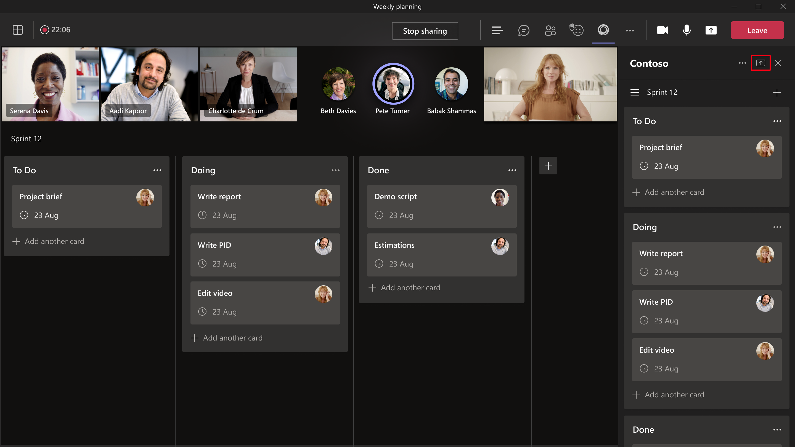

# <a name="enable-and-configure-your-apps-for-teams-meetings"></a>为会议启用和配置Teams应用

每个团队都有不同的通信和协作任务方式。 若要完成这些不同的任务，请Teams会议应用自定义会议。 为会议Teams应用，并在其应用清单内将应用配置为在会议范围内可用。

## <a name="enable-your-app-for-teams-meetings"></a>为应用启用Teams会议

若要为应用启用Teams会议，请更新应用清单，并使用上下文属性确定应用必须显示在何处。

### <a name="update-your-app-manifest"></a>更新应用清单

会议应用功能使用 、 和 数组在应用清单`configurableTabs``scopes`中`context`声明。 范围定义谁可以访问，上下文定义你的应用的可用位置。

> [!NOTE]
>
> * 必须使用清单架构更新 [应用清单](../resources/schema/manifest-schema-dev-preview.md)。
> * 会议中的应用需要范围 `groupchat` 。 范围 `team` 仅适用于频道中的选项卡。

应用程序清单必须包含以下代码段：

```json

"configurableTabs": [
    {
      "configurationUrl": "https://contoso.com/teamstab/configure",
      "canUpdateConfiguration": true,
      "scopes": [
        "team",
        "groupchat"
      ],
      "context":[
        "channelTab",
        "privateChatTab",
        "meetingChatTab",
        "meetingDetailsTab",
        "meetingSidePanel",
        "meetingStage"
     ]
    }
  ]
```

### <a name="context-property"></a>Context 属性

属性 `context` 确定当用户在会议调用应用时必须显示哪些内容，具体取决于用户调用该应用的地方。 `context`选项卡和`scopes`属性使你可以确定应用必须显示在哪里。 或 作用域 `team` 中的 `groupchat` 选项卡可以具有多个上下文。 以下是可以使用所有 `context` 或部分值的属性的值：

|值|说明|
|---|---|
| **channelTab** | 团队频道标题中的选项卡。 |
| **privateChatTab** | 一组用户之间的群聊标题中的选项卡，不在团队或会议上下文中。 |
| **meetingChatTab** | 一组用户之间安排的会议的群聊标题中的选项卡。 可以指定 **meetingChatTab** 或 **meetingDetailsTab** 以确保应用在移动版中工作。 |
| **meetingDetailsTab** | 日历的会议详细信息视图标题中的选项卡。 可以指定 **meetingChatTab** 或 **meetingDetailsTab** 以确保应用在移动版中工作。 |
| **meetingSidePanel** | 通过统一栏和 U 条形图 (打开的会议内) 。 |
| **meetingStage** | 可以将 中的 `meetingSidePanel` 应用共享到会议阶段。 不能在移动设备或 Teams 会议室客户端上使用此应用。 |

为会议启用应用Teams，必须在会议前、会议期间和会议后配置应用。

## <a name="configure-your-app-for-meeting-scenarios"></a>为会议方案配置应用

Teams会议可为组织提供协作体验。 针对不同的会议方案配置应用，并增强会议体验。 现在，您可以确定可以在以下会议方案中采取哪些操作：

* [会议前](#before-a-meeting)
* [会议期间](#during-a-meeting)
* [会议后](#after-a-meeting)

### <a name="before-a-meeting"></a>会议前

在会议之前，用户可以添加选项卡、聊天机器人和消息传递扩展。 具有组织者和演示者角色的用户可以向会议添加选项卡。

若要向会议添加选项卡：

1. 在日历中，选择要添加选项卡的会议。
1. 选择" **详细信息"** 选项卡并选择 .

    

1. 在出现的选项卡库中，选择要添加的应用并按照所需步骤操作。 应用作为选项卡安装。

若要将消息传递扩展添加到会议：

1. 选择位于 &#x25CF;&#x25CF;&#x25CF; 撰写消息区域中的省略号。
1. 选择要添加的应用并按照所需步骤操作。 应用作为消息传递扩展进行安装。

若要将机器人添加到会议：

在会议聊天中，输入密钥 **@** 并选择" **获取机器人"**。

> [!NOTE]
>
> * 内容气泡在用户可以访问的会议聊天中同时发布自适应卡片或卡片。 这可帮助用户最小化会议或Teams应用。
> * 必须使用选项卡 [SSO 确认用户标识](../tabs/how-to/authentication/auth-aad-sso.md)。 身份验证后，应用可以使用 API 检索用户 `GetParticipant` 角色。
> * 根据用户角色，应用能够提供特定于角色的体验。 例如，轮询应用仅允许组织者和演示者创建新的轮询。
> * 可以在会议进行时更改角色分配。 有关详细信息，请参阅[会议Teams角色](https://support.microsoft.com/office/roles-in-a-teams-meeting-c16fa7d0-1666-4dde-8686-0a0bfe16e019)。

### <a name="during-a-meeting"></a>会议期间

在会议期间，可以使用 或 `meetingSidePanel` 会议内通知为应用构建独特体验。

#### <a name="meeting-sidepanel"></a>Meeting SidePanel

使 `meetingSidePanel` 你可以自定义会议体验，以便组织者和演示者拥有一组不同的视图和操作。 在应用清单中，必须添加到 `meetingSidePanel` 上下文数组。 在会议以及所有方案中，应用在宽度为 320 像素的"会议内"选项卡中呈现。 有关详细信息，请参阅 [FrameContext 接口](/javascript/api/@microsoft/teams-js/microsoftteams.framecontext?view=msteams-client-js-latest&preserve-view=true)。

若要使用 `userContext` API 路由请求，请参阅 [Teams SDK](../tabs/how-to/access-teams-context.md#user-context)。 有关详细信息，请参阅Teams[身份验证流](../tabs/how-to/authentication/auth-flow-tab.md)。 选项卡的身份验证流类似于网站的身份验证流。 因此选项卡可以直接使用 OAuth 2.0。 有关详细信息，请参阅 Microsoft 标识平台 [和 OAuth 2.0 授权代码流](/azure/active-directory/develop/v2-oauth2-auth-code-flow)。

当用户在会议视图中时，消息扩展按预期方式工作。 用户可以发布撰写邮件扩展卡。 AppName 会议内是一个工具提示，用于指出会议 U 栏中的应用名称。

> [!NOTE]
> 使用版本 1.7.0 或更高版本[的 Teams SDK](/javascript/api/overview/msteams-client?view=msteams-client-js-latest&preserve-view=true)，因为它之前的版本不支持侧面板。

#### <a name="in-meeting-notification"></a>会议内通知

会议内通知用于在会议期间与与会者联系，并收集会议期间的信息或反馈。 使用 [会议内通知有效负载](API-references.md#send-an-in-meeting-notification) 触发会议内通知。 作为通知请求有效负载的一部分，请包含要显示内容的托管 URL。

会议内通知不得使用任务模块。 会议聊天中不调用任务模块。 外部资源 URL 用于显示会议通知。 可以使用 方法 `submitTask` 在会议聊天中提交数据。

:::image type="content" source="../assets/images/apps-in-meetings/in-meeting-dialogbox.png" alt-text="示例演示如何使用会议内对话框。" border="true":::

#### <a name="shared-meeting-stage"></a>共享会议演示区域

共享会议阶段允许会议参与者实时与应用内容进行交互和协作。 可以通过以下方式将应用共享到协作会议阶段：

* [在客户端中共享整个应用](#share-entire-app-to-stage)以使用"共享到Teams"按钮。
* [共享应用的特定部分，以](#share-specific-parts-of-the-app-to-stage)使用 Teams SDK 中的 API 进行阶段。

##### <a name="share-entire-app-to-stage"></a>将整个应用共享到阶段

参与者可以使用应用侧面板中的"共享到阶段"按钮将整个应用共享到协作会议阶段。



若要共享要阶段的整个应用，必须在应用清单`meetingStage``meetingSidePanel`中将 和 配置为帧上下文。 例如：

```json
"configurableTabs": [
    {
      "configurationUrl": "https://contoso.com/teamstab/configure",
      "canUpdateConfiguration": true,
      "scopes": [
        "groupchat"
      ],
      "context":[
        "meetingSidePanel",
        "meetingStage"
     ]
    }
  ]
```

有关详细信息，请参阅 [应用清单](../resources/schema/manifest-schema-dev-preview.md#configurabletabs)。

##### <a name="share-specific-parts-of-the-app-to-stage"></a>将应用的特定部分共享到阶段

参与者可以使用共享来阶段 API，将应用的特定部分共享到协作会议阶段。 API 在客户端 SDK Teams可用，并且从应用端面板调用。


若要共享要阶段的应用的特定部分，必须在客户端 SDK 库中调用Teams API。 有关详细信息，请参阅 [API 参考](API-references.md)。

如果希望你的应用支持匿名用户，初始调用请求有效负载必须依赖于 `from.id` 对象中的 `from` 请求元数据，而不是 `from.aadObjectId` 请求元数据。 `from.id`是用户 ID，`from.aadObjectId`Azure AD ID。 有关详细信息，请参阅在 [选项卡中使用任务模块](../task-modules-and-cards/task-modules/task-modules-tabs.md) 以及 [创建和发送任务模块](../messaging-extensions/how-to/action-commands/create-task-module.md?tabs=dotnet#the-initial-invoke-request)。

### <a name="after-a-meeting"></a>会议后

会议后和 [会议之前的配置](#before-a-meeting) 相同。

## <a name="code-sample"></a>代码示例

|示例名称 | Description | C# | Node.js |
|----------------|-----------------|--------------|----------------|
| 会议应用程序 | 演示如何使用会议令牌生成器应用请求令牌。 令牌按顺序生成，以便每个参与者都有机会参与会议。 令牌在 scrum 会议和 Q&A 会话等情况下很有用。 | [View](https://github.com/OfficeDev/Microsoft-Teams-Samples/tree/main/samples/meetings-token-app/csharp) | [View](https://github.com/OfficeDev/Microsoft-Teams-Samples/tree/main/samples/meetings-token-app/nodejs) |
|会议阶段示例 | 在会议阶段显示选项卡以用于协作的示例应用 | [View](https://github.com/OfficeDev/Microsoft-Teams-Samples/tree/main/samples/meetings-stage-view/csharp) | [View](https://github.com/OfficeDev/Microsoft-Teams-Samples/tree/main/samples/meetings-stage-view/nodejs) |
|会议侧面板 | 显示如何在会议侧面板中添加议程的示例应用 | [View](https://github.com/OfficeDev/Microsoft-Teams-Samples/tree/main/samples/meetings-sidepanel/csharp) |-|

## <a name="step-by-step-guides"></a>分步指南

* 按照[分步指南在](../sbs-meeting-token-generator.yml)会议结束后生成会议Teams令牌。
* 按照[分步指南在](../sbs-meetings-sidepanel.yml)会议结束后生成Teams窗格。
* 按照[分步指南在](../sbs-meetings-stage-view.yml)会议结束后生成Teams视图。
* 按照[分步指南在](../sbs-meeting-content-bubble.yml)会议生成会议内容Teams气泡。

## <a name="next-step"></a>后续步骤

> [!div class="nextstepaction"]
> [会议应用 API 参考](API-references.md)

## <a name="see-also"></a>另请参阅

* [会议内对话设计指南](design/designing-apps-in-meetings.md#use-an-in-meeting-dialog)
* [Teams选项卡的身份验证流](../tabs/how-to/authentication/auth-flow-tab.md)
* [共享会议阶段体验设计指南](~/apps-in-teams-meetings/design/designing-apps-in-meetings.md)
* [通过 Microsoft Graph 将应用添加到会议](/graph/api/chat-post-installedapps?view=graph-rest-1.0&tabs=http&preserve-view=true)
