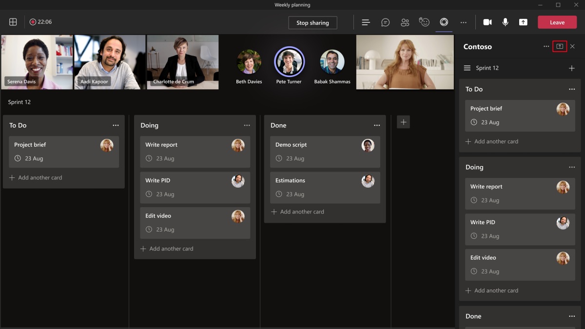

# <a name="enable-and-configure-your-apps-for-teams-meetings"></a>为Teams会议启用和配置应用

每个团队都有不同的方式来传达和协作任务。 若要实现这些不同的任务，请使用会议应用自定义Teams。 为Teams会议启用应用，并将应用配置为在其应用清单的会议范围内可用。

## <a name="prerequisites"></a>先决条件

借助Teams会议的应用，可以跨会议生命周期扩展应用的功能。 在使用应用Teams会议之前，必须满足以下先决条件：

* 了解如何开发Teams应用。 有关如何开发Teams应用的详细信息，请[参阅Teams应用开发](../overview.md)。

* 使用支持组聊天范围内可配置选项卡的应用。 有关详细信息，请参阅 [组聊天范围](../resources/schema/manifest-schema.md#configurabletabs) 并 [生成组选项卡](../build-your-first-app/build-channel-tab.md)。

* 遵守会议前和会后方案的常规[Teams选项卡设计准则](../tabs/design/tabs.md)。 有关会议期间的体验，请参阅 [会议内选项卡设计指南](../apps-in-teams-meetings/design/designing-apps-in-meetings.md#use-an-in-meeting-tab) 和 [会议内对话框设计指南](../apps-in-teams-meetings/design/designing-apps-in-meetings.md#use-an-in-meeting-dialog)。

* 若要使应用实时更新，它必须基于会议中的事件活动进行最新更新。 这些事件可以在会议内对话框中以及整个会议生命周期中的其他阶段内。 有关会议内对话框，请参阅`completionBotId`[会议内通知有效负载](API-references.md#send-an-in-meeting-notification)中的参数。

## <a name="enable-your-app-for-teams-meetings"></a>为Teams会议启用应用

若要为应用启用Teams会议，请更新应用清单并使用上下文属性来确定应用必须显示的位置。

### <a name="update-your-app-manifest"></a>更新应用清单

会议应用功能使用`configurableTabs``scopes`数组和`context`数组在应用清单中声明。 范围定义谁可以访问，上下文定义应用的可用位置。

> [!NOTE]
>
> * 必须使用 [清单架构](../resources/schema/manifest-schema-dev-preview.md)更新应用清单。
> * 会议中的应用需要 `groupchat` 作用域。 该 `team` 范围仅适用于频道中的选项卡。

应用清单必须包含以下代码片段：

```json

"configurableTabs": [
    {
      "configurationUrl": "https://contoso.com/teamstab/configure",
      "canUpdateConfiguration": true,
      "scopes": [
        "team",
        "groupchat"
      ],
      "context":[
        "channelTab",
        "privateChatTab",
        "meetingChatTab",
        "meetingDetailsTab",
        "meetingSidePanel",
        "meetingStage"
     ]
    }
  ]
```

### <a name="context-property"></a>Context 属性

该 `context` 属性确定用户在会议中调用应用时必须显示的内容，具体取决于用户调用应用的位置。 使用选项卡 `context` 和 `scopes` 属性可以确定应用必须显示的位置。 或`groupchat`范围中的`team`选项卡可以有多个上下文。

支持在 `groupchat` 会议前和会后聊天中启用应用的范围。 使用会议前应用体验，可以查找和添加会议应用并执行会议前任务。 使用会后应用体验，可以查看会议结果，例如投票调查结果或费用。

 下面是 `context` 可用于所有值或部分值的属性的值：

|值|说明|
|---|---|
| **channelTab** | 团队频道标题中的选项卡。 |
| **privateChatTab** | 一组用户之间的群聊标头中的选项卡，而不是在团队或会议的上下文中。 |
| **meetingChatTab** | 计划会议的一组用户之间群聊标题中的选项卡。 可以指定 **meetingChatTab** 或 **meetingDetailsTab** ，以确保应用在移动设备中正常工作。 |
| **meetingDetailsTab** | 日历的会议详细信息视图标题中的选项卡。 可以指定 **meetingChatTab** 或 **meetingDetailsTab** ，以确保应用在移动设备中正常工作。 |
| **meetingSidePanel** | 会议内面板通过统一栏 (U 条) 打开。 |
| **meetingStage** | 可以将应用共享 `meetingSidePanel` 到会议阶段。 不能在移动设备或 Teams 会议室客户端上使用此应用。 |

为Teams会议启用应用后，必须在会议前、会议期间和会议后配置应用。

## <a name="configure-your-app-for-meeting-scenarios"></a>为会议方案配置应用

Teams会议为组织提供协作体验。 为不同的会议方案配置应用，并增强会议体验。 现在，可以确定可在以下会议方案中执行哪些操作：

* [会议前](#before-a-meeting)
* [会议期间](#during-a-meeting)
* [会议后](#after-a-meeting)

### <a name="before-a-meeting"></a>会议前

在会议之前，用户可以添加选项卡、机器人和消息扩展。 具有组织者和演示者角色的用户可以向会议添加选项卡。

若要将选项卡添加到会议，

1. 在日历中，选择要向其添加选项卡的会议。
1. 选择“ **详细信息”** 选项卡并选择 .

    

1. 在显示的选项卡库中，选择要添加的应用，并根据需要执行步骤。 应用作为选项卡安装。

向会议添加消息扩展插件：

1. 选择位于聊天的撰写消息区域中的省略号 &#x25CF;&#x25CF;&#x25CF; 。
1. 选择要添加的应用，并根据需要执行步骤。 应用作为消息扩展安装。

若要将机器人添加到会议，请执行以下操作：

在会议聊天中 **@** ，输入密钥并选择 **“获取机器人**”。

> [!NOTE]
> * 会议内对话框在会议中显示对话框，并在会议聊天中同时发布用户可以访问的自适应卡片。 会议聊天中的自适应卡片可帮助用户在参加会议时或Teams应用是否最小化。
> * 必须使用 [Tabs SSO](../tabs/how-to/authentication/auth-aad-sso.md) 确认用户标识。 身份验证后，应用可以使用 `GetParticipant` API 检索用户角色。
> * 根据用户角色，应用能够提供特定于角色的体验。 例如，轮询应用仅允许组织者和演示者创建新的轮询。
> * 当会议正在进行时，可以更改角色分配。 有关详细信息，请参阅[Teams会议中的角色](https://support.microsoft.com/office/roles-in-a-teams-meeting-c16fa7d0-1666-4dde-8686-0a0bfe16e019)。

### <a name="during-a-meeting"></a>会议期间

在会议期间，可以使用 `meetingSidePanel` 会议或会议内通知为应用构建独特的体验。

#### <a name="meeting-sidepanel"></a>Meeting SidePanel

通过 `meetingSidePanel` 这些功能，你可以自定义会议中的体验，使组织者和演示者能够具有不同的观点和操作集。 在应用清单中，必须添加 `meetingSidePanel` 到上下文数组。 在会议和所有情况下，应用在宽度为 320 像素的会议内选项卡中呈现。 有关详细信息，请参阅 [FrameContext 接口](/javascript/api/@microsoft/teams-js/microsoftteams.framecontext?view=msteams-client-js-latest&preserve-view=true)。

若要使用 `userContext` API 路由请求，请[参阅Teams SDK](../tabs/how-to/access-teams-context.md#user-context)。 有关详细信息，请参阅[选项卡Teams身份验证流](../tabs/how-to/authentication/auth-flow-tab.md)。 选项卡的身份验证流类似于网站的身份验证流。 因此，选项卡可以直接使用 OAuth 2.0。 有关详细信息，请参阅 [Microsoft 标识平台 和 OAuth 2.0 授权代码流](/azure/active-directory/develop/v2-oauth2-auth-code-flow)。

当用户处于会议内视图中时，消息扩展按预期工作。 用户可以发布撰写消息扩展卡。 会议中的 AppName 是一个工具提示，用于在会议 U 栏中声明应用名称。

> [!NOTE]
> 使用版本 1.7.0 或更高版本[的 Teams SDK](/javascript/api/overview/msteams-client?view=msteams-client-js-latest&preserve-view=true)，因为之前的版本不支持侧面板。

#### <a name="in-meeting-notification"></a>会议内通知

会议内通知用于在会议期间与与会者接触，并在会议期间收集信息或反馈。 使用 [会议内通知有效负载](API-references.md#send-an-in-meeting-notification) 触发会议内通知。 作为通知请求有效负载的一部分，包括要显示的内容托管的 URL。

会议内通知不得使用任务模块。 不会在会议聊天中调用任务模块。 外部资源 URL 用于显示会议内通知。 可以使用该 `submitTask` 方法在会议聊天中提交数据。

:::image type="content" source="../assets/images/apps-in-meetings/in-meeting-dialogbox.png" alt-text="示例演示如何使用会议内对话框。" border="true":::

#### <a name="shared-meeting-stage"></a>共享会议演示区域

共享会议阶段允许会议参与者实时与应用内容进行交互和协作。 可以通过以下方式将应用共享到协作会议阶段：

* [共享整个应用，以](#share-entire-app-to-stage)在 Teams客户端中使用共享暂存按钮。
* [共享应用的特定部分，以便](#share-specific-parts-of-the-app-to-stage)在Teams客户端 SDK 中使用 API 进行暂存。

##### <a name="share-entire-app-to-stage"></a>将整个应用共享到阶段

参与者可以使用共享将整个应用共享到协作会议阶段，以从应用端面板暂存按钮。



若要将整个应用共享到阶段，必须在应用清单中配置 `meetingStage` 并 `meetingSidePanel` 作为帧上下文。 例如：

```json
"configurableTabs": [
    {
      "configurationUrl": "https://contoso.com/teamstab/configure",
      "canUpdateConfiguration": true,
      "scopes": [
        "groupchat"
      ],
      "context":[
        "meetingSidePanel",
        "meetingStage"
     ]
    }
  ]
```

有关详细信息，请参阅 [应用清单](../resources/schema/manifest-schema-dev-preview.md#configurabletabs)。

##### <a name="share-specific-parts-of-the-app-to-stage"></a>共享应用的特定部分以暂存

参与者可以通过使用共享来暂存 API，将应用的特定部分共享到协作会议阶段。 API 在Teams客户端 SDK 中可用，并从应用端面板调用。


若要共享应用的特定部分，必须调用Teams客户端 SDK 库中的相关 API。 有关详细信息，请参阅 [API 参考](API-references.md)。

> [!NOTE]
> * 若要共享要暂存的应用的特定部分，请使用Teams清单版本 1.12 或更高版本。
> * 仅Teams桌面客户端支持共享要暂存的应用的特定部分。

### <a name="after-a-meeting"></a>会议后

会后和 [会前](#before-a-meeting) 配置相同。

## <a name="code-sample"></a>代码示例

|示例名称 | Description | C# | Node.js |
|----------------|-----------------|--------------|----------------|
| 会议应用 | 演示如何使用会议令牌生成器应用请求令牌。 令牌按顺序生成，以便每个参与者都有公平的机会参与会议。 在 Scrum 会议和 Q&A 会话等情况下，令牌非常有用。 | [View](https://github.com/OfficeDev/Microsoft-Teams-Samples/tree/main/samples/meetings-token-app/csharp) | [View](https://github.com/OfficeDev/Microsoft-Teams-Samples/tree/main/samples/meetings-token-app/nodejs) |
|会议阶段示例 | 示例应用，用于在会议阶段显示用于协作的选项卡 | [View](https://github.com/OfficeDev/Microsoft-Teams-Samples/tree/main/samples/meetings-stage-view/csharp) | [View](https://github.com/OfficeDev/Microsoft-Teams-Samples/tree/main/samples/meetings-stage-view/nodejs) |
|会议侧面板 | 演示如何在会议侧面板中添加议程的示例应用 | [View](https://github.com/OfficeDev/Microsoft-Teams-Samples/tree/main/samples/meetings-sidepanel/csharp) |-|

## <a name="step-by-step-guides"></a>分步指南

* 按照[分步指南](../sbs-meeting-token-generator.yml)在Teams会议中生成会议令牌。
* 按照[分步指南](../sbs-meetings-sidepanel.yml)在Teams会议中生成会议侧窗格。
* 按照[分步指南](../sbs-meetings-stage-view.yml)在Teams会议中共享会议阶段视图。
* 按照[分步指南](../sbs-meeting-content-bubble.yml)在Teams会议中生成会议内容气泡。

## <a name="next-step"></a>后续步骤

> [!div class="nextstepaction"]
> [会议应用 API 参考](API-references.md)

## <a name="see-also"></a>另请参阅

* [会议内对话框设计指南](design/designing-apps-in-meetings.md#use-an-in-meeting-dialog)
* [选项卡Teams身份验证流](../tabs/how-to/authentication/auth-flow-tab.md)
* [共享会议阶段体验设计指南](~/apps-in-teams-meetings/design/designing-apps-in-meetings.md)
* [通过 Microsoft Graph 将应用添加到会议](/graph/api/chat-post-installedapps?view=graph-rest-1.0&tabs=http&preserve-view=true)
