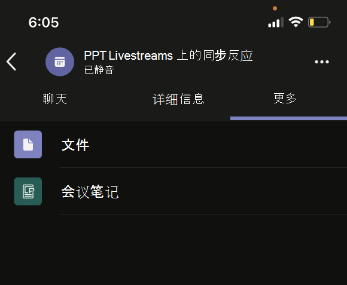
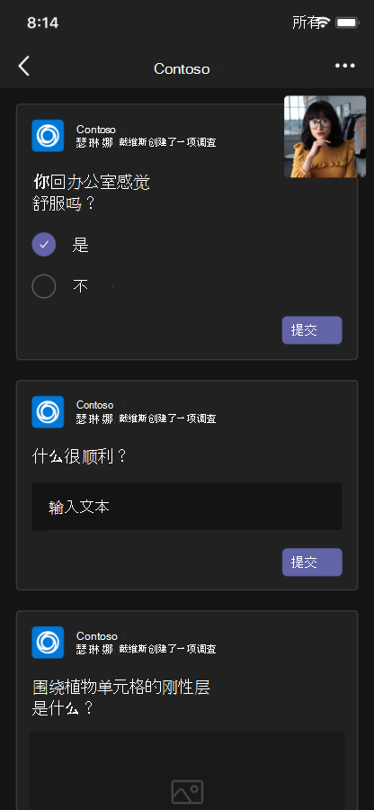

# 统一会议应用

Teams统一会议应用基于以下概念：

* 会议生命周期具有不同的阶段: 会议前、会议内和会议后。  
* 会议中有三个不同的参与者角色: 组织者、演示者和与会者。 有关详细信息，请参阅 [Teams 会议中的角色](https://support.microsoft.com/office/roles-in-a-teams-meeting-c16fa7d0-1666-4dde-8686-0a0bfe16e019)。  
* 会议中有各种 [用户类型](/microsoftteams/non-standard-users#:~:text=An%20anonymous%20user%20is%20a,their%20Microsoft%20or%20organization's%20account.) ：租户内、 [来宾](/microsoftteams/guest-access)、 [联合](/microsoftteams/manage-external-access)用户和匿名用户。

本文介绍有关会议生命周期以及如何集成选项卡、机器人和消息扩展的信息。 它标识不同的参与者角色和用户类型。

## 会议生命周期

会议生命周期包括会议前、会议内和会议后应用体验。 可以在会议生命周期的每个阶段集成选项卡、机器人和邮件扩展。

> [!NOTE]
> Web 客户端支持会议扩展，例如机器人、卡片、消息扩展和消息操作。 但是，当前不完全支持托管体验，例如选项卡、内容气泡和共享到阶段。

### 将选项卡集成到会议生命周期

选项卡允许团队成员访问会议中特定空间内的服务和内容。 团队直接使用选项卡，并就选项卡中可用的工具和数据进行对话。 在Teams会议中，可以通过选择添加选项卡 ，然后选择要安装的应用。

> [!IMPORTANT]
> 如果已将选项卡与会议集成，则应用必须遵循选项[卡Teams单一登录 (SSO) 身份验证流](../tabs/how-to/authentication/tab-sso-overview.md)。

> [!NOTE]
>
> * 私人计划的会议仅支持应用。
> * Teams Web 客户端不支持为Teams会议扩展选项卡应用添加应用选项。

#### 会议前应用体验

通过会议前应用体验，你可以查找和添加会议应用。 你还可以执行会议前任务，例如发起投票以调查会议参与者。

若要将选项卡添加到现有会议，请执行以下操作：

1. 在日历中，选择要向其添加选项卡的会议。
1. 选择“**详细信息**”选项卡并选择 . 将显示选项卡库。

    :::image type="content" source="~/assets/images/apps-in-meetings/Pre-Meeting-002.png" alt-text="会议前应用体验":::

1. 在选项卡库中，选择要添加的应用，并根据需要执行步骤。 安装应用选项卡。

   > [!NOTE]
   >
   > * 还可以使用“会议 **聊天** ”选项卡将选项卡添加到现有会议。
   > * 如果有 10 次以上的投票或调查，选项卡布局必须处于有组织的状态。

# [桌面设备](#tab/desktop)

:::image type="content" source="~/assets/images/apps-in-meetings/PreMeetingTab.png" alt-text="会议期间的选项卡":::

# [移动设备](#tab/mobile)

将选项卡添加到移动设备上的现有会议后，可以在会议详细信息的 **“更多** ”部分下看到会议前体验中的相同应用。

  

---

#### 会议内应用体验

借助会议内应用体验，可以在会议期间通过使用应用和会议中的对话框来吸引与会者。 会议应用作为会议内选项卡托管在会议窗口的工具栏上。使用会议内对话框为会议参与者展示可操作的内容。 有关详细信息，请参阅[为Teams会议启用和配置应用](enable-and-configure-your-app-for-teams-meetings.md)。

对于移动设备，会议应用可从 **会议** 中 &#x25CF;&#x25CF;&#x25CF; 的应用>省略号。 选择 **“应用** ”以查看会议中可用的所有应用。

在会议期间使用选项卡：

1. 转到Teams。
1. 在日历中，选择要在其中使用选项卡的会议。
1. 进入会议后，从聊天窗口的工具栏中选择所需的应用。
    应用在侧面板或会议内对话框的Teams会议中可见。
1. 在会议中对话框中，输入响应作为反馈。

# [桌面设备](#tab/desktop)

:::image type="content" source="~/assets/images/apps-in-meetings/desktop-in-meeting-dialog-view.png" alt-text="桌面视图":::

# [移动设备](#tab/mobile)

输入会议并从桌面或 Web 添加应用后，应用在“**应用**”部分下的移动Teams会议中可见。 选择 **“应用** ”以显示应用列表。 用户可以将任何应用作为应用的会议内侧面板启动。

会内对话框随即显示，可在其中输入响应作为反馈。

> [!NOTE]
> 无需更改应用清单即可在移动设备上工作。

---

> [!NOTE]
>
> * 应用可以利用Teams客户端 SDK 来访问`meetingId``userMri`，并`frameContext`适当地呈现体验。
> * 如果会议内对话框成功呈现，则会发送成功下载结果的通知。
> * 应用清单指定要在其中显示应用的位置。 这可以通过在清单中指定上下文字段来完成。 它也是共享会议阶段体验的一部分，具体取决于指定 [的设计准则](~\apps-in-teams-meetings\design\designing-apps-in-meetings.md)。
> * 匿名用户和Teams Web 客户端不支持会议阶段。

下图演示了会议中侧面板：

# [桌面设备](#tab/desktop)

# [移动设备](#tab/mobile)

---

下表描述了应用在经过验证且未验证时的行为：

|应用功能 | 已验证应用 | 未验证应用 |
|---|---|---|
| 会议扩展性 | 应用将显示在会议中。 | 该应用不会显示在移动客户端的会议中。 |

有关详细信息，请参阅 [存储验证指南](../concepts/deploy-and-publish/appsource/prepare/teams-store-validation-guidelines.md)。

#### 会后应用体验

借帖子会议应用体验，可以查看会议结果，例如轮询调查结果或反馈。 选择  若要添加选项卡，请获取会议笔记，并查看组织者和与会者必须对其采取行动的结果。

下图显示了 **Contoso** 选项卡，其中包含投票结果和与会者收到的反馈：

# [桌面设备](#tab/desktop)

:::image type="content" source="~/assets/images/apps-in-meetings/post.png" alt-text="包含结果的 Contoso 选项卡":::

# [移动设备](#tab/mobile)

:::image type="content" source="~/assets/images/apps-in-meetings/mobilepremeeting.png" alt-text="会议后应用体验":::

---

> [!NOTE]
> 当有超过 10 次投票或调查时，必须组织选项卡布局。

### 将机器人集成到会议生命周期

在群组聊天范围内启用的机器人开始在会议中运行。 若要实现机器人，请先[生成机器人](../build-your-first-app/build-bot.md)，然后继续[为Teams会议创建应用](../apps-in-teams-meetings/API-references.md#meeting-apps-api-references)。

### 将消息扩展插件集成到会议生命周期

若要实现消息扩展，请从[生成消息扩展](../messaging-extensions/how-to/create-messaging-extension.md)开始，然后继续[为Teams会议创建应用](../apps-in-teams-meetings/API-references.md#meeting-apps-api-references)。

通过Teams统一会议应用，可以根据会议中的参与者角色来设计应用。

## 会议中的参与者角色

:::image type="content" source="~/assets/images/apps-in-meetings/participant-roles.png" alt-text="会议中的参与者角色":::

默认参与者设置由组织的 IT 管理员确定。 以下是会议中的参与者角色：

* **组织者**：组织者安排会议、设置会议选项、分配会议角色和启动会议。 拥有Microsoft 365帐户和Teams许可证的用户只能是组织者，并控制与会者的权限。 会议组织者可以更改特定会议的设置。 组织者可以在 **会议选项** 网页上进行这些更改。

* **演示** 者：演示者具有具有排除项的组织者的相同功能。 演示者无法从会话中删除组织者或修改会话的会议选项。 默认情况下，加入会议的参与者具有演示者角色。

* **与会者**：与会者是受邀参加会议的用户。 与会者在会议期间的功能有限，例如：
  * 他们可以与其他会议成员交互，但无法管理任何会议设置或共享内容。  
  * 他们可以在会议阶段Teams桌面客户端中查看或与选项卡应用交互，而无需安装应用，也无需任何应用权利。 他们无法在Teams Web 客户端的会议阶段查看或与应用交互。
  * 在没有任何应用权利的情况下，他们无法在侧面板中查看应用或与应用交互。
  * 他们无权充当演示者。
  * 如果与会者以匿名用户身份加入，则他们无法在会议阶段Teams Web 客户端和桌面客户端中查看或与选项卡应用交互。

> [!NOTE]
> 只有组织者或演示者才能添加、删除或卸载应用。

有关详细信息，请参阅 [Teams 会议中的角色](https://support.microsoft.com/office/roles-in-a-teams-meeting-c16fa7d0-1666-4dde-8686-0a0bfe16e019)。

根据会议中的参与者角色设计应用后，可以识别会议的每个用户类型，并选择他们可以访问的内容。

## 会议中的用户类型

用户类型（例如组织者、演示者或与会者）可以在 [会议中执行其中一个参与者角色](#participant-roles-in-a-meeting)。

> [!NOTE]
> **getParticipantRole** API 中不包括用户类型。

以下列表详细介绍了各种用户类型及其辅助功能和性能：

* **租户内**：租户内用户属于组织，在租户的 Azure AD) Microsoft Azure Active Directory (中具有凭据。 他们是全职、现场或远程员工。 租户内用户可以是组织者、演示者或与会者。
* **来宾：来宾** 是受邀访问组织租户中Teams或其他资源的另一组织的参与者。 来宾将添加到组织的 Azure AD，并具有与本机团队成员相同的Teams功能。 他们有权访问团队聊天、会议和文件。 来宾可以是组织者、演示者或与会者。 有关详细信息，请参阅[Teams中的来宾访问权限](/microsoftteams/guest-access)。
* **联合用户或外部** 用户是另一个组织中受邀加入会议的外部Teams用户。 联合用户具有与联合合作伙伴的有效凭据，并经Teams授权。 他们无权访问你的团队或组织中的其他共享资源。 来宾访问是外部用户有权访问团队和频道的更好选择。 有关详细信息，请参阅[Teams中管理外部访问权限](/microsoftteams/manage-external-access)。

    > [!NOTE]
    > Teams用户在托管会议或与其他组织聊天时可以添加应用。 当用户加入其他组织托管的会议或聊天时，用户可以使用外部用户共享的应用。 托管用户组织的数据策略以及该用户组织共享的第三方应用的数据共享做法将生效。

    > [!IMPORTANT]
    > 目前，第三方应用在政府社区云 (GCC) 中可用，但不适用于 GCC-High 和国防部 (DOD)。 GCC 默认关闭第三方应用。 若要为 GCC 启用第三方应用，请参阅[管理应用权限策略](/microsoftteams/teams-app-permission-policies)和[管理应用](/microsoftteams/manage-apps)。

* **匿名**：匿名用户没有 Azure AD 标识，也不与租户联合。 匿名参与者与外部用户类似，但他们的身份不会显示在会议中。 匿名用户无法访问会议窗口和会议阶段中的应用。 匿名用户不能是组织者，但可以是演示者或与会者。

    > [!NOTE]
    > 匿名用户继承全局默认用户级应用权限策略。 有关详细信息，请参阅 [“管理应用](/microsoftteams/non-standard-users#anonymous-user-in-meetings-access)”。

来宾或匿名用户无法添加、删除或卸载应用。

下表提供了用户类型，并列出了每个用户可以访问的功能：

| 用户类型 | 选项卡 | 机器人 | 消息扩展 | 自适应卡 | 任务模块 | 会议内的对话框 | 会议阶段 |
| :-- | :-- | :-- | :-- | :-- | :-- | :-- | :-- |
| 匿名用户 | 不可用 | 不可用 | 不可用 | 允许在会议聊天中进行交互。 | 允许从自适应卡片在会议聊天中进行交互。 | 不可用 | 不可用 |
| 来宾，租户 Azure AD 的一部分 | 允许交互。 不允许创建、更新和删除。 | 不可用 | 不可用 | 允许在会议聊天中进行交互。 | 允许从自适应卡片在会议聊天中进行交互。 | 可用 | 只能在会议舞台上启动、查看和与应用交互Teams桌面客户端 |
| 联合用户，有关详细信息，请参阅 [非标准用户](/microsoftteams/non-standard-users)。 | 允许交互。 不允许创建、更新和删除。 | 允许交互。 不允许获取、更新和删除。 | 不可用 | 允许在会议聊天中进行交互。 | 允许从自适应卡片在会议聊天中进行交互。 | 不可用 | 只能在Teams桌面客户端上启动、查看和与会议舞台上的应用交互。 |

## 后续步骤

> [!div class="nextstepaction"]
> [为 Teams 会议启用和配置应用](enable-and-configure-your-app-for-teams-meetings.md)

## 另请参阅

* [Tab](../tabs/what-are-tabs.md#understand-how-tabs-work)
* [Bot](../bots/what-are-bots.md)
* [邮件扩展](../messaging-extensions/what-are-messaging-extensions.md)
* [设计应用](../apps-in-teams-meetings/design/designing-apps-in-meetings.md)
