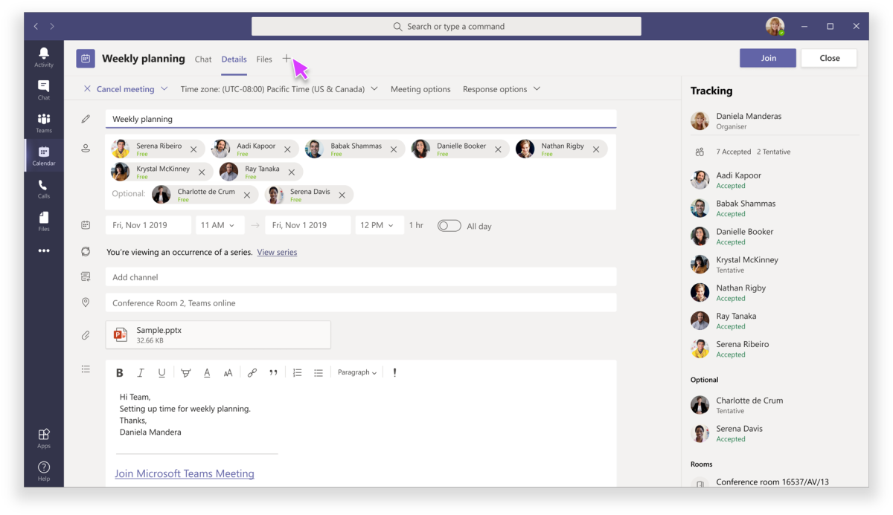
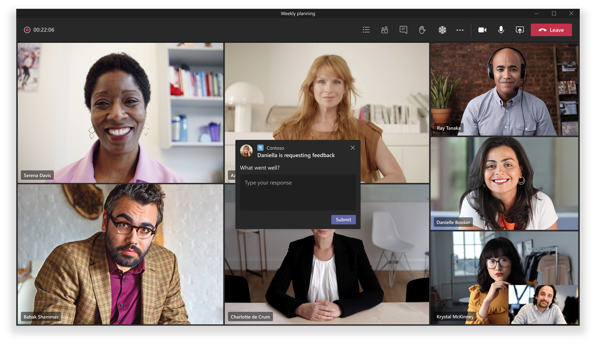
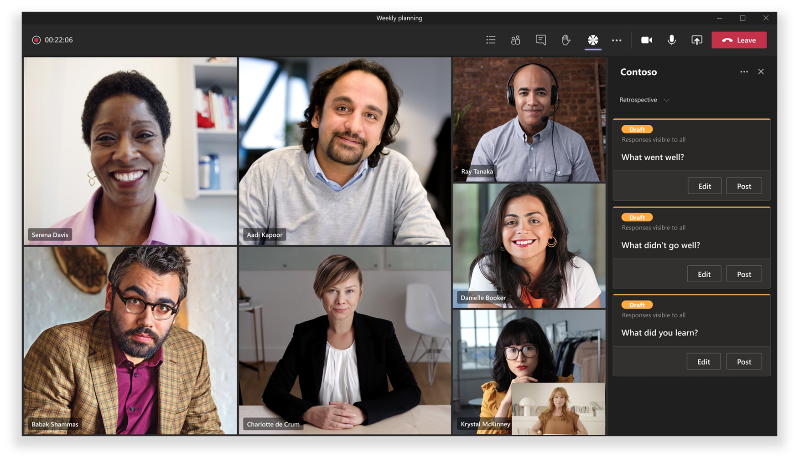

# 团队会议中的应用Apps in Teams meetings

会议是团队中的工作效率的关键。Meetings are key to productivity in Teams. 它们在包含和活跃的论坛中启用协作、合作、有通知的通信和共享反馈。They enable collaboration, partnership, informed communication, and shared feedback in an inclusive and active forum. 作为开发人员，您可以创建 [可配置的选项卡](../tabs/what-are-tabs.md#how-do-tabs-work)、 [bot](../bots/what-are-bots.md)和 [邮件扩展](../messaging-extensions/what-are-messaging-extensions.md) 应用程序，以增强和丰富团队会议体验。As a developer, you can create [configurable tab](../tabs/what-are-tabs.md#how-do-tabs-work), [bot](../bots/what-are-bots.md), and [message extension](../messaging-extensions/what-are-messaging-extensions.md) applications to enhance and enrich a Teams meeting experience. 会议用户可以通过选项卡库访问应用程序，以启用相关方案，如预暂存看板面板、启动会议内操作对话框或创建会议后轮询。Meeting users can access apps, via the tab gallery, to enable relevant scenarios such as pre-staging a Kanban board, launching an in-meeting actionable dialog, or creating a post-meeting poll. 您的会议应用程序可以根据与会者的状态为会议生命周期的每个阶段提供用户体验。Your meeting app can deliver a user experience for each stage of the meeting lifecycle based upon attendee status.

团队的会议应用可扩展性以三个概念为中心：Teams’ meeting app extensibility centers on three concepts:

✔ **会议生命周期** —在会议时间范围之前、之后和之后。✔ **Meeting lifecycle** — before, during, and after meeting time frame.  
✔ **参与者角色** （会议组织者、演示者或与会者）。✔ **Participant role** — meeting organizer, presenter, or attendee.  
✔ **用户类型** —租户、来宾、联合或匿名团队用户。✔ **User type** — in-tenant, guest, federated, or anonymous Teams user.

<!-- markdownlint-disable MD001 -->
### 会议生命周期方案Meeting lifecycle scenarios

## 选项卡Tabs

> [!IMPORTANT]
> 与所有选项卡应用程序一样，您的应用程序将需要遵循针对选项卡的团队 [SSO 身份验证流](../tabs/how-to/authentication/auth-aad-sso.md) 。As with all tab applications, Your app will need to follow the Teams [SSO authentication flow](../tabs/how-to/authentication/auth-aad-sso.md) for tabs.

> [!NOTE]
> 移动客户端仅支持准备会议和投递会议表面中的选项卡。Mobile clients support Tabs only in Pre and Post Meeting Surfaces. 在会议中 (会议中的对话和面板) 的会议体验将很快可用The In-meeting experiences (in-meeting dialog and panel) on mobile will be available soon

### 预会议应用程序体验Pre-meeting app experience

**会议前体验：****Pre-meeting experience:**

**"会议前" 选项卡：****Pre-meeting tab:**

✔具有独特权限用户可以通过选项卡库通过以下两种方式向会议添加应用程序：✔ Permissioned users can add apps to a meeting via the tab gallery in two ways:

&emsp;&emsp; 通过 "团队计划" 窗体上的 " **详细信息** " 选项卡&#9679;。&emsp;&emsp;&#9679; Via the **Details** tab on the Teams scheduling form.

&emsp;&emsp; 通过现有会议中的 "会议 **聊天** " 选项卡&#9679;。&emsp;&emsp;&#9679;  Via the meeting **Chat** tab in an existing meeting.   

✔选项卡应用程序可在会议 **详细信息** 和 **聊天** 页面中使用加号图标 (➕) "按钮。 |✔ Tab apps are accessible in meetings **Details** and **Chats** pages using a plus icon (➕) button.|

如果有10个以上的轮询或调查，✔选项卡布局应处于已组织状态。✔  Tab layout should be in an organized state if there are more than ten polls or surveys.

### 会议中的应用程序体验In-meeting app experience

✔会议应用程序将托管在聊天窗口顶部的上方栏中，并可通过 "会议" 选项卡中的 "会议" 选项卡体验。当用户通过选项卡库将选项卡添加到会议时，将显示 **会议体验期间** 的应用程序。✔ Meeting apps will be hosted in the top upper bar of the chat window and as in-meeting tab experience via the in-meeting tab. When users add a tab to a meeting through the tab gallery, apps that are **during meeting** experiences will be surfaced.

✔具有独特权限用户可以在会议中添加应用程序。✔ Permissioned users can add apps while in the meeting.

✔在会议上下文中加载时，应用程序将能够利用团队客户端 SDK 访问 `meetingId` 、 `userMri` 和，并 `frameContext` 适当地呈现体验。✔ When loaded in the context of a meeting, apps will be able to leverage the Teams Client SDK to access the `meetingId`, `userMri`, and `frameContext` to appropriately render the experience.

✔导出调查结果或轮询的结果应通知用户声明 "结果已成功下载"。✔ Exporting a result of a survey or polls should notify the users stating, ‘results successfully downloaded’.

✔要在两个区域中的团队会议中显示的应用程序：✔ For an app to be visible in a Teams meeting in two areas:

&emsp;&emsp;&#9679; **侧面板**。&emsp;&emsp;&#9679; **Side panel**.  

> [!NOTE]
> 如果您的 _应用程序清单_ 指定选项卡是 [针对侧面板优化](create-apps-for-teams-meetings.md#in-meeting)的，则它将显示在该面板中。If your _app manifest_ specifies that your tab is [optimized for side panel](create-apps-for-teams-meetings.md#in-meeting), that is where it will be displayed. 它也可以是共享任务栏体验的一部分，根据指定的设计准则。It can also be part of a share-tray experience, subject to specified design guidelines.

&emsp;&emsp;&#9679; **会议中的对话框**。&emsp;&emsp;&#9679; **In-meeting dialog**. 使用 "会议内" 对话框展示会议参与者的可操作内容。Use the in-meeting dialog to showcase actionable content for meeting participants. *请参阅*[创建适用于团队的应用程序会议](create-apps-for-teams-meetings.md)。*See* [Create Apps for Teams meetings](create-apps-for-teams-meetings.md).

**会议体验：****In-meeting experience:**

**用户的会议中的可操作对话框：****In-meeting actionable dialog for users:**

### 会议后应用程序体验Post-meeting app experience

**会议后体验：****Post-meeting experience:**

✔后会议应用程序方案与当前的会议后体验类似，其中增加了包含在表面中存在的选项卡的好处。✔ The post-meeting app scenario is similar to the current post-meeting experience with the added benefit of having tabs that exist within the surface. 

✔具有独特权限用户可以通过 "团队计划" 窗体上的 " **详细信息** " 选项卡和现有会议中的 "会议 **聊天** " 选项卡，将选项卡库中的应用程序添加到会议。✔ Permissioned users can add apps from the tab gallery to a meeting via the **Details** tab on the Teams scheduling form and the meeting **Chat** tab in an existing meeting.

如果有10个以上的轮询或调查，✔选项卡布局应处于已组织状态。✔  Tab layout should be in an organized state if there are more than ten polls or surveys.

### 机器人Bots

对于机器人实施，请参阅 [团队会议文档中的 bot](../bots/how-to/create-a-bot-for-teams.md#bots-in-teams-meetings) 。For bot implementation, please see our [Bots in Teams meetings](../bots/how-to/create-a-bot-for-teams.md#bots-in-teams-meetings) documentation.

### 消息扩展Messaging Extensions

有关邮件扩展实现，请参阅我们 [的工作组会议文档中的邮件扩展](../messaging-extensions/how-to/create-messaging-extension.md#messaging-extensions-in-teams-meetings) 。For messaging extension implementation, please see our [Messaging extensions in Teams meetings](../messaging-extensions/how-to/create-messaging-extension.md#messaging-extensions-in-teams-meetings) documentation.

## 会议中的参与者角色和用户类型Participant roles and user types in a meeting

### 参与者角色Participant roles

您可以使用特定于参与者的授权来设计您的应用程序。You can design your app with participant-specific authorization. 例如，也许只有组织者和/或演示者可以在会议中创建轮询。For example, perhaps only an organizer and/or presenter can create a poll in meetings. 尽管默认参与者设置由组织的 IT 管理员决定，但会议组织者可能需要更改特定会议的设置。Although default participant settings are determined by an organization's IT administrator, a meeting organizer may want to change the settings for a specific meeting. 组织者可以在 "会议选项" 网页上进行这些更改。Organizers can make these changes on the Meeting options web page.

1. **组织者**。**Organizer**. 组织者安排会议、设置会议选项、分配会议角色并启动会议。The organizer schedules a meeting, sets the meeting options, assigns meeting roles, and starts the meeting. 只有拥有团队许可证) 的 M365 (帐户的用户才可以是组织者并控制与会者权限。Only users with a M365 account (possessing a Teams license) can be organizers and control attendee permissions.
1. **演示者**。**Presenter**. 演示者与组织者的功能几乎相同;但是，演示者不能从会话中删除组织者，也不能修改会话的会议选项。Presenters have nearly the same capabilities as organizer; however, a presenter cannot remove an organizer from the session or modify meeting options for the session. 默认情况下，加入会议的参与者具有演示者角色。By default, participants joining a meeting have the presenter role.
1. **与会者**。**Attendee**. "与会者" 是受邀参加会议但无权充当演示者的用户。An attendee is a user who has been invited to attend a meeting but who is not authorized to act as a presenter. 与会者可以与其他会议成员进行交互，但不能管理任何会议设置或共享内容。Attendees can interact with other meeting members but cannot manage any of the meeting settings or share content.

_请参阅_ [**团队会议中的角色**](https://support.microsoft.com/office/roles-in-a-teams-meeting-c16fa7d0-1666-4dde-8686-0a0bfe16e019)_See_ [**Roles in a Teams meeting**](https://support.microsoft.com/office/roles-in-a-teams-meeting-c16fa7d0-1666-4dde-8686-0a0bfe16e019)

您可以访问 "  **会议选项** " 页，如下所示：You can access the  **Meeting options** page as follows:

在团队中 &#11200;，转到 " **日历**  ，选择一个会议，然后选择 " **会议选项**"。&#11200; In Teams, go to **Calendar** , select a meeting, and then **Meeting options**.

&#11200; 会议邀请中，选择 " **会议选项**"。&#11200; In a meeting invitation, select **Meeting options**.

在会议过程中 &#11200;，请选择 "在会议控件中 **显示参与者**  "。&#11200; During a meeting, select **Show participants**  in the meeting controls. 然后，在参与者列表的上方，选择 " **管理权限**"。Then, above the list of participants, choose **Manage permissions**.

### 用户类型User types

> [!NOTE]
> 用户类型可以加入会议，并假设上述参与者角色之一。User types can join meetings and assume one of the participant roles described above. 用户类型不作为 **getParticipantRole** API 的一部分公开。The User type is not exposed as part of the **getParticipantRole** API.

1. **租户中**。**In-tenant**. 这些用户属于组织，并拥有租户的 Azure Active Directory 中的凭据。These users belong to the organization and have credentials in Azure Active Directory for the tenant. 他们通常是全职、现场或远程员工。They are usually full-time, onsite or remote employees.
1. **来宾**。**Guest**. 来宾是来自另一个组织的参与者，受邀访问团队或组织租户中的其他资源。A guest is a participant from another organization who has been invited to access Teams or other resources in your organization's tenant. 将来宾添加到您的组织的 Active Directory 中，并且可以获得与本机工作组成员完全相同的工作组成员功能，并拥有对团队聊天、会议和文件的完全访问权限。Guests are added to your organization’s Active Directory and can be given nearly all the same Teams capabilities as a native team member with full access to team chats, meetings, and files. _请参阅_ [Microsoft 团队中的来宾访问](/microsoftteams/guest-access)_See_ [Guest access in Microsoft Teams](/microsoftteams/guest-access)
1. **联合/外部**。**Federated/External**. 联合用户是已被邀请加入会议的另一个组织中的外部团队用户。A federated user is an external Teams user in another organization who has been invited to join a meeting. 由于这些用户具有联合合作伙伴的有效凭据，因此这些用户将被视为通过团队进行身份验证，但无法访问你的团队或组织中的其他共享资源。Since these users have valid credentials with federated partners, they are treated as authenticated by Teams but do not have access to your teams or other shared resources from your organization. 如果您希望外部用户具有对团队和频道的访问权限，则来宾访问可能是更好的选择。If you want external users to have access to teams and channels, guest access might be a better option. _请参阅_[在 Microsoft 团队中管理外部访问](/microsoftteams/manage-external-access)_See_ [Manage external access in Microsoft Teams](/microsoftteams/manage-external-access)
1. **匿名**。**Anonymous**. 匿名用户不具有 Active Directory 标识，并且不与租户联合。Anonymous users do not have an Active Directory identity and are not federated with a tenant. 匿名参与者类似于外部用户，但其身份不会投影到会议中。The anonymous participant is like an external user, but their identity is not projected into the meeting. 匿名用户将无法访问会议窗口中的应用程序。Anonymous users will not be able to access apps in a meeting window.

## 后续步骤Next Steps

> [!div class="nextstepaction"]
> [创建适用于 Teams 会议的应用Create apps for Teams meetings](create-apps-for-teams-meetings.md)
