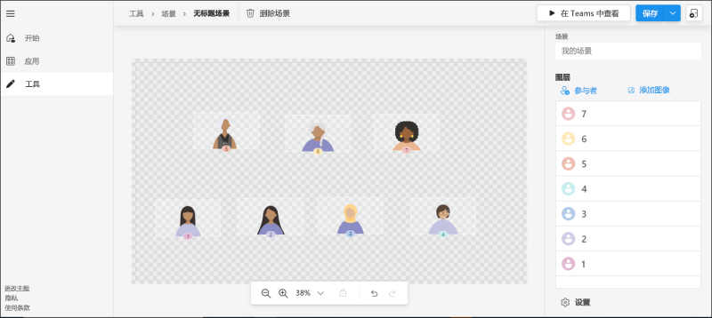
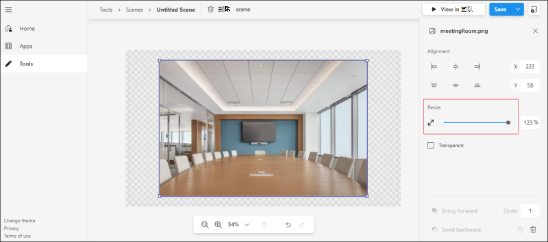
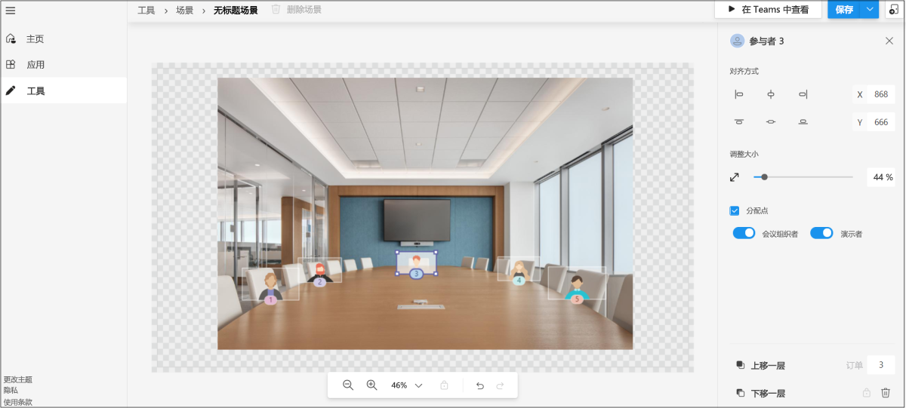
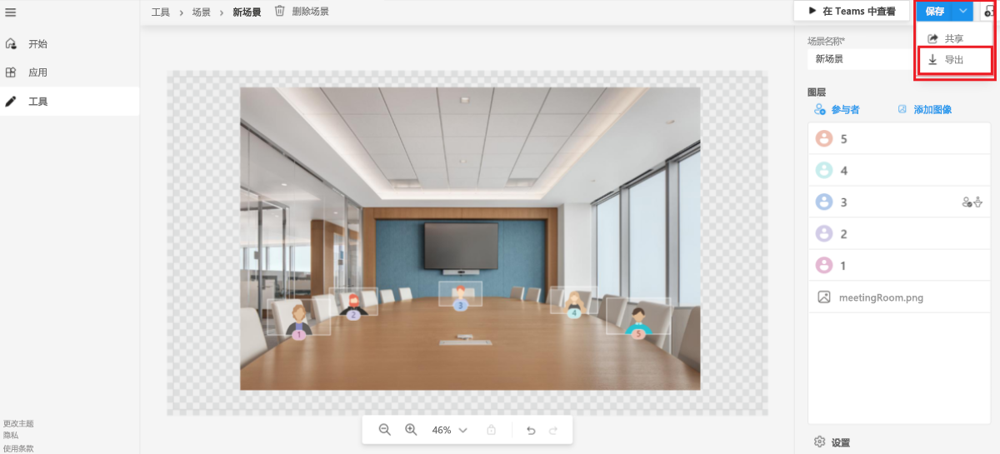

# <a name="together-mode-in-teams"></a><span data-ttu-id="6e5b1-103">一起模式Teams</span><span class="sxs-lookup"><span data-stu-id="6e5b1-103">Together Mode in Teams</span></span>

> [!NOTE]
> <span data-ttu-id="6e5b1-104">此功能目前仅适用于公共 [开发人员预览](../resources/dev-preview/developer-preview-intro.md) 版。</span><span class="sxs-lookup"><span data-stu-id="6e5b1-104">This feature is currently available in [public developer preview](../resources/dev-preview/developer-preview-intro.md) only.</span></span>

<span data-ttu-id="6e5b1-105">Microsoft Teams"共同模式"提供了一个沉浸式且极具吸引力的会议环境，将人们汇集在一起，并鼓励他们打开视频。</span><span class="sxs-lookup"><span data-stu-id="6e5b1-105">Microsoft Teams Together Mode provides an immersive and engaging meeting environment that brings people together and encourages them to turn on their video.</span></span> <span data-ttu-id="6e5b1-106">它以数字方式将参与者合并到单个虚拟场景，将其视频流放入场景创建者设计和修复的预定席位中。</span><span class="sxs-lookup"><span data-stu-id="6e5b1-106">It digitally combines participants into a single virtual scene and places their video streams in pre-determined seats designed and fixed by the scene creator.</span></span>

> [!VIDEO https://www.youtube-nocookie.com/embed/MGsNmYKgeTA]

<span data-ttu-id="6e5b1-107">一起模式下的场景是场景开发人员使用 Microsoft Scene studio 创建的项目。</span><span class="sxs-lookup"><span data-stu-id="6e5b1-107">A scene in Together Mode is an artifact created by the scene developer using the Microsoft Scene studio.</span></span> <span data-ttu-id="6e5b1-108">在构想的场景设置中，参与者具有指定席位，视频流呈现在这些座位中。</span><span class="sxs-lookup"><span data-stu-id="6e5b1-108">In a conceived scene setting, participants have designated seats with video streams rendered in those seats.</span></span>

> [!NOTE]
> <span data-ttu-id="6e5b1-109">建议仅场景应用，因为此类应用的获取体验更加无缝。</span><span class="sxs-lookup"><span data-stu-id="6e5b1-109">Scene only apps are recommended as the acquisition experience for such apps is more seamless.</span></span>

<span data-ttu-id="6e5b1-110">以下过程概述了如何创建仅场景应用：</span><span class="sxs-lookup"><span data-stu-id="6e5b1-110">The following process gives an overview to create a scene only app:</span></span>

:::image type="content" source="../assets/images/apps-in-meetings/create-together-mode-scene-flow.png" alt-text="仅创建场景应用" border="false":::

> [!NOTE]
> * <span data-ttu-id="6e5b1-112">仅场景应用仍然是应用中Microsoft Teams。</span><span class="sxs-lookup"><span data-stu-id="6e5b1-112">A scene only app is still an app in Microsoft Teams.</span></span> <span data-ttu-id="6e5b1-113">Scene studio 在后台处理应用包创建。</span><span class="sxs-lookup"><span data-stu-id="6e5b1-113">The Scene studio handles the app package creation in the background.</span></span>
> * <span data-ttu-id="6e5b1-114">单个应用包中的多个场景显示为简单列表场景的一部分。</span><span class="sxs-lookup"><span data-stu-id="6e5b1-114">Multiple scenes in a single app package appear as a flat list of scenes to users.</span></span>

## <a name="prerequisites"></a><span data-ttu-id="6e5b1-115">先决条件</span><span class="sxs-lookup"><span data-stu-id="6e5b1-115">Prerequisites</span></span>

<span data-ttu-id="6e5b1-116">若要使用"共同模式"，你必须对以下内容有基本的了解：</span><span class="sxs-lookup"><span data-stu-id="6e5b1-116">You must have a basic understanding of the following to use Together Mode:</span></span>

* <span data-ttu-id="6e5b1-117">场景中场景和座位的定义。</span><span class="sxs-lookup"><span data-stu-id="6e5b1-117">Definition of scene and seats in a scene.</span></span>
* <span data-ttu-id="6e5b1-118">拥有 Microsoft 开发人员帐户，并熟悉 Microsoft Teams[门户和](../concepts/build-and-test/teams-developer-portal.md)App Studio。</span><span class="sxs-lookup"><span data-stu-id="6e5b1-118">Have a Microsoft Developer account and be familiar with the Microsoft Teams [Developer Portal](../concepts/build-and-test/teams-developer-portal.md) and App Studio.</span></span>
* <span data-ttu-id="6e5b1-119">[应用旁加载的概念](../concepts/deploy-and-publish/apps-upload.md)。</span><span class="sxs-lookup"><span data-stu-id="6e5b1-119">[Concept of app sideloading](../concepts/deploy-and-publish/apps-upload.md).</span></span>
* <span data-ttu-id="6e5b1-120">确保管理员已授予访问自定义Upload **以及** 分别选择所有筛选器作为应用设置和会议策略的一部分的权限。</span><span class="sxs-lookup"><span data-stu-id="6e5b1-120">Ensure that the Administrator has granted permission to **Upload a custom app** and to select all filters as part of App Setup and Meeting policies respectively.</span></span>

## <a name="best-practices"></a><span data-ttu-id="6e5b1-121">最佳做法</span><span class="sxs-lookup"><span data-stu-id="6e5b1-121">Best practices</span></span>

<span data-ttu-id="6e5b1-122">在生成场景之前，请考虑以下事项，以打造无缝的场景生成体验：</span><span class="sxs-lookup"><span data-stu-id="6e5b1-122">Prior to building a scene, consider the following to have a seamless scene building experience:</span></span>

* <span data-ttu-id="6e5b1-123">确保所有图像都采用 PNG 格式。</span><span class="sxs-lookup"><span data-stu-id="6e5b1-123">Ensure that all images are in PNG format.</span></span>
* <span data-ttu-id="6e5b1-124">确保所有图像组合在一起的最终程序包的分辨率不得超过 1920x1080。</span><span class="sxs-lookup"><span data-stu-id="6e5b1-124">Ensure that the final package with all the images put together must not exceed 1920x1080 resolution.</span></span>

    > [!NOTE]
    > <span data-ttu-id="6e5b1-125">分辨率为一个数。</span><span class="sxs-lookup"><span data-stu-id="6e5b1-125">The resolution is an even number.</span></span> <span data-ttu-id="6e5b1-126">这是场景成功照明的要求。</span><span class="sxs-lookup"><span data-stu-id="6e5b1-126">This is a requirement for scenes to be lit up successfully.</span></span>

* <span data-ttu-id="6e5b1-127">确保最大场景大小为 10 MB。</span><span class="sxs-lookup"><span data-stu-id="6e5b1-127">Ensure that the maximum scene size is 10 MB.</span></span>
* <span data-ttu-id="6e5b1-128">确保每个图像的最大大小为 5 MB。</span><span class="sxs-lookup"><span data-stu-id="6e5b1-128">Ensure that the maximum size of each image is 5 MB.</span></span>

    > [!NOTE]
    > * <span data-ttu-id="6e5b1-129">场景是多个图像的集合。</span><span class="sxs-lookup"><span data-stu-id="6e5b1-129">A scene is a collection of multiple images.</span></span> <span data-ttu-id="6e5b1-130">限制针对每个单独图像。</span><span class="sxs-lookup"><span data-stu-id="6e5b1-130">The limit is for each individual image.</span></span>
    > * <span data-ttu-id="6e5b1-131">单个图像分辨率也必须是一个数。</span><span class="sxs-lookup"><span data-stu-id="6e5b1-131">The individual image resolution must also be an even number.</span></span>
  
* <span data-ttu-id="6e5b1-132">如果图像 **是透明的** ，请确保选中"透明"复选框。</span><span class="sxs-lookup"><span data-stu-id="6e5b1-132">Ensure that the **Transparent** checkbox is selected if the image is transparent.</span></span> <span data-ttu-id="6e5b1-133">选中图像后，此复选框在右侧面板上可用。</span><span class="sxs-lookup"><span data-stu-id="6e5b1-133">This checkbox is available on the right panel when an image is selected.</span></span>

    > [!NOTE]
    > <span data-ttu-id="6e5b1-134">需要将重叠图像标记为 **透明** ，以指示它们是场景中的重叠图像。</span><span class="sxs-lookup"><span data-stu-id="6e5b1-134">Overlapping images need to be marked as **Transparent** to indicate that they are overlapping images in the scene.</span></span>

## <a name="build-a-scene-using-the-scene-studio"></a><span data-ttu-id="6e5b1-135">使用 Scene studio 生成场景</span><span class="sxs-lookup"><span data-stu-id="6e5b1-135">Build a scene using the Scene studio</span></span>

<span data-ttu-id="6e5b1-136">Microsoft 有一个 Scene studio，允许你生成场景。</span><span class="sxs-lookup"><span data-stu-id="6e5b1-136">Microsoft has a Scene studio that allows you to build scenes.</span></span> <span data-ttu-id="6e5b1-137">它可以在场景编辑器[- Teams开发人员门户上提供](https://dev.teams.microsoft.com/scenes)。</span><span class="sxs-lookup"><span data-stu-id="6e5b1-137">It is available on [Scenes Editor - Teams Developer Portal](https://dev.teams.microsoft.com/scenes).</span></span>

> [!NOTE]
> <span data-ttu-id="6e5b1-138">本文档引用了开发人员门户中的 scene studio Microsoft Teams。</span><span class="sxs-lookup"><span data-stu-id="6e5b1-138">This document is referring to Scene studio in the Microsoft Teams Developer Portal.</span></span> <span data-ttu-id="6e5b1-139">在 App Studio 场景设计器中，界面和功能都相同。</span><span class="sxs-lookup"><span data-stu-id="6e5b1-139">The interface and functionalities are all the same in App Studio Scene Designer.</span></span>

<span data-ttu-id="6e5b1-140">Scene studio 上下文中的场景是一个包含以下内容的项目：</span><span class="sxs-lookup"><span data-stu-id="6e5b1-140">A scene in the context of the Scene studio is an artifact that contains the following:</span></span>

* <span data-ttu-id="6e5b1-141">为会议组织者和会议演示者预留的座位。</span><span class="sxs-lookup"><span data-stu-id="6e5b1-141">Seats reserved for meeting organizer and meeting presenters.</span></span>

    > [!NOTE]
    > <span data-ttu-id="6e5b1-142">演示者不指当前正在共享的用户。</span><span class="sxs-lookup"><span data-stu-id="6e5b1-142">Presenter does not refer to the user who is actively sharing.</span></span> <span data-ttu-id="6e5b1-143">它指的是会议 [角色](https://support.microsoft.com/en-us/office/roles-in-a-teams-meeting-c16fa7d0-1666-4dde-8686-0a0bfe16e019)。</span><span class="sxs-lookup"><span data-stu-id="6e5b1-143">It refers to the [meeting role](https://support.microsoft.com/en-us/office/roles-in-a-teams-meeting-c16fa7d0-1666-4dde-8686-0a0bfe16e019).</span></span>

* <span data-ttu-id="6e5b1-144">具有可调整宽度和高度的每个参与者的席位和图像。</span><span class="sxs-lookup"><span data-stu-id="6e5b1-144">Seat and image for each participant with an adjustable width and height.</span></span>

    > [!NOTE]
    > <span data-ttu-id="6e5b1-145">PNG 是唯一受支持的格式。</span><span class="sxs-lookup"><span data-stu-id="6e5b1-145">PNG is the only supported format.</span></span>

* <span data-ttu-id="6e5b1-146">所有座位和图像的 XYZ 坐标。</span><span class="sxs-lookup"><span data-stu-id="6e5b1-146">XYZ coordinates of all the seats and images.</span></span>
* <span data-ttu-id="6e5b1-147">隐藏为一个图像的图像的集合。</span><span class="sxs-lookup"><span data-stu-id="6e5b1-147">Collection of images that are camouflaged as one image.</span></span>

<span data-ttu-id="6e5b1-148">席位尺寸成为呈现参与者视频流的画布。</span><span class="sxs-lookup"><span data-stu-id="6e5b1-148">The seat dimensions become the canvas for rendering the participant video stream.</span></span> <span data-ttu-id="6e5b1-149">下图显示了每个展示为虚拟形象的席位，用于生成场景：</span><span class="sxs-lookup"><span data-stu-id="6e5b1-149">The following image shows each seat represented as an avatar for building scenes:</span></span>



<span data-ttu-id="6e5b1-151">**使用 Scene studio 生成场景**</span><span class="sxs-lookup"><span data-stu-id="6e5b1-151">**To build a scene using the Scene studio**</span></span>

1. <span data-ttu-id="6e5b1-152">转到场景[编辑器 - Teams开发人员门户](https://dev.teams.microsoft.com/scenes)。</span><span class="sxs-lookup"><span data-stu-id="6e5b1-152">Go to [Scenes Editor - Teams Developer Portal](https://dev.teams.microsoft.com/scenes).</span></span>

    >[!NOTE]
    > * <span data-ttu-id="6e5b1-153">若要打开 Scene studio，你可以导航到开发人员门户的Teams [并选择](https://dev.teams.microsoft.com/home)**"为会议创建自定义场景"。**</span><span class="sxs-lookup"><span data-stu-id="6e5b1-153">To open Scene studio, you can navigate to the home page of [Teams Developer Portal](https://dev.teams.microsoft.com/home) and select **Create custom scenes for meetings**.</span></span>
    > * <span data-ttu-id="6e5b1-154">若要打开 Scene studio，你可以导航到 Teams 开发人员门户的主页，从左侧部分选择"工具 ["，](https://dev.teams.microsoft.com/home)然后从"工具"部分选择 **"Scene studio"。**</span><span class="sxs-lookup"><span data-stu-id="6e5b1-154">To open Scene studio, you can navigate to the home page of [Teams Developer Portal](https://dev.teams.microsoft.com/home), select **Tools** from the left hand section, and select **Scene studio** from the **Tools** section.</span></span>

1. <span data-ttu-id="6e5b1-155">在"**场景编辑器"** 页中，选择 **"创建新场景"。**</span><span class="sxs-lookup"><span data-stu-id="6e5b1-155">In the **Scenes Editor** page, select **Create a new scene**.</span></span>

1. <span data-ttu-id="6e5b1-156">在 **"场景** "框中，输入场景的名称。</span><span class="sxs-lookup"><span data-stu-id="6e5b1-156">In the **Scene** box, enter a name for the scene.</span></span>

    >[!NOTE]
    > * <span data-ttu-id="6e5b1-157">可以选择" **关闭"** 以在关闭或重新打开右窗格之间进行切换。</span><span class="sxs-lookup"><span data-stu-id="6e5b1-157">You can select **Close** to toggle between closing or reopening the right pane.</span></span>
    > * <span data-ttu-id="6e5b1-158">可以使用缩放栏放大或缩小场景，以更好地查看场景。</span><span class="sxs-lookup"><span data-stu-id="6e5b1-158">You can zoom in or zoom out of the scene using the zoom bar for a better view of the scene.</span></span>

1. <span data-ttu-id="6e5b1-159">将图像拖放到环境中，如下图所示：</span><span class="sxs-lookup"><span data-stu-id="6e5b1-159">Drag and drop the image into the environment as displayed in the following image:</span></span>

    >[!NOTE]
    > * <span data-ttu-id="6e5b1-160">你可以下载[包含SampleScene.zipSampleApp.zip](https://github.com/MicrosoftDocs/msteams-docs/tree/master/msteams-platform/apps-in-teams-meetings/SampleScene.zip)[文件。](https://github.com/MicrosoftDocs/msteams-docs/tree/master/msteams-platform/apps-in-teams-meetings/SampleApp.zip)</span><span class="sxs-lookup"><span data-stu-id="6e5b1-160">You can download the [SampleScene.zip](https://github.com/MicrosoftDocs/msteams-docs/tree/master/msteams-platform/apps-in-teams-meetings/SampleScene.zip) and [SampleApp.zip](https://github.com/MicrosoftDocs/msteams-docs/tree/master/msteams-platform/apps-in-teams-meetings/SampleApp.zip) files with the images.</span></span>
    > * <span data-ttu-id="6e5b1-161">或者，可以使用添加图像将背景图像添加到 **场景**。</span><span class="sxs-lookup"><span data-stu-id="6e5b1-161">Alternately, you can add background images to the scene using **Add images**.</span></span>

    

1. <span data-ttu-id="6e5b1-163">选择已放置的图像。</span><span class="sxs-lookup"><span data-stu-id="6e5b1-163">Select the image that you have placed.</span></span>

1. <span data-ttu-id="6e5b1-164">从右窗格中，选择图像的对齐方式或使用 **"** 调整大小"滑块调整图像大小。</span><span class="sxs-lookup"><span data-stu-id="6e5b1-164">From the right pane, select an alignment for the image or use the **Resize** slider to adjust the image size.</span></span>

    

1. <span data-ttu-id="6e5b1-166">选择图像外部的区域。</span><span class="sxs-lookup"><span data-stu-id="6e5b1-166">Select an area outside of the image.</span></span>

1. <span data-ttu-id="6e5b1-167">在右上角的"图层"下 **，选择"** 参与者 **"。**</span><span class="sxs-lookup"><span data-stu-id="6e5b1-167">In the upper-right corner, select **Participants** under **Layers**.</span></span>

1. <span data-ttu-id="6e5b1-168">从"参与者数量"框中选择场景 **的参与者数量，** 然后选择"添加 **"。**</span><span class="sxs-lookup"><span data-stu-id="6e5b1-168">Select the number of participants for the scene from the **Number of participants** box, and select **Add**.</span></span>

    >[!NOTE]
    > * <span data-ttu-id="6e5b1-169">交付场景后，头像位置将替换为实际参与者的视频流。</span><span class="sxs-lookup"><span data-stu-id="6e5b1-169">After the scene is shipped, the avatar placements are replaced with actual participant's video streams.</span></span>
    > * <span data-ttu-id="6e5b1-170">你可以将参与者图像拖动到场景周围，并将其放在所需位置，然后使用调整大小箭头调整它们的大小。</span><span class="sxs-lookup"><span data-stu-id="6e5b1-170">You can drag the participant images around the scene and place them in the required position and resize them using the resize arrow.</span></span>

1. <span data-ttu-id="6e5b1-171">选择任何参与者图像，然后选中" **分配专** 色"复选框以将位置分配给参与者。</span><span class="sxs-lookup"><span data-stu-id="6e5b1-171">Select any participant image, and choose the **Assign Spot** check box to assign the spot to the participant.</span></span>

1. <span data-ttu-id="6e5b1-172">选择 **参与者的会议** 组织者 **或** 演示者角色。</span><span class="sxs-lookup"><span data-stu-id="6e5b1-172">Select **Meeting Organizer** or **Presenter** role for the participant.</span></span>

    >[!NOTE]
    > <span data-ttu-id="6e5b1-173">在会议中，必须为一个参与者分配会议组织者的角色。</span><span class="sxs-lookup"><span data-stu-id="6e5b1-173">In a meeting, one participant must be assigned the role of a meeting organizer.</span></span>

    

1. <span data-ttu-id="6e5b1-175">选择 **"保存\*\*\*\*"，** 然后选择"Teams"以快速测试场景中的Microsoft Teams。</span><span class="sxs-lookup"><span data-stu-id="6e5b1-175">Select **Save** and select **View in Teams** to quickly test your scene in Microsoft Teams.</span></span>

    >[!NOTE]
    > <span data-ttu-id="6e5b1-176">若要删除你创建的场景，请选择顶 **栏** 上的"删除场景"。</span><span class="sxs-lookup"><span data-stu-id="6e5b1-176">To delete a scene you created, select **Delete scene** on the top bar.</span></span>

1. <span data-ttu-id="6e5b1-177">In the **View in Teams** dialog box， select Preview in **Teams**.</span><span class="sxs-lookup"><span data-stu-id="6e5b1-177">In the **View in Teams** dialog box, select **Preview in Teams**.</span></span>
1. <span data-ttu-id="6e5b1-178">在出现的对话框中， **选择添加**。</span><span class="sxs-lookup"><span data-stu-id="6e5b1-178">In the dialog box that appears, select **Add**.</span></span>

    <span data-ttu-id="6e5b1-179">可通过创建测试会议并启动"共同模式"来测试或访问场景。</span><span class="sxs-lookup"><span data-stu-id="6e5b1-179">The scene can be tested or accessed by creating a test meeting and launching Together Mode.</span></span> <span data-ttu-id="6e5b1-180">有关详细信息，请参阅[激活"共同模式"。](#activate-the-together-mode)</span><span class="sxs-lookup"><span data-stu-id="6e5b1-180">For more information, see [activate the Together Mode](#activate-the-together-mode).</span></span>

    

    >[!NOTE]
    > * <span data-ttu-id="6e5b1-182">选择 **"** 预览"Microsoft Teams创建一个可在开发人员门户的"应用"Teams查看的应用。</span><span class="sxs-lookup"><span data-stu-id="6e5b1-182">Selecting **Preview** automatically creates a Microsoft Teams app that can be viewed in the **Apps** page in the Teams Developer Portal.</span></span>
    > * <span data-ttu-id="6e5b1-183">选择 **"** 预览"会自动创建一个应用包appmanifest.js位于场景后面。</span><span class="sxs-lookup"><span data-stu-id="6e5b1-183">Selecting **Preview** automatically creates an app package that is appmanifest.json behind the scene.</span></span> <span data-ttu-id="6e5b1-184">如前面所述，这是抽象的，但你可通过从菜单导航到应用 **来访问自动** 创建的应用包。</span><span class="sxs-lookup"><span data-stu-id="6e5b1-184">As stated earlier, this is abstracted, but you can access the automatically created app package by navigating to **Apps** from the menu.</span></span>
    > * <span data-ttu-id="6e5b1-185">然后，可以在"共同模式"场景库中查看场景。</span><span class="sxs-lookup"><span data-stu-id="6e5b1-185">The scene can then be viewed in the Together Mode scene gallery.</span></span>

1. <span data-ttu-id="6e5b1-186">（可选）可以从"保存"下拉菜单中选择"共享"，以创建可共享链接，以轻松分发场景供其他人使用。</span><span class="sxs-lookup"><span data-stu-id="6e5b1-186">Optionally, you can select **Share** from the **Save** drop-down menu to create a shareable link to easily distribute your scenes for others to use.</span></span> <span data-ttu-id="6e5b1-187">打开此链接会为用户安装场景，他们可以开始使用它。</span><span class="sxs-lookup"><span data-stu-id="6e5b1-187">Opening this link installs the scene for the user and they can start using it.</span></span>

1. <span data-ttu-id="6e5b1-188">预览后，可通过按照应用提交步骤将场景作为应用Teams交付到应用。</span><span class="sxs-lookup"><span data-stu-id="6e5b1-188">After preview, the scene can be shipped as an app to Teams by following the steps for app submission.</span></span>

    >[!NOTE]
    > <span data-ttu-id="6e5b1-189">对于已设计的场景，此步骤需要不同于场景包的应用包。</span><span class="sxs-lookup"><span data-stu-id="6e5b1-189">This step requires the app package that is different from the scene package, for the scene that was designed.</span></span> <span data-ttu-id="6e5b1-190">可在开发人员中心的应用部分找到自动创建Teams包。</span><span class="sxs-lookup"><span data-stu-id="6e5b1-190">The app package created automatically can be found in the **Apps** section in the Teams Developer Center.</span></span>

1. <span data-ttu-id="6e5b1-191">（可选）可通过从"保存"下拉菜单中选择"导出"**来检索场景** 包。</span><span class="sxs-lookup"><span data-stu-id="6e5b1-191">Optionally, the scene package can be retrieved by selecting **Export** from the **Save** drop-down menu.</span></span> <span data-ttu-id="6e5b1-192">下载.zip文件（即场景包）。</span><span class="sxs-lookup"><span data-stu-id="6e5b1-192">A .zip file, that is the scene package, is downloaded.</span></span>

    

    >[!NOTE]
    > <span data-ttu-id="6e5b1-194">场景包由一个scene.js和用于生成场景的 PNG 资源组成。</span><span class="sxs-lookup"><span data-stu-id="6e5b1-194">Scene package comprises of a scene.json and the PNG assets used to build a scene.</span></span> <span data-ttu-id="6e5b1-195">可以审阅场景包以合并其他更改，如本文档scene.js示例部分所述。</span><span class="sxs-lookup"><span data-stu-id="6e5b1-195">The scene package can be reviewed for incorporating other changes as described in the Sample scene.json section of this document.</span></span>

<span data-ttu-id="6e5b1-196">分步入门示例中演示了利用 Z 轴的更复杂的场景。</span><span class="sxs-lookup"><span data-stu-id="6e5b1-196">A more complex scene that leverages the Z-axis is demonstrated in the step-by-step getting started sample.</span></span>

## <a name="sample-scenejson"></a><span data-ttu-id="6e5b1-197">示例scene.js打开</span><span class="sxs-lookup"><span data-stu-id="6e5b1-197">Sample scene.json</span></span>

<span data-ttu-id="6e5b1-198">Scene.js和图像一起指示座位的确切位置。</span><span class="sxs-lookup"><span data-stu-id="6e5b1-198">Scene.json along with the images indicate the exact position of the seats.</span></span> <span data-ttu-id="6e5b1-199">场景包含用于放入参与者视频的位图图像、子画面和矩形。</span><span class="sxs-lookup"><span data-stu-id="6e5b1-199">A scene consists of bitmap images, sprites, and rectangles to put participant videos in.</span></span> <span data-ttu-id="6e5b1-200">这些子画面和参与者框在一个世界坐标系中定义，其中 X 轴指向右侧，Y 轴指向向下。</span><span class="sxs-lookup"><span data-stu-id="6e5b1-200">These sprites and participant boxes are defined in a world coordinate system with the X-axis pointing to the right and the Y-axis pointing downwards.</span></span> <span data-ttu-id="6e5b1-201">"一起"模式支持放大当前参与者。</span><span class="sxs-lookup"><span data-stu-id="6e5b1-201">Together mode supports zooming in on the current participants.</span></span> <span data-ttu-id="6e5b1-202">这对大型场景中的小会议很有用。</span><span class="sxs-lookup"><span data-stu-id="6e5b1-202">This is helpful for small meetings in a large scene.</span></span> <span data-ttu-id="6e5b1-203">子画面是一种静态位图图像，位于世界。</span><span class="sxs-lookup"><span data-stu-id="6e5b1-203">A sprite is a static bitmap image positioned in the world.</span></span> <span data-ttu-id="6e5b1-204">子画面的 Z 值决定子画面的位置。</span><span class="sxs-lookup"><span data-stu-id="6e5b1-204">The Z value of the sprite determines the position of the sprite.</span></span> <span data-ttu-id="6e5b1-205">呈现从 Z 值最低的子画面开始，因此 Z 值越高，表示它离相机更近。</span><span class="sxs-lookup"><span data-stu-id="6e5b1-205">Rendering starts with the sprite with lowest Z value, so higher Z value means it is closer to the camera.</span></span> <span data-ttu-id="6e5b1-206">每个参与者都有自己的视频源，该源会进行分段，以便仅呈现前台。</span><span class="sxs-lookup"><span data-stu-id="6e5b1-206">Each participant has its own video feed, which is segmented so that only the foreground is rendered.</span></span>

<span data-ttu-id="6e5b1-207">下面是示例scene.js示例：</span><span class="sxs-lookup"><span data-stu-id="6e5b1-207">Following is the scene.json sample:</span></span>

```json
{
   "protocolVersion": "1.0",
   "id": "A",
   "autoZoom": true,
   "mirrorParticipants ": true,
   "extent":{
      "left":0.0,
      "top":0.0,
      "width":16.0,
      "height":9.0
   },
   "sprites":[
      {
         "filename":"background.png",
         "cx":8.0,
         "cy":4.5,
         "width":16.0,
         "height":9.0,
         "zOrder":0.0,
   "isAlpha":false
      },
      {
         "filename":"table.png",
         "cx":8.0,
         "cy":7.0,
         "width":12.0,
         "height":4.0,
         "zOrder":3.0,
   "isAlpha":true
      },
      {
         "filename":"row0.png",
         "cx":12.0,
         "cy":15.0,
         "width":8.0,
         "height":4.0,
         "zOrder":2.0,
   "isAlpha":true
      }

   ],
   "participants":[
      {
         "cx":5.0,
         "cy":4.0,
         "width":4.0,
         "height":2.25,
         "zOrder":1.0,
         "seatingOrder":0
      },
      {
         "cx":11.0,
         "cy":4.0,
         "width":4.0,
         "height":2.25,
         "zOrder":1.0,
         "seatingOrder":1
      }
   ]
}
```

<span data-ttu-id="6e5b1-208">每个场景都有唯一的 ID 和名称。</span><span class="sxs-lookup"><span data-stu-id="6e5b1-208">Each scene has a unique ID and name.</span></span> <span data-ttu-id="6e5b1-209">场景 JSON 还包含有关用于场景的所有资源的信息。</span><span class="sxs-lookup"><span data-stu-id="6e5b1-209">The scene JSON also contains information on all the assets used for the scene.</span></span> <span data-ttu-id="6e5b1-210">每个资源都包含文件名、宽度、高度以及 X 和 Y 轴上的位置。</span><span class="sxs-lookup"><span data-stu-id="6e5b1-210">Each asset contains a filename, width, height, and position on the X and Y-axis.</span></span> <span data-ttu-id="6e5b1-211">同样，每个座位都包含一个在 X 轴和 Y 轴上的座位 ID、宽度、高度和位置。</span><span class="sxs-lookup"><span data-stu-id="6e5b1-211">Similarly, each seat contains a seat ID, width, height, and position on the X and Y-axis.</span></span> <span data-ttu-id="6e5b1-212">该订单会自动生成，并可以按偏好更改。</span><span class="sxs-lookup"><span data-stu-id="6e5b1-212">The seating order is generated automatically and can be altered as per preference.</span></span>

> [!NOTE]
> <span data-ttu-id="6e5b1-213">呼叫订单号对应于加入呼叫者的顺序。</span><span class="sxs-lookup"><span data-stu-id="6e5b1-213">Seating order number corresponds to the order of people joining the call.</span></span>

<span data-ttu-id="6e5b1-214">zOrder 表示沿 Z 轴放置图像和座位的顺序。</span><span class="sxs-lookup"><span data-stu-id="6e5b1-214">The zOrder represents the order of placing images and seats along the Z-axis.</span></span> <span data-ttu-id="6e5b1-215">在许多情况下，如果需要，它会提供深度或分区感。</span><span class="sxs-lookup"><span data-stu-id="6e5b1-215">In many cases, it gives a sense of depth or partition if required.</span></span> <span data-ttu-id="6e5b1-216">有关详细信息，请参阅分步入门示例。</span><span class="sxs-lookup"><span data-stu-id="6e5b1-216">For more information, see the step-by-step getting started sample.</span></span> <span data-ttu-id="6e5b1-217">此示例利用 zOrder。</span><span class="sxs-lookup"><span data-stu-id="6e5b1-217">The sample leverages the zOrder.</span></span>

<span data-ttu-id="6e5b1-218">现在，你已完成示例scene.js，你可以激活"共同模式"以参与场景。</span><span class="sxs-lookup"><span data-stu-id="6e5b1-218">Now that you have gone through the sample scene.json, you can activate the Together Mode to engage in scenes.</span></span>

## <a name="activate-the-together-mode"></a><span data-ttu-id="6e5b1-219">激活一起模式</span><span class="sxs-lookup"><span data-stu-id="6e5b1-219">Activate the Together Mode</span></span>

<span data-ttu-id="6e5b1-220">获取最终用户如何在一起模式下参与场景的端到端信息。</span><span class="sxs-lookup"><span data-stu-id="6e5b1-220">Get end-to-end information of how an end user engages with scenes in Together Mode.</span></span>

<span data-ttu-id="6e5b1-221">**选择场景并激活"共同模式"**</span><span class="sxs-lookup"><span data-stu-id="6e5b1-221">**To choose scenes and activate the Together Mode**</span></span>

1. <span data-ttu-id="6e5b1-222">创建新的测试会议。</span><span class="sxs-lookup"><span data-stu-id="6e5b1-222">Create a new test meeting.</span></span>

    >[!NOTE]
    > <span data-ttu-id="6e5b1-223">在选择 **Scene** studio 中的"预览"时，场景会作为应用安装在Microsoft Teams。</span><span class="sxs-lookup"><span data-stu-id="6e5b1-223">On selecting **Preview** in the Scene studio, the scene is installed as an app in Microsoft Teams.</span></span> <span data-ttu-id="6e5b1-224">这是开发人员在 Scene studio 中测试和试用场景的模型。</span><span class="sxs-lookup"><span data-stu-id="6e5b1-224">This is the model for a developer to test and try out scenes from the Scene studio.</span></span> <span data-ttu-id="6e5b1-225">将场景作为应用交付后，用户将在场景库中看到这些场景。</span><span class="sxs-lookup"><span data-stu-id="6e5b1-225">After a scene is shipped as an app, users see these scenes in the scene gallery.</span></span>

1. <span data-ttu-id="6e5b1-226">从左上角 **的"库**"下拉列表中，选择"共同 **模式"。**</span><span class="sxs-lookup"><span data-stu-id="6e5b1-226">From the **Gallery** drop-down in the upper-left corner, select **Together Mode**.</span></span> <span data-ttu-id="6e5b1-227">将出现 **选取** 器对话框，并且添加的场景可用。</span><span class="sxs-lookup"><span data-stu-id="6e5b1-227">The **Picker** dialog box appears and the scene that is added is available.</span></span>

1. <span data-ttu-id="6e5b1-228">选择 **"更改场景** "以更改默认场景。</span><span class="sxs-lookup"><span data-stu-id="6e5b1-228">Select **Change scene** to change the default scene.</span></span>

1. <span data-ttu-id="6e5b1-229">从 **"场景库"** 中，选择要用于会议的场景。</span><span class="sxs-lookup"><span data-stu-id="6e5b1-229">From the **Scene Gallery**, select the scene you want to use for your meeting.</span></span>

1. <span data-ttu-id="6e5b1-230">（可选）会议组织者和演示者可以在会议中选择"将所有 **参与者切换到一** 起"模式。</span><span class="sxs-lookup"><span data-stu-id="6e5b1-230">Optionally, the meeting organizer and presenter can choose **Switch all participants to together mode** in the meeting.</span></span>

    >[!NOTE]
    > <span data-ttu-id="6e5b1-231">在任意时间点，只能将一个场景用于会议。</span><span class="sxs-lookup"><span data-stu-id="6e5b1-231">At any point in time, only one scene can be used homogeneously for the meeting.</span></span> <span data-ttu-id="6e5b1-232">如果演示者或组织者更改场景，则场景将全部更改。</span><span class="sxs-lookup"><span data-stu-id="6e5b1-232">If a presenter or organizer changes a scene, it  changes for all.</span></span> <span data-ttu-id="6e5b1-233">切换到或退出共同模式由单个参与者决定，但在一起模式下，所有参与者具有相同的场景。</span><span class="sxs-lookup"><span data-stu-id="6e5b1-233">Switching in or out of Together Mode is up to individual participants, but while in Together Mode, all participants have the same scene.</span></span>

1. <span data-ttu-id="6e5b1-234">选择 **应用**。</span><span class="sxs-lookup"><span data-stu-id="6e5b1-234">Select **Apply**.</span></span> <span data-ttu-id="6e5b1-235">Teams用户安装应用并应用场景。</span><span class="sxs-lookup"><span data-stu-id="6e5b1-235">Teams installs the app for the user and applies the scene.</span></span>

## <a name="open-a-together-mode-scene-package"></a><span data-ttu-id="6e5b1-236">打开一起模式场景包</span><span class="sxs-lookup"><span data-stu-id="6e5b1-236">Open a Together Mode Scene Package</span></span>

<span data-ttu-id="6e5b1-237">你可以将场景包（从场景.zip中检索到的场景包）共享给其他创建者，以进一步增强场景。</span><span class="sxs-lookup"><span data-stu-id="6e5b1-237">You can share the Scene Package that is a .zip file retrieved from the Scene studio to other creators to further enhance the scene.</span></span> <span data-ttu-id="6e5b1-238">可以利用 **"导入** 场景"功能。</span><span class="sxs-lookup"><span data-stu-id="6e5b1-238">The **Import a Scene** functionality can be leveraged.</span></span> <span data-ttu-id="6e5b1-239">此工具可帮助解包场景包，让创建者继续生成场景。</span><span class="sxs-lookup"><span data-stu-id="6e5b1-239">This tool helps unwrap a scene package to let the creator continue building the scene.</span></span>


## <a name="see-also"></a><span data-ttu-id="6e5b1-241">另请参阅</span><span class="sxs-lookup"><span data-stu-id="6e5b1-241">See also</span></span>

[<span data-ttu-id="6e5b1-242">会议Teams应用程序</span><span class="sxs-lookup"><span data-stu-id="6e5b1-242">Apps for Teams meetings</span></span>](teams-apps-in-meetings.md)
