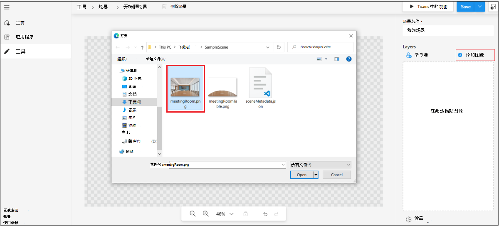

# <a name="custom-together-mode-scenes-in-teams"></a>在 Teams 中自定义同框场景模式

自定义会议模式场景中Microsoft Teams通过以下操作提供沉浸式且极具吸引力的会议环境：

* 将人们汇集在一起，鼓励他们打开视频。 
* 以数字方式将参与者合并到单个虚拟场景。 
* 将参与者的视频流放在场景创建者设计和修复的预定座位中。

在自定义一起模式场景中，场景是一个项目。 场景由场景开发人员使用 Microsoft Scene studio 创建。 在构想的场景设置中，参与者具有带视频流的座位。 视频将呈现在这些座位上。 建议仅场景应用，因为此类应用的体验很清晰。

以下过程概述了如何创建仅场景应用：

:::image type="content" source="../assets/images/apps-in-meetings/create-together-mode-scene-flow.png" alt-text="仅创建场景应用" border="false":::

仅场景应用仍然是应用中Microsoft Teams。 Scene studio 在后台处理应用包创建。 单个应用包中的多个场景显示为简单列表用户的需求。

> [!NOTE]
> 用户无法从移动设备启动"共同模式"。 但是，当用户通过移动设备加入会议并且从桌面打开"共同模式"后，已打开视频的移动用户将显示在桌面上的"共同模式"中。 

## <a name="prerequisites"></a>先决条件

你必须对以下内容有基本的了解，以使用自定义"共同模式"场景：

* 定义场景和场景中的座位。
* 拥有 Microsoft 开发人员帐户，并熟悉 Microsoft Teams[门户和](../concepts/build-and-test/teams-developer-portal.md)App Studio。
* 了解 [应用旁加载 的概念](../concepts/deploy-and-publish/apps-upload.md)。
* 确保管理员已授予对自定义Upload [**的权限，**](../concepts/deploy-and-publish/apps-upload.md)并分别选择所有筛选器作为应用设置和会议策略的一部分。

## <a name="best-practices"></a>最佳实践

请考虑以下场景生成体验做法：

* 确保所有图像都采用 PNG 格式。
* 确保所有图像组合在一起的最终程序包的分辨率不得超过 1920x1080。 分辨率为一个数。 要成功显示场景，需要此分辨率。
* 确保最大场景大小为 10 MB。
* 确保每个图像的最大大小为 5 MB。 场景是多个图像的集合。 限制针对每个单独图像。
* 确保选择" **透明** "（如果需要）。 选中图像后，此复选框在右侧面板上可用。 重叠的图像必须标记为 **透明** ，以指示它们是场景中的重叠图像。

## <a name="build-a-scene-using-the-scene-studio"></a>使用 Scene studio 生成场景

Microsoft 有一个 Scene studio，允许你生成场景。 它在场景编辑器 - 开发人员门户[中Teams可用](https://dev.teams.microsoft.com/scenes)。 本文档引用开发人员门户中的 Scene studio Microsoft Teams。 在 App Studio 场景设计器中，界面和功能都相同。

Scene studio 上下文中的场景是一个包含以下元素的项目：

* 为会议组织者和会议演示者预留的座位。 演示者不会指当前正在共享的用户。 它指的是会议 [角色](https://support.microsoft.com/en-us/office/roles-in-a-teams-meeting-c16fa7d0-1666-4dde-8686-0a0bfe16e019)。

* 具有可调整宽度和高度的每个参与者的席位和图像。 图像仅支持 PNG 格式。

* 所有座位和图像的 XYZ 坐标。

* 被隐藏为一个图像的图像的集合。

下图显示了每个展示为虚拟形象的席位，用于生成场景：


**使用 Scene studio 生成场景**

1. 转到场景[编辑器 - Teams开发人员门户](https://dev.teams.microsoft.com/scenes)。

    或者，若要打开 Scene studio，你可以转到开发人员门户Teams[主页：](https://dev.teams.microsoft.com/home)
    * 选择 **"为会议创建自定义场景"。**
    * 从 **左侧** 部分选择"工具"，然后从"工具"**部分****选择"场景** Studio"。

1. 在 **"场景编辑器"** 中，**选择"创建新场景"。**

1. 在 **"场景名称**"中，输入场景的名称。

    * 可以选择" **关闭"** 以在关闭或重新打开右窗格之间进行切换。
    * 可以使用缩放栏放大或缩小场景，以更好地查看场景。

1. 选择 **"添加** 图像"将映像添加到环境中：

    

    >[!NOTE]
    > * 你可以下载包含[SampleScene.zipSampleApp.zip](https://github.com/MicrosoftDocs/msteams-docs/tree/master/msteams-platform/apps-in-teams-meetings/SampleScene.zip)[文件。](https://github.com/MicrosoftDocs/msteams-docs/tree/master/msteams-platform/apps-in-teams-meetings/SampleApp.zip)

1. 选择已添加的图像。

1. 从右窗格中，选择图像的对齐方式或使用 **Resize** 调整图像大小：

    

1. 选择图像外部的区域。

1. 在右上角的"图层"下 **，选择"** 参与者 **"。**

1. 从"参与者数量"框中选择场景 **的参与者数量，** 然后选择"添加 **"。** 交付场景后，头像位置将替换为实际参与者的视频流。 你可以将参与者的图像拖动到场景周围，并将其放在所需位置。 可以使用调整大小箭头来调整大小。

1. 选择任何参与者图像，然后选择分配 **专** 色以将位置分配给参与者。

1. 选择 **参与者的会议** 组织者 **或** 演示者角色。 在会议中，必须为一个参与者分配会议组织者的角色：

    

1. 选择 **"保存****"，然后选择"Teams"** 以快速测试场景中的Microsoft Teams。

    * 选择 **"Teams** 将自动创建一个Microsoft Teams应用程序，可在开发人员门户的"应用"Teams查看该应用。 
    * 选择 **场景中的Teams** 自动创建在场景后面为 appmanifest.json 的应用包。 你可以从菜单  **转到应用** 并访问自动创建的应用包。
    * 若要删除你创建的场景，请选择顶 **栏上的** "删除场景"。

1. In **View in Teams，** select **Preview in Teams**.
1. 在出现的对话框中， **选择添加**。

    通过创建测试会议并启动自定义一起模式场景来测试或访问场景。 有关详细信息，请参阅激活 [自定义一起模式场景](#activate-custom-together-mode-scenes)：

    

    然后，可以在自定义"共同模式"场景库中查看场景。

（可选）可以从"保存 **"** 下拉菜单 **中选择** "共享"。 你可以创建可共享的链接来分发你的场景，供其他人使用。 用户可以打开链接以安装场景并开始使用它。

预览后，场景作为应用交付Teams应用提交步骤进行发布。 此步骤需要应用包。 对于已设计的场景，应用包不同于场景包。 自动创建的应用包位于开发人员中心的应用Teams部分。

（可选）通过从"保存" **下拉菜单中选择"** 导出"来 **检索场景** 包。 下载 **.zip** 文件（即场景包）。 场景包包括 scene.json 和用于生成场景的 PNG 资源。 查看场景包以合并其他更改：


使用 Z 轴的复杂场景在分步入门示例中进行演示。

## <a name="sample-scenejson"></a>示例 scene.json

Scene.json 以及图像指示座位的确切位置。 场景包含用于放入参与者视频的位图图像、子画面和矩形。 这些子画面和参与者框在世界坐标系中定义。 X 轴指向右侧，而 Y 轴指向向下。

自定义一起模式场景支持放大当前参与者。 此功能对于大型场景中的小会议非常有用。 子画面是一种静态位图图像，位于世界。 子画面的 Z 值决定子画面的位置。 呈现从 Z 值最低的子画面开始，因此 Z 值越高，表示它离相机更近。 每个参与者都有自己的视频源，该源进行分段，以便仅呈现前台。

以下代码是 scene.json 示例：

```json
{
   "protocolVersion": "1.0",
   "id": "A",
   "autoZoom": true,
   "mirrorParticipants ": true,
   "extent":{
      "left":0.0,
      "top":0.0,
      "width":16.0,
      "height":9.0
   },
   "sprites":[
      {
         "filename":"background.png",
         "cx":8.0,
         "cy":4.5,
         "width":16.0,
         "height":9.0,
         "zOrder":0.0,
   "isAlpha":false
      },
      {
         "filename":"table.png",
         "cx":8.0,
         "cy":7.0,
         "width":12.0,
         "height":4.0,
         "zOrder":3.0,
   "isAlpha":true
      },
      {
         "filename":"row0.png",
         "cx":12.0,
         "cy":15.0,
         "width":8.0,
         "height":4.0,
         "zOrder":2.0,
   "isAlpha":true
      }

   ],
   "participants":[
      {
         "cx":5.0,
         "cy":4.0,
         "width":4.0,
         "height":2.25,
         "zOrder":1.0,
         "seatingOrder":0
      },
      {
         "cx":11.0,
         "cy":4.0,
         "width":4.0,
         "height":2.25,
         "zOrder":1.0,
         "seatingOrder":1
      }
   ]
}
```

每个场景都有唯一的 ID 和名称。 场景 JSON 还包含有关用于场景的所有资源的信息。 每个资源都包含文件名、宽度、高度以及 X 和 Y 轴上的位置。 同样，每个座位都包含一个在 X 轴和 Y 轴上的座位 ID、宽度、高度和位置。 将自动生成订单，并按首选项更改该顺序。 呼叫订单号对应于加入呼叫的人的顺序。

`zOrder`表示沿 Z 轴放置图像和座位的顺序。 如有必要，它将提供深度或分区感。 请参阅分步入门示例。 此示例使用 `zOrder` 。

现在，你已浏览示例 scene.json，你可以激活自定义的"共同模式"场景以参与场景。

## <a name="activate-custom-together-mode-scenes"></a>激活自定义一起模式场景

获取有关用户如何在自定义"共同模式"场景中使用场景的信息。

**选择场景并激活自定义一起模式场景**

1. 创建新的测试会议。

    >[!NOTE]
    > 在场景 studio 中选择"预览"时，场景会作为应用安装在Microsoft Teams。 这是开发人员在 Scene studio 中测试和试用场景的模型。 将场景作为应用交付后，用户将在场景库中看到这些场景。

1. 从左上角 **的"库**"下拉列表中，选择"一起 **模式"。** 将出现 **选取** 器对话框，并且添加的场景可用。

1. 选择 **"更改场景** "以更改默认场景。

1. 从 **"场景库"** 中，选择要用于会议的场景。

    （可选）会议组织者和演示者可以更改 **会议中所有参与者** 的场景。

    >[!NOTE]
    > 在任意时间点，仅一个场景用于会议。 如果演示者或组织者更改场景，则场景将全部更改。 切换为或退出自定义一起模式场景由单个参与者决定，但在自定义"共同模式"场景中，所有参与者具有相同的场景。

1. 选择“**应用**”。 Teams用户安装应用并应用场景。

## <a name="open-a-custom-together-mode-scenes-scene-package"></a>打开自定义一起模式场景场景包

你可以将场景包（从场景.zip中检索到的场景包）共享给其他创建者，以进一步增强场景。 " **导入场景** "功能可帮助解包场景包，让创建者继续生成场景。


## <a name="see-also"></a>另请参阅

* [会议Teams应用程序](teams-apps-in-meetings.md)
* [通话和会议机器人 ](~/bots/calls-and-meetings/calls-meetings-bots-overview.md)
* [实时媒体通话和与会议Microsoft Teams](~/bots/calls-and-meetings/real-time-media-concepts.md)
