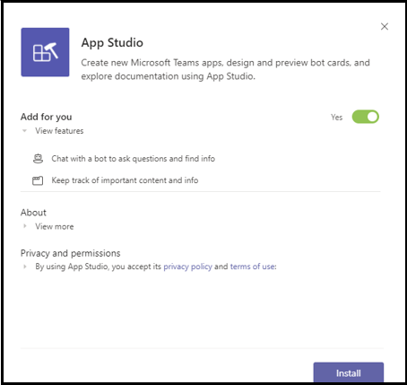

# <a name="add-power-virtual-agents-chatbot"></a>添加 Power Virtual Agent 聊天机器人 

Power Virtual Agents无代码的引导式图形界面解决方案，它使团队的每位成员能够创建丰富的对话聊天机器人，这些聊天机器人可轻松与 Teams 集成。 在网站中创作Power Virtual Agents内容自然地呈现在Teams。 Power Virtual Agents聊天机器人与本机聊天画布Teams用户互动。 IT 管理员、业务分析师、域专家和熟练应用开发人员可以针对 Teams 设计、开发和发布智能虚拟代理，而无需设置开发环境。 他们可以创建 Web 服务，或直接在 Bot Framework 中注册。 

本文档指导您如何通过 Teams 门户Teams Power Virtual Agents聊天机器人，以及如何使用 App Studio Teams聊天机器人。 

Power Virtual Agents可以创建功能强大的聊天机器人，这些聊天机器人可以回答客户、其他员工或您的网站或服务的访问者提出的问题。

无需数据工作者或开发人员，即可轻松创建这些机器人。

> [!NOTE]
> 通过将聊天机器人Microsoft Teams聊天机器人，一些数据（如聊天机器人内容和用户聊天内容）会与用户Microsoft Teams。 这意味着你的数据流在组织的合规性以及地理或 [区域边界之外](/power-virtual-agents/data-location)。 <br/>

## <a name="make-your-chatbot-available-in-teams-through-the-power-virtual-agents-portal"></a>通过 Teams 门户Power Virtual Agents聊天机器人

若要通过 Teams 门户Power Virtual Agents聊天机器人，必须执行以下过程步骤：

**使聊天机器人在聊天室Teams**

1. **发布最新的自动程序内容**  
在聊天机器人门户Power Virtual Agents后，必须发布聊天机器人Teams用户才能与其交互。 有关详细信息，请参阅发布 [最新的自动程序内容](/power-virtual-agents/publication-fundamentals-publish-channels#publish-the-latest-bot-content)。

   

1. **配置Teams通道**  
发布自动程序后，添加Teams频道，以便自动程序可供Teams用户使用。

   

1. **为聊天机器人生成应用 ID**  
将Teams添加到聊天机器人后 **，在对话框中** 生成应用 ID。 应用 ID 是 Microsoft 为自动程序生成的唯一标识符。 保存应用 ID，为应用创建应用Teams。

## <a name="add-your-bot-to-teams-using-app-studio"></a>使用 App Studio Teams聊天机器人

如果在[Teams](/microsoftteams/admin-settings)实例中启用了上载自定义应用，Teams App Studio 直接上载聊天机器人并立即开始使用它。 若要共享聊天机器人，你可以请求管理员在租户应用目录中提供机器人，也可以将应用包发送给其他人，让他们单独上传它。

1. **在 Teams 安装 App Studio**  
App Studio 是一款Teams应用。 从 Teams 应用商店安装 App Studio，从而简化在应用商店中创建和注册Teams： 

   1. 从应用程序实例中选择Teams图标，然后搜索 **App Studio**。

      &emsp;&emsp;    

   1. 选择 **App Studio** 磁贴 **，然后选择弹出** 对话框中的"安装"。

      &emsp;&emsp; 

1. **在 App Studio Teams应用清单**  
聊天机器人Teams应用清单 JSON 文件定义，该文件提供有关自动程序及其功能的基本信息。 在 **App Studio** 中， **选择清单编辑器**，然后选择 **创建新应用**。

    

1. **添加机器人详细信息**  
完成所有必填字段。 有关每个字段的完整说明，请参阅 [清单架构定义](../../resources/schema/manifest-schema.md)。

    

1. **设置自动程序** 若要设置自动程序，请执行以下步骤： 
     1. 打开 **"机器人"** 选项卡。 
     1. 选择 **"**  >  **设置现有自动** 程序"，然后输入机器人的名称。

    

   下图描述了如何设置现有自动程序：      

   
       
1. **添加应用 ID**  
若要添加应用 ID，请执行以下步骤：  
    1. 选择 **连接自动程序 ID，** 并粘贴 **之前** 复制的应用 ID。 
    1. 选择 **"作用域**  >  **个人**  >  **保存"。**

    

1. **为自动程序添加有效域**  
只有当机器人要求用户登录时，才需要执行此步骤。 选择 **"域和权限"，** 在" **有效域** "字段中提供以下输入：

    ```bash
       token.botframework.com
    ```

1. **测试和分发机器人**  
打开 **测试和分发选项卡****，然后选择安装** 以将机器人直接添加到你的Teams实例。 或者，你可以下载已完成的应用包，以便与Teams共享，或提供给管理员以在租户应用目录中提供自动程序。

1. **启动聊天**   
将聊天聊天机器人添加到聊天Power Virtual Agents的Teams过程已完成。 现在可以在个人聊天中与机器人开始对话。

## <a name="see-also"></a>另请参阅

* [Power Virtual Agents](/power-virtual-agents/fundamentals-what-is-power-virtual-agents)  
* [使用 Microsoft Teams 创建聊天Power Virtual Agents。](../bot-features.md#bots-and-the-microsoft-power-virtual-agents)  
* [Power Virtual Agents门户](https://powervirtualagents.microsoft.com)
* [发布自动Power Virtual Agents程序](/power-virtual-agents/publication-fundamentals-publish-channels)
* [安全与合规Microsoft Teams。](/MicrosoftTeams/security-compliance-overview)

## <a name="next-step"></a>后续步骤

> [!div class="nextstepaction"]
> [创建虚拟助理](~/samples/virtual-assistant.md)

