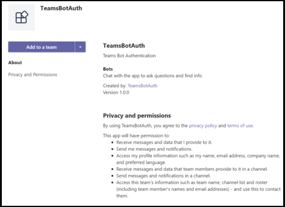

# <a name="add-authentication-to-your-teams-bot"></a>向自动程序Teams身份验证

有时可能需要在可代表用户Microsoft Teams访问资源（如邮件服务）的聊天机器人。

本文演示如何使用基于 OAuth 2.0 的 Azure Bot Service v4 SDK 身份验证。 这使得开发能够基于用户凭据使用身份验证令牌的自动程序变得更简单。 所有这一切的关键是使用标识 **提供程序**，我们将在稍后看到。

OAuth 2.0 是 Azure Active Directory (Azure AD) 和许多其他身份标识提供程序用于身份验证和授权的开放标准。 对 OAuth 2.0 有基本的了解是在 Teams 中进行身份验证的先决条件。

有关[完整规范，请参阅 OAuth 2 Simplified](https://aka.ms/oauth2-simplified)了解基本信息，请参阅[OAuth 2.0。](https://oauth.net/2/)

有关 Azure Bot 服务如何处理身份验证的信息，请参阅对话 [中的用户身份验证](https://aka.ms/azure-bot-authentication)。

在本文中，您将了解：

- **如何创建启用身份验证的机器人**。 你将使用 [cs-auth-sample][teams-auth-bot-cs] 来处理用户登录凭据和生成身份验证令牌。
- **如何将机器人部署到 Azure 并将其与标识提供程序关联**。 提供程序根据用户登录凭据颁发令牌。 机器人可以使用令牌访问需要身份验证的资源，如邮件服务。 有关详细信息，请参阅[Microsoft Teams的身份验证流](auth-flow-bot.md)。
- **如何将自动程序集成到 Microsoft Teams。** 集成自动程序后，可以在聊天中登录并交换消息。

## <a name="prerequisites"></a>先决条件

- 了解[自动程序基础知识][concept-basics][、管理状态][concept-state][、对话框库][concept-dialogs]以及如何[实现顺序对话流][simple-dialog]。
- 了解 Azure 和 OAuth 2.0 开发。
- 当前版本的 Visual Studio 和 Git。
- Azure 帐户。 如果需要，你可以创建 Azure [免费帐户](https://azure.microsoft.com/free/)。
- 以下示例。

    | 示例 | BotBuilder 版本 | 演示 |
    |:---|:---:|:---|
    |  [cs-auth-sample 中的自动程序身份验证][teams-auth-bot-cs] | v4 | OAuthCard 支持 |
    |  [js-auth-sample 中的自动程序身份验证][teams-auth-bot-js] | v4| OAuthCard 支持  |
    |  [py-auth-sample 中的自动程序身份验证][teams-auth-bot-py] | v4 | OAuthCard 支持 |

## <a name="create-the-resource-group"></a>创建资源组

资源组和服务计划并非严格必需的，但它们允许您便捷地释放您创建的资源。 这是保持资源有序且易于管理的良好做法。

使用资源组为 Bot Framework 创建单个资源。 为了提高性能，请确保这些资源位于同一 Azure 区域。

1. 在浏览器中，登录到 Azure [**门户**][azure-portal]。
1. 在左侧导航面板中，选择"**资源组"。**
1. 在显示窗口的左上角，选择" **添加** "选项卡以创建新的资源组。 系统将提示你提供以下内容：
    1. **订阅**。 使用现有订阅。
    1. **资源组**。 输入资源组的名称。 例如  *，TeamsResourceGroup*。 请记住，该名称必须是唯一的。
    1. 从" **区域** "下拉菜单中，选择" *美国* 西部"或靠近应用程序的区域。
    1. 选择" **审阅并创建"** 按钮。 你应该会看到一个横幅，显示 *"验证通过"。*
    1. 选择" **创建"** 按钮。 可能需要几分钟时间才能创建资源组。

> [!TIP]
> 与本教程稍后将创建的资源一样，建议将此资源组固定到仪表板以轻松访问。 如果你希望这样做，请选择固定图标&#128204;位于仪表板的右上角。

## <a name="create-the-service-plan"></a>创建服务计划

1. 在 [**Azure 门户的**][azure-portal]左侧导航面板上，选择"**创建资源"。**
1. 在搜索框中，键入 *应用服务计划*。 从 **搜索结果中选择"应用** 服务计划"卡。
1. 选择 **创建**。
1. 将要求您提供以下信息：
    1. **订阅**。 可以使用现有订阅。
    1. **资源组**。 选择之前创建的组。
    1. **名称**。 输入服务计划的名称。 例如  *，TeamsServicePlan*。 请记住，该名称在组内必须是唯一的。
    1. **操作系统**。 选择 *Windows* 或适用的操作系统。
    1. **区域**。 选择 *"美国* 西部"或"靠近你的应用程序的区域"。
    1. **定价层**。 确保选中 *"标准 S1"。* 此值应为默认值。
    1. 选择" **审阅并创建"** 按钮。 你应该会看到一个横幅，显示 *"验证通过"。*
    1. 选择 **创建**。 创建应用服务计划可能需要几分钟时间。 计划将在资源组中列出。

## <a name="create-the-bot-channels-registration"></a>创建自动程序通道注册

自动程序通道注册将你的 Web 服务注册为 Bot Framework 的自动程序，只要你拥有 Microsoft 应用 ID 和应用密码 (客户端密码) 。

> [!IMPORTANT]
> 如果你的机器人未托管在 Azure 中，则只需注册它。 如果你通过 Azure [门户](/azure/bot-service/abs-quickstart?view=azure-bot-service-4.0&viewFallbackFrom=azure-bot-service-3.0&preserve-view=true) 创建了自动程序，则它已在服务中注册。 如果你通过 Bot [Framework](https://dev.botframework.com/bots/new) 或 [AppStudio](~/concepts/build-and-test/app-studio-overview.md) 创建了自动程序，你的机器人不会在 Azure 中注册。

[!INCLUDE [bot channels registration steps](~/includes/bots/azure-bot-channels-registration.md)]

> [!NOTE]
> Bot Channels Registration 资源将显示 **全局区域** ，即使你选择了美国西部。 这是预期结果。

有关详细信息，请参阅为用户[创建自动程序Teams。](../create-a-bot-for-teams.md)

## <a name="create-the-identity-provider"></a>创建标识提供程序

您需要一个可用于身份验证的标识提供程序。
在此过程中，你将使用 Azure AD 提供程序;其他 Azure AD 支持的标识提供程序也可使用。

1. 在 [**Azure 门户的**][azure-portal]左侧导航面板上，选择 **"Azure Active Directory"。**
    > [!TIP]
    > 你需要在租户中创建和注册此 Azure AD 资源，你可以同意委派应用程序请求的权限。
    > 有关创建租户的说明，请参阅 [访问门户并创建租户](/azure/active-directory/fundamentals/active-directory-access-create-new-tenant)。
1. 在左侧面板中，选择 **"应用注册"。**
1. 在右侧面板中，选择左上角 **的** "新建注册"选项卡。
1. 将要求您提供以下信息：
   1. **名称**。 输入应用程序的名称。 例如  *，BotTeamsIdentity*。 请记住，该名称必须是唯一的。
   1. 选择 **应用程序支持** 的帐户类型。 选择任何组织目录中的帐户 (任何 Azure AD 目录 - 多租户) 和个人 Microsoft 帐户 *(例如 Skype、Xbox) 。*
   1. 对于 **重定向 URI：**<br/>
       &#x2713;选择 **Web。** <br/>
       &#x2713;将 URL 设置为 `https://token.botframework.com/.auth/web/redirect` 。
   1. 选择“**注册**”。

1. 创建后，Azure 将显示 **应用的"** 概述"页。 将以下信息复制并保存到文件中：

    1. Application **(客户端) ID** 值。 稍后在自动程序中注册此 Azure标识应用程序时，将此值用作客户端 ID。
    1. 租户 **的 (ID) ID** 值。 稍后，你还将使用此值作为 *租户 ID，* 向自动程序注册此 Azure 标识应用程序。

1. 在左侧面板中， **选择** "&密码"，为应用程序创建客户端密码。

   1. 在 **"客户端密码**"下 **，&#x2795;"新建客户端密码"。**
   1. 添加描述以从可能需要为此应用创建的其他人（例如，Teams 中的自动程序 *标识应用）标识此Teams。*
   1. 设置 **到期** 到你的选择。
   1. 选择“**添加**”。
   1. 在离开此页面之前， **请记录密码**。 稍后，当你向自动程序注册 Azure  AD 应用程序时，你将使用此值作为客户端密码。

### <a name="configure-the-identity-provider-connection-and-register-it-with-the-bot"></a>配置标识提供程序连接，然后向自动程序注册该连接

注意-此处有两个适用于服务提供商的选项-Azure AD V1 和 Azure AD V2。  此处总结了两个提供程序之间的差异，但通常[](https://docs.microsoft.com/azure/active-directory/azuread-dev/azure-ad-endpoint-comparison)V2 在更改自动程序权限方面提供了更大的灵活性。  GraphAPI 权限在范围字段中列出，当添加新权限时，自动程序将允许用户在下次登录时同意新权限。  对于 V1，用户必须删除自动程序同意，才能在 OAuth 对话框中提示新权限。 

#### <a name="azure-ad-v1"></a>Azure AD V1

1. 在 [**Azure 门户中**][azure-portal]，从仪表板中选择资源组。
1. 选择自动程序通道注册链接。
1. 打开资源页，**然后选择"配置****"设置。** 
1. 选择 **"添加 OAuth 连接设置"。**    
下图显示了资源页中的相应选择：  

1. 如下所示完成表单：

    1. **名称**。 输入连接的名称。 你将在文件的自动程序中使用此 `appsettings.json` 名称。 例如 *BotTeamsAuthADv1*。
    1. **服务提供程序**。 选择 **Azure Active Directory**。 选择此选项后，将显示特定于 Azure AD 的字段。
    1. **客户端 ID**。在以上 (中) 为 Azure 标识提供程序应用记录的应用程序客户端标识 ID。
    1. **客户端密码**。 在以上步骤中输入为 Azure 标识提供程序应用记录机密。
    1. **授予类型**。 输入 `authorization_code` 。
    1. **登录 URL**。 输入 `https://login.microsoftonline.com` 。
    1. **"租户 ID"， (** 之前为 Azure 标识应用录制的目录或租户) ID，具体取决于创建标识提供程序应用时选择的支持的帐户类型。  要决定要分配的值，请遵循以下条件：

        - 如果你选择了仅 *(Microsoft* 组织目录中的帐户 - 单租户) 或任何组织目录 (*Microsoft AAD* 目录 - 多租户) 请输入之前为 AAD 应用记录的租户 **ID。** 这将是与可以进行身份验证的用户关联的租户。

        - 如果在任意组织目录中选择了"帐户 (任何 AAD 目录 - 多租户和个人 Microsoft 帐户（例如 *Skype、Xbox）Outlook)* 输入 common 一词，而不是租户ID。 否则，AAD 应用会通过已选择 ID 的租户进行验证，并排除个人 Microsoft 帐户。

    h. 对于 **"资源 URL"，** 输入 `https://graph.microsoft.com/` 。 当前代码示例中没有使用此功能。  
    i. 将 **"范围"** 留空。 下图是一个示例：

    

1. 选择 **保存**。

#### <a name="azure-ad-v2"></a>Azure AD V2

1. 在 [**Azure 门户中**][azure-portal]，从仪表板中选择资源组。
1. 选择自动程序通道注册链接。
1. 打开资源页，**然后选择"配置****"设置。** 
1. 选择 **"添加 OAuth 连接设置"。**  
下图显示了资源页中的相应选择：        
 

1. 如下所示完成表单：

    1. **名称**。 输入连接的名称。 你将在文件的自动程序中使用此 `appsettings.json` 名称。 例如 *BotTeamsAuthADv2*。
    1. **服务提供程序**。 选择 **"Azure Active Directory v2"。** 选择此选项后，将显示特定于 Azure AD 的字段。
    1. **客户端 ID**。在以上 (中) 为 Azure 标识提供程序应用记录的应用程序客户端标识 ID。
    1. **客户端密码**。 在以上步骤中输入为 Azure 标识提供程序应用记录机密。
    1. **令牌Exchange URL**。 保留此为空白。
    1. **"租户 ID"， (** 之前为 Azure 标识应用录制的目录或租户) ID，具体取决于创建标识提供程序应用时选择的支持的帐户类型。  要决定要分配的值，请遵循以下条件：

        - 如果你选择了仅 *(Microsoft* 组织目录中的帐户 - 单租户) 或任何组织目录 (*Microsoft AAD* 目录 - 多租户) 请输入之前为 AAD 应用记录的租户 **ID。** 这将是与可以进行身份验证的用户关联的租户。

        - 如果在任意组织目录中选择了"帐户 (任何 AAD 目录 - 多租户和个人 Microsoft 帐户（例如 *Skype、Xbox）Outlook)* 输入 common 一词，而不是租户ID。 否则，AAD 应用会通过已选择 ID 的租户进行验证，并排除个人 Microsoft 帐户。

    1. 对于 **Scopes，** 输入此应用程序所需的图形权限的空格分隔列表，例如：User.Read User.ReadBasic.All Mail.Read 

1. 选择 **保存**。

### <a name="test-the-connection"></a>测试连接

1. 选择连接条目以打开刚创建的连接。
1. 选择 **"服务提供商** 连接设置"面板顶部的 **"测试连接** "。
1. 第一次这样做时，将打开一个新的浏览器窗口，要求你选择帐户。 选择您想要使用的人。
1. 接下来，将要求你允许标识提供程序使用你的数据 (凭据) 。 下图是一个示例：

    

1. 选择 **接受**。
1. 然后，这会将您重定向到" **测试连接成功 \<your-connection-name> "** 页。 如果收到错误，请刷新页面。 下图是一个示例：

  

自动程序代码使用连接名称检索用户身份验证令牌。

## <a name="prepare-the-bot-sample-code"></a>准备自动程序示例代码

完成初步设置后，让我们着重介绍本文中要使用的机器人的创建。

# <a name="cnet"></a>[C#/.NET](#tab/dotnet)

1. 克隆 [cs-auth-sample][teams-auth-bot-cs]。
1. 启动Visual Studio。
1. 从工具栏中选择文件 **-> 打开 -> Project/解决方案** 并打开自动程序项目。
1. 在C#更新 **appsettings.js如下所示** 打开：

    - 设置为 `ConnectionName` 添加到自动程序通道注册的标识提供程序连接的名称。 此示例中使用的名称是 *BotTeamsAuthADv1*。
    - 设置为 `MicrosoftAppId` 在 **自动程序** 通道注册时保存的自动程序应用 ID。
    - 设置为 `MicrosoftAppPassword` 在 **自动程序** 频道注册时保存的客户密码。

    根据自动程序密码中的字符，可能需要对密码进行 XML 转义。 例如，任何与 (&) 需要编码为 `&amp;` 。

     [!code-json[appsettings](~/../botbuilder-samples/samples/csharp_dotnetcore/46.teams-auth/appsettings.json?range=1-5)]

1. 在"解决方案资源管理器"中，导航到文件夹，打开并设置 ，然后转到在自动程序通道注册时保存的 `TeamsAppManifest` `manifest.json` `id` `botId` 自动程序应用 ID。 

# <a name="javascript"></a>[JavaScript](#tab/node-js)

1. 克隆 [node-auth-sample][teams-auth-bot-js]。
1. 在控制台中，导航到项目： </br></br>
`cd samples/javascript_nodejs/46.teams`  
1. 安装模块</br></br>
`npm install`
1. 更新 **.env** 配置，如下所示：

    - 设置为 `MicrosoftAppId` 在 **自动程序** 通道注册时保存的自动程序应用 ID。
    - 设置为 `MicrosoftAppPassword` 在 **自动程序** 频道注册时保存的客户密码。
    - 将 `connectionName` 设置为标识提供程序连接的名称。
    根据自动程序密码中的字符，可能需要对密码进行 XML 转义。 例如，任何与 (&) 需要编码为 `&amp;` 。

     [!code-javascript[settings](~/../botbuilder-samples/samples/javascript_nodejs/46.teams-auth/.env)]

1. 在文件夹中，打开并设置为 Microsoft 应用 ID 以及你在自动程序通道注册时保存的 `teamsAppManifest` `manifest.json` `id`  `botId` 自动程序应用ID。

# <a name="python"></a>[Python](#tab/python)

1. 从[github 存储库中克隆 py-auth-sample。][teams-auth-bot-py]
1. 更新 **config.py：**

    - 设置为 `ConnectionName` 添加到自动程序中的 OAuth 连接设置的名称。
    - 将 `MicrosoftAppId` 和 `MicrosoftAppPassword` 设置为自动程序的应用 ID 和应用密码。

      根据自动程序密码中的字符，可能需要对密码进行 XML 转义。 例如，任何与 (&) 需要编码为 `&amp;` 。

      [!code-python[config](~/../botbuilder-samples/samples/python/46.teams-auth/config.py?range=14-16)]

---

### <a name="deploy-the-bot-to-azure"></a>将机器人部署到 Azure

若要部署机器人，请按照如何将机器人部署到 [Azure 中的步骤操作](https://aka.ms/azure-bot-deployment-cli)。

或者，在Visual Studio时，可以执行以下步骤：

1. In Visual Studio *Solution Explorer* select and hold (or right-click) the project name.
1. 在下拉菜单中，选择"发布 **"。**
1. 在显示的窗口中，选择"新建 **"** 链接。
1. 在对话框窗口中，选择左侧 **的应用服务** ，在右侧 **选择新建** 。
1. 选择" **发布"** 按钮。
1. 在下一个对话框窗口中，输入所需信息。 示例如下：

   

1. 选择 **创建**。
1. 如果部署成功完成，则应该会看到部署Visual Studio。 此外，默认浏览器中会显示一个页面，*指出自动程序已准备就绪！。* URL 将类似于 `https://botteamsauth.azurewebsites.net/` ：。 将其保存到文件中。
1. 在浏览器中，导航到 [**Azure 门户**][azure-portal]。
1. 检查你的资源组，应列出自动程序以及其他资源。 下图是一个示例：

    

1. 在资源组中，选择自动程序通道注册 (链接) 。
1. 在左侧面板中，选择 **"设置"。**
1. 在" **消息终结点** "框中，输入上面获得的 URL，后跟 `api/messages` 。 这是一个示例 `https://botteamsauth.azurewebsites.net/api/messages` ：。
1. 选择左上角 **的"** 保存"按钮。

## <a name="test-the-bot-using-the-emulator"></a>使用仿真器测试机器人

如果尚未执行，请安装[Microsoft Bot Framework Emulator。](https://aka.ms/bot-framework-emulator-readme) 另请参阅 [使用仿真器调试](https://aka.ms/bot-framework-emulator-debug-with-emulator)。

为了让自动程序示例登录正常工作，必须配置仿真器，如下所示。

### <a name="configure-the-emulator-for-authentication"></a>配置仿真器进行身份验证

如果机器人需要身份验证，则必须按如下所示配置仿真器。

1. 启动仿真器。
1. 在仿真器中，选择&#9881;左下角的齿轮图标，或选择右上角设置仿真器"选项卡。
1. 选中"使用 **版本 1.0 身份验证令牌"复选框**。
1. 输入 **ngrok** 工具的本地路径。 *请参阅* Bot Framework Emulator /ngrok 隧道集成 [Wiki。](https://github.com/Microsoft/BotFramework-Emulator/wiki/Tunneling-(ngrok)) 有关详细信息，请参阅 [ngrok](https://ngrok.com/)。
1. 当仿真器启动时 **，选中"运行 ngrok"框**。
1. 选择" **保存"** 按钮。

当机器人显示登录卡并且用户选择登录按钮时，仿真器将打开一个页面，用户可使用该页面登录身份验证提供程序。
一旦用户这样做，提供程序将生成用户令牌并将其发送给机器人。 之后，机器人可以代表用户操作。

### <a name="test-the-bot-locally"></a>在本地测试机器人

配置身份验证机制后，可以执行实际的自动程序测试。  

1. 例如，通过 Visual Studio计算机上本地运行自动程序示例。
1. 启动仿真器。
1. 选择" **打开自动程序"** 按钮。
1. 在自动 **程序 URL** 中，输入机器人的本地 URL。 通常为 `http://localhost:3978/api/messages` 。
1. 在 **Microsoft 应用 ID 中** ，从 输入机器人的应用 `appsettings.json` ID。
1. 在 **Microsoft 应用密码中** ，从 输入自动程序的应用密码 `appsettings.json` 。
1. 选择 **"连接"。**
1. 启动并运行自动程序后，输入任何文本以显示登录卡。
1. 选择" **登录"** 按钮。
1. 将显示一个弹出对话框以确认打开 **URL。** 这是为了允许自动程序的用户 () 进行身份验证。  
1. 选择“**确认**”。
1. 如果系统询问，请选择适用的用户帐户。
1. 根据用于模拟器的配置，你可以获取以下选项之一：
    1. **使用登录验证码**  
      &#x2713;打开一个显示验证代码的窗口。  
      &#x2713;将验证代码复制并输入到聊天框中以完成登录。
    1. **使用身份验证令牌**。  
      &#x2713;基于凭据登录。

    下图是登录后自动程序 UI 的一个示例：

    

1. 如果在机器人 **询问"** 是否要查看令牌？"时选择"是 *"，* 你得到的响应如下所示：

    

1. 在 **输入聊天** 框中输入注销以注销。这将释放用户令牌，在重新登录之前，自动程序将无法代表你操作。

> [!NOTE]
> 自动程序身份验证需要使用 **Bot 连接器服务**。 该服务访问自动程序的自动程序通道注册信息。

## <a name="test-the-deployed-bot"></a>测试已部署的自动程序

<!--There are several testing scenarios here. Ideally, we'd have a separate article on the what, why, 
and when for these, and just reference that from here, along with the set of steps that exercises the bot code.-->

1. 在浏览器中，导航到 [**Azure 门户**][azure-portal]。
1. 查找资源组。
1. 选择资源链接。 将显示资源页。
1. 在资源页中，选择"**在 Web 聊天中测试"。** 自动程序启动并显示预定义的问候语。
1. 在聊天框中键入任何内容。
1. 选中 **"登录"** 框。
1. 将显示一个弹出对话框以确认打开 **URL。** 这是为了允许自动程序的用户 () 进行身份验证。  
1. 选择“**确认**”。
1. 如果系统询问，请选择适用的用户帐户。
    下图是登录后自动程序 UI 的示例：

    .

1. 选择" **是"** 按钮以显示身份验证令牌。 下图是一个示例：

    .

1. 输入注销以注销。

    

> [!NOTE]
> 如果登录时遇到问题，请尝试再次测试连接，如前面的步骤中所述。 这可重新创建身份验证令牌。
> 使用 Azure 中的 Bot Framework Web Chat 客户端，可能需要多次登录，然后才能正确建立身份验证。

## <a name="install-and-test-the-bot-in-teams"></a>安装并测试自动程序Teams

1. 在自动程序项目中，确保 `TeamsAppManifest` 文件夹包含 以及 `manifest.json` 和 `outline.png` `color.png` 文件。
1. 在"解决方案资源管理器"中，导航到 `TeamsAppManifest` 文件夹。 通过 `manifest.json` 分配以下值进行编辑：
    1. 确保将 **你在自动** 程序通道注册时收到的自动程序应用 ID 分配给 `id` 和 `botId` 。
    1. 分配此值 `validDomains: [ "token.botframework.com" ]` ：。
1. 选择 并 **压缩** `manifest.json` 、 和 `outline.png` `color.png` 文件。
1. 打开 **Microsoft Teams**。
1. 在左侧面板的底部，选择应用 **图标**。
1. 在右侧面板的底部，选择 **"Upload应用"。**
1. 导航到 `TeamsAppManifest` 文件夹并上载压缩的清单。
将显示以下向导：

    

1. 选择“**添加到团队**”按钮。
1. In the next window， select the team where you want to use the bot.
1. 选择" **设置自动程序"** 按钮。
1. 选择左面板 (&#x25cf;&#x25cf;&#x25cf;) 三个点。 然后选择 **App Studio** 图标。
1. 选择清单 **编辑器** 选项卡。你应该会看到上传的自动程序图标。
1. 此外，你应该能够看到聊天列表中列为联系人的聊天机器人，可用于与聊天机器人交换消息。

### <a name="testing-the-bot-locally-in-teams"></a>在本地测试聊天机器人Teams

Microsoft Teams完全基于云的产品，它要求它访问的所有服务都使用 HTTPS 终结点从云中提供。 因此，若要使自动程序 (我们的示例) 在 Teams 中工作，你需要将代码发布到你选择的云，或通过隧道工具使本地运行的实例可从外部访问。  我们建议  [使用 ngrok，](https://ngrok.com/download)这将为计算机上本地打开的端口创建一个外部可地址 URL。
若要设置 ngrok 以准备在本地运行 Microsoft Teams 应用，请按照以下步骤操作：

1. 在终端窗口中，转到已安装的 `ngrok.exe` 目录。 我们建议将 *环境变量* 路径设置为指向该路径。
1. 运行，例如 `ngrok http 3978 --host-header=localhost:3978` ， 。 根据需要替换端口号。
这将启动 ngrok 以侦听你指定的端口。 作为返回，它会为你提供一个外部可地址 URL，只要 ngrok 正在运行，该 URL 就有效。 下图是一个示例：

    .

1. 复制转发 HTTPS 地址。 它应类似于以下内容 `https://dea822bf.ngrok.io/` ：。
1. Append `/api/messages` 以获取 `https://dea822bf.ngrok.io/api/messages` 。 这是自动 **程序** 在计算机本地运行的消息终结点，在 Microsoft Teams 聊天中可Microsoft Teams。
1. 要执行的最后一步是更新已部署机器人的消息终结点。 在示例中，我们在 Azure 中部署了机器人。 因此，让我们执行以下步骤：
    1. 在浏览器中导航到 [**Azure 门户**][azure-portal]。
    1. 选择自动 **程序频道注册**。
    1. 在左侧面板中，选择 **"设置"。**
    1. 在右侧面板的"消息 **终结点** "框中，输入 ngrok URL，在我们的示例中为 `https://dea822bf.ngrok.io/api/messages` 。
1. 在本地启动自动程序，例如，在Visual Studio模式下。
1. 使用 Bot Framework 门户的测试 Web 聊天在本地运行时 **测试机器人**。 与仿真器一样，此测试不允许你访问Teams功能。
1. 在运行的终端窗口中，你可以看到自动程序与 Web 聊天客户端之间的 `ngrok` HTTP 流量。 如果需要更详细的视图，请在浏览器窗口中输入从上一个终端 `http://127.0.0.1:4040` 窗口获取的视图。 下图是一个示例：

    .

> [!NOTE]
> 如果停止并重新启动 ngrok，URL 将发生更改。 若要在项目中使用 ngrok，并且根据您使用的功能，您必须更新所有 URL 引用。
 

## <a name="additional-information"></a>其他信息

### <a name="teamsappmanifestmanifestjson"></a>TeamsAppManifest/manifest.js打开

此清单包含用户Microsoft Teams自动程序连接时需要的信息。  

```json
{
  "$schema": "https://developer.microsoft.com/json-schemas/teams/v1.8/MicrosoftTeams.schema.json",
  "manifestVersion": "1.5",
  "version": "1.0.0",
  "id": "",
  "packageName": "com.teams.auth.bot",
  "developer": {
    "name": "TeamsBotAuth",
    "websiteUrl": "https://www.microsoft.com",
    "privacyUrl": "https://www.teams.com/privacy",
    "termsOfUseUrl": "https://www.teams.com/termsofuse"
  },
  "icons": {
    "color": "color.png",
    "outline": "outline.png"
  },
  "name": {
    "short": "TeamsBotAuth",
    "full": "Teams Bot Authentication"
  },
  "description": {
    "short": "TeamsBotAuth",
    "full": "Teams Bot Authentication"
  },
  "accentColor": "#FFFFFF",
  "bots": [
    {
      "botId": "",
      "scopes": [
        "groupchat",
        "team"
      ],
      "supportsFiles": false,
      "isNotificationOnly": false
    }
  ],
  "permissions": [
    "identity",
    "messageTeamMembers"
  ],
  "validDomains": [ "token.botframework.com" ]
}
```

使用身份验证Teams与其他通道的行为稍有不同，如下所述。

### <a name="handling-invoke-activity"></a>处理调用活动

将 **Invoke 活动** 发送到机器人，而不是其他频道使用的事件活动。
这是通过对 **ActivityHandler 进行子类化完成**。

# <a name="cnet"></a>[C#/.NET](#tab/dotnet-sample)

**Bots/DialogBot.cs**

[!code-csharp[ActivityHandler](~/../botbuilder-samples/samples/csharp_dotnetcore/46.teams-auth/Bots/DialogBot.cs?range=19-51)]

**Bots/TeamsBot.cs**

如果使用 **OAuthPrompt，** 则必须将 Invoke 活动转发到对话框。 

[!code-csharp[ActivityHandler](~/../botbuilder-samples/samples/csharp_dotnetcore/46.teams-auth/Bots/TeamsBot.cs?range=34-42)]

#### <a name="teamsactivityhandlercs"></a>TeamsActivityHandler.cs

```csharp

protected virtual Task OnInvokeActivityAsync(ITurnContext<IInvokeActivity> turnContext, CancellationToken cancellationToken)
{
    switch (turnContext.Activity.Name)
    {
        case "signin/verifyState":
            return OnSigninVerifyStateAsync(turnContext, cancellationToken);

        default:
            return Task.CompletedTask;
    }
}

protected virtual Task OnSigninVerifyStateAsync(ITurnContext<IInvokeActivity> turnContext, CancellationToken cancellationToken)
{
    return Task.CompletedTask;
}
```

# <a name="javascript"></a>[JavaScript](#tab/node-js-dialog-sample)

**bots/dialogBot.js**

[!code-javascript[ActivityHandler](~/../botbuilder-samples/samples/javascript_nodejs/46.teams-auth/bots/dialogBot.js?range=4-46)]

**bots/teamsBot.js**

如果使用 **OAuthPrompt，** 则必须将 Invoke 活动转发到对话框。 

[!code-javascript[ActivityHandler](~/../botbuilder-samples/samples/javascript_nodejs/46.teams-auth/bots/teamsBot.js?range=4-33)]

**dialogs/mainDialog.js**

在对话框步骤中， `beginDialog` 使用 启动 OAuth 提示，该提示要求用户登录。

- 如果用户已登录，这将生成令牌响应事件，而不会提示用户。
- 否则，将提示用户登录。 Azure Bot 服务在用户尝试登录后发送令牌响应事件。

[!code-javascript[AddOAuthPrompt](~/../botbuilder-samples/samples/javascript_nodejs/46.teams-auth/dialogs/mainDialog.js?range=50-52)]

在下面的对话框步骤中，检查上一步的结果中是否存在令牌。 如果不是 null，则用户已成功登录。

[!code-javascript[AddOAuthPrompt](~/../botbuilder-samples/samples/javascript_nodejs/46.teams-auth/dialogs/mainDialog.js?range=50-64)]

**bots/logoutDialog.js**

[!code-javascript[allow-logout](~/../botbuilder-samples/samples/javascript_nodejs/46.teams-auth/dialogs/logoutDialog.js?range=31-42&highlight=7)]

# <a name="python"></a>[Python](#tab/python-sample)

**bots/dialog_bot.py**

[!code-python[ActivityHandler](~/../botbuilder-samples/samples/python/46.teams-auth/bots/dialog_bot.py?range=10-42)]

**bots/teams_bot.py**

如果使用 **OAuthPrompt，** 则必须将 Invoke 活动转发到对话框。 

[!code-python[on_token_response_event](~/../botbuilder-samples/samples/python/46.teams-auth/bots/teams_bot.py?range=38-45)]

**dialogs/main_dialog.py**

在对话框步骤中， `begin_dialog` 使用 启动 OAuth 提示，该提示要求用户登录。

- 如果用户已登录，这将生成令牌响应事件，而不会提示用户。
- 否则，将提示用户登录。 Azure Bot 服务在用户尝试登录后发送令牌响应事件。

[!code-python[Add OAuthPrompt](~/../botbuilder-samples/samples/python/46.teams-auth/dialogs/main_dialog.py?range=48-49)]

在下面的对话框步骤中，检查上一步的结果中是否存在令牌。 如果不是 null，则用户已成功登录。

[!code-python[Add OAuthPrompt](~/../botbuilder-samples/samples/python/46.teams-auth/dialogs/main_dialog.py?range=51-61)]

**dialogs/logout_dialog.py**

[!code-python[allow logout](~/../botbuilder-samples/samples/python/46.teams-auth/dialogs/logout_dialog.py?range=29-36&highlight=6)]

---

> [!div class="nextstepaction"]
> [了解如何通过 Azure Bot 服务添加身份验证](https://aka.ms/azure-bot-add-authentication)

<!-- Footnote-style links -->

[azure-portal]: https://ms.portal.azure.com

[concept-basics]: https://docs.microsoft.com/azure/bot-service/bot-builder-basics?view=azure-bot-service-4.0&preserve-view=true
[concept-state]: https://docs.microsoft.com/azure/bot-service/bot-builder-concept-state?view=azure-bot-service-4.0&preserve-view=true
[concept-dialogs]: https://docs.microsoft.com/azure/bot-service/bot-builder-concept-dialog?view=azure-bot-service-4.0&preserve-view=true
[simple-dialog]: https://docs.microsoft.com/azure/bot-service/bot-builder-dialog-manage-conversation-flow?view=azure-bot-service-4.0&preserve-view=true

[teams-auth-bot-cs]: https://github.com/microsoft/BotBuilder-Samples/tree/master/samples/csharp_dotnetcore/46.teams-auth

[teams-auth-bot-py]: https://github.com/microsoft/BotBuilder-Samples/tree/master/samples/python/46.teams-auth

[teams-auth-bot-js]: https://github.com/microsoft/BotBuilder-Samples/tree/master/samples/javascript_nodejs/46.teams-auth

[azure-aad-blade]: https://ms.portal.azure.com/#blade/Microsoft_AAD_IAM/ActiveDirectoryMenuBlade/Overview
[aad-registration-blade]: https://ms.portal.azure.com/#blade/Microsoft_AAD_IAM/ActiveDirectoryMenuBlade/RegisteredAppsPreview
