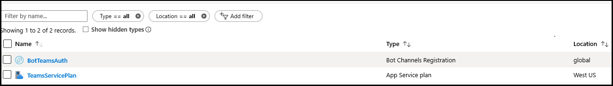

# <a name="add-authentication-to-your-teams-bot"></a><span data-ttu-id="ccfc4-103">向你的团队 bot 添加身份验证</span><span class="sxs-lookup"><span data-stu-id="ccfc4-103">Add authentication to your Teams bot</span></span>

<span data-ttu-id="ccfc4-104">有时，您可能需要在 Microsoft 团队中创建可代表用户访问资源的 bot，如邮件服务。</span><span class="sxs-lookup"><span data-stu-id="ccfc4-104">There are times when you may need to create bots in Microsoft Teams that can access resources on behalf of the user, such as a mail service.</span></span>

<span data-ttu-id="ccfc4-105">本文演示如何使用基于 OAuth 2.0 的 Azure Bot 服务 v4 SDK 身份验证。</span><span class="sxs-lookup"><span data-stu-id="ccfc4-105">This article demonstrates how to use Azure Bot Service v4 SDK authentication, based on OAuth 2.0.</span></span> <span data-ttu-id="ccfc4-106">这样，就可以更轻松地开发可使用基于用户凭据的身份验证令牌的 bot。</span><span class="sxs-lookup"><span data-stu-id="ccfc4-106">This makes it easier to develop a bot that can use authentication tokens based on the user's credentials.</span></span> <span data-ttu-id="ccfc4-107">关键是使用**标识提供程序**，因为我们将在后面看到。</span><span class="sxs-lookup"><span data-stu-id="ccfc4-107">Key in all this is the use of **identity providers**, as we will see later.</span></span>

<span data-ttu-id="ccfc4-108">OAuth 2.0 是一种开放的标准，用于 Azure Active Directory （Azure AD）和许多其他标识提供程序使用的身份验证和授权。</span><span class="sxs-lookup"><span data-stu-id="ccfc4-108">OAuth 2.0 is an open standard for authentication and authorization used by Azure Active Directory (Azure AD) and many other identity providers.</span></span> <span data-ttu-id="ccfc4-109">对 OAuth 2.0 的基本了解是在团队中使用身份验证的先决条件。</span><span class="sxs-lookup"><span data-stu-id="ccfc4-109">A basic understanding of OAuth 2.0 is a prerequisite for working with authentication in Teams.</span></span>

<span data-ttu-id="ccfc4-110">有关基本了解，请参阅[oauth 2 已简化](https://aka.ms/oauth2-simplified)，有关完整规范，则为[oauth 2.0](https://oauth.net/2/) 。</span><span class="sxs-lookup"><span data-stu-id="ccfc4-110">See [OAuth 2 Simplified](https://aka.ms/oauth2-simplified) for a basic understanding, and [OAuth 2.0](https://oauth.net/2/) for the complete specification.</span></span>

<span data-ttu-id="ccfc4-111">有关 Azure Bot 服务如何处理身份验证的详细信息，请参阅[对话中的用户身份验证](https://aka.ms/azure-bot-authentication)。</span><span class="sxs-lookup"><span data-stu-id="ccfc4-111">For more information about how the Azure Bot Service handles authentication, see [User authentication within a conversation](https://aka.ms/azure-bot-authentication).</span></span>

<span data-ttu-id="ccfc4-112">在本文中，您将了解：</span><span class="sxs-lookup"><span data-stu-id="ccfc4-112">In this article you'll learn:</span></span>

- <span data-ttu-id="ccfc4-113">**如何创建启用身份验证的 bot**。</span><span class="sxs-lookup"><span data-stu-id="ccfc4-113">**How to create an authentication-enabled bot**.</span></span> <span data-ttu-id="ccfc4-114">你将使用[cs-auth 示例][teams-auth-bot]来处理用户登录凭据和生成身份验证令牌。</span><span class="sxs-lookup"><span data-stu-id="ccfc4-114">You'll use [cs-auth-sample][teams-auth-bot] to handle user sign-in credentials and the generating the authentication token.</span></span>
- <span data-ttu-id="ccfc4-115">**如何将机器人部署到 Azure 并将其与标识提供程序关联**。</span><span class="sxs-lookup"><span data-stu-id="ccfc4-115">**How to deploy the bot to Azure and associate it with an identity provider**.</span></span> <span data-ttu-id="ccfc4-116">提供程序根据用户登录凭据发出令牌。</span><span class="sxs-lookup"><span data-stu-id="ccfc4-116">The provider issues a token based on user sign-in credentials.</span></span> <span data-ttu-id="ccfc4-117">Bot 可以使用令牌访问需要身份验证的资源，如邮件服务。</span><span class="sxs-lookup"><span data-stu-id="ccfc4-117">The bot can use the token to access resources, such as a mail service, which require authentication.</span></span> <span data-ttu-id="ccfc4-118">有关详细信息，请参阅[适用于 bot 的 Microsoft 团队身份验证流](auth-flow-bot.md)。</span><span class="sxs-lookup"><span data-stu-id="ccfc4-118">For more information see  [Microsoft Teams authentication flow for bots](auth-flow-bot.md).</span></span>
- <span data-ttu-id="ccfc4-119">**如何在 Microsoft 团队中集成机器人**。</span><span class="sxs-lookup"><span data-stu-id="ccfc4-119">**How to integrate the bot within Microsoft Teams**.</span></span> <span data-ttu-id="ccfc4-120">将 bot 集成后，可以在聊天中登录并与之交换邮件。</span><span class="sxs-lookup"><span data-stu-id="ccfc4-120">Once the bot has been integrated, you can sign in and exchange messages with it in a chat.</span></span>

## <a name="prerequisites"></a><span data-ttu-id="ccfc4-121">先决条件</span><span class="sxs-lookup"><span data-stu-id="ccfc4-121">Prerequisites</span></span>

- <span data-ttu-id="ccfc4-122">有关[机器人基础][concept-basics]知识、[管理状态][concept-state]、[对话框库][concept-dialogs]以及如何[实施顺序对话流][simple-dialog]的知识。</span><span class="sxs-lookup"><span data-stu-id="ccfc4-122">Knowledge of [bot basics][concept-basics], [managing state][concept-state], the [dialogs library][concept-dialogs], and how to [implement sequential conversation flow][simple-dialog].</span></span>
- <span data-ttu-id="ccfc4-123">Azure 和 OAuth 2.0 开发方面的知识。</span><span class="sxs-lookup"><span data-stu-id="ccfc4-123">Knowledge of Azure and OAuth 2.0 development.</span></span>
- <span data-ttu-id="ccfc4-124">Visual Studio 2017 或更高版本和 Git。</span><span class="sxs-lookup"><span data-stu-id="ccfc4-124">Visual Studio 2017 or later and Git.</span></span>
- <span data-ttu-id="ccfc4-125">Azure 帐户。</span><span class="sxs-lookup"><span data-stu-id="ccfc4-125">Azure account.</span></span> <span data-ttu-id="ccfc4-126">如果需要，可以创建[Azure 免费帐户](https://azure.microsoft.com/free/)。</span><span class="sxs-lookup"><span data-stu-id="ccfc4-126">If needed, you can create an [Azure free account](https://azure.microsoft.com/free/).</span></span>
- <span data-ttu-id="ccfc4-127">下面的示例。</span><span class="sxs-lookup"><span data-stu-id="ccfc4-127">The following sample.</span></span>

    | <span data-ttu-id="ccfc4-128">示例</span><span class="sxs-lookup"><span data-stu-id="ccfc4-128">Sample</span></span> | <span data-ttu-id="ccfc4-129">BotBuilder 版本</span><span class="sxs-lookup"><span data-stu-id="ccfc4-129">BotBuilder version</span></span> | <span data-ttu-id="ccfc4-130">示</span><span class="sxs-lookup"><span data-stu-id="ccfc4-130">Demonstrates</span></span> |
    |:---|:---:|:---|
    | <span data-ttu-id="ccfc4-131">Cs 中的**Bot 身份验证**- [auth-示例][teams-auth-bot]</span><span class="sxs-lookup"><span data-stu-id="ccfc4-131">**Bot authentication** in [cs-auth-sample][teams-auth-bot]</span></span> | <span data-ttu-id="ccfc4-132">v4</span><span class="sxs-lookup"><span data-stu-id="ccfc4-132">v4</span></span> | <span data-ttu-id="ccfc4-133">OAuthCard 支持</span><span class="sxs-lookup"><span data-stu-id="ccfc4-133">OAuthCard support</span></span> |
    | <span data-ttu-id="ccfc4-134">Python 中的**Bot 身份验证** [-auth-示例][teams-auth-bot-py]</span><span class="sxs-lookup"><span data-stu-id="ccfc4-134">**Bot authentication** in [python-auth-sample][teams-auth-bot-py]</span></span> | <span data-ttu-id="ccfc4-135">v4</span><span class="sxs-lookup"><span data-stu-id="ccfc4-135">v4</span></span> | <span data-ttu-id="ccfc4-136">OAuthCard 支持</span><span class="sxs-lookup"><span data-stu-id="ccfc4-136">OAuthCard support</span></span> |

## <a name="create-the-resource-group"></a><span data-ttu-id="ccfc4-137">创建资源组</span><span class="sxs-lookup"><span data-stu-id="ccfc4-137">Create the resource group</span></span>

<span data-ttu-id="ccfc4-138">资源组和服务计划不是必需的，但它们使您可以方便地释放所创建的资源。</span><span class="sxs-lookup"><span data-stu-id="ccfc4-138">The resource group and the service plan aren't strictly necessary, but they allow you to conveniently release the resources you create.</span></span> <span data-ttu-id="ccfc4-139">这对于保持资源的组织和可管理性来说是很好的做法。</span><span class="sxs-lookup"><span data-stu-id="ccfc4-139">This is good practice for keeping your resources organized and manageable.</span></span>

<span data-ttu-id="ccfc4-140">您可以使用资源组为 Bot 框架创建单独的资源。</span><span class="sxs-lookup"><span data-stu-id="ccfc4-140">You use a resource group to create individual resources for the Bot Framework.</span></span> <span data-ttu-id="ccfc4-141">为了提高性能，请确保这些资源位于同一个 Azure 区域中。</span><span class="sxs-lookup"><span data-stu-id="ccfc4-141">For performance, ensure that these resources are located in the same Azure region.</span></span>

1. <span data-ttu-id="ccfc4-142">在您的浏览器中，登录到[**Azure 门户**][azure-portal]。</span><span class="sxs-lookup"><span data-stu-id="ccfc4-142">In your browser, sign into the [**Azure portal**][azure-portal].</span></span>
1. <span data-ttu-id="ccfc4-143">在左侧导航窗格中，选择 "**资源组**"。</span><span class="sxs-lookup"><span data-stu-id="ccfc4-143">In the left navigation panel, select **Resource groups**.</span></span>
1. <span data-ttu-id="ccfc4-144">在显示的窗口的左上角，选择 "**添加**" 选项卡以创建新的资源组。</span><span class="sxs-lookup"><span data-stu-id="ccfc4-144">In the upper left of the displayed window, select **Add** tab to create a new resource group.</span></span> <span data-ttu-id="ccfc4-145">系统将提示你提供以下内容：</span><span class="sxs-lookup"><span data-stu-id="ccfc4-145">You'll be prompted to provide the following:</span></span>
    1. <span data-ttu-id="ccfc4-146">**订阅**。</span><span class="sxs-lookup"><span data-stu-id="ccfc4-146">**Subscription**.</span></span> <span data-ttu-id="ccfc4-147">使用现有订阅。</span><span class="sxs-lookup"><span data-stu-id="ccfc4-147">Use your existing subscription.</span></span>
    1. <span data-ttu-id="ccfc4-148">**资源组**。</span><span class="sxs-lookup"><span data-stu-id="ccfc4-148">**Resource group**.</span></span> <span data-ttu-id="ccfc4-149">输入资源组的名称。</span><span class="sxs-lookup"><span data-stu-id="ccfc4-149">Enter the name for the resource group.</span></span> <span data-ttu-id="ccfc4-150">例如， *TeamsResourceGroup*。</span><span class="sxs-lookup"><span data-stu-id="ccfc4-150">An example could be  *TeamsResourceGroup*.</span></span> <span data-ttu-id="ccfc4-151">请记住，该名称必须是唯一的。</span><span class="sxs-lookup"><span data-stu-id="ccfc4-151">Remember that the name must be unique.</span></span>
    1. <span data-ttu-id="ccfc4-152">从 "**区域**" 下拉菜单中，选择 "*美国西部*" 或 "接近您的应用程序的区域"。</span><span class="sxs-lookup"><span data-stu-id="ccfc4-152">From the **Region** drop-down menu, select *West US*, or a region close to your applications.</span></span>
    1. <span data-ttu-id="ccfc4-153">选择 "**查看" 和 "创建**" 按钮。</span><span class="sxs-lookup"><span data-stu-id="ccfc4-153">Select the **Review and create** button.</span></span> <span data-ttu-id="ccfc4-154">您应该会看到标题为 "已*通过验证*"。</span><span class="sxs-lookup"><span data-stu-id="ccfc4-154">You should see a banner that reads *Validation passed*.</span></span>
    1. <span data-ttu-id="ccfc4-155">选择 "**创建**" 按钮。</span><span class="sxs-lookup"><span data-stu-id="ccfc4-155">Select the **Create** button.</span></span> <span data-ttu-id="ccfc4-156">创建资源组可能需要几分钟的时间。</span><span class="sxs-lookup"><span data-stu-id="ccfc4-156">It may take a few minutes to create the resource group.</span></span>

> [!TIP]
> <span data-ttu-id="ccfc4-157">与本教程后面创建的资源一样，最好将此资源组固定到您的仪表板以便轻松访问。</span><span class="sxs-lookup"><span data-stu-id="ccfc4-157">As with the resources you'll create later in this tutorial, it's a good idea to pin this resource group to your dashboard for easy access.</span></span> <span data-ttu-id="ccfc4-158">如果您想要这样做，请选择 pin 图标 & # 128204;在仪表板的右上方。</span><span class="sxs-lookup"><span data-stu-id="ccfc4-158">If you'd like to do so, select the pin icon &#128204; in the upper right of the dashboard.</span></span>

## <a name="create-the-service-plan"></a><span data-ttu-id="ccfc4-159">创建服务计划</span><span class="sxs-lookup"><span data-stu-id="ccfc4-159">Create the service plan</span></span>

1. <span data-ttu-id="ccfc4-160">在[**Azure 门户**][azure-portal]的左侧导航窗格中，选择 "**创建资源**"。</span><span class="sxs-lookup"><span data-stu-id="ccfc4-160">In the [**Azure portal**][azure-portal], on the left navigation panel, select **Create a resource**.</span></span>
1. <span data-ttu-id="ccfc4-161">在 "搜索" 框中，键入*App Service Plan*。</span><span class="sxs-lookup"><span data-stu-id="ccfc4-161">In the search box, type *App Service Plan*.</span></span> <span data-ttu-id="ccfc4-162">从搜索结果中选择**应用服务计划**卡片。</span><span class="sxs-lookup"><span data-stu-id="ccfc4-162">Select the **App Service Plan** card from the search results.</span></span>
1. <span data-ttu-id="ccfc4-163">选择“**创建**”。</span><span class="sxs-lookup"><span data-stu-id="ccfc4-163">Select **Create**.</span></span>
1. <span data-ttu-id="ccfc4-164">系统将要求你提供以下信息：</span><span class="sxs-lookup"><span data-stu-id="ccfc4-164">You'll be asked to provide the following information:</span></span>
    1. <span data-ttu-id="ccfc4-165">**订阅**。</span><span class="sxs-lookup"><span data-stu-id="ccfc4-165">**Subscription**.</span></span> <span data-ttu-id="ccfc4-166">您可以使用现有订阅。</span><span class="sxs-lookup"><span data-stu-id="ccfc4-166">You can use an existing subscription.</span></span>
    1. <span data-ttu-id="ccfc4-167">**资源组**。</span><span class="sxs-lookup"><span data-stu-id="ccfc4-167">**Resource Group**.</span></span> <span data-ttu-id="ccfc4-168">选择之前创建的组。</span><span class="sxs-lookup"><span data-stu-id="ccfc4-168">Select the group you created earlier.</span></span>
    1. <span data-ttu-id="ccfc4-169">**名称**。</span><span class="sxs-lookup"><span data-stu-id="ccfc4-169">**Name**.</span></span> <span data-ttu-id="ccfc4-170">输入服务计划的名称。</span><span class="sxs-lookup"><span data-stu-id="ccfc4-170">Enter the name for the service plan.</span></span> <span data-ttu-id="ccfc4-171">例如， *TeamsServicePlan*。</span><span class="sxs-lookup"><span data-stu-id="ccfc4-171">An example could be  *TeamsServicePlan*.</span></span> <span data-ttu-id="ccfc4-172">请记住，此名称在组中必须是唯一的。</span><span class="sxs-lookup"><span data-stu-id="ccfc4-172">Remember that the name must be unique, within the group.</span></span>
    1. <span data-ttu-id="ccfc4-173">**操作系统**。</span><span class="sxs-lookup"><span data-stu-id="ccfc4-173">**Operating System**.</span></span> <span data-ttu-id="ccfc4-174">选择 " *Windows* " 或 "适用的操作系统"。</span><span class="sxs-lookup"><span data-stu-id="ccfc4-174">Select *Windows* or your applicable OS.</span></span>
    1. <span data-ttu-id="ccfc4-175">**区域**。</span><span class="sxs-lookup"><span data-stu-id="ccfc4-175">**Region**.</span></span> <span data-ttu-id="ccfc4-176">选择 "*西部*" 或 "区域接近您的应用程序"。</span><span class="sxs-lookup"><span data-stu-id="ccfc4-176">Select *West US* or a region close to your applications.</span></span>
    1. <span data-ttu-id="ccfc4-177">**定价层**。</span><span class="sxs-lookup"><span data-stu-id="ccfc4-177">**Pricing Tier**.</span></span> <span data-ttu-id="ccfc4-178">确保选择了 "*标准 S1* "。</span><span class="sxs-lookup"><span data-stu-id="ccfc4-178">Make sure that *Standard S1* is selected.</span></span> <span data-ttu-id="ccfc4-179">此值应为默认值。</span><span class="sxs-lookup"><span data-stu-id="ccfc4-179">This should be the default value.</span></span>
    1. <span data-ttu-id="ccfc4-180">选择 "**查看" 和 "创建**" 按钮。</span><span class="sxs-lookup"><span data-stu-id="ccfc4-180">Select the **Review and create** button.</span></span> <span data-ttu-id="ccfc4-181">您应该会看到标题为 "已*通过验证*"。</span><span class="sxs-lookup"><span data-stu-id="ccfc4-181">You should see a banner that reads *Validation passed*.</span></span>
    1. <span data-ttu-id="ccfc4-182">选择“**创建**”。</span><span class="sxs-lookup"><span data-stu-id="ccfc4-182">Select **Create**.</span></span> <span data-ttu-id="ccfc4-183">可能需要几分钟的时间来创建应用服务计划。</span><span class="sxs-lookup"><span data-stu-id="ccfc4-183">It may take a few minutes to create the app service plan.</span></span> <span data-ttu-id="ccfc4-184">该计划将列在资源组中。</span><span class="sxs-lookup"><span data-stu-id="ccfc4-184">The plan will be listed in the resource group.</span></span>

## <a name="create-the-bot-channels-registration"></a><span data-ttu-id="ccfc4-185">创建 bot 通道注册</span><span class="sxs-lookup"><span data-stu-id="ccfc4-185">Create the bot channels registration</span></span>

<span data-ttu-id="ccfc4-186">如果你有 Microsoft 应用 Id 和应用密码（客户端密码），bot 通道注册会将您的 web 服务注册为带有 Bot 框架的 bot。</span><span class="sxs-lookup"><span data-stu-id="ccfc4-186">The bot channels registration registers your web service as a bot with the Bot Framework, provided you have a Microsoft App Id and App password (client secret).</span></span>

> [!IMPORTANT]
> <span data-ttu-id="ccfc4-187">仅当你的 bot 未托管在 Azure 中时，才需要注册你的 bot。</span><span class="sxs-lookup"><span data-stu-id="ccfc4-187">You only need to register your bot if it is not hosted in Azure.</span></span> <span data-ttu-id="ccfc4-188">如果你通过 Azure 门户[创建了一个 bot](/azure/bot-service/abs-quickstart?view=azure-bot-service-4.0&viewFallbackFrom=azure-bot-service-3.0) ，则它已向该服务注册。</span><span class="sxs-lookup"><span data-stu-id="ccfc4-188">If you [created a bot](/azure/bot-service/abs-quickstart?view=azure-bot-service-4.0&viewFallbackFrom=azure-bot-service-3.0) through the Azure portal then it is already registered with the service.</span></span> <span data-ttu-id="ccfc4-189">如果你通过[Bot 框架](https://dev.botframework.com/bots/new)或[AppStudio](~/concepts/build-and-test/app-studio-overview.md)创建了你的 bot，你的 Bot 不会在 Azure 中注册。</span><span class="sxs-lookup"><span data-stu-id="ccfc4-189">If you created your bot through the [Bot Framework](https://dev.botframework.com/bots/new) or [AppStudio](~/concepts/build-and-test/app-studio-overview.md) your bot isn't registered in Azure.</span></span>

[!INCLUDE [bot channels registration steps](~/includes/bots/azure-bot-channels-registration.md)]

<span data-ttu-id="ccfc4-190">在 Azure 创建注册资源之后，它将包含在资源组列表中。</span><span class="sxs-lookup"><span data-stu-id="ccfc4-190">After Azure has created the registration resource it will be included in the resource group list.</span></span>  



> [!NOTE]
> <span data-ttu-id="ccfc4-192">自动程序通道注册资源将显示**全局**区域，即使您选择了 "西部我们"。</span><span class="sxs-lookup"><span data-stu-id="ccfc4-192">The Bot Channels Registration resource will show the **Global** region even if you selected West US.</span></span> <span data-ttu-id="ccfc4-193">这是预期的。</span><span class="sxs-lookup"><span data-stu-id="ccfc4-193">This is expected.</span></span>

<span data-ttu-id="ccfc4-194">有关详细信息，请参阅为[团队创建机器人](../create-a-bot-for-teams.md)。</span><span class="sxs-lookup"><span data-stu-id="ccfc4-194">For more information, see [Create a bot for Teams](../create-a-bot-for-teams.md).</span></span>

## <a name="create-the-identity-provider"></a><span data-ttu-id="ccfc4-195">创建标识提供程序</span><span class="sxs-lookup"><span data-stu-id="ccfc4-195">Create the identity provider</span></span>

<span data-ttu-id="ccfc4-196">您需要可用于身份验证的标识提供程序。</span><span class="sxs-lookup"><span data-stu-id="ccfc4-196">You need an identity provider that can be used for authentication.</span></span>
<span data-ttu-id="ccfc4-197">在此过程中，你将使用 Azure AD 提供程序;此外，还可以使用其他受支持的 Azure AD 标识提供程序。</span><span class="sxs-lookup"><span data-stu-id="ccfc4-197">In this procedure you'll use an Azure AD provider; other Azure AD supported identity providers can also be used.</span></span>

1. <span data-ttu-id="ccfc4-198">在[**Azure 门户**][azure-portal]的左侧导航窗格中，选择 " **Azure Active Directory**"。</span><span class="sxs-lookup"><span data-stu-id="ccfc4-198">In the [**Azure portal**][azure-portal], on the left navigation panel, select **Azure Active Directory**.</span></span>
    > [!TIP]
    > <span data-ttu-id="ccfc4-199">你将需要在可同意委派应用程序请求的租户中创建并注册此 Azure AD 资源。</span><span class="sxs-lookup"><span data-stu-id="ccfc4-199">You'll need to create and register this Azure AD resource in a tenant in which you can consent to delegate permissions requested by an application.</span></span>
    > <span data-ttu-id="ccfc4-200">有关创建租户的说明，请参阅[访问门户和创建租户](/azure/active-directory/fundamentals/active-directory-access-create-new-tenant)。</span><span class="sxs-lookup"><span data-stu-id="ccfc4-200">For instruction on creating a tenant, see [Access the portal and create a tenant](/azure/active-directory/fundamentals/active-directory-access-create-new-tenant).</span></span>
1. <span data-ttu-id="ccfc4-201">在左面板中，选择 "**应用注册**"。</span><span class="sxs-lookup"><span data-stu-id="ccfc4-201">In the left panel, select **App registrations**.</span></span>
1. <span data-ttu-id="ccfc4-202">在右侧面板中，选择左上角的 "**新建注册**" 选项卡。</span><span class="sxs-lookup"><span data-stu-id="ccfc4-202">In the right panel, select the **New registration** tab, in the upper left.</span></span>
1. <span data-ttu-id="ccfc4-203">系统将要求你提供以下信息：</span><span class="sxs-lookup"><span data-stu-id="ccfc4-203">You'll be asked to provide the following information:</span></span>
   1. <span data-ttu-id="ccfc4-204">**名称**。</span><span class="sxs-lookup"><span data-stu-id="ccfc4-204">**Name**.</span></span> <span data-ttu-id="ccfc4-205">输入应用程序的名称。</span><span class="sxs-lookup"><span data-stu-id="ccfc4-205">Enter the name for the application.</span></span> <span data-ttu-id="ccfc4-206">例如， *BotTeamsIdentity*。</span><span class="sxs-lookup"><span data-stu-id="ccfc4-206">An example could be  *BotTeamsIdentity*.</span></span> <span data-ttu-id="ccfc4-207">请记住，该名称必须是唯一的。</span><span class="sxs-lookup"><span data-stu-id="ccfc4-207">Remember that the name must be unique.</span></span>
   1. <span data-ttu-id="ccfc4-208">为您的应用程序选择**支持的帐户类型**。</span><span class="sxs-lookup"><span data-stu-id="ccfc4-208">Select the **Supported account types** for your application.</span></span> <span data-ttu-id="ccfc4-209">选择*任何组织目录（任何 AZURE AD 目录-多租户）和个人 Microsoft 帐户（例如 Skype、Xbox）中的 "帐户"*。</span><span class="sxs-lookup"><span data-stu-id="ccfc4-209">Select *Accounts in any organizational directory (Any Azure AD directory - Multitenant) and personal Microsoft accounts (e.g. Skype, Xbox)*.</span></span>
   1. <span data-ttu-id="ccfc4-210">对于**重定向 URI**：</span><span class="sxs-lookup"><span data-stu-id="ccfc4-210">For the **Redirect URI**:</span></span><br/>
       <span data-ttu-id="ccfc4-211">&#x2713;选择 " **Web**"。</span><span class="sxs-lookup"><span data-stu-id="ccfc4-211">&#x2713;Select **Web**.</span></span> <br/>
       <span data-ttu-id="ccfc4-212">&#x2713; 将 URL 设置为`https://token.botframework.com/.auth/web/redirect`。</span><span class="sxs-lookup"><span data-stu-id="ccfc4-212">&#x2713; Set the URL to `https://token.botframework.com/.auth/web/redirect`.</span></span>
   1. <span data-ttu-id="ccfc4-213">选择 "**注册**"。</span><span class="sxs-lookup"><span data-stu-id="ccfc4-213">Select **Register**.</span></span>

1. <span data-ttu-id="ccfc4-214">创建后，Azure 将显示该应用程序的 "**概述**" 页。</span><span class="sxs-lookup"><span data-stu-id="ccfc4-214">Once it is created, Azure displays the **Overview** page for the app.</span></span> <span data-ttu-id="ccfc4-215">将下面的信息复制并保存到一个文件中：</span><span class="sxs-lookup"><span data-stu-id="ccfc4-215">Copy and save the following information to a file:</span></span>

    1. <span data-ttu-id="ccfc4-216">**应用程序（客户端） ID**值。</span><span class="sxs-lookup"><span data-stu-id="ccfc4-216">The **Application (client) ID** value.</span></span> <span data-ttu-id="ccfc4-217">将此 Azure 标识应用程序注册到你的 bot 时，你将在稍后将此值用作*客户端 ID* 。</span><span class="sxs-lookup"><span data-stu-id="ccfc4-217">You'll use this value later as the *Client ID* when you register this Azure identity application with your bot.</span></span>
    1. <span data-ttu-id="ccfc4-218">**目录（租户） ID**值。</span><span class="sxs-lookup"><span data-stu-id="ccfc4-218">The **Directory (tenant) ID** value.</span></span> <span data-ttu-id="ccfc4-219">您还将此值用作*租户 ID* ，以向你的 bot 注册此 Azure 标识应用程序。</span><span class="sxs-lookup"><span data-stu-id="ccfc4-219">You'll also use this value later as the *Tenant ID* to register this Azure identity application with your bot.</span></span>

1. <span data-ttu-id="ccfc4-220">在左面板中，选择 "**证书 & 密码**" 以创建应用程序的客户端密码。</span><span class="sxs-lookup"><span data-stu-id="ccfc4-220">In the left panel, select **Certificates & secrets** to create a client secret for your application.</span></span>

   1. <span data-ttu-id="ccfc4-221">在 "**客户端密码**" 下，选择 &#x2795;**新的客户端密码**。</span><span class="sxs-lookup"><span data-stu-id="ccfc4-221">Under **Client secrets**, select &#x2795; **New client secret**.</span></span>
   1. <span data-ttu-id="ccfc4-222">添加描述以标识来自其他用户可能需要为此应用程序创建的此机密，如*团队中的 Bot 标识应用程序*。</span><span class="sxs-lookup"><span data-stu-id="ccfc4-222">Add a description to identify this secret from others you might need to create for this app, such as *Bot identity app in Teams*.</span></span>
   1. <span data-ttu-id="ccfc4-223">将**过期**时间设置为您所做的选择。</span><span class="sxs-lookup"><span data-stu-id="ccfc4-223">Set **Expires** to your selection.</span></span>
   1. <span data-ttu-id="ccfc4-224">选择“添加”\*\*\*\*。</span><span class="sxs-lookup"><span data-stu-id="ccfc4-224">Select **Add**.</span></span>
   1. <span data-ttu-id="ccfc4-225">在离开此页面之前，请**记录此密码**。</span><span class="sxs-lookup"><span data-stu-id="ccfc4-225">Before leaving this page, **record the secret**.</span></span> <span data-ttu-id="ccfc4-226">在你将 Azure AD 应用程序注册到你的 bot 时，你将在稍后将此值用作_客户端密码_。</span><span class="sxs-lookup"><span data-stu-id="ccfc4-226">You'll use this value later as the _Client secret_ when you register your Azure AD application with your bot.</span></span>

### <a name="configure-the-identity-provider-connection-and-register-it-with-the-bot"></a><span data-ttu-id="ccfc4-227">配置标识提供程序连接，并将其注册到机器人</span><span class="sxs-lookup"><span data-stu-id="ccfc4-227">Configure the identity provider connection and register it with the bot</span></span>

1. <span data-ttu-id="ccfc4-228">在[**Azure 门户**][azure-portal]中，从仪表板中选择资源组。</span><span class="sxs-lookup"><span data-stu-id="ccfc4-228">In the [**Azure portal**][azure-portal], select your resource group from the dashboard.</span></span>
1. <span data-ttu-id="ccfc4-229">选择你的 bot 频道注册链接。</span><span class="sxs-lookup"><span data-stu-id="ccfc4-229">Select your bot channel registration link.</span></span>
1. <span data-ttu-id="ccfc4-230">在 "资源" 页上，选择 "**设置**"。</span><span class="sxs-lookup"><span data-stu-id="ccfc4-230">On the resource page, select **Settings**.</span></span>
1. <span data-ttu-id="ccfc4-231">在页面底部附近的 " **OAuth 连接设置**" 下，选择 "**添加设置**"。</span><span class="sxs-lookup"><span data-stu-id="ccfc4-231">Under **OAuth Connection Settings** near the bottom of the page, select **Add Setting**.</span></span>
1. <span data-ttu-id="ccfc4-232">如下所示完成表单：</span><span class="sxs-lookup"><span data-stu-id="ccfc4-232">Complete the form as follows:</span></span>

    1. <span data-ttu-id="ccfc4-233">**名称**。</span><span class="sxs-lookup"><span data-stu-id="ccfc4-233">**Name**.</span></span> <span data-ttu-id="ccfc4-234">输入连接的名称。</span><span class="sxs-lookup"><span data-stu-id="ccfc4-234">Enter a name for the connection.</span></span> <span data-ttu-id="ccfc4-235">您将在`appsettings.json`文件的 bot 中使用此名称。</span><span class="sxs-lookup"><span data-stu-id="ccfc4-235">You'll use this name in your bot in the `appsettings.json` file.</span></span> <span data-ttu-id="ccfc4-236">例如*BotTeamsAuthADv1*。</span><span class="sxs-lookup"><span data-stu-id="ccfc4-236">For example *BotTeamsAuthADv1*.</span></span>
    1. <span data-ttu-id="ccfc4-237">**服务提供商**。</span><span class="sxs-lookup"><span data-stu-id="ccfc4-237">**Service Provider**.</span></span> <span data-ttu-id="ccfc4-238">选择“**Azure Active Directory**”。</span><span class="sxs-lookup"><span data-stu-id="ccfc4-238">Select **Azure Active Directory**.</span></span> <span data-ttu-id="ccfc4-239">选择此项后，将显示 Azure AD 特有的字段。</span><span class="sxs-lookup"><span data-stu-id="ccfc4-239">Once you select this, the Azure AD-specific fields will be displayed.</span></span>
    1. <span data-ttu-id="ccfc4-240">**客户端 id**。在上面的步骤中，输入您为 Azure 标识提供程序应用记录的应用程序（客户端） ID。</span><span class="sxs-lookup"><span data-stu-id="ccfc4-240">**Client id**. Enter the Application (client) ID that you recorded for your Azure identity provider app in the steps above.</span></span>
    1. <span data-ttu-id="ccfc4-241">**客户端密码**。</span><span class="sxs-lookup"><span data-stu-id="ccfc4-241">**Client secret**.</span></span> <span data-ttu-id="ccfc4-242">在上面的步骤中，输入您为 Azure 标识提供程序应用程序记录的密码。</span><span class="sxs-lookup"><span data-stu-id="ccfc4-242">Enter the secret that you recorded for your Azure identity provider app in the steps above.</span></span>
    1. <span data-ttu-id="ccfc4-243">**授予类型**。</span><span class="sxs-lookup"><span data-stu-id="ccfc4-243">**Grant Type**.</span></span> <span data-ttu-id="ccfc4-244">Enter `authorization_code`。</span><span class="sxs-lookup"><span data-stu-id="ccfc4-244">Enter `authorization_code`.</span></span>
    1. <span data-ttu-id="ccfc4-245">**登录 URL**。</span><span class="sxs-lookup"><span data-stu-id="ccfc4-245">**Login URL**.</span></span> <span data-ttu-id="ccfc4-246">Enter `https://login.microsoftonline.com`。</span><span class="sxs-lookup"><span data-stu-id="ccfc4-246">Enter `https://login.microsoftonline.com`.</span></span>
    1. <span data-ttu-id="ccfc4-247">**租户 id**，请输入您之前为 Azure 标识应用记录的**目录（租户） ID**或根据您创建标识提供程序应用程序时所选的受支持帐户类型的不同，而不是**常见**的。</span><span class="sxs-lookup"><span data-stu-id="ccfc4-247">**Tenant ID**, enter the **Directory (tenant) ID** that you recorded earlier for your Azure identity app or **common** depending on the supported account type selected when you created the identity provider app.</span></span> <span data-ttu-id="ccfc4-248">若要确定要分配的值，请执行以下条件：</span><span class="sxs-lookup"><span data-stu-id="ccfc4-248">To decide which value to assign follow these criteria:</span></span>

        - <span data-ttu-id="ccfc4-249">如果您选择了 "*仅在此组织目录中的帐户（仅限 microsoft-单个租户）* " 或 "*任何组织目录中的帐户（microsoft AAD directory-多租户）* "，请输入您之前为 AAD 应用程序记录的**租户 ID** 。</span><span class="sxs-lookup"><span data-stu-id="ccfc4-249">If you selected either *Accounts in this organizational directory only (Microsoft only - Single tenant)* or *Accounts in any organizational directory(Microsoft AAD directory - Multi tenant)* enter the **tenant ID** you recorded earlier for the AAD app.</span></span> <span data-ttu-id="ccfc4-250">这将是与可以进行身份验证的用户关联的租户。</span><span class="sxs-lookup"><span data-stu-id="ccfc4-250">This will be the tenant associated with the users who can be authenticated.</span></span>

        - <span data-ttu-id="ccfc4-251">如果您*在任何组织目录（任何 AAD 目录-多租户和个人 Microsoft 帐户，例如 Skype、Xbox、Outlook）中*选择了 "帐户"，请输入**通用**词，而不是租户 ID。</span><span class="sxs-lookup"><span data-stu-id="ccfc4-251">If you selected *Accounts in any organizational directory (Any AAD directory - Multi tenant and personal Microsoft accounts e.g. Skype, Xbox, Outlook)* enter the word **common** instead of a tenant ID.</span></span> <span data-ttu-id="ccfc4-252">否则，AAD 应用将通过已选择 ID 的租户进行验证，并排除个人 Microsoft 帐户。</span><span class="sxs-lookup"><span data-stu-id="ccfc4-252">Otherwise, the AAD app will verify through the tenant whose ID was selected and exclude personal Microsoft accounts.</span></span>

    <span data-ttu-id="ccfc4-253">水平.</span><span class="sxs-lookup"><span data-stu-id="ccfc4-253">h.</span></span> <span data-ttu-id="ccfc4-254">对于 "**资源 URL**" `https://graph.microsoft.com/`，请输入。</span><span class="sxs-lookup"><span data-stu-id="ccfc4-254">For **Resource URL**, enter `https://graph.microsoft.com/`.</span></span> <span data-ttu-id="ccfc4-255">当前代码示例中不使用此代码。</span><span class="sxs-lookup"><span data-stu-id="ccfc4-255">This is not used in the current code sample.</span></span>  
    <span data-ttu-id="ccfc4-256">得到.</span><span class="sxs-lookup"><span data-stu-id="ccfc4-256">i.</span></span> <span data-ttu-id="ccfc4-257">将**范围**保留为空。</span><span class="sxs-lookup"><span data-stu-id="ccfc4-257">Leave **Scopes** blank.</span></span> <span data-ttu-id="ccfc4-258">下面的图像是一个示例：</span><span class="sxs-lookup"><span data-stu-id="ccfc4-258">The following image is an example:</span></span>

    

1. <span data-ttu-id="ccfc4-260">选择“**保存**”。</span><span class="sxs-lookup"><span data-stu-id="ccfc4-260">Select **Save**.</span></span>

### <a name="test-the-connection"></a><span data-ttu-id="ccfc4-261">测试连接</span><span class="sxs-lookup"><span data-stu-id="ccfc4-261">Test the connection</span></span>

1. <span data-ttu-id="ccfc4-262">选择该连接条目以打开您刚创建的连接。</span><span class="sxs-lookup"><span data-stu-id="ccfc4-262">Select the connection entry to open the connection you just created.</span></span>
1. <span data-ttu-id="ccfc4-263">在 "**服务提供程序连接" 设置**面板的顶部选择 "**测试连接**"。</span><span class="sxs-lookup"><span data-stu-id="ccfc4-263">Select **Test Connection** at the top of the **Service Provider Connection Setting** panel.</span></span>
1. <span data-ttu-id="ccfc4-264">第一次执行此操作时，将打开一个新的浏览器窗口，要求您选择帐户。</span><span class="sxs-lookup"><span data-stu-id="ccfc4-264">The first time you do this will open a new browser window asking you to select an account.</span></span> <span data-ttu-id="ccfc4-265">选择要使用的一个。</span><span class="sxs-lookup"><span data-stu-id="ccfc4-265">Select the one you want to use.</span></span>
1. <span data-ttu-id="ccfc4-266">接下来，系统将要求你允许标识提供程序使用你的数据（凭据）。</span><span class="sxs-lookup"><span data-stu-id="ccfc4-266">Next, you'll be asked to allow to the identity provider to use your data (credentials).</span></span> <span data-ttu-id="ccfc4-267">下面的图像是一个示例：</span><span class="sxs-lookup"><span data-stu-id="ccfc4-267">The following image is an example:</span></span>

    

1. <span data-ttu-id="ccfc4-269">选择 "**接受**"。</span><span class="sxs-lookup"><span data-stu-id="ccfc4-269">Select **Accept**.</span></span>
1. <span data-ttu-id="ccfc4-270">然后，这会将您重定向到 " **-连接-名称> 成功\<** " 页的测试连接。</span><span class="sxs-lookup"><span data-stu-id="ccfc4-270">This should then redirect you to a **Test Connection to \<your-connection-name> Succeeded** page.</span></span> <span data-ttu-id="ccfc4-271">如果遇到错误，请刷新页面。</span><span class="sxs-lookup"><span data-stu-id="ccfc4-271">Refresh the page if you get an error.</span></span> <span data-ttu-id="ccfc4-272">下面的图像是一个示例：</span><span class="sxs-lookup"><span data-stu-id="ccfc4-272">The following image is an example:</span></span>

  

<span data-ttu-id="ccfc4-274">Bot 代码使用连接名称来检索用户身份验证令牌。</span><span class="sxs-lookup"><span data-stu-id="ccfc4-274">The connection name is used by the bot code to retrieve user authentication tokens.</span></span>

## <a name="prepare-the-bot-sample-code"></a><span data-ttu-id="ccfc4-275">准备机器人示例代码</span><span class="sxs-lookup"><span data-stu-id="ccfc4-275">Prepare the bot sample code</span></span>

<span data-ttu-id="ccfc4-276">完成初步设置后，我们将重点介绍如何创建要在本文中使用的 bot。</span><span class="sxs-lookup"><span data-stu-id="ccfc4-276">With the preliminary settings done, let's focus on the creation of the bot to use in this article.</span></span>

# <a name="cnettabdotnet"></a>[<span data-ttu-id="ccfc4-277">C #/.NET</span><span class="sxs-lookup"><span data-stu-id="ccfc4-277">C#/.NET</span></span>](#tab/dotnet)

1. <span data-ttu-id="ccfc4-278">克隆： [cs-auth-示例][teams-auth-bot]。</span><span class="sxs-lookup"><span data-stu-id="ccfc4-278">Clone [cs-auth-sample][teams-auth-bot].</span></span>
1. <span data-ttu-id="ccfc4-279">启动 Visual Studio。</span><span class="sxs-lookup"><span data-stu-id="ccfc4-279">Launch Visual Studio.</span></span>
1. <span data-ttu-id="ccfc4-280">在工具栏中，选择 "**文件-> 打开-> 项目/解决方案**"，然后打开 "bot" 项目。</span><span class="sxs-lookup"><span data-stu-id="ccfc4-280">From the toolbar select **File -> Open -> Project/Solution** and open the bot project.</span></span>
1. <span data-ttu-id="ccfc4-281">在 c # 中，如下所示更新**appsettings** ：</span><span class="sxs-lookup"><span data-stu-id="ccfc4-281">In C# Update **appsettings.json** as follows:</span></span>

    - <span data-ttu-id="ccfc4-282">设置`ConnectionName`为你添加到 bot 通道注册的标识提供程序连接的名称。</span><span class="sxs-lookup"><span data-stu-id="ccfc4-282">Set `ConnectionName` to the name of the identity provider connection you added to the bot channel registration.</span></span> <span data-ttu-id="ccfc4-283">本示例中使用的名称是*BotTeamsAuthADv1*。</span><span class="sxs-lookup"><span data-stu-id="ccfc4-283">The name we used in this example is *BotTeamsAuthADv1*.</span></span>
    - <span data-ttu-id="ccfc4-284">设置`MicrosoftAppId`为在 bot 频道注册时保存的**bot 应用 ID** 。</span><span class="sxs-lookup"><span data-stu-id="ccfc4-284">Set `MicrosoftAppId` to the **bot App ID** you saved at the time of the bot channel registration.</span></span>
    - <span data-ttu-id="ccfc4-285">设置`MicrosoftAppPassword`为在 bot 频道注册时保存的**客户机密**。</span><span class="sxs-lookup"><span data-stu-id="ccfc4-285">Set `MicrosoftAppPassword` to the **customer secret** you saved at the time of the bot channel registration.</span></span>
    - <span data-ttu-id="ccfc4-286">将设置`ConnectionName`为标识提供程序连接的名称。</span><span class="sxs-lookup"><span data-stu-id="ccfc4-286">Set the `ConnectionName` to the name of the identity provider connection.</span></span> 

    <span data-ttu-id="ccfc4-287">根据你的 bot 密码中的字符，你可能需要 XML 对密码进行转义。</span><span class="sxs-lookup"><span data-stu-id="ccfc4-287">Depending on the characters in your bot secret, you may need to XML escape the password.</span></span> <span data-ttu-id="ccfc4-288">例如，需要将任何 & 符号（&）编码为`&amp;`。</span><span class="sxs-lookup"><span data-stu-id="ccfc4-288">For example, any ampersands (&) will need to be encoded as `&amp;`.</span></span>

     [!code-json[appsettings](~/../botbuilder-samples/samples/csharp_dotnetcore/46.teams-auth/appsettings.json?range=1-5)]

1. <span data-ttu-id="ccfc4-289">在 "解决方案资源管理器" 中`TeamsAppManifest` ，导航到`manifest.json` "打开`id` " `botId`和 "设置" 文件夹，并转到在 BOT 频道注册时保存的**bot 应用 ID** 。</span><span class="sxs-lookup"><span data-stu-id="ccfc4-289">In the Solution Explorer, navigate to the `TeamsAppManifest` folder, open `manifest.json` and set `id` and `botId` to the **bot App ID** you saved at the time of the bot channel registration.</span></span>

# <a name="pythontabpython"></a>[<span data-ttu-id="ccfc4-290">Python</span><span class="sxs-lookup"><span data-stu-id="ccfc4-290">Python</span></span>](#tab/python)

1. <span data-ttu-id="ccfc4-291">克隆来自 github 存储库的示例[团队 bot 身份验证][teams-auth-bot-py]。</span><span class="sxs-lookup"><span data-stu-id="ccfc4-291">Clone the sample [Teams bot authentication][teams-auth-bot-py] from the github repository.</span></span>
1. <span data-ttu-id="ccfc4-292">更新**config.py**：</span><span class="sxs-lookup"><span data-stu-id="ccfc4-292">Update **config.py**:</span></span>

    - <span data-ttu-id="ccfc4-293">设置`ConnectionName`为你添加到你的 Bot 的 OAuth 连接设置的名称。</span><span class="sxs-lookup"><span data-stu-id="ccfc4-293">Set `ConnectionName` to the name of the OAuth connection setting you added to your bot.</span></span>
    - <span data-ttu-id="ccfc4-294">将`MicrosoftAppId`和`MicrosoftAppPassword`设置为你的 bot 的应用 ID 和应用密码。</span><span class="sxs-lookup"><span data-stu-id="ccfc4-294">Set `MicrosoftAppId` and `MicrosoftAppPassword` to your bot's app ID and app secret.</span></span>

      <span data-ttu-id="ccfc4-295">根据你的 bot 密码中的字符，你可能需要 XML 对密码进行转义。</span><span class="sxs-lookup"><span data-stu-id="ccfc4-295">Depending on the characters in your bot secret, you may need to XML escape the password.</span></span> <span data-ttu-id="ccfc4-296">例如，需要将任何 & 符号（&）编码为`&amp;`。</span><span class="sxs-lookup"><span data-stu-id="ccfc4-296">For example, any ampersands (&) will need to be encoded as `&amp;`.</span></span>

      [!code-python[config](~/../botbuilder-samples/samples/python/46.teams-auth/config.py?range=14-16)]

---

### <a name="deploy-the-bot-to-azure"></a><span data-ttu-id="ccfc4-297">将机器人部署到 Azure</span><span class="sxs-lookup"><span data-stu-id="ccfc4-297">Deploy the bot to Azure</span></span>

<span data-ttu-id="ccfc4-298">若要部署 bot，请按照 how to 将[机器人部署到 Azure](https://aka.ms/azure-bot-deployment-cli)中的步骤操作。</span><span class="sxs-lookup"><span data-stu-id="ccfc4-298">To deploy the bot, follow the steps in the how to [Deploy your bot to Azure](https://aka.ms/azure-bot-deployment-cli).</span></span>

<span data-ttu-id="ccfc4-299">或者，在 Visual Studio 中，可以按照以下步骤操作：</span><span class="sxs-lookup"><span data-stu-id="ccfc4-299">Alternatively, while in Visual Studio, you can follow these steps:</span></span>

1. <span data-ttu-id="ccfc4-300">在 Visual Studio "*解决方案资源管理器*" 中，选择并按住（或右键单击）项目名称。</span><span class="sxs-lookup"><span data-stu-id="ccfc4-300">In Visual Studio *Solution Explorer* select and hold (or right-click) the project name.</span></span>
1. <span data-ttu-id="ccfc4-301">在下拉菜单中，选择 "**发布**"。</span><span class="sxs-lookup"><span data-stu-id="ccfc4-301">In the drop-down menu, select **Publish**.</span></span>
1. <span data-ttu-id="ccfc4-302">在显示的窗口中，选择 "**新建**" 链接。</span><span class="sxs-lookup"><span data-stu-id="ccfc4-302">In the displayed window, select the **New** link.</span></span>
1. <span data-ttu-id="ccfc4-303">在对话框窗口中，选择左侧的 " **App Service** "，在右侧**创建 "新建**"。</span><span class="sxs-lookup"><span data-stu-id="ccfc4-303">In the dialog window, select **App Service** on the left and **Create New** on the right.</span></span>
1. <span data-ttu-id="ccfc4-304">选择 "**发布**" 按钮。</span><span class="sxs-lookup"><span data-stu-id="ccfc4-304">Select the **Publish** button.</span></span>
1. <span data-ttu-id="ccfc4-305">在下一个对话框窗口中，输入所需的信息。</span><span class="sxs-lookup"><span data-stu-id="ccfc4-305">In the next dialog window, enter the required information.</span></span> <span data-ttu-id="ccfc4-306">示例如下：</span><span class="sxs-lookup"><span data-stu-id="ccfc4-306">The following is an example:</span></span>

   

1. <span data-ttu-id="ccfc4-308">选择“**创建**”。</span><span class="sxs-lookup"><span data-stu-id="ccfc4-308">Select **Create**.</span></span>
1. <span data-ttu-id="ccfc4-309">如果部署成功完成，您应该会看到它在 Visual Studio 中反映出来。</span><span class="sxs-lookup"><span data-stu-id="ccfc4-309">If the deployment completes successfully, you should see it reflected in Visual Studio.</span></span> <span data-ttu-id="ccfc4-310">此外，默认浏览器中会显示一个页面，指示*你的 bot 已准备就绪！*。</span><span class="sxs-lookup"><span data-stu-id="ccfc4-310">Moreover, a page is displayed in your default browser saying *Your bot is ready!*.</span></span> <span data-ttu-id="ccfc4-311">该 URL 将类似于： `https://botteamsauth.azurewebsites.net/`。</span><span class="sxs-lookup"><span data-stu-id="ccfc4-311">The URL will be similar to this: `https://botteamsauth.azurewebsites.net/`.</span></span> <span data-ttu-id="ccfc4-312">将其保存到文件中。</span><span class="sxs-lookup"><span data-stu-id="ccfc4-312">Save it to a file.</span></span>
1. <span data-ttu-id="ccfc4-313">在浏览器中，导航到[**Azure 门户**][azure-portal]。</span><span class="sxs-lookup"><span data-stu-id="ccfc4-313">In your browser, navigate to the [**Azure portal**][azure-portal].</span></span>
1. <span data-ttu-id="ccfc4-314">检查您的资源组，应将 bot 与其他资源一起列出。</span><span class="sxs-lookup"><span data-stu-id="ccfc4-314">Check your resource group, the bot should be listed along with the other resources.</span></span> <span data-ttu-id="ccfc4-315">下面的图像是一个示例：</span><span class="sxs-lookup"><span data-stu-id="ccfc4-315">The following image is an example:</span></span>

    

1. <span data-ttu-id="ccfc4-317">在 "资源" 组中，选择 "bot 频道注册名称" （链接）。</span><span class="sxs-lookup"><span data-stu-id="ccfc4-317">In the resource group, select the bot channel registration name (link).</span></span>
1. <span data-ttu-id="ccfc4-318">在左面板中，选择 "**设置**"。</span><span class="sxs-lookup"><span data-stu-id="ccfc4-318">In the left panel, select **Settings**.</span></span>
1. <span data-ttu-id="ccfc4-319">在 "**邮件终结点**" 框中，输入上面接下来`api/messages`的 URL。</span><span class="sxs-lookup"><span data-stu-id="ccfc4-319">In the **Messaging endpoint** box, enter the URL obtained above followed by `api/messages`.</span></span> <span data-ttu-id="ccfc4-320">下面是一个示例： `https://botteamsauth.azurewebsites.net/api/messages`。</span><span class="sxs-lookup"><span data-stu-id="ccfc4-320">This is an example: `https://botteamsauth.azurewebsites.net/api/messages`.</span></span>
1. <span data-ttu-id="ccfc4-321">选择左上角的 "**保存**" 按钮。</span><span class="sxs-lookup"><span data-stu-id="ccfc4-321">Select the **Save** button in the upper left.</span></span>

## <a name="test-the-bot-using-the-emulator"></a><span data-ttu-id="ccfc4-322">使用模拟器测试机器人</span><span class="sxs-lookup"><span data-stu-id="ccfc4-322">Test the bot using the Emulator</span></span>

<span data-ttu-id="ccfc4-323">如果尚未执行此操作，请安装[Microsoft Bot 框架模拟器](https://aka.ms/bot-framework-emulator-readme)。</span><span class="sxs-lookup"><span data-stu-id="ccfc4-323">If you haven't done it already, install the [Microsoft Bot Framework Emulator](https://aka.ms/bot-framework-emulator-readme).</span></span> <span data-ttu-id="ccfc4-324">另请参阅[Debug with The 模拟器](https://aka.ms/bot-framework-emulator-debug-with-emulator)。</span><span class="sxs-lookup"><span data-stu-id="ccfc4-324">See also [Debug with the Emulator](https://aka.ms/bot-framework-emulator-debug-with-emulator).</span></span>

<span data-ttu-id="ccfc4-325">为了使 bot 示例登录正常工作，您必须配置仿真程序，如下所示。</span><span class="sxs-lookup"><span data-stu-id="ccfc4-325">In order for the bot sample login to work you must configure the Emulator as shown below.</span></span>

### <a name="configure-the-emulator-for-authentication"></a><span data-ttu-id="ccfc4-326">配置仿真程序以进行身份验证</span><span class="sxs-lookup"><span data-stu-id="ccfc4-326">Configure the Emulator for authentication</span></span>

<span data-ttu-id="ccfc4-327">如果 bot 需要身份验证，则必须配置仿真程序，如下所示。</span><span class="sxs-lookup"><span data-stu-id="ccfc4-327">If a bot requires authentication, you must configure the Emulator as shown below.</span></span>

1. <span data-ttu-id="ccfc4-328">启动仿真程序。</span><span class="sxs-lookup"><span data-stu-id="ccfc4-328">Start the Emulator.</span></span>
1. <span data-ttu-id="ccfc4-329">在仿真程序中，选择左下角 &#9881; 的齿轮图标，或右上角的 "**仿真程序设置**" 选项卡。</span><span class="sxs-lookup"><span data-stu-id="ccfc4-329">In the Emulator, select the gear icon &#9881; in the bottom left, or the **Emulator Settings** tab in the upper right.</span></span>
1. <span data-ttu-id="ccfc4-330">通过**使用版本1.0 身份验证令牌**选中此框。</span><span class="sxs-lookup"><span data-stu-id="ccfc4-330">Check the box by **Use version 1.0 authentication tokens**.</span></span>
1. <span data-ttu-id="ccfc4-331">输入**ngrok**工具的本地路径。</span><span class="sxs-lookup"><span data-stu-id="ccfc4-331">Enter the local path to the **ngrok** tool.</span></span> <span data-ttu-id="ccfc4-332">*请参阅*Bot 框架仿真程序/ngrok 隧道集成[Wiki](https://github.com/Microsoft/BotFramework-Emulator/wiki/Tunneling-(ngrok))。</span><span class="sxs-lookup"><span data-stu-id="ccfc4-332">*See* the Bot Framework Emulator / ngrok tunneling integration [Wiki](https://github.com/Microsoft/BotFramework-Emulator/wiki/Tunneling-(ngrok)).</span></span> <span data-ttu-id="ccfc4-333">有关更多工具信息，请参阅[ngrok](https://ngrok.com/)。</span><span class="sxs-lookup"><span data-stu-id="ccfc4-333">For more tool information, see [ngrok](https://ngrok.com/).</span></span>
1. <span data-ttu-id="ccfc4-334">**在仿真程序启动时，通过运行 ngrok**选中该框。</span><span class="sxs-lookup"><span data-stu-id="ccfc4-334">Check the box by **Run ngrok when the Emulator starts up**.</span></span>
1. <span data-ttu-id="ccfc4-335">选择 "**保存**" 按钮。</span><span class="sxs-lookup"><span data-stu-id="ccfc4-335">Select the **Save** button.</span></span>

<span data-ttu-id="ccfc4-336">当 bot 显示登录卡且用户选择登录按钮时，仿真程序将打开一个页面，用户可使用该页面使用身份验证提供程序进行登录。</span><span class="sxs-lookup"><span data-stu-id="ccfc4-336">When the bot displays a sign-in card and the user selects the sign-in button, the Emulator opens a page that the user can use to sign in with the authentication provider.</span></span>
<span data-ttu-id="ccfc4-337">一旦用户执行此操作，提供程序将生成用户令牌，并将其发送到 bot。</span><span class="sxs-lookup"><span data-stu-id="ccfc4-337">Once the user does so, the provider generates a user token and sends it to the bot.</span></span> <span data-ttu-id="ccfc4-338">之后，bot 可以代表用户执行操作。</span><span class="sxs-lookup"><span data-stu-id="ccfc4-338">After that, the bot can act on behalf of the user.</span></span>

### <a name="test-the-bot-locally"></a><span data-ttu-id="ccfc4-339">本地测试机器人</span><span class="sxs-lookup"><span data-stu-id="ccfc4-339">Test the bot locally</span></span>

<span data-ttu-id="ccfc4-340">配置身份验证机制之后，可以执行实际的机器人测试。</span><span class="sxs-lookup"><span data-stu-id="ccfc4-340">After you have configured the authentication mechanism, you can perform the actual bot testing.</span></span>  

1. <span data-ttu-id="ccfc4-341">通过 Visual Studio 在你的计算机上本地运行机器人示例（例如）。</span><span class="sxs-lookup"><span data-stu-id="ccfc4-341">Run the bot sample locally on your machine, via Visual Studio for example.</span></span>
1. <span data-ttu-id="ccfc4-342">启动仿真程序。</span><span class="sxs-lookup"><span data-stu-id="ccfc4-342">Start the Emulator.</span></span>
1. <span data-ttu-id="ccfc4-343">选择 "**打开 bot** " 按钮。</span><span class="sxs-lookup"><span data-stu-id="ccfc4-343">Select the **Open bot** button.</span></span>
1. <span data-ttu-id="ccfc4-344">在**机器人 url**中，输入 bot 的本地 URL。</span><span class="sxs-lookup"><span data-stu-id="ccfc4-344">In the **Bot URL**, enter the bot's local URL.</span></span> <span data-ttu-id="ccfc4-345">通常为`http://localhost:3978/api/messages`。</span><span class="sxs-lookup"><span data-stu-id="ccfc4-345">Usually, `http://localhost:3978/api/messages`.</span></span>
1. <span data-ttu-id="ccfc4-346">在**Microsoft 应用 id**中，输入 bot 的应用 id `appsettings.json`。</span><span class="sxs-lookup"><span data-stu-id="ccfc4-346">In the **Microsoft App ID** enter the bot's app ID from `appsettings.json`.</span></span>
1. <span data-ttu-id="ccfc4-347">在**Microsoft App 密码**中，输入 bot 的应用密码`appsettings.json`。</span><span class="sxs-lookup"><span data-stu-id="ccfc4-347">In the **Microsoft App password** enter the bot's app password from the `appsettings.json`.</span></span>
1. <span data-ttu-id="ccfc4-348">选择 "**连接**"。</span><span class="sxs-lookup"><span data-stu-id="ccfc4-348">Select **Connect**.</span></span>
1. <span data-ttu-id="ccfc4-349">在安装程序启动并运行后，输入任何文本以显示登录卡。</span><span class="sxs-lookup"><span data-stu-id="ccfc4-349">After the bot is up and running, enter any text to display the sign-in card.</span></span>
1. <span data-ttu-id="ccfc4-350">选择 "**登录**" 按钮。</span><span class="sxs-lookup"><span data-stu-id="ccfc4-350">Select the **Sign in** button.</span></span>
1. <span data-ttu-id="ccfc4-351">将显示一个弹出对话框，以**确认打开的 URL**。</span><span class="sxs-lookup"><span data-stu-id="ccfc4-351">A pop-up dialog is displayed to **Confirm Open URL**.</span></span> <span data-ttu-id="ccfc4-352">这是为了让 bot 的用户（你）可以进行身份验证。</span><span class="sxs-lookup"><span data-stu-id="ccfc4-352">This is to allow the bot's user (you) to be authenticated.</span></span>  
1. <span data-ttu-id="ccfc4-353">选择 "**确认**"。</span><span class="sxs-lookup"><span data-stu-id="ccfc4-353">Select **Confirm**.</span></span>
1. <span data-ttu-id="ccfc4-354">如果需要，请选择适用用户的帐户。</span><span class="sxs-lookup"><span data-stu-id="ccfc4-354">If asked, select the applicable user's account.</span></span>
1. <span data-ttu-id="ccfc4-355">根据您对仿真程序使用的配置，可以获取以下内容之一：</span><span class="sxs-lookup"><span data-stu-id="ccfc4-355">Depending which configuration you used for the Emulator, you get one of the following:</span></span>
    1. <span data-ttu-id="ccfc4-356">**使用登录验证代码**</span><span class="sxs-lookup"><span data-stu-id="ccfc4-356">**Using sign-in verification code**</span></span>  
      <span data-ttu-id="ccfc4-357">&#x2713; 打开显示验证代码的窗口。</span><span class="sxs-lookup"><span data-stu-id="ccfc4-357">&#x2713; A window is opened displaying the validation code.</span></span>  
      <span data-ttu-id="ccfc4-358">&#x2713; 将验证代码复制并输入到聊天框中，以完成登录。</span><span class="sxs-lookup"><span data-stu-id="ccfc4-358">&#x2713; Copy and enter the validation code into the chat box to complete the sign-in.</span></span>
    1. <span data-ttu-id="ccfc4-359">**使用身份验证令牌**。</span><span class="sxs-lookup"><span data-stu-id="ccfc4-359">**Using authentication tokens**.</span></span>  
      <span data-ttu-id="ccfc4-360">&#x2713; 您根据您的凭据登录。</span><span class="sxs-lookup"><span data-stu-id="ccfc4-360">&#x2713; You're logged in based on your credentials.</span></span>

    <span data-ttu-id="ccfc4-361">以下图像是登录后的 bot UI 的示例：</span><span class="sxs-lookup"><span data-stu-id="ccfc4-361">The following image is an example of the bot UI after you've logged in:</span></span>

    

1. <span data-ttu-id="ccfc4-363">如果你在 bot 询问*你是否要查看令牌*时选择 **"是"** ，则会收到类似于以下内容的响应：</span><span class="sxs-lookup"><span data-stu-id="ccfc4-363">If you select **Yes** when the bot asks *Would you like to view your token?*, you'll get a response similar to the following:</span></span>

    

1. <span data-ttu-id="ccfc4-365">在 "输入聊天" 框中输入**注销**以注销。这将释放用户令牌，并且机器人将无法代表你进行操作，除非你再次登录。</span><span class="sxs-lookup"><span data-stu-id="ccfc4-365">Enter **logout** in the input chat box to sign out. This releases the user token, and the bot won't be able to act on your behalf until you sign in again.</span></span>

> [!NOTE]
> <span data-ttu-id="ccfc4-366">Bot 身份验证需要使用**Bot 连接器服务**。</span><span class="sxs-lookup"><span data-stu-id="ccfc4-366">Bot authentication requires use of the **Bot Connector Service**.</span></span> <span data-ttu-id="ccfc4-367">服务访问你的 bot 的 bot 通道注册信息。</span><span class="sxs-lookup"><span data-stu-id="ccfc4-367">The service accesses the bot channels registration information for your bot.</span></span>

## <a name="test-the-deployed-bot"></a><span data-ttu-id="ccfc4-368">测试部署的 bot</span><span class="sxs-lookup"><span data-stu-id="ccfc4-368">Test the deployed bot</span></span>

<!--There are several testing scenarios here. Ideally, we'd have a separate article on the what, why, 
and when for these, and just reference that from here, along with the set of steps that exercises the bot code.-->

1. <span data-ttu-id="ccfc4-369">在浏览器中，导航到[**Azure 门户**][azure-portal]。</span><span class="sxs-lookup"><span data-stu-id="ccfc4-369">In your browser, navigate to the [**Azure portal**][azure-portal].</span></span>
1. <span data-ttu-id="ccfc4-370">查找您的资源组。</span><span class="sxs-lookup"><span data-stu-id="ccfc4-370">Find your resource group.</span></span>
1. <span data-ttu-id="ccfc4-371">选择 "资源" 链接。</span><span class="sxs-lookup"><span data-stu-id="ccfc4-371">Select the resource link.</span></span> <span data-ttu-id="ccfc4-372">将显示 "资源" 页。</span><span class="sxs-lookup"><span data-stu-id="ccfc4-372">The resource page is displayed.</span></span>
1. <span data-ttu-id="ccfc4-373">在 "资源" 页中，选择 "**在 Web 聊天中测试**"。</span><span class="sxs-lookup"><span data-stu-id="ccfc4-373">In the resource page, select **Test in Web Chat**.</span></span> <span data-ttu-id="ccfc4-374">机器人将启动并显示预定义的问候语。</span><span class="sxs-lookup"><span data-stu-id="ccfc4-374">The bot starts and displays the predefined greetings.</span></span>
1. <span data-ttu-id="ccfc4-375">在 "聊天" 框中键入任何内容。</span><span class="sxs-lookup"><span data-stu-id="ccfc4-375">Type anything in the chat box.</span></span>
1. <span data-ttu-id="ccfc4-376">选择 "**登录**" 框。</span><span class="sxs-lookup"><span data-stu-id="ccfc4-376">Select the **Sign in** box.</span></span>
1. <span data-ttu-id="ccfc4-377">将显示一个弹出对话框，以**确认打开的 URL**。</span><span class="sxs-lookup"><span data-stu-id="ccfc4-377">A pop-up dialog is displayed to **Confirm Open URL**.</span></span> <span data-ttu-id="ccfc4-378">这是为了让 bot 的用户（你）可以进行身份验证。</span><span class="sxs-lookup"><span data-stu-id="ccfc4-378">This is to allow the bot's user (you) to be authenticated.</span></span>  
1. <span data-ttu-id="ccfc4-379">选择 "**确认**"。</span><span class="sxs-lookup"><span data-stu-id="ccfc4-379">Select **Confirm**.</span></span>
1. <span data-ttu-id="ccfc4-380">如果需要，请选择适用用户的帐户。</span><span class="sxs-lookup"><span data-stu-id="ccfc4-380">If asked, select the applicable user's account.</span></span>
    <span data-ttu-id="ccfc4-381">以下图像是登录后的 bot UI 的示例：</span><span class="sxs-lookup"><span data-stu-id="ccfc4-381">The following image is an example of the bot UI after you have logged in:</span></span>

    <span data-ttu-id="ccfc4-383">.</span><span class="sxs-lookup"><span data-stu-id="ccfc4-383">.</span></span>

1. <span data-ttu-id="ccfc4-384">选择 **"是"** 按钮以显示您的身份验证令牌。</span><span class="sxs-lookup"><span data-stu-id="ccfc4-384">Select the **Yes** button to display your authentication token.</span></span> <span data-ttu-id="ccfc4-385">下面的图像是一个示例：</span><span class="sxs-lookup"><span data-stu-id="ccfc4-385">The following image is an example:</span></span>

    <span data-ttu-id="ccfc4-387">.</span><span class="sxs-lookup"><span data-stu-id="ccfc4-387">.</span></span>

1. <span data-ttu-id="ccfc4-388">输入注销以注销。</span><span class="sxs-lookup"><span data-stu-id="ccfc4-388">Enter logout to sign out.</span></span>

    

> [!NOTE]
> <span data-ttu-id="ccfc4-390">如果你在登录时遇到问题，请尝试再次测试连接，如前面步骤中所述。</span><span class="sxs-lookup"><span data-stu-id="ccfc4-390">If you're having problems signing in, try to test the connection again as described in the previous steps.</span></span> <span data-ttu-id="ccfc4-391">这可能会重新创建身份验证令牌。</span><span class="sxs-lookup"><span data-stu-id="ccfc4-391">This could recreate the authentication token.</span></span>
> <span data-ttu-id="ccfc4-392">在 Azure 中使用 Bot 框架 Web 聊天客户端时，您可能需要在身份验证正确建立前多次进行登录。</span><span class="sxs-lookup"><span data-stu-id="ccfc4-392">With the Bot Framework Web Chat client in Azure, you may need to sign in several times before the authentication is established correctly.</span></span>

## <a name="install-and-test-the-bot-in-teams"></a><span data-ttu-id="ccfc4-393">在团队中安装和测试机器人</span><span class="sxs-lookup"><span data-stu-id="ccfc4-393">Install and test the bot in Teams</span></span>

1. <span data-ttu-id="ccfc4-394">在机器人`TeamsAppManifest`项目中，确保文件夹包含`manifest.json` `outline.png`和`color.png`文件一起包含。</span><span class="sxs-lookup"><span data-stu-id="ccfc4-394">In your bot project, ensure that the `TeamsAppManifest` folder contains the `manifest.json` along with an `outline.png` and `color.png` files.</span></span>
1. <span data-ttu-id="ccfc4-395">在 "解决方案资源管理器" `TeamsAppManifest`中，导航到该文件夹。</span><span class="sxs-lookup"><span data-stu-id="ccfc4-395">In Solution Explorer, navigate to the `TeamsAppManifest` folder.</span></span> <span data-ttu-id="ccfc4-396">通过`manifest.json`分配以下值进行编辑：</span><span class="sxs-lookup"><span data-stu-id="ccfc4-396">Edit `manifest.json` by assigning the following values:</span></span>
    1. <span data-ttu-id="ccfc4-397">确保在将 bot 频道注册时收到的**Bot 应用 ID**分配给`id`和`botId`。</span><span class="sxs-lookup"><span data-stu-id="ccfc4-397">Ensure that the **bot App ID** you received at the time of the bot channel registration is assigned to `id` and `botId`.</span></span>
    1. <span data-ttu-id="ccfc4-398">将此值分配`validDomains: [ "token.botframework.com" ]`给：。</span><span class="sxs-lookup"><span data-stu-id="ccfc4-398">Assign this value: `validDomains: [ "token.botframework.com" ]`.</span></span>
1. <span data-ttu-id="ccfc4-399">选择和**压缩** `manifest.json`、 `outline.png`和`color.png`文件。</span><span class="sxs-lookup"><span data-stu-id="ccfc4-399">Select and **zip** the `manifest.json`, `outline.png`, and `color.png` files.</span></span>
1. <span data-ttu-id="ccfc4-400">打开**Microsoft 团队**。</span><span class="sxs-lookup"><span data-stu-id="ccfc4-400">Open **Microsoft Teams**.</span></span>
1. <span data-ttu-id="ccfc4-401">在左侧面板中的底部，选择 "应用"**图标**。</span><span class="sxs-lookup"><span data-stu-id="ccfc4-401">In the left panel, at the bottom, select the **Apps icon**.</span></span>
1. <span data-ttu-id="ccfc4-402">在右侧面板的底部，选择 "**上传自定义应用程序**"。</span><span class="sxs-lookup"><span data-stu-id="ccfc4-402">In the right panel, at the bottom, select **Upload a custom app**.</span></span>
1. <span data-ttu-id="ccfc4-403">导航到该`TeamsAppManifest`文件夹并上传压缩清单。</span><span class="sxs-lookup"><span data-stu-id="ccfc4-403">Navigate to the `TeamsAppManifest` folder and upload the zipped manifest.</span></span>
<span data-ttu-id="ccfc4-404">将显示以下向导：</span><span class="sxs-lookup"><span data-stu-id="ccfc4-404">The following wizard is displayed:</span></span>

    

1. <span data-ttu-id="ccfc4-406">选择 "**添加到团队**" 按钮。</span><span class="sxs-lookup"><span data-stu-id="ccfc4-406">Select the **Add to a team** button.</span></span>
1. <span data-ttu-id="ccfc4-407">在下一个窗口中，选择要在其中使用 bot 的团队。</span><span class="sxs-lookup"><span data-stu-id="ccfc4-407">In the next window, select the team where you want to use the bot.</span></span>
1. <span data-ttu-id="ccfc4-408">选择 "**设置机器人**" 按钮。</span><span class="sxs-lookup"><span data-stu-id="ccfc4-408">Select the **Set up a bot** button.</span></span>
1. <span data-ttu-id="ccfc4-409">在左面板中选择三个点（&#x25cf;&#x25cf;&#x25cf;）。</span><span class="sxs-lookup"><span data-stu-id="ccfc4-409">Select the three dots (&#x25cf;&#x25cf;&#x25cf;) in the left panel.</span></span> <span data-ttu-id="ccfc4-410">然后，选择 " **App Studio** " 图标。</span><span class="sxs-lookup"><span data-stu-id="ccfc4-410">Then select the **App Studio** icon.</span></span>
1. <span data-ttu-id="ccfc4-411">选择 "**清单编辑器**" 选项卡。您应该会看到您上载的 bot 的图标。</span><span class="sxs-lookup"><span data-stu-id="ccfc4-411">Select the **Manifest editor** tab. You should see the icon for the bot you uploaded.</span></span>
1. <span data-ttu-id="ccfc4-412">此外，您还应该能够在聊天列表中看到作为联系人列出的 bot，您可以使用它来与 bot 交换邮件。</span><span class="sxs-lookup"><span data-stu-id="ccfc4-412">Also, you should be able to see the bot listed as a contact in the chat list that you can use to exchange messages with the bot.</span></span>

### <a name="testing-the-bot-locally-in-teams"></a><span data-ttu-id="ccfc4-413">在团队中本地测试机器人</span><span class="sxs-lookup"><span data-stu-id="ccfc4-413">Testing the bot locally in Teams</span></span>

<span data-ttu-id="ccfc4-414">Microsoft 团队是完全基于云的产品，它需要使用 HTTPS 终结点从云中获取所有 it 访问的服务。</span><span class="sxs-lookup"><span data-stu-id="ccfc4-414">Microsoft Teams is an entirely cloud-based product, it requires all services it accesses to be available from the cloud using HTTPS endpoints.</span></span> <span data-ttu-id="ccfc4-415">因此，若要使 bot （我们的示例）能够在团队中工作，您需要将代码发布到您选择的云，或使本地运行的实例可通过**隧道**工具进行外部访问。</span><span class="sxs-lookup"><span data-stu-id="ccfc4-415">Therefore, to enable the bot (our sample) to work in Teams, you need to either publish the code to the cloud of your choice, or make a locally running instance externally accessible via a **tunneling** tool.</span></span> <span data-ttu-id="ccfc4-416">我们建议[ngrok](https://ngrok.com/download)，这将为您在您的计算机上本地打开的端口创建外部可寻址的 URL。</span><span class="sxs-lookup"><span data-stu-id="ccfc4-416">We recommend  [ngrok](https://ngrok.com/download), which creates an externally addressable URL for a port you open locally on your machine.</span></span>
<span data-ttu-id="ccfc4-417">若要设置 ngrok 以准备在本地运行 Microsoft 团队应用程序，请按照以下步骤操作：</span><span class="sxs-lookup"><span data-stu-id="ccfc4-417">To set up ngrok in preparation for running your Microsoft Teams app locally, follow these steps:</span></span>

1. <span data-ttu-id="ccfc4-418">在终端窗口中，转到已`ngrok.exe`安装的目录。</span><span class="sxs-lookup"><span data-stu-id="ccfc4-418">In a terminal window, go the directory where you have `ngrok.exe` installed.</span></span> <span data-ttu-id="ccfc4-419">建议设置要指向的*环境变量*路径。</span><span class="sxs-lookup"><span data-stu-id="ccfc4-419">We suggest setting the *environment variable* path to point to it.</span></span>
1. <span data-ttu-id="ccfc4-420">例如， `ngrok http 3978 --host-header=localhost:3978`运行。</span><span class="sxs-lookup"><span data-stu-id="ccfc4-420">Run, for example, `ngrok http 3978 --host-header=localhost:3978`.</span></span> <span data-ttu-id="ccfc4-421">根据需要更换端口号。</span><span class="sxs-lookup"><span data-stu-id="ccfc4-421">Replace the port number as needed.</span></span>
<span data-ttu-id="ccfc4-422">这将启动 ngrok 以侦听您指定的端口。</span><span class="sxs-lookup"><span data-stu-id="ccfc4-422">This launches ngrok to listen on the port you specify.</span></span> <span data-ttu-id="ccfc4-423">在 return 中，它为您提供一个外部可寻址的 URL，只要 ngrok 正在运行，它就会有效。</span><span class="sxs-lookup"><span data-stu-id="ccfc4-423">In return, it gives you an externally addressable URL, valid for as long as ngrok is running.</span></span> <span data-ttu-id="ccfc4-424">下面的图像是一个示例：</span><span class="sxs-lookup"><span data-stu-id="ccfc4-424">The following image is an example:</span></span>

    <span data-ttu-id="ccfc4-426">.</span><span class="sxs-lookup"><span data-stu-id="ccfc4-426">.</span></span>

1. <span data-ttu-id="ccfc4-427">复制转发 HTTPS 地址。</span><span class="sxs-lookup"><span data-stu-id="ccfc4-427">Copy the forwarding HTTPS address.</span></span> <span data-ttu-id="ccfc4-428">它应类似于以下内容： `https://dea822bf.ngrok.io/`。</span><span class="sxs-lookup"><span data-stu-id="ccfc4-428">It should be similar to the following: `https://dea822bf.ngrok.io/`.</span></span>
1. <span data-ttu-id="ccfc4-429">Append `/api/messages`获取`https://dea822bf.ngrok.io/api/messages`。</span><span class="sxs-lookup"><span data-stu-id="ccfc4-429">Append `/api/messages` to obtain `https://dea822bf.ngrok.io/api/messages`.</span></span> <span data-ttu-id="ccfc4-430">这是在 Microsoft 团队的聊天中，在计算机上本地运行的 bot 的**消息终结点**，并可通过 web 访问。</span><span class="sxs-lookup"><span data-stu-id="ccfc4-430">This is the **messages endpoint** for the bot running locally on your machine and reachable over the web in a chat in Microsoft Teams.</span></span>
1. <span data-ttu-id="ccfc4-431">要执行的最后一个步骤是更新已部署的 bot 的消息终结点。</span><span class="sxs-lookup"><span data-stu-id="ccfc4-431">One final step to perform is to update the messages endpoint of the deployed bot.</span></span> <span data-ttu-id="ccfc4-432">在此示例中，我们在 Azure 中部署了机器人。</span><span class="sxs-lookup"><span data-stu-id="ccfc4-432">In the example, we deployed the bot in Azure.</span></span> <span data-ttu-id="ccfc4-433">因此，\* \* 我们将执行以下步骤：</span><span class="sxs-lookup"><span data-stu-id="ccfc4-433">So \*\*let's perform these steps:</span></span>
    1. <span data-ttu-id="ccfc4-434">在浏览器中导航到[**Azure 门户**][azure-portal]。</span><span class="sxs-lookup"><span data-stu-id="ccfc4-434">In your browser navigate to the [**Azure portal**][azure-portal].</span></span>
    1. <span data-ttu-id="ccfc4-435">选择你的**Bot 频道注册**。</span><span class="sxs-lookup"><span data-stu-id="ccfc4-435">Select your **Bot Channel Registration**.</span></span>
    1. <span data-ttu-id="ccfc4-436">在左面板中，选择 "**设置**"。</span><span class="sxs-lookup"><span data-stu-id="ccfc4-436">In the left panel, select **Settings**.</span></span>
    1. <span data-ttu-id="ccfc4-437">在右侧面板中的 "**邮件终结点**" 框中，输入 ngrok URL （在我们的`https://dea822bf.ngrok.io/api/messages`示例中）。</span><span class="sxs-lookup"><span data-stu-id="ccfc4-437">In the right panel, in the **Messaging endpoint** box, enter the ngrok URL, in our example, `https://dea822bf.ngrok.io/api/messages`.</span></span>
1. <span data-ttu-id="ccfc4-438">在本地启动你的 bot，例如在 Visual Studio 调试模式下。</span><span class="sxs-lookup"><span data-stu-id="ccfc4-438">Start your bot locally, for example in Visual Studio debug mode.</span></span>
1. <span data-ttu-id="ccfc4-439">使用 Bot 框架门户的**测试 Web 聊天**在本地运行时测试机器人。</span><span class="sxs-lookup"><span data-stu-id="ccfc4-439">Test the bot while running locally using the Bot Framework portal's **Test Web chat**.</span></span> <span data-ttu-id="ccfc4-440">与模拟器一样，此测试不允许您访问特定于团队的功能。</span><span class="sxs-lookup"><span data-stu-id="ccfc4-440">Like the Emulator, this test doesn't allow you to access Teams-specific functionality.</span></span>
1. <span data-ttu-id="ccfc4-441">在运行的终端窗口`ngrok`中，可以查看 bot 和 web 聊天客户端之间的 HTTP 流量。</span><span class="sxs-lookup"><span data-stu-id="ccfc4-441">In the terminal window where `ngrok` is running you can see HTTP traffic between the bot and the web chat client.</span></span> <span data-ttu-id="ccfc4-442">如果需要更详细的视图，请在浏览器窗口中`http://127.0.0.1:4040`输入从以前的终端窗口中获取的。</span><span class="sxs-lookup"><span data-stu-id="ccfc4-442">If you want a more detailed view, in a browser window enter `http://127.0.0.1:4040` you obtained from the previous terminal window.</span></span> <span data-ttu-id="ccfc4-443">下面的图像是一个示例：</span><span class="sxs-lookup"><span data-stu-id="ccfc4-443">The following image is an example:</span></span>

    <span data-ttu-id="ccfc4-445">.</span><span class="sxs-lookup"><span data-stu-id="ccfc4-445">.</span></span>

> [!NOTE]
> <span data-ttu-id="ccfc4-446">如果您停止并重新启动 ngrok，则 URL 会发生更改。</span><span class="sxs-lookup"><span data-stu-id="ccfc4-446">If you stop and restart ngrok, the URL changes.</span></span> <span data-ttu-id="ccfc4-447">若要在项目中使用 ngrok，并根据所使用的功能，必须更新所有 URL 引用。</span><span class="sxs-lookup"><span data-stu-id="ccfc4-447">To use ngrok in your project, and depending on the capabilities you're using, you must update all URL references.</span></span>

## <a name="additional-information"></a><span data-ttu-id="ccfc4-448">其他信息</span><span class="sxs-lookup"><span data-stu-id="ccfc4-448">Additional information</span></span>

### <a name="teamsappmanifestmanifestjson"></a><span data-ttu-id="ccfc4-449">TeamsAppManifest/manifest json</span><span class="sxs-lookup"><span data-stu-id="ccfc4-449">TeamsAppManifest/manifest.json</span></span>

<span data-ttu-id="ccfc4-450">此清单包含 Microsoft 团队与 bot 连接所需的信息。</span><span class="sxs-lookup"><span data-stu-id="ccfc4-450">This manifest contains information needed by Microsoft Teams to connect with the bot.</span></span>  

```json
{
  "$schema": "https://developer.microsoft.com/json-schemas/teams/v1.5/MicrosoftTeams.schema.json",
  "manifestVersion": "1.5",
  "version": "1.0.0",
  "id": "",
  "packageName": "com.teams.auth.bot",
  "developer": {
    "name": "TeamsBotAuth",
    "websiteUrl": "https://www.microsoft.com",
    "privacyUrl": "https://www.teams.com/privacy",
    "termsOfUseUrl": "https://www.teams.com/termsofuse"
  },
  "icons": {
    "color": "color.png",
    "outline": "outline.png"
  },
  "name": {
    "short": "TeamsBotAuth",
    "full": "Teams Bot Authentication"
  },
  "description": {
    "short": "TeamsBotAuth",
    "full": "Teams Bot Authentication"
  },
  "accentColor": "#FFFFFF",
  "bots": [
    {
      "botId": "",
      "scopes": [
        "groupchat",
        "team"
      ],
      "supportsFiles": false,
      "isNotificationOnly": false
    }
  ],
  "permissions": [
    "identity",
    "messageTeamMembers"
  ],
  "validDomains": [ "token.botframework.com" ]
}
```

<span data-ttu-id="ccfc4-451">通过身份验证，团队的行为与其他频道略有不同，如下所述。</span><span class="sxs-lookup"><span data-stu-id="ccfc4-451">With authentication, Teams behaves slightly differently than other channels, as explained below.</span></span>

### <a name="handling-invoke-activity"></a><span data-ttu-id="ccfc4-452">处理调用活动</span><span class="sxs-lookup"><span data-stu-id="ccfc4-452">Handling Invoke Activity</span></span>

<span data-ttu-id="ccfc4-453">**调用活动**将发送到 bot，而不是其他通道使用的事件活动。</span><span class="sxs-lookup"><span data-stu-id="ccfc4-453">An **Invoke Activity** is sent to the bot rather than the Event Activity used by other channels.</span></span>
<span data-ttu-id="ccfc4-454">这是通过**ActivityHandler**的 classing 完成的。</span><span class="sxs-lookup"><span data-stu-id="ccfc4-454">This is done by sub-classing the **ActivityHandler**.</span></span>

<span data-ttu-id="ccfc4-455">**Bot/DialogBot**</span><span class="sxs-lookup"><span data-stu-id="ccfc4-455">**Bots/DialogBot.cs**</span></span>

# <a name="cnettabdotnet"></a>[<span data-ttu-id="ccfc4-456">C #/.NET</span><span class="sxs-lookup"><span data-stu-id="ccfc4-456">C#/.NET</span></span>](#tab/dotnet)

[!code-csharp[ActivityHandler](~/../botbuilder-samples/samples/csharp_dotnetcore/46.teams-auth/Bots/DialogBot.cs?range=19-51)]

<span data-ttu-id="ccfc4-457">**Bot/TeamsBot**</span><span class="sxs-lookup"><span data-stu-id="ccfc4-457">**Bots/TeamsBot.cs**</span></span>

<span data-ttu-id="ccfc4-458">如果使用了**OAuthPrompt** ，则必须将*调用活动*转发到对话框。</span><span class="sxs-lookup"><span data-stu-id="ccfc4-458">The *Invoke Activity* must be forwarded to the dialog if the **OAuthPrompt** is used.</span></span>

[!code-csharp[ActivityHandler](~/../botbuilder-samples/samples/csharp_dotnetcore/46.teams-auth/Bots/TeamsBot.cs?range=34-42)]

#### <a name="teamsactivityhandlercs"></a><span data-ttu-id="ccfc4-459">TeamsActivityHandler.cs</span><span class="sxs-lookup"><span data-stu-id="ccfc4-459">TeamsActivityHandler.cs</span></span>

```csharp

protected virtual Task OnInvokeActivityAsync(ITurnContext<IInvokeActivity> turnContext, CancellationToken cancellationToken)
{
    switch (turnContext.Activity.Name)
    {
        case "signin/verifyState":
            return OnSigninVerifyStateAsync(turnContext, cancellationToken);

        default:
            return Task.CompletedTask;
    }
}

protected virtual Task OnSigninVerifyStateAsync(ITurnContext<IInvokeActivity> turnContext, CancellationToken cancellationToken)
{
    return Task.CompletedTask;
}
```

# <a name="pythontabpython"></a>[<span data-ttu-id="ccfc4-460">Python</span><span class="sxs-lookup"><span data-stu-id="ccfc4-460">Python</span></span>](#tab/python)

<span data-ttu-id="ccfc4-461">**bot/dialog_bot py**</span><span class="sxs-lookup"><span data-stu-id="ccfc4-461">**bots/dialog_bot.py**</span></span>

[!code-python[ActivityHandler](~/../botbuilder-samples/samples/python/46.teams-auth/bots/dialog_bot.py?range=10-42)]

<span data-ttu-id="ccfc4-462">**bot/teams_bot py**</span><span class="sxs-lookup"><span data-stu-id="ccfc4-462">**bots/teams_bot.py**</span></span>

<span data-ttu-id="ccfc4-463">如果使用了**OAuthPrompt** ，则必须将*调用活动*转发到对话框。</span><span class="sxs-lookup"><span data-stu-id="ccfc4-463">The *Invoke Activity* must be forwarded to the dialog if the **OAuthPrompt** is used.</span></span>

[!code-python[on_token_response_event](~/../botbuilder-samples/samples/python/46.teams-auth/bots/teams_bot.py?range=38-45)] 

<span data-ttu-id="ccfc4-464">**对话框/main_dialog py**</span><span class="sxs-lookup"><span data-stu-id="ccfc4-464">**dialogs/main_dialog.py**</span></span>

<span data-ttu-id="ccfc4-465">在对话步骤中，使用`begin_dialog` "" 启动 OAuth 提示，这将要求用户登录。</span><span class="sxs-lookup"><span data-stu-id="ccfc4-465">Within a dialog step, use `begin_dialog` to start the OAuth prompt, which asks the user to sign in.</span></span>

- <span data-ttu-id="ccfc4-466">如果用户已登录，则会生成令牌响应事件，而不会提示用户。</span><span class="sxs-lookup"><span data-stu-id="ccfc4-466">If the user is already signed in, this will generate a token response event, without prompting the user.</span></span>
- <span data-ttu-id="ccfc4-467">否则，这将提示用户登录。</span><span class="sxs-lookup"><span data-stu-id="ccfc4-467">Otherwise, this will prompt the user to sign in.</span></span> <span data-ttu-id="ccfc4-468">Azure Bot 服务在用户尝试登录后发送令牌响应事件。</span><span class="sxs-lookup"><span data-stu-id="ccfc4-468">The Azure Bot Service sends the token response event after the user attempts to sign in.</span></span>

[!code-python[Add OAuthPrompt](~/../botbuilder-samples/samples/python/46.teams-auth/dialogs/main_dialog.py?range=48-49)]

<span data-ttu-id="ccfc4-469">在下面的对话框步骤中，检查上一步的结果中是否存在令牌。</span><span class="sxs-lookup"><span data-stu-id="ccfc4-469">Within the following dialog step, check for the presence of a token in the result from the previous step.</span></span> <span data-ttu-id="ccfc4-470">如果不为 null，则用户已成功登录。</span><span class="sxs-lookup"><span data-stu-id="ccfc4-470">If it is not null, the user successfully signed in.</span></span>

[!code-python[Add OAuthPrompt](~/../botbuilder-samples/samples/python/46.teams-auth/dialogs/main_dialog.py?range=54-65)]

<span data-ttu-id="ccfc4-471">**对话框/logout_dialog py**</span><span class="sxs-lookup"><span data-stu-id="ccfc4-471">**dialogs/logout_dialog.py**</span></span>

[!code-python[allow logout](~/../botbuilder-samples/samples/python/46.teams-auth/dialogs/logout_dialog.py?range=29-36&highlight=6)]

---

## <a name="further-reading"></a><span data-ttu-id="ccfc4-472">进一步阅读</span><span class="sxs-lookup"><span data-stu-id="ccfc4-472">Further reading</span></span>

- [<span data-ttu-id="ccfc4-473">通过 Azure Bot 服务向你的 bot 添加身份验证</span><span class="sxs-lookup"><span data-stu-id="ccfc4-473">Add authentication to your bot via Azure Bot Service</span></span>](https://aka.ms/azure-bot-add-authentication)

<!-- Footnote-style links -->

[azure-portal]: https://ms.portal.azure.com

[concept-basics]: https://docs.microsoft.com/azure/bot-service/bot-builder-basics?view=azure-bot-service-4.0
[concept-state]: https://docs.microsoft.com/azure/bot-service/bot-builder-concept-state?view=azure-bot-service-4.0
[concept-dialogs]: https://docs.microsoft.com/azure/bot-service/bot-builder-concept-dialog?view=azure-bot-service-4.0
[simple-dialog]: https://docs.microsoft.com/azure/bot-service/bot-builder-dialog-manage-conversation-flow?view=azure-bot-service-4.0

[teams-auth-bot]: https://github.com/microsoft/BotBuilder-Samples/tree/master/samples/csharp_dotnetcore/46.teams-auth

[teams-auth-bot-py]: https://github.com/microsoft/BotBuilder-Samples/tree/master/samples/python/46.teams-auth

[azure-aad-blade]: https://ms.portal.azure.com/#blade/Microsoft_AAD_IAM/ActiveDirectoryMenuBlade/Overview
[aad-registration-blade]: https://ms.portal.azure.com/#blade/Microsoft_AAD_IAM/ActiveDirectoryMenuBlade/RegisteredAppsPreview
