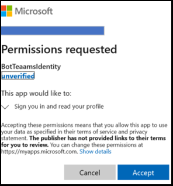

# <a name="add-authentication-to-your-teams-bot"></a><span data-ttu-id="5e437-103">向 Teams 自动程序添加身份验证</span><span class="sxs-lookup"><span data-stu-id="5e437-103">Add authentication to your Teams bot</span></span>

<span data-ttu-id="5e437-104">有时可能需要在 Microsoft Teams 中创建可以代表用户访问资源（如邮件服务）的机器人。</span><span class="sxs-lookup"><span data-stu-id="5e437-104">There are times when you may need to create bots in Microsoft Teams that can access resources on behalf of the user, such as a mail service.</span></span>

<span data-ttu-id="5e437-105">本文演示如何使用基于 OAuth 2.0 的 Azure Bot Service v4 SDK 身份验证。</span><span class="sxs-lookup"><span data-stu-id="5e437-105">This article demonstrates how to use Azure Bot Service v4 SDK authentication, based on OAuth 2.0.</span></span> <span data-ttu-id="5e437-106">这使得开发能够基于用户凭据使用身份验证令牌的自动程序变得更简单。</span><span class="sxs-lookup"><span data-stu-id="5e437-106">This makes it easier to develop a bot that can use authentication tokens based on the user's credentials.</span></span> <span data-ttu-id="5e437-107">所有这一切的关键是使用标识 **提供程序**，我们将在稍后看到。</span><span class="sxs-lookup"><span data-stu-id="5e437-107">Key in all this is the use of **identity providers**, as we will see later.</span></span>

<span data-ttu-id="5e437-108">OAuth 2.0 是 Azure Active Directory (Azure AD) 和许多其他身份标识提供程序用于身份验证和授权的开放标准。</span><span class="sxs-lookup"><span data-stu-id="5e437-108">OAuth 2.0 is an open standard for authentication and authorization used by Azure Active Directory (Azure AD) and many other identity providers.</span></span> <span data-ttu-id="5e437-109">基本了解 OAuth 2.0 是在 Teams 中处理身份验证的先决条件。</span><span class="sxs-lookup"><span data-stu-id="5e437-109">A basic understanding of OAuth 2.0 is a prerequisite for working with authentication in Teams.</span></span>

<span data-ttu-id="5e437-110">有关[完整规范，请参阅 OAuth 2 Simplified](https://aka.ms/oauth2-simplified)了解基本信息，请参阅[OAuth 2.0。](https://oauth.net/2/)</span><span class="sxs-lookup"><span data-stu-id="5e437-110">See [OAuth 2 Simplified](https://aka.ms/oauth2-simplified) for a basic understanding, and [OAuth 2.0](https://oauth.net/2/) for the complete specification.</span></span>

<span data-ttu-id="5e437-111">有关 Azure Bot 服务如何处理身份验证的信息，请参阅对话 [中的用户身份验证](https://aka.ms/azure-bot-authentication)。</span><span class="sxs-lookup"><span data-stu-id="5e437-111">For more information about how the Azure Bot Service handles authentication, see [User authentication within a conversation](https://aka.ms/azure-bot-authentication).</span></span>

<span data-ttu-id="5e437-112">在本文中，您将了解：</span><span class="sxs-lookup"><span data-stu-id="5e437-112">In this article you'll learn:</span></span>

- <span data-ttu-id="5e437-113">**如何创建启用身份验证的机器人**。</span><span class="sxs-lookup"><span data-stu-id="5e437-113">**How to create an authentication-enabled bot**.</span></span> <span data-ttu-id="5e437-114">你将使用 [cs-auth-sample][teams-auth-bot-cs] 来处理用户登录凭据和生成身份验证令牌。</span><span class="sxs-lookup"><span data-stu-id="5e437-114">You'll use [cs-auth-sample][teams-auth-bot-cs] to handle user sign-in credentials and the generating the authentication token.</span></span>
- <span data-ttu-id="5e437-115">**如何将机器人部署到 Azure 并将其与标识提供程序关联**。</span><span class="sxs-lookup"><span data-stu-id="5e437-115">**How to deploy the bot to Azure and associate it with an identity provider**.</span></span> <span data-ttu-id="5e437-116">提供程序根据用户登录凭据颁发令牌。</span><span class="sxs-lookup"><span data-stu-id="5e437-116">The provider issues a token based on user sign-in credentials.</span></span> <span data-ttu-id="5e437-117">机器人可以使用令牌访问需要身份验证的资源，如邮件服务。</span><span class="sxs-lookup"><span data-stu-id="5e437-117">The bot can use the token to access resources, such as a mail service, which require authentication.</span></span> <span data-ttu-id="5e437-118">有关详细信息，请参阅  [适用于机器人的 Microsoft Teams 身份验证流](auth-flow-bot.md)。</span><span class="sxs-lookup"><span data-stu-id="5e437-118">For more information see  [Microsoft Teams authentication flow for bots](auth-flow-bot.md).</span></span>
- <span data-ttu-id="5e437-119">**如何在 Microsoft Teams 中集成机器人**。</span><span class="sxs-lookup"><span data-stu-id="5e437-119">**How to integrate the bot within Microsoft Teams**.</span></span> <span data-ttu-id="5e437-120">集成自动程序后，可以在聊天中登录并交换消息。</span><span class="sxs-lookup"><span data-stu-id="5e437-120">Once the bot has been integrated, you can sign in and exchange messages with it in a chat.</span></span>

## <a name="prerequisites"></a><span data-ttu-id="5e437-121">必备条件</span><span class="sxs-lookup"><span data-stu-id="5e437-121">Prerequisites</span></span>

- <span data-ttu-id="5e437-122">了解[自动程序基础知识][concept-basics][、管理状态][concept-state][、对话框库][concept-dialogs]以及如何[实现顺序对话流][simple-dialog]。</span><span class="sxs-lookup"><span data-stu-id="5e437-122">Knowledge of [bot basics][concept-basics], [managing state][concept-state], the [dialogs library][concept-dialogs], and how to [implement sequential conversation flow][simple-dialog].</span></span>
- <span data-ttu-id="5e437-123">了解 Azure 和 OAuth 2.0 开发。</span><span class="sxs-lookup"><span data-stu-id="5e437-123">Knowledge of Azure and OAuth 2.0 development.</span></span>
- <span data-ttu-id="5e437-124">当前版本的 Visual Studio 和 Git。</span><span class="sxs-lookup"><span data-stu-id="5e437-124">The current versions of Visual Studio and Git.</span></span>
- <span data-ttu-id="5e437-125">Azure 帐户。</span><span class="sxs-lookup"><span data-stu-id="5e437-125">Azure account.</span></span> <span data-ttu-id="5e437-126">如果需要，你可以创建 Azure [免费帐户](https://azure.microsoft.com/free/)。</span><span class="sxs-lookup"><span data-stu-id="5e437-126">If needed, you can create an [Azure free account](https://azure.microsoft.com/free/).</span></span>
- <span data-ttu-id="5e437-127">以下示例。</span><span class="sxs-lookup"><span data-stu-id="5e437-127">The following sample.</span></span>

    | <span data-ttu-id="5e437-128">示例</span><span class="sxs-lookup"><span data-stu-id="5e437-128">Sample</span></span> | <span data-ttu-id="5e437-129">BotBuilder 版本</span><span class="sxs-lookup"><span data-stu-id="5e437-129">BotBuilder version</span></span> | <span data-ttu-id="5e437-130">演示</span><span class="sxs-lookup"><span data-stu-id="5e437-130">Demonstrates</span></span> |
    |:---|:---:|:---|
    | <span data-ttu-id="5e437-131"> [cs-auth-sample 中的自动程序身份验证][teams-auth-bot-cs]</span><span class="sxs-lookup"><span data-stu-id="5e437-131">**Bot authentication** in [cs-auth-sample][teams-auth-bot-cs]</span></span> | <span data-ttu-id="5e437-132">v4</span><span class="sxs-lookup"><span data-stu-id="5e437-132">v4</span></span> | <span data-ttu-id="5e437-133">OAuthCard 支持</span><span class="sxs-lookup"><span data-stu-id="5e437-133">OAuthCard support</span></span> |
    | <span data-ttu-id="5e437-134"> [js-auth-sample 中的自动程序身份验证][teams-auth-bot-js]</span><span class="sxs-lookup"><span data-stu-id="5e437-134">**Bot authentication** in [js-auth-sample][teams-auth-bot-js]</span></span> | <span data-ttu-id="5e437-135">v4</span><span class="sxs-lookup"><span data-stu-id="5e437-135">v4</span></span>| <span data-ttu-id="5e437-136">OAuthCard 支持</span><span class="sxs-lookup"><span data-stu-id="5e437-136">OAuthCard support</span></span>  |
    | <span data-ttu-id="5e437-137"> [py-auth-sample 中的自动程序身份验证][teams-auth-bot-py]</span><span class="sxs-lookup"><span data-stu-id="5e437-137">**Bot authentication** in [py-auth-sample][teams-auth-bot-py]</span></span> | <span data-ttu-id="5e437-138">v4</span><span class="sxs-lookup"><span data-stu-id="5e437-138">v4</span></span> | <span data-ttu-id="5e437-139">OAuthCard 支持</span><span class="sxs-lookup"><span data-stu-id="5e437-139">OAuthCard support</span></span> |

## <a name="create-the-resource-group"></a><span data-ttu-id="5e437-140">创建资源组</span><span class="sxs-lookup"><span data-stu-id="5e437-140">Create the resource group</span></span>

<span data-ttu-id="5e437-141">资源组和服务计划并非严格必需的，但它们允许您便捷地释放您创建的资源。</span><span class="sxs-lookup"><span data-stu-id="5e437-141">The resource group and the service plan aren't strictly necessary, but they allow you to conveniently release the resources you create.</span></span> <span data-ttu-id="5e437-142">这是保持资源有序且易于管理的良好做法。</span><span class="sxs-lookup"><span data-stu-id="5e437-142">This is good practice for keeping your resources organized and manageable.</span></span>

<span data-ttu-id="5e437-143">使用资源组为 Bot Framework 创建单个资源。</span><span class="sxs-lookup"><span data-stu-id="5e437-143">You use a resource group to create individual resources for the Bot Framework.</span></span> <span data-ttu-id="5e437-144">为了提高性能，请确保这些资源位于同一 Azure 区域。</span><span class="sxs-lookup"><span data-stu-id="5e437-144">For performance, ensure that these resources are located in the same Azure region.</span></span>

1. <span data-ttu-id="5e437-145">在浏览器中，登录到 Azure [**门户**][azure-portal]。</span><span class="sxs-lookup"><span data-stu-id="5e437-145">In your browser, sign into the [**Azure portal**][azure-portal].</span></span>
1. <span data-ttu-id="5e437-146">在左侧导航面板中，选择"**资源组"。**</span><span class="sxs-lookup"><span data-stu-id="5e437-146">In the left navigation panel, select **Resource groups**.</span></span>
1. <span data-ttu-id="5e437-147">在显示窗口的左上角，选择" **添加** "选项卡以创建新的资源组。</span><span class="sxs-lookup"><span data-stu-id="5e437-147">In the upper left of the displayed window, select **Add** tab to create a new resource group.</span></span> <span data-ttu-id="5e437-148">系统将提示你提供以下内容：</span><span class="sxs-lookup"><span data-stu-id="5e437-148">You'll be prompted to provide the following:</span></span>
    1. <span data-ttu-id="5e437-149">**订阅**。</span><span class="sxs-lookup"><span data-stu-id="5e437-149">**Subscription**.</span></span> <span data-ttu-id="5e437-150">使用现有订阅。</span><span class="sxs-lookup"><span data-stu-id="5e437-150">Use your existing subscription.</span></span>
    1. <span data-ttu-id="5e437-151">**资源组**。</span><span class="sxs-lookup"><span data-stu-id="5e437-151">**Resource group**.</span></span> <span data-ttu-id="5e437-152">输入资源组的名称。</span><span class="sxs-lookup"><span data-stu-id="5e437-152">Enter the name for the resource group.</span></span> <span data-ttu-id="5e437-153">例如  *，TeamsResourceGroup*。</span><span class="sxs-lookup"><span data-stu-id="5e437-153">An example could be  *TeamsResourceGroup*.</span></span> <span data-ttu-id="5e437-154">请记住，该名称必须是唯一的。</span><span class="sxs-lookup"><span data-stu-id="5e437-154">Remember that the name must be unique.</span></span>
    1. <span data-ttu-id="5e437-155">从" **区域** "下拉菜单中，选择" *美国* 西部"或靠近应用程序的区域。</span><span class="sxs-lookup"><span data-stu-id="5e437-155">From the **Region** drop-down menu, select *West US*, or a region close to your applications.</span></span>
    1. <span data-ttu-id="5e437-156">选择" **审阅并创建"** 按钮。</span><span class="sxs-lookup"><span data-stu-id="5e437-156">Select the **Review and create** button.</span></span> <span data-ttu-id="5e437-157">你应该会看到一个横幅，显示 *"验证通过"。*</span><span class="sxs-lookup"><span data-stu-id="5e437-157">You should see a banner that reads *Validation passed*.</span></span>
    1. <span data-ttu-id="5e437-158">选择" **创建"** 按钮。</span><span class="sxs-lookup"><span data-stu-id="5e437-158">Select the **Create** button.</span></span> <span data-ttu-id="5e437-159">可能需要几分钟时间才能创建资源组。</span><span class="sxs-lookup"><span data-stu-id="5e437-159">It may take a few minutes to create the resource group.</span></span>

> [!TIP]
> <span data-ttu-id="5e437-160">与本教程稍后将创建的资源一样，建议将此资源组固定到仪表板以轻松访问。</span><span class="sxs-lookup"><span data-stu-id="5e437-160">As with the resources you'll create later in this tutorial, it's a good idea to pin this resource group to your dashboard for easy access.</span></span> <span data-ttu-id="5e437-161">如果你希望这样做，请选择固定图标&#128204;位于仪表板的右上角。</span><span class="sxs-lookup"><span data-stu-id="5e437-161">If you'd like to do so, select the pin icon &#128204; in the upper right of the dashboard.</span></span>

## <a name="create-the-service-plan"></a><span data-ttu-id="5e437-162">创建服务计划</span><span class="sxs-lookup"><span data-stu-id="5e437-162">Create the service plan</span></span>

1. <span data-ttu-id="5e437-163">在 [**Azure 门户的**][azure-portal]左侧导航面板上，选择"**创建资源"。**</span><span class="sxs-lookup"><span data-stu-id="5e437-163">In the [**Azure portal**][azure-portal], on the left navigation panel, select **Create a resource**.</span></span>
1. <span data-ttu-id="5e437-164">在搜索框中，键入 *应用服务计划*。</span><span class="sxs-lookup"><span data-stu-id="5e437-164">In the search box, type *App Service Plan*.</span></span> <span data-ttu-id="5e437-165">从 **搜索结果中选择"应用** 服务计划"卡。</span><span class="sxs-lookup"><span data-stu-id="5e437-165">Select the **App Service Plan** card from the search results.</span></span>
1. <span data-ttu-id="5e437-166">选择“**创建**”。</span><span class="sxs-lookup"><span data-stu-id="5e437-166">Select **Create**.</span></span>
1. <span data-ttu-id="5e437-167">将要求您提供以下信息：</span><span class="sxs-lookup"><span data-stu-id="5e437-167">You'll be asked to provide the following information:</span></span>
    1. <span data-ttu-id="5e437-168">**订阅**。</span><span class="sxs-lookup"><span data-stu-id="5e437-168">**Subscription**.</span></span> <span data-ttu-id="5e437-169">可以使用现有订阅。</span><span class="sxs-lookup"><span data-stu-id="5e437-169">You can use an existing subscription.</span></span>
    1. <span data-ttu-id="5e437-170">**资源组**。</span><span class="sxs-lookup"><span data-stu-id="5e437-170">**Resource Group**.</span></span> <span data-ttu-id="5e437-171">选择之前创建的组。</span><span class="sxs-lookup"><span data-stu-id="5e437-171">Select the group you created earlier.</span></span>
    1. <span data-ttu-id="5e437-172">**名称**。</span><span class="sxs-lookup"><span data-stu-id="5e437-172">**Name**.</span></span> <span data-ttu-id="5e437-173">输入服务计划的名称。</span><span class="sxs-lookup"><span data-stu-id="5e437-173">Enter the name for the service plan.</span></span> <span data-ttu-id="5e437-174">例如  *，TeamsServicePlan*。</span><span class="sxs-lookup"><span data-stu-id="5e437-174">An example could be  *TeamsServicePlan*.</span></span> <span data-ttu-id="5e437-175">请记住，该名称在组内必须是唯一的。</span><span class="sxs-lookup"><span data-stu-id="5e437-175">Remember that the name must be unique, within the group.</span></span>
    1. <span data-ttu-id="5e437-176">**操作系统**。</span><span class="sxs-lookup"><span data-stu-id="5e437-176">**Operating System**.</span></span> <span data-ttu-id="5e437-177">选择 *Windows* 或适用的操作系统。</span><span class="sxs-lookup"><span data-stu-id="5e437-177">Select *Windows* or your applicable OS.</span></span>
    1. <span data-ttu-id="5e437-178">**区域**。</span><span class="sxs-lookup"><span data-stu-id="5e437-178">**Region**.</span></span> <span data-ttu-id="5e437-179">选择 *"美国* 西部"或"靠近你的应用程序的区域"。</span><span class="sxs-lookup"><span data-stu-id="5e437-179">Select *West US* or a region close to your applications.</span></span>
    1. <span data-ttu-id="5e437-180">**定价层**。</span><span class="sxs-lookup"><span data-stu-id="5e437-180">**Pricing Tier**.</span></span> <span data-ttu-id="5e437-181">确保选中 *"标准 S1"。*</span><span class="sxs-lookup"><span data-stu-id="5e437-181">Make sure that *Standard S1* is selected.</span></span> <span data-ttu-id="5e437-182">此值应为默认值。</span><span class="sxs-lookup"><span data-stu-id="5e437-182">This should be the default value.</span></span>
    1. <span data-ttu-id="5e437-183">选择" **审阅并创建"** 按钮。</span><span class="sxs-lookup"><span data-stu-id="5e437-183">Select the **Review and create** button.</span></span> <span data-ttu-id="5e437-184">你应该会看到一个横幅，显示 *"验证通过"。*</span><span class="sxs-lookup"><span data-stu-id="5e437-184">You should see a banner that reads *Validation passed*.</span></span>
    1. <span data-ttu-id="5e437-185">选择“**创建**”。</span><span class="sxs-lookup"><span data-stu-id="5e437-185">Select **Create**.</span></span> <span data-ttu-id="5e437-186">创建应用服务计划可能需要几分钟时间。</span><span class="sxs-lookup"><span data-stu-id="5e437-186">It may take a few minutes to create the app service plan.</span></span> <span data-ttu-id="5e437-187">计划将在资源组中列出。</span><span class="sxs-lookup"><span data-stu-id="5e437-187">The plan will be listed in the resource group.</span></span>

## <a name="create-the-bot-channels-registration"></a><span data-ttu-id="5e437-188">创建自动程序通道注册</span><span class="sxs-lookup"><span data-stu-id="5e437-188">Create the bot channels registration</span></span>

<span data-ttu-id="5e437-189">自动程序通道注册将你的 Web 服务注册为 Bot Framework 的自动程序，只要你拥有 Microsoft 应用 ID 和应用密码 (客户端密码) 。</span><span class="sxs-lookup"><span data-stu-id="5e437-189">The bot channels registration registers your web service as a bot with the Bot Framework, provided you have a Microsoft App Id and App password (client secret).</span></span>

> [!IMPORTANT]
> <span data-ttu-id="5e437-190">如果你的机器人未托管在 Azure 中，则只需注册它。</span><span class="sxs-lookup"><span data-stu-id="5e437-190">You only need to register your bot if it is not hosted in Azure.</span></span> <span data-ttu-id="5e437-191">如果你通过 Azure [门户](/azure/bot-service/abs-quickstart?view=azure-bot-service-4.0&viewFallbackFrom=azure-bot-service-3.0&preserve-view=true) 创建了自动程序，则它已在服务中注册。</span><span class="sxs-lookup"><span data-stu-id="5e437-191">If you [created a bot](/azure/bot-service/abs-quickstart?view=azure-bot-service-4.0&viewFallbackFrom=azure-bot-service-3.0&preserve-view=true) through the Azure portal then it is already registered with the service.</span></span> <span data-ttu-id="5e437-192">如果你通过 Bot [Framework](https://dev.botframework.com/bots/new) 或 [AppStudio](~/concepts/build-and-test/app-studio-overview.md) 创建了自动程序，你的机器人不会在 Azure 中注册。</span><span class="sxs-lookup"><span data-stu-id="5e437-192">If you created your bot through the [Bot Framework](https://dev.botframework.com/bots/new) or [AppStudio](~/concepts/build-and-test/app-studio-overview.md) your bot isn't registered in Azure.</span></span>

[!INCLUDE [bot channels registration steps](~/includes/bots/azure-bot-channels-registration.md)]

> [!NOTE]
> <span data-ttu-id="5e437-193">Bot Channels Registration 资源将显示 **全局区域** ，即使你选择了美国西部。</span><span class="sxs-lookup"><span data-stu-id="5e437-193">The Bot Channels Registration resource will show the **Global** region even if you selected West US.</span></span> <span data-ttu-id="5e437-194">这是预期结果。</span><span class="sxs-lookup"><span data-stu-id="5e437-194">This is expected.</span></span>

<span data-ttu-id="5e437-195">有关详细信息，请参阅为 [Teams 创建自动程序](../create-a-bot-for-teams.md)。</span><span class="sxs-lookup"><span data-stu-id="5e437-195">For more information, see [Create a bot for Teams](../create-a-bot-for-teams.md).</span></span>

## <a name="create-the-identity-provider"></a><span data-ttu-id="5e437-196">创建标识提供程序</span><span class="sxs-lookup"><span data-stu-id="5e437-196">Create the identity provider</span></span>

<span data-ttu-id="5e437-197">您需要一个可用于身份验证的标识提供程序。</span><span class="sxs-lookup"><span data-stu-id="5e437-197">You need an identity provider that can be used for authentication.</span></span>
<span data-ttu-id="5e437-198">在此过程中，你将使用 Azure AD 提供程序;其他 Azure AD 支持的标识提供程序也可使用。</span><span class="sxs-lookup"><span data-stu-id="5e437-198">In this procedure you'll use an Azure AD provider; other Azure AD supported identity providers can also be used.</span></span>

1. <span data-ttu-id="5e437-199">在 [**Azure 门户的**][azure-portal]左侧导航面板中，选择 **"Azure Active Directory"。**</span><span class="sxs-lookup"><span data-stu-id="5e437-199">In the [**Azure portal**][azure-portal], on the left navigation panel, select **Azure Active Directory**.</span></span>
    > [!TIP]
    > <span data-ttu-id="5e437-200">你需要在租户中创建和注册此 Azure AD 资源，你可以同意委派应用程序请求的权限。</span><span class="sxs-lookup"><span data-stu-id="5e437-200">You'll need to create and register this Azure AD resource in a tenant in which you can consent to delegate permissions requested by an application.</span></span>
    > <span data-ttu-id="5e437-201">有关创建租户的说明，请参阅 [访问门户并创建租户](/azure/active-directory/fundamentals/active-directory-access-create-new-tenant)。</span><span class="sxs-lookup"><span data-stu-id="5e437-201">For instruction on creating a tenant, see [Access the portal and create a tenant](/azure/active-directory/fundamentals/active-directory-access-create-new-tenant).</span></span>
1. <span data-ttu-id="5e437-202">在左侧面板中，选择 **"应用注册"。**</span><span class="sxs-lookup"><span data-stu-id="5e437-202">In the left panel, select **App registrations**.</span></span>
1. <span data-ttu-id="5e437-203">在右侧面板中，选择左上角 **的** "新建注册"选项卡。</span><span class="sxs-lookup"><span data-stu-id="5e437-203">In the right panel, select the **New registration** tab, in the upper left.</span></span>
1. <span data-ttu-id="5e437-204">将要求您提供以下信息：</span><span class="sxs-lookup"><span data-stu-id="5e437-204">You'll be asked to provide the following information:</span></span>
   1. <span data-ttu-id="5e437-205">**名称**。</span><span class="sxs-lookup"><span data-stu-id="5e437-205">**Name**.</span></span> <span data-ttu-id="5e437-206">输入应用程序的名称。</span><span class="sxs-lookup"><span data-stu-id="5e437-206">Enter the name for the application.</span></span> <span data-ttu-id="5e437-207">例如  *，BotTeamsIdentity*。</span><span class="sxs-lookup"><span data-stu-id="5e437-207">An example could be  *BotTeamsIdentity*.</span></span> <span data-ttu-id="5e437-208">请记住，该名称必须是唯一的。</span><span class="sxs-lookup"><span data-stu-id="5e437-208">Remember that the name must be unique.</span></span>
   1. <span data-ttu-id="5e437-209">选择 **应用程序支持** 的帐户类型。</span><span class="sxs-lookup"><span data-stu-id="5e437-209">Select the **Supported account types** for your application.</span></span> <span data-ttu-id="5e437-210">选择任何组织目录中的帐户 (任何 Azure AD 目录 - 多租户) 和个人 Microsoft 帐户 *(例如 Skype、Xbox) 。*</span><span class="sxs-lookup"><span data-stu-id="5e437-210">Select *Accounts in any organizational directory (Any Azure AD directory - Multitenant) and personal Microsoft accounts (e.g. Skype, Xbox)*.</span></span>
   1. <span data-ttu-id="5e437-211">对于 **重定向 URI：**</span><span class="sxs-lookup"><span data-stu-id="5e437-211">For the **Redirect URI**:</span></span><br/>
       <span data-ttu-id="5e437-212">&#x2713;选择 **Web。**</span><span class="sxs-lookup"><span data-stu-id="5e437-212">&#x2713;Select **Web**.</span></span> <br/>
       <span data-ttu-id="5e437-213">&#x2713;将 URL 设置为 `https://token.botframework.com/.auth/web/redirect` 。</span><span class="sxs-lookup"><span data-stu-id="5e437-213">&#x2713; Set the URL to `https://token.botframework.com/.auth/web/redirect`.</span></span>
   1. <span data-ttu-id="5e437-214">选择“**注册**”。</span><span class="sxs-lookup"><span data-stu-id="5e437-214">Select **Register**.</span></span>

1. <span data-ttu-id="5e437-215">创建后，Azure 将显示 **应用的"** 概述"页。</span><span class="sxs-lookup"><span data-stu-id="5e437-215">Once it is created, Azure displays the **Overview** page for the app.</span></span> <span data-ttu-id="5e437-216">将以下信息复制并保存到文件中：</span><span class="sxs-lookup"><span data-stu-id="5e437-216">Copy and save the following information to a file:</span></span>

    1. <span data-ttu-id="5e437-217">Application **(客户端) ID** 值。</span><span class="sxs-lookup"><span data-stu-id="5e437-217">The **Application (client) ID** value.</span></span> <span data-ttu-id="5e437-218">稍后在自动程序中注册此 Azure标识应用程序时，将此值用作客户端 ID。</span><span class="sxs-lookup"><span data-stu-id="5e437-218">You'll use this value later as the *Client ID* when you register this Azure identity application with your bot.</span></span>
    1. <span data-ttu-id="5e437-219">租户 **的 (ID) ID** 值。</span><span class="sxs-lookup"><span data-stu-id="5e437-219">The **Directory (tenant) ID** value.</span></span> <span data-ttu-id="5e437-220">稍后，你还将使用此值作为 *租户 ID，* 向自动程序注册此 Azure 标识应用程序。</span><span class="sxs-lookup"><span data-stu-id="5e437-220">You'll also use this value later as the *Tenant ID* to register this Azure identity application with your bot.</span></span>

1. <span data-ttu-id="5e437-221">在左侧面板中， **选择** "&密码"，为应用程序创建客户端密码。</span><span class="sxs-lookup"><span data-stu-id="5e437-221">In the left panel, select **Certificates & secrets** to create a client secret for your application.</span></span>

   1. <span data-ttu-id="5e437-222">在 **"客户端密码**"下 **，&#x2795;"新建客户端密码"。**</span><span class="sxs-lookup"><span data-stu-id="5e437-222">Under **Client secrets**, select &#x2795; **New client secret**.</span></span>
   1. <span data-ttu-id="5e437-223">添加描述，从可能需要为此应用创建的其他人（如 Teams 中的自动程序标识应用）中标识 *此密码*。</span><span class="sxs-lookup"><span data-stu-id="5e437-223">Add a description to identify this secret from others you might need to create for this app, such as *Bot identity app in Teams*.</span></span>
   1. <span data-ttu-id="5e437-224">设置 **到期** 到你的选择。</span><span class="sxs-lookup"><span data-stu-id="5e437-224">Set **Expires** to your selection.</span></span>
   1. <span data-ttu-id="5e437-225">选择“**添加**”。</span><span class="sxs-lookup"><span data-stu-id="5e437-225">Select **Add**.</span></span>
   1. <span data-ttu-id="5e437-226">在离开此页面之前， **请记录密码**。</span><span class="sxs-lookup"><span data-stu-id="5e437-226">Before leaving this page, **record the secret**.</span></span> <span data-ttu-id="5e437-227">稍后，当你向自动程序注册 Azure  AD 应用程序时，你将使用此值作为客户端密码。</span><span class="sxs-lookup"><span data-stu-id="5e437-227">You'll use this value later as the _Client secret_ when you register your Azure AD application with your bot.</span></span>

### <a name="configure-the-identity-provider-connection-and-register-it-with-the-bot"></a><span data-ttu-id="5e437-228">配置标识提供程序连接，然后向自动程序注册该连接</span><span class="sxs-lookup"><span data-stu-id="5e437-228">Configure the identity provider connection and register it with the bot</span></span>

<span data-ttu-id="5e437-229">注意-此处有两个适用于服务提供商的选项-Azure AD V1 和 Azure AD V2。</span><span class="sxs-lookup"><span data-stu-id="5e437-229">Note-there are two options for Service Providers here-Azure AD V1 and Azure AD V2.</span></span>  <span data-ttu-id="5e437-230">此处总结了两个提供程序之间的差异，但通常[](https://docs.microsoft.com/azure/active-directory/azuread-dev/azure-ad-endpoint-comparison)V2 在更改自动程序权限方面提供了更大的灵活性。</span><span class="sxs-lookup"><span data-stu-id="5e437-230">The differences between the two providers are summarized [here](https://docs.microsoft.com/azure/active-directory/azuread-dev/azure-ad-endpoint-comparison), but in general, V2 provides more flexibility with respect to changing bot permissions.</span></span>  <span data-ttu-id="5e437-231">Graph API 权限在范围字段中列出，当添加新权限时，自动程序将允许用户在下次登录时同意新权限。</span><span class="sxs-lookup"><span data-stu-id="5e437-231">Graph API permissions are listed in the scopes field, and as new ones are added, bots will allow users to consent to the new permissions on the next sign in.</span></span>  <span data-ttu-id="5e437-232">对于 V1，用户必须删除自动程序同意，才能在 OAuth 对话框中提示新权限。</span><span class="sxs-lookup"><span data-stu-id="5e437-232">For V1, the bot consent must be deleted by the user for new permissions to be prompted in the OAuth dialog.</span></span> 

#### <a name="azure-ad-v1"></a><span data-ttu-id="5e437-233">Azure AD V1</span><span class="sxs-lookup"><span data-stu-id="5e437-233">Azure AD V1</span></span>

1. <span data-ttu-id="5e437-234">在 [**Azure 门户中**][azure-portal]，从仪表板中选择资源组。</span><span class="sxs-lookup"><span data-stu-id="5e437-234">In the [**Azure portal**][azure-portal], select your resource group from the dashboard.</span></span>
1. <span data-ttu-id="5e437-235">选择自动程序通道注册链接。</span><span class="sxs-lookup"><span data-stu-id="5e437-235">Select your bot channel registration link.</span></span>
1. <span data-ttu-id="5e437-236">在资源页上， **选择设置**。</span><span class="sxs-lookup"><span data-stu-id="5e437-236">On the resource page, select **Settings**.</span></span>
1. <span data-ttu-id="5e437-237">在 **页面底部的"OAuth** 连接设置"下，选择"**添加设置"。**</span><span class="sxs-lookup"><span data-stu-id="5e437-237">Under **OAuth Connection Settings** near the bottom of the page, select **Add Setting**.</span></span>
1. <span data-ttu-id="5e437-238">如下所示完成表单：</span><span class="sxs-lookup"><span data-stu-id="5e437-238">Complete the form as follows:</span></span>

    1. <span data-ttu-id="5e437-239">**名称**。</span><span class="sxs-lookup"><span data-stu-id="5e437-239">**Name**.</span></span> <span data-ttu-id="5e437-240">输入连接的名称。</span><span class="sxs-lookup"><span data-stu-id="5e437-240">Enter a name for the connection.</span></span> <span data-ttu-id="5e437-241">你将在文件的自动程序中使用此 `appsettings.json` 名称。</span><span class="sxs-lookup"><span data-stu-id="5e437-241">You'll use this name in your bot in the `appsettings.json` file.</span></span> <span data-ttu-id="5e437-242">例如 *BotTeamsAuthADv1*。</span><span class="sxs-lookup"><span data-stu-id="5e437-242">For example *BotTeamsAuthADv1*.</span></span>
    1. <span data-ttu-id="5e437-243">**服务提供程序**。</span><span class="sxs-lookup"><span data-stu-id="5e437-243">**Service Provider**.</span></span> <span data-ttu-id="5e437-244">选择 **Azure Active Directory**。</span><span class="sxs-lookup"><span data-stu-id="5e437-244">Select **Azure Active Directory**.</span></span> <span data-ttu-id="5e437-245">选择此选项后，将显示特定于 Azure AD 的字段。</span><span class="sxs-lookup"><span data-stu-id="5e437-245">Once you select this, the Azure AD-specific fields will be displayed.</span></span>
    1. <span data-ttu-id="5e437-246">**客户端 ID**。在以上 (中) 为 Azure 标识提供程序应用记录的应用程序客户端标识 ID。</span><span class="sxs-lookup"><span data-stu-id="5e437-246">**Client id**. Enter the Application (client) ID that you recorded for your Azure identity provider app in the steps above.</span></span>
    1. <span data-ttu-id="5e437-247">**客户端密码**。</span><span class="sxs-lookup"><span data-stu-id="5e437-247">**Client secret**.</span></span> <span data-ttu-id="5e437-248">在以上步骤中输入为 Azure 标识提供程序应用记录机密。</span><span class="sxs-lookup"><span data-stu-id="5e437-248">Enter the secret that you recorded for your Azure identity provider app in the steps above.</span></span>
    1. <span data-ttu-id="5e437-249">**授予类型**。</span><span class="sxs-lookup"><span data-stu-id="5e437-249">**Grant Type**.</span></span> <span data-ttu-id="5e437-250">输入 `authorization_code` 。</span><span class="sxs-lookup"><span data-stu-id="5e437-250">Enter `authorization_code`.</span></span>
    1. <span data-ttu-id="5e437-251">**登录 URL**。</span><span class="sxs-lookup"><span data-stu-id="5e437-251">**Login URL**.</span></span> <span data-ttu-id="5e437-252">输入 `https://login.microsoftonline.com` 。</span><span class="sxs-lookup"><span data-stu-id="5e437-252">Enter `https://login.microsoftonline.com`.</span></span>
    1. <span data-ttu-id="5e437-253">**"租户 ID"， (** 之前为 Azure 标识应用录制的目录或租户) ID，具体取决于创建标识提供程序应用时选择的支持的帐户类型。 </span><span class="sxs-lookup"><span data-stu-id="5e437-253">**Tenant ID**, enter the **Directory (tenant) ID** that you recorded earlier for your Azure identity app or **common** depending on the supported account type selected when you created the identity provider app.</span></span> <span data-ttu-id="5e437-254">要决定要分配的值，请遵循以下条件：</span><span class="sxs-lookup"><span data-stu-id="5e437-254">To decide which value to assign follow these criteria:</span></span>

        - <span data-ttu-id="5e437-255">如果你选择了仅 *(Microsoft* 组织目录中的帐户 - 单租户) 或任何组织目录 (*Microsoft AAD* 目录 - 多租户) 请输入之前为 AAD 应用记录的租户 **ID。**</span><span class="sxs-lookup"><span data-stu-id="5e437-255">If you selected either *Accounts in this organizational directory only (Microsoft only - Single tenant)* or *Accounts in any organizational directory(Microsoft AAD directory - Multi tenant)* enter the **tenant ID** you recorded earlier for the AAD app.</span></span> <span data-ttu-id="5e437-256">这将是与可以进行身份验证的用户关联的租户。</span><span class="sxs-lookup"><span data-stu-id="5e437-256">This will be the tenant associated with the users who can be authenticated.</span></span>

        - <span data-ttu-id="5e437-257">如果在任意组织目录中选择了"帐户 (任何 AAD 目录 - 多租户和个人 Microsoft 帐户（例如 *Skype、Xbox、Outlook) 请输入"common"* 一词而不是租户 ID）。</span><span class="sxs-lookup"><span data-stu-id="5e437-257">If you selected *Accounts in any organizational directory (Any AAD directory - Multi tenant and personal Microsoft accounts e.g. Skype, Xbox, Outlook)* enter the word **common** instead of a tenant ID.</span></span> <span data-ttu-id="5e437-258">否则，AAD 应用会通过已选择 ID 的租户进行验证，并排除个人 Microsoft 帐户。</span><span class="sxs-lookup"><span data-stu-id="5e437-258">Otherwise, the AAD app will verify through the tenant whose ID was selected and exclude personal Microsoft accounts.</span></span>

    <span data-ttu-id="5e437-259">h.</span><span class="sxs-lookup"><span data-stu-id="5e437-259">h.</span></span> <span data-ttu-id="5e437-260">对于 **"资源 URL"，** 输入 `https://graph.microsoft.com/` 。</span><span class="sxs-lookup"><span data-stu-id="5e437-260">For **Resource URL**, enter `https://graph.microsoft.com/`.</span></span> <span data-ttu-id="5e437-261">当前代码示例中没有使用此功能。</span><span class="sxs-lookup"><span data-stu-id="5e437-261">This is not used in the current code sample.</span></span>  
    <span data-ttu-id="5e437-262">i.</span><span class="sxs-lookup"><span data-stu-id="5e437-262">i.</span></span> <span data-ttu-id="5e437-263">将 **"范围"** 留空。</span><span class="sxs-lookup"><span data-stu-id="5e437-263">Leave **Scopes** blank.</span></span> <span data-ttu-id="5e437-264">下图是一个示例：</span><span class="sxs-lookup"><span data-stu-id="5e437-264">The following image is an example:</span></span>

    

1. <span data-ttu-id="5e437-266">选择“**保存**”。</span><span class="sxs-lookup"><span data-stu-id="5e437-266">Select **Save**.</span></span>

#### <a name="azure-ad-v2"></a><span data-ttu-id="5e437-267">Azure AD V2</span><span class="sxs-lookup"><span data-stu-id="5e437-267">Azure AD V2</span></span>

1. <span data-ttu-id="5e437-268">在 [**Azure 门户中**][azure-portal]，从仪表板中选择资源组。</span><span class="sxs-lookup"><span data-stu-id="5e437-268">In the [**Azure portal**][azure-portal], select your resource group from the dashboard.</span></span>
1. <span data-ttu-id="5e437-269">选择自动程序通道注册链接。</span><span class="sxs-lookup"><span data-stu-id="5e437-269">Select your bot channel registration link.</span></span>
1. <span data-ttu-id="5e437-270">在资源页上， **选择设置**。</span><span class="sxs-lookup"><span data-stu-id="5e437-270">On the resource page, select **Settings**.</span></span>
1. <span data-ttu-id="5e437-271">在 **页面底部的"OAuth** 连接设置"下，选择"**添加设置"。**</span><span class="sxs-lookup"><span data-stu-id="5e437-271">Under **OAuth Connection Settings** near the bottom of the page, select **Add Setting**.</span></span>
1. <span data-ttu-id="5e437-272">如下所示完成表单：</span><span class="sxs-lookup"><span data-stu-id="5e437-272">Complete the form as follows:</span></span>

    1. <span data-ttu-id="5e437-273">**名称**。</span><span class="sxs-lookup"><span data-stu-id="5e437-273">**Name**.</span></span> <span data-ttu-id="5e437-274">输入连接的名称。</span><span class="sxs-lookup"><span data-stu-id="5e437-274">Enter a name for the connection.</span></span> <span data-ttu-id="5e437-275">你将在文件的自动程序中使用此 `appsettings.json` 名称。</span><span class="sxs-lookup"><span data-stu-id="5e437-275">You'll use this name in your bot in the `appsettings.json` file.</span></span> <span data-ttu-id="5e437-276">例如 *BotTeamsAuthADv2*。</span><span class="sxs-lookup"><span data-stu-id="5e437-276">For example *BotTeamsAuthADv2*.</span></span>
    1. <span data-ttu-id="5e437-277">**服务提供程序**。</span><span class="sxs-lookup"><span data-stu-id="5e437-277">**Service Provider**.</span></span> <span data-ttu-id="5e437-278">选择 **"Azure Active Directory v2"。**</span><span class="sxs-lookup"><span data-stu-id="5e437-278">Select **Azure Active Directory v2**.</span></span> <span data-ttu-id="5e437-279">选择此选项后，将显示特定于 Azure AD 的字段。</span><span class="sxs-lookup"><span data-stu-id="5e437-279">Once you select this, the Azure AD-specific fields will be displayed.</span></span>
    1. <span data-ttu-id="5e437-280">**客户端 ID**。在以上 (中) 为 Azure 标识提供程序应用记录的应用程序客户端标识 ID。</span><span class="sxs-lookup"><span data-stu-id="5e437-280">**Client id**. Enter the Application (client) ID that you recorded for your Azure identity provider app in the steps above.</span></span>
    1. <span data-ttu-id="5e437-281">**客户端密码**。</span><span class="sxs-lookup"><span data-stu-id="5e437-281">**Client secret**.</span></span> <span data-ttu-id="5e437-282">在以上步骤中输入为 Azure 标识提供程序应用记录机密。</span><span class="sxs-lookup"><span data-stu-id="5e437-282">Enter the secret that you recorded for your Azure identity provider app in the steps above.</span></span>
    1. <span data-ttu-id="5e437-283">**令牌 Exchange URL**。</span><span class="sxs-lookup"><span data-stu-id="5e437-283">**Token Exchange URL**.</span></span> <span data-ttu-id="5e437-284">保留此为空白。</span><span class="sxs-lookup"><span data-stu-id="5e437-284">Leave this blank.</span></span>
    1. <span data-ttu-id="5e437-285">**"租户 ID"， (** 之前为 Azure 标识应用录制的目录或租户) ID，具体取决于创建标识提供程序应用时选择的支持的帐户类型。 </span><span class="sxs-lookup"><span data-stu-id="5e437-285">**Tenant ID**, enter the **Directory (tenant) ID** that you recorded earlier for your Azure identity app or **common** depending on the supported account type selected when you created the identity provider app.</span></span> <span data-ttu-id="5e437-286">要决定要分配的值，请遵循以下条件：</span><span class="sxs-lookup"><span data-stu-id="5e437-286">To decide which value to assign follow these criteria:</span></span>

        - <span data-ttu-id="5e437-287">如果你选择了仅 *(Microsoft* 组织目录中的帐户 - 单租户) 或任何组织目录 (*Microsoft AAD* 目录 - 多租户) 请输入之前为 AAD 应用记录的租户 **ID。**</span><span class="sxs-lookup"><span data-stu-id="5e437-287">If you selected either *Accounts in this organizational directory only (Microsoft only - Single tenant)* or *Accounts in any organizational directory(Microsoft AAD directory - Multi tenant)* enter the **tenant ID** you recorded earlier for the AAD app.</span></span> <span data-ttu-id="5e437-288">这将是与可以进行身份验证的用户关联的租户。</span><span class="sxs-lookup"><span data-stu-id="5e437-288">This will be the tenant associated with the users who can be authenticated.</span></span>

        - <span data-ttu-id="5e437-289">如果在任意组织目录中选择了"帐户 (任何 AAD 目录 - 多租户和个人 Microsoft 帐户（例如 *Skype、Xbox、Outlook) 请输入"common"* 一词而不是租户 ID）。</span><span class="sxs-lookup"><span data-stu-id="5e437-289">If you selected *Accounts in any organizational directory (Any AAD directory - Multi tenant and personal Microsoft accounts e.g. Skype, Xbox, Outlook)* enter the word **common** instead of a tenant ID.</span></span> <span data-ttu-id="5e437-290">否则，AAD 应用会通过已选择 ID 的租户进行验证，并排除个人 Microsoft 帐户。</span><span class="sxs-lookup"><span data-stu-id="5e437-290">Otherwise, the AAD app will verify through the tenant whose ID was selected and exclude personal Microsoft accounts.</span></span>

    1. <span data-ttu-id="5e437-291">对于 **Scopes，** 输入此应用程序所需的图形权限的空格分隔列表，例如：User.Read User.ReadBasic.All Mail.Read</span><span class="sxs-lookup"><span data-stu-id="5e437-291">For **Scopes**, enter a space-delimited list of graph permissions this application requires e.g.: User.Read User.ReadBasic.All Mail.Read</span></span> 

1. <span data-ttu-id="5e437-292">选择“**保存**”。</span><span class="sxs-lookup"><span data-stu-id="5e437-292">Select **Save**.</span></span>

### <a name="test-the-connection"></a><span data-ttu-id="5e437-293">测试连接</span><span class="sxs-lookup"><span data-stu-id="5e437-293">Test the connection</span></span>

1. <span data-ttu-id="5e437-294">选择连接条目以打开刚创建的连接。</span><span class="sxs-lookup"><span data-stu-id="5e437-294">Select the connection entry to open the connection you just created.</span></span>
1. <span data-ttu-id="5e437-295">选择 **"服务提供商** 连接设置"面板顶部的 **"测试连接** "。</span><span class="sxs-lookup"><span data-stu-id="5e437-295">Select **Test Connection** at the top of the **Service Provider Connection Setting** panel.</span></span>
1. <span data-ttu-id="5e437-296">第一次这样做时，将打开一个新的浏览器窗口，要求你选择帐户。</span><span class="sxs-lookup"><span data-stu-id="5e437-296">The first time you do this will open a new browser window asking you to select an account.</span></span> <span data-ttu-id="5e437-297">选择您想要使用的人。</span><span class="sxs-lookup"><span data-stu-id="5e437-297">Select the one you want to use.</span></span>
1. <span data-ttu-id="5e437-298">接下来，将要求你允许标识提供程序使用你的数据 (凭据) 。</span><span class="sxs-lookup"><span data-stu-id="5e437-298">Next, you'll be asked to allow to the identity provider to use your data (credentials).</span></span> <span data-ttu-id="5e437-299">下图是一个示例：</span><span class="sxs-lookup"><span data-stu-id="5e437-299">The following image is an example:</span></span>

    

1. <span data-ttu-id="5e437-301">选择 **接受**。</span><span class="sxs-lookup"><span data-stu-id="5e437-301">Select **Accept**.</span></span>
1. <span data-ttu-id="5e437-302">然后，这会将您重定向到" **测试连接成功 \<your-connection-name> "** 页。</span><span class="sxs-lookup"><span data-stu-id="5e437-302">This should then redirect you to a **Test Connection to \<your-connection-name> Succeeded** page.</span></span> <span data-ttu-id="5e437-303">如果收到错误，请刷新页面。</span><span class="sxs-lookup"><span data-stu-id="5e437-303">Refresh the page if you get an error.</span></span> <span data-ttu-id="5e437-304">下图是一个示例：</span><span class="sxs-lookup"><span data-stu-id="5e437-304">The following image is an example:</span></span>

  

<span data-ttu-id="5e437-306">自动程序代码使用连接名称检索用户身份验证令牌。</span><span class="sxs-lookup"><span data-stu-id="5e437-306">The connection name is used by the bot code to retrieve user authentication tokens.</span></span>

## <a name="prepare-the-bot-sample-code"></a><span data-ttu-id="5e437-307">准备自动程序示例代码</span><span class="sxs-lookup"><span data-stu-id="5e437-307">Prepare the bot sample code</span></span>

<span data-ttu-id="5e437-308">完成初步设置后，让我们着重介绍本文中要使用的机器人的创建。</span><span class="sxs-lookup"><span data-stu-id="5e437-308">With the preliminary settings done, let's focus on the creation of the bot to use in this article.</span></span>

# <a name="cnet"></a>[<span data-ttu-id="5e437-309">C#/.NET</span><span class="sxs-lookup"><span data-stu-id="5e437-309">C#/.NET</span></span>](#tab/dotnet)

1. <span data-ttu-id="5e437-310">克隆 [cs-auth-sample][teams-auth-bot-cs]。</span><span class="sxs-lookup"><span data-stu-id="5e437-310">Clone [cs-auth-sample][teams-auth-bot-cs].</span></span>
1. <span data-ttu-id="5e437-311">启动Visual Studio。</span><span class="sxs-lookup"><span data-stu-id="5e437-311">Launch Visual Studio.</span></span>
1. <span data-ttu-id="5e437-312">从工具栏中选择文件 **-> 打开 -> 项目/解决方案** 并打开自动程序项目。</span><span class="sxs-lookup"><span data-stu-id="5e437-312">From the toolbar select **File -> Open -> Project/Solution** and open the bot project.</span></span>
1. <span data-ttu-id="5e437-313">在C#更新 **appsettings.js如下所示** 打开：</span><span class="sxs-lookup"><span data-stu-id="5e437-313">In C# Update **appsettings.json** as follows:</span></span>

    - <span data-ttu-id="5e437-314">设置为 `ConnectionName` 添加到自动程序通道注册的标识提供程序连接的名称。</span><span class="sxs-lookup"><span data-stu-id="5e437-314">Set `ConnectionName` to the name of the identity provider connection you added to the bot channel registration.</span></span> <span data-ttu-id="5e437-315">此示例中使用的名称是 *BotTeamsAuthADv1*。</span><span class="sxs-lookup"><span data-stu-id="5e437-315">The name we used in this example is *BotTeamsAuthADv1*.</span></span>
    - <span data-ttu-id="5e437-316">设置为 `MicrosoftAppId` 在 **自动程序** 通道注册时保存的自动程序应用 ID。</span><span class="sxs-lookup"><span data-stu-id="5e437-316">Set `MicrosoftAppId` to the **bot App ID** you saved at the time of the bot channel registration.</span></span>
    - <span data-ttu-id="5e437-317">设置为 `MicrosoftAppPassword` 在 **自动程序** 频道注册时保存的客户密码。</span><span class="sxs-lookup"><span data-stu-id="5e437-317">Set `MicrosoftAppPassword` to the **customer secret** you saved at the time of the bot channel registration.</span></span>

    <span data-ttu-id="5e437-318">根据自动程序密码中的字符，可能需要对密码进行 XML 转义。</span><span class="sxs-lookup"><span data-stu-id="5e437-318">Depending on the characters in your bot secret, you may need to XML escape the password.</span></span> <span data-ttu-id="5e437-319">例如，任何与 (&) 需要编码为 `&amp;` 。</span><span class="sxs-lookup"><span data-stu-id="5e437-319">For example, any ampersands (&) will need to be encoded as `&amp;`.</span></span>

     [!code-json[appsettings](~/../botbuilder-samples/samples/csharp_dotnetcore/46.teams-auth/appsettings.json?range=1-5)]

1. <span data-ttu-id="5e437-320">在"解决方案资源管理器"中，导航到文件夹，打开并设置 ，然后转到在自动程序通道注册时保存的 `TeamsAppManifest` `manifest.json` `id` `botId` 自动程序应用 ID。 </span><span class="sxs-lookup"><span data-stu-id="5e437-320">In the Solution Explorer, navigate to the `TeamsAppManifest` folder, open `manifest.json` and set `id` and `botId` to the **bot App ID** you saved at the time of the bot channel registration.</span></span>

# <a name="javascript"></a>[<span data-ttu-id="5e437-321">JavaScript</span><span class="sxs-lookup"><span data-stu-id="5e437-321">JavaScript</span></span>](#tab/node-js)

1. <span data-ttu-id="5e437-322">克隆 [node-auth-sample][teams-auth-bot-js]。</span><span class="sxs-lookup"><span data-stu-id="5e437-322">Clone [node-auth-sample][teams-auth-bot-js].</span></span>
1. <span data-ttu-id="5e437-323">在控制台中，导航到项目：</span><span class="sxs-lookup"><span data-stu-id="5e437-323">In a console, navigate to the project:</span></span> </br></br>
`cd samples/javascript_nodejs/46.teams`  
1. <span data-ttu-id="5e437-324">安装模块</span><span class="sxs-lookup"><span data-stu-id="5e437-324">Install modules</span></span></br></br>
`npm install`
1. <span data-ttu-id="5e437-325">更新 **.env** 配置，如下所示：</span><span class="sxs-lookup"><span data-stu-id="5e437-325">Update the **.env** configuration as follows:</span></span>

    - <span data-ttu-id="5e437-326">设置为 `MicrosoftAppId` 在 **自动程序** 通道注册时保存的自动程序应用 ID。</span><span class="sxs-lookup"><span data-stu-id="5e437-326">Set `MicrosoftAppId` to the **bot App ID** you saved at the time of the bot channel registration.</span></span>
    - <span data-ttu-id="5e437-327">设置为 `MicrosoftAppPassword` 在 **自动程序** 频道注册时保存的客户密码。</span><span class="sxs-lookup"><span data-stu-id="5e437-327">Set `MicrosoftAppPassword` to the **customer secret** you saved at the time of the bot channel registration.</span></span>
    - <span data-ttu-id="5e437-328">将 `connectionName` 设置为标识提供程序连接的名称。</span><span class="sxs-lookup"><span data-stu-id="5e437-328">Set the `connectionName` to the name of the identity provider connection.</span></span>
    <span data-ttu-id="5e437-329">根据自动程序密码中的字符，可能需要对密码进行 XML 转义。</span><span class="sxs-lookup"><span data-stu-id="5e437-329">Depending on the characters in your bot secret, you may need to XML escape the password.</span></span> <span data-ttu-id="5e437-330">例如，任何与 (&) 需要编码为 `&amp;` 。</span><span class="sxs-lookup"><span data-stu-id="5e437-330">For example, any ampersands (&) will need to be encoded as `&amp;`.</span></span>

     [!code-javascript[settings](~/../botbuilder-samples/samples/javascript_nodejs/46.teams-auth/.env)]

1. <span data-ttu-id="5e437-331">在文件夹中，打开并设置为 Microsoft 应用 ID 以及你在自动程序通道注册时保存的 `teamsAppManifest` `manifest.json` `id`  `botId` 自动程序应用ID。</span><span class="sxs-lookup"><span data-stu-id="5e437-331">In the `teamsAppManifest` folder, open `manifest.json` and set `id`  to your **Microsoft App ID** and `botId` to the **bot App ID** you saved at the time of the bot channel registration.</span></span>

# <a name="python"></a>[<span data-ttu-id="5e437-332">Python</span><span class="sxs-lookup"><span data-stu-id="5e437-332">Python</span></span>](#tab/python)

1. <span data-ttu-id="5e437-333">从[github 存储库中克隆 py-auth-sample。][teams-auth-bot-py]</span><span class="sxs-lookup"><span data-stu-id="5e437-333">Clone [py-auth-sample][teams-auth-bot-py] from the github repository.</span></span>
1. <span data-ttu-id="5e437-334">更新 **config.py：**</span><span class="sxs-lookup"><span data-stu-id="5e437-334">Update **config.py**:</span></span>

    - <span data-ttu-id="5e437-335">设置为 `ConnectionName` 添加到自动程序中的 OAuth 连接设置的名称。</span><span class="sxs-lookup"><span data-stu-id="5e437-335">Set `ConnectionName` to the name of the OAuth connection setting you added to your bot.</span></span>
    - <span data-ttu-id="5e437-336">将 `MicrosoftAppId` 和 `MicrosoftAppPassword` 设置为自动程序的应用 ID 和应用密码。</span><span class="sxs-lookup"><span data-stu-id="5e437-336">Set `MicrosoftAppId` and `MicrosoftAppPassword` to your bot's app ID and app secret.</span></span>

      <span data-ttu-id="5e437-337">根据自动程序密码中的字符，可能需要对密码进行 XML 转义。</span><span class="sxs-lookup"><span data-stu-id="5e437-337">Depending on the characters in your bot secret, you may need to XML escape the password.</span></span> <span data-ttu-id="5e437-338">例如，任何与 (&) 需要编码为 `&amp;` 。</span><span class="sxs-lookup"><span data-stu-id="5e437-338">For example, any ampersands (&) will need to be encoded as `&amp;`.</span></span>

      [!code-python[config](~/../botbuilder-samples/samples/python/46.teams-auth/config.py?range=14-16)]

---

### <a name="deploy-the-bot-to-azure"></a><span data-ttu-id="5e437-339">将机器人部署到 Azure</span><span class="sxs-lookup"><span data-stu-id="5e437-339">Deploy the bot to Azure</span></span>

<span data-ttu-id="5e437-340">若要部署机器人，请按照如何将机器人部署到 [Azure 中的步骤操作](https://aka.ms/azure-bot-deployment-cli)。</span><span class="sxs-lookup"><span data-stu-id="5e437-340">To deploy the bot, follow the steps in the how to [Deploy your bot to Azure](https://aka.ms/azure-bot-deployment-cli).</span></span>

<span data-ttu-id="5e437-341">或者，在Visual Studio时，可以执行以下步骤：</span><span class="sxs-lookup"><span data-stu-id="5e437-341">Alternatively, while in Visual Studio, you can follow these steps:</span></span>

1. <span data-ttu-id="5e437-342">In Visual Studio *Solution Explorer* select and hold (or right-click) the project name.</span><span class="sxs-lookup"><span data-stu-id="5e437-342">In Visual Studio *Solution Explorer* select and hold (or right-click) the project name.</span></span>
1. <span data-ttu-id="5e437-343">在下拉菜单中，选择"发布 **"。**</span><span class="sxs-lookup"><span data-stu-id="5e437-343">In the drop-down menu, select **Publish**.</span></span>
1. <span data-ttu-id="5e437-344">在显示的窗口中，选择"新建 **"** 链接。</span><span class="sxs-lookup"><span data-stu-id="5e437-344">In the displayed window, select the **New** link.</span></span>
1. <span data-ttu-id="5e437-345">在对话框窗口中，选择左侧 **的应用服务** ，在右侧 **选择新建** 。</span><span class="sxs-lookup"><span data-stu-id="5e437-345">In the dialog window, select **App Service** on the left and **Create New** on the right.</span></span>
1. <span data-ttu-id="5e437-346">选择" **发布"** 按钮。</span><span class="sxs-lookup"><span data-stu-id="5e437-346">Select the **Publish** button.</span></span>
1. <span data-ttu-id="5e437-347">在下一个对话框窗口中，输入所需信息。</span><span class="sxs-lookup"><span data-stu-id="5e437-347">In the next dialog window, enter the required information.</span></span> <span data-ttu-id="5e437-348">示例如下：</span><span class="sxs-lookup"><span data-stu-id="5e437-348">The following is an example:</span></span>

   

1. <span data-ttu-id="5e437-350">选择“**创建**”。</span><span class="sxs-lookup"><span data-stu-id="5e437-350">Select **Create**.</span></span>
1. <span data-ttu-id="5e437-351">如果部署成功完成，则应该会看到部署Visual Studio。</span><span class="sxs-lookup"><span data-stu-id="5e437-351">If the deployment completes successfully, you should see it reflected in Visual Studio.</span></span> <span data-ttu-id="5e437-352">此外，默认浏览器中会显示一个页面，*指出自动程序已准备就绪！。*</span><span class="sxs-lookup"><span data-stu-id="5e437-352">Moreover, a page is displayed in your default browser saying *Your bot is ready!*.</span></span> <span data-ttu-id="5e437-353">URL 将类似于 `https://botteamsauth.azurewebsites.net/` ：。</span><span class="sxs-lookup"><span data-stu-id="5e437-353">The URL will be similar to this: `https://botteamsauth.azurewebsites.net/`.</span></span> <span data-ttu-id="5e437-354">将其保存到文件中。</span><span class="sxs-lookup"><span data-stu-id="5e437-354">Save it to a file.</span></span>
1. <span data-ttu-id="5e437-355">在浏览器中，导航到 [**Azure 门户**][azure-portal]。</span><span class="sxs-lookup"><span data-stu-id="5e437-355">In your browser, navigate to the [**Azure portal**][azure-portal].</span></span>
1. <span data-ttu-id="5e437-356">检查你的资源组，应列出自动程序以及其他资源。</span><span class="sxs-lookup"><span data-stu-id="5e437-356">Check your resource group, the bot should be listed along with the other resources.</span></span> <span data-ttu-id="5e437-357">下图是一个示例：</span><span class="sxs-lookup"><span data-stu-id="5e437-357">The following image is an example:</span></span>

    

1. <span data-ttu-id="5e437-359">在资源组中，选择自动程序通道注册 (链接) 。</span><span class="sxs-lookup"><span data-stu-id="5e437-359">In the resource group, select the bot channel registration name (link).</span></span>
1. <span data-ttu-id="5e437-360">在左侧面板中，选择"设置 **"。**</span><span class="sxs-lookup"><span data-stu-id="5e437-360">In the left panel, select **Settings**.</span></span>
1. <span data-ttu-id="5e437-361">在" **消息终结点** "框中，输入上面获得的 URL，后跟 `api/messages` 。</span><span class="sxs-lookup"><span data-stu-id="5e437-361">In the **Messaging endpoint** box, enter the URL obtained above followed by `api/messages`.</span></span> <span data-ttu-id="5e437-362">这是一个示例 `https://botteamsauth.azurewebsites.net/api/messages` ：。</span><span class="sxs-lookup"><span data-stu-id="5e437-362">This is an example: `https://botteamsauth.azurewebsites.net/api/messages`.</span></span>
1. <span data-ttu-id="5e437-363">选择左上角 **的"** 保存"按钮。</span><span class="sxs-lookup"><span data-stu-id="5e437-363">Select the **Save** button in the upper left.</span></span>

## <a name="test-the-bot-using-the-emulator"></a><span data-ttu-id="5e437-364">使用仿真器测试机器人</span><span class="sxs-lookup"><span data-stu-id="5e437-364">Test the bot using the Emulator</span></span>

<span data-ttu-id="5e437-365">如果尚未安装，请安装 Microsoft Bot [Framework Emulator](https://aka.ms/bot-framework-emulator-readme)。</span><span class="sxs-lookup"><span data-stu-id="5e437-365">If you haven't done it already, install the [Microsoft Bot Framework Emulator](https://aka.ms/bot-framework-emulator-readme).</span></span> <span data-ttu-id="5e437-366">另请参阅 [使用仿真器调试](https://aka.ms/bot-framework-emulator-debug-with-emulator)。</span><span class="sxs-lookup"><span data-stu-id="5e437-366">See also [Debug with the Emulator](https://aka.ms/bot-framework-emulator-debug-with-emulator).</span></span>

<span data-ttu-id="5e437-367">为了让自动程序示例登录正常工作，必须配置仿真器，如下所示。</span><span class="sxs-lookup"><span data-stu-id="5e437-367">In order for the bot sample login to work you must configure the Emulator as shown below.</span></span>

### <a name="configure-the-emulator-for-authentication"></a><span data-ttu-id="5e437-368">配置仿真器进行身份验证</span><span class="sxs-lookup"><span data-stu-id="5e437-368">Configure the Emulator for authentication</span></span>

<span data-ttu-id="5e437-369">如果机器人需要身份验证，则必须按如下所示配置仿真器。</span><span class="sxs-lookup"><span data-stu-id="5e437-369">If a bot requires authentication, you must configure the Emulator as shown below.</span></span>

1. <span data-ttu-id="5e437-370">启动仿真器。</span><span class="sxs-lookup"><span data-stu-id="5e437-370">Start the Emulator.</span></span>
1. <span data-ttu-id="5e437-371">在仿真器中，选择&#9881;左下角的齿轮图标，或右上角的"仿真器设置"选项卡。</span><span class="sxs-lookup"><span data-stu-id="5e437-371">In the Emulator, select the gear icon &#9881; in the bottom left, or the **Emulator Settings** tab in the upper right.</span></span>
1. <span data-ttu-id="5e437-372">选中"使用 **版本 1.0 身份验证令牌"复选框**。</span><span class="sxs-lookup"><span data-stu-id="5e437-372">Check the box by **Use version 1.0 authentication tokens**.</span></span>
1. <span data-ttu-id="5e437-373">输入 **ngrok** 工具的本地路径。</span><span class="sxs-lookup"><span data-stu-id="5e437-373">Enter the local path to the **ngrok** tool.</span></span> <span data-ttu-id="5e437-374">*请参阅* Bot Framework Emulator /ngrok 隧道集成 [Wiki。](https://github.com/Microsoft/BotFramework-Emulator/wiki/Tunneling-(ngrok))</span><span class="sxs-lookup"><span data-stu-id="5e437-374">*See* the Bot Framework Emulator / ngrok tunneling integration [Wiki](https://github.com/Microsoft/BotFramework-Emulator/wiki/Tunneling-(ngrok)).</span></span> <span data-ttu-id="5e437-375">有关详细信息，请参阅 [ngrok](https://ngrok.com/)。</span><span class="sxs-lookup"><span data-stu-id="5e437-375">For more tool information, see [ngrok](https://ngrok.com/).</span></span>
1. <span data-ttu-id="5e437-376">当仿真器启动时 **，选中"运行 ngrok"框**。</span><span class="sxs-lookup"><span data-stu-id="5e437-376">Check the box by **Run ngrok when the Emulator starts up**.</span></span>
1. <span data-ttu-id="5e437-377">选择" **保存"** 按钮。</span><span class="sxs-lookup"><span data-stu-id="5e437-377">Select the **Save** button.</span></span>

<span data-ttu-id="5e437-378">当机器人显示登录卡并且用户选择登录按钮时，仿真器将打开一个页面，用户可使用该页面登录身份验证提供程序。</span><span class="sxs-lookup"><span data-stu-id="5e437-378">When the bot displays a sign-in card and the user selects the sign-in button, the Emulator opens a page that the user can use to sign in with the authentication provider.</span></span>
<span data-ttu-id="5e437-379">一旦用户这样做，提供程序将生成用户令牌并将其发送给机器人。</span><span class="sxs-lookup"><span data-stu-id="5e437-379">Once the user does so, the provider generates a user token and sends it to the bot.</span></span> <span data-ttu-id="5e437-380">之后，机器人可以代表用户操作。</span><span class="sxs-lookup"><span data-stu-id="5e437-380">After that, the bot can act on behalf of the user.</span></span>

### <a name="test-the-bot-locally"></a><span data-ttu-id="5e437-381">在本地测试机器人</span><span class="sxs-lookup"><span data-stu-id="5e437-381">Test the bot locally</span></span>

<span data-ttu-id="5e437-382">配置身份验证机制后，可以执行实际的自动程序测试。</span><span class="sxs-lookup"><span data-stu-id="5e437-382">After you have configured the authentication mechanism, you can perform the actual bot testing.</span></span>  

1. <span data-ttu-id="5e437-383">例如，通过 Visual Studio计算机上本地运行自动程序示例。</span><span class="sxs-lookup"><span data-stu-id="5e437-383">Run the bot sample locally on your machine, via Visual Studio for example.</span></span>
1. <span data-ttu-id="5e437-384">启动仿真器。</span><span class="sxs-lookup"><span data-stu-id="5e437-384">Start the Emulator.</span></span>
1. <span data-ttu-id="5e437-385">选择" **打开自动程序"** 按钮。</span><span class="sxs-lookup"><span data-stu-id="5e437-385">Select the **Open bot** button.</span></span>
1. <span data-ttu-id="5e437-386">在自动 **程序 URL** 中，输入机器人的本地 URL。</span><span class="sxs-lookup"><span data-stu-id="5e437-386">In the **Bot URL**, enter the bot's local URL.</span></span> <span data-ttu-id="5e437-387">通常为 `http://localhost:3978/api/messages` 。</span><span class="sxs-lookup"><span data-stu-id="5e437-387">Usually, `http://localhost:3978/api/messages`.</span></span>
1. <span data-ttu-id="5e437-388">在 **Microsoft 应用 ID 中** ，从 输入机器人的应用 `appsettings.json` ID。</span><span class="sxs-lookup"><span data-stu-id="5e437-388">In the **Microsoft App ID** enter the bot's app ID from `appsettings.json`.</span></span>
1. <span data-ttu-id="5e437-389">在 **Microsoft 应用密码中** ，从 输入自动程序的应用密码 `appsettings.json` 。</span><span class="sxs-lookup"><span data-stu-id="5e437-389">In the **Microsoft App password** enter the bot's app password from the `appsettings.json`.</span></span>
1. <span data-ttu-id="5e437-390">选择"**连接"。**</span><span class="sxs-lookup"><span data-stu-id="5e437-390">Select **Connect**.</span></span>
1. <span data-ttu-id="5e437-391">启动并运行自动程序后，输入任何文本以显示登录卡。</span><span class="sxs-lookup"><span data-stu-id="5e437-391">After the bot is up and running, enter any text to display the sign-in card.</span></span>
1. <span data-ttu-id="5e437-392">选择" **登录"** 按钮。</span><span class="sxs-lookup"><span data-stu-id="5e437-392">Select the **Sign in** button.</span></span>
1. <span data-ttu-id="5e437-393">将显示一个弹出对话框以确认打开 **URL。**</span><span class="sxs-lookup"><span data-stu-id="5e437-393">A pop-up dialog is displayed to **Confirm Open URL**.</span></span> <span data-ttu-id="5e437-394">这是为了允许自动程序的用户 () 进行身份验证。</span><span class="sxs-lookup"><span data-stu-id="5e437-394">This is to allow the bot's user (you) to be authenticated.</span></span>  
1. <span data-ttu-id="5e437-395">选择“**确认**”。</span><span class="sxs-lookup"><span data-stu-id="5e437-395">Select **Confirm**.</span></span>
1. <span data-ttu-id="5e437-396">如果系统询问，请选择适用的用户帐户。</span><span class="sxs-lookup"><span data-stu-id="5e437-396">If asked, select the applicable user's account.</span></span>
1. <span data-ttu-id="5e437-397">根据用于模拟器的配置，你可以获取以下选项之一：</span><span class="sxs-lookup"><span data-stu-id="5e437-397">Depending which configuration you used for the Emulator, you get one of the following:</span></span>
    1. <span data-ttu-id="5e437-398">**使用登录验证码**</span><span class="sxs-lookup"><span data-stu-id="5e437-398">**Using sign-in verification code**</span></span>  
      <span data-ttu-id="5e437-399">&#x2713;打开一个显示验证代码的窗口。</span><span class="sxs-lookup"><span data-stu-id="5e437-399">&#x2713; A window is opened displaying the validation code.</span></span>  
      <span data-ttu-id="5e437-400">&#x2713;将验证代码复制并输入到聊天框中以完成登录。</span><span class="sxs-lookup"><span data-stu-id="5e437-400">&#x2713; Copy and enter the validation code into the chat box to complete the sign-in.</span></span>
    1. <span data-ttu-id="5e437-401">**使用身份验证令牌**。</span><span class="sxs-lookup"><span data-stu-id="5e437-401">**Using authentication tokens**.</span></span>  
      <span data-ttu-id="5e437-402">&#x2713;基于凭据登录。</span><span class="sxs-lookup"><span data-stu-id="5e437-402">&#x2713; You're logged in based on your credentials.</span></span>

    <span data-ttu-id="5e437-403">下图是登录后自动程序 UI 的一个示例：</span><span class="sxs-lookup"><span data-stu-id="5e437-403">The following image is an example of the bot UI after you've logged in:</span></span>

    

1. <span data-ttu-id="5e437-405">如果在机器人 **询问"** 是否要查看令牌？"时选择"是 *"，* 你得到的响应如下所示：</span><span class="sxs-lookup"><span data-stu-id="5e437-405">If you select **Yes** when the bot asks *Would you like to view your token?*, you'll get a response similar to the following:</span></span>

    

1. <span data-ttu-id="5e437-407">在 **输入聊天** 框中输入注销以注销。这将释放用户令牌，在重新登录之前，自动程序将无法代表你操作。</span><span class="sxs-lookup"><span data-stu-id="5e437-407">Enter **logout** in the input chat box to sign out. This releases the user token, and the bot won't be able to act on your behalf until you sign in again.</span></span>

> [!NOTE]
> <span data-ttu-id="5e437-408">自动程序身份验证需要使用 **Bot 连接器服务**。</span><span class="sxs-lookup"><span data-stu-id="5e437-408">Bot authentication requires use of the **Bot Connector Service**.</span></span> <span data-ttu-id="5e437-409">该服务访问自动程序的自动程序通道注册信息。</span><span class="sxs-lookup"><span data-stu-id="5e437-409">The service accesses the bot channels registration information for your bot.</span></span>

## <a name="test-the-deployed-bot"></a><span data-ttu-id="5e437-410">测试已部署的自动程序</span><span class="sxs-lookup"><span data-stu-id="5e437-410">Test the deployed bot</span></span>

<!--There are several testing scenarios here. Ideally, we'd have a separate article on the what, why, 
and when for these, and just reference that from here, along with the set of steps that exercises the bot code.-->

1. <span data-ttu-id="5e437-411">在浏览器中，导航到 [**Azure 门户**][azure-portal]。</span><span class="sxs-lookup"><span data-stu-id="5e437-411">In your browser, navigate to the [**Azure portal**][azure-portal].</span></span>
1. <span data-ttu-id="5e437-412">查找资源组。</span><span class="sxs-lookup"><span data-stu-id="5e437-412">Find your resource group.</span></span>
1. <span data-ttu-id="5e437-413">选择资源链接。</span><span class="sxs-lookup"><span data-stu-id="5e437-413">Select the resource link.</span></span> <span data-ttu-id="5e437-414">将显示资源页。</span><span class="sxs-lookup"><span data-stu-id="5e437-414">The resource page is displayed.</span></span>
1. <span data-ttu-id="5e437-415">在资源页中，选择"**在 Web 聊天中测试"。**</span><span class="sxs-lookup"><span data-stu-id="5e437-415">In the resource page, select **Test in Web Chat**.</span></span> <span data-ttu-id="5e437-416">自动程序启动并显示预定义的问候语。</span><span class="sxs-lookup"><span data-stu-id="5e437-416">The bot starts and displays the predefined greetings.</span></span>
1. <span data-ttu-id="5e437-417">在聊天框中键入任何内容。</span><span class="sxs-lookup"><span data-stu-id="5e437-417">Type anything in the chat box.</span></span>
1. <span data-ttu-id="5e437-418">选中 **"登录"** 框。</span><span class="sxs-lookup"><span data-stu-id="5e437-418">Select the **Sign in** box.</span></span>
1. <span data-ttu-id="5e437-419">将显示一个弹出对话框以确认打开 **URL。**</span><span class="sxs-lookup"><span data-stu-id="5e437-419">A pop-up dialog is displayed to **Confirm Open URL**.</span></span> <span data-ttu-id="5e437-420">这是为了允许自动程序的用户 () 进行身份验证。</span><span class="sxs-lookup"><span data-stu-id="5e437-420">This is to allow the bot's user (you) to be authenticated.</span></span>  
1. <span data-ttu-id="5e437-421">选择“**确认**”。</span><span class="sxs-lookup"><span data-stu-id="5e437-421">Select **Confirm**.</span></span>
1. <span data-ttu-id="5e437-422">如果系统询问，请选择适用的用户帐户。</span><span class="sxs-lookup"><span data-stu-id="5e437-422">If asked, select the applicable user's account.</span></span>
    <span data-ttu-id="5e437-423">下图是登录后自动程序 UI 的示例：</span><span class="sxs-lookup"><span data-stu-id="5e437-423">The following image is an example of the bot UI after you have logged in:</span></span>

    <span data-ttu-id="5e437-425">.</span><span class="sxs-lookup"><span data-stu-id="5e437-425">.</span></span>

1. <span data-ttu-id="5e437-426">选择" **是"** 按钮以显示身份验证令牌。</span><span class="sxs-lookup"><span data-stu-id="5e437-426">Select the **Yes** button to display your authentication token.</span></span> <span data-ttu-id="5e437-427">下图是一个示例：</span><span class="sxs-lookup"><span data-stu-id="5e437-427">The following image is an example:</span></span>

    <span data-ttu-id="5e437-429">.</span><span class="sxs-lookup"><span data-stu-id="5e437-429">.</span></span>

1. <span data-ttu-id="5e437-430">输入注销以注销。</span><span class="sxs-lookup"><span data-stu-id="5e437-430">Enter logout to sign out.</span></span>

    

> [!NOTE]
> <span data-ttu-id="5e437-432">如果登录时遇到问题，请尝试再次测试连接，如前面的步骤中所述。</span><span class="sxs-lookup"><span data-stu-id="5e437-432">If you're having problems signing in, try to test the connection again as described in the previous steps.</span></span> <span data-ttu-id="5e437-433">这可重新创建身份验证令牌。</span><span class="sxs-lookup"><span data-stu-id="5e437-433">This could recreate the authentication token.</span></span>
> <span data-ttu-id="5e437-434">使用 Azure 中的 Bot Framework Web Chat 客户端，可能需要多次登录，然后才能正确建立身份验证。</span><span class="sxs-lookup"><span data-stu-id="5e437-434">With the Bot Framework Web Chat client in Azure, you may need to sign in several times before the authentication is established correctly.</span></span>

## <a name="install-and-test-the-bot-in-teams"></a><span data-ttu-id="5e437-435">在 Teams 中安装和测试机器人</span><span class="sxs-lookup"><span data-stu-id="5e437-435">Install and test the bot in Teams</span></span>

1. <span data-ttu-id="5e437-436">在自动程序项目中，确保 `TeamsAppManifest` 文件夹包含 以及 `manifest.json` 和 `outline.png` `color.png` 文件。</span><span class="sxs-lookup"><span data-stu-id="5e437-436">In your bot project, ensure that the `TeamsAppManifest` folder contains the `manifest.json` along with an `outline.png` and `color.png` files.</span></span>
1. <span data-ttu-id="5e437-437">在"解决方案资源管理器"中，导航到 `TeamsAppManifest` 文件夹。</span><span class="sxs-lookup"><span data-stu-id="5e437-437">In Solution Explorer, navigate to the `TeamsAppManifest` folder.</span></span> <span data-ttu-id="5e437-438">通过 `manifest.json` 分配以下值进行编辑：</span><span class="sxs-lookup"><span data-stu-id="5e437-438">Edit `manifest.json` by assigning the following values:</span></span>
    1. <span data-ttu-id="5e437-439">确保将 **你在自动** 程序通道注册时收到的自动程序应用 ID 分配给 `id` 和 `botId` 。</span><span class="sxs-lookup"><span data-stu-id="5e437-439">Ensure that the **bot App ID** you received at the time of the bot channel registration is assigned to `id` and `botId`.</span></span>
    1. <span data-ttu-id="5e437-440">分配此值 `validDomains: [ "token.botframework.com" ]` ：。</span><span class="sxs-lookup"><span data-stu-id="5e437-440">Assign this value: `validDomains: [ "token.botframework.com" ]`.</span></span>
1. <span data-ttu-id="5e437-441">选择 并 **压缩** `manifest.json` 、 和 `outline.png` `color.png` 文件。</span><span class="sxs-lookup"><span data-stu-id="5e437-441">Select and **zip** the `manifest.json`, `outline.png`, and `color.png` files.</span></span>
1. <span data-ttu-id="5e437-442">打开 **Microsoft Teams**。</span><span class="sxs-lookup"><span data-stu-id="5e437-442">Open **Microsoft Teams**.</span></span>
1. <span data-ttu-id="5e437-443">在左侧面板的底部，选择应用 **图标**。</span><span class="sxs-lookup"><span data-stu-id="5e437-443">In the left panel, at the bottom, select the **Apps icon**.</span></span>
1. <span data-ttu-id="5e437-444">在右侧面板的底部，选择"**上传自定义应用"。**</span><span class="sxs-lookup"><span data-stu-id="5e437-444">In the right panel, at the bottom, select **Upload a custom app**.</span></span>
1. <span data-ttu-id="5e437-445">导航到 `TeamsAppManifest` 文件夹并上载压缩的清单。</span><span class="sxs-lookup"><span data-stu-id="5e437-445">Navigate to the `TeamsAppManifest` folder and upload the zipped manifest.</span></span>
<span data-ttu-id="5e437-446">将显示以下向导：</span><span class="sxs-lookup"><span data-stu-id="5e437-446">The following wizard is displayed:</span></span>

    

1. <span data-ttu-id="5e437-448">选择“**添加到团队**”按钮。</span><span class="sxs-lookup"><span data-stu-id="5e437-448">Select the **Add to a team** button.</span></span>
1. <span data-ttu-id="5e437-449">In the next window， select the team where you want to use the bot.</span><span class="sxs-lookup"><span data-stu-id="5e437-449">In the next window, select the team where you want to use the bot.</span></span>
1. <span data-ttu-id="5e437-450">选择" **设置自动程序"** 按钮。</span><span class="sxs-lookup"><span data-stu-id="5e437-450">Select the **Set up a bot** button.</span></span>
1. <span data-ttu-id="5e437-451">选择左面板 (&#x25cf;&#x25cf;&#x25cf;) 三个点。</span><span class="sxs-lookup"><span data-stu-id="5e437-451">Select the three dots (&#x25cf;&#x25cf;&#x25cf;) in the left panel.</span></span> <span data-ttu-id="5e437-452">然后选择 **App Studio** 图标。</span><span class="sxs-lookup"><span data-stu-id="5e437-452">Then select the **App Studio** icon.</span></span>
1. <span data-ttu-id="5e437-453">选择清单 **编辑器** 选项卡。你应该会看到上传的自动程序图标。</span><span class="sxs-lookup"><span data-stu-id="5e437-453">Select the **Manifest editor** tab. You should see the icon for the bot you uploaded.</span></span>
1. <span data-ttu-id="5e437-454">此外，你应该能够看到聊天列表中列为联系人的聊天机器人，可用于与聊天机器人交换消息。</span><span class="sxs-lookup"><span data-stu-id="5e437-454">Also, you should be able to see the bot listed as a contact in the chat list that you can use to exchange messages with the bot.</span></span>

### <a name="testing-the-bot-locally-in-teams"></a><span data-ttu-id="5e437-455">在 Teams 中本地测试机器人</span><span class="sxs-lookup"><span data-stu-id="5e437-455">Testing the bot locally in Teams</span></span>

<span data-ttu-id="5e437-456">Microsoft Teams 是完全基于云的产品，它要求它访问的所有服务都使用 HTTPS 终结点从云中提供。</span><span class="sxs-lookup"><span data-stu-id="5e437-456">Microsoft Teams is an entirely cloud-based product, it requires all services it accesses to be available from the cloud using HTTPS endpoints.</span></span> <span data-ttu-id="5e437-457">因此，若要使自动程序 (我们的示例) 在 Teams 中工作，你需要将代码发布到你选择的云，或使本地运行的实例可通过隧道工具从外部访问。 </span><span class="sxs-lookup"><span data-stu-id="5e437-457">Therefore, to enable the bot (our sample) to work in Teams, you need to either publish the code to the cloud of your choice, or make a locally running instance externally accessible via a **tunneling** tool.</span></span> <span data-ttu-id="5e437-458">我们建议  [使用 ngrok，](https://ngrok.com/download)这将为计算机上本地打开的端口创建一个外部可地址 URL。</span><span class="sxs-lookup"><span data-stu-id="5e437-458">We recommend  [ngrok](https://ngrok.com/download), which creates an externally addressable URL for a port you open locally on your machine.</span></span>
<span data-ttu-id="5e437-459">若要设置 ngrok 以准备在本地运行 Microsoft Teams 应用，请按照以下步骤操作：</span><span class="sxs-lookup"><span data-stu-id="5e437-459">To set up ngrok in preparation for running your Microsoft Teams app locally, follow these steps:</span></span>

1. <span data-ttu-id="5e437-460">在终端窗口中，转到已安装的 `ngrok.exe` 目录。</span><span class="sxs-lookup"><span data-stu-id="5e437-460">In a terminal window, go the directory where you have `ngrok.exe` installed.</span></span> <span data-ttu-id="5e437-461">我们建议将 *环境变量* 路径设置为指向该路径。</span><span class="sxs-lookup"><span data-stu-id="5e437-461">We suggest setting the *environment variable* path to point to it.</span></span>
1. <span data-ttu-id="5e437-462">运行，例如 `ngrok http 3978 --host-header=localhost:3978` ， 。</span><span class="sxs-lookup"><span data-stu-id="5e437-462">Run, for example, `ngrok http 3978 --host-header=localhost:3978`.</span></span> <span data-ttu-id="5e437-463">根据需要替换端口号。</span><span class="sxs-lookup"><span data-stu-id="5e437-463">Replace the port number as needed.</span></span>
<span data-ttu-id="5e437-464">这将启动 ngrok 以侦听你指定的端口。</span><span class="sxs-lookup"><span data-stu-id="5e437-464">This launches ngrok to listen on the port you specify.</span></span> <span data-ttu-id="5e437-465">作为返回，它会为你提供一个外部可地址 URL，只要 ngrok 正在运行，该 URL 就有效。</span><span class="sxs-lookup"><span data-stu-id="5e437-465">In return, it gives you an externally addressable URL, valid for as long as ngrok is running.</span></span> <span data-ttu-id="5e437-466">下图是一个示例：</span><span class="sxs-lookup"><span data-stu-id="5e437-466">The following image is an example:</span></span>

    <span data-ttu-id="5e437-468">.</span><span class="sxs-lookup"><span data-stu-id="5e437-468">.</span></span>

1. <span data-ttu-id="5e437-469">复制转发 HTTPS 地址。</span><span class="sxs-lookup"><span data-stu-id="5e437-469">Copy the forwarding HTTPS address.</span></span> <span data-ttu-id="5e437-470">它应类似于以下内容 `https://dea822bf.ngrok.io/` ：。</span><span class="sxs-lookup"><span data-stu-id="5e437-470">It should be similar to the following: `https://dea822bf.ngrok.io/`.</span></span>
1. <span data-ttu-id="5e437-471">Append `/api/messages` 以获取 `https://dea822bf.ngrok.io/api/messages` 。</span><span class="sxs-lookup"><span data-stu-id="5e437-471">Append `/api/messages` to obtain `https://dea822bf.ngrok.io/api/messages`.</span></span> <span data-ttu-id="5e437-472">这是自动 **程序** 在计算机本地运行的消息终结点，在 Microsoft Teams 中的聊天中可通过 Web 访问。</span><span class="sxs-lookup"><span data-stu-id="5e437-472">This is the **messages endpoint** for the bot running locally on your machine and reachable over the web in a chat in Microsoft Teams.</span></span>
1. <span data-ttu-id="5e437-473">要执行的最后一步是更新已部署机器人的消息终结点。</span><span class="sxs-lookup"><span data-stu-id="5e437-473">One final step to perform is to update the messages endpoint of the deployed bot.</span></span> <span data-ttu-id="5e437-474">在示例中，我们在 Azure 中部署了机器人。</span><span class="sxs-lookup"><span data-stu-id="5e437-474">In the example, we deployed the bot in Azure.</span></span> <span data-ttu-id="5e437-475">因此，让我们执行以下步骤：</span><span class="sxs-lookup"><span data-stu-id="5e437-475">So \*\*let's perform these steps:</span></span>
    1. <span data-ttu-id="5e437-476">在浏览器中导航到 [**Azure 门户**][azure-portal]。</span><span class="sxs-lookup"><span data-stu-id="5e437-476">In your browser navigate to the [**Azure portal**][azure-portal].</span></span>
    1. <span data-ttu-id="5e437-477">选择自动 **程序频道注册**。</span><span class="sxs-lookup"><span data-stu-id="5e437-477">Select your **Bot Channel Registration**.</span></span>
    1. <span data-ttu-id="5e437-478">在左侧面板中，选择"设置 **"。**</span><span class="sxs-lookup"><span data-stu-id="5e437-478">In the left panel, select **Settings**.</span></span>
    1. <span data-ttu-id="5e437-479">在右侧面板的"消息 **终结点** "框中，输入 ngrok URL，在我们的示例中为 `https://dea822bf.ngrok.io/api/messages` 。</span><span class="sxs-lookup"><span data-stu-id="5e437-479">In the right panel, in the **Messaging endpoint** box, enter the ngrok URL, in our example, `https://dea822bf.ngrok.io/api/messages`.</span></span>
1. <span data-ttu-id="5e437-480">在本地启动机器人，例如，在Visual Studio模式下。</span><span class="sxs-lookup"><span data-stu-id="5e437-480">Start your bot locally, for example in Visual Studio debug mode.</span></span>
1. <span data-ttu-id="5e437-481">使用 Bot Framework 门户的测试 Web 聊天在本地运行时 **测试机器人**。</span><span class="sxs-lookup"><span data-stu-id="5e437-481">Test the bot while running locally using the Bot Framework portal's **Test Web chat**.</span></span> <span data-ttu-id="5e437-482">与仿真器一样，此测试不允许你访问特定于 Teams 的功能。</span><span class="sxs-lookup"><span data-stu-id="5e437-482">Like the Emulator, this test doesn't allow you to access Teams-specific functionality.</span></span>
1. <span data-ttu-id="5e437-483">在运行的终端窗口中，你可以看到自动程序与 Web 聊天客户端之间的 `ngrok` HTTP 流量。</span><span class="sxs-lookup"><span data-stu-id="5e437-483">In the terminal window where `ngrok` is running you can see HTTP traffic between the bot and the web chat client.</span></span> <span data-ttu-id="5e437-484">如果需要更详细的视图，请在浏览器窗口中输入从上一个终端 `http://127.0.0.1:4040` 窗口获取的视图。</span><span class="sxs-lookup"><span data-stu-id="5e437-484">If you want a more detailed view, in a browser window enter `http://127.0.0.1:4040` you obtained from the previous terminal window.</span></span> <span data-ttu-id="5e437-485">下图是一个示例：</span><span class="sxs-lookup"><span data-stu-id="5e437-485">The following image is an example:</span></span>

    <span data-ttu-id="5e437-487">.</span><span class="sxs-lookup"><span data-stu-id="5e437-487">.</span></span>

> [!NOTE]
> <span data-ttu-id="5e437-488">如果停止并重新启动 ngrok，URL 将发生更改。</span><span class="sxs-lookup"><span data-stu-id="5e437-488">If you stop and restart ngrok, the URL changes.</span></span> <span data-ttu-id="5e437-489">若要在项目中使用 ngrok，并且根据您使用的功能，您必须更新所有 URL 引用。</span><span class="sxs-lookup"><span data-stu-id="5e437-489">To use ngrok in your project, and depending on the capabilities you're using, you must update all URL references.</span></span>
 

## <a name="additional-information"></a><span data-ttu-id="5e437-490">其他信息</span><span class="sxs-lookup"><span data-stu-id="5e437-490">Additional information</span></span>

### <a name="teamsappmanifestmanifestjson"></a><span data-ttu-id="5e437-491">TeamsAppManifest/manifest.js打开</span><span class="sxs-lookup"><span data-stu-id="5e437-491">TeamsAppManifest/manifest.json</span></span>

<span data-ttu-id="5e437-492">此清单包含 Microsoft Teams 与自动程序连接时需要的信息。</span><span class="sxs-lookup"><span data-stu-id="5e437-492">This manifest contains information needed by Microsoft Teams to connect with the bot.</span></span>  

```json
{
  "$schema": "https://developer.microsoft.com/json-schemas/teams/v1.8/MicrosoftTeams.schema.json",
  "manifestVersion": "1.5",
  "version": "1.0.0",
  "id": "",
  "packageName": "com.teams.auth.bot",
  "developer": {
    "name": "TeamsBotAuth",
    "websiteUrl": "https://www.microsoft.com",
    "privacyUrl": "https://www.teams.com/privacy",
    "termsOfUseUrl": "https://www.teams.com/termsofuse"
  },
  "icons": {
    "color": "color.png",
    "outline": "outline.png"
  },
  "name": {
    "short": "TeamsBotAuth",
    "full": "Teams Bot Authentication"
  },
  "description": {
    "short": "TeamsBotAuth",
    "full": "Teams Bot Authentication"
  },
  "accentColor": "#FFFFFF",
  "bots": [
    {
      "botId": "",
      "scopes": [
        "groupchat",
        "team"
      ],
      "supportsFiles": false,
      "isNotificationOnly": false
    }
  ],
  "permissions": [
    "identity",
    "messageTeamMembers"
  ],
  "validDomains": [ "token.botframework.com" ]
}
```

<span data-ttu-id="5e437-493">使用身份验证时，Teams 的行为与其他频道稍有不同，如下所述。</span><span class="sxs-lookup"><span data-stu-id="5e437-493">With authentication, Teams behaves slightly differently than other channels, as explained below.</span></span>

### <a name="handling-invoke-activity"></a><span data-ttu-id="5e437-494">处理调用活动</span><span class="sxs-lookup"><span data-stu-id="5e437-494">Handling Invoke Activity</span></span>

<span data-ttu-id="5e437-495">将 **Invoke 活动** 发送到机器人，而不是其他频道使用的事件活动。</span><span class="sxs-lookup"><span data-stu-id="5e437-495">An **Invoke Activity** is sent to the bot rather than the Event Activity used by other channels.</span></span>
<span data-ttu-id="5e437-496">这是通过对 **ActivityHandler 进行子类化完成**。</span><span class="sxs-lookup"><span data-stu-id="5e437-496">This is done by sub-classing the **ActivityHandler**.</span></span>

# <a name="cnet"></a>[<span data-ttu-id="5e437-497">C#/.NET</span><span class="sxs-lookup"><span data-stu-id="5e437-497">C#/.NET</span></span>](#tab/dotnet-sample)

<span data-ttu-id="5e437-498">**Bots/DialogBot.cs**</span><span class="sxs-lookup"><span data-stu-id="5e437-498">**Bots/DialogBot.cs**</span></span>

[!code-csharp[ActivityHandler](~/../botbuilder-samples/samples/csharp_dotnetcore/46.teams-auth/Bots/DialogBot.cs?range=19-51)]

<span data-ttu-id="5e437-499">**Bots/TeamsBot.cs**</span><span class="sxs-lookup"><span data-stu-id="5e437-499">**Bots/TeamsBot.cs**</span></span>

<span data-ttu-id="5e437-500">如果使用 **OAuthPrompt，** 则必须将 Invoke 活动转发到对话框。 </span><span class="sxs-lookup"><span data-stu-id="5e437-500">The *Invoke Activity* must be forwarded to the dialog if the **OAuthPrompt** is used.</span></span>

[!code-csharp[ActivityHandler](~/../botbuilder-samples/samples/csharp_dotnetcore/46.teams-auth/Bots/TeamsBot.cs?range=34-42)]

#### <a name="teamsactivityhandlercs"></a><span data-ttu-id="5e437-501">TeamsActivityHandler.cs</span><span class="sxs-lookup"><span data-stu-id="5e437-501">TeamsActivityHandler.cs</span></span>

```csharp

protected virtual Task OnInvokeActivityAsync(ITurnContext<IInvokeActivity> turnContext, CancellationToken cancellationToken)
{
    switch (turnContext.Activity.Name)
    {
        case "signin/verifyState":
            return OnSigninVerifyStateAsync(turnContext, cancellationToken);

        default:
            return Task.CompletedTask;
    }
}

protected virtual Task OnSigninVerifyStateAsync(ITurnContext<IInvokeActivity> turnContext, CancellationToken cancellationToken)
{
    return Task.CompletedTask;
}
```

# <a name="javascript"></a>[<span data-ttu-id="5e437-502">JavaScript</span><span class="sxs-lookup"><span data-stu-id="5e437-502">JavaScript</span></span>](#tab/node-js-dialog-sample)

<span data-ttu-id="5e437-503">**bots/dialogBot.js**</span><span class="sxs-lookup"><span data-stu-id="5e437-503">**bots/dialogBot.js**</span></span>

[!code-javascript[ActivityHandler](~/../botbuilder-samples/samples/javascript_nodejs/46.teams-auth/bots/dialogBot.js?range=4-46)]

<span data-ttu-id="5e437-504">**bots/teamsBot.js**</span><span class="sxs-lookup"><span data-stu-id="5e437-504">**bots/teamsBot.js**</span></span>

<span data-ttu-id="5e437-505">如果使用 **OAuthPrompt，** 则必须将 Invoke 活动转发到对话框。 </span><span class="sxs-lookup"><span data-stu-id="5e437-505">The *Invoke Activity* must be forwarded to the dialog if the **OAuthPrompt** is used.</span></span>

[!code-javascript[ActivityHandler](~/../botbuilder-samples/samples/javascript_nodejs/46.teams-auth/bots/teamsBot.js?range=4-33)]

<span data-ttu-id="5e437-506">**dialogs/mainDialog.js**</span><span class="sxs-lookup"><span data-stu-id="5e437-506">**dialogs/mainDialog.js**</span></span>

<span data-ttu-id="5e437-507">在对话框步骤中， `beginDialog` 使用 启动 OAuth 提示，该提示要求用户登录。</span><span class="sxs-lookup"><span data-stu-id="5e437-507">Within a dialog step, use `beginDialog` to start the OAuth prompt, which asks the user to sign in.</span></span>

- <span data-ttu-id="5e437-508">如果用户已登录，这将生成令牌响应事件，而不会提示用户。</span><span class="sxs-lookup"><span data-stu-id="5e437-508">If the user is already signed in, this will generate a token response event, without prompting the user.</span></span>
- <span data-ttu-id="5e437-509">否则，将提示用户登录。</span><span class="sxs-lookup"><span data-stu-id="5e437-509">Otherwise, this will prompt the user to sign in.</span></span> <span data-ttu-id="5e437-510">Azure Bot 服务在用户尝试登录后发送令牌响应事件。</span><span class="sxs-lookup"><span data-stu-id="5e437-510">The Azure Bot Service sends the token response event after the user attempts to sign in.</span></span>

[!code-javascript[AddOAuthPrompt](~/../botbuilder-samples/samples/javascript_nodejs/46.teams-auth/dialogs/mainDialog.js?range=50-52)]

<span data-ttu-id="5e437-511">在下面的对话框步骤中，检查上一步的结果中是否存在令牌。</span><span class="sxs-lookup"><span data-stu-id="5e437-511">Within the following dialog step, check for the presence of a token in the result from the previous step.</span></span> <span data-ttu-id="5e437-512">如果不是 null，则用户已成功登录。</span><span class="sxs-lookup"><span data-stu-id="5e437-512">If it is not null, the user successfully signed in.</span></span>

[!code-javascript[AddOAuthPrompt](~/../botbuilder-samples/samples/javascript_nodejs/46.teams-auth/dialogs/mainDialog.js?range=50-64)]

<span data-ttu-id="5e437-513">**bots/logoutDialog.js**</span><span class="sxs-lookup"><span data-stu-id="5e437-513">**bots/logoutDialog.js**</span></span>

[!code-javascript[allow-logout](~/../botbuilder-samples/samples/javascript_nodejs/46.teams-auth/dialogs/logoutDialog.js?range=31-42&highlight=7)]

# <a name="python"></a>[<span data-ttu-id="5e437-514">Python</span><span class="sxs-lookup"><span data-stu-id="5e437-514">Python</span></span>](#tab/python-sample)

<span data-ttu-id="5e437-515">**bots/dialog_bot.py**</span><span class="sxs-lookup"><span data-stu-id="5e437-515">**bots/dialog_bot.py**</span></span>

[!code-python[ActivityHandler](~/../botbuilder-samples/samples/python/46.teams-auth/bots/dialog_bot.py?range=10-42)]

<span data-ttu-id="5e437-516">**bots/teams_bot.py**</span><span class="sxs-lookup"><span data-stu-id="5e437-516">**bots/teams_bot.py**</span></span>

<span data-ttu-id="5e437-517">如果使用 **OAuthPrompt，** 则必须将 Invoke 活动转发到对话框。 </span><span class="sxs-lookup"><span data-stu-id="5e437-517">The *Invoke Activity* must be forwarded to the dialog if the **OAuthPrompt** is used.</span></span>

[!code-python[on_token_response_event](~/../botbuilder-samples/samples/python/46.teams-auth/bots/teams_bot.py?range=38-45)]

<span data-ttu-id="5e437-518">**dialogs/main_dialog.py**</span><span class="sxs-lookup"><span data-stu-id="5e437-518">**dialogs/main_dialog.py**</span></span>

<span data-ttu-id="5e437-519">在对话框步骤中， `begin_dialog` 使用 启动 OAuth 提示，该提示要求用户登录。</span><span class="sxs-lookup"><span data-stu-id="5e437-519">Within a dialog step, use `begin_dialog` to start the OAuth prompt, which asks the user to sign in.</span></span>

- <span data-ttu-id="5e437-520">如果用户已登录，这将生成令牌响应事件，而不会提示用户。</span><span class="sxs-lookup"><span data-stu-id="5e437-520">If the user is already signed in, this will generate a token response event, without prompting the user.</span></span>
- <span data-ttu-id="5e437-521">否则，将提示用户登录。</span><span class="sxs-lookup"><span data-stu-id="5e437-521">Otherwise, this will prompt the user to sign in.</span></span> <span data-ttu-id="5e437-522">Azure Bot 服务在用户尝试登录后发送令牌响应事件。</span><span class="sxs-lookup"><span data-stu-id="5e437-522">The Azure Bot Service sends the token response event after the user attempts to sign in.</span></span>

[!code-python[Add OAuthPrompt](~/../botbuilder-samples/samples/python/46.teams-auth/dialogs/main_dialog.py?range=48-49)]

<span data-ttu-id="5e437-523">在下面的对话框步骤中，检查上一步的结果中是否存在令牌。</span><span class="sxs-lookup"><span data-stu-id="5e437-523">Within the following dialog step, check for the presence of a token in the result from the previous step.</span></span> <span data-ttu-id="5e437-524">如果不是 null，则用户已成功登录。</span><span class="sxs-lookup"><span data-stu-id="5e437-524">If it is not null, the user successfully signed in.</span></span>

[!code-python[Add OAuthPrompt](~/../botbuilder-samples/samples/python/46.teams-auth/dialogs/main_dialog.py?range=51-61)]

<span data-ttu-id="5e437-525">**dialogs/logout_dialog.py**</span><span class="sxs-lookup"><span data-stu-id="5e437-525">**dialogs/logout_dialog.py**</span></span>

[!code-python[allow logout](~/../botbuilder-samples/samples/python/46.teams-auth/dialogs/logout_dialog.py?range=29-36&highlight=6)]

---

> [!div class="nextstepaction"]
> [<span data-ttu-id="5e437-526">了解如何通过 Azure Bot 服务添加身份验证</span><span class="sxs-lookup"><span data-stu-id="5e437-526">Learn about adding authentication via Azure Bot Service</span></span>](https://aka.ms/azure-bot-add-authentication)

<!-- Footnote-style links -->

[azure-portal]: https://ms.portal.azure.com

[concept-basics]: https://docs.microsoft.com/azure/bot-service/bot-builder-basics?view=azure-bot-service-4.0&preserve-view=true
[concept-state]: https://docs.microsoft.com/azure/bot-service/bot-builder-concept-state?view=azure-bot-service-4.0&preserve-view=true
[concept-dialogs]: https://docs.microsoft.com/azure/bot-service/bot-builder-concept-dialog?view=azure-bot-service-4.0&preserve-view=true
[simple-dialog]: https://docs.microsoft.com/azure/bot-service/bot-builder-dialog-manage-conversation-flow?view=azure-bot-service-4.0&preserve-view=true

[teams-auth-bot-cs]: https://github.com/microsoft/BotBuilder-Samples/tree/master/samples/csharp_dotnetcore/46.teams-auth

[teams-auth-bot-py]: https://github.com/microsoft/BotBuilder-Samples/tree/master/samples/python/46.teams-auth

[teams-auth-bot-js]: https://github.com/microsoft/BotBuilder-Samples/tree/master/samples/javascript_nodejs/46.teams-auth

[azure-aad-blade]: https://ms.portal.azure.com/#blade/Microsoft_AAD_IAM/ActiveDirectoryMenuBlade/Overview
[aad-registration-blade]: https://ms.portal.azure.com/#blade/Microsoft_AAD_IAM/ActiveDirectoryMenuBlade/RegisteredAppsPreview
