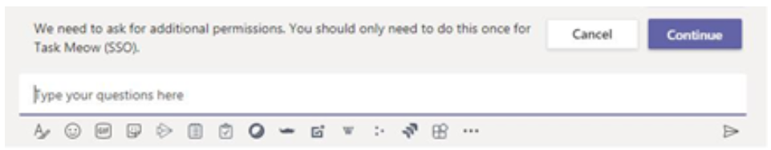
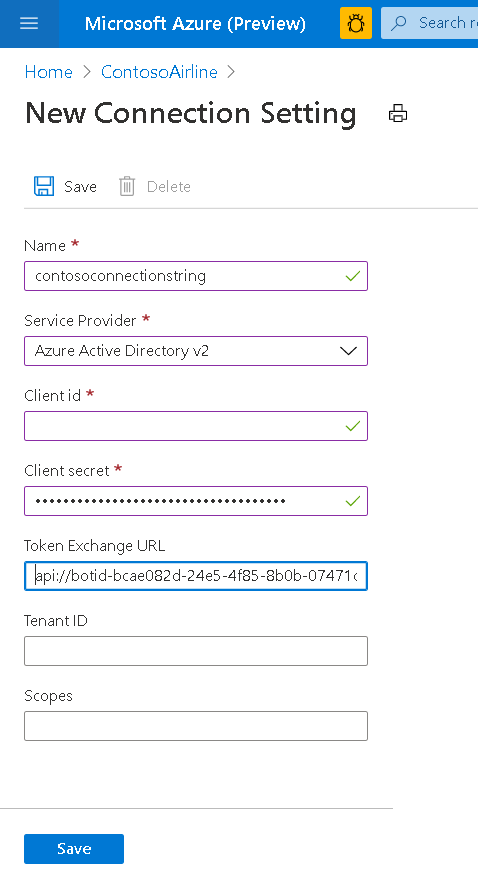

# <a name="single-sign-on-sso-support-for-bots"></a><span data-ttu-id="a6275-105">单一登录 (SSO) 对 bot 的支持</span><span class="sxs-lookup"><span data-stu-id="a6275-105">Single sign-on (SSO) support for bots</span></span>

<span data-ttu-id="a6275-106">Azure Active Directory 中的单一登录身份验证 (Azure AD) 最大限度地减少用户需要通过静默方式刷新身份验证令牌来输入其登录凭据的次数。</span><span class="sxs-lookup"><span data-stu-id="a6275-106">Single sign-on authentication in Azure Active Directory (Azure AD) minimizes the number of times users need to enter their login credentials by silently refreshing the authentication token.</span></span> <span data-ttu-id="a6275-107">如果用户同意使用您的应用程序，则无需再次在其他设备上同意，并将自动登录。</span><span class="sxs-lookup"><span data-stu-id="a6275-107">If users agrees to use your app, they will not have to consent again on another device and will be signed in automatically.</span></span> <span data-ttu-id="a6275-108">流与 " [团队" 选项卡的 SSO 支持]( ../../../tabs/how-to/authentication/auth-aad-sso.md)非常相似。</span><span class="sxs-lookup"><span data-stu-id="a6275-108">The flow is very similar to the [Teams tab SSO support]( ../../../tabs/how-to/authentication/auth-aad-sso.md).</span></span> <span data-ttu-id="a6275-109">不同之处在于，机器人如何请求令牌和接收响应的协议。</span><span class="sxs-lookup"><span data-stu-id="a6275-109">The difference is the protocol for how a bot requests tokens and receives responses.</span></span>

<span data-ttu-id="a6275-110">OAuth 2.0 是一种开放标准，用于 Azure Active Directory (Azure AD) 和许多其他标识提供程序使用的身份验证和授权。</span><span class="sxs-lookup"><span data-stu-id="a6275-110">OAuth 2.0 is an open standard for authentication and authorization used by Azure Active Directory (Azure AD) and many other identity providers.</span></span> <span data-ttu-id="a6275-111">对 OAuth 2.0 的基本了解是在团队中使用身份验证的先决条件。</span><span class="sxs-lookup"><span data-stu-id="a6275-111">A basic understanding of OAuth 2.0 is a prerequisite for working with authentication in Teams.</span></span>

## <a name="bot-sso-at-runtime"></a><span data-ttu-id="a6275-112">运行时的 Bot SSO</span><span class="sxs-lookup"><span data-stu-id="a6275-112">Bot SSO at runtime</span></span>


1. <span data-ttu-id="a6275-114">机器人发送包含属性的 OAuthCard 的邮件 `tokenExchangeResource` 。</span><span class="sxs-lookup"><span data-stu-id="a6275-114">The bot sends a message with an OAuthCard that contains the `tokenExchangeResource` property.</span></span> <span data-ttu-id="a6275-115">它告诉团队获取机器人应用程序的身份验证令牌。</span><span class="sxs-lookup"><span data-stu-id="a6275-115">It tells Teams to obtain an authentication token for the bot application.</span></span> <span data-ttu-id="a6275-116">用户在用户的所有活动终结点上接收邮件。</span><span class="sxs-lookup"><span data-stu-id="a6275-116">The user receives messages at all the active endpoints of the user.</span></span>

> [!NOTE]
> <span data-ttu-id="a6275-117">✔用户一次可以有一个以上的活动终结点。</span><span class="sxs-lookup"><span data-stu-id="a6275-117">✔ A user can have more than one active endpoint at a time.</span></span>  
> <span data-ttu-id="a6275-118">✔从用户的每个活动终结点接收 bot 令牌。</span><span class="sxs-lookup"><span data-stu-id="a6275-118">✔ The bot token is received from every active endpoint of the user.</span></span>
> <span data-ttu-id="a6275-119">✔单一登录支持目前要求在个人作用域中安装应用程序。</span><span class="sxs-lookup"><span data-stu-id="a6275-119">✔ Single sign-on support currently requires the app to be installed in personal scope.</span></span>

2. <span data-ttu-id="a6275-120">如果是当前用户第一次使用你的 bot 应用程序，则在需要同意的情况下，将会发出请求提示 () 或处理步骤验证 (如双重身份验证) ）。</span><span class="sxs-lookup"><span data-stu-id="a6275-120">If it is the first time the current user has used your bot application, there will be a request prompt to consent (if consent is required) or to handle step-up authentication (such as two-factor authentication).</span></span>

3. <span data-ttu-id="a6275-121">Microsoft 团队从当前用户的 Azure AD 终结点请求 bot 应用程序令牌。</span><span class="sxs-lookup"><span data-stu-id="a6275-121">Microsoft Teams requests the bot application token from the Azure AD endpoint for the current user.</span></span>

4. <span data-ttu-id="a6275-122">Azure AD 将机器人应用程序令牌发送给团队应用程序。</span><span class="sxs-lookup"><span data-stu-id="a6275-122">Azure AD sends the bot application token to the Teams application.</span></span>

5. <span data-ttu-id="a6275-123">Microsoft 团队将令牌以名称登录/tokenExchange 的 invoke 活动返回的 value 对象的一部分发送到 bot。</span><span class="sxs-lookup"><span data-stu-id="a6275-123">Microsoft Teams sends the token to the bot as part of the value object returned by the invoke activity with the name sign-in/tokenExchange.</span></span>
  
6. <span data-ttu-id="a6275-124">令牌将在 bot 应用程序中进行分析，以提取所需的信息，如用户的电子邮件地址。</span><span class="sxs-lookup"><span data-stu-id="a6275-124">The token will be parsed in the bot application to extract the needed information, such as the user's email address.</span></span>
  
## <a name="develop-an-single-sign-on-microsoft-teams-bot"></a><span data-ttu-id="a6275-125">开发单一登录 Microsoft 团队 bot</span><span class="sxs-lookup"><span data-stu-id="a6275-125">Develop an Single sign-on Microsoft Teams bot</span></span>
  
<span data-ttu-id="a6275-126">以下步骤是开发 SSO Microsoft 团队 bot 所必需的：</span><span class="sxs-lookup"><span data-stu-id="a6275-126">The following steps: are required to develop an SSO Microsoft Teams bot:</span></span>

1. [<span data-ttu-id="a6275-127">创建 Azure 免费帐户</span><span class="sxs-lookup"><span data-stu-id="a6275-127">Create a Azure free account</span></span>](#create-an-azure-account)
2. [<span data-ttu-id="a6275-128">更新团队应用程序清单</span><span class="sxs-lookup"><span data-stu-id="a6275-128">Update your Teams app manifest</span></span>](#update-your-app-manifest)
3. [<span data-ttu-id="a6275-129">添加代码以请求和接收 bot 令牌</span><span class="sxs-lookup"><span data-stu-id="a6275-129">Add the code to request and receive the bot token</span></span>](#request-a-bot-token)

### <a name="create-an-azure-account"></a><span data-ttu-id="a6275-130">创建 Azure 帐户</span><span class="sxs-lookup"><span data-stu-id="a6275-130">Create an Azure account</span></span>

<span data-ttu-id="a6275-131">此步骤类似于 [选项卡 SSO 流](../../../tabs/how-to/authentication/auth-aad-sso.md) 流：</span><span class="sxs-lookup"><span data-stu-id="a6275-131">This step is similar to the [tab SSO flow](../../../tabs/how-to/authentication/auth-aad-sso.md) flow:</span></span>

1. <span data-ttu-id="a6275-132">获取 [AZURE AD 应用程序 ID](/azure/active-directory/develop/howto-create-service-principal-portal#get-values-for-signing-in)。</span><span class="sxs-lookup"><span data-stu-id="a6275-132">Get your [Azure AD Application ID](/azure/active-directory/develop/howto-create-service-principal-portal#get-values-for-signing-in).</span></span>
2. <span data-ttu-id="a6275-133">指定应用程序需要的 Azure AD 终结点和 Microsoft Graph （可选）的权限。</span><span class="sxs-lookup"><span data-stu-id="a6275-133">Specify the permissions that your application needs for the Azure AD endpoint and, optionally, Microsoft Graph.</span></span>
3. <span data-ttu-id="a6275-134">[授予](/azure/active-directory/develop/howto-create-service-principal-portal#configure-access-policies-on-resources) 对团队桌面、web 和移动应用程序的权限。</span><span class="sxs-lookup"><span data-stu-id="a6275-134">[Grant permissions](/azure/active-directory/develop/howto-create-service-principal-portal#configure-access-policies-on-resources) for Teams desktop, web, and mobile applications.</span></span>
4. <span data-ttu-id="a6275-135">预授权团队通过选择 " **添加范围** " 按钮，并在打开的面板中，输入 `access_as_user` 作为 **作用域名称** 。</span><span class="sxs-lookup"><span data-stu-id="a6275-135">Pre-authorize Teams by selecting the **Add a scope** button and in the panel that opens, enter `access_as_user` as the **Scope name**.</span></span>

> [!IMPORTANT]
> * <span data-ttu-id="a6275-136">如果要构建独立的 bot，请将应用程序 ID URI 设置为 `api://botid-{YourBotId}` 。</span><span class="sxs-lookup"><span data-stu-id="a6275-136">If you are building a standalone bot, set the Application ID URI to `api://botid-{YourBotId}` .</span></span>
> * <span data-ttu-id="a6275-137">如果要使用 bot 和选项卡生成应用程序，请将应用程序 ID URI 设置为 `api://fully-qualified-domain-name.com/botid-{YourBotId}` 。</span><span class="sxs-lookup"><span data-stu-id="a6275-137">If you are building an app with a bot and a tab, set the Application ID URI to `api://fully-qualified-domain-name.com/botid-{YourBotId}`.</span></span>

### <a name="update-your-app-manifest"></a><span data-ttu-id="a6275-138">更新应用程序清单</span><span class="sxs-lookup"><span data-stu-id="a6275-138">Update your app manifest</span></span>

<span data-ttu-id="a6275-139">将新属性添加到 Microsoft 团队清单：</span><span class="sxs-lookup"><span data-stu-id="a6275-139">Add new properties to your Microsoft Teams manifest:</span></span>

<span data-ttu-id="a6275-140">**WebApplicationInfo** -以下元素的父元素：</span><span class="sxs-lookup"><span data-stu-id="a6275-140">**WebApplicationInfo** - The parent of the following elements:</span></span>

> [!div class="checklist"]
>
> * <span data-ttu-id="a6275-141">**id** -应用程序的客户端 id。</span><span class="sxs-lookup"><span data-stu-id="a6275-141">**id** - The client ID of the application.</span></span> <span data-ttu-id="a6275-142">这是您在向 Azure AD 注册应用程序的过程中获得的应用程序 ID。</span><span class="sxs-lookup"><span data-stu-id="a6275-142">This is the application ID that you obtained as part of registering the application with Azure AD.</span></span>
>* <span data-ttu-id="a6275-143">**resource** -应用程序的域和子域。</span><span class="sxs-lookup"><span data-stu-id="a6275-143">**resource** - The domain and subdomain of your application.</span></span> <span data-ttu-id="a6275-144">此 URI (包括 `api://` 您在 `scope` 上面的步骤6中创建时注册的协议) 。</span><span class="sxs-lookup"><span data-stu-id="a6275-144">This is the same URI (including the `api://` protocol) that you registered when creating your `scope` in step 6 above.</span></span> <span data-ttu-id="a6275-145">您不应 `access_as_user` 在资源中包含该路径。</span><span class="sxs-lookup"><span data-stu-id="a6275-145">You shouldn't include the `access_as_user` path in your resource.</span></span> <span data-ttu-id="a6275-146">此 URI 的域部分应与在团队应用程序清单的 Url 中使用的域（包括任何子域）相匹配。</span><span class="sxs-lookup"><span data-stu-id="a6275-146">The domain part of this URI should match the domain, including any subdomains, used in the URLs of your Teams application manifest.</span></span>

```json
"webApplicationInfo": {
  "id": "00000000-0000-0000-0000-000000000000",
  "resource": "api://subdomain.example.com/00000000-0000-0000-0000-000000000000"
}
```

### <a name="request-a-bot-token"></a><span data-ttu-id="a6275-147">请求 bot 令牌</span><span class="sxs-lookup"><span data-stu-id="a6275-147">Request a bot token</span></span>

<span data-ttu-id="a6275-148">获取令牌的请求是使用现有邮件架构)  (正常的 POST 邮件请求。</span><span class="sxs-lookup"><span data-stu-id="a6275-148">The request to get the token is a normal POST message request (using the existing message schema).</span></span> <span data-ttu-id="a6275-149">它包含在 OAuthCard 的附件中。</span><span class="sxs-lookup"><span data-stu-id="a6275-149">It is included in the attachments of an OAuthCard.</span></span> <span data-ttu-id="a6275-150">OAuthCard 类的架构在 [Microsoft Bot 架构 4.0](/dotnet/api/microsoft.bot.schema.oauthcard?view=botbuilder-dotnet-stable&preserve-view=true) 中定义，与登录卡非常相似。</span><span class="sxs-lookup"><span data-stu-id="a6275-150">The schema for the OAuthCard class is defined in [Microsoft Bot Schema 4.0](/dotnet/api/microsoft.bot.schema.oauthcard?view=botbuilder-dotnet-stable&preserve-view=true) and it is very similar to a sign-in card.</span></span> <span data-ttu-id="a6275-151">如果在卡片上填充了该属性，则团队会将此请求视为无提示令牌获取 `TokenExchangeResource` 。</span><span class="sxs-lookup"><span data-stu-id="a6275-151">Teams will treat this request as a silent token acquisition if the `TokenExchangeResource` property is populated on the card.</span></span> <span data-ttu-id="a6275-152">对于 "团队渠道"，我们仅接受 `Id` 唯一标识令牌请求的属性。</span><span class="sxs-lookup"><span data-stu-id="a6275-152">For the Teams channel we honor only the `Id` property, which uniquely identifies a token request.</span></span>

<span data-ttu-id="a6275-153">如果这是用户第一次使用您的应用程序，并且需要用户同意，则将显示一个对话框，以继续使用与下面类似的同意体验。</span><span class="sxs-lookup"><span data-stu-id="a6275-153">If this is the first time the user is using your application and the user consent is required, the user will be shown a dialog to continue with the consent experience similar to the one below.</span></span> <span data-ttu-id="a6275-154">当用户选择 " **继续** " 时，将根据是否定义了 Bot 以及 OAuthCard 上的登录按钮，将发生两个不同的情况。</span><span class="sxs-lookup"><span data-stu-id="a6275-154">When the user selects **Continue** , two different things occur depending on whether the bot is defined or not and a sign-in button on the OAuthCard.</span></span>



<span data-ttu-id="a6275-156">如果机器人定义了登录按钮，则 bot 的登录流将以类似于邮件流中的卡按钮的登录流的方式触发。</span><span class="sxs-lookup"><span data-stu-id="a6275-156">If the bot defines a sign-in button, the sign-in flow for bots will be triggered similarly to the sign-in flow from a card button in a message stream.</span></span> <span data-ttu-id="a6275-157">由开发人员决定要求用户同意哪些权限。</span><span class="sxs-lookup"><span data-stu-id="a6275-157">It is up to the developer to decide which permissions to ask for the user to consent.</span></span> <span data-ttu-id="a6275-158">如果需要具有权限的令牌 `openId` （例如，如果要交换 graph 资源的令牌），则建议使用此方法。</span><span class="sxs-lookup"><span data-stu-id="a6275-158">This approach is recommended if you need a token with permissions beyond `openId`, for example, if you want to exchange the token for graph resources.</span></span>

<span data-ttu-id="a6275-159">如果 bot 未在卡片上提供登录按钮，则会触发用户对最少一组权限的同意。</span><span class="sxs-lookup"><span data-stu-id="a6275-159">If the bot is not providing a sign-in button on the card, it triggers user consent for a minimal set of permissions.</span></span> <span data-ttu-id="a6275-160">此令牌对基本身份验证和获取用户电子邮件地址非常有用。</span><span class="sxs-lookup"><span data-stu-id="a6275-160">This token is useful for basic authentication and getting the user email address.</span></span>

<span data-ttu-id="a6275-161">**不带登录按钮的 c # 令牌请求** ：</span><span class="sxs-lookup"><span data-stu-id="a6275-161">**C# token request without a sign-in button** :</span></span>

```csharp
var attachment = new Attachment
            {
                Content = new OAuthCard
                {
                    TokenExchangeResource = new TokenExchangeResource
                    {
                        Id = requestId
                    }
                },
                ContentType = OAuthCard.ContentType,
            };
            var activity = MessageFactory.Attachment(attachment);

            // NOTE: This activity needs to be sent in the 1:1 conversation between the bot and the user. 
            // If the bot supports group and channel scope, this code should be updated to send the request to the 1:1 chat. 

   await turnContext.SendActivityAsync(activity, cancellationToken);
```

#### <a name="receiving-the-token"></a><span data-ttu-id="a6275-162">接收令牌</span><span class="sxs-lookup"><span data-stu-id="a6275-162">Receiving the token</span></span>

<span data-ttu-id="a6275-163">令牌的响应是通过具有相同架构的调用活动发送的，而是由其他人调用，因为它会立即接收到这些活动。</span><span class="sxs-lookup"><span data-stu-id="a6275-163">The response with the token is sent through an invoke activity with the same schema as others invoke activities the bots receive today.</span></span> <span data-ttu-id="a6275-164">唯一的区别是调用名称、 **登录/tokenExchange** 和 **值** 字段，其中包含的 **Id** (最初请求获取令牌的字符串) 和 **令牌** 字段 (包含令牌) 的字符串值。</span><span class="sxs-lookup"><span data-stu-id="a6275-164">The only difference is the invoke name, **sign-in/tokenExchange** and the **value** field which will contain the **Id** (a string) of the initial request to get the token and the **token** field (a string value including the token).</span></span> <span data-ttu-id="a6275-165">请注意，如果用户有多个活动终结点，则可能会收到针对给定请求的多个响应。</span><span class="sxs-lookup"><span data-stu-id="a6275-165">Please note that you might receive multiple responses for a given request if the user has multiple active endpoints.</span></span> <span data-ttu-id="a6275-166">您可以使用令牌 deduplicate 响应。</span><span class="sxs-lookup"><span data-stu-id="a6275-166">It is up to you to deduplicate the responses with the token.</span></span>

<span data-ttu-id="a6275-167">**用于响应处理调用活动的 c # 代码** ：</span><span class="sxs-lookup"><span data-stu-id="a6275-167">**C# code to respond to handle the invoke activity** :</span></span>

```csharp
protected override async Task<InvokeResponse> OnInvokeActivity
  (ITurnContext<IInvokeActivity> turnContext, CancellationToken cancellationToken)
        {
            try
            {
                if (turnContext.Activity.Name == SignInConstants.TokenExchangeOperationName && turnContext.Activity.ChannelId == Channels.Msteams)
                {
                    await OnTokenResponse(turnContext, cancellationToken);
                    return new InvokeResponse() { Status = 200 };
                }
                else
                {
                    return await base.OnInvokeActivityAsync(turnContext, cancellationToken);
                }
            }
            catch (InvokeResponseException e)
            {
                return e.CreateInvokeResponse();
            }
        }
```

<span data-ttu-id="a6275-168">的 `turnContext.activity.value` 类型为 [TokenExchangeInvokeRequest](/dotnet/api/microsoft.bot.schema.tokenexchangeinvokerequest?view=botbuilder-dotnet-stable&preserve-view=true) ，包含可供你的 bot 继续使用的令牌。</span><span class="sxs-lookup"><span data-stu-id="a6275-168">The `turnContext.activity.value` is of type [TokenExchangeInvokeRequest](/dotnet/api/microsoft.bot.schema.tokenexchangeinvokerequest?view=botbuilder-dotnet-stable&preserve-view=true) and contains the token that can be further used by your bot.</span></span> <span data-ttu-id="a6275-169">出于性能原因，安全地存储标记并刷新它们。</span><span class="sxs-lookup"><span data-stu-id="a6275-169">Store the tokens securely for performance reasons and refresh them.</span></span>

### <a name="update-the-azure-portal-with-the-oauth-connection"></a><span data-ttu-id="a6275-170">使用 OAuth 连接更新 Azure 门户</span><span class="sxs-lookup"><span data-stu-id="a6275-170">Update the Azure portal with the OAuth connection</span></span>

1. <span data-ttu-id="a6275-171">在 Azure 门户中，导航回 **机器人通道注册** 。</span><span class="sxs-lookup"><span data-stu-id="a6275-171">In the Azure Portal, navigate back to the **Bot Channels Registration**.</span></span>

2. <span data-ttu-id="a6275-172">切换到 " **设置** " 边栏选项卡，然后选择 "OAuth 连接设置" 部分下的 " **添加设置** "。</span><span class="sxs-lookup"><span data-stu-id="a6275-172">Switch to the **Settings** blade and choose **Add Setting** under the OAuth Connection Settings section.</span></span>


3. <span data-ttu-id="a6275-174">完成 " **连接设置** " 窗体：</span><span class="sxs-lookup"><span data-stu-id="a6275-174">Complete the **Connection Setting** form:</span></span>

> [!div class="checklist"]
>
> * <span data-ttu-id="a6275-175">为新的连接设置输入一个名称。</span><span class="sxs-lookup"><span data-stu-id="a6275-175">Enter a name for your new Connection Setting.</span></span> <span data-ttu-id="a6275-176">这将是在 **步骤 5** 中的 bot 服务代码的设置中引用的名称。</span><span class="sxs-lookup"><span data-stu-id="a6275-176">This will be the name that gets referenced inside the settings of your bot service code in **step 5**.</span></span>
> * <span data-ttu-id="a6275-177">在 "服务提供商" 下拉列表中，选择 " **Azure Active Directory V2** "。</span><span class="sxs-lookup"><span data-stu-id="a6275-177">In the Service Provider dropdown, select **Azure Active Directory V2**.</span></span>
>* <span data-ttu-id="a6275-178">输入 AAD 应用程序的客户端凭据。</span><span class="sxs-lookup"><span data-stu-id="a6275-178">Enter the client credentials for the AAD application.</span></span>
>* <span data-ttu-id="a6275-179">对于令牌交换 URL，请使用在 AAD 应用程序的上一步骤中定义的范围值。</span><span class="sxs-lookup"><span data-stu-id="a6275-179">For the Token Exchange URL, use the scope value defined in the previous step of your AAD application.</span></span> <span data-ttu-id="a6275-180">令牌交换 URL 的存在指示为 SDK 配置此 AAD 应用程序的 SSO。</span><span class="sxs-lookup"><span data-stu-id="a6275-180">The presence of the Token Exchange URL is indicating to the SDK that this AAD application is configured for SSO.</span></span>
>* <span data-ttu-id="a6275-181">将 "公用" 指定为 **租户 ID** 。</span><span class="sxs-lookup"><span data-stu-id="a6275-181">Specify "common" as the **Tenant ID**.</span></span>
>* <span data-ttu-id="a6275-182">在为 AAD 应用程序指定对下游 Api 的权限时，添加所有配置的作用域。</span><span class="sxs-lookup"><span data-stu-id="a6275-182">Add all the scopes configured when specifying permissions to downstream APIs for your AAD application.</span></span> <span data-ttu-id="a6275-183">使用提供的客户端 id 和客户端密码，令牌存储将为您交换带有定义的权限的图形令牌的令牌。</span><span class="sxs-lookup"><span data-stu-id="a6275-183">With the client id and client secret provided, token store will exchange the token for a graph token with defined permissions for you.</span></span>
>* <span data-ttu-id="a6275-184">选择“ **保存** ”。</span><span class="sxs-lookup"><span data-stu-id="a6275-184">Select **Save**.</span></span>



### <a name="update-the-auth-sample"></a><span data-ttu-id="a6275-186">更新身份验证示例</span><span class="sxs-lookup"><span data-stu-id="a6275-186">Update the auth sample</span></span>

<span data-ttu-id="a6275-187">从 " [团队" auth 示例](https://github.com/microsoft/BotBuilder-Samples/tree/master/samples/csharp_dotnetcore/46.teams-auth)开始。</span><span class="sxs-lookup"><span data-stu-id="a6275-187">Start with the [teams auth sample](https://github.com/microsoft/BotBuilder-Samples/tree/master/samples/csharp_dotnetcore/46.teams-auth).</span></span>

1. <span data-ttu-id="a6275-188">更新 TeamsBot 以包含以下项。</span><span class="sxs-lookup"><span data-stu-id="a6275-188">Update the TeamsBot to include the following.</span></span> <span data-ttu-id="a6275-189">若要处理传入请求的 deduping，请参阅以下内容：</span><span class="sxs-lookup"><span data-stu-id="a6275-189">To handle the deduping of the incoming request, see below:</span></span>

```csharp
 protected override async Task OnSignInInvokeAsync(ITurnContext<IInvokeActivity> turnContext, CancellationToken cancellationToken)
        {
            await Dialog.RunAsync(turnContext, ConversationState.CreateProperty<DialogState>(nameof(DialogState)), cancellationToken);
        }
    protected override async Task OnTokenResponseEventAsync(ITurnContext<IEventActivity> turnContext, CancellationToken cancellationToken)
        {
            await Dialog.RunAsync(turnContext, ConversationState.CreateProperty<DialogState>(nameof(DialogState)), cancellationToken);
        }
```
  
2. <span data-ttu-id="a6275-190">更新 `appsettings.json` 以包含 `botId` 上面定义的、密码和连接名称。</span><span class="sxs-lookup"><span data-stu-id="a6275-190">Update the `appsettings.json` to include the `botId`, password, and the connection name defined above.</span></span>
3. <span data-ttu-id="a6275-191">更新清单，并确保 `token.botframework.com` 在 "有效域" 部分中。</span><span class="sxs-lookup"><span data-stu-id="a6275-191">Update the manifest and ensure that `token.botframework.com` is in the valid domains section.</span></span>
4. <span data-ttu-id="a6275-192">使用配置文件图像对清单进行压缩，并将其安装在团队中。</span><span class="sxs-lookup"><span data-stu-id="a6275-192">Zip the manifest with the profile images and install it in Teams.</span></span>

#### <a name="additional-code-samples"></a><span data-ttu-id="a6275-193">其他代码示例</span><span class="sxs-lookup"><span data-stu-id="a6275-193">Additional code samples</span></span>

* <span data-ttu-id="a6275-194">[使用 Bot 框架 SDK 的 c # 示例](https://microsoft-my.sharepoint-df.com/:u:/p/vul/ETZQfeTViDlCv-frjgTIincB7dvk2HOnma1TLvcoeGGIxg?e=uPq62c)。</span><span class="sxs-lookup"><span data-stu-id="a6275-194">[C# sample using the Bot Framework SDK](https://microsoft-my.sharepoint-df.com/:u:/p/vul/ETZQfeTViDlCv-frjgTIincB7dvk2HOnma1TLvcoeGGIxg?e=uPq62c).</span></span>

* <span data-ttu-id="a6275-195">[C # 示例使用 Bot 框架 SDK deduplicate 令牌请求](https://microsoft.sharepoint.com/:u:/t/ExtensibilityandFundamentals/Ea36rUGiN1BGt1RiLOb-mY8BGMF8NwPtronYGym0sCGOTw?e=4bB682)。</span><span class="sxs-lookup"><span data-stu-id="a6275-195">[C# sample using the Bot Framework SDK to deduplicate the token request](https://microsoft.sharepoint.com/:u:/t/ExtensibilityandFundamentals/Ea36rUGiN1BGt1RiLOb-mY8BGMF8NwPtronYGym0sCGOTw?e=4bB682).</span></span>

* [<span data-ttu-id="a6275-196">不使用 Bot 框架 SDK 令牌存储的 c # 示例</span><span class="sxs-lookup"><span data-stu-id="a6275-196">C# sample without using the Bot Framework SDK token store</span></span>](https://microsoft-my.sharepoint-df.com/:u:/p/tac/EceKDXrkMn5AuGbh6iGid8ABKEVQ6hkxArxK1y7-M8OVPw)
