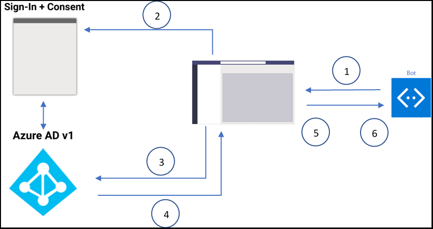

# <a name="single-sign-on-sso-support-for-bots"></a>机器人的单一登录 (SSO) 支持

Microsoft Azure Active Directory (Azure AD) 中的单一登录身份验证以无提示方式刷新身份验证令牌，最大限度地减少了用户需要输入其登录凭据的次数。 如果用户同意使用应用，则他们不必在另一台设备上再次同意，因为他们会自动登录。 选项卡和机器人具有类似的 SSO 支持流程。 但是，机器人会使用不同的协议[请求令牌](#request-a-bot-token)和[接收响应](#receive-the-bot-token)。

>[!NOTE]
> OAuth 2.0 是 Azure AD 和许多其他标识提供者用于身份验证和授权的开放标准。 基本了解 OAuth 2.0 是在 Teams 中使用身份验证的先决条件。

## <a name="bot-sso-at-runtime"></a>运行时机器人 SSO

下图演示了机器人中的 SSO 流程：



以下步骤可帮助你使用身份验证和机器人应用程序令牌：

1. 机器人使用包含 `tokenExchangeResource` 的 OAuthCard 向 Teams 发送消息，以获取机器人应用程序的身份验证令牌。 用户在所有活动用户终结点接收消息。

   > [!NOTE]
   >
   > * 一个用户一次可以有多个活动终结点。
   > * 机器人令牌接收自每个活动用户终结点。
   > * 应用必须安装在个人作用域内才能支持 SSO。

1. 如果当前用户是第一次使用机器人应用程序，则会向用户显示请求提示以执行以下操作之一：
    * 请在必要时提供同意。
    * 处理逐步处理的身份验证，例如双因素身份验证。

1. Teams 从当前用户的 Azure AD 终结点请求机器人应用程序令牌。

1. Azure AD 将机器人应用程序令牌发送到 Teams 应用程序。

1. Teams 将令牌作为使用 **sign in/tokenExchange** 进行调用时返回的值对象的一部分发送给机器人。
  
1. 机器人应用程序中分析的令牌提供用户的电子邮件地址等所需信息。
  
## <a name="develop-an-sso-teams-bot"></a>开发 SSO Teams 机器人
  
以下步骤指导你开发 SSO Teams 机器人：

1. [通过 Azure AD 门户注册应用](#register-your-app-through-the-azure-ad-portal)。
1. [更新机器人的 Teams 应用程序清单](#update-your-teams-application-manifest-for-your-bot)。
1. [添加代码以请求和接收机器人令牌](#add-the-code-to-request-and-receive-a-bot-token)。

### <a name="register-your-app-through-the-azure-ad-portal"></a>通过 Azure AD 门户注册应用

通过 Azure AD 门户注册应用的步骤类似于[选项卡 SSO 流程](../../../tabs/how-to/authentication/tab-sso-overview.md)。 以下步骤指导你注册应用：

1. 在 [Azure Active Directory – 应用注册](https://go.microsoft.com/fwlink/?linkid=2083908)门户中注册新应用程序。

1. 选择“**新注册**”。 将显示 **注册应用程序** 页。

    

1. 在“**注册应用程序**”页面中，执行以下操作:

   > [!NOTE]
   >
   > 如果 Azure AD 应用在用户在 Teams 中发出身份验证请求的同一租户中注册，则不会要求用户同意，并且他们会立即获得访问令牌。 但是，如果在其他租户中注册了 Azure AD 应用，则用户必须同意这些权限。

    * 输入应用的 **名称**。
    * 选择“**支持的帐户类型**”，例如单租户或多租户。
    * 选择“**注册**”。

    

1. 转到概述页面。
1. 复制“**应用程序（客户端）ID**”的值。
1. 在“**管理**”下，转到“**公开 API**”。

   > [!TIP]
   > 若要稍后更新应用清单，请保存“**应用程序（客户端）ID**”值。

   > [!IMPORTANT]
   >
   > * 如果正构建独立机器人，请将应用程序 ID URI 输入为 `api://botid-{YourBotId}`。 此处 *YourBotId* 是 Azure AD 应用程序 ID。
   > * 如果要使用机器人和选项卡生成应用，请输入应用程序 ID URI 作为 `api://fully-qualified-domain-name.com/botid-{YourBotId}`。

1. 选择“**添加作用域**”。
1. 在提示的面板中，输入 `access_as_user` 作为“**作用域名称**”。

   >[!NOTE]
   > 用于添加客户端应用的“access_as_user”作用域适用于“管理员和用户”。
   >
   > 必须注意以下重要限制：
   >
   > * 仅支持用户级 Microsoft Graph API 权限，例如电子邮件、配置文件、offline_access 和 OpenId。 如果需要访问其他 Microsoft Graph 范围，例如`User.Read``Mail.Read`，请参阅[具有 Microsoft Graph 权限和范围的“扩展”选项卡应用](../../../tabs/how-to/authentication/tab-sso-graph-api.md)。
   > * 应用程序的域名必须与为 Azure AD 应用程序注册的域名相同。
   > * 当前不支持每个应用多个域。
   > * 不支持使用 `azurewebsites.net` 域的应用程序，因为它很常见，可能存在安全风险。

1. 在“**谁可以同意？**”框中，输入“**管理员和用户**”。
1. 输入以下详细信息，以使用适用于 `access_as_user` 作用域的值配置管理员和用户同意提示。
    * **管理员同意显示名称：** Teams 可以访问用户的个人资料。
    * **管理员同意说明**：Teams 可以作为当前用户调用应用程序的 web API。
    * **用户同意显示名称**：Teams 可以访问你的个人资料并代表你发出请求。
    * **用户同意说明**：Teams 可以使用与用户相同的权限调用此应用的 API。

    

1. 确保状态设置为“**已启用**”。

    

1. 选择“**添加作用域**”以保存详细信息。显示的“**作用域名称**”的域部分应自动与上一步骤中设置的 **应用程序 ID** URI 匹配，并将 `/access_as_user` 附加到末尾 `api://subdomain.example.com/00000000-0000-0000-0000-000000000000/access_as_user`。

1. 在“**授权的客户端应用程序**”中，确定要授权给应用的 Web 应用程序的应用程序。
1. 选择 **添加客户端应用程序**。

    

1. 输入以下每个客户端 ID，然后选择在上一步中创建的授权范围：
    * 对于 Teams 移动或桌面应用程序，`1fec8e78-bce4-4aaf-ab1b-5451cc387264`。
    * 对于 Teams Web 应用程序，`5e3ce6c0-2b1f-4285-8d4b-75ee78787346`。

    

1. 转到“**身份验证**”。
1. 在“**平台配置**”中，选择“**添加平台**”。

    

1. 选择“Web”

    

1. 输入应用的“**重定向 URI**”。

   >[!NOTE]
   > 此 URI 应为完全限定的域名。 它后跟发送身份验证响应的 API 路由。 如果正在关注任何 Teams 示例，则 URI 为 `https://token.botframework.com/.auth/web/redirect`。 有关详细信息，请参阅 [OAuth 2.0 授权代码流](/azure/active-directory/develop/v2-oauth2-auth-code-flow)。

    

1. 以下步骤将帮助你启用隐式授予：
    * 从左窗格中选择“**身份验证**”。
    * 选中“**访问令牌**”和“**ID 令牌**”复选框。

    

    * 选择“**保存**”以保存更改。

1. 添加必要的 **API 权限**。
    * 从左窗格中选择“**API 权限**”。
    * 选择“**添加平台**”以向下游 API（例如 User.Read）添加应用所需的任何权限。

#### <a name="update-manifest-in-microsoft-azure-portal"></a>在 Microsoft Azure 门户中更新清单

以下步骤将指导你在 Azure 门户中更新机器人清单：

1. 从左窗格中选择“**清单**”。
1. 确保配置项设置为 **"accessTokenAcceptedVersion": 2**。 如果没有，请将其值更改为 **2**。

    

   >[!NOTE]
   > 如果已在 Teams 中测试机器人，则必须从此应用注销并从 Teams 注销。 然后再次登录以查看此更改。

1. 选择“保存”。

#### <a name="update-the-azure-portal-with-the-oauth-connection"></a>使用 OAuth 连接更新 Azure 门户

以下步骤将指导你使用 OAuth 连接更新 Azure 门户：

1. 在 Azure 门户中，转到 [**AzureBot**](https://ms.portal.azure.com/#create/Microsoft.AzureBot)
1. 转到左窗格上的“**配置**”。
1. 选择“**添加 OAuth 连接设置**”。

    

1. 以下步骤将指导你完成“**新连接设置**”表单：

   >[!NOTE]
   > Azure AD 应用程序中可能需要 **隐式授予**。

    * 在“**新连接设置**”页面中输入 **名称**。

    >[!NOTE]
    > 在“[运行时机器人 SSO](#bot-sso-at-runtime)”的 *步骤 5* 中，“**名称**”将引用机器人服务代码的设置。

    * 从“**服务提供商**”下拉列表中，选择“**Azure Active Directory v2**”。
    * 输入客户端凭据，例如 Azure AD 应用程序的 **客户端 ID** 和 **客户端密码**。
    * 例如，对于“**令牌交换 URL**”，请使用 [更新机器人的 Teams应用程序清单](#update-your-teams-application-manifest-for-your-bot)中定义的作用域值，例如 `api://botid-<your-app-id>/`。 令牌 Exchange URL 向 SDK 指示为 SSO 配置此 Azure AD 应用程序。
    * 在“**租户 ID**”中，输入 *common*。
    * 为 Azure AD 应用程序指定对下游 API 的权限时，添加配置的所有 **作用域**。 在提供客户端 ID 和客户端密码后，令牌存储将交换具有所定义权限的图形令牌的令牌。
    * 选择“保存”。
    * 选择“**应用**”。

    

### <a name="update-your-teams-application-manifest-for-your-bot"></a>更新机器人的 Teams 应用程序清单

如果应用程序包含独立机器人，则使用以下代码将新属性添加到 Teams 应用程序清单：

```json
    "webApplicationInfo": 
        {
            "id": "00000000-0000-0000-0000-000000000000",
            "resource": "api://botid-00000000-0000-0000-0000-000000000000"
        }
```

如果应用程序包含机器人和选项卡，则使用以下代码将新属性添加到 Teams 应用程序清单：

```json
    "webApplicationInfo": 
        {
            "id": "00000000-0000-0000-0000-000000000000",
            "resource": "api://subdomain.example.com/botid-00000000-0000-0000-0000-000000000000"
        }
```

**webApplicationInfo** 是下列元素的父元素：

* **id** - 应用程序的客户端 ID。 它是在向 Azure AD 注册应用程序时获取的应用程序 ID。 请勿将此应用程序 ID 与多个 Teams 应用共享。 为使用 `webApplicationInfo` 的每个应用程序清单创建新的 Azure AD 应用。
* **resource** - 应用程序的域和子域。 这是在[通过 Azure AD 门户注册应用](#register-your-app-through-the-azure-ad-portal)中创建 `scope` 时注册的相同 URI（包括 `api://` 协议）。 请勿在资源中包含 `access_as_user` 路径。 此 URI 的域部分必须与 Teams 应用程序清单的 URL 中使用的域和子域匹配。

### <a name="add-the-code-to-request-and-receive-a-bot-token"></a>添加代码以请求和接收机器人令牌

#### <a name="request-a-bot-token"></a>请求机器人令牌

获取令牌的请求是使用现有消息架构的常规 POST 消息请求。 它包含在 OAuthCard 的附件中。 OAuthCard 类的架构在 [Microsoft Bot Schema 4.0](/dotnet/api/microsoft.bot.schema.oauthcard?view=botbuilder-dotnet-stable&preserve-view=true) 中定义，它类似于登录卡片。 如果卡片上填充了 `TokenExchangeResource` 属性，则 Teams 会将此请求视为无提示令牌获取。 对于 Teams 频道，仅接受唯一标识令牌请求的 `Id` 属性。

>[!NOTE]
> SSO 身份验证支持 Microsoft Bot Framework `OAuthPrompt` 或 `MultiProviderAuthDialog`。

如果用户是第一次使用应用程序且需要用户同意，则会显示以下对话框以继续提供同意体验：


当用户选择“**继续**”时，将发生以下事件：

* 如果机器人定义登录按钮，则会激活机器人的登录流，这类似于消息流中 OAuth 卡片按钮的登录流程。 开发人员必须决定哪些权限需要用户同意。 如果需要权限超出 `openId` 的令牌，则建议使用此方法。 例如，如果要交换图形资源的令牌。

* 如果机器人没有在 OAuth 卡片上提供登录按钮，则需要获得用户同意才能获得最小的权限集。 此令牌可用于基本身份验证和获取用户的电子邮件地址。

##### <a name="c-token-request-without-a-sign-in-button"></a>没有登录按钮的 C# 令牌请求

```csharp
    var attachment = new Attachment
            {
                Content = new OAuthCard
                {
                    TokenExchangeResource = new TokenExchangeResource
                    {
                        Id = requestId
                    }
                },
                ContentType = OAuthCard.ContentType,
            };
            var activity = MessageFactory.Attachment(attachment);

            // NOTE: This activity needs to be sent in the 1:1 conversation between the bot and the user. 
            // If the bot supports group and channel scope, this code should be updated to send the request to the 1:1 chat. 

       await turnContext.SendActivityAsync(activity, cancellationToken);
```

#### <a name="receive-the-bot-token"></a>接收机器人令牌

带有令牌的响应通过调用活动发送，该调用活动的架构与机器人今天接收的其他调用活动相同。 唯一区别是调用名称 **sign in/tokenExchange** 和“**值**”字段。 “**值**”字段包含 **ID**、获取令牌的初始请求的字符串和 **令牌** 字段（包括令牌的字符串值）。

>[!NOTE]
> 如果用户有多个活动终结点，则可能会收到给定请求的多个响应。 必须使用令牌对响应进行重复数据删除。

##### <a name="c-code-to-handle-the-invoke-activity"></a>用于处理调用活动的 C# 代码

```csharp
    protected override async Task<InvokeResponse> OnInvokeActivityAsync
    (ITurnContext<IInvokeActivity> turnContext, CancellationToken cancellationToken)
            {
                try
                {
                    if (turnContext.Activity.Name == SignInConstants.TokenExchangeOperationName && turnContext.Activity.ChannelId == Channels.Msteams)
                    {
                        await OnTokenResponseEventAsync(turnContext, cancellationToken);
                        return new InvokeResponse() { Status = 200 };
                    }
                    else
                    {
                        return await base.OnInvokeActivityAsync(turnContext, cancellationToken);
                    }
                }
                catch (InvokeResponseException e)
                {
                    return e.CreateInvokeResponse();
                }
            }
```

`turnContext.activity.value` 的类型为 [TokenExchangeInvokeRequest](/dotnet/api/microsoft.bot.schema.tokenexchangeinvokerequest?view=botbuilder-dotnet-stable&preserve-view=true)，包含机器人可以进一步使用的令牌。 出于性能原因，必须存储令牌并刷新它们。

### <a name="token-exchange-failure"></a>令牌交换失败

如果存在令牌交换失败，请使用以下代码：

```json
{ 
    "status": "<response code>", 
    "body": 
    { 
        "id":"<unique Id>", 
        "connectionName": "<connection Name on the bot (from the OAuth card)>", 
        "failureDetail": "<failure reason if status code is not 200, null otherwise>" 
    } 
}
```

若要了解当令牌交换无法触发同意提示时机器人的操作，请参阅以下步骤：

>[!NOTE]
> 不需要用户执行任何操作，因为当令牌交换失败时，机器人会执行操作。

1. 客户端开始与触发 OAuth 方案的机器人对话。
2. 机器人将 OAuth 卡片发送回客户端。
3. 客户端会在向用户显示 OAuth 卡片之前截获该卡片，并检查它是否包含 `TokenExchangeResource` 属性。
4. 如果该属性存在，则客户端会向机器人发送 `TokenExchangeInvokeRequest`。 客户端必须具有用户的可交换令牌，该令牌必须是 Azure AD v2 令牌，并且其受众必须与 `TokenExchangeResource.Uri` 属性相同。 客户端使用以下代码向机器人发送调用活动：

    ```json
    {
        "type": "Invoke",
        "name": "signin/tokenExchange",
        "value": 
        {
            "id": "<any unique Id>",
            "connectionName": "<connection Name on the skill bot (from the OAuth card)>",
            "token": "<exchangeable token>"
        }
    }
    ```

5. 机器人处理 `TokenExchangeInvokeRequest` 并将 `TokenExchangeInvokeResponse` 返回给客户端。 客户端必须等到它收到 `TokenExchangeInvokeResponse`。

    ```json
    {
        "status": "<response code>",
        "body": 
        {
            "id":"<unique Id>",
            "connectionName": "<connection Name on the skill bot (from the OAuth card)>",
            "failureDetail": "<failure reason if status code is not 200, null otherwise>"
        }
    }
    ```

6. 如果 `TokenExchangeInvokeResponse` 的 `status` 为 `200`，则客户端不会显示 OAuth 卡片。 请参阅[正常流程图像](/azure/bot-service/bot-builder-concept-sso?view=azure-bot-service-4.0#sso-components-interaction&preserve-view=true)。 对于任何其他 `status` 或如果未收到 `TokenExchangeInvokeResponse`，客户端会向用户显示 OAuth 卡片。 请参阅[回退流程图像](/azure/bot-service/bot-builder-concept-sso?view=azure-bot-service-4.0#sso-components-interaction&preserve-view=true)。 如果存在任何错误或未满足的依赖项（如用户同意），此活动可确保 SSO 流回退到正常的 OAuthCard 流程。

### <a name="update-the-auth-sample"></a>更新身份验证示例

打开 [Teams 身份验证示例](https://github.com/microsoft/BotBuilder-Samples/tree/master/samples/csharp_dotnetcore/46.teams-auth)，然后完成以下步骤来更新它：

1. 通过包含以下代码来更新 TeamsBot，以处理传入请求的重复数据删除：

    ```csharp
        protected override async Task OnSignInInvokeAsync(ITurnContext<IInvokeActivity> turnContext, CancellationToken cancellationToken)
            {
                await Dialog.RunAsync(turnContext, ConversationState.CreateProperty<DialogState>(nameof(DialogState)), cancellationToken);
            }
        protected override async Task OnTokenResponseEventAsync(ITurnContext<IEventActivity> turnContext, CancellationToken cancellationToken)
            {
                await Dialog.RunAsync(turnContext, ConversationState.CreateProperty<DialogState>(nameof(DialogState)), cancellationToken);
            }
    ```
  
2. 更新 `appsettings.json` 以包含[使用 OAuth 连接更新 Azure 门户](#update-the-azure-portal-with-the-oauth-connection)中定义的 `botId`、密码和连接名称。
3. 更新清单并确保 `token.botframework.com` 在有效的域列表中。 有关详细信息，请参阅 [Teams 身份验证示例](https://github.com/microsoft/BotBuilder-Samples/tree/master/samples/csharp_dotnetcore/46.teams-auth)。
4. 压缩包含个人资料图像的清单，并将其安装在 Teams 中。

## <a name="code-sample"></a>代码示例

|**示例名称** | **说明** |**.NET** |
|----------------|-----------------|--------------|
|Bot Framework SDK | Bot Framework SDK 的使用示例。 |[View](https://github.com/microsoft/BotBuilder-Samples/tree/main/samples/csharp_dotnetcore/46.teams-auth)|

## <a name="step-by-step-guide"></a>分步指南

按照[分步指南](../../../sbs-bots-with-sso.yml)进行操作，该指南可帮助你创建启用了 SSO 身份验证的机器人。
