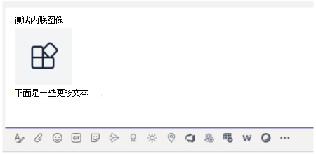

# <a name="send-and-receive-files-through-the-bot"></a>通过自动程序发送和接收文件

> [!IMPORTANT]
> 本文档中的文章基于 v4 Bot Framework SDK。

有两种方法向自动程序发送和接收文件：

* [**使用 Microsoft Graph API：**](#use-the-graph-apis)此方法适用于所有作用域中的Microsoft Teams程序：
  * `personal`
  * `channel`
  * `groupchat`

* [**使用Teams程序 API：**](#use-the-teams-bot-apis)这些仅支持上下文中`personal`的文件。

## <a name="use-the-graph-apis"></a>使用Graph API

使用 Graph API 发布包含引用现有 SharePoint 文件的卡片附件OneDrive [SharePoint](/onedrive/developer/rest-api/)。 若要使用Graph API，请通过标准 OAuth 2.0 授权流获取对以下任一项的访问权限：

* 用户的文件和OneDrive文件夹`personal``groupchat`。
* 团队频道中的文件。`channel`

Graph API 在所有作用域Teams工作。 有关详细信息，请参阅 [发送聊天消息文件附件](/graph/api/chatmessage-post?view=graph-rest-beta&tabs=http#example-4-file-attachments&preserve-view=true)。

或者，可以使用自动程序 API 将文件发送到自动程序Teams接收文件。

## <a name="use-the-teams-bot-apis"></a>使用Teams程序 API

> [!NOTE]
> Teams自动程序 API 仅在上下文中`personal`工作。 它们在 或 上下文中`channel``groupchat`不起作用。

通过使用Teams API`personal`，机器人可以直接在上下文中与用户一起发送和接收文件，也称为个人聊天。 实现涉及文件内容编辑的费用报告、图像识别、文件存档和电子签名等功能。 通常，Teams共享的文件显示为卡片并允许丰富的应用内查看。

以下各节介绍如何以直接用户交互方式发送文件内容，如发送消息。 此 API 作为自动程序平台的一Teams提供。

### <a name="configure-the-bot-to-support-files"></a>配置自动程序以支持文件

若要在自动程序中发送和接收文件，请将 `supportsFiles` 清单中的 属性设置为 `true`。 此属性在清单引用 [的自动程序](~/resources/schema/manifest-schema.md#bots) 部分中介绍。

定义如下所示： `"supportsFiles": true`。 如果自动程序未启用 `supportsFiles`，本部分中列出的功能将不起作用。

### <a name="receive-files-in-personal-chat"></a>接收个人聊天中的文件

当用户向自动程序发送文件时，文件首先上传到用户OneDrive存储。 然后，机器人会收到一条消息活动，通知用户有关用户上载的信息。 活动包含文件元数据，例如其名称和内容 URL。 用户可以直接从此 URL 读取，以提取其二进制内容。

#### <a name="message-activity-with-file-attachment-example"></a>包含文件附件的邮件活动示例

以下代码显示了包含文件附件的邮件活动示例：

```json
{
  "attachments": [{
    "contentType": "application/vnd.microsoft.teams.file.download.info",
    "contentUrl": "https://contoso.sharepoint.com/personal/johnadams_contoso_com/Documents/Applications/file_example.txt",
    "name": "file_example.txt",
    "content": {
      "downloadUrl" : "https://download.link",
      "uniqueId": "1150D938-8870-4044-9F2C-5BBDEBA70C9D",
      "fileType": "txt",
      "etag": "123"
    }
  }]
}
```

下表介绍了附件的内容属性：

| 属性 | 用途 |
| --- | --- |
| `downloadUrl` | OneDrive提取文件内容的 URL。 用户可以直接从此 `HTTP GET` URL 发出 。 |
| `uniqueId` | 唯一文件 ID。 这是OneDrive项 ID，以防用户向自动程序发送文件。 |
| `fileType` | 文件类型，例如.pdf或.docx。 |

最佳做法是，通过向用户发送回一条消息来确认文件上载。

### <a name="upload-files-to-personal-chat"></a>Upload文件到个人聊天

**将文件上载到用户**

1. 向请求写入文件权限的用户发送邮件。 此邮件必须包含 `FileConsentCard` 包含要上载的文件名称的附件。
2. 如果用户接受文件下载，机器人将收到包含位置 URL 的调用活动。
3. 若要传输文件，机器人将直接执行到 `HTTP POST` 提供的位置 URL。
4. （可选）如果不希望用户接受同一文件的进一步上载，请删除原始同意卡。

#### <a name="message-requesting-permission-to-upload"></a>请求上传权限的邮件

以下桌面邮件包含一个简单的 attachment 对象，该对象请求用户上载文件的权限：


以下手机信息包含一个附件对象，该对象请求用户上载文件的权限：


```json
{
  "attachments": [{
    "contentType": "application/vnd.microsoft.teams.card.file.consent",
    "name": "file_example.txt",
    "content": {
      "description": "<Purpose of the file, such as: this is your monthly expense report>",
      "sizeInBytes": 1029393,
      "acceptContext": {
      },
      "declineContext": {
      }
    }
  }]
}
```

下表介绍了附件的内容属性：

| 属性 | 用途 |
| --- | --- |
| `description` | 描述文件的用途或总结其内容。 |
| `sizeInBytes` | 为用户提供估计的文件大小以及它使用的文件空间OneDrive。 |
| `acceptContext` | 当用户接受文件时以静默方式传输到机器人的其他上下文。 |
| `declineContext` | 当用户拒绝文件时以静默方式传输到自动程序的其他上下文。 |

#### <a name="invoke-activity-when-the-user-accepts-the-file"></a>当用户接受文件时调用活动

如果用户接受文件，则调用活动将发送给机器人。 它包含自动OneDrive for Business可以发出 以`PUT`传输文件内容的占位符 URL。 有关上载到 url OneDrive的信息，请参阅[将字节上载到上载会话](/onedrive/developer/rest-api/api/driveitem_createuploadsession#upload-bytes-to-the-upload-session)。

以下代码显示了机器人收到的调用活动的简洁版本示例：

```json
{
  "name": "fileConsent/invoke",
  "value": {
    "type": "fileUpload",
    "action": "accept",
    "context": {
    },
    "uploadInfo": {
      "contentUrl": "https://contoso.sharepoint.com/personal/johnadams_contoso_com/Documents/Applications/file_example.txt",
      "name": "file_example.txt",
      "uploadUrl": "https://upload.link",
      "uniqueId": "1150D938-8870-4044-9F2C-5BBDEBA70C8C",
      "fileType": "txt",
      "etag": "123"
    }
  }
}
```

同样，如果用户拒绝文件，机器人会收到包含相同整体活动名称的以下事件：

```json
{
  "name": "fileConsent/invoke",
  "value": {
    "type": "fileUpload",
    "action": "decline",
    "context": {
    }
  }
}
```

### <a name="notifying-the-user-about-an-uploaded-file"></a>通知用户已上传文件

将文件上载到用户的 OneDrive，向用户发送确认消息。 邮件必须包含用户可以选择的以下`FileCard`附件，以在邮件中预览或打开OneDrive或本地下载：

```json
{
  "attachments": [{
    "contentType": "application/vnd.microsoft.teams.card.file.info",
    "contentUrl": "https://contoso.sharepoint.com/personal/johnadams_contoso_com/Documents/Applications/file_example.txt",
    "name": "file_example.txt",
    "content": {
      "uniqueId": "1150D938-8870-4044-9F2C-5BBDEBA70C8C",
      "fileType": "txt",
    }
  }]
}
```

下表介绍了附件的内容属性：

| 属性 | 用途 |
| --- | --- |
| `uniqueId` | OneDrive或SharePoint驱动器项 ID。 |
| `fileType` | 文件类型，例如.pdf或.docx。 |

### <a name="fetch-inline-images-from-message"></a>从邮件提取内嵌图像

使用 Bot 的访问令牌提取作为邮件一部分的内嵌图像。



以下代码显示从邮件提取内嵌图像的示例：

```csharp
private async Task ProcessInlineImage(ITurnContext<IMessageActivity> turnContext, CancellationToken cancellationToken)
{
    var attachment = turnContext.Activity.Attachments[0];
    var client = _clientFactory.CreateClient();
    // Get Bot's access token to fetch inline image. 
    var token = await new MicrosoftAppCredentials(microsoftAppId, microsoftAppPassword).GetTokenAsync();
    client.DefaultRequestHeaders.Authorization = new AuthenticationHeaderValue("Bearer", token);
    var responseMessage = await client.GetAsync(attachment.ContentUrl);
    // Save the inline image to Files directory.
    var filePath = Path.Combine("Files", "ImageFromUser.png");
    using (var fileStream = new FileStream(filePath, FileMode.Create, FileAccess.Write, FileShare.None))
    {
        await responseMessage.Content.CopyToAsync(fileStream);
    }
    // Create reply with image.
    var reply = MessageFactory.Text($"Attachment of {attachment.ContentType} type and size of {responseMessage.Content.Headers.ContentLength} bytes received.");
    reply.Attachments = new List<Attachment>() { 
        GetInlineAttachment() 
    };
    await turnContext.SendActivityAsync(reply, cancellationToken);
}
private static Attachment GetInlineAttachment()
{
    var imagePath = Path.Combine("Files", "ImageFromUser.png");
    var imageData = Convert.ToBase64String(File.ReadAllBytes(imagePath));
    return new Attachment
    {
        Name = @"ImageFromUser.png",
        ContentType = "image/png",
        ContentUrl = $"data:image/png;base64,{imageData}",
    };
}
```

### <a name="basic-example-in-c"></a>C 中的基本示例#

以下代码显示了如何在机器人对话框中处理文件上载和发送文件同意请求的示例：

```csharp

protected override async Task OnMessageActivityAsync(ITurnContext<IMessageActivity> turnContext, CancellationToken cancellationToken)
{
    if (turnContext.Activity.Attachments?[0].ContentType.Contains("image/*") == true)
    {
        // Inline image.
        await ProcessInlineImage(turnContext, cancellationToken);
    }
    else
    {
        string filename = "teams-logo.png";
        string filePath = Path.Combine("Files", filename);
        long fileSize = new FileInfo(filePath).Length;
        await SendFileCardAsync(turnContext, filename, fileSize, cancellationToken);
    }
}
private async Task ProcessInlineImage(ITurnContext<IMessageActivity> turnContext, CancellationToken cancellationToken)
{
    var attachment = turnContext.Activity.Attachments[0];
    var client = _clientFactory.CreateClient();
    // Get Bot's access token to fetch inline image. 
    var token = await new MicrosoftAppCredentials(microsoftAppId, microsoftAppPassword).GetTokenAsync();
    client.DefaultRequestHeaders.Authorization = new AuthenticationHeaderValue("Bearer", token);
    var responseMessage = await client.GetAsync(attachment.ContentUrl);
    // Save the inline image to Files directory.
    var filePath = Path.Combine("Files", "ImageFromUser.png");
    using (var fileStream = new FileStream(filePath, FileMode.Create, FileAccess.Write, FileShare.None))
    {
        await responseMessage.Content.CopyToAsync(fileStream);
    }
    // Create reply with image.
    var reply = MessageFactory.Text($"Attachment of {attachment.ContentType} type and size of {responseMessage.Content.Headers.ContentLength} bytes received.");
    reply.Attachments = new List<Attachment>() { GetInlineAttachment() };
    await turnContext.SendActivityAsync(reply, cancellationToken);
}
private static Attachment GetInlineAttachment()
{
    var imagePath = Path.Combine("Files", "ImageFromUser.png");
    var imageData = Convert.ToBase64String(File.ReadAllBytes(imagePath));
    return new Attachment
    {
        Name = @"ImageFromUser.png",
        ContentType = "image/png",
        ContentUrl = $"data:image/png;base64,{imageData}",
    };
}
private async Task SendFileCardAsync(ITurnContext turnContext, string filename, long filesize, CancellationToken cancellationToken)
{
    var consentContext = new Dictionary<string, string>
    {
        { 
            "filename", filename 
        },
    };
    var fileCard = new FileConsentCard
    {
        Description = "This is the file I want to send you",
        SizeInBytes = filesize,
        AcceptContext = consentContext,
        DeclineContext = consentContext,
    };
    var asAttachment = new Attachment
    {
        Content = fileCard,
        ContentType = FileConsentCard.ContentType,
        Name = filename,
    };
    var replyActivity = turnContext.Activity.CreateReply();
    replyActivity.Attachments = new List<Attachment>() { asAttachment };
    await turnContext.SendActivityAsync(replyActivity, cancellationToken);
}
```

## <a name="code-sample"></a>代码示例

以下代码示例演示如何获取文件同意，以及如何将文件上载Teams自动程序：

|**示例名称** | **说明** | **.NET** | **Javascript** | **Python**|
|----------------|-----------------|--------------|----------------|-----------|
| File upload | 演示如何获取文件同意，以及如何从自动程序Teams文件。 此外，如何接收发送到自动程序的文件。 | [View](https://github.com/microsoft/BotBuilder-Samples/blob/main/samples/csharp_dotnetcore/56.teams-file-upload) | [View](https://github.com/microsoft/BotBuilder-Samples/blob/main/samples/javascript_nodejs/56.teams-file-upload) | [View](https://github.com/microsoft/BotBuilder-Samples/blob/main/samples/python/56.teams-file-upload) |

## <a name="step-by-step-guide"></a>分步指南

按照[分步指南将](../../sbs-file-handling-in-bot.yml)文件上传到自动Teams上传文件。

## <a name="next-step"></a>后续步骤

> [!div class="nextstepaction"]
> [通过团队中的速率限制来优化你的智能机器人](~/bots/how-to/rate-limit.md)
