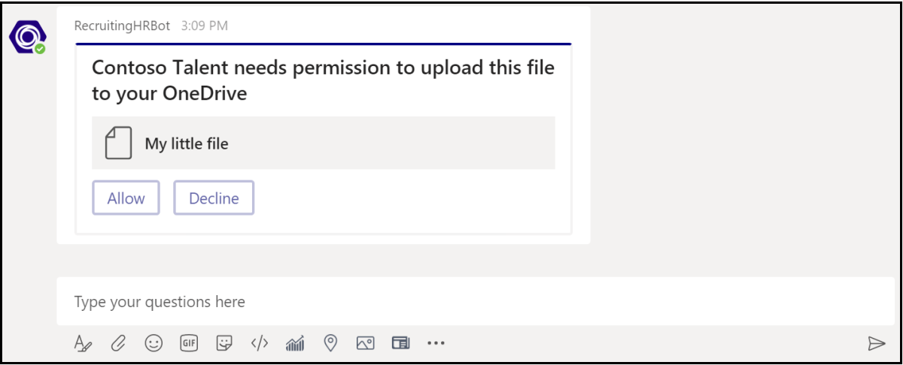

# <a name="send-and-receive-files-through-the-bot"></a>通过自动程序发送和接收文件

> [!IMPORTANT]
> 本文档中的文章基于 v4 Bot Framework SDK。

有两种方法向自动程序发送和接收文件：

* **使用 Microsoft Graph API：** 此方法适用于所有 Microsoft Teams 作用域中的自动程序：
  * `personal`
  * `channel`
  * `groupchat`

* **使用 Teams 机器人 API：** 这些仅支持上下文中 `personal` 的文件。

## <a name="using-the-graph-apis"></a>使用 Graph API

使用 [适用于 OneDrive](/onedrive/developer/rest-api/)和 SharePoint 的 Graph API 发布包含引用现有 SharePoint 文件的卡片附件的邮件。 若要使用 Graph API，请通过标准 OAuth 2.0 授权流获取对以下任一项的访问权限：
* 用户的 OneDrive 文件夹和 `personal` `groupchat` 文件。
* 团队频道中的 `channel` 文件。

图形 API 在所有 Teams 范围内都工作。

## <a name="using-the-teams-bot-apis"></a>使用 Teams 机器人 API

> [!NOTE]
> Teams 自动程序 API 仅在上下文中 `personal` 工作。 它们在或上下文中 `channel` `groupchat` 不起作用。

使用 Teams API，机器人可以直接在上下文中与用户一起发送和接收文件，也称为 `personal` 个人聊天。 实现涉及文件内容编辑的费用报告、图像识别、文件存档和电子签名等功能。 Teams 中共享的文件通常显示为卡片并允许丰富的应用内查看。

以下各节介绍如何以直接用户交互方式发送文件内容，如发送消息。 此 API 作为 Teams 自动程序平台的一部分提供。

### <a name="configuring-the-bot-to-support-files"></a>配置自动程序以支持文件

若要发送和接收自动程序中的文件，请将清单 `supportsFiles` 中的属性设置为 `true` 。 此属性在清单引用的 [自动](~/resources/schema/manifest-schema.md#bots) 程序部分中介绍。

定义如下所示 `"supportsFiles": true` 。 如果自动程序未启用 `supportsFiles` ，则本节中列出的功能将不起作用。

### <a name="receiving-files-in-personal-chat"></a>在个人聊天中接收文件

当用户将文件发送到自动程序时，文件将首先上载到用户的 OneDrive for Business 存储。 然后，自动程序会收到一个消息活动，通知用户有关用户上载的信息。 活动包含文件元数据，例如其名称和内容 URL。 用户可以直接从此 URL 读取以提取其二进制内容。

#### <a name="message-activity-with-file-attachment-example"></a>包含文件附件的邮件活动示例

```json
{
  "attachments": [{
    "contentType": "application/vnd.microsoft.teams.file.download.info",
    "contentUrl": "https://contoso.sharepoint.com/personal/johnadams_contoso_com/Documents/Applications/file_example.txt",
    "name": "file_example.txt",
    "content": {
      "downloadUrl" : "https://download.link",
      "uniqueId": "1150D938-8870-4044-9F2C-5BBDEBA70C9D",
      "fileType": "txt",
      "etag": "123"
    }
  }]
}
```

下表描述了附件的内容属性：

| 属性 | 用途 |
| --- | --- |
| `downloadUrl` | 用于提取文件内容的 OneDrive URL。 用户可以直接从此 `HTTP GET` URL 发出请求。 |
| `uniqueId` | 唯一文件 ID。 这是 OneDrive 驱动器项 ID，以防用户向自动程序发送文件。 |
| `fileType` | 文件类型，如 .pdf 或 .docx。 |

最佳做法是，通过向用户发送回一条消息来确认文件上载。

### <a name="uploading-files-to-personal-chat"></a>将文件上载到个人聊天

将文件上载到用户需要执行以下步骤：

1. 向请求写入文件权限的用户发送邮件。 此邮件必须包含 `FileConsentCard` 包含要上载的文件的名称的附件。
2. 如果用户接受文件下载，机器人将收到包含位置 URL 的调用活动。
3. 若要传输文件，机器人将直接 `HTTP POST` 执行输入提供的位置 URL。
4. （可选）如果不希望用户接受同一文件的进一步上载，请删除原始同意卡。

#### <a name="message-requesting-permission-to-upload"></a>请求上传权限的邮件

以下桌面邮件包含一个简单的附件对象，该对象请求用户上载文件的权限：



以下移动邮件包含一个附件对象，该对象请求用户上载文件的权限：


```json
{
  "attachments": [{
    "contentType": "application/vnd.microsoft.teams.card.file.consent",
    "name": "file_example.txt",
    "content": {
      "description": "<Purpose of the file, such as: this is your monthly expense report>",
      "sizeInBytes": 1029393,
      "acceptContext": {
      },
      "declineContext": {
      }
    }
  }]
}
```

下表描述了附件的内容属性：

| 属性 | 用途 |
| --- | --- |
| `description` | 描述文件的用途或总结其内容。 |
| `sizeInBytes` | 为用户提供估计的文件大小及其在 OneDrive 中占用的空间量。 |
| `acceptContext` | 用户接受文件时以静默方式传输到自动程序的其他上下文。 |
| `declineContext` | 当用户拒绝文件时以静默方式传输到自动程序的其他上下文。 |

#### <a name="invoke-activity-when-the-user-accepts-the-file"></a>当用户接受文件时调用活动

当用户接受文件时，将调用活动发送到机器人。 它包含 OneDrive for Business 占位符 URL，然后机器人可以发出 a `PUT` 以传输文件内容。 有关上载到 OneDrive URL 的信息，请参阅"[将字节上载到上载会话"。](/onedrive/developer/rest-api/api/driveitem_createuploadsession#upload-bytes-to-the-upload-session)

以下示例显示了自动程序收到的调用活动的简洁版本：

```json
{
  "name": "fileConsent/invoke",
  "value": {
    "type": "fileUpload",
    "action": "accept",
    "context": {
    },
    "uploadInfo": {
      "contentUrl": "https://contoso.sharepoint.com/personal/johnadams_contoso_com/Documents/Applications/file_example.txt",
      "name": "file_example.txt",
      "uploadUrl": "https://upload.link",
      "uniqueId": "1150D938-8870-4044-9F2C-5BBDEBA70C8C",
      "fileType": "txt",
      "etag": "123"
    }
  }
}
```

同样，如果用户拒绝文件，自动程序将收到以下事件，事件的总体活动名称相同：

```json
{
  "name": "fileConsent/invoke",
  "value": {
    "type": "fileUpload",
    "action": "decline",
    "context": {
    }
  }
}
```

### <a name="notifying-the-user-about-an-uploaded-file"></a>通知用户已上载文件

将文件上传到用户的 OneDrive 后，向用户发送确认消息。 邮件必须包含用户可以选择的以下附件，以在 OneDrive 中预览或打开它， `FileCard` 或在本地下载：

```json
{
  "attachments": [{
    "contentType": "application/vnd.microsoft.teams.card.file.info",
    "contentUrl": "https://contoso.sharepoint.com/personal/johnadams_contoso_com/Documents/Applications/file_example.txt",
    "name": "file_example.txt",
    "content": {
      "uniqueId": "1150D938-8870-4044-9F2C-5BBDEBA70C8C",
      "fileType": "txt",
    }
  }]
}
```

下表描述了附件的内容属性：

| 属性 | 用途 |
| --- | --- |
| `uniqueId` | OneDrive 或 SharePoint 驱动器项 ID。 |
| `fileType` | 文件类型，如 .pdf 或 .docx。 |

### <a name="basic-example-in-c"></a>C 中的基本示例#

以下示例演示如何在自动程序对话框中处理文件上载和发送文件同意请求：

```csharp

protected override async Task OnMessageActivityAsync(ITurnContext<IMessageActivity> turnContext, CancellationToken cancellationToken)
{
    string filename = "teams-logo.png";
    string filePath = Path.Combine("Files", filename);
    long fileSize = new FileInfo(filePath).Length;
    await SendFileCardAsync(turnContext, filename, fileSize, cancellationToken);
}

private async Task SendFileCardAsync(ITurnContext turnContext, string filename, long filesize, CancellationToken cancellationToken)
{
    var consentContext = new Dictionary<string, string>
    {
        { "filename", filename 
        },
    };

    var fileCard = new FileConsentCard
    {
        Description = "This is the file I want to send you",
        SizeInBytes = filesize,
        AcceptContext = consentContext,
        DeclineContext = consentContext,
    };

    var asAttachment = new Attachment
    {
        Content = fileCard,
        ContentType = FileConsentCard.ContentType,
        Name = filename,
    };

    var replyActivity = turnContext.Activity.CreateReply();
    replyActivity.Attachments = new List<Attachment>() { asAttachment 
    };
    await turnContext.SendActivityAsync(replyActivity, cancellationToken);
}

protected override async Task OnTeamsFileConsentAcceptAsync(ITurnContext<IInvokeActivity> turnContext, FileConsentCardResponse fileConsentCardResponse, CancellationToken cancellationToken)
{
    try
    {
        JToken context = JObject.FromObject(fileConsentCardResponse.Context);

        string filePath = Path.Combine("Files", context["filename"].ToString());
        long fileSize = new FileInfo(filePath).Length;
        var client = _clientFactory.CreateClient();
        using (var fileStream = File.OpenRead(filePath))
        {
            var fileContent = new StreamContent(fileStream);
            fileContent.Headers.ContentLength = fileSize;
            fileContent.Headers.ContentRange = new ContentRangeHeaderValue(0, fileSize - 1, fileSize);
            await client.PutAsync(fileConsentCardResponse.UploadInfo.UploadUrl, fileContent, cancellationToken);
        }

        await FileUploadCompletedAsync(turnContext, fileConsentCardResponse, cancellationToken);
    }
    catch (Exception e)
    {
        await FileUploadFailedAsync(turnContext, e.ToString(), cancellationToken);
    }
}

protected override async Task OnTeamsFileConsentDeclineAsync(ITurnContext<IInvokeActivity> turnContext, FileConsentCardResponse fileConsentCardResponse, CancellationToken cancellationToken)
{
    JToken context = JObject.FromObject(fileConsentCardResponse.Context);

    var reply = MessageFactory.Text($"Declined. We won't upload file <b>{context["filename"]}</b>.");
    reply.TextFormat = "xml";
    await turnContext.SendActivityAsync(reply, cancellationToken);
}

private async Task FileUploadCompletedAsync(ITurnContext turnContext, FileConsentCardResponse fileConsentCardResponse, CancellationToken cancellationToken)
{
    var downloadCard = new FileInfoCard
    {
        UniqueId = fileConsentCardResponse.UploadInfo.UniqueId,
        FileType = fileConsentCardResponse.UploadInfo.FileType,
    };

    var asAttachment = new Attachment
    {
        Content = downloadCard,
        ContentType = FileInfoCard.ContentType,
        Name = fileConsentCardResponse.UploadInfo.Name,
        ContentUrl = fileConsentCardResponse.UploadInfo.ContentUrl,
    };

    var reply = MessageFactory.Text($"<b>File uploaded.</b> Your file <b>{fileConsentCardResponse.UploadInfo.Name}</b> is ready to download");
    reply.TextFormat = "xml";
    reply.Attachments = new List<Attachment> { asAttachment 
    };

    await turnContext.SendActivityAsync(reply, cancellationToken);
}

private async Task FileUploadFailedAsync(ITurnContext turnContext, string error, CancellationToken cancellationToken)
{
    var reply = MessageFactory.Text($"<b>File upload failed.</b> Error: <pre>{error}</pre>");
    reply.TextFormat = "xml";
    await turnContext.SendActivityAsync(reply, cancellationToken);
}
```
