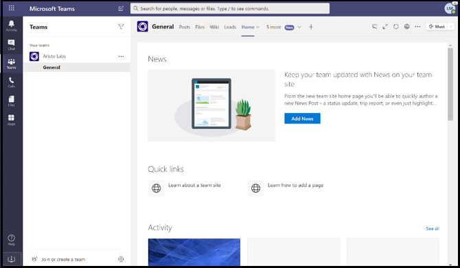
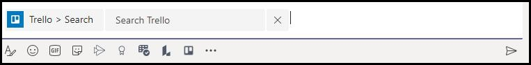

# 使用技巧成功提交应用Microsoft Teams成功

>[!NOTE]
>此页面将于 2021 年 5 月弃用。 有关成功发布应用的信息，请参阅应用商店Teams[验证指南](~/concepts/deploy-and-publish/appsource/prepare/teams-store-validation-guidelines.md)。

本文介绍提交的应用验证失败的常见原因。 虽然这不是应用的所有潜在问题的详尽列表，但遵循本指南将增加应用提交首次通过的可能性。 有关 [验证策略的](/legal/marketplace/certification-policies) 一个广泛列表，请参阅商业市场认证策略。

>[!NOTE]
>**[第 1140](/legal/marketplace/certification-policies#1140-teams)** 部分特定于 Microsoft Teams，而子 **[部分 1140.4](https://docs.microsoft.com/legal/marketplace/certification-policies#11404-functionality)** 解决了应用程序的功能Teams要求。

## 针对大多数&测试用例的验证准则

### &#9989;一般注意事项

另请参阅 [第 100 节 — 常规](/legal/marketplace/certification-policies#100-general)

* 确保使用的是版本 1.4.1 或更高版本的[Microsoft Teams SDK。](https://www.npmjs.com/package/@microsoft/teams-js)
* 请勿在验证过程进行时对应用进行更改。 执行此操作将需要对应用进行完整重新验证。
* 您的应用程序不得停止响应、意外终止或包含编程错误。 如果出现问题，应用必须失败，并提供有效信息，以便向用户转发。
* 您的应用程序不得在用户环境中自动下载、安装或启动任何可执行代码。 所有下载都必须向用户寻求显式权限。
* 与体验相关的任何材料（如说明和支持文档）必须准确。 在您的说明和材料中，使用正确的拼写、大小写、标点符号和语法。
* 提供帮助和支持信息。 强烈建议你的应用包含首次运行用户体验的帮助或常见问题链接。 对于所有个人应用，我们建议将你的帮助页面作为个人选项卡提供，以提供更好的用户体验。
* 所有应用都必须具有直观教程，例如"浏览"或在其配置屏幕中介绍应用功能和以下位置的必要集成的应用指南：
    * 应用商店一览页面 (详细说明) 。
    * 选项卡配置屏幕。
    * 机器人的欢迎消息。
    * 应用源元数据。
    * 连接器配置屏幕。

* 直观教程可以是视频、屏幕截图、指向包含应用详细信息的静态选项卡的链接。 所有这些引用都必须位于Teams环境中。

     

* 如果你对提交进行任何清单更改，请增加清单中的应用版本号。
* 应用不得使用户无法Teams核心用户方案。 应用中的链接目标不得链接到外部浏览器。 链接目标必须链接到项目中包含的 div Teams，例如任务模块和选项卡。 
* 建议使用任务模块或选项卡向用户显示Teams。
* 所有核心和非核心方案都必须在Teams环境中完成，但以下方案除外：
  * 隐私策略
  * TOU (使用条款) 
  * 网站链接
  * 注册过程

* 个人应用使用户能够与其他团队成员共享来自个人应用体验的内容。

### &#9989;提供简单明了的登录、注销和注册体验

另请参阅 [第 1100.5 节 — 客户控制](/legal/marketplace/certification-policies#11005-customer-control)

* 如果你的应用或外接程序依赖于外部帐户或服务，则登录、注销和注册体验必须在应用的所有功能中均明显且可到达。
* 如果存在提供给用户的显式登录选项，则必须有相应的注销选项 (即使应用使用的是无提示身份验证) 。 
* 注销选项只能让用户注销你的应用的功能，而不是注销Teams客户端。
* 注销选项至少必须将用户从通过登录选项访问的相同功能中注销。 例如，如果登录选项同时包括消息传递扩展和选项卡，则注销选项必须同时包括消息传递扩展和选项卡。

* 确保始终有一种方法可以反向处理以下 (或类似) 行为：
  * 登录 =>注销。
  * 链接帐户/服务 =>取消帐户/服务的链接。
  * 连接帐户/服务 =>帐户/服务断开连接。
  * 授权帐户/服务 =>/拒绝帐户/服务。
  * 注册帐户/服务 =>/取消注册/取消订阅帐户/服务。
* 如果你的应用需要帐户或服务，则必须为用户提供一种注册或创建注册请求的方法。 如果你的应用需要许可证才能使用，则可能会授予例外。 在这种情况下，请为新用户提供清晰的注册说明。
* 为新用户提供有关如何注册以使用应用服务的明确指导。 如果准备好的注册链接不可用，请提供以下方面的精确指导：

> [!div class="checklist"]
>
> * 在应用的"说明"部分。
> * 在应用的欢迎消息中。
> * 在应用的帮助消息中。
> * 请求用户登录服务的窗口。

* 没有轻松注册流程的应用还必须包括帮助选项卡或指向网页的链接，新用户可在其中查看有关配置 Teams 应用的详细指导。 提供详细信息以确保首次尝试应用时不会阻止新用户。
* 登录和注销功能必须在移动客户端上工作。 确保使用[Microsoft Teams SDK](https://www.npmjs.com/package/@microsoft/teams-js)版本 1.4.1 或更高版本。

有关身份验证的其他信息，请参阅：

* [身份验证文档](../../../authentication/authentication.md)
* [节点中的自动程序身份验证示例](https://github.com/OfficeDev/microsoft-teams-sample-auth-node)
* [节点中的选项卡身份验证示例](https://github.com/OfficeDev/microsoft-teams-sample-complete-node)
* [C#/.NET 中的选项卡/自动程序身份验证](https://github.com/OfficeDev/microsoft-teams-sample-complete-csharp)

### &#9989;响应时间必须合理

* **选项卡**。 如果对操作的响应时间超过三秒，则必须提供加载消息或警告。
* **机器人**。 必须在两秒钟内响应用户命令。 如果需要更长的处理时间，你的应用必须显示键入指示器。
* **撰写扩展**。 必须在五秒钟内响应用户命令。

> [!TIP]
> 确保应用在响应时间超过预期时显示加载指示器或某种形式的警告。

### &#9989;选项卡内容不得具有过多的部件版式或分层导航

* 选项卡必须提供集中的内容，并避免不必要的 UI 元素。 这通常是指不必要的嵌套或分层导航、内容旁边的无关或无关的 UI，或者任何将用户指向不相关内容的链接。 例如，以下选项卡视图省略了导航菜单，只显示了主要内容：

  

* 选项卡本质上必须是浅色的，并且不包括复杂的导航。
* 在应用中具有复杂编辑功能的频道选项卡必须在多窗口而非选项卡中打开编辑器视图。
* 频道选项卡不得向应用栏提供左侧栏中与主菜单导航相冲突Teams图标。
* 选项卡不得在左侧栏中显示包含与主导航和主导航相冲突Teams栏。
* 在应用中具有复杂编辑功能的选项卡必须在多窗口而非选项卡中打开编辑器视图。
* 如果有多个视图选项，请考虑使用选项卡配置菜单供用户选择。 例如，将菜单放在配置页中，以便实际选项卡视图干净且具有焦点，而不是在选项卡内嵌入菜单。
* 请包含一 *个"帮助* "选项卡作为静态选项卡，以建议用户如何配置、注册和使用你的应用。
* 请包含 *设置* 标题中提供的"应用"选项卡。

### &#9989;必须在配置屏幕中配置选项卡配置

* 配置屏幕必须清楚地解释体验的价值以及如何配置选项卡。
* 配置过程必须始终为用户提供继续操作而不是结束用户体验的方法。 例如，在用户配置选项卡后，不要显示空板。
* 用户登录过程必须是配置过程的一部分。 确保在选项卡 UI 中完成。 用户完成配置并加载选项卡后，无需执行其他操作。
* 不要在登录配置弹出窗口中显示整个网页。
* 用户必须始终能够完成配置体验，即使他们无法立即找到要查找的内容。
* 配置体验必须为用户提供查找其内容、固定 URL 或创建新内容（如果不存在）的选项。
* 配置体验必须保留在Teams内。 用户应该不需要离开配置体验来创建内容，然后返回到Teams固定它。
* 高效地使用可用的视口区域。 不要浪费它在配置弹出窗口内使用大量徽标。

### &#9989;频道中的选项卡 - 成员访问

* 由频道范围的成员配置的选项卡必须可供其他成员访问，而无需向配置该选项卡的成员寻求权限。
* 如果选项卡供专用或受限使用，或者需要来自配置选项卡的成员的任何权限，则应用必须提前提供权限管理选项。

### &#9989;自动程序必须始终响应且正常失败

自动程序必须对任何命令作出响应，而不是为用户死掉。 下面是一些提示，可帮助机器人智能响应用户：

* **使用命令列表**。 分析用户输入或预测用户意图很难。 提供自动程序可以理解的命令列表，而不是让用户猜测机器人可以执行哪些操作。

* **包括帮助命令**。 用户可能会在丢失或机器人未如预期响应时键入"帮助"。 包括一个帮助命令，该命令描述如何体验应用的价值以及所有有效命令。

* **包括自动程序丢失时的帮助内容或指南**。 当机器人无法理解用户输入时，它必须建议替代操作。 例如 *，"很抱歉，我不了解。有关详细信息，请键入"help"。* 请勿使用错误消息或简单的" *我不了解"进行响应*。

### &#9989;帮助命令响应

* 帮助命令必须准确，并且应用响应必须采用自适应卡片格式，并且至少有六个命令的可操作内容。
* 如果应用的命令少于 6 个，请检查自适应卡片中是否包含所有命令。

  

* **使用自适应卡片和任务模块使机器人响应清晰且可操作** 
[使用调用任务模块的按钮的](/task-modules-and-cards/task-modules/task-modules-bots)自适应卡片可增强机器人用户体验。 与用户键入命令相反，这些卡片和按钮更易于在移动设备上使用。 此外，自动程序响应不得为长文本文本文本。 机器人必须使用自适应卡片和任务模块，而不是基于对话聊天的用户界面和冗长的文本响应。

* **考虑所有范围**。 请确保当在频道和个人对话中提到 () `@*botname*` 自动程序提供适当的响应。 如果你的机器人在个人或团队范围内未提供有意义的上下文，请通过清单禁用该范围。  (清单 `bots` 架构参考[.Microsoft Teams 中的块) ](../../../../resources/schema/manifest-schema.md#bots)

* **包括团队、群聊或一对一对话**。 自动程序通知必须包含团队、群聊或包含受众相关内容的一对一对话。

* **不要推送敏感数据**。 聊天机器人不得将敏感数据推送到团队、群聊或一对一对话中，其中不能查看该数据的受众。

* **提供欢迎消息**。 自动程序必须提供一条 FRE 欢迎消息，其中包括一个包含可播放卡片或"试用"按钮的交互式教程，以鼓励参与。

### &#9989;自动程序必须在首次启动时始终发送欢迎消息

欢迎消息是设置个人聊天机器人的语气的最佳方法。 这是用户与机器人的第一次交互。 良好的欢迎消息可以鼓励用户继续浏览应用。 如果欢迎消息或介绍性消息令人困惑或不明确，用户将不会立即看到该应用的值，并失去兴趣。
有关欢迎邮件要求，请参阅以下部分：

> [!Note]
> 对于频道自动程序，欢迎消息是可选的。

### 欢迎邮件要求

* 在欢迎教程中包括价值主张。
* 提供使用应用的前进指南。
* 包括有关如何注册和配置应用的指南。
* 显示易于阅读的文本和直接对话 — 最好是包含可操作欢迎浏览按钮的卡片，用于加载任务模块。
* 使用按钮和卡片保持简单和可用 - 避免长文本、闲聊对话。
* 包括自适应卡片和按钮，使欢迎消息更可用。
* 使用一个 ping 调用欢迎消息，而不是同时执行两个或多个 ping 操作。
* 欢迎消息必须只向配置应用的用户显示，最好是在一对一个人聊天中显示。
* 个人应用必须始终向用户提供欢迎消息。
* 从不向团队的每位成员发送个人聊天;被视为垃圾邮件。
* 从不多次发送欢迎消息。 不允许定期重复相同的欢迎邮件，并被视为垃圾邮件。

#### 避免欢迎邮件垃圾邮件

* **机器人的频道消息**。 不要通过创建单独的新聊天帖子来向用户发送垃圾邮件。 在同一线程中创建具有回复的单个主题帖子。
* **聊天机器人个人聊天**。 不要发送多条消息。 发送一条包含完整信息的邮件。 不允许定期重复相同的欢迎邮件，并被视为垃圾邮件。

#### 仅通知机器人欢迎消息

仅通知机器人必须发送包含消息的欢迎消息，其中传达"我是仅通知机器人，无法回复 *聊天"。*

#### 个人作用域中的欢迎消息

   * **使消息简洁且信息丰富**。 用户体验和应用知识将有所不同。 用户可能在另一个平台上使用过你的应用或对你的应用一无了解。 你想要针对所有受众定制消息，用几个句子来解释机器人执行哪些操作以及与它交互的方式。 还必须说明应用的价值以及用户将如何使用它。

* **使邮件可操作**。 考虑您希望用户在安装应用后执行的第一件事。 他们是否必须尝试一个很酷的命令？ 他们是否必须了解另一种载入体验？ 是否需要登录？ 你可以添加自适应卡片上的操作或提供特定示例，例如"*尝试询问..."，"**这是我可以做什么..."。*

#### 团队或频道作用域中的欢迎消息

首次将机器人添加到频道时，情况会有所不同。 正常情况下，不应向团队中的每个人发送一对一消息，但机器人可以在频道中发送欢迎消息。

### &#9989;移动响应，无直接转售或付款

* 选项卡、自适应卡片、自动程序消息和任务模块中的内容必须响应各种移动设备屏幕大小。
* 支持 iOS 的应用必须在使用最新版 iOS iPad设备上完全正常工作。
* 不得包含任何直接引用应用内购买、试用、付费版本的优惠或指向任何在线商店的链接，其中用户可以从移动操作系统 (Android、iOS) 上的 Teams 应用购买或获取其他内容、应用或外接程序。
* 外接程序的 iOS 或 Android 版本不得显示任何 UI 或语言或指向任何其他要求用户付费的应用、外接程序或网站的链接。
* 关联的隐私策略和使用条款页还必须没有任何商务 UI 或商店链接。

### &#9989;不要向不适合查看数据的访问群体发布敏感数据

Teams应用不得向不应查看该数据的受众发布敏感数据，如信用卡或财务付款方式、个人身份信息 (PIN) 、运行状况或联系人跟踪信息。

### &#9989;不要通过你的应用程序传输财务付款详细信息或完成Teams交易

* 你的Teams应用不得要求用户直接在 Teams 界面中付款。
* 应用无法通过应用界面上的用户传输财务资料详细信息。 只有在用户同意使用应用之前，应用在应用的使用条款、隐私策略以及应用的任何配置文件页面或网站中披露，应用才能传输用于保护付款服务的链接。

### &#9989;将任何文件或可执行文件下载到用户 () `.exe` 之前清除警告

请在应用将任何文件或可执行文件 () `.exe`  用户计算机或环境中之前警告用户。

### &#9989;消息扩展必须提供帮助文本且易于阅读

* 基于搜索的消息扩展必须提供有关如何有效地搜索邮件的帮助文本 (例如，显示示例输入) 。
* 任务模块必须包含包含在应用中或从应用中创建的图标和短名称。
* 邮件扩展 `@mention` 可执行文件必须清晰、易于理解且易于阅读。

## M365 Publisher证明

### &#9989;合作伙伴中心Publisher证明

* 有关更多详细信息[，请参阅](/microsoft-365-app-certification/docs/attestation)Publisher证明程序文档。
* 按照"Publisher[工作流"](/microsoft-365-app-certification/docs/userguide#3publisher-attestation-workflow)部分中的步骤完成发布者证明过程。 对 appcert@microsoft.com 进行写入。
* 有关其他 [信息，请参阅](/azure/active-directory/develop/troubleshoot-publisher-verification) 疑难解答指南。
* 通过合作伙伴中心完成自我证明。 填写"Self-Assessment **合规性"下的表单调查表**。

> [!div class="nextstepaction"]
> [详细了解如何Teams审批策略](/legal/marketplace/certification-policies#1140-teams)
