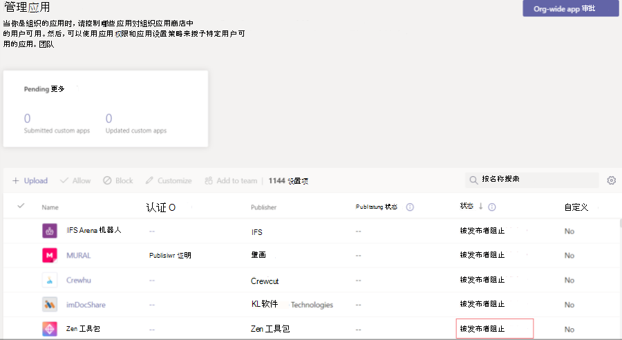

# 自定义Teams应用

## 启用Microsoft Teams自定义应用

你可以允许客户在管理中心Microsoft Teams应用的某些Teams方面。 只有发布到应用商店的应用才支持Teams此功能。 无法自定义为组织发布的旁加载应用。

此功能的一些可能示例包括：

* 更改应用主题色以匹配组织品牌。
* 将应用程序名称从 *Contoso* 更新到 *Contoso 代理*，这是组织中的用户将看到的名称。  (注意：向聊天或频道添加连接器的用户仍将看到原始应用名称 *Contoso*.) 

可以在开发人员门户中启用此功能[Teams。](https://dev.teams.microsoft.com/home) 这将配置 `configurableProperties` ，此配置在 1.10 之前的版本Teams清单。

### 测试应用

在开发期间，你无法测试此功能。 旁加载或发布到组织的应用程序目录时，不支持应用自定义。

### 用户注意事项

为特别需要 (应用的Teams管理员) 提供指南。 有关详细信息，请参阅自定义[Teams。](/MicrosoftTeams/customize-apps)

## 在Teams批准前隐藏应用

为了Teams应用体验，默认情况下，你可以向用户隐藏应用，直到管理员允许取消隐藏该应用。 例如，Contoso 电子产品已经创建了一个适用于 Teams。 为了能够正常运行应用，Contoso 电子产品希望客户先设置应用的特定属性。 默认情况下，应用处于隐藏状态，并且仅在管理员允许后才能供用户使用。

若要隐藏应用，在应用清单文件中，将 `defaultBlockUntilAdminAction` 属性设置为 `true` 。 当属性设置为 时，在管理Teams管理>中，"被发布者阻止"将显示在 `true` 应用的"状态 **"中**： 

管理员收到一个请求，要求用户先采取措施，然后用户才能访问该应用。 在 **"管理应用**"下，管理员可以选择"允许"以允许具有"被发布者阻止 **"状态** 的应用：

如果默认情况下，你不希望隐藏应用，可以将 属性 `defaultBlockUntilAdminAction` 更新为 `false` 。 当应用的新版本获得批准时，默认情况下，只要管理员未执行任何显式操作，就会允许应用。

> [!NOTE]
> `defaultBlockUntilAdminAction` LOB 应用不支持 。 如果你使用此属性上载 LOB 应用，则应用不会被阻止。

## 另请参阅

[在管理中心Teams应用](/MicrosoftTeams/customize-apps)
