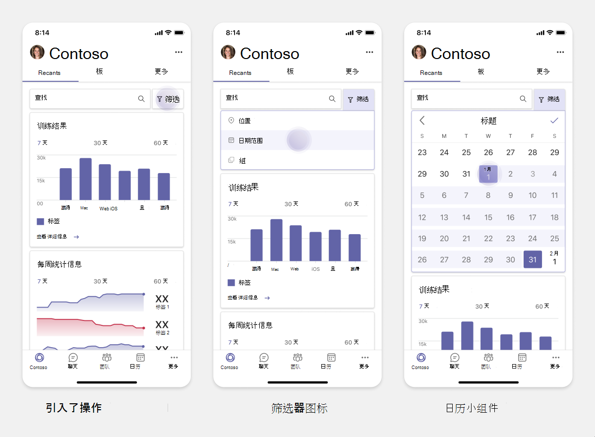
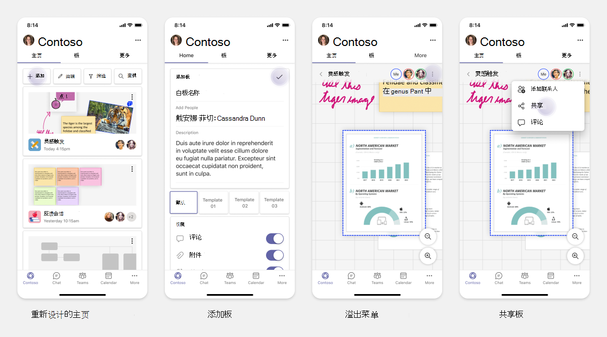

# 为移动版规划响应Teams选项卡

 Teams平台提供了在移动和桌面上生成应用的机会。 你的应用用户可以首选桌面或移动设备，也可以同时选择两者。 用户可以在桌面上准备数据，但使用移动设备使用和共享更多数据。 构建任何应用的关键是了解并满足用户的需求。 有一些功能（如机器人、消息传递扩展和连接器）在桌面和移动设备上无缝工作。 但是，生成选项卡和任务模块需要规划在移动设备上托管 web Teams体验。 在移动设备上规划响应式网页的文档Teams指南。

## 确定应用范围

以下列表提供了规划构建适用于移动Teams关键信息：

* 考虑应用跨设备Teams功能。 例如，如果你在桌面上有一个性能良好的应用，你可以浏览在移动设备上生成类似的应用。 最初，移动版上转换整个桌面体验可能比较困难。 你可以从基本但常见的方案开始。 收集更多见解和用户反馈后添加特性和功能。

* 确保面向移动版上的相应用户人物。 例如，如果你正在构建一个向最终用户提供服务，并且还为开发人员和高级经理提供数据访问权限的应用，那么当你开始在 Teams 移动版上生成应用时，最终用户可以更多使用此应用。 你可以适应桌面应用上拥有的所有角色，但是，建议从具有更大基础和可能的早期采用者角色开始，实现较小的屏幕体验。 根据该示例，最终用户是相应的用户角色。 可以逐步添加功能以支持移动设备上的其他用户Teams角色。 

## 了解构建应用的不同阶段

确定应用范围后，可以了解以下三个阶段，在移动版上规划Teams并增强用户体验：

1. **消耗**

   在移动设备上查看应用。 若要在移动设备上生成应用，你可以从使用体验开始。 由于移动世界已使滚动内容成为一种常见做法，因此您可以显示相关信息。 使用参与机制（如通知）通知更新。

2. **快速操作**

   在移动设备上使用应用。 在用户开始在移动设备上使用内容后，可以通过从桌面应用迁移一些操作将应用扩展至下一级别。 您可以优化和构建移动版的新操作。

3. **支持**

   提供在移动设备上参与的完整应用体验。 当用户使用你的应用时，在移动设备上提供完整的沉浸式体验（与桌面体验一样或优于桌面体验）。 若要为用户提供良好的体验，请使所有用例在移动设备上快速响应。

> [!TIP]
> 若要获取有关设计指南的信息，请参阅适用于应用[的设计Teams过程](design-teams-app-process.md)。

## 用例

让我们看一下以下用例，了解如何为移动设备规划不同类型的Teams应用：

 

<b>仪表板和数据可视化应用程序</b>

你可以了解如何在移动平台上为仪表板和数据可视化应用规划Teams选项卡。

**消耗**

第一阶段，你可以实现最基本的使用体验来查看数据。 域中的任何应用旨在以可视化形式显示数据。 在应用中，可以在桌面上显示最近查看的可视化效果，或显示用户的所有授权图表列表。 在桌面上创建仪表板后，用户可以使用移动设备访问信息。 可以将用户选择的任何图表的详细视图显示为选项卡中的展开视图，或者使用任务模块显示。

可以显示以下信息： 

* 仪表板和摘要
* 数据视觉效果、地图和信息图
* 图表、图形和表格 

**快速操作**

第二阶段，用户可以从桌面体验处理现有图表和视觉对象。 可以引入以下操作：

* 搜索内容
* 筛选数据
* 创建书签

**支持**

第三阶段，使用户能够从头开始创建内容，如图表和图形。 确保引入你的应用中适用于移动设备的所有功能。 例如，可以使用任务模块帮助访问具有详细视图的特定数据项。

你可以为用户提供以下访问权限：
* 修改标题和说明
* 插入数据项以创建可视化效果
* 在频道或群聊中共享可视化效果

 

 

<b>任务列表应用</b>

你可以了解如何在移动平台上为任务Teams选项卡。

**消耗**

第一阶段，你的应用可以在垂直堆栈中向用户显示任务列表。 如果有多个类别的任务（如 **"** 建议"、"**活动**"和"已关闭"），则提供用于显示分组任务的筛选器或作为标题来查看分组任务。

**快速操作**

第二阶段，你可以为用户提供以下应用访问权限：
* 创建包含必填字段的任务或项目，以减少用户认知负荷
* 更改板类型或视图
* 通过展开视图查看任务
* 使用任务模块查看详细视图
* 将任务移动到不同的类别 
* 通过电子邮件和活动源共享聊天和频道中的相关任务

**支持**

第三阶段，您可以启用用户使用以下活动的体验：
* 添加新项目和板
* 添加和修改不同的类别，例如 **"已建议****"、"活动"** 和"已关闭 **"**
* 配置注释、附件和其他复杂功能的任务

 

 

<b>共同授权和白板应用</b>

你可以了解如何在移动平台上规划响应式选项卡，以共同授权和Teams应用。

**消耗**

第一阶段，你可以考虑使用桌面体验来显示应用中的内容和资产。  可以显示以下函数：

* 评论或反馈
* 放大或缩小
* 挂起文档的当前阶段或进度

**快速操作**

第二阶段中，可以介绍以下操作：

* 创建新的协作板或用于签名的新文档
* 在内部以及与来宾共享板
* 配置管理员权限

> [!TIP]
> 你可以公开可在小屏幕上轻松显示的操作。

**支持**

第三阶段，为用户提供完整体验。 您可以启用用户对以下活动的体验：

* 添加文本、形状和快速注释
* 在内容中导航
* 添加图层和筛选器
* 删除、撤消和重做操作
* 使用 JS SDK API 访问相机和麦克风。 有关设备功能详细信息，请参阅 [设备功能概述](../device-capabilities/device-capabilities-overview.md)。

 

## 另请参阅

以下设计和验证指南根据应用的范围提供帮助：

* [设计选项卡](../../tabs/design/tabs.md)
* [正在设计自动程序](../../bots/design/bots.md)
* [设计任务模块](../..//task-modules-and-cards/task-modules/design-teams-task-modules.md)
* [验证准则](../deploy-and-publish/appsource/prepare/teams-store-validation-guidelines.md)
