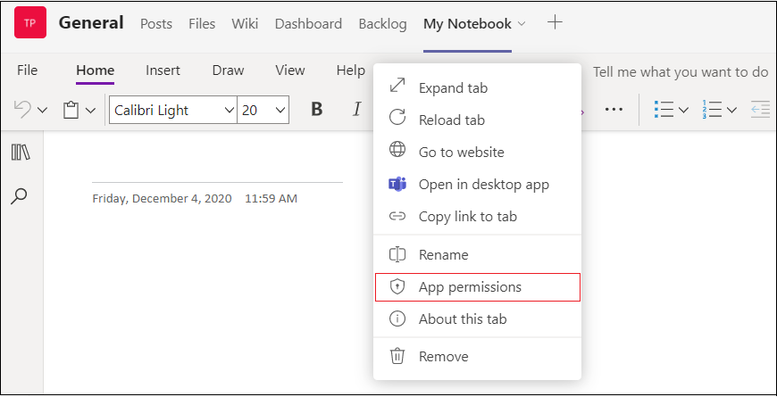

# 浏览器的设备权限

> [!NOTE]
> 在浏览器中处理设备权限的方式更改目前仅适用于公共开发人员 [预览](../../resources/dev-preview/developer-preview-intro.md) 版。 此更改将于 2022 年 2 月 1 (正式) 通用版本。

需要设备权限的应用程序（如相机或麦克风访问）现在要求用户在 Web 浏览器中按应用级别手动授予同意。 以前，浏览器已处理如何授予这些权限，但现在这些权限将在 Microsoft Teams。 这对在浏览器中需要这些权限时如何设计应用程序有一些影响。

## 行为更改
如果你的应用程序已声明它需要应用程序清单中的设备权限，则用户将显示"应用权限"选项，他们可以在这里启用应用的设备权限。 可以在个人应用、任务模块对话框和聊天、频道或会议中选项卡找到"应用权限"选项。

### 个人应用和任务模块对话框
可在右上方找到"应用程序权限"设置。

### 聊天、频道或会议选项卡
"应用权限"设置位于选项卡下拉列表中。

用户需要在浏览器中启用这些权限，这些权限才能生效。 一旦用户在浏览器中更改应用的设备权限，系统将提示他们在浏览器中重新加载Teams。 请务必让用户了解在何处启用这些权限，才能在 Microsoft Teams。

## 建议
Microsoft Teams浏览器中需要设备权限的应用程序向用户显示有关在浏览器中查找和启用这些权限Teams说明。 根据应用程序运行的上下文，你将需要确保你的说明将用户指向正确的位置以访问这些权限，因为它们对于个人应用、任务模块对话框以及聊天、频道或会议中选项卡的不同。

## 另请参阅

* [设备功能概述](device-capabilities-overview.md)
* [请求设备权限](native-device-permissions.md)
