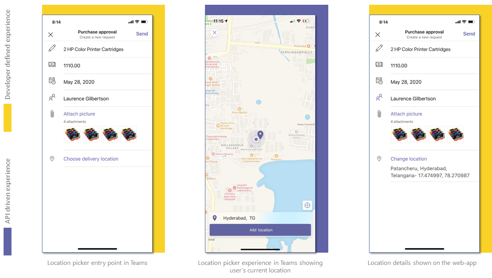

# <a name="integrate-location-capabilities"></a>集成位置功能

你可以将本机设备的位置功能与你的应用Teams集成。  

可以使用 [JavaScript Microsoft Teams SDK](/javascript/api/overview/msteams-client?view=msteams-client-js-latest&preserve-view=true)，它提供应用访问用户本机设备功能[所需的工具](native-device-permissions.md)。 使用位置 API（如 [getLocation](/javascript/api/@microsoft/teams-js/microsoftteams.location?view=msteams-client-js-latest#getLocation_LocationProps___error__SdkError__location__Location_____void_&preserve-view=true) 和 [showLocation](/javascript/api/@microsoft/teams-js/microsoftteams.location?view=msteams-client-js-latest#showLocation_Location___error__SdkError__status__boolean_____void_&preserve-view=true) ）将功能集成到你的应用中。

## <a name="advantages-of-integrating-location-capabilities"></a>集成位置功能的优点

在 Teams 应用中集成位置功能的主要优点是，它允许 Teams 平台上的 Web 应用开发人员通过 JavaScript 客户端 SDK 利用Microsoft Teams功能。

以下示例显示如何在不同方案中使用位置功能的集成：

* 在工厂中，主管可以跟踪工作者的出席情况，让他们在工厂附近自家，并通过指定的应用共享它。 位置数据也会与图像一起捕获和发送。
* 位置功能使服务提供商的维护人员能够与管理层共享手机网络的真实运行状况数据。 管理层可以比较捕获的位置信息与维护人员提交的数据之间的任何不匹配情况。

若要集成位置功能，必须更新应用清单文件并调用 API。 为了进行有效的集成，您必须深入了解用于调用位置 API [](#code-snippets) 的代码段。
熟悉 API 响应错误以处理应用或应用中[](#error-handling)的错误Teams很重要。

> [!NOTE]
> 目前Microsoft Teams对位置功能的支持仅适用于移动客户端。

## <a name="update-manifest"></a>更新清单

通过添加 Teams 并指定 `devicePermissions` 来更新应用程序清单[.json](../../resources/schema/manifest-schema.md#devicepermissions) 文件`geolocation`。 它允许你的应用在开始使用位置功能之前向用户请求必要的权限。 应用清单的更新如下所示：

``` json
"devicePermissions": [
    "geolocation",
],
```

> [!NOTE]
>
> * 启动 **相关应用程序** API 时，将自动显示Teams权限提示。 有关详细信息，请参阅请求 [设备权限](native-device-permissions.md)。
> * 设备权限在浏览器中不同。 有关详细信息，请参阅 [浏览器设备权限](browser-device-permissions.md)。

## <a name="location-apis"></a>位置 API

你必须使用以下一组 API 来启用设备的位置功能：

| API      | 说明   |
| --- | --- |
|[getLocation](/javascript/api/@microsoft/teams-js/microsoftteams.location?view=msteams-client-js-latest#getLocation_LocationProps___error__SdkError__location__Location_____void_&preserve-view=true) | 提供用户的当前设备位置或打开本机位置选取器并返回用户选择的位置。 |
|[showLocation](/javascript/api/@microsoft/teams-js/microsoftteams.location?view=msteams-client-js-latest#showLocation_Location___error__SdkError__status__boolean_____void_&preserve-view=true) | 在地图上显示位置。 |

> [!NOTE]
> API `getLocation()` 附带以下 [输入配置](/javascript/api/@microsoft/teams-js/locationprops?view=msteams-client-js-latest&preserve-view=true)和 `allowChooseLocation` `showMap`。 <br/> 如果 值为 `allowChooseLocation` *true*，则用户可以选择他们选择的任何位置。<br/>  如果值为 *false*，则用户无法更改其当前位置。<br/> 如果 的值为 `showMap` *false*，则提取当前位置而不显示地图。 `showMap` 如果设置为 `allowChooseLocation` true，则 *忽略* 。

下图描述了位置功能的 Web 应用体验：



### <a name="code-snippets"></a>代码段

**调用 `getLocation` API 以检索位置：**

```javascript
let locationProps = {"allowChooseLocation":true,"showMap":true};
microsoftTeams.location.getLocation(locationProps, (err: microsoftTeams.SdkError, location: microsoftTeams.location.Location) => {
          if (err) {
            output(err);
            return;
          }
          output(JSON.stringify(location));
});
```

**调用 `showLocation` API 以显示位置：**

```javascript
let location = {"latitude":17,"longitude":17};
microsoftTeams.location.showLocation(location, (err: microsoftTeams.SdkError, result: boolean) => {
          if (err) {
            output(err);
            return;
          }
     output(result);
});
```

## <a name="error-handling"></a>错误处理

必须确保在你的应用内正确处理这些Teams错误。 下表列出了错误代码以及生成错误的条件：

|错误代码 |  错误名称     | 条件|
| --------- | --------------- | -------- |
| **100** | NOT_SUPPORTED_ON_PLATFORM | API 在当前平台上不受支持。|
| **500** | INTERNAL_ERROR | 执行所需操作时遇到内部错误。|
| **1000** | PERMISSION_DENIED |用户拒绝对 Teams 应用或 Web 应用的位置权限。|
| **4000** | INVALID_ARGUMENTS | 使用错误或不足的强制参数调用 API。|
| **8000** | USER_ABORT |用户已取消操作。|
| **9000** | OLD_PLATFORM | 用户位于不存在 API 实现的旧平台版本上。 升级版本应该可以解决此问题。|

### <a name="code-sample"></a>代码示例

|示例名称 | Description | C# | Node.js |
|----------------|-----------------|--------------|--------------|
| 应用签入当前位置 | 用户可以签入当前位置并查看所有以前的位置签入。| [View](https://github.com/OfficeDev/Microsoft-Teams-Samples/tree/main/samples/app-checkin-location/csharp) | [View](https://github.com/OfficeDev/Microsoft-Teams-Samples/tree/main/samples/app-checkin-location/nodejs) |

## <a name="see-also"></a>另请参阅

* [将媒体功能集成到Teams](mobile-camera-image-permissions.md)
* [将 QR 代码或条形码扫描仪功能集成到 Teams](qr-barcode-scanner-capability.md)
* [将人员选取器集成到Teams](people-picker-capability.md)
