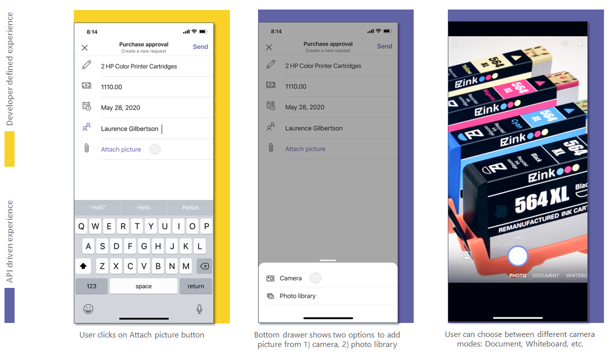

# <a name="integrate-media-capabilities"></a><span data-ttu-id="2cfdb-104">集成媒体功能</span><span class="sxs-lookup"><span data-stu-id="2cfdb-104">Integrate media capabilities</span></span> 

<span data-ttu-id="2cfdb-105">本文档指导您如何集成媒体功能。</span><span class="sxs-lookup"><span data-stu-id="2cfdb-105">This document guides you on how to integrate media capabilities.</span></span> <span data-ttu-id="2cfdb-106">此集成将本机设备功能（如相机和 **麦克风）** 与Teams 平台相结合。</span><span class="sxs-lookup"><span data-stu-id="2cfdb-106">This integration combines the native device capabilities, such as the **camera** and **microphone** with the Teams platform.</span></span>  

<span data-ttu-id="2cfdb-107">可以使用 [Microsoft Teams JavaScript 客户端 SDK，](/javascript/api/overview/msteams-client?view=msteams-client-js-latest&preserve-view=true)它提供应用访问用户设备权限 [所需的工具](native-device-permissions.md)。</span><span class="sxs-lookup"><span data-stu-id="2cfdb-107">You can use [Microsoft Teams JavaScript client SDK](/javascript/api/overview/msteams-client?view=msteams-client-js-latest&preserve-view=true), that provides the tools necessary for your app to access a user’s [device permissions](native-device-permissions.md).</span></span> <span data-ttu-id="2cfdb-108">使用合适的媒体功能 API 将本机设备功能（如相机和麦克风）与Microsoft Teams 移动应用中的 Teams 平台集成，并构建更丰富的体验。</span><span class="sxs-lookup"><span data-stu-id="2cfdb-108">Use suitable  media capability APIs to integrate the native device capabilities, such as the **camera** and **microphone** with the Teams platform within your Microsoft Teams mobile app, and build a richer experience.</span></span> 

## <a name="advantage-of-integrating-media-capabilities"></a><span data-ttu-id="2cfdb-109">集成媒体功能的优势</span><span class="sxs-lookup"><span data-stu-id="2cfdb-109">Advantage of integrating media capabilities</span></span>

<span data-ttu-id="2cfdb-110">在 Teams 应用中集成设备功能的主要优点是它利用本机 Teams 控件来为用户提供丰富且沉浸式的体验。</span><span class="sxs-lookup"><span data-stu-id="2cfdb-110">The main advantage of integrating device capabilities in your Teams apps is it leverages native Teams controls to provide a rich and immersive experience to your users.</span></span>
<span data-ttu-id="2cfdb-111">若要集成媒体功能，必须更新应用清单文件并调用媒体功能 API。</span><span class="sxs-lookup"><span data-stu-id="2cfdb-111">To integrate media capabilities you must update the app manifest file and call the media capability APIs.</span></span> 

<span data-ttu-id="2cfdb-112">为了进行有效的集成，你必须深入了解用于调用相应[](#code-snippets)API 的代码段，这允许你使用本机媒体功能。</span><span class="sxs-lookup"><span data-stu-id="2cfdb-112">For effective integration, you must have a good understanding of [code snippets](#code-snippets) for calling the respective APIs, which allow you to use native media capabilities.</span></span>

<span data-ttu-id="2cfdb-113">熟悉 API 响应错误以处理[](#error-handling)Teams 应用中的错误非常重要。</span><span class="sxs-lookup"><span data-stu-id="2cfdb-113">It is important to familiarize yourself with the [API response errors](#error-handling) to handle the errors in your Teams app.</span></span>

> [!NOTE] 
> <span data-ttu-id="2cfdb-114">目前，Microsoft Teams 对媒体功能的支持仅适用于移动客户端。</span><span class="sxs-lookup"><span data-stu-id="2cfdb-114">Currently, Microsoft Teams support for media capabilities is only available for mobile clients.</span></span>

## <a name="update-manifest"></a><span data-ttu-id="2cfdb-115">更新清单</span><span class="sxs-lookup"><span data-stu-id="2cfdb-115">Update manifest</span></span>

<span data-ttu-id="2cfdb-116">通过添加 [manifest.js](../../resources/schema/manifest-schema.md#devicepermissions) 并指定 ，更新你的 Teams 应用在文件 `devicePermissions` 上的应用 `media` 。</span><span class="sxs-lookup"><span data-stu-id="2cfdb-116">Update your Teams app [manifest.json](../../resources/schema/manifest-schema.md#devicepermissions) file by adding the `devicePermissions` property and specifying `media`.</span></span> <span data-ttu-id="2cfdb-117">它允许你的应用在用户开始使用相机捕获图像之前，向用户请求必要的权限，打开库以选择要作为附件提交的图像，或使用麦克风录制对话。 </span><span class="sxs-lookup"><span data-stu-id="2cfdb-117">It allows your app to ask for requisite permissions from users before they start using  the **camera** to capture the image, open the gallery to select an image to submit as an attachment, or use the **microphone** to record the conversation.</span></span>

``` json
"devicePermissions": [
    "media",
],
```

> [!NOTE]
> <span data-ttu-id="2cfdb-118">启动 **相关的** Teams API 时，将自动显示"请求权限"提示。</span><span class="sxs-lookup"><span data-stu-id="2cfdb-118">The **Request Permissions** prompt is automatically displayed when a relevant Teams API is initiated.</span></span> <span data-ttu-id="2cfdb-119">有关详细信息，请参阅请求 [设备权限](native-device-permissions.md)。</span><span class="sxs-lookup"><span data-stu-id="2cfdb-119">For more information, see [Request device permissions](native-device-permissions.md).</span></span>

## <a name="media-capability-apis"></a><span data-ttu-id="2cfdb-120">媒体功能 API</span><span class="sxs-lookup"><span data-stu-id="2cfdb-120">Media capability APIs</span></span>

<span data-ttu-id="2cfdb-121">[selectMedia、getMedia](/javascript/api/@microsoft/teams-js/media?view=msteams-client-js-latest#selectMedia_MediaInputs___error__SdkError__attachments__Media_______void_&preserve-view=true)和[viewImages](/javascript/api/@microsoft/teams-js/media?view=msteams-client-js-latest#viewImages_ImageUri_____error___SdkError_____void_&preserve-view=true) API 使您可以使用本机媒体功能，如下所示： [](/javascript/api/@microsoft/teams-js/_media?view=msteams-client-js-latest#getMedia__error__SdkError__blob__Blob_____void_&preserve-view=true)</span><span class="sxs-lookup"><span data-stu-id="2cfdb-121">The [selectMedia](/javascript/api/@microsoft/teams-js/media?view=msteams-client-js-latest#selectMedia_MediaInputs___error__SdkError__attachments__Media_______void_&preserve-view=true), [getMedia](/javascript/api/@microsoft/teams-js/_media?view=msteams-client-js-latest#getMedia__error__SdkError__blob__Blob_____void_&preserve-view=true), and [viewImages](/javascript/api/@microsoft/teams-js/media?view=msteams-client-js-latest#viewImages_ImageUri_____error___SdkError_____void_&preserve-view=true) APIs enable you to use native media capabilities as follows:</span></span>

* <span data-ttu-id="2cfdb-122">使用本机 **麦克风** 允许用户从设备 **录制 (录制** 10 分钟) 对话。</span><span class="sxs-lookup"><span data-stu-id="2cfdb-122">Use the native **microphone** to allow users to **record audio** (record 10 minutes of conversation) from the device.</span></span>
* <span data-ttu-id="2cfdb-123">使用 **本机相机控件** 允许用户 **在移动时捕获和** 附加图像。</span><span class="sxs-lookup"><span data-stu-id="2cfdb-123">Use native **camera control** to allow users to **capture and attach images** on the go.</span></span>
* <span data-ttu-id="2cfdb-124">使用 **本机库支持** 以允许用户 **选择设备图像作为** 附件。</span><span class="sxs-lookup"><span data-stu-id="2cfdb-124">Use native **gallery support** to allow users to **select device images** as attachments.</span></span>
* <span data-ttu-id="2cfdb-125">使用本机 **图像查看器控件一\*\*\*\*次预览** 多个图像。</span><span class="sxs-lookup"><span data-stu-id="2cfdb-125">Use native **image viewer control** to **preview multiple images** at one time.</span></span>
* <span data-ttu-id="2cfdb-126">通过 SDK **桥** (从 1 MB 到 50 MB) 大图像传输。</span><span class="sxs-lookup"><span data-stu-id="2cfdb-126">Support **large image transfer** (from 1 MB to 50 MB) through the SDK bridge.</span></span>
* <span data-ttu-id="2cfdb-127">支持 **允许用户预览** 和编辑图像的高级图像功能：</span><span class="sxs-lookup"><span data-stu-id="2cfdb-127">Support **advanced image capabilities** allowing users to preview and edit images:</span></span>
  * <span data-ttu-id="2cfdb-128">通过相机扫描文档、白板和名片。</span><span class="sxs-lookup"><span data-stu-id="2cfdb-128">Scan document, whiteboard, and business cards  through the camera.</span></span>
  
> [!IMPORTANT]
> * <span data-ttu-id="2cfdb-129">可以从多个 Teams 图面（如任务模块、选项卡和个人应用）调用 、 和 `selectMedia` `getMedia` `viewImages` API。</span><span class="sxs-lookup"><span data-stu-id="2cfdb-129">The `selectMedia`, `getMedia`, and `viewImages` APIs can be invoked from multiple Teams surfaces, such as task modules, tabs, and personal apps.</span></span> <span data-ttu-id="2cfdb-130">有关详细信息，请参阅 [Teams 应用的入口点](../extensibility-points.md)。</span><span class="sxs-lookup"><span data-stu-id="2cfdb-130">For more details, see [Entry points for Teams apps](../extensibility-points.md).</span></span>
> * <span data-ttu-id="2cfdb-131">`selectMedia` API 已扩展以支持麦克风和音频属性。</span><span class="sxs-lookup"><span data-stu-id="2cfdb-131">`selectMedia` API has been extended to support microphone and audio properties.</span></span>

<span data-ttu-id="2cfdb-132">你必须使用以下一组 API 来启用设备的媒体功能：</span><span class="sxs-lookup"><span data-stu-id="2cfdb-132">You must use the following set of APIs to enable your device's media capabilities:</span></span>

| <span data-ttu-id="2cfdb-133">API</span><span class="sxs-lookup"><span data-stu-id="2cfdb-133">API</span></span>      | <span data-ttu-id="2cfdb-134">说明</span><span class="sxs-lookup"><span data-stu-id="2cfdb-134">Description</span></span>   |
| --- | --- |
| <span data-ttu-id="2cfdb-135">[**selectMedia**](/javascript/api/@microsoft/teams-js/media?view=msteams-client-js-latest#selectMedia_MediaInputs___error__SdkError__attachments__Media_______void_&preserve-view=true) (**Camera)**</span><span class="sxs-lookup"><span data-stu-id="2cfdb-135">[**selectMedia**](/javascript/api/@microsoft/teams-js/media?view=msteams-client-js-latest#selectMedia_MediaInputs___error__SdkError__attachments__Media_______void_&preserve-view=true) (**Camera)**</span></span>| <span data-ttu-id="2cfdb-136">此 API 允许用户从 **设备相机捕获或** 选择媒体，并返回到 Web 应用。</span><span class="sxs-lookup"><span data-stu-id="2cfdb-136">This API allows users to **capture or select media from the device camera** and return it to the web-app.</span></span> <span data-ttu-id="2cfdb-137">用户可以在提交之前编辑、裁剪、旋转、批注或绘制图像。</span><span class="sxs-lookup"><span data-stu-id="2cfdb-137">The users can edit, crop, rotate, annotate, or draw over images before submission.</span></span> <span data-ttu-id="2cfdb-138">作为响应，Web 应用接收所选图像的媒体 `selectMedia` ID 和所选媒体的缩略图。</span><span class="sxs-lookup"><span data-stu-id="2cfdb-138">In response to `selectMedia`, the web-app receives the media IDs of selected images and a thumbnail of the selected media.</span></span> <span data-ttu-id="2cfdb-139">可以通过 [ImageProps](/javascript/api/@microsoft/teams-js/imageprops?view=msteams-client-js-latest&preserve-view=true) 配置进一步配置此 API。</span><span class="sxs-lookup"><span data-stu-id="2cfdb-139">This API can be further configured through the [ImageProps](/javascript/api/@microsoft/teams-js/imageprops?view=msteams-client-js-latest&preserve-view=true) configuration.</span></span> |
| <span data-ttu-id="2cfdb-140">[**selectMedia**](/javascript/api/@microsoft/teams-js/media?view=msteams-client-js-latest#selectMedia_MediaInputs___error__SdkError__attachments__Media_______void_&preserve-view=true) (**麦克风**) </span><span class="sxs-lookup"><span data-stu-id="2cfdb-140">[**selectMedia**](/javascript/api/@microsoft/teams-js/media?view=msteams-client-js-latest#selectMedia_MediaInputs___error__SdkError__attachments__Media_______void_&preserve-view=true) (**Microphone**)</span></span>| <span data-ttu-id="2cfdb-141">在 [API 中将 mediaType](/javascript/api/@microsoft/teams-js/mediatype?view=msteams-client-js-latest&preserve-view=true) `4` 设置为 `selectMedia` ，以访问麦克风功能。</span><span class="sxs-lookup"><span data-stu-id="2cfdb-141">Set the [mediaType](/javascript/api/@microsoft/teams-js/mediatype?view=msteams-client-js-latest&preserve-view=true) to `4` in `selectMedia` API for accessing microphone  capability.</span></span> <span data-ttu-id="2cfdb-142">此 API 还允许用户从设备麦克风录制音频，将录制的剪辑返回到 Web 应用。</span><span class="sxs-lookup"><span data-stu-id="2cfdb-142">This API also allows users to record audio from the device microphone and return recorded clips to the web-app.</span></span> <span data-ttu-id="2cfdb-143">用户可以在提交之前暂停、重新录制和播放录制预览。</span><span class="sxs-lookup"><span data-stu-id="2cfdb-143">The users can pause, re-record, and play recording preview before submission.</span></span> <span data-ttu-id="2cfdb-144">作为对 **selectMedia 的响应**，Web 应用接收所选音频录制的媒体 ID。</span><span class="sxs-lookup"><span data-stu-id="2cfdb-144">In response to **selectMedia**, the web-app receives media IDs of the selected audio recording.</span></span> <br/> <span data-ttu-id="2cfdb-145">如果需要 `maxDuration` 为录制对话配置持续时间（以分钟表示）。请使用 。</span><span class="sxs-lookup"><span data-stu-id="2cfdb-145">Use `maxDuration`, if you require to configure a duration in minutes for recording the conversation.</span></span> <span data-ttu-id="2cfdb-146">录制的当前持续时间为 10 分钟，之后将终止录制。</span><span class="sxs-lookup"><span data-stu-id="2cfdb-146">The current duration for recording is 10 minutes, after which the recording terminates.</span></span>  |
| [<span data-ttu-id="2cfdb-147">**getMedia**</span><span class="sxs-lookup"><span data-stu-id="2cfdb-147">**getMedia**</span></span>](/javascript/api/@microsoft/teams-js/_media?view=msteams-client-js-latest#getMedia__error__SdkError__blob__Blob_____void_&preserve-view=true)| <span data-ttu-id="2cfdb-148">此 API 检索 API 以区块捕获的媒体， `selectMedia` 而不考虑媒体大小。</span><span class="sxs-lookup"><span data-stu-id="2cfdb-148">This API retrieves the media captured by `selectMedia` API in chunks, irrespective of the media size.</span></span> <span data-ttu-id="2cfdb-149">这些区块将组合在一起，作为文件或 blob 发送回 Web 应用。</span><span class="sxs-lookup"><span data-stu-id="2cfdb-149">These chunks are assembled and sent back to the web app as a file or blob.</span></span> <span data-ttu-id="2cfdb-150">将媒体分成较小的区块便于大型文件传输。</span><span class="sxs-lookup"><span data-stu-id="2cfdb-150">Breaking of media into smaller chunks facilitates large file transfer.</span></span> |
| [<span data-ttu-id="2cfdb-151">**viewImages**</span><span class="sxs-lookup"><span data-stu-id="2cfdb-151">**viewImages**</span></span>](/javascript/api/@microsoft/teams-js/media?view=msteams-client-js-latest#viewImages_ImageUri_____error___SdkError_____void_&preserve-view=true)| <span data-ttu-id="2cfdb-152">此 API 使用户能够在全屏模式下以可滚动列表的方式查看图像。</span><span class="sxs-lookup"><span data-stu-id="2cfdb-152">This API enables the user to view images in  full-screen mode as a scrollable list.</span></span>|


<span data-ttu-id="2cfdb-153">**用于用于图像功能 selectMedia API 的 Web 应用体验** 
 </span><span class="sxs-lookup"><span data-stu-id="2cfdb-153">**Web app experience for selectMedia API for image capability**
</span></span>

<span data-ttu-id="2cfdb-154">**用于麦克风功能 selectMedia API 的 Web 应用体验** 
 </span><span class="sxs-lookup"><span data-stu-id="2cfdb-154">**Web app experience for selectMedia API for microphone capability**
</span></span>

## <a name="error-handling"></a><span data-ttu-id="2cfdb-155">错误处理</span><span class="sxs-lookup"><span data-stu-id="2cfdb-155">Error handling</span></span>

<span data-ttu-id="2cfdb-156">必须确保在 Teams 应用中正确处理这些错误。</span><span class="sxs-lookup"><span data-stu-id="2cfdb-156">You must ensure to handle these errors appropriately in your Teams app.</span></span> <span data-ttu-id="2cfdb-157">下表列出了错误代码以及生成错误的条件：</span><span class="sxs-lookup"><span data-stu-id="2cfdb-157">The following table lists the error codes and the conditions under which the errors are generated:</span></span> 


|<span data-ttu-id="2cfdb-158">错误代码</span><span class="sxs-lookup"><span data-stu-id="2cfdb-158">Error code</span></span> |  <span data-ttu-id="2cfdb-159">错误名称</span><span class="sxs-lookup"><span data-stu-id="2cfdb-159">Error name</span></span>     | <span data-ttu-id="2cfdb-160">Condition</span><span class="sxs-lookup"><span data-stu-id="2cfdb-160">Condition</span></span>|
| --------- | --------------- | -------- |
| <span data-ttu-id="2cfdb-161">**100**</span><span class="sxs-lookup"><span data-stu-id="2cfdb-161">**100**</span></span> | <span data-ttu-id="2cfdb-162">NOT_SUPPORTED_ON_PLATFORM</span><span class="sxs-lookup"><span data-stu-id="2cfdb-162">NOT_SUPPORTED_ON_PLATFORM</span></span> | <span data-ttu-id="2cfdb-163">API 在当前平台上不受支持。</span><span class="sxs-lookup"><span data-stu-id="2cfdb-163">API is not supported on the current platform.</span></span>|
| <span data-ttu-id="2cfdb-164">**404**</span><span class="sxs-lookup"><span data-stu-id="2cfdb-164">**404**</span></span> | <span data-ttu-id="2cfdb-165">FILE_NOT_FOUND</span><span class="sxs-lookup"><span data-stu-id="2cfdb-165">FILE_NOT_FOUND</span></span> | <span data-ttu-id="2cfdb-166">在给定位置找不到指定的文件。</span><span class="sxs-lookup"><span data-stu-id="2cfdb-166">File specified is not found in the given location.</span></span>|
| <span data-ttu-id="2cfdb-167">**500**</span><span class="sxs-lookup"><span data-stu-id="2cfdb-167">**500**</span></span> | <span data-ttu-id="2cfdb-168">INTERNAL_ERROR</span><span class="sxs-lookup"><span data-stu-id="2cfdb-168">INTERNAL_ERROR</span></span> | <span data-ttu-id="2cfdb-169">执行所需操作时遇到内部错误。</span><span class="sxs-lookup"><span data-stu-id="2cfdb-169">Internal error is encountered while performing the required operation.</span></span>|
| <span data-ttu-id="2cfdb-170">**1000**</span><span class="sxs-lookup"><span data-stu-id="2cfdb-170">**1000**</span></span> | <span data-ttu-id="2cfdb-171">PERMISSION_DENIED</span><span class="sxs-lookup"><span data-stu-id="2cfdb-171">PERMISSION_DENIED</span></span> |<span data-ttu-id="2cfdb-172">用户拒绝权限。</span><span class="sxs-lookup"><span data-stu-id="2cfdb-172">Permission is denied by the user.</span></span>|
| <span data-ttu-id="2cfdb-173">**2000**</span><span class="sxs-lookup"><span data-stu-id="2cfdb-173">**2000**</span></span> |<span data-ttu-id="2cfdb-174">NETWORK_ERROR</span><span class="sxs-lookup"><span data-stu-id="2cfdb-174">NETWORK_ERROR</span></span> | <span data-ttu-id="2cfdb-175">网络问题。</span><span class="sxs-lookup"><span data-stu-id="2cfdb-175">Network issue.</span></span>|
| <span data-ttu-id="2cfdb-176">**3000**</span><span class="sxs-lookup"><span data-stu-id="2cfdb-176">**3000**</span></span> | <span data-ttu-id="2cfdb-177">NO_HW_SUPPORT</span><span class="sxs-lookup"><span data-stu-id="2cfdb-177">NO_HW_SUPPORT</span></span> | <span data-ttu-id="2cfdb-178">基础硬件不支持该功能。</span><span class="sxs-lookup"><span data-stu-id="2cfdb-178">Underlying hardware does not support the capability.</span></span>|
| <span data-ttu-id="2cfdb-179">**4000**</span><span class="sxs-lookup"><span data-stu-id="2cfdb-179">**4000**</span></span>| <span data-ttu-id="2cfdb-180">INVALID_ARGUMENTS</span><span class="sxs-lookup"><span data-stu-id="2cfdb-180">INVALID_ARGUMENTS</span></span> | <span data-ttu-id="2cfdb-181">一个或多个参数无效。</span><span class="sxs-lookup"><span data-stu-id="2cfdb-181">One or more arguments are invalid.</span></span>|
| <span data-ttu-id="2cfdb-182">**5000**</span><span class="sxs-lookup"><span data-stu-id="2cfdb-182">**5000**</span></span> | <span data-ttu-id="2cfdb-183">UNAUTHORIZED_USER_OPERATION</span><span class="sxs-lookup"><span data-stu-id="2cfdb-183">UNAUTHORIZED_USER_OPERATION</span></span> | <span data-ttu-id="2cfdb-184">用户无权完成此操作。</span><span class="sxs-lookup"><span data-stu-id="2cfdb-184">User is not authorized to complete this operation.</span></span>|
| <span data-ttu-id="2cfdb-185">**6000**</span><span class="sxs-lookup"><span data-stu-id="2cfdb-185">**6000**</span></span> |<span data-ttu-id="2cfdb-186">INSUFFICIENT_RESOURCES</span><span class="sxs-lookup"><span data-stu-id="2cfdb-186">INSUFFICIENT_RESOURCES</span></span> | <span data-ttu-id="2cfdb-187">由于资源不足，无法完成操作。</span><span class="sxs-lookup"><span data-stu-id="2cfdb-187">Operation could not be completed due to insufficient resources.</span></span>|
|<span data-ttu-id="2cfdb-188">**7000**</span><span class="sxs-lookup"><span data-stu-id="2cfdb-188">**7000**</span></span> | <span data-ttu-id="2cfdb-189">THROTTLE</span><span class="sxs-lookup"><span data-stu-id="2cfdb-189">THROTTLE</span></span> | <span data-ttu-id="2cfdb-190">由于经常调用 API，平台限制请求。</span><span class="sxs-lookup"><span data-stu-id="2cfdb-190">Platform throttled the request as the API was invoked frequently.</span></span>|
|  <span data-ttu-id="2cfdb-191">**8000**</span><span class="sxs-lookup"><span data-stu-id="2cfdb-191">**8000**</span></span> | <span data-ttu-id="2cfdb-192">USER_ABORT</span><span class="sxs-lookup"><span data-stu-id="2cfdb-192">USER_ABORT</span></span> |<span data-ttu-id="2cfdb-193">用户中止操作。</span><span class="sxs-lookup"><span data-stu-id="2cfdb-193">User aborts the operation.</span></span>|
| <span data-ttu-id="2cfdb-194">**9000**</span><span class="sxs-lookup"><span data-stu-id="2cfdb-194">**9000**</span></span>| <span data-ttu-id="2cfdb-195">OLD_PLATFORM</span><span class="sxs-lookup"><span data-stu-id="2cfdb-195">OLD_PLATFORM</span></span> | <span data-ttu-id="2cfdb-196">平台代码已过时，不实现此 API。</span><span class="sxs-lookup"><span data-stu-id="2cfdb-196">Platform code is outdated and does not implement this API.</span></span>|
| <span data-ttu-id="2cfdb-197">**10000**</span><span class="sxs-lookup"><span data-stu-id="2cfdb-197">**10000**</span></span>| <span data-ttu-id="2cfdb-198">SIZE_EXCEEDED</span><span class="sxs-lookup"><span data-stu-id="2cfdb-198">SIZE_EXCEEDED</span></span> |  <span data-ttu-id="2cfdb-199">返回值太大，已超出平台大小边界。</span><span class="sxs-lookup"><span data-stu-id="2cfdb-199">Return value is too big and has exceeded the platform size boundaries.</span></span>|

## <a name="code-snippets"></a><span data-ttu-id="2cfdb-200">代码段</span><span class="sxs-lookup"><span data-stu-id="2cfdb-200">Code snippets</span></span>

<span data-ttu-id="2cfdb-201">**呼叫 `selectMedia` 用于** 使用相机捕获图像的 API：</span><span class="sxs-lookup"><span data-stu-id="2cfdb-201">**Calling `selectMedia` API** for capturing images using camera:</span></span>

```javascript
let imageProp: microsoftTeams.media.ImageProps = {
    sources: [microsoftTeams.media.Source.Camera, microsoftTeams.media.Source.Gallery],
    startMode: microsoftTeams.media.CameraStartMode.Photo,
    ink: false,
    cameraSwitcher: false,
    textSticker: false,
    enableFilter: true,
};
let mediaInput: microsoftTeams.media.MediaInputs = {
    mediaType: microsoftTeams.media.MediaType.Image,
    maxMediaCount: 10,
    imageProps: imageProp
};
microsoftTeams.media.selectMedia(mediaInput, (error: microsoftTeams.SdkError, attachments: microsoftTeams.media.Media[]) => {
    if (error) {
        if (error.message) {
            alert(" ErrorCode: " + error.errorCode + error.message);
        } else {
            alert(" ErrorCode: " + error.errorCode);
        }
    }
    if (attachments) {
        let y = attachments[0];
        img.src = ("data:" + y.mimeType + ";base64," + y.preview);
    }
});
```

<span data-ttu-id="2cfdb-202">**呼叫 `getMedia` 用于** 检索区块中的大型媒体的 API：</span><span class="sxs-lookup"><span data-stu-id="2cfdb-202">**Calling `getMedia` API** to retrieve large media in chunks:</span></span>

```javascript
let media: microsoftTeams.media.Media = attachments[0]
media.getMedia((error: microsoftTeams.SdkError, blob: Blob) => {
    if (blob) {
        if (blob.type.includes("image")) {
            img.src = (URL.createObjectURL(blob));
        }
    }
    if (error) {
        if (error.message) {
            alert(" ErrorCode: " + error.errorCode + error.message);
        } else {
            alert(" ErrorCode: " + error.errorCode);
        }
    }
});
```

<span data-ttu-id="2cfdb-203">**呼叫 `viewImages`API 返回的按 ID `selectMedia` 表示的 API：**</span><span class="sxs-lookup"><span data-stu-id="2cfdb-203">**Calling `viewImages` API by ID returned by `selectMedia` API**:</span></span>

```javascript
// View images by id:
// Assumption: attachmentArray = select Media API Output
let uriList = [];
if (attachmentArray && attachmentArray.length > 0) {
    for (let i = 0; i < attachmentArray.length; i++) {
        let file = attachmentArray[i];
        if (file.mimeType.includes("image")) {
            let imageUri = {
                value: file.content,
                type: 1,
            }
            uriList.push(imageUri);
        } else {
            alert("File type is not image");
        }
    }
}
if (uriList.length > 0) {
    microsoftTeams.media.viewImages(uriList, (error: microsoftTeams.SdkError) => {
        if (error) {
            if (error.message) {
                output(" ErrorCode: " + error.errorCode + error.message);
            } else {
                output(" ErrorCode: " + error.errorCode);
            }
        }
    });
} else {
    output("Url list is empty");
}
```

<span data-ttu-id="2cfdb-204">**呼叫 `viewImages`按 URL 的 API：**</span><span class="sxs-lookup"><span data-stu-id="2cfdb-204">**Calling `viewImages` API by URL**:</span></span>

```javascript
// View Images by URL:
// Assumption 2 urls, url1 and url2
let uriList = [];
if (URL1 != null && URL1.length > 0) {
    let imageUri = {
        value: URL1,
        type: 2,
    }
    uriList.push(imageUri);
}
if (URL2 != null && URL2.length > 0) {
    let imageUri = {
        value: URL2,
        type: 2,
    }
    uriList.push(imageUri);
}
if (uriList.length > 0) {
    microsoftTeams.media.viewImages(uriList, (error: microsoftTeams.SdkError) => {
        if (error) {
            if (error.message) {
                output(" ErrorCode: " + error.errorCode + error.message);
            } else {
                output(" ErrorCode: " + error.errorCode);
            }
        }
    });
} else {
    output("Url list is empty");
}
```

<span data-ttu-id="2cfdb-205">**用于 `selectMedia` 通过 `getMedia` 麦克风录制音频的呼叫和 API：**</span><span class="sxs-lookup"><span data-stu-id="2cfdb-205">**Calling `selectMedia` and `getMedia` APIs for recording audio through microphone**:</span></span>

```javascript
let mediaInput: microsoftTeams.media.MediaInputs = {
    mediaType: microsoftTeams.media.MediaType.Audio,
    maxMediaCount: 1,
};
microsoftTeams.media.selectMedia(mediaInput, (error: microsoftTeams.SdkError, attachments: microsoftTeams.media.Media[]) => {
    if (error) {
        if (error.message) {
            alert(" ErrorCode: " + error.errorCode + error.message);
        } else {
            alert(" ErrorCode: " + error.errorCode);
        }
    }
    // If you want to directly use the audio file (for smaller file sizes (~4MB))    if (attachments) {
    let audioResult = attachments[0];
    var videoElement = document.createElement("video");
    videoElement.setAttribute("src", ("data:" + y.mimeType + ";base64," + y.preview));
    //To use the audio file via get Media API for bigger audio file sizes greater than 4MB        audioResult.getMedia((error: microsoftTeams.SdkError, blob: Blob) => {
    if (blob) {
        if (blob.type.includes("video")) {
            videoElement.setAttribute("src", URL.createObjectURL(blob));
        }
    }
    if (error) {
        if (error.message) {
            alert(" ErrorCode: " + error.errorCode + error.message);
        } else {
            alert(" ErrorCode: " + error.errorCode);
        }
    }
});
```

## <a name="see-also"></a><span data-ttu-id="2cfdb-206">另请参阅</span><span class="sxs-lookup"><span data-stu-id="2cfdb-206">See also</span></span>

- [<span data-ttu-id="2cfdb-207">在 Teams 中集成 QR 或条形码扫描仪功能</span><span class="sxs-lookup"><span data-stu-id="2cfdb-207">Integrate QR or barcode scanner capability in Teams</span></span>](qr-barcode-scanner-capability.md)

- [<span data-ttu-id="2cfdb-208">在 Teams 中集成位置功能</span><span class="sxs-lookup"><span data-stu-id="2cfdb-208">Integrate location capabilities in Teams</span></span>](location-capability.md)