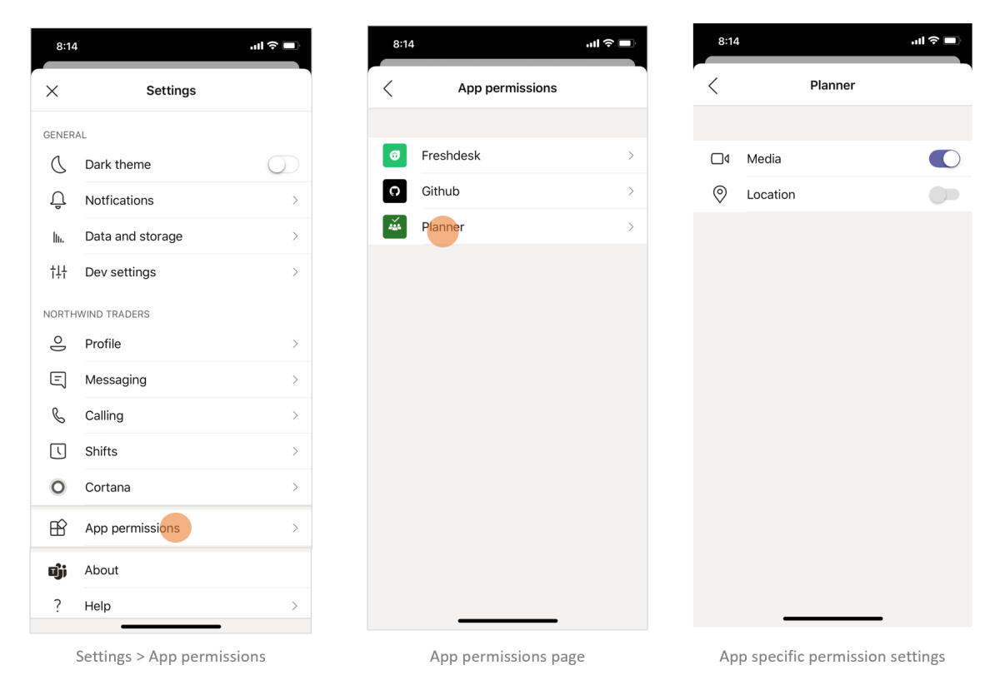
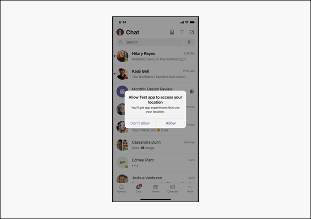

# <a name="request-device-permissions-for-your-microsoft-teams-app"></a>请求应用的设备Microsoft Teams权限

可以使用本机设备Teams（如相机、麦克风和位置）丰富你的应用。 本文档指导你了解如何请求用户同意和访问本机设备权限。

> [!NOTE]
>
> * 若要将媒体功能集成到 Microsoft Teams移动应用中，请参阅[集成媒体功能](mobile-camera-image-permissions.md)。
> * 若要将 QR 或条形码扫描仪功能集成到 Microsoft Teams 移动应用中，请参阅将 [QR 或条形码](qr-barcode-scanner-capability.md)扫描仪功能集成到 Teams。
> * 若要在移动应用中集成位置Microsoft Teams，请参阅[集成位置功能](location-capability.md)。

## <a name="native-device-permissions"></a>本机设备权限

必须请求设备权限才能访问本机设备功能。 设备权限对于所有应用构造（如选项卡、任务模块或消息传递扩展）的运行方式类似。 用户必须转到"权限"页，Teams设置才能管理设备权限。
通过访问设备功能，你可以构建更丰富的体验，Teams平台，例如：

* 捕获和查看图像。
* 扫描 QR 或条形码。
* 录制和共享简短视频。
* 录制音频备注并保存供以后使用。
* 使用用户的位置信息显示相关信息。

> [!NOTE]
>
> * 目前Teams不支持多窗口应用、选项卡和会议侧面板的设备权限。
> * 设备权限在浏览器中不同。 有关详细信息，请参阅 [浏览器设备权限](browser-device-permissions.md)。

## <a name="access-device-permissions"></a>访问设备权限

[JavaScript Microsoft Teams SDK](/javascript/api/overview/msteams-client?view=msteams-client-js-latest&preserve-view=true) 提供了您的 Teams 移动应用访问用户设备权限和构建更丰富的体验所需的工具。[](#manage-permissions)

虽然新式 Web 浏览器中对这些功能的访问是一种标准操作，但Teams更新应用清单来向用户通知你使用的功能。 此更新允许你在桌面客户端上运行应用时请求Teams权限。

> [!NOTE]
> 目前Microsoft Teams媒体功能和 QR 条形码扫描仪功能的支持仅适用于移动客户端。

## <a name="manage-permissions"></a>管理权限

用户可以通过选择"允许"或"拒绝Teams特定应用来管理设备权限。

# <a name="mobile"></a>[移动设备](#tab/mobile)

1. 打开Teams。
1. 转到"**设置** > **应用程序权限"**。
1. 选择要选择其设置的应用。
1. 选择所需的设置。

    

# <a name="desktop"></a>[桌面设备](#tab/desktop)

1. 打开你的Teams应用。
1. 选择窗口右上角的配置文件图标。
1. Select **设置** > **Permissions** from the drop-down menu.
1. 选择所需的设置。

   

---

## <a name="specify-permissions"></a>指定权限

通过添加并指定`manifest.json``devicePermissions`在应用程序中使用的以下五个属性中的哪一个来更新应用：

``` json
"devicePermissions": [
    "media",
    "geolocation",
    "notifications",
    "midi",
    "openExternal"
],
```

每个属性都允许您提示用户请求其同意：

| 属性      | 说明   |
| --- | --- |
| media         | 使用相机、麦克风、扬声器和访问媒体库的权限。 |
| 地理位置   | 返回用户位置的权限。      |
| 通知 | 发送用户通知的权限。      |
| midi          | 从数字音乐 (MIDI) 和接收音乐音乐数字接口的权限。   |
| openExternal  | 在外部应用程序中打开链接的权限。  |

## <a name="check-permissions-from-your-app"></a>检查应用的权限

添加到应用程序 `devicePermissions` 清单后，使用 **HTML5 权限 API** 检查权限，而不出现提示：

``` JavaScript
// Different query options:
navigator.permissions.query({ name: 'camera' });
navigator.permissions.query({ name: 'microphone' });
navigator.permissions.query({ name: 'geolocation' });
navigator.permissions.query({ name: 'notifications' });
navigator.permissions.query({ name: 'midi', sysex: true });

// Example:
navigator.permissions.query({name:'geolocation'}).then(function(result) {
  if (result.state == 'granted') {
    // Access granted
  } else if (result.state == 'prompt') {
    // Access has not been granted
  }
});
```

## <a name="use-teams-apis-to-get-device-permissions"></a>使用 Teams API 获取设备权限

利用适当的 HTML5 或 Teams API，显示获取访问设备权限同意的提示。

> [!IMPORTANT]
>
> * 对 、 `camera``gallery`和 的支持`microphone`通过 [**selectMedia API 启用**](/javascript/api/@microsoft/teams-js/microsoftteams.media.media?view=msteams-client-js-latest&preserve-view=true)。 将 [**captureImage API**](/javascript/api/@microsoft/teams-js/microsoftteams?view=msteams-client-js-latest#captureimage--error--sdkerror--files--file-------void-&preserve-view=true) 用于单个映像捕获。
> * 通过 getLocation `location` API 启用 [**对 的支持**](/javascript/api/@microsoft/teams-js/microsoftteams.location?view=msteams-client-js-latest#getLocation_LocationProps___error__SdkError__location__Location_____void_&preserve-view=true)。 你必须将此功能用于`getLocation API`位置，因为 HTML5 地理位置 API 当前在桌面客户端上Teams完全受支持。

例如：

* 若要提示用户访问其位置，你必须调用 `getCurrentPosition()`：

    ```JavaScript
    navigator.geolocation.getCurrentPosition    (function (position) { /*... */ });
    ```

* 若要提示用户访问桌面或 Web 上的相机，必须调用 `getUserMedia()`：

    ```JavaScript
    navigator.mediaDevices.getUserMedia({ audio: true, video: true });
    ```

* 若要在移动设备上捕获图像，Teams调用 时请求获取权限`captureImage()`：

    ```JavaScript
            function captureImage() {
            microsoftTeams.media.captureImage((error, files) => {
                // If there's any error, an alert shows the error message/code
                if (error) {
                    if (error.message) {
                        alert(" ErrorCode: " + error.errorCode + error.message);
                    } else {
                        alert(" ErrorCode: " + error.errorCode);
                    }
                } else if (files) {
                    image = files[0].content;
                    // Adding this image string in src attr of image tag will display the image on web page.
                    let imageString = "data:" + item.mimeType + ";base64," + image;
                }
            });
        } 
    ```

* 当你调用 时，通知将提示用户 `requestPermission()`：

    ```JavaScript
    Notification.requestPermission(function(result) { /* ... */ });
    ```

* 若要使用相机或访问照片库，Teams时，移动会询问权限`selectMedia()`：

    ```JavaScript
     function selectMedia() {
     microsoftTeams.media.selectMedia(mediaInput, (error, attachments) => {
         // If there's any error, an alert shows the error message/code
         if (error) {
             if (error.message) {
                 alert(" ErrorCode: " + error.errorCode + error.message);
             } else {
                 alert(" ErrorCode: " + error.errorCode);
             }
         } else if (attachments) {
             // creating image array which contains image string for all attached images. 
             const imageArray = attachments.map((item, index) => {
                 return ("data:" + item.mimeType + ";base64," + item.preview)
             })
         }
     });
    } 
  ```

* 若要使用麦克风，Teams时，移动设备会询问权限`selectMedia()`：

    ```JavaScript
     function selectMedia() {
     microsoftTeams.media.selectMedia({ maxMediaCount: 1, mediaType: microsoftTeams.media.MediaType.Audio }, (error: microsoftTeams.SdkError, attachments: microsoftTeams.media.Media[]) => {
         // If there's any error, an alert shows the error message/code
         if (error) {
             if (error.message) {
                 alert(" ErrorCode: " + error.errorCode + error.message);
             } else {
                 alert(" ErrorCode: " + error.errorCode);
             }
         }

         if (attachments) {
             // taking the first attachment  
             let audioResult = attachments[0];

             // setting audio string which can be used in Video tag
             let audioData = "data:" + audioResult.mimeType + ";base64," + audioResult.preview
         }
     });
     }
    ```

* 若要提示用户在地图界面上共享位置，Teams调用 时请求权限`getLocation()`：

    ```JavaScript
     function getLocation() {
     microsoftTeams.location.getLocation({ allowChooseLocation: true, showMap: true }, (error: microsoftTeams.SdkError, location: microsoftTeams.location.Location) => {
         let currentLocation = JSON.stringify(location);
     });
     } 
    ```

# <a name="mobile"></a>[移动设备](#tab/mobile)

   

# <a name="desktop"></a>[桌面设备](#tab/desktop)

   

---

## <a name="permission-behavior-across-login-sessions"></a>跨登录会话的权限行为

将存储每个登录会话的设备权限。 这意味着，如果你登录到另一个 Teams 实例（例如，在另一台计算机中）时，之前会话中的设备权限将不可用。 因此，必须重新同意新会话的设备权限。 这也意味着，如果你注销Teams或切换租户Teams，你的设备权限将从以前的登录会话中删除。  

> [!NOTE]
> 当你同意本机设备权限时，它仅对当前的登录 _会话_ 有效。

## <a name="code-sample"></a>代码示例

| **示例名称** | **说明** | **Node.js** |
|---------------|--------------|--------|
|设备权限 | 使用Microsoft Teams选项卡示例应用演示设备权限 |  [View](https://github.com/OfficeDev/Microsoft-Teams-Samples/tree/main/samples/tab-device-permissions/nodejs) |

## <a name="see-also"></a>另请参阅

* [浏览器的设备权限](browser-device-permissions.md)
* [将媒体功能集成到Teams](mobile-camera-image-permissions.md)
* [将 QR 或条形码扫描仪功能集成到 Teams](qr-barcode-scanner-capability.md)
* [在 Teams 中集成位置Teams](location-capability.md)
