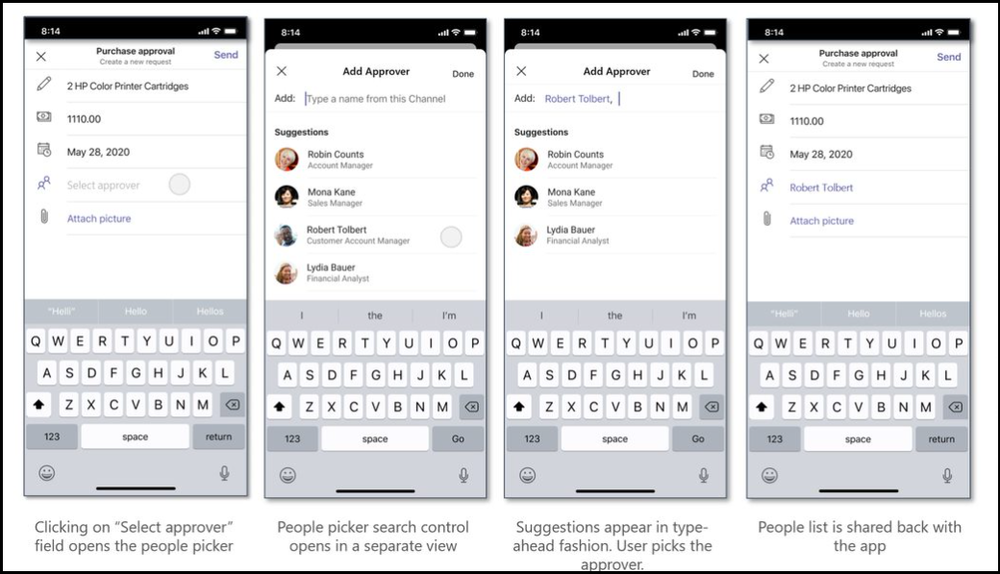

# <a name="integrate-people-picker-capability"></a><span data-ttu-id="2f36f-104">集成人员选取器功能</span><span class="sxs-lookup"><span data-stu-id="2f36f-104">Integrate People Picker capability</span></span> 

<span data-ttu-id="2f36f-105">人员选取器是一个控件，用于搜索和选择人员。</span><span class="sxs-lookup"><span data-stu-id="2f36f-105">People Picker is a control to search and select people.</span></span> <span data-ttu-id="2f36f-106">这是一项可在平台中Teams功能。</span><span class="sxs-lookup"><span data-stu-id="2f36f-106">This is a native capability available in Teams platform.</span></span> <span data-ttu-id="2f36f-107">你可以将本机Teams器输入控件与 Web 应用集成。</span><span class="sxs-lookup"><span data-stu-id="2f36f-107">You can integrate Teams native People Picker input control with your web apps.</span></span> <span data-ttu-id="2f36f-108">您可以在单选或多选和配置之间选择，例如限制聊天、频道或整个组织的搜索。</span><span class="sxs-lookup"><span data-stu-id="2f36f-108">You can select between single or multi selection, and configurations, such as limiting search within a chat, channels, or across the entire organization.</span></span>

<span data-ttu-id="2f36f-109">可以使用[JavaScript Microsoft Teams SDK，](/javascript/api/overview/msteams-client?view=msteams-client-js-latest&preserve-view=true)它提供 API 以将人员 `selectPeople` 选取器功能集成到 Web 应用中。</span><span class="sxs-lookup"><span data-stu-id="2f36f-109">You can use [Microsoft Teams JavaScript client SDK](/javascript/api/overview/msteams-client?view=msteams-client-js-latest&preserve-view=true), which provides `selectPeople` API to integrate the People Picker capability within your web app.</span></span> 

## <a name="advantages-of-integrating-people-picker-capability"></a><span data-ttu-id="2f36f-110">集成人员选取器功能的优点</span><span class="sxs-lookup"><span data-stu-id="2f36f-110">Advantages of integrating People Picker capability</span></span>

* <span data-ttu-id="2f36f-111">人员选取器控件适用于所有Teams图面，如任务模块、聊天、频道、会议选项卡和个人应用。</span><span class="sxs-lookup"><span data-stu-id="2f36f-111">The People Picker control works in all of Teams surfaces, such as task module, a chat, channel, meeting tab, and personal app.</span></span>
* <span data-ttu-id="2f36f-112">此控件允许你在聊天、频道或整个组织中搜索和选择用户。</span><span class="sxs-lookup"><span data-stu-id="2f36f-112">This control allows you to search for and select users within a chat, channel, or the entire organization.</span></span>
*  <span data-ttu-id="2f36f-113">人员选取器功能可帮助处理涉及任务分配、标记和通知用户的方案。</span><span class="sxs-lookup"><span data-stu-id="2f36f-113">The People Picker capability helps with scenarios involving task assignment, tagging, notifying a user.</span></span> 
* <span data-ttu-id="2f36f-114">可以在 Web 应用中使用此现成的控件。</span><span class="sxs-lookup"><span data-stu-id="2f36f-114">You can use this readily available control in your web app.</span></span> <span data-ttu-id="2f36f-115">它可显著节省自己构建此类控件的工作和时间。</span><span class="sxs-lookup"><span data-stu-id="2f36f-115">It saves the effort and time significantly to build such a control on your own.</span></span>

<span data-ttu-id="2f36f-116">你必须调用 `selectPeople` API 以将人员选取器控件集成到Teams应用中。</span><span class="sxs-lookup"><span data-stu-id="2f36f-116">You must call the `selectPeople` API to integrate People Picker control in your Teams app.</span></span> <span data-ttu-id="2f36f-117">为了进行有效的集成，你必须了解 [用于](#code-snippet) 调用 API 的代码段。</span><span class="sxs-lookup"><span data-stu-id="2f36f-117">For effective integration, you must have an understanding of [code snippet](#code-snippet) for calling the API.</span></span> <span data-ttu-id="2f36f-118">熟悉 API 响应错误以处理 [Web](#error-handling) 应用中的错误非常重要。</span><span class="sxs-lookup"><span data-stu-id="2f36f-118">It is important to familiarize yourself with the [API response errors](#error-handling) to handle the errors in your web app.</span></span>

> [!NOTE] 
> <span data-ttu-id="2f36f-119">目前Microsoft Teams对人员选取器功能的支持仅适用于移动客户端。</span><span class="sxs-lookup"><span data-stu-id="2f36f-119">Currently, Microsoft Teams support for People Picker capability is available for mobile clients only.</span></span>

## <a name="selectpeople-api"></a><span data-ttu-id="2f36f-120">`selectPeople` API</span><span class="sxs-lookup"><span data-stu-id="2f36f-120">`selectPeople` API</span></span> 

<span data-ttu-id="2f36f-121">`selectPeople`API 使你能够将Teams添加到 Web `People Picker input control` 应用中。</span><span class="sxs-lookup"><span data-stu-id="2f36f-121">`selectPeople` API enables you to add Teams native `People Picker input control` to your web apps.</span></span>  
<span data-ttu-id="2f36f-122">API 说明如下：</span><span class="sxs-lookup"><span data-stu-id="2f36f-122">The API description is as follows:</span></span>

| <span data-ttu-id="2f36f-123">API</span><span class="sxs-lookup"><span data-stu-id="2f36f-123">API</span></span>      | <span data-ttu-id="2f36f-124">说明</span><span class="sxs-lookup"><span data-stu-id="2f36f-124">Description</span></span>  |
| --- | --- |
|<span data-ttu-id="2f36f-125">**selectPeople**</span><span class="sxs-lookup"><span data-stu-id="2f36f-125">**selectPeople**</span></span>|<span data-ttu-id="2f36f-126">启动人员选取器，并允许用户从列表中搜索和选择一个或多个人员。</span><span class="sxs-lookup"><span data-stu-id="2f36f-126">Launches a People Picker and allows the user to search and select one or more people from the list.</span></span><br/><br/><span data-ttu-id="2f36f-127">此 API 将所选用户的 ID、名称和电子邮件地址返回到调用 Web 应用。</span><span class="sxs-lookup"><span data-stu-id="2f36f-127">This API returns the ID, name and email address of selected users to the calling web app.</span></span><br/><br/><span data-ttu-id="2f36f-128">对于个人应用，控件将在整个组织中进行搜索。</span><span class="sxs-lookup"><span data-stu-id="2f36f-128">In case of a personal app, the control searches across the organization.</span></span> <span data-ttu-id="2f36f-129">如果将应用添加到聊天或频道，则根据方案配置搜索上下文。</span><span class="sxs-lookup"><span data-stu-id="2f36f-129">If the app is added to a chat or channel, then the search context is configured depending on the scenario.</span></span> <span data-ttu-id="2f36f-130">搜索仅限于该聊天、频道的成员，或在整个组织中可用。</span><span class="sxs-lookup"><span data-stu-id="2f36f-130">The search is restricted within the members of that chat, channel, or made available across the organization.</span></span>|

<span data-ttu-id="2f36f-131">`selectPeople`API 附带以下输入配置：</span><span class="sxs-lookup"><span data-stu-id="2f36f-131">The `selectPeople` API comes along with following input configurations:</span></span>

|<span data-ttu-id="2f36f-132">配置参数</span><span class="sxs-lookup"><span data-stu-id="2f36f-132">Configuration parameter</span></span>|<span data-ttu-id="2f36f-133">类型</span><span class="sxs-lookup"><span data-stu-id="2f36f-133">Type</span></span>|<span data-ttu-id="2f36f-134">说明</span><span class="sxs-lookup"><span data-stu-id="2f36f-134">Description</span></span>| <span data-ttu-id="2f36f-135">默认值</span><span class="sxs-lookup"><span data-stu-id="2f36f-135">Default value</span></span>|
|-----|------|--------------|------|
|`title`| <span data-ttu-id="2f36f-136">String</span><span class="sxs-lookup"><span data-stu-id="2f36f-136">String</span></span>| <span data-ttu-id="2f36f-137">它是可选参数。</span><span class="sxs-lookup"><span data-stu-id="2f36f-137">It is an optional parameter.</span></span> <span data-ttu-id="2f36f-138">它设置人员选取器控件的标题。</span><span class="sxs-lookup"><span data-stu-id="2f36f-138">It sets title for the People Picker control.</span></span> | <span data-ttu-id="2f36f-139">选择人员</span><span class="sxs-lookup"><span data-stu-id="2f36f-139">Select people</span></span>|
|`setSelected`|<span data-ttu-id="2f36f-140">String</span><span class="sxs-lookup"><span data-stu-id="2f36f-140">String</span></span>| <span data-ttu-id="2f36f-141">它是可选参数。</span><span class="sxs-lookup"><span data-stu-id="2f36f-141">It is an optional parameter.</span></span> <span data-ttu-id="2f36f-142">必须传递要预先选择的人的 AAD ID。</span><span class="sxs-lookup"><span data-stu-id="2f36f-142">You must pass AAD IDs of the people to be preselected.</span></span> <span data-ttu-id="2f36f-143">此参数在启动人员选取器控件时预选人员。</span><span class="sxs-lookup"><span data-stu-id="2f36f-143">This parameter preselects people while launching the People Picker control.</span></span> <span data-ttu-id="2f36f-144">在单选的情况下，只会预填充第一个有效用户，忽略其余用户。</span><span class="sxs-lookup"><span data-stu-id="2f36f-144">In case of single selection, only the first valid user is prepopulated ignoring the rest.</span></span> |<span data-ttu-id="2f36f-145">NULL</span><span class="sxs-lookup"><span data-stu-id="2f36f-145">Null</span></span>| 
|`openOrgWideSearchInChatOrChannel`|<span data-ttu-id="2f36f-146">Boolean</span><span class="sxs-lookup"><span data-stu-id="2f36f-146">Boolean</span></span> | <span data-ttu-id="2f36f-147">它是可选参数。</span><span class="sxs-lookup"><span data-stu-id="2f36f-147">It is an optional parameter.</span></span> <span data-ttu-id="2f36f-148">设置为 true 时，它将在组织范围内启动人员选取器，即使该应用已添加到聊天或频道也是如此。</span><span class="sxs-lookup"><span data-stu-id="2f36f-148">When it is set to true, it launches the People Picker in organization wide scope even if the app is added to a chat or channel.</span></span> |<span data-ttu-id="2f36f-149">错误</span><span class="sxs-lookup"><span data-stu-id="2f36f-149">False</span></span>|
|`singleSelect`|<span data-ttu-id="2f36f-150">Boolean</span><span class="sxs-lookup"><span data-stu-id="2f36f-150">Boolean</span></span>|<span data-ttu-id="2f36f-151">它是可选参数。</span><span class="sxs-lookup"><span data-stu-id="2f36f-151">It is an optional parameter.</span></span> <span data-ttu-id="2f36f-152">设置为 true 时，它会启动人员选取器，将选择限制为仅一个用户。</span><span class="sxs-lookup"><span data-stu-id="2f36f-152">When it is set to true, it launches the People Picker restricting the selection to one user only.</span></span> |<span data-ttu-id="2f36f-153">错误</span><span class="sxs-lookup"><span data-stu-id="2f36f-153">False</span></span>|

<span data-ttu-id="2f36f-154">下图描述了示例 Web 应用中人员选取器功能的体验：</span><span class="sxs-lookup"><span data-stu-id="2f36f-154">The following image depicts the experience of People Picker capability in a sample web app:</span></span>



### <a name="code-snippet"></a><span data-ttu-id="2f36f-156">代码段</span><span class="sxs-lookup"><span data-stu-id="2f36f-156">Code snippet</span></span>

<span data-ttu-id="2f36f-157">**呼叫 `selectPeople` 用于** 从列表中选择人的 API：</span><span class="sxs-lookup"><span data-stu-id="2f36f-157">**Calling `selectPeople` API** to select people from a list:</span></span>

```javascript
 microsoftTeams.people.selectPeople((error: microsoftTeams.SdkError, people: microsoftTeams.people.PeoplePickerResult[]) => 
 {
    if (error) 
    {
        if (error.message) 
           {
             alert(" ErrorCode: " + error.errorCode + error.message);
           }
            else 
            {
              alert(" ErrorCode: " + error.errorCode);
            }
      }
    if (people)
     {
            output(" People length: " + people.length + " " + JSON.stringify(people));
      }
  });
```

## <a name="error-handling"></a><span data-ttu-id="2f36f-158">错误处理</span><span class="sxs-lookup"><span data-stu-id="2f36f-158">Error handling</span></span>

<span data-ttu-id="2f36f-159">必须确保在 Web 应用中正确处理错误。</span><span class="sxs-lookup"><span data-stu-id="2f36f-159">You must ensure to handle the errors appropriately in your web app.</span></span> <span data-ttu-id="2f36f-160">下表列出了错误代码以及生成错误的条件：</span><span class="sxs-lookup"><span data-stu-id="2f36f-160">The following table lists the error codes and the conditions under which the errors are generated:</span></span> 

|<span data-ttu-id="2f36f-161">错误代码</span><span class="sxs-lookup"><span data-stu-id="2f36f-161">Error code</span></span> |  <span data-ttu-id="2f36f-162">错误名称</span><span class="sxs-lookup"><span data-stu-id="2f36f-162">Error name</span></span>     | <span data-ttu-id="2f36f-163">Condition</span><span class="sxs-lookup"><span data-stu-id="2f36f-163">Condition</span></span>|
| --------- | --------------- | -------- |
| <span data-ttu-id="2f36f-164">**100**</span><span class="sxs-lookup"><span data-stu-id="2f36f-164">**100**</span></span> | <span data-ttu-id="2f36f-165">NOT_SUPPORTED_ON_PLATFORM</span><span class="sxs-lookup"><span data-stu-id="2f36f-165">NOT_SUPPORTED_ON_PLATFORM</span></span> | <span data-ttu-id="2f36f-166">API 在当前平台上不受支持。</span><span class="sxs-lookup"><span data-stu-id="2f36f-166">API is not supported on the current platform.</span></span>|
| <span data-ttu-id="2f36f-167">**500**</span><span class="sxs-lookup"><span data-stu-id="2f36f-167">**500**</span></span> | <span data-ttu-id="2f36f-168">INTERNAL_ERROR</span><span class="sxs-lookup"><span data-stu-id="2f36f-168">INTERNAL_ERROR</span></span> | <span data-ttu-id="2f36f-169">启动人员选取器时遇到内部错误。</span><span class="sxs-lookup"><span data-stu-id="2f36f-169">Internal error is encountered while launching People Picker.</span></span>|
| <span data-ttu-id="2f36f-170">**4000**</span><span class="sxs-lookup"><span data-stu-id="2f36f-170">**4000**</span></span> | <span data-ttu-id="2f36f-171">INVALID_ARGUMENTS</span><span class="sxs-lookup"><span data-stu-id="2f36f-171">INVALID_ARGUMENTS</span></span> | <span data-ttu-id="2f36f-172">使用错误或不足的强制参数调用 API。</span><span class="sxs-lookup"><span data-stu-id="2f36f-172">API is invoked with wrong or insufficient mandatory arguments.</span></span>|
| <span data-ttu-id="2f36f-173">**8000**</span><span class="sxs-lookup"><span data-stu-id="2f36f-173">**8000**</span></span> | <span data-ttu-id="2f36f-174">USER_ABORT</span><span class="sxs-lookup"><span data-stu-id="2f36f-174">USER_ABORT</span></span> |<span data-ttu-id="2f36f-175">用户已取消操作。</span><span class="sxs-lookup"><span data-stu-id="2f36f-175">User cancelled the operation.</span></span>|
| <span data-ttu-id="2f36f-176">**9000**</span><span class="sxs-lookup"><span data-stu-id="2f36f-176">**9000**</span></span> | <span data-ttu-id="2f36f-177">OLD_PLATFORM</span><span class="sxs-lookup"><span data-stu-id="2f36f-177">OLD_PLATFORM</span></span> | <span data-ttu-id="2f36f-178">用户位于不存在 API 实现的旧平台版本上。</span><span class="sxs-lookup"><span data-stu-id="2f36f-178">User is on old platform build where implementation of the API is not present.</span></span>  <span data-ttu-id="2f36f-179">升级内部版本可解决此问题。</span><span class="sxs-lookup"><span data-stu-id="2f36f-179">Upgrading the build resolves the issue.</span></span>|

## <a name="see-also"></a><span data-ttu-id="2f36f-180">另请参阅</span><span class="sxs-lookup"><span data-stu-id="2f36f-180">See also</span></span>

* [<span data-ttu-id="2f36f-181">将媒体功能集成到Teams</span><span class="sxs-lookup"><span data-stu-id="2f36f-181">Integrate media capabilities in Teams</span></span>](mobile-camera-image-permissions.md)
* [<span data-ttu-id="2f36f-182">将 QR 代码或条形码扫描仪功能集成到 Teams</span><span class="sxs-lookup"><span data-stu-id="2f36f-182">Integrate QR code or barcode scanner capability in Teams</span></span>](qr-barcode-scanner-capability.md)
* [<span data-ttu-id="2f36f-183">在 Teams 中集成位置Teams</span><span class="sxs-lookup"><span data-stu-id="2f36f-183">Integrate location capabilities in Teams</span></span>](location-capability.md)
