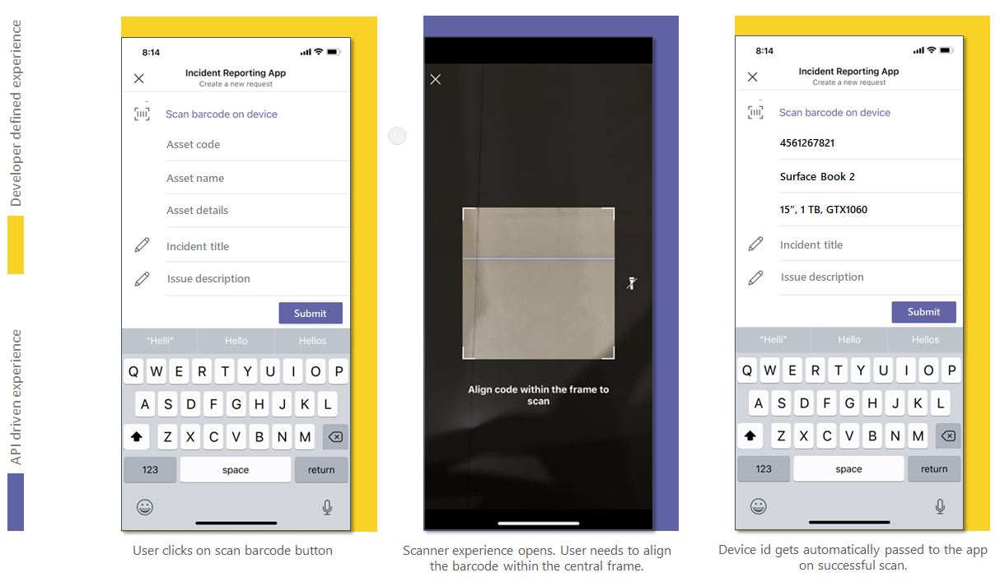

# <a name="integrate-qr-or-barcode-scanner-capability"></a>集成 QR 或条码扫描仪功能

条形码是一种以视觉对象和计算机可读形式表示数据的方法。 条形码以条形和空格形式包含产品相关信息，例如类型、尺寸、制造商和原产国。 可使用本机设备相机上的光学扫描程序读取代码。 为了获得更丰富的协作体验，可以将 Teams 平台中提供的 QR 或条形码扫描程序功能与 Teams 应用集成。

可以使用 [Microsoft Teams JavaScript 客户端 SDK](/javascript/api/overview/msteams-client?view=msteams-client-js-latest&preserve-view=true)，它为应用访问用户的[本机设备功能](native-device-permissions.md)提供了所需的工具。 使用 [scanBarCode](/javascript/api/@microsoft/teams-js/microsoftteams.media?view=msteams-client-js-latest&preserve-view=true#scanBarCode__error__SdkError__decodedText__string_____void__BarCodeConfig_) API 在应用中集成扫描程序功能。

## <a name="advantage-of-integrating-qr-or-barcode-scanner-capability"></a>集成 QR 或条形码扫描程序功能的优点

下面是 QR 或条形码扫描程序功能集成的优点：

* 借助此集成，Teams 平台上的 Web 应用开发人员可以通过 Teams JavaScript 客户端 SDK 利用 QR 或条形码扫描功能。
* 使用此功能，用户只需在扫描程序 UI 中心的框架内对齐 QR 或条形码，代码就会自动扫描。 存储的数据将与调用 Web 应用共享。 这可避免手动输入冗长的产品代码或其他相关信息带来的不便和人为错误。

若要集成 QR 或条形码扫描程序功能，必须更新应用清单文件并调用 [scanBarCode](/javascript/api/@microsoft/teams-js/microsoftteams.media?view=msteams-client-js-latest&preserve-view=true#scanBarCode__error__SdkError__decodedText__string_____void__BarCodeConfig_) API。 若要有效集成，必须充分了解用于调用 [scanBarCode](/javascript/api/@microsoft/teams-js/microsoftteams.media?view=msteams-client-js-latest&preserve-view=true#scanBarCode__error__SdkError__decodedText__string_____void__BarCodeConfig_) API 的[代码片段](#code-snippet)，以便使用本机 QR 或条形码扫描程序功能。 API 会为不受支持的条形码标准提供错误。
请务必熟悉 [API 响应错误](#error-handling)，以处理 Teams 应用中的错误。

> [!NOTE]
> 目前，Microsoft Teams 对 QR 或条形码扫描程序功能的支持仅适用于移动客户端。

## <a name="update-manifest"></a>更新清单

通过添加 `devicePermissions` 属性并指定 `media` 来更新 Teams 应用 [manifest.json](../../resources/schema/manifest-schema.md#devicepermissions) 文件。 它允许应用在用户开始使用 QR 或条形码扫描程序功能之前向他们请求必要的权限。 应用清单的更新如下所示：

``` json
"devicePermissions": [
    "media",
],
```

> [!NOTE]
> 启动相关 Teams API 时，将自动显示“**请求权限**”提示。 有关详细信息，请参阅[请求设备权限](native-device-permissions.md)。

## <a name="scanbarcode-api"></a>ScanBarCode API

[scanBarCode](/javascript/api/@microsoft/teams-js/microsoftteams.media?view=msteams-client-js-latest&preserve-view=true#scanBarCode__error__SdkError__decodedText__string_____void__BarCodeConfig_) API 调用扫描程序控件，使用户能够扫描不同类型的条形码，并将结果作为字符串返回。

若要自定义条形码扫描体验，可选[条形码配置](/javascript/api/@microsoft/teams-js/microsoftteams.media.barcodeconfig?view=msteams-client-js-latest&preserve-view=true)将作为输入传递给 [scanBarCode](/javascript/api/@microsoft/teams-js/microsoftteams.media?view=msteams-client-js-latest&preserve-view=true#scanBarCode__error__SdkError__decodedText__string_____void__BarCodeConfig_) API。 可以使用 `timeOutIntervalInSec` 指定扫描超时间隔（以秒为单位）。 其默认值为 30 秒，最大值为 60 秒。

**scanBarCode()** API 支持以下条形码类型：

| 条形码类型 | 在 Android 上受支持 | 在 iOS 上受支持 |
| ---------- | ---------- | ------------ |
| Codebar | 是 | 否 |
| 代码 39 | 可访问 | 是 |
| 代码 93 | 可访问 | 是 |
| 代码 128 | 是 | 是 |
| EAN-13 | 是 | 是 |
| EAN-8 | 是 | 是 |
| ITF | 否 | 可访问 |
| QR 码 | 是 | 是 |
| RSS Expanded | 是 | 否 |
| RSS-14 | 可访问 | 否 |
| UPC-A | 是 | 可访问 |
| UPC-E | 是 | 是 |

下图描绘了 QR 或条形码扫描程序功能的 Web 应用体验：



## <a name="error-handling"></a>错误处理

必须确保在 Teams 应用中正确处理这些错误。 下表列出了错误代码和产生错误的条件：

|错误代码 |  错误名称     | 条件|
| --------- | --------------- | -------- |
| **100** | NOT_SUPPORTED_ON_PLATFORM | 当前平台不支持 API。|
| **500** | INTERNAL_ERROR | 执行所需的操作时遇到内部错误。|
| **1000** | PERMISSION_DENIED |权限被用户拒绝。|
| **3000** | NO_HW_SUPPORT | 基础硬件不支持此功能。|
| **4000** | INVALID_ARGUMENTS | 一个或多个参数无效。|
| **8000** | USER_ABORT |用户中止了该操作。|
| **8001** | OPERATION_TIMED_OUT | 无法在给定的时间间隔内检测到条形码。|
| **9000** | OLD_PLATFORM | 平台代码已过时，不实现此 API。|

## <a name="code-snippet"></a>代码片段

**调用 `ScanBarCode()` API** 以使用相机扫描 QR 或条形码：

```javascript
const config: microsoftTeams.media.BarCodeConfig = {
  timeOutIntervalInSec: 30};
microsoftTeams.media.scanBarCode((error: microsoftTeams.SdkError, decodedText: string) => {
  if (error) {
    if (error.message) {
      output(" ErrorCode: " + error.errorCode + error.message);
    } else {
      output(" ErrorCode: " + error.errorCode);
    }
  } else if (decodedText) {
    output(decodedText);
  }
}, config);
```

## <a name="see-also"></a>另请参阅

* [集成媒体功能](media-capabilities.md)
* [在 Teams 中集成位置功能](location-capability.md)
* [在 Teams 中集成人员选取器](people-picker-capability.md)
