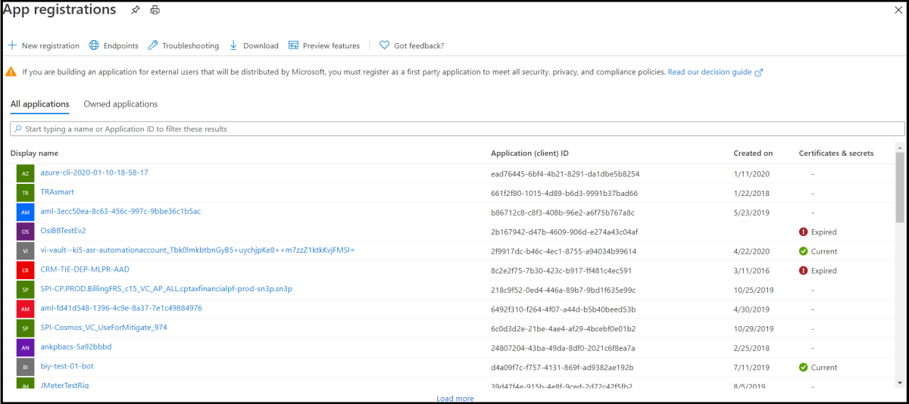

1. 在 [Azure 门户](https://ms.portal.azure.com/#home)的“Azure 服务”下，选择“**创建资源**”。
1. 在搜索框中，输入“机器人”。 在下拉列表中，选择“**机器人频道注册**”。
1. 选择“**创建**”按钮。
1. 在“**机器人频道注册**”边栏选项卡中，提供有关机器人的所需信息。
1. 暂时将“**消息传递终结点**”框留空，你需要在部署机器人后输入所需的 URL。 下图显示了注册设置的示例：

    

1. 单击“**Microsoft 应用 ID 和密码**”，然后单击“**新建**”。

         

1. 单击“**在应用注册门户中创建应用 ID**”链接。

   
   
1. 在显示的“**应用注册**”窗口中，单击左上角的“**新建注册**”选项卡。
1. 输入要注册的机器人应用程序的名称，我们使用 *BotTeamsAuth*（你需要选择自己的唯一名称）。
1. 对于“**受支持的帐户类型**”，选择“*任何组织目录(任何 Azure AD 目录 - 多租户)中的帐户和个人 Microsoft 帐户(例如 Skype、Xbox)*”。
1. 单击“**注册**”按钮。 完成后，Azure 将显示应用程序的“*概述*”页面。
1. 复制“**应用程序(客户端) ID**”值并将其保存到文件中。
1. 在左侧窗格中，单击“**证书和密码**”。
    1. 在“*客户端密码*”下，单击“**新建客户端密码**”。
    1. 添加描述，以便从可能需要为此应用创建的其他密码中识别此密码。
    1. 将“*到期时间*”设置为你的选择。
    1. 单击“**添加**”。
    1. 复制客户端密码并将其保存到文件中。
1. 返回“**机器人频道注册**”窗口，分别复制“**Microsoft 应用 ID**”和“**密码**”框中的“*应用 ID*”和“*客户端密码*”。
1. 单击“**确定**”。
1. 最后单击“**创建**”。

在 Azure 创建注册资源后，它将包含在资源组列表中。  

创建机器人频道注册后，需要启用 Teams 频道。

1. 在 [Azure 门户](https://ms.portal.azure.com/#home)的“Azure 服务”下，选择刚才创建的 **机器人频道注册**。
1. 在左侧窗格中，单击“**频道**”。
1. 单击 Microsoft Teams 图标，然后选择“**保存**”。
