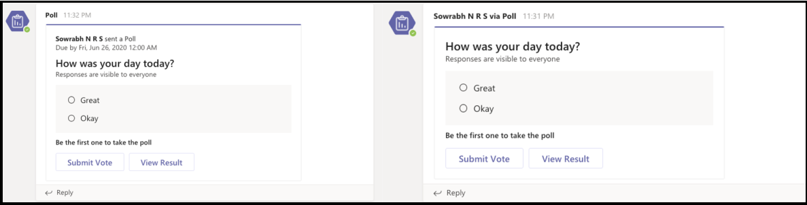

# <a name="respond-to-the-task-module-submit-action"></a><span data-ttu-id="94abd-103">响应任务模块提交操作</span><span class="sxs-lookup"><span data-stu-id="94abd-103">Respond to the task module submit action</span></span>

[!include[v4-to-v3-SDK-pointer](~/includes/v4-to-v3-pointer-me.md)]

<span data-ttu-id="94abd-104">本文档将指导你应用如何响应操作命令，如用户的任务模块提交操作。</span><span class="sxs-lookup"><span data-stu-id="94abd-104">This document guides you on how your app responds to the action commands, such as user's task module submit action.</span></span>
<span data-ttu-id="94abd-105">在用户提交任务模块后，Web 服务会收到一条调用消息，该消息包含 `composeExtension/submitAction` 命令 ID 和参数值。</span><span class="sxs-lookup"><span data-stu-id="94abd-105">After a user submits the task module, your web service receives a `composeExtension/submitAction` invoke message with the command ID and parameter values.</span></span> <span data-ttu-id="94abd-106">你的应用有五秒钟时间响应调用，否则用户会收到错误消息"无法访问应用"，并且 Teams客户端将忽略对调用的任何回复。</span><span class="sxs-lookup"><span data-stu-id="94abd-106">Your app has five seconds to respond to the invoke, otherwise the user receives an error message **Unable to reach the app**, and any reply to the invoke is ignored by the Teams client.</span></span>

<span data-ttu-id="94abd-107">有以下选项可以响应：</span><span class="sxs-lookup"><span data-stu-id="94abd-107">You have the following options to respond:</span></span>

* <span data-ttu-id="94abd-108">无响应：使用提交操作在外部系统中触发进程，不向用户提供任何反馈。</span><span class="sxs-lookup"><span data-stu-id="94abd-108">No response: Use the submit action to trigger a process in an external system, and not provide any feedback to the user.</span></span> <span data-ttu-id="94abd-109">这适用于长时间运行的过程，并且可以选择备用提供反馈。</span><span class="sxs-lookup"><span data-stu-id="94abd-109">This is useful for long-running processes, and you can select to provide feedback alternately.</span></span> <span data-ttu-id="94abd-110">例如，可以使用主动消息 [提供反馈](~/bots/how-to/conversations/send-proactive-messages.md)。</span><span class="sxs-lookup"><span data-stu-id="94abd-110">For example, you can give feedback with a [proactive message](~/bots/how-to/conversations/send-proactive-messages.md).</span></span>
* <span data-ttu-id="94abd-111">[另一个](#respond-with-another-task-module)任务模块 ：作为多步骤交互的一部分，可以使用其他任务模块进行响应。</span><span class="sxs-lookup"><span data-stu-id="94abd-111">[Another task module](#respond-with-another-task-module): You can respond with an additional task module as part of a multi-step interaction.</span></span>
* <span data-ttu-id="94abd-112">[卡片](#respond-with-a-card-inserted-into-the-compose-message-area)响应：可以使用用户可与之交互或插入邮件的卡片进行响应。</span><span class="sxs-lookup"><span data-stu-id="94abd-112">[Card response](#respond-with-a-card-inserted-into-the-compose-message-area): You can respond with a card that the user can interact with or insert into a message.</span></span>
* <span data-ttu-id="94abd-113">[自动程序中的自适应卡片](#bot-response-with-adaptive-card)：将自适应卡片直接插入对话中。</span><span class="sxs-lookup"><span data-stu-id="94abd-113">[Adaptive Card from bot](#bot-response-with-adaptive-card): Insert an Adaptive Card directly into the conversation.</span></span>
* <span data-ttu-id="94abd-114">[请求用户进行身份验证](~/messaging-extensions/how-to/add-authentication.md)。</span><span class="sxs-lookup"><span data-stu-id="94abd-114">[Request the user to authenticate](~/messaging-extensions/how-to/add-authentication.md).</span></span>
* <span data-ttu-id="94abd-115">[请求用户提供其他配置](~/messaging-extensions/how-to/add-configuration-page.md)。</span><span class="sxs-lookup"><span data-stu-id="94abd-115">[Request the user to provide additional configuration](~/messaging-extensions/how-to/add-configuration-page.md).</span></span>

<span data-ttu-id="94abd-116">对于身份验证或配置，在用户完成此过程后，原始调用将重新发至 Web 服务。</span><span class="sxs-lookup"><span data-stu-id="94abd-116">For authentication or configuration, after the user completes the process, the original invoke is resent to your web service.</span></span> <span data-ttu-id="94abd-117">下表根据消息扩展的调用位置显示哪些类型的响应 `commandContext` 可用：</span><span class="sxs-lookup"><span data-stu-id="94abd-117">The following table shows which types of responses are available based on the invoke location `commandContext` of the messaging extension:</span></span> 

|<span data-ttu-id="94abd-118">响应类型</span><span class="sxs-lookup"><span data-stu-id="94abd-118">Response Type</span></span> | <span data-ttu-id="94abd-119">撰写</span><span class="sxs-lookup"><span data-stu-id="94abd-119">Compose</span></span> | <span data-ttu-id="94abd-120">命令栏</span><span class="sxs-lookup"><span data-stu-id="94abd-120">Command bar</span></span> | <span data-ttu-id="94abd-121">邮件</span><span class="sxs-lookup"><span data-stu-id="94abd-121">Message</span></span> |
|--------------|:-------------:|:-------------:|:---------:|
|<span data-ttu-id="94abd-122">卡片响应</span><span class="sxs-lookup"><span data-stu-id="94abd-122">Card response</span></span> | <span data-ttu-id="94abd-123">✔</span><span class="sxs-lookup"><span data-stu-id="94abd-123">✔</span></span> | <span data-ttu-id="94abd-124">✔</span><span class="sxs-lookup"><span data-stu-id="94abd-124">✔</span></span> | <span data-ttu-id="94abd-125">✔</span><span class="sxs-lookup"><span data-stu-id="94abd-125">✔</span></span> |
|<span data-ttu-id="94abd-126">另一个任务模块</span><span class="sxs-lookup"><span data-stu-id="94abd-126">Another task module</span></span> | <span data-ttu-id="94abd-127">✔</span><span class="sxs-lookup"><span data-stu-id="94abd-127">✔</span></span> | <span data-ttu-id="94abd-128">✔</span><span class="sxs-lookup"><span data-stu-id="94abd-128">✔</span></span> | <span data-ttu-id="94abd-129">✔</span><span class="sxs-lookup"><span data-stu-id="94abd-129">✔</span></span> |
|<span data-ttu-id="94abd-130">带自适应卡片的自动程序</span><span class="sxs-lookup"><span data-stu-id="94abd-130">Bot with Adaptive Card</span></span> | <span data-ttu-id="94abd-131">✔</span><span class="sxs-lookup"><span data-stu-id="94abd-131">✔</span></span> | <span data-ttu-id="94abd-132">x</span><span class="sxs-lookup"><span data-stu-id="94abd-132">x</span></span> | <span data-ttu-id="94abd-133">✔</span><span class="sxs-lookup"><span data-stu-id="94abd-133">✔</span></span> |
| <span data-ttu-id="94abd-134">无响应</span><span class="sxs-lookup"><span data-stu-id="94abd-134">No response</span></span> | <span data-ttu-id="94abd-135">✔</span><span class="sxs-lookup"><span data-stu-id="94abd-135">✔</span></span> | <span data-ttu-id="94abd-136">✔</span><span class="sxs-lookup"><span data-stu-id="94abd-136">✔</span></span> | <span data-ttu-id="94abd-137">✔</span><span class="sxs-lookup"><span data-stu-id="94abd-137">✔</span></span> |

> [!NOTE]
> * <span data-ttu-id="94abd-138">当你选择 **"Action.Submit** through ME cards"时，它会发送名称为 **composeExtension** 的 invoke 活动，其中值等于常规有效负载。</span><span class="sxs-lookup"><span data-stu-id="94abd-138">When you select **Action.Submit** through ME cards, it sends invoke activity with the name **composeExtension**, where the value is equal to the usual payload.</span></span>
> * <span data-ttu-id="94abd-139">选择 **"Action.Submit** through conversation"时，将收到名称为 **onCardButtonClicked** 的邮件活动，其中值等于常规有效负载。</span><span class="sxs-lookup"><span data-stu-id="94abd-139">When you select **Action.Submit** through conversation, you receive message activity with the name **onCardButtonClicked**, where the value is equal to the usual payload.</span></span>

## <a name="the-submitaction-invoke-event"></a><span data-ttu-id="94abd-140">submitAction 调用事件</span><span class="sxs-lookup"><span data-stu-id="94abd-140">The submitAction invoke event</span></span>

<span data-ttu-id="94abd-141">接收调用消息的示例如下所示：</span><span class="sxs-lookup"><span data-stu-id="94abd-141">Examples of receiving the invoke message are as follows:</span></span>

# <a name="cnet"></a>[<span data-ttu-id="94abd-142">C#/.NET</span><span class="sxs-lookup"><span data-stu-id="94abd-142">C#/.NET</span></span>](#tab/dotnet)

```csharp
protected override async Task<MessagingExtensionActionResponse> OnTeamsMessagingExtensionSubmitActionAsync(
  ITurnContext<IInvokeActivity> turnContext, MessagingExtensionAction action, CancellationToken cancellationToken) {
  //code to handle the submit action
}
```

# <a name="javascriptnodejs"></a>[<span data-ttu-id="94abd-143">JavaScript/Node.js</span><span class="sxs-lookup"><span data-stu-id="94abd-143">JavaScript/Node.js</span></span>](#tab/javascript)

```javascript
class TeamsMessagingExtensionsActionPreview extends TeamsActivityHandler {
  constructor() {
  handleTeamsMessagingExtensionSubmitAction(context, action) {
  
  //code to handle the submit action
    }
  }
}
```

# <a name="json"></a>[<span data-ttu-id="94abd-144">JSON</span><span class="sxs-lookup"><span data-stu-id="94abd-144">JSON</span></span>](#tab/json)

<span data-ttu-id="94abd-145">这是您收到的 JSON 对象的示例。</span><span class="sxs-lookup"><span data-stu-id="94abd-145">This is an example of the JSON object that you receive.</span></span> <span data-ttu-id="94abd-146">`commandContext`参数指示从何处触发邮件扩展。</span><span class="sxs-lookup"><span data-stu-id="94abd-146">The `commandContext` parameter indicates where your messaging extension was triggered from.</span></span> <span data-ttu-id="94abd-147">`data`对象包含作为参数的表单上的字段以及用户提交的值。</span><span class="sxs-lookup"><span data-stu-id="94abd-147">The `data` object contains the fields on the form as parameters, and the values the user submitted.</span></span> <span data-ttu-id="94abd-148">此处的 JSON 对象已缩短，以突出显示最相关的字段。</span><span class="sxs-lookup"><span data-stu-id="94abd-148">The JSON object here is shortened to highlight the most relevant fields.</span></span>

```json
{
  "name": "composeExtension/submitAction",
  "imdisplayname": "Bob Smith",
  "serviceUrl": "https://smba.trafficmanager.net/amer/",
  "value": {
    "commandId": "giveKudos",
    "commandContext": "compose",
    "context": {
      "theme": "default"
    },
    "data": {
      "id": "submitButton",
      "formField1": "formField1_value",
      "formField2": "formField2_value",
      "formField3": "formField3_value"
    }
  },
  "conversation": {
    "id": "19:7705841b240044b297123ad7f9c99217@thread.skype"
  }
}
```

* * *

## <a name="respond-with-a-card-inserted-into-the-compose-message-area"></a><span data-ttu-id="94abd-149">在撰写邮件区域中插入卡片进行响应</span><span class="sxs-lookup"><span data-stu-id="94abd-149">Respond with a card inserted into the compose message area</span></span>

<span data-ttu-id="94abd-150">响应请求的最常见方法 `composeExtension/submitAction` 为将卡片插入撰写邮件区域。</span><span class="sxs-lookup"><span data-stu-id="94abd-150">The most common way to respond to the `composeExtension/submitAction` request is with a card inserted into the compose message area.</span></span> <span data-ttu-id="94abd-151">用户将卡片提交到对话。</span><span class="sxs-lookup"><span data-stu-id="94abd-151">The user submits the card to the conversation.</span></span> <span data-ttu-id="94abd-152">有关使用卡片的信息，请参阅 [卡片和卡片操作](~/task-modules-and-cards/cards/cards-actions.md)。</span><span class="sxs-lookup"><span data-stu-id="94abd-152">For more information on using cards, see [cards and card actions](~/task-modules-and-cards/cards/cards-actions.md).</span></span>

# <a name="cnet"></a>[<span data-ttu-id="94abd-153">C#/.NET</span><span class="sxs-lookup"><span data-stu-id="94abd-153">C#/.NET</span></span>](#tab/dotnet)

```csharp
protected override async Task<MessagingExtensionActionResponse> OnTeamsMessagingExtensionSubmitActionAsync(
  ITurnContext<IInvokeActivity> turnContext, MessagingExtensionAction action, CancellationToken cancellationToken)
{
    var response = new MessagingExtensionActionResponse
    {
        ComposeExtension = new MessagingExtensionResult
        {
            AttachmentLayout = "list",
            Type = "result",
        },
    };
    var createCardData = ((JObject)action.Data).ToObject<CreateCardData>();
var card = new HeroCard
{
     Title = createCardData.Title,
     Subtitle = createCardData.Subtitle,
     Text = createCardData.Text,
};
    var attachments = new List<MessagingExtensionAttachment>();
    attachments.Add(new MessagingExtensionAttachment
    {
        Content = card,
        ContentType = HeroCard.ContentType,
        Preview = card.ToAttachment(),
    });
    response.ComposeExtension.Attachments = attachments;
    return response;
}
```

# <a name="javascriptnodejs"></a>[<span data-ttu-id="94abd-154">JavaScript/Node.js</span><span class="sxs-lookup"><span data-stu-id="94abd-154">JavaScript/Node.js</span></span>](#tab/javascript)

```javascript
class TeamsMessagingExtensionsActionPreview extends TeamsActivityHandler {
  handleTeamsMessagingExtensionSubmitAction(context, action) {
    const data = action.data;
    const heroCard = CardFactory.heroCard(data.title, data.text);
    heroCard.content.subtitle = data.subTitle;
    const attachment = { contentType: heroCard.contentType, content: heroCard.content, preview: heroCard };

    return {
      composeExtension: {
        type: 'result',
        attachmentLayout: 'list',
        attachments: [
          attachment
        ]
      }
    }
  }
}
```

# <a name="json"></a>[<span data-ttu-id="94abd-155">JSON</span><span class="sxs-lookup"><span data-stu-id="94abd-155">JSON</span></span>](#tab/json)

```json
{
  "composeExtension": {
    "attachmentLayout": "list",
    "type": "result",
    "attachments": [
      {
        "preview": {
          "contentType": "application/vnd.microsoft.card.hero",
          "content": {
            "title": "formField1_value",
            "subtitle": "formField2_value",
            "text": "formField3_value"
          }
        },
        "contentType": "application/vnd.microsoft.card.hero",
        "content": {
          "title": "formField1_value",
          "subtitle": "formField2_value",
          "text": "formField3_value"
        }
      }
    ]
  }
}
```

* * *

## <a name="respond-with-another-task-module"></a><span data-ttu-id="94abd-156">使用另一个任务模块响应</span><span class="sxs-lookup"><span data-stu-id="94abd-156">Respond with another task module</span></span>

<span data-ttu-id="94abd-157">您可以选择使用附加任务 `submitAction` 模块来响应事件。</span><span class="sxs-lookup"><span data-stu-id="94abd-157">You can select to respond to the `submitAction` event with an additional task module.</span></span> <span data-ttu-id="94abd-158">这适用于：</span><span class="sxs-lookup"><span data-stu-id="94abd-158">This is useful when:</span></span>

* <span data-ttu-id="94abd-159">您需要收集大量信息。</span><span class="sxs-lookup"><span data-stu-id="94abd-159">You need to collect large amounts of information.</span></span>
* <span data-ttu-id="94abd-160">你需要根据用户输入动态更改正在收集的信息。</span><span class="sxs-lookup"><span data-stu-id="94abd-160">You need to dynamically change the information you are collecting based on user input.</span></span>
* <span data-ttu-id="94abd-161">您需要验证用户提交的信息，如果出现错误，请重新发送包含错误消息的表单。</span><span class="sxs-lookup"><span data-stu-id="94abd-161">You need to validate the information submitted by the user and resend the form with an error message if something is wrong.</span></span> 

<span data-ttu-id="94abd-162">响应 方法与响应初始事件 [ `fetchTask` 相同](~/messaging-extensions/how-to/action-commands/create-task-module.md)。</span><span class="sxs-lookup"><span data-stu-id="94abd-162">The method for response is the same as [responding to the initial `fetchTask` event](~/messaging-extensions/how-to/action-commands/create-task-module.md).</span></span> <span data-ttu-id="94abd-163">如果你使用的是 Bot Framework SDK，则针对这两个提交操作使用相同的事件触发器。</span><span class="sxs-lookup"><span data-stu-id="94abd-163">If you are using the Bot Framework SDK the same event triggers for both submit actions.</span></span> <span data-ttu-id="94abd-164">为此，您必须添加确定正确响应的逻辑。</span><span class="sxs-lookup"><span data-stu-id="94abd-164">To make this work, you must add logic that determines the correct response.</span></span>

## <a name="bot-response-with-adaptive-card"></a><span data-ttu-id="94abd-165">使用自适应卡片的自动程序响应</span><span class="sxs-lookup"><span data-stu-id="94abd-165">Bot response with Adaptive Card</span></span>

> [!NOTE]
> <span data-ttu-id="94abd-166">使用自适应卡片获取自动程序响应的先决条件是，必须将对象添加到应用清单，并定义自动程序 `bot` 所需的作用域。</span><span class="sxs-lookup"><span data-stu-id="94abd-166">The prerequisite to get the bot response with an Adaptive card is that you must add the `bot` object to your app manifest, and define the required scope for the bot.</span></span> <span data-ttu-id="94abd-167">使用与自动程序的邮件扩展相同的 ID。</span><span class="sxs-lookup"><span data-stu-id="94abd-167">Use the same ID as your messaging extension for your bot.</span></span>
 
<span data-ttu-id="94abd-168">您还可以通过自动程序将带自适应卡片的消息插入 `submitAction` 频道来响应 。</span><span class="sxs-lookup"><span data-stu-id="94abd-168">You can also respond to the `submitAction` by inserting a message with an Adaptive Card into the channel with a bot.</span></span> <span data-ttu-id="94abd-169">用户可以在提交邮件之前预览邮件。</span><span class="sxs-lookup"><span data-stu-id="94abd-169">The user can preview the message before submitting it.</span></span> <span data-ttu-id="94abd-170">在创建自适应卡片响应之前收集用户的信息，或者当你在某人与之交互后更新卡片时，这非常有用。</span><span class="sxs-lookup"><span data-stu-id="94abd-170">This is very useful in scenarios where you gather information from the users before creating an Adaptive Card response, or when you update the card after someone interacts with it.</span></span> 

<span data-ttu-id="94abd-171">以下方案显示应用 Polly 如何配置轮询，而不在频道对话中包括配置步骤：</span><span class="sxs-lookup"><span data-stu-id="94abd-171">The following scenario shows how the app Polly configures a poll without including the configuration steps in the channel conversation:</span></span>

<span data-ttu-id="94abd-172">**配置轮询**</span><span class="sxs-lookup"><span data-stu-id="94abd-172">**To configure the poll**</span></span>

1. <span data-ttu-id="94abd-173">用户选择消息扩展以调用任务模块。</span><span class="sxs-lookup"><span data-stu-id="94abd-173">The user selects the messaging extension to invoke the task module.</span></span>
1. <span data-ttu-id="94abd-174">用户使用任务模块配置轮询。</span><span class="sxs-lookup"><span data-stu-id="94abd-174">The user configures the poll with the task module.</span></span>
1. <span data-ttu-id="94abd-175">提交任务模块后，应用使用提供的信息将轮询生成为自适应卡片，并将其作为 `botMessagePreview` 响应发送给客户端。</span><span class="sxs-lookup"><span data-stu-id="94abd-175">After submitting the task module, the app uses the information provided to build the poll as an Adaptive Card and sends it as a `botMessagePreview` response to the client.</span></span>
1. <span data-ttu-id="94abd-176">然后，用户可以预览自适应卡片消息，然后机器人将其插入频道。</span><span class="sxs-lookup"><span data-stu-id="94abd-176">The user can then preview the Adaptive Card message before the bot inserts it into the channel.</span></span> <span data-ttu-id="94abd-177">如果应用不是频道成员，请选择 `Send` 添加它。</span><span class="sxs-lookup"><span data-stu-id="94abd-177">If the app is not already a member of the channel, select `Send` to add it.</span></span>

    > [!NOTE] 
    > * <span data-ttu-id="94abd-178">用户还可以选择邮件 `Edit` ，以将其返回到原始任务模块。</span><span class="sxs-lookup"><span data-stu-id="94abd-178">The users can also select to `Edit` the message, which returns them to the original task module.</span></span> 
    > * <span data-ttu-id="94abd-179">与自适应卡片的交互在发送邮件之前会更改消息。</span><span class="sxs-lookup"><span data-stu-id="94abd-179">Interaction with the Adaptive Card changes the message before sending it.</span></span>
1. <span data-ttu-id="94abd-180">用户选择自动 `Send` 程序后，将消息发送到频道。</span><span class="sxs-lookup"><span data-stu-id="94abd-180">After the user selects `Send` the bot posts the message to the channel.</span></span>

## <a name="respond-to-initial-submit-action"></a><span data-ttu-id="94abd-181">响应初始提交操作</span><span class="sxs-lookup"><span data-stu-id="94abd-181">Respond to initial submit action</span></span>

<span data-ttu-id="94abd-182">任务模块必须使用自动程序发送到频道的卡片预览来响应 `composeExtension/submitAction` 初始消息。</span><span class="sxs-lookup"><span data-stu-id="94abd-182">Your task module must respond to the initial `composeExtension/submitAction` message with a preview of the card that the bot sends to the channel.</span></span> <span data-ttu-id="94abd-183">用户可以在发送前验证该卡，如果尚未安装自动程序，还可以尝试在对话中安装机器人。</span><span class="sxs-lookup"><span data-stu-id="94abd-183">The user can verify the card before sending, and also try to install your bot in the conversation if the bot is not already installed.</span></span>

# <a name="cnet"></a>[<span data-ttu-id="94abd-184">C#/.NET</span><span class="sxs-lookup"><span data-stu-id="94abd-184">C#/.NET</span></span>](#tab/dotnet)

```csharp
protected override async Task<MessagingExtensionActionResponse> OnTeamsMessagingExtensionSubmitActionAsync(
  ITurnContext<IInvokeActivity> turnContext, MessagingExtensionAction action, CancellationToken cancellationToken)
{
  dynamic createCardData = ((JObject) action.Data).ToObject(typeof(JObject));
  var response = new MessagingExtensionActionResponse
  {
    ComposeExtension = new MessagingExtensionResult
    {
      Type = "botMessagePreview",
      ActivityPreview = MessageFactory.Attachment(new Attachment
      {
        Content = new AdaptiveCard("1.0")
        {
          Body = new List<AdaptiveElement>()
          {
            new AdaptiveTextBlock() { Text = "FormField1 value was:", Size = AdaptiveTextSize.Large },
            new AdaptiveTextBlock() { Text = Data["FormField1"] as string }
          },
          Height = AdaptiveHeight.Auto,
          Actions = new List<AdaptiveAction>()
          {
            new AdaptiveSubmitAction
            {
              Type = AdaptiveSubmitAction.TypeName,
              Title = "Submit",
              Data = new JObject { { "submitLocation", "messagingExtensionFetchTask" } },
            },
          }
        },
        ContentType = AdaptiveCard.ContentType
      }) as Activity
    }
  };

  return response;
}
```

# <a name="javascriptnodejs"></a>[<span data-ttu-id="94abd-185">JavaScript/Node.js</span><span class="sxs-lookup"><span data-stu-id="94abd-185">JavaScript/Node.js</span></span>](#tab/javascript)

```javascript
class TeamsMessagingExtensionsActionPreview extends TeamsActivityHandler {
  handleTeamsMessagingExtensionSubmitAction(context, action) {
    const submittedData = action.data;
    const adaptiveCard = CardFactory.adaptiveCard({
      actions: [
        { type: 'Action.Submit', title: 'Submit', data: { submitLocation: 'messagingExtensionSubmit' } }
      ],
      body: [
          { text: 'Adaptive Card from Task Module', type: 'TextBlock', weight: 'bolder' },
          { text: `${ submittedData.Question }`, type: 'TextBlock', id: 'Question' },
          { id: 'Answer', placeholder: 'Answer here...', type: 'Input.Text' },
        {
          choices: [
            { title: submittedData.Option1, value: submittedData.Option1 },
            { title: submittedData.Option2, value: submittedData.Option2 },
            { title: submittedData.Option3, value: submittedData.Option3 }
          ],
          id: 'Choices',
          isMultiSelect: submittedData.MultiSelect,
          style: 'expanded',
          type: 'Input.ChoiceSet'
        }
      ],
      type: 'AdaptiveCard',
      version: '1.0'
    });
    return {
      composeExtension: {
        activityPreview: MessageFactory.attachment(adaptiveCard, null, null, InputHints.ExpectingInput),
        type: 'botMessagePreview'
      }
    };
  }
}
```

# <a name="json"></a>[<span data-ttu-id="94abd-186">JSON</span><span class="sxs-lookup"><span data-stu-id="94abd-186">JSON</span></span>](#tab/json)

> [!NOTE]
> * <span data-ttu-id="94abd-187">必须 `activityPreview` 包含仅 `message` 包含一个自适应卡片附件的活动。</span><span class="sxs-lookup"><span data-stu-id="94abd-187">The `activityPreview` must contain a `message` activity with exactly one Adaptive Card attachment.</span></span> <span data-ttu-id="94abd-188">`<< Card Payload >>`该值是你想要发送的卡片的占位符。</span><span class="sxs-lookup"><span data-stu-id="94abd-188">The `<< Card Payload >>` value is a placeholder for the card you want to send.</span></span>

```json
{
  "composeExtension": {
    "type": "botMessagePreview",
    "activityPreview": {
      "type": "message",
      "attachments":  [
        {
          "contentType": "application/vnd.microsoft.card.adaptive",
          "content": << Card Payload >>
        }
      ]
    }
  }
}
```

* * *

### <a name="the-botmessagepreview-send-and-edit-events"></a><span data-ttu-id="94abd-189">botMessagePreview 发送和编辑事件</span><span class="sxs-lookup"><span data-stu-id="94abd-189">The botMessagePreview send and edit events</span></span>

<span data-ttu-id="94abd-190">消息扩展必须响应两种新类型的调用，其中 `composeExtension/submitAction` 和 `value.botMessagePreviewAction = "send"` `value.botMessagePreviewAction = "edit"` 。</span><span class="sxs-lookup"><span data-stu-id="94abd-190">Your messaging extension must respond to two new types of the `composeExtension/submitAction` invoke, where `value.botMessagePreviewAction = "send"`and `value.botMessagePreviewAction = "edit"`.</span></span>

# <a name="cnet"></a>[<span data-ttu-id="94abd-191">C#/.NET</span><span class="sxs-lookup"><span data-stu-id="94abd-191">C#/.NET</span></span>](#tab/dotnet)

```csharp
protected override async Task<MessagingExtensionActionResponse> OnTeamsMessagingExtensionBotMessagePreviewEditAsync(
  ITurnContext<IInvokeActivity> turnContext, MessagingExtensionAction action, CancellationToken cancellationToken)
{
  //handle the event
}

protected override async Task<MessagingExtensionActionResponse> OnTeamsMessagingExtensionBotMessagePreviewSendAsync(
  ITurnContext<IInvokeActivity> turnContext, MessagingExtensionAction action, CancellationToken cancellationToken)
{
  //handle the event
}

```

# <a name="javascriptnodejs"></a>[<span data-ttu-id="94abd-192">JavaScript/Node.js</span><span class="sxs-lookup"><span data-stu-id="94abd-192">JavaScript/Node.js</span></span>](#tab/javascript)

```javascript
class TeamsMessagingExtensionsActionPreview extends TeamsActivityHandler {
  handleTeamsMessagingExtensionBotMessagePreviewEdit(context, action) {

    //handle the event
  }
  
  handleTeamsMessagingExtensionBotMessagePreviewSend(context, action) {

    //handle the event
  }
}

```

# <a name="json"></a>[<span data-ttu-id="94abd-193">JSON</span><span class="sxs-lookup"><span data-stu-id="94abd-193">JSON</span></span>](#tab/json)

```json
{
  "name": "composeExtension/submitAction",
  "type": "invoke",
  "conversation": { "id": "19:c366b75791784100b6e8b515fd55b063@thread.skype" },
  "imdisplayname": "Pranav Smith",
  ...
  "value": {
    "botMessagePreviewAction": "edit | send",
    "botActivityPreview": [
      {
        "type": "message/card",
        "attachments": [
          {
            "content":
              {
                "type": "AdaptiveCard",
                "body": [{<<card payload>>}]
              },
            "contentType" : "application/vnd.microsoft.card.adaptive"
          }
        ],
        "context": { "theme": "default" }
      }
    ],
  }
}
```

* * *

### <a name="respond-to-botmessagepreview-edit"></a><span data-ttu-id="94abd-194">响应 botMessagePreview 编辑</span><span class="sxs-lookup"><span data-stu-id="94abd-194">Respond to botMessagePreview edit</span></span>

<span data-ttu-id="94abd-195">如果用户在发送前编辑卡片，则 **通过选择"** 编辑"，将收到 `composeExtension/submitAction` 一个调用 `value.botMessagePreviewAction = edit` 。</span><span class="sxs-lookup"><span data-stu-id="94abd-195">If the user edits the card before sending, by selecting **Edit**, you receive a `composeExtension/submitAction` invoke with `value.botMessagePreviewAction = edit`.</span></span> <span data-ttu-id="94abd-196">为了响应开始交互的初始调用，必须返回发送的任务 `composeExtension/fetchTask` 模块进行响应。</span><span class="sxs-lookup"><span data-stu-id="94abd-196">You must respond by returning the task module you sent, in response to the initial `composeExtension/fetchTask` invoke that began the interaction.</span></span> <span data-ttu-id="94abd-197">这允许用户通过重新输入原始信息来启动该过程。</span><span class="sxs-lookup"><span data-stu-id="94abd-197">This allows the user to start the process by re-entering the original information.</span></span> <span data-ttu-id="94abd-198">使用可用信息更新任务模块，以便用户无需从头开始填写所有信息。</span><span class="sxs-lookup"><span data-stu-id="94abd-198">Use the available information to update the task module so that the user need not fill out all information from scratch.</span></span>
<span data-ttu-id="94abd-199">有关响应初始事件的信息 `fetchTask` ，请参阅 [响应初始 `fetchTask` 事件](~/messaging-extensions/how-to/action-commands/create-task-module.md)。</span><span class="sxs-lookup"><span data-stu-id="94abd-199">For more information on responding to the initial `fetchTask` event, see [responding to the initial `fetchTask` event](~/messaging-extensions/how-to/action-commands/create-task-module.md).</span></span>

### <a name="respond-to-botmessagepreview-send"></a><span data-ttu-id="94abd-200">响应 botMessagePreview 发送</span><span class="sxs-lookup"><span data-stu-id="94abd-200">Respond to botMessagePreview send</span></span>

<span data-ttu-id="94abd-201">After the user selects the **Send**， you receive a `composeExtension/submitAction` invoke with `value.botMessagePreviewAction = send` .</span><span class="sxs-lookup"><span data-stu-id="94abd-201">After the user selects the **Send**, you receive a `composeExtension/submitAction` invoke with `value.botMessagePreviewAction = send`.</span></span> <span data-ttu-id="94abd-202">Web 服务必须创建一条带自适应卡片的主动消息并将其发送到对话，并回复调用。</span><span class="sxs-lookup"><span data-stu-id="94abd-202">Your web service has to create and send a proactive message with the Adaptive Card to the conversation, and also reply to the invoke.</span></span>

# <a name="cnet"></a>[<span data-ttu-id="94abd-203">C#/.NET</span><span class="sxs-lookup"><span data-stu-id="94abd-203">C#/.NET</span></span>](#tab/dotnet)

```csharp
protected override async Task<MessagingExtensionActionResponse> OnTeamsMessagingExtensionBotMessagePreviewSendAsync(
  ITurnContext<IInvokeActivity> turnContext, MessagingExtensionAction action, CancellationToken cancellationToken)
{
  var activityPreview = action.BotActivityPreview[0];
  var attachmentContent = activityPreview.Attachments[0].Content;
  var previewedCard = JsonConvert.DeserializeObject<AdaptiveCard>(attachmentContent.ToString(),
          new JsonSerializerSettings { NullValueHandling = NullValueHandling.Ignore });
  
  previewedCard.Version = "1.0";

  var responseActivity = Activity.CreateMessageActivity();
  Attachment attachment = new Attachment()
  {
    ContentType = AdaptiveCard.ContentType,
    Content = previewedCard
  };
  responseActivity.Attachments.Add(attachment);
  
  // Attribute the message to the user on whose behalf the bot is posting
  responseActivity.ChannelData = new {
    OnBehalfOf = new []
    {
      new
      {
        ItemId = 0,
        MentionType = "person",
        Mri = turnContext.Activity.From.Id,
        DisplayName = turnContext.Activity.From.Name
      }  
    }
  };
  
  await turnContext.SendActivityAsync(responseActivity);

  return new MessagingExtensionActionResponse();
}
```

# <a name="javascriptnodejs"></a>[<span data-ttu-id="94abd-204">JavaScript/Node.js</span><span class="sxs-lookup"><span data-stu-id="94abd-204">JavaScript/Node.js</span></span>](#tab/javascript)

```javascript
class TeamsMessagingExtensionsActionPreview extends TeamsActivityHandler {
    async handleTeamsMessagingExtensionBotMessagePreviewSend(context, action) {
      // The data has been returned to the bot in the action structure.
      const activityPreview = action.botActivityPreview[0];
      const attachmentContent = activityPreview.attachments[0].content;
      const userText = attachmentContent.body[1].text;
      const choiceSet = attachmentContent.body[3];

      const submitData = {
        MultiSelect: choiceSet.isMultiSelect ? 'true' : 'false',
        Option1: choiceSet.choices[0].title,
        Option2: choiceSet.choices[1].title,
        Option3: choiceSet.choices[2].title,
        Question: userText
      };

      const adaptiveCard = CardFactory.adaptiveCard({
        actions: [
          { type: 'Action.Submit', title: 'Submit', data: { submitLocation: 'messagingExtensionSubmit' } }
        ],
        body: [
          { text: 'Adaptive Card from Task Module', type: 'TextBlock', weight: 'bolder' },
          { text: `${ submitData.Question }`, type: 'TextBlock', id: 'Question' },
          { id: 'Answer', placeholder: 'Answer here...', type: 'Input.Text' },
          {
            choices: [
                { title: submitData.Option1, value: submitData.Option1 },
                { title: submitData.Option2, value: submitData.Option2 },
                { title: submitData.Option3, value: submitData.Option3 }
            ],
            id: 'Choices',
            isMultiSelect: submitData.MultiSelect,
            style: 'expanded',
            type: 'Input.ChoiceSet'
          }
        ],
        type: 'AdaptiveCard',
        version: '1.0'
      });
      const responseActivity = { type: 'message', attachments: [adaptiveCard], channelData: {
          onBehalfOf: [
              { itemId: 0, mentionType: 'person', mri: context.activity.from.id, displayname: context.activity.from.name }
          ]
      }};

      await context.sendActivity(responseActivity);
    }
}
```

# <a name="json"></a>[<span data-ttu-id="94abd-205">JSON</span><span class="sxs-lookup"><span data-stu-id="94abd-205">JSON</span></span>](#tab/json)

<span data-ttu-id="94abd-206">您收到类似于 `composeExtension/submitAction` 以下的新邮件：</span><span class="sxs-lookup"><span data-stu-id="94abd-206">You receive a new `composeExtension/submitAction` message similar to the following:</span></span>

```json
{
  "name": "composeExtension/submitAction",
  "type": "invoke",
  "conversation": { "id": "19:c366b75791784100b6e8b515fd55b063@thread.skype" },
  "imdisplayname": "Pranav Smith",
  ...
  "value": {
    "botMessagePreviewAction": "send",
    "botActivityPreview": [
      {
        "type": "message/card",
        "attachments": [
          {
            "content":
              {
                "type": "AdaptiveCard",
                "body": [{<<card payload>>}]
              },
            "contentType" : "application/vnd.microsoft.card.adaptive"
          }
        ],
        "context": { "theme": "default" }
      }
    ],
  }
}
```

* * *

### <a name="user-attribution-for-bots-messages"></a><span data-ttu-id="94abd-207">自动程序消息的用户属性</span><span class="sxs-lookup"><span data-stu-id="94abd-207">User attribution for bots messages</span></span> 

<span data-ttu-id="94abd-208">在机器人代表用户发送邮件的情况下，将消息归为该用户有助于参与，并展示更自然的交互流。</span><span class="sxs-lookup"><span data-stu-id="94abd-208">In scenarios where a bot sends messages on behalf of a user, attributing the message to that user helps with engagement and showcase a more natural interaction flow.</span></span> <span data-ttu-id="94abd-209">此功能允许你将来自自动程序的邮件属性属性给代表其发送该邮件的用户。</span><span class="sxs-lookup"><span data-stu-id="94abd-209">This feature allows you to attribute a message from your bot to a user on whose behalf it was sent.</span></span>

<span data-ttu-id="94abd-210">在下图的左侧是自动程序发送的无用户属性的卡片消息，右侧是自动程序发送的具有用户属性的卡片。</span><span class="sxs-lookup"><span data-stu-id="94abd-210">In the following image, on the left is a card message sent by a bot without user attribution and on the right is a card sent by a bot with user attribution.</span></span>



<span data-ttu-id="94abd-212">若要在团队中使用用户属性，必须在发送到 Teams 的有效负载中添加 `OnBehalfOf` mention `ChannelData` `Activity` 实体。</span><span class="sxs-lookup"><span data-stu-id="94abd-212">To use the user attribution in teams, you must add the `OnBehalfOf` mention entity to `ChannelData` in your `Activity` payload that is sent to Teams.</span></span>

# <a name="cnet"></a>[<span data-ttu-id="94abd-213">C#/.NET</span><span class="sxs-lookup"><span data-stu-id="94abd-213">C#/.NET</span></span>](#tab/dotnet-1)

```csharp
    OnBehalfOf = new []
    {
      new
      {
        ItemId = 0,
        MentionType = "person",
        Mri = turnContext.Activity.From.Id,
        DisplayName = turnContext.Activity.From.Name
      }  
    }

```

# <a name="json"></a>[<span data-ttu-id="94abd-214">JSON</span><span class="sxs-lookup"><span data-stu-id="94abd-214">JSON</span></span>](#tab/json-1)

```json
{
    "text": "Hello World!",
    "ChannelData": {
        "OnBehalfOf": [{
            "itemid": 0,
            "mentionType": "person",
            "mri": "29:orgid:89e6508d-6c0f-4ffe-9f6a-b58416d965ae",
            "displayName": "Sowrabh N R S"
        }]
    }
}
```

* * *

#### <a name="details-of--onbehalfof-entity-schema"></a><span data-ttu-id="94abd-215">实体  `OnBehalfOf` 架构的详细信息</span><span class="sxs-lookup"><span data-stu-id="94abd-215">Details of  `OnBehalfOf` entity schema</span></span>

<span data-ttu-id="94abd-216">以下部分介绍了 Array 中的 `OnBehalfOf` 实体：</span><span class="sxs-lookup"><span data-stu-id="94abd-216">The following section is a description of the entities in the `OnBehalfOf` Array:</span></span>

|<span data-ttu-id="94abd-217">字段</span><span class="sxs-lookup"><span data-stu-id="94abd-217">Field</span></span>|<span data-ttu-id="94abd-218">类型</span><span class="sxs-lookup"><span data-stu-id="94abd-218">Type</span></span>|<span data-ttu-id="94abd-219">说明</span><span class="sxs-lookup"><span data-stu-id="94abd-219">Description</span></span>|
|:---|:---|:---|
|`itemId`|<span data-ttu-id="94abd-220">整数</span><span class="sxs-lookup"><span data-stu-id="94abd-220">Integer</span></span>|<span data-ttu-id="94abd-221">描述项目的标识。</span><span class="sxs-lookup"><span data-stu-id="94abd-221">Describes identification of the item.</span></span> <span data-ttu-id="94abd-222">其值必须为 `0` 。</span><span class="sxs-lookup"><span data-stu-id="94abd-222">Its value must be `0`.</span></span>|
|`mentionType`|<span data-ttu-id="94abd-223">String</span><span class="sxs-lookup"><span data-stu-id="94abd-223">String</span></span>|<span data-ttu-id="94abd-224">描述"人"的提及。</span><span class="sxs-lookup"><span data-stu-id="94abd-224">Describes the mention of a "person".</span></span>|
|`mri`|<span data-ttu-id="94abd-225">String</span><span class="sxs-lookup"><span data-stu-id="94abd-225">String</span></span>|<span data-ttu-id="94abd-226">邮件资源 (MRI) 代表其发送邮件的人的 MRI 标识符。</span><span class="sxs-lookup"><span data-stu-id="94abd-226">Message resource identifier (MRI) of the person on whose behalf the message is sent.</span></span> <span data-ttu-id="94abd-227">邮件发件人名称将显示为" \<user\> 到 \<bot name\> "。</span><span class="sxs-lookup"><span data-stu-id="94abd-227">Message sender name would appear as "\<user\> through \<bot name\>".</span></span>|
|`displayName`|<span data-ttu-id="94abd-228">String</span><span class="sxs-lookup"><span data-stu-id="94abd-228">String</span></span>|<span data-ttu-id="94abd-229">人员的姓名。</span><span class="sxs-lookup"><span data-stu-id="94abd-229">Name of the person.</span></span> <span data-ttu-id="94abd-230">在名称解析不可用时用作回退。</span><span class="sxs-lookup"><span data-stu-id="94abd-230">Used as fallback in case name resolution is unavailable.</span></span>|
  
## <a name="code-sample"></a><span data-ttu-id="94abd-231">代码示例</span><span class="sxs-lookup"><span data-stu-id="94abd-231">Code sample</span></span>

| <span data-ttu-id="94abd-232">示例名称</span><span class="sxs-lookup"><span data-stu-id="94abd-232">Sample Name</span></span>           | <span data-ttu-id="94abd-233">说明</span><span class="sxs-lookup"><span data-stu-id="94abd-233">Description</span></span> | <span data-ttu-id="94abd-234">.NET</span><span class="sxs-lookup"><span data-stu-id="94abd-234">.NET</span></span>    | <span data-ttu-id="94abd-235">Node.js</span><span class="sxs-lookup"><span data-stu-id="94abd-235">Node.js</span></span>   |   
|:---------------------|:--------------|:---------|:--------|
|<span data-ttu-id="94abd-236">Teams 消息传递扩展操作</span><span class="sxs-lookup"><span data-stu-id="94abd-236">Teams messaging extension action</span></span>| <span data-ttu-id="94abd-237">介绍如何定义操作命令、创建任务模块和响应任务模块提交操作。</span><span class="sxs-lookup"><span data-stu-id="94abd-237">Describes how to define action commands, create task module, and  respond to task module submit action.</span></span> |[<span data-ttu-id="94abd-238">View</span><span class="sxs-lookup"><span data-stu-id="94abd-238">View</span></span>](https://github.com/microsoft/BotBuilder-Samples/tree/master/samples/csharp_dotnetcore/51.teams-messaging-extensions-action)|[<span data-ttu-id="94abd-239">View</span><span class="sxs-lookup"><span data-stu-id="94abd-239">View</span></span>](https://github.com/microsoft/BotBuilder-Samples/tree/master/samples/javascript_nodejs/51.teams-messaging-extensions-action) | 
|<span data-ttu-id="94abd-240">Teams 消息传递扩展搜索</span><span class="sxs-lookup"><span data-stu-id="94abd-240">Teams messaging extension search</span></span>   |  <span data-ttu-id="94abd-241">介绍如何定义搜索命令并响应搜索。</span><span class="sxs-lookup"><span data-stu-id="94abd-241">Describes how to define search commands and respond to searches.</span></span>        |[<span data-ttu-id="94abd-242">View</span><span class="sxs-lookup"><span data-stu-id="94abd-242">View</span></span>](https://github.com/microsoft/BotBuilder-Samples/tree/master/samples/csharp_dotnetcore/50.teams-messaging-extensions-search)|[<span data-ttu-id="94abd-243">View</span><span class="sxs-lookup"><span data-stu-id="94abd-243">View</span></span>](https://github.com/microsoft/BotBuilder-Samples/tree/master/samples/javascript_nodejs/50.teams-messaging-extensions-search)|

## <a name="next-step"></a><span data-ttu-id="94abd-244">后续步骤</span><span class="sxs-lookup"><span data-stu-id="94abd-244">Next Step</span></span>

> [!div class="nextstepaction"]
> [<span data-ttu-id="94abd-245">定义搜索命令</span><span class="sxs-lookup"><span data-stu-id="94abd-245">Define search commands</span></span>](~/messaging-extensions/how-to/search-commands/define-search-command.md)

