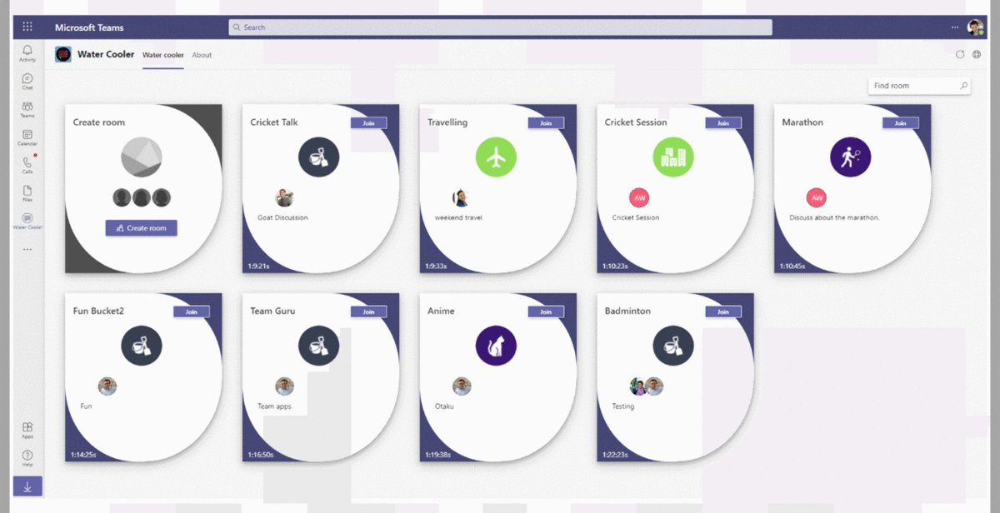
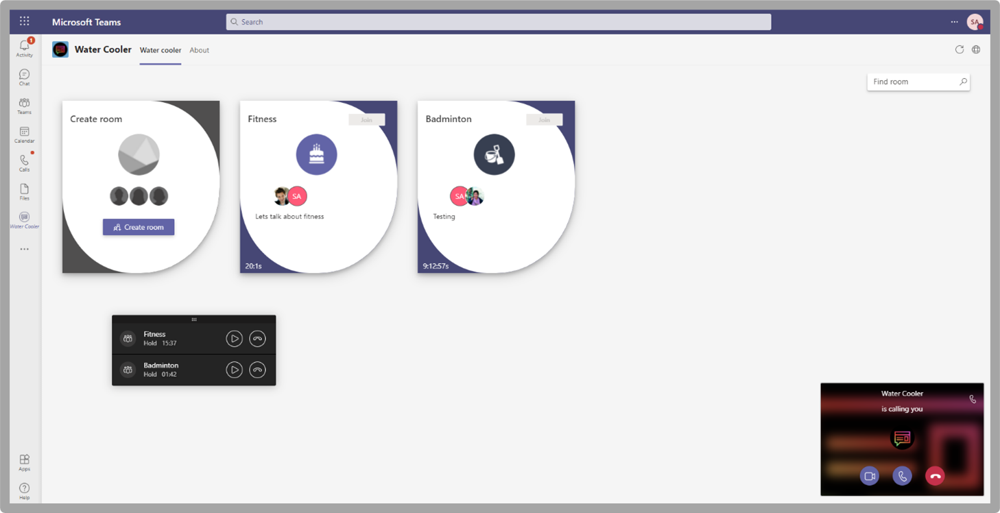
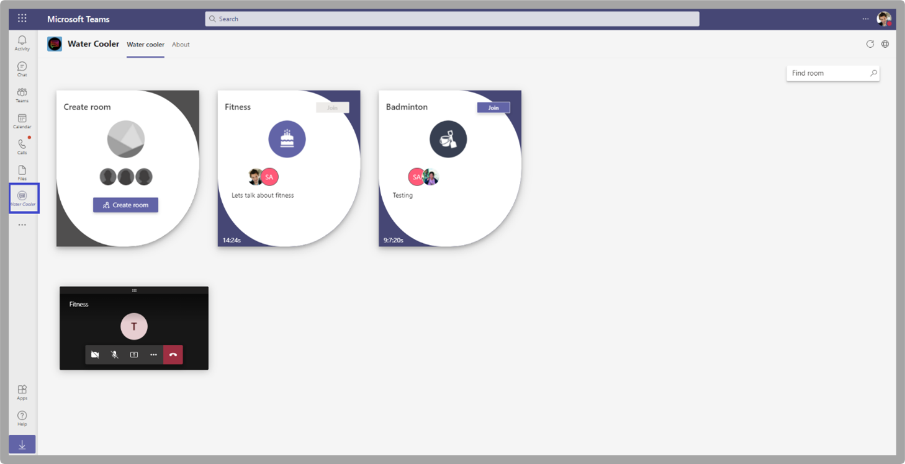

# Microsoft Teams 的应用模板

应用程序模板是开放源代码且Microsoft Teams应用程序的完整应用程序示例GitHub。 每个应用模板都包含有关为组织部署和安装该应用的详细说明。 它还提供了一个示例应用，你可以立即安装和开始使用该应用。 完整的源代码也可用，它允许您详细浏览它或分叉代码，并更改它以满足您的特定要求。
所有应用模板都根据 MIT 许可 [条款](https://github.com/OfficeDev/microsoft-teams-apps-eprescription/blob/master/LICENSE) 提供。

> [!NOTE] 
> 你必须许可和支持使用用户和组织的应用模板创建的应用。

**&#9734;指示新发布的应用模板。**

### 主要优势

* **直接部署到云：** 所有应用模板均包括部署脚本，通过这些脚本，可以在 Microsoft Azure Power Platform 中托管所有必需服务。 
* **建议的示例代码：** 应用模板遵循有关安全性和基础结构的建议最佳做法。 审查所有社区提交的对应用模板的更改以确保一致性。
* **可自定义和可扩展：** 虽然所有应用模板都使用最少的配置进行部署，但会提供整个代码库和部署脚本，以便你可以轻松自定义或扩展它们以满足你的独特需求。
* **详细文档：** 所有应用模板都附带了有关解决方案体系结构、部署和配置步骤的端到端文档。  

## 采用自动程序 

采用机器人是使用 Power Virtual Agent 为 PVA 构建的用户Teams聊天机器人。 它被视为 FAQ Plus 的 PVA 版本。 采用自动程序解答了 100 多个有关Microsoft 365和Teams。 可以编辑现有主题、添加自己的主题以及加入现有常见问题解答。 如果用户需要其他帮助，采用机器人可以将其与专家联系，甚至可以扩展为使用高级流连接器打开服务票证。 此自动程序是自安装或内置于自定义应用，例如采用 [中心](https://github.com/akporzondek/adoption_hub)。

[获取GitHub](https://github.com/OfficeDev/microsoft-teams-apps-adopt-bot)

## 采用工具 - 冠军管理平台&#9734;

CMP (平台) 模板可帮助你管理、扩展和激发团队合作冠军取得更多成就。 此应用程序模板构建于团队SharePoint 框架并加载到团队中的选项卡中。 组可以利用此工具帮助管理计划成员身份、提供用于日志记录的排行榜和事件类型，以及用于向计划参与者覆盖数字锁屏提醒的工具。

[获取GitHub](https://github.com/OfficeDev/microsoft-teams-apps-champion-management)

## 采用工具- Microsoft 365 Learning路径 (入门) &#9734;

通过入门应用模板，你可以将学习路径Microsoft 365到 Microsoft Teams。 此应用程序模板允许你轻松访问特定培训页面或其他 Intranet 资产，并直接在 Teams。 还可以更改应用名称或徽标，以匹配你的公司品牌。

[获取GitHub](https://github.com/msft-teams/tools/tree/master/M365%20Learning%20Pathways)

## 约会管理器 

约会管理器是一Teams模板，可帮助企业通过约会模板创建、管理和与消费者进行Teams。 来自客户的新约会请求显示在Teams频道中，可快速分配这些请求并将其重新分配到团队中的员工。 通过自定义选项卡在团队或个人级别查看约会请求。 每个约会都与一Teams在线会议相关联，因此员工和使用者可以在计划的时间轻松加入会议。

该应用模板与 Microsoft Bookings 集成，便于进行约会管理。 安排的约会会自动显示在已分配员工成员的日历上，并且消费者通过嵌入的会议链接接收可自定义的电子邮件通知和提醒。

[获取GitHub](https://github.com/OfficeDev/microsoft-teams-apps-appointment-manager)

 

## 询问离开

"[离开Microsoft Teams是](../bots/what-are-bots.md)一种自动程序，它使用户能够执行问答，称为&问答Teams。 使用"&询问离开"自动程序，团队成员可以提交和投票支持同事共享的问题，从而允许问答主机轻松地在频道或聊天中收集首要问题。 机器人用于在会议&实时问答Teams，并允许与会者通过聊天实时提交问题。

[获取GitHub](https://github.com/OfficeDev/microsoft-teams-apps-askaway)

:::row:::
  :::column span="2":::
      
:::column-end:::
:::row-end:::

## 员工见解

关联Insights是一[Power Apps](/powerapps/maker/canvas-apps/embed-teams-app)模板，它使一线员工可以直接捕获和提交客户的意见、情绪和感知。 一线员工通常是第一个在一对一联系点与客户互动的公司代表。 收集的数据由业务团队共享和协同使用，例如通过"Power BI Teams"选项卡，以改进产品并增强客户体验。

[获取GitHub](https://github.com/OfficeDev/microsoft-teams-apps-associateinsights)

:::row:::
  :::column span="2":::
      
:::column-end:::
:::row-end:::
:::row:::
:::column span="2":::
    
:::column-end:::
:::row-end:::

## 考勤

"考[勤"应用](/powerapps/maker/canvas-apps/embed-teams-app)Power Apps固定在团队中的"参加"选项卡。 它旨在记录设置（如学习和培训环境）中的状态。 用户可以标记或编辑过去最多 30 天的出席时间，并查看整个组或单个与会者的汇总出席报告。 有关团队出席情况详细信息，请参阅在 GitHub[上获取](https://github.com/OfficeDev/microsoft-teams-apps-attendance)。

下图显示了参加应用演示：  

## 预订聊天室

会议室预订是一Microsoft Teams自动程序，它允许用户从当前时间开始快速查找和预留会议室 30、60 或 90 分钟。 默认时间为 30 分钟。 Book-a-room bot 作用域为个人对话或 1：1 对话。 有关"预订-会议室"应用详细信息，请参阅在[GitHub 上获取](https://github.com/OfficeDev/microsoft-teams-apps-bookaroom)它。  
下图显示了 Book-a-room 演示：

## Building Access

Building Access 是一款基于 Microsoft [Power Platform](https://powerapps.microsoft.com/blog/now-in-preview-customize-teams-with-built-in-power-platform-capabilities/) 的应用，它支持通过允许设施控制器管理、跟踪和报告员工现场状态来管理建筑物阈值和社会实例规范。 使用 Microsoft [Power Apps](/powerapps/powerapps-overview)和[Power Automate](/power-automate/getting-started)构建的应用与 Microsoft Teams 深度集成，使组织可以确定构建就绪情况、建立现场访问的资格标准，并收集用于将来规划的见解。

[获取GitHub](https://github.com/OfficeDev/microsoft-teams-apps-buildingaccess)

:::row:::
   :::column span="":::
     
   :::column-end:::
   :::column span="":::
      
   :::column-end:::
:::row-end:::

## Celebrations

庆祝是一Teams，可帮助团队成员庆祝彼此的生日、纪念日和其他定期事件。 它记住所有团队成员的特殊场合，并发送在事件创建时选定的所有团队中的友好消息，使团队成员在一天中感觉特别。

该应用提供了一个简单的界面，供所有团队成员个人添加和查看其事件，还允许用户选择共享事件的团队。

[获取GitHub](https://github.com/OfficeDev/microsoft-teams-celebrations-app)

## 检查表

清单是一Microsoft Teams扩展应用的自定义清单，它使您能够通过创建聊天或频道中的共享清单与团队协作。 该应用在所有 Teams客户端（如桌面浏览器、iOS 和 Android）中均受支持。 应用已准备就绪，可以部署为订阅Microsoft 365一部分。  

[获取GitHub](https://github.com/OfficeDev/microsoft-teams-checklist-app)

:::row:::
:::column span="2":::
      
:::column-end:::
:::row-end:::

## 课堂放置 

Classroom Drop-in 是一款基于 Microsoft [Power Platform](https://powerapps.microsoft.com/blog/now-in-preview-customize-teams-with-built-in-power-platform-capabilities/)的应用，它使系统领导能够根据需要查找课堂团队、虚拟教室以及将自己或其他人员添加到这些课堂团队中。 使用 Microsoft [Power Apps](/powerapps/powerapps-overview)和[Power Automate](/power-automate/getting-started)构建的应用与 Microsoft Teams 深度集成，以确保教育机构可以针对每个业务要求向相关利益干系人提供访问权限，从而优化他们在混合学习环境中的操作。

[获取GitHub](https://github.com/OfficeDev/microsoft-teams-apps-classroom-dropin)

## Company Communicator

公司Communicator应用使企业团队可以创建和发送供多个团队或大量员工使用的消息，通过聊天允许组织在员工协作的地方与员工联系。 此模板可用于多个方案，例如新计划公告、员工入职培训、新式学习、开发或组织范围的广播。

该应用为指定用户提供了一个简单的界面，用于创建、预览、协作和发送邮件。

它为构建自定义目标通信功能（如有关确认或与邮件交互的用户数的自定义遥测）提供了基础。

[获取GitHub](https://github.com/OfficeDev/microsoft-teams-company-communicator-app)

## 联系人组查找

联系人组查找应用程序提供了一种方便且有用的方法，用于创建、访问和管理您组织的联系人组（以前称为通讯组列表或通信组）。 用户可以快速查看和与团队成员聊天、查看成员状态，以及创建与联系人组中选定成员的群聊，所有这些都在 Teams 环境中。

[获取GitHub](https://github.com/OfficeDev/microsoft-teams-app-contactgrouplookup)

:::row:::
:::column span="2":::
      
:::column-end:::
:::row-end:::
:::row:::
:::column span="2":::
    
:::column-end:::
:::row-end:::

## 同事的感谢 

通过使用工作环境中的同事Microsoft Teams模板，用户可以在工作环境中识别Teams的成就。 当同事选择奖励同事时，将在频道对话中标记收件人和其他团队成员，并接收有关该频道的奖励详细信息的通知。 这些奖励记录在Teams应用中，安全、便携且易于共享。 这被视为基于 PowerApps 的开放锁屏提醒应用模板版本，具有排行榜。

[获取GitHub](https://github.com/OfficeDev/microsoft-teams-apps-coworker-appreciation)

## CrowdSourcer

众源是一[Microsoft Teams](../bots/what-are-bots.md)自动程序，它提供团队查询信息，这些信息以协作方式从组成员获取。 它有助于回答常见问题，同时使参与者能够积极参与并参与一个有趣而有用的信息资源。

[在 Github 上获取](https://github.com/OfficeDev/microsoft-teams-crowdsourcer-app)

## 自定义贴纸

自我表达是健康团队文化的核心。 此应用模板是[一个消息](~/messaging-extensions/what-are-messaging-extensions.md)扩展，使你的用户能够在应用中使用自定义贴纸Microsoft Teams。 此模板提供了一种基于 Web 的轻松配置体验，具有配置访问权限的任何人都可以上传希望用户拥有的 GIF、贴纸和图像，从而允许整个团队使用你选择的任何一组贴纸。

此应用还支持跨团队轻松共享图像、GIF、贴纸，而无需访问 SharePoint 网站或单个通道作为存储和共享机制。 例如，产品团队可以通过编程方式轻松地将产品图像和 GIF 共享到社交媒体、市场营销和销售团队。 还可以在提供新映像和 GIF 时，通过向特定团队或个人触发通知流来扩展此应用。

[获取GitHub](https://github.com/OfficeDev/microsoft-teams-stickers-app)

## 员工想法

员工创意应用是基于 Azure 的"创意型创意"应用模板的 PowerApps 版本。 该应用使Teams用户能够设置和配置创意活动。 想法活动是围绕常见主题对想法进行分组的类别。

Teams用户还可以执行以下活动：

* 配置员工必须为每个想法提交的标准提交表单。 
* 查看和管理活动的想法和列表。
* 修改和删除市场活动。
* 查看想法的排行榜。
* 投票支持并共享优先想法。
* 提交活动想法。
* 查看其他团队成员的想法。
* 对最喜欢的想法投票。
* 查看他们与市场活动中其他人相比想法的性能。

[获取GitHub](https://github.com/OfficeDev/microsoft-teams-apps-employeeideas)

 

## E-Prescriptions 

E-Patients 是[Power Apps](/powerapps/maker/canvas-apps/embed-teams-app)一款基于应用的应用，它通过自动执行向患者发布电子医疗方案的过程来增强远程医疗与虚拟医疗。 医疗专业人员可以直接在安全中心平台中查看约会、生成电子Teams附件的电子邮件。

[获取GitHub](https://github.com/OfficeDev/microsoft-teams-apps-eprescription) 

:::row:::
:::column span="2":::
      
:::column-end:::
:::row-end:::
:::row:::
:::column span="2":::
    
:::column-end:::
:::row-end:::

## 员工培训 

员工培训是一Microsoft Teams，使组织者可以轻松发布、跟踪和提升组织的学习与培训计划。  借助该应用，事件规划人员可以将提醒和通知发送给事件注册人，员工可以指示对即将发生事件的关注，及时了解当前事件，并通过 Teams 消息扩展与同事共享事件详细信息。

[获取GitHub](https://github.com/OfficeDev/microsoft-teams-apps-employeetraining)

:::row:::
:::column span="2":::
    **查看员工培训计划**   
:::column-end:::
:::row-end:::
:::row:::
:::column span="2":::
    **创建员工培训计划** 
:::column-end:::
:::row-end:::

## 专家查找器

专家查找器是[一Microsoft Teams](../bots/what-are-bots.md)自动程序，可基于特定组织成员的技能、兴趣和教育属性标识这些成员。 成员在组织中查找与用户配置文件的关键字搜索Azure Active Directory专家。

[获取GitHub](https://github.com/OfficeDev/microsoft-teams-apps-expertfinder)

## 常见问题 +

对话&聊天机器人是为用户提供常见问题解答的一种简单方法。 但是，大多数机器人无法以有意义的方式与用户互动，因为当机器人出现故障时，循环中没有任何人。 常见问题自动程序是一&的问答，当机器人无法提供帮助时，它会在循环中引入用户。 用户可以向机器人提问，如果问题包含在知识库中，机器人会以答案进行响应。 如果没有，机器人允许用户提交查询，该查询随后会发布给预配置的专家团队，这些专家通过处理来自团队本身的通知来帮助提供支持。

> [!NOTE]
> 最新版 **FAQ Plus** 支持改进&问答解决方案，使专家团队能够完成以下任务：
>
> &#x2714;使用消息&将新的问答直接添加到知识库。
>
> &#x2714;编辑和删除&自动程序添加的问答。
>
> &#x2714;跟踪问答的&历史记录。
>
> &#x2714;配置包含其他详细信息的答案，以显示为自适应 [卡片](../task-modules-and-cards/cards/cards-reference.md#adaptive-card)。
>
[获取GitHub](https://github.com/OfficeDev/microsoft-teams-apps-faqplusv2)

## 获取支持应用

"获取支持"应用由使用 Microsoft Teams 的组织使用，以允许任何一组用户向主管请求帮助。 此应用程序包括以下功能：
* 从 Power App 请求不同类别的帮助。
* 发送给请求者的通知，告知他们分配了哪些人。
* 发送给指定监督员的通知，告知他们谁需要协助。 
* 分析 SharePoint 和 Power BI 中的升级和Power BI。

[获取GitHub](https://github.com/OfficeDev/microsoft-teams-app-get-support/)

## 目标跟踪器

目标跟踪器应用是一个全面的解决方案，可支持组织建立目标、观察进度和确认Microsoft Teams。 该应用使用户能够在专业、个人和团队级别设置、跟踪和更新目标。 团队成员还收到及时的提醒和状态更新，保持专注并保持跟踪状态。

[获取GitHub](https://github.com/OfficeDev/microsoft-teams-app-goaltracker)

:::row:::
  :::column span="2":::
      
:::column-end:::
:::row-end:::
:::row:::
:::column span="2":::
    
:::column-end:::
:::row-end:::

## 出色的创意

出色的创意应用支持并增强组织内部的创造力和创造力。 利用该应用，你的员工可以与同事和领导分享想法、发现新提交、聚焦贡献以用于对等考虑，并投票选择 Microsoft Teams 中的最佳建议。

[获取GitHub](https://github.com/OfficeDev/microsoft-teams-apps-greatideas)

:::row:::
  :::column span="2":::
      
:::column-end:::
:::row-end:::
:::row:::
:::column span="2":::
    
:::column-end:::
:::row-end:::

## 组活动

组活动是一Microsoft Teams应用程序，使团队所有者可以轻松快速创建活动组，并在其上下文中管理Microsoft Teams。 活动作者可以创建活动、在组中随机分配团队成员，并可以选择让机器人发送提醒，直到活动完成。

[获取GitHub](https://github.com/OfficeDev/microsoft-teams-apps-groupactivities)

:::row:::
  :::column span="2":::
      
:::column-end:::
:::row-end:::
:::row:::
:::column span="2":::
    
:::column-end:::
:::row-end:::

## 组连接 &#9734;

组连接是一Microsoft Teams应用程序，可帮助组织成员发现员工组并查找与员工组有关的信息。 该应用内置有丰富的功能，组织领导可以与员工就组、事件和资源进行沟通。 组连接应用还按所需频率相互匹配，以鼓励在组内建立网络和建立关系。 若要详细了解如何利用组和 连接 应用来帮助员工组在组织内部培养，请参阅 GitHub。

[获取GitHub](https://github.com/OfficeDev/microsoft-teams-apps-groupconnect)

## 提高技能

"发展你的技能"应用通过允许员工在同时学习新技能的同时为组织提供补充项目，从而支持专业增长和开发。 员工可以使用该应用找到满足其兴趣的机会，与同行进行有意义的协作，并获得新的专业技能Teams级别。

[获取GitHub](https://github.com/OfficeDev/microsoft-teams-apps-growyourskills)

:::row:::
  :::column span="2":::
      
:::column-end:::
:::row-end:::
:::row:::
:::column span="2":::
    
:::column-end:::
:::row-end:::

## HR 支持

HR 支持机器人是一个友好的&聊天机器人，当无法提供帮助时，它会在循环中引入 HR 团队的支持专业人员或专家。 用户可以向机器人提问，如果问题包含在知识库中，机器人会以答案进行响应。 如果没有，机器人允许用户提交查询，该查询随后将在预配置的专家团队中发布，这些专家通过处理来自团队本身的通知提供帮助。 此外，机器人通过搜索问题中的预配置标记，提供指向建议的 HR 策略或问题的链接。 这些磁贴在关联的选项卡中作为快速参考找到。 HR 支持适用于轻型问答&在组织中启动新项目或计划时提供快速支持。

[获取GitHub](https://github.com/OfficeDev/microsoft-teams-hrsupport-app)

## Icebreaker

Icebreaker是一[Microsoft Teams](../bots/what-are-bots.md)聊天机器人，通过每周配对两个随机团队成员来开会来帮助你的团队建立关系。 自动程序通过自动建议适用于这两个成员的空闲时间来轻松安排日程。 通过此应用加强个人连接并构建紧密社区。

除了鼓励整个团队中的个人连接之外，Icebreaker应用还有助于在组织中促进基于兴趣的社区。 例如，你可以将该应用用于一个DevOps组，以帮助在组织中自然地传播想法和最佳做法。

[获取GitHub](https://github.com/OfficeDev/microsoft-teams-icebreaker-app)

## 奖励

奖励是一[Power Apps](/powerapps/maker/canvas-apps/embed-teams-app)模板，用于管理和跟踪已激活的员工参与指定活动，如培训和变更管理计划。 管理员使用该应用建立指定活动、分配完成分数，并指定奖励所需的资格点级别。 员工使用应用查看累积的积分，在达到资格后，请求和申请可兑换奖励。

[获取GitHub](https://github.com/OfficeDev/microsoft-teams-apps-incentives)

## 事件报告者

事件报告[Microsoft Teams](../bots/what-are-bots.md)自动程序，可优化对组织中事件的管理。 自动程序可促进自动事件数据收集、自定义事件报告、相关利益干系人通知和端到端事件跟踪。

[获取GitHub](https://github.com/OfficeDev/microsoft-teams-apps-incidentreport)

:::row:::
  :::column span="2":::
      
:::column-end:::
:::row-end:::
:::row:::
:::column span="2":::
    
:::column-end:::
:::row-end:::

## 检查 

 检查是一Microsoft Teams应用程序，使前端工作人员可以检查从位置到资产和设备之间的任何内容。 例如，零售商店、制造工厂或车辆和计算机。 此解决方案中具有两个应用，每个应用都适用于不同类型的用户。

该应用使第一线工作人员能够检查资产或区域，管理产品和服务的质量，或维护工作场所的安全性。 它便于工作组成员之间的通信，以解决在检查过程中发现的问题。 该应用为经理提供了简单的报告，以加快问题解决并突出显示趋势。

[获取GitHub](https://github.com/OfficeDev/microsoft-teams-apps-inspection)

   

## 问题报告

问题报告应用程序使员工和经理能够提出和管理问题。 它包含两个应用：用于报告问题的"问题报告"应用和用于管理问题的"管理问题"应用。

团队经理使用"管理问题"应用配置应用体验，包括Microsoft Teams创建邮件和 Planner 任务的频道。 管理员还使用该应用创建模板表单，以在用户报告问题时收集详细信息。 例如，查看、编辑或删除问题模板表单。 该应用还用于查看团队问题、报告问题历史记录并高效管理问题解决。

员工使用问题报告应用记录解决问题所需的问题和详细信息。 该应用还用于修改和解决现有问题，并获取个人或团队问题的高级别视图。

[获取GitHub](https://github.com/OfficeDev/microsoft-teams-apps-issuereporting)

  

## 新员工入职培训 

新员工入职培训是Microsoft Teams SharePoint新员工入职培训解决方案，使组织能够在新员工旅程中为员工提供一致、高质量的入职体验。 人力资源团队和招聘经理使用该应用在整个定向和入职培训过程中提供相关信息，由新员工用来共享反馈、提供简介和完成载入任务。

[获取GitHub](https://github.com/OfficeDev/microsoft-teams-apps-newemployeeonboarding)

:::row:::
  :::column span="2":::
    **新员工欢迎卡片** 
:::column-end:::
:::row-end:::
:::row:::
:::column span="2":::
    **新员工清单**   
:::column-end:::
:::row-end:::

## 打开锁屏提醒

开放锁屏提醒是Microsoft Teams一款应用，使个人能够在企业上下文中获得数字学习Teams徽章，并可在任何位置共享。 使用来自第三方数字锁屏提醒颁发机构 [Badgr](https://badgr.org/)的功能，已授予徽章记录在收件人的 Badgr 配置文件中，可用于生成和共享生命周期学习旅程的丰富图片。

[获取GitHub](https://github.com/OfficeDev/microsoft-teams-apps-openbadges)

:::row:::
  :::column span="2":::
      
:::column-end:::
:::row-end:::
:::row:::
:::column span="2":::
    
:::column-end:::
:::row-end:::

## 投票 

投票是一Microsoft Teams消息扩展应用，它使您能够在聊天或频道中快速创建和发送投票，以收集团队的意见和偏好。 该应用在所有 Teams 平台客户端（如桌面、浏览器、iOS 和 Android）中均受支持，并且已准备好部署为 Microsoft 365 订阅的一部分。

[获取GitHub](https://github.com/OfficeDev/microsoft-teams-poll-app)

:::row:::
  :::column span="1":::
      
:::column-end:::
:::row-end:::

## 快速响应

快速响应是一Microsoft Teams应用程序，可提供一个可靠解决方案，有效回答用户的常见问题常见问题。 应用通过消息传递扩展构建交互式用户体验响应库，而不是手动且连续地Teams[信息](../messaging-extensions/what-are-messaging-extensions.md)。

[获取GitHub](https://github.com/OfficeDev/microsoft-teams-apps-quickresponses)

## 测验&#9734;

测验是一[个Teams](../messaging-extensions/what-are-messaging-extensions.md)扩展应用，可用于在聊天或频道内创建测验，用于进行知识检查和即时结果。 可以使用测验、课堂和离线考试、团队内的知识检查，以及团队中的有趣测验。 测验应用支持跨多个平台，Teams、浏览器、iOS 和 Android 客户端。 此应用已准备好作为现有订阅的一Microsoft 365部署。

[获取GitHub](https://github.com/OfficeDev/microsoft-teams-apps-quiz)

:::row:::
  :::column span="1":::
      
:::column-end:::
:::row-end:::

## 快速协助

快速协助是一款基于 Microsoft [Power Platform](https://powerapps.microsoft.com/blog/now-in-preview-customize-teams-with-built-in-power-platform-capabilities/) 的应用，面向客户的关联人员可以快速与专家联系，以快速获得答案、搜索信息、跟进打开的请求，并允许专家接收通知以快速接听电话以帮助回答问题。 使用 Microsoft [Power Apps](/powerapps/powerapps-overview)和[Power Automate](/power-automate/getting-started)构建的应用与 Microsoft Teams 深度集成，使组织能够轻松地将一线员工与公司代表联系，从而解决客户查询并提供出色的客户体验。 

[获取GitHub](https://github.com/OfficeDev/microsoft-teams-apps-rapid-assist)

:::row:::
   :::column span="":::
     
   :::column-end:::
   :::column span="":::
      
   :::column-end:::
:::row-end:::

## 反射 

"反映"是Microsoft Teams应用，它可为团队成员提供安全且包含的资源，以与同事或组领导直接在 Teams 中共享其情绪Teams。 该应用在频道、组、会议以及一对一聊天中可用，并且签入响应设置为公共、私人到发件人或完全匿名。

[获取GitHub](https://github.com/OfficeDev/Microsoft-Teams-App-Reflect)

:::row:::
    :::column:::
    **健康投票**
    
    
    :::column-end:::
:::row-end:::

## 远程支持

远程[支持是Microsoft Teams](../bots/what-are-bots.md)自动程序，可为整个组织的支持请求者和内部支持团队提供一个集中的界面。  最终用户可以提交、编辑或撤消支持请求，支持团队可以在所有支持平台内响应、管理和Teams请求。

[获取GitHub](https://github.com/OfficeDev/microsoft-teams-apps-remotesupport)

:::row:::
  :::column span="2":::
      
:::column-end:::
:::row-end:::
:::row:::
:::column span="2":::
    
:::column-end:::
:::row-end:::

## 请求团队

请求团队是一个Microsoft Teams应用程序，可优化企业组织的新团队创建。 应用通过集成向导引导的请求表单、嵌入式审批流程、请求状态仪表板和自动化团队生成来创建新团队实例时，支持标准化和最佳做法。

[获取GitHub](https://github.com/OfficeDev/microsoft-teams-apps-requestateam)

:::row:::
  :::column span="2":::
    
:::column-end:::
:::row-end:::
:::row:::
:::column span="2":::
    
:::column-end:::
:::row-end:::

## 适用于频道的 Scrums

适用于频道的 Scrums 是一个 scrum 助手应用，使用户能够在 Microsoft Teams 内的频道中安排和运行 scrum。 该应用非常适用于由来自不同地理位置和时区的成员组成的远程团队和团队，以共享每日更新并确保参与大量独立会议。

[获取GitHub](https://github.com/OfficeDev/microsoft-teams-apps-scrumsforchannels)

> [!NOTE]
> 若要在群聊中召开 scrum 会议，请参阅 [Scrums for Group Chat](#scrums-for-group-chat) 应用模板。

:::row:::
  :::column span="2":::
    
:::column-end:::
:::row-end:::
:::row:::
:::column span="2":::
    
:::column-end:::
:::row-end:::

## 用于群聊的 Scrums

> [!NOTE]
> Scrums 状态应用模板已更新，现为用于群聊的 Scrums。

适用于群聊的 Scrums 是一种支持性的 scrum 助手，允许群聊成员运行异步独立会议并轻松共享其每日更新。 它允许群聊的所有成员参与 scrum，并查看运行中的 scrum 中其他人的更新。

[获取GitHub](https://github.com/OfficeDev/microsoft-teams-apps-scrumsforgroupchat)

## 现在共享 

"现在共享"应用使用户能够轻松地在工作环境中共享内容，从而推动同事之间的Teams交换。 用户通过应用与团队成员共享感兴趣的项目、发现新的共享内容、设置首选项和书签收藏夹以便稍后阅读。

[获取GitHub](https://github.com/OfficeDev/microsoft-teams-apps-sharenow)

## SharePoint 列表搜索

协作Microsoft Teams通常引用列表项中包含的SharePoint信息。 粘贴相关项目的链接会强制每个人从对话切换上下文，查找所需信息，然后返回到Teams继续对话。 随着对话的继续，用户必须多次切换回引用项目，以验证新注释并刷新其对项目中包含的信息的了解。 此上下文切换为顺利协作创建了障碍。
若要解决此问题，使用了"列表搜索"应用模板。 许多用户使用 SharePoint为组织中某些核心工作流提供电源。 但是，很难围绕列表进行协作。 通过使用 Microsoft Teams 中的"列表搜索"应用模板，用户可以直接在聊天对话中插入 SharePoint 列表项的信息，以缓解仅将链接插入聊天时导致的上下文切换。 信息作为易于阅读的自动格式化卡片插入，帮助用户继续参与对话。

[获取GitHub](https://github.com/OfficeDev/microsoft-teams-list-search-app)

## 员工签入

员工签入是一种[基于Power Apps](/powerapps/powerapps-overview)应用程序，支持你的业务和现场人员之间的监督通信。 员工可以直接在计划或临时的基础上直接从任务中提供时间关键Teams。 应用支持实时位置、照片、笔记、提醒通知和自动工作流。

[获取GitHub](https://github.com/OfficeDev/microsoft-teams-apps-staffcheckins)

## 调查

调查是一Microsoft Teams消息扩展应用，它使您能够在聊天或频道中创建调查以收集数据并获取可操作见解。 该应用在所有 Teams 平台客户端（如桌面、浏览器、iOS 和 Android）中均受支持，并且已准备好部署为 Microsoft 365 订阅的一部分。  

[获取GitHub](https://github.com/OfficeDev/Microsoft-Teams-Survey-app)

:::row:::
  :::column span="2":::
    
:::column-end:::
:::row-end:::

## Time Tally 

一个项目可以包含多个任务，并且可以将各种项目分配给员工。 经理必须了解在员工执行这些任务所花的时间内的项目进度。 这会是一项很麻烦的活动，因为员工需要填写时间表。 利用时间表应用程序，员工能够使用移动设备快速填写其时间表，经理也不需要跟进员工的时间表条目。 经理可以基于资源查看项目利用率，并可以批准或拒绝这些条目。 发送提醒通知以确保时间表合规性。 此外，历史数据和使用情况可用于分析。

[获取GitHub](https://github.com/OfficeDev/microsoft-teams-apps-timetally)

## 培训&#9734;

培训是自定义[Teams](../messaging-extensions/what-are-messaging-extensions.md)扩展应用，允许用户在聊天或频道中发布培训，以便进行脱机知识共享和学习。 该应用支持跨多个 Teams 平台客户端，如桌面、浏览器、iOS 和 Android。 此应用已准备好作为你的订阅的一Microsoft 365部署。

[获取GitHub](https://github.com/OfficeDev/microsoft-teams-apps-training)

:::row:::
  :::column span="1":::
      
:::column-end:::
:::row-end:::

## 虚拟舍入

医院和紧急会议室提供商每天 **进行许多** 轮次。 这些患者快速签入旨在提供对患者情况的状态检查，并确保解决患者的问题。 尽管舍入是确保由多种类型的提供商监控患者的基本做法，但是它们表示 PPE 会消耗大量资源，因为每次访问时，每个提供商会使用一个新的掩码和一组新的面罩。 使用此应用模板，医疗工作者可以通过提供商和患者之间的Microsoft Teams轻松进行轮次。

虚拟舍入解决方案还被《Microsoft Health和科学》[博客文章引用](https://aka.ms/teamsvirtualrounding)。

[获取GitHub](https://github.com/SmartterHealth/Virtual-Rounding)

## 访问者管理

利用访问者管理应用，组织和员工可以直接从网站管理中心轻松高效地管理Microsoft Teams。 利用该应用，员工可以创建访问者请求、通过访问者仪表板集中跟踪请求状态，以及当访问者到达时接收实时通知。

[获取GitHub](https://github.com/OfficeDev/microsoft-teams-app-visitormanagement)

:::row:::
  :::column span="2":::
    
:::column-end:::
:::row-end:::
:::row:::
:::column span="2":::
    
:::column-end:::
:::row-end:::

## 水&#9734;

Water Water 是一Teams应用，使公司团队可以创建、邀请和加入团队成员之间的随意对话，例如由"水球"或聊天室进行的对话。 可针对多个方案使用此模板，例如新的非项目相关公告、感兴趣的主题、当前事件或有关爱好的对话。 该应用为任何人提供了查找现有对话或启动新对话的简便界面。 它是构建自定义目标通信功能的基础，可促进在中断期间可能没有社交机会的同事之间的交互。    

[获取GitHub](https://github.com/microsoft/csapps-msteams-watercooler)     

    

### 关键功能

**水都主页**：可以浏览团队成员正在与特定人员或感兴趣的主题进行现有对话的现有聊天室。 主页上的活动 **对话** 显示会议室名称、简短描述、呼叫持续时间和会议室图像。 

**加入聊天室**：使用 **"加入会议室** "功能立即加入正在进行的对话。 选择 **"从** 活动对话加入"以加入聊天室。

**聊天室创建**：使用 **聊天室创建** 功能创建Teams所有与会者交互的通话或聊天。 通过指定会议室名称、简短说明、最多五个同事作为初始组以及从提供的一组会议室图像中选择，轻松创建聊天室。 

**查找会议室**：使用 **"查找会议室** "功能搜索与持续对话的主题或简短说明匹配的关键字。

**与会者邀请**：创建聊天室 **后，** 使用与会者邀请功能邀请其他用户。 这类似于Teams调用。

**应用锁** 屏提醒：左侧菜单上的 **"水** 绿色"图标显示锁屏提醒，其中显示使用任意应用时Teams活动对话的数量。 

## Workplace Awards

Workplace Workplace Workplace 是一Teams一款应用模板，提供一个积极框架，促进员工在现代工作场所中的认知和培养文化。 该应用使你能够设置和管理员工奖励和识别，称为 R&R 计划，员工可以在该计划中轻松指定和认可同事，R&R 领导者可以查看提交的候选人、授予奖励和宣布收件人。

[获取GitHub](https://github.com/OfficeDev/microsoft-teams-apps-workplaceawards)

:::row:::
  :::column span="2":::
    
:::column-end:::
:::row-end:::
:::row:::
:::column span="2":::
    
:::column-end:::
:::row-end:::

有关应用模板的信息，请参阅应用 [模板](https://forms.office.com/Pages/ResponsePage.aspx?id=v4j5cvGGr0GRqy180BHbR2_7qFm_lcZAr4eqEhnLsZ9UMVZGT1lCT0FXUDdZMUM0RkpBS1BESTAwWC4u)。

## 另请参阅

[集成 web 应用](~/samples/integrate-web-apps-overview.md)
