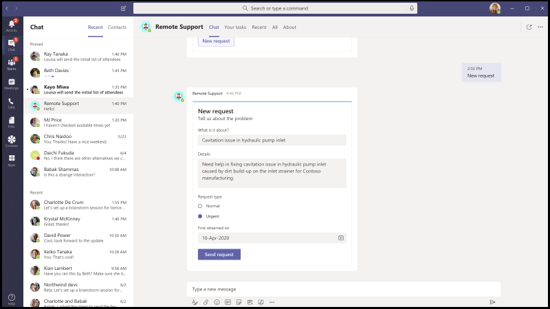

# Microsoft Teams 的应用模板App templates for Microsoft Teams

应用程序模板是开放源代码且Microsoft Teams应用程序的完整应用程序示例GitHub。App templates are examples of complete apps for Microsoft Teams that are open-source and available on GitHub. 每个应用模板都包含有关为组织部署和安装该应用的详细说明。Each app template contains detailed instructions for deploying and installing that app for your organization. 它还提供了一个示例应用，你可以立即安装和开始使用该应用。It also provides a sample app that you can install and start using immediately. 完整的源代码也可用，它允许您详细浏览它或分叉代码，并更改它以满足您的特定要求。The complete source code is also available, which allows you to explore it in detail or fork the code and alter it to meet your specific requirements.
所有应用模板都根据 MIT 许可 [条款](https://github.com/OfficeDev/microsoft-teams-apps-eprescription/blob/master/LICENSE) 提供。All app templates are provided under the [MIT License](https://github.com/OfficeDev/microsoft-teams-apps-eprescription/blob/master/LICENSE) terms.

> [!NOTE] 
> 你必须许可和支持使用用户和组织的应用模板创建的应用。You must license and support apps created from app templates for your users and organizations.

**&#9734;指示新发布的应用模板。****&#9734; Indicates newly released app templates.**

### 主要优势Key benefits

* **直接部署到云：** 所有应用模板均包括部署脚本，通过这些脚本，可以在 Microsoft Azure Power Platform 中托管所有必需服务。**Deploy directly to the cloud:** All app templates include deployment scripts that allows you to host all required services in Microsoft Azure or the Power Platform. 
* **建议的示例代码：** 应用模板遵循有关安全性和基础结构的建议最佳做法。**Recommended sample code:** The app templates conform to recommended best practices around security and infrastructure. 审查所有社区提交的对应用模板的更改以确保一致性。All community submitted changes to the app templates are reviewed to ensure conformance.
* **可自定义和可扩展：** 虽然所有应用模板都使用最少的配置进行部署，但会提供整个代码库和部署脚本，以便你可以轻松自定义或扩展它们以满足你的独特需求。**Customizable and extensible:** While all app templates are deployed with minimal configuration, the entire code base and deployment scripts are provided, so that you can easily customize or extend them to fit your unique needs.
* **详细文档：** 所有应用模板都附带了有关解决方案体系结构、部署和配置步骤的端到端文档。**Detailed documentation:** All app templates are accompanied by end-to-end documentation on solution architecture, deployment, and configuration steps.  

## 采用自动程序Adoption Bot 

采用机器人是使用 Power Virtual Agent 为 PVA 构建的用户Teams聊天机器人。Adoption Bot is a user care chat bot built with Power Virtual Agent for Teams PVA. 它被视为 FAQ Plus 的 PVA 版本。It is considered as the PVA version of FAQ Plus. 采用自动程序解答了 100 多个有关Microsoft 365和Teams。Adoption Bot answers 100+ common questions about Microsoft 365 and Teams. 可以编辑现有主题、添加自己的主题以及加入现有常见问题解答。You can edit the existing topics, add your own topics, and ingest existing FAQs. 如果用户需要其他帮助，采用机器人可以将其与专家联系，甚至可以扩展为使用高级流连接器打开服务票证。If users need additional help, Adoption Bot can connect them to experts or even be extended to open service tickets with premium flow connectors. 此自动程序是自安装或内置于自定义应用，例如采用 [中心](https://github.com/akporzondek/adoption_hub)。This bot is self-installed or built into a custom app, such as the [Adoption Hub](https://github.com/akporzondek/adoption_hub).

[获取GitHubGet it on GitHub](https://github.com/OfficeDev/microsoft-teams-apps-adopt-bot)

## 采用工具 - 冠军管理平台&#9734;Adoption Tool- Champion Management Platform &#9734;

CMP (平台) 模板可帮助你管理、扩展和激发团队合作冠军取得更多成就。The Champion Management Platform (CMP) app template helps you manage, scale, and inspire your teamwork champions to achieve more. 此应用程序模板构建于团队SharePoint 框架并加载到团队中的选项卡中。This app template is built on the SharePoint Framework and loaded into a tab within a team. 组可以利用此工具帮助管理计划成员身份、提供用于日志记录的排行榜和事件类型，以及用于向计划参与者覆盖数字锁屏提醒的工具。Groups can leverage this tool to help manage program membership, provide a leaderboard and event types for logging, and tools to overlay digital badges to program participants.

[获取GitHubGet it on GitHub](https://github.com/OfficeDev/microsoft-teams-apps-champion-management)

## 采用工具- Microsoft 365学习路径 (入门) &#9734;Adoption Tool- Microsoft 365 Learning Pathways (Get Started) &#9734;

通过入门应用模板，你可以将学习路径Microsoft 365到 Microsoft Teams。The Get Started app template allows you to bring the power of Microsoft 365 learning pathways inside of Microsoft Teams. 此应用程序模板允许你轻松访问特定培训页面或其他 Intranet 资产，并直接在 Teams。This app template allows you to grant easy access to specific training pages or other intranet assets and load the content directly within Teams. 还可以更改应用名称或徽标，以匹配你的公司品牌。You can also change the app name or logo to match your company branding.

[获取GitHubGet it on GitHub](https://github.com/msft-teams/tools/tree/master/M365%20Learning%20Pathways)

## 约会管理器Appointment Manager 

约会管理器是一Teams模板，可帮助企业通过约会模板创建、管理和与消费者进行Teams。Appointment Manager is a Teams app template to help businesses create, manage, and conduct virtual appointments with consumers through Teams. 来自客户的新约会请求显示在Teams频道中，可快速分配这些请求并将其重新分配到团队中的员工。New appointment requests from consumers are visible in Teams channels, where they are quickly assigned and reassigned to staff in a team. 通过自定义选项卡在团队或个人级别查看约会请求。Appointment requests are viewed at team or personal levels through custom tabs. 每个约会都与一Teams在线会议相关联，因此员工和使用者可以在计划的时间轻松加入会议。Every appointment is associated with a Teams online meeting, hence the staff and consumers can easily join the meeting at the scheduled time.

该应用模板与 Microsoft Bookings 集成，便于进行约会管理。The app template integrates with Microsoft Bookings for easy appointment management. 安排的约会会自动显示在已分配员工成员的日历上，并且消费者通过嵌入的会议链接接收可自定义的电子邮件通知和提醒。Scheduled appointments automatically appear on assigned staff members' calendars, and consumers receive customizable email notifications and reminders with embedded meeting links.

[获取GitHubGet it on GitHub](https://github.com/OfficeDev/microsoft-teams-apps-appointment-manager)

 

## 询问离开Ask Away

"[离开Microsoft Teams是](../bots/what-are-bots.md)一种自动程序，它使用户能够执行问答，称为&问答Teams。Ask Away is a [Microsoft Teams bot](../bots/what-are-bots.md) that enables users to conduct Question and Answer, called Q&A sessions within Teams. 使用"&询问离开"自动程序，团队成员可以提交和投票支持同事共享的问题，从而允许问答主机轻松地在频道或聊天中收集首要问题。Using the Ask Away bot, team members can submit and up-vote questions shared by colleagues allowing Q&A hosts to easily gather top-of-mind questions within a channel or chat. 机器人用于在会议&实时问答Teams，并允许与会者通过聊天实时提交问题。The bot is used to conduct a real-time Q&A session in a Teams meeting and allows attendees to submit questions live through chat.

[获取GitHubGet it on GitHub](https://github.com/OfficeDev/microsoft-teams-apps-askaway)

:::row:::
  :::column span="2":::
      
:::column-end:::
:::row-end:::

## 员工见解Associate Insights

关联见解是一[Power Apps](/powerapps/maker/canvas-apps/embed-teams-app)模板，它使一线员工可以直接捕获和提交客户的意见、情绪和认知。Associate Insights is a [Power Apps](/powerapps/maker/canvas-apps/embed-teams-app) template that empowers firstline workers to directly capture and submit customer opinion, sentiment, and perception. 一线员工通常是第一个在一对一联系点与客户互动的公司代表。Firstline workers are often the first company representative to engage with customers in a one-to-one point-of contact. 收集的数据由业务团队共享和协同使用，例如通过"Power BI Teams"选项卡，以改进产品并增强客户体验。The collected data are shared and used collaboratively by business teams, such as through a Power BI Teams tab, for product improvement and enhancing the customer experience.

[获取GitHubGet it on GitHub](https://github.com/OfficeDev/microsoft-teams-apps-associateinsights)

:::row:::
  :::column span="2":::
      
:::column-end:::
:::row-end:::
:::row:::
:::column span="2":::
    
:::column-end:::
:::row-end:::

## 考勤Attendance

"考[勤"应用](/powerapps/maker/canvas-apps/embed-teams-app)Power Apps固定在团队中的"参加"选项卡。The Attendance app is a [Power Apps](/powerapps/maker/canvas-apps/embed-teams-app) tab that are pinned in a team. 它旨在记录设置（如学习和培训环境）中的状态。It is designed to record presence in settings, such as learning and training environments. 用户可以标记或编辑过去最多 30 天的出席时间，并查看整个组或单个与会者的汇总出席报告。Users can mark or edit attendance for up to 30 days in the past and view summarized attendance reports for an entire group or individual attendees. 有关团队出席情况详细信息，请参阅在 GitHub[上获取](https://github.com/OfficeDev/microsoft-teams-apps-attendance)。For more information on teams attendance, see [Get it on GitHub](https://github.com/OfficeDev/microsoft-teams-apps-attendance).

下图显示了参加应用演示：The following image displays the attendance app demo:  

## 预订聊天室Book-a-room

会议室预订是一Microsoft Teams自动程序，它允许用户从当前时间开始快速查找和预留会议室 30、60 或 90 分钟。Book-a-room is a [Microsoft Teams bot](../bots/what-are-bots.md) that allows users quickly to find and reserve a meeting room for 30, 60, or 90 minutes starting from the current time. 默认时间为 30 分钟。The default time is 30 minutes. Book-a-room bot 作用域为个人对话或 1：1 对话。The Book-a-room bot scopes to personal or 1:1 conversations. 有关"预订-会议室"应用详细信息，请参阅在[GitHub 上获取](https://github.com/OfficeDev/microsoft-teams-apps-bookaroom)它。For more information on Book-a-room app, see [Get it on GitHub](https://github.com/OfficeDev/microsoft-teams-apps-bookaroom).  
下图显示了 Book-a-room 演示：The following image displays the Book-a-room demo:

## Building AccessBuilding Access

Building Access 是一款基于 Microsoft [Power Platform](https://powerapps.microsoft.com/blog/now-in-preview-customize-teams-with-built-in-power-platform-capabilities/) 的应用，它支持通过允许设施控制器管理、跟踪和报告员工现场状态来管理建筑物阈值和社会实例规范。Building Access is a Microsoft [Power Platform](https://powerapps.microsoft.com/blog/now-in-preview-customize-teams-with-built-in-power-platform-capabilities/) based app that supports the administration of building occupancy thresholds and social distancing norms by enabling facilities directors to manage, track, and report employee on-site presence. 使用 Microsoft [Power Apps](/powerapps/powerapps-overview)和[Power Automate](/power-automate/getting-started)构建的应用与 Microsoft Teams 深度集成，使组织可以确定构建就绪情况、建立现场访问的资格标准，并收集用于将来规划的见解。The app, built using Microsoft [Power Apps](/powerapps/powerapps-overview), and [Power Automate](/power-automate/getting-started), deeply integrates with Microsoft Teams and enables organizations to determine building readiness, establish eligibility criteria for on-site access, and gather insights for future planning.

[获取GitHubGet it on GitHub](https://github.com/OfficeDev/microsoft-teams-apps-buildingaccess)

:::row:::
   :::column span="":::
     
   :::column-end:::
   :::column span="":::
      
   :::column-end:::
:::row-end:::

## CelebrationsCelebrations

庆祝是一Teams，可帮助团队成员庆祝彼此的生日、纪念日和其他定期事件。Celebrations is a Teams app that helps team members to celebrate each others' birthdays, anniversaries, and other recurring events. 它记住所有团队成员的特殊场合，并发送在事件创建时选定的所有团队中的友好消息，使团队成员在一天中感觉特别。It remembers special occasions of all the team members and sends a friendly message in all the teams selected at the time of event creation, to make the team members feel special on their day.

该应用提供了一个简单的界面，供所有团队成员个人添加和查看其事件，还允许用户选择共享事件的团队。The app provides an easy interface for all the team members to personally add and view their events and also allows the user to select the teams in which the events gets shared.

[获取GitHubGet it on GitHub](https://github.com/OfficeDev/microsoft-teams-celebrations-app)

## 检查表Checklist

清单是一Microsoft Teams扩展应用的自定义清单，它使您能够通过创建聊天或频道中的共享清单与团队协作。Checklist is a custom Microsoft Teams [messaging extension](../messaging-extensions/what-are-messaging-extensions.md) app that enables you to collaborate with your team by creating a shared checklist in a chat or channel. 该应用在所有 Teams客户端（如桌面浏览器、iOS 和 Android）中均受支持。The app is supported across all Teams platform clients, such as desktop browser, iOS, and Android. 应用已准备就绪，可以部署为订阅Microsoft 365一部分。The app is ready for deployment as part of your Microsoft 365 subscription.  

[获取GitHubGet it on GitHub](https://github.com/OfficeDev/microsoft-teams-checklist-app)

:::row:::
:::column span="2":::
      
:::column-end:::
:::row-end:::

## 课堂放置Classroom Drop-in 

Classroom Drop-in 是一款基于 Microsoft [Power Platform](https://powerapps.microsoft.com/blog/now-in-preview-customize-teams-with-built-in-power-platform-capabilities/)的应用，它使系统领导能够根据需要查找课堂团队、虚拟教室以及将自己或其他人员添加到这些课堂团队中。Classroom Drop-in is a Microsoft [Power Platform](https://powerapps.microsoft.com/blog/now-in-preview-customize-teams-with-built-in-power-platform-capabilities/)-based app that enables system leaders to find class teams, means virtual classrooms and add themselves or others to these class teams for a specified drop-in period, as needed. 使用 Microsoft [Power Apps](/powerapps/powerapps-overview)和[Power Automate](/power-automate/getting-started)构建的应用与 Microsoft Teams 深度集成，以确保教育机构可以针对每个业务要求向相关利益干系人提供访问权限，从而优化他们在混合学习环境中的操作。The app built using Microsoft [Power Apps](/powerapps/powerapps-overview) and [Power Automate](/power-automate/getting-started), deeply integrates with Microsoft Teams to ensure educational institutes can optimize their operations in a hybrid learning environment by providing access to relevant stakeholders for class teams per business requirements.

[获取GitHubGet it on GitHub](https://github.com/OfficeDev/microsoft-teams-apps-classroom-dropin)

## Company CommunicatorCompany Communicator

公司Communicator应用使企业团队可以创建和发送供多个团队或大量员工使用的消息，通过聊天允许组织在员工协作的地方与员工联系。The Company Communicator app enables corporate teams to create and send messages intended for multiple teams or large number of employees over chat allowing organization to reach employees right where they collaborate. 此模板可用于多个方案，例如新计划公告、员工入职培训、新式学习、开发或组织范围的广播。Utilize this template for multiple scenarios such as new initiative announcements, employee onboarding, modern learning, and development or organization-wide broadcasts.

该应用为指定用户提供了一个简单的界面，用于创建、预览、协作和发送邮件。The app provides an easy interface for designated users to create, preview, collaborate and send messages.

它为构建自定义目标通信功能（如有关确认或与邮件交互的用户数的自定义遥测）提供了基础。It provides a foundation to build custom targeted communication capabilities such as custom telemetry on how many users acknowledged or interacted with a message.

[获取GitHubGet it on GitHub](https://github.com/OfficeDev/microsoft-teams-company-communicator-app)

## 联系人组查找Contact Group Lookup

联系人组查找应用程序提供了一种方便且有用的方法，用于创建、访问和管理您组织的联系人组（以前称为通讯组列表或通信组）。The Contact Group Lookup app provides a convenient and useful approach to creating, accessing, and managing your organization's contact groups, formerly known as distribution lists or communication groups. 用户可以快速查看和与团队成员聊天、查看成员状态，以及创建与联系人组中选定成员的群聊，所有这些都在 Teams 环境中。Users can quickly view and chat with group members, view member status, and create a group chat with selected members in the contact group, all within the Teams environment.

[获取GitHubGet it on GitHub](https://github.com/OfficeDev/microsoft-teams-app-contactgrouplookup)

:::row:::
:::column span="2":::
      
:::column-end:::
:::row-end:::
:::row:::
:::column span="2":::
    
:::column-end:::
:::row-end:::

## 同事的感谢Co-worker Appreciation 

通过使用工作环境中的同事Microsoft Teams模板，用户可以在工作环境中识别Teams的成就。Using the co-worker appreciation template in Microsoft Teams, users can recognize their colleagues' achievements within the Teams’ context. 当同事选择奖励同事时，将在频道对话中标记收件人和其他团队成员，并接收有关该频道的奖励详细信息的通知。When co-workers select to reward a colleague, recipients and other team members are tagged in a channel conversation and they receive a notification about the channel's award details. 这些奖励记录在Teams应用中，安全、便携且易于共享。The awards are recorded in the Teams app, which is secure, portable, and easily shareable. 这被视为基于 PowerApps 的开放锁屏提醒应用模板版本，具有排行榜。This is considered as the PowerApps based version of the Open Badges app template, with a leaderboard.

[获取GitHubGet it on GitHub](https://github.com/OfficeDev/microsoft-teams-apps-coworker-appreciation)

## CrowdSourcerCrowdSourcer

众源是一[Microsoft Teams](../bots/what-are-bots.md)自动程序，它提供团队查询信息，这些信息以协作方式从组成员获取。CrowdSourcer is a [Microsoft Teams bot](../bots/what-are-bots.md) that gives teams queried information sourced collaboratively from group members. 它有助于回答常见问题，同时使参与者能够积极参与并参与一个有趣而有用的信息资源。It helps to answer frequently asked questions while enabling participants to actively engage in and contribute to a fun and helpful information resource.

[在 Github 上获取Get it on Github](https://github.com/OfficeDev/microsoft-teams-crowdsourcer-app)

## 自定义贴纸Custom Stickers

自我表达是健康团队文化的核心。Self-expression is core to a healthy team culture. 此应用模板是[一个消息](~/messaging-extensions/what-are-messaging-extensions.md)扩展，使你的用户能够在应用中使用自定义贴纸Microsoft Teams。This app template is a [messaging extension](~/messaging-extensions/what-are-messaging-extensions.md) that enables your users to use custom stickers and GIFs within Microsoft Teams. 此模板提供了一种基于 Web 的轻松配置体验，具有配置访问权限的任何人都可以上传希望用户拥有的 GIF、贴纸和图像，从而允许整个团队使用你选择的任何一组贴纸。This template provides an easy web-based configuration experience where anyone with configuration access can upload the GIFs, stickers, and images they want their users to have, allowing your entire team to use any set of stickers you choose.

此应用还支持跨团队轻松共享图像、GIF、贴纸，而无需访问 SharePoint 网站或单个通道作为存储和共享机制。This app also enables easy sharing of images, GIFs, stickers across teams without needing access to SharePoint sites or individual channels as storage and sharing mechanisms. 例如，产品团队可以通过编程方式轻松地将产品图像和 GIF 共享到社交媒体、市场营销和销售团队。For example, product teams can easily share product images and GIFs to social media, marketing, and sales teams programmatically. 还可以在提供新映像和 GIF 时，通过向特定团队或个人触发通知流来扩展此应用。One can also extend this app by triggering a notification flow to specific teams or individuals when new images, and GIFs are made available.

[获取GitHubGet it on GitHub](https://github.com/OfficeDev/microsoft-teams-stickers-app)

## 员工想法Employee Ideas

员工创意应用是基于 Azure 的"创意型创意"应用模板的 PowerApps 版本。The Employee Ideas app is the PowerApps version of the Azure based Great Ideas app template. 该应用使Teams用户能够设置和配置创意活动。The app enables the Teams users to set up and configure an idea campaign. 想法活动是围绕常见主题对想法进行分组的类别。An idea campaign is a category for grouping ideas around common themes.

Teams用户还可以执行以下活动：Teams users can also perform the following activities:

* 配置员工必须为每个想法提交的标准提交表单。Configure a standard submission form that employees must submit for each idea. 
* 查看和管理活动的想法和列表。Review and manage the ideas and list of campaigns.
* 修改和删除市场活动。Modify and delete campaigns.
* 查看想法的排行榜。Review leader boards of ideas.
* 投票支持并共享优先想法。Vote for and share prioritized ideas.
* 提交活动想法。Submit ideas for a campaign.
* 查看其他团队成员的想法。View other team member's idea.
* 对最喜欢的想法投票。Vote on most liked ideas.
* 查看他们与市场活动中其他人相比想法的性能。Review the performance of their ideas compared with others within a campaign.

[获取GitHubGet it on GitHub](https://github.com/OfficeDev/microsoft-teams-apps-employeeideas)

 

## E-PrescriptionsE-Prescriptions 

E-Patients 是[Power Apps](/powerapps/maker/canvas-apps/embed-teams-app)一款基于应用的应用，它通过自动执行向患者发布电子医疗方案的过程来增强远程医疗与虚拟医疗。E-Prescriptions is a [Power Apps](/powerapps/maker/canvas-apps/embed-teams-app) based app that enhances telemedicine and virtual care by automating the process of issuing e-prescriptions to patients. 医疗专业人员可以直接在安全中心平台中查看约会、生成电子Teams附件的电子邮件。Medical professionals can quickly review appointments, generate e-prescriptions, and send emails with e-prescription attachments to patients directly within the Teams platform.

[获取GitHubGet it on GitHub](https://github.com/OfficeDev/microsoft-teams-apps-eprescription) 

:::row:::
:::column span="2":::
      
:::column-end:::
:::row-end:::
:::row:::
:::column span="2":::
    
:::column-end:::
:::row-end:::

## 员工培训Employee Training 

员工培训是一Microsoft Teams，使组织者可以轻松发布、跟踪和提升组织的学习与培训计划。Employee training is a Microsoft Teams app that enables organizers to easily publish, track, and promote learning and training events for your organization.  借助该应用，事件规划人员可以将提醒和通知发送给事件注册人，员工可以指示对即将发生事件的关注，及时了解当前事件，并通过 Teams 消息扩展与同事共享事件详细信息。With the app, event planners can send reminders and notifications to event registrants and employees can indicate interest in upcoming events, stay updated on current events, and share event details with colleagues through the Teams messaging extension.

[获取GitHubGet it on GitHub](https://github.com/OfficeDev/microsoft-teams-apps-employeetraining)

:::row:::
:::column span="2":::
    **查看员工培训计划** **View employee training events**   
:::column-end:::
:::row-end:::
:::row:::
:::column span="2":::
    **创建员工培训计划** **Create employee training event** 
:::column-end:::
:::row-end:::

## 专家查找器Expert Finder

专家查找器是[一Microsoft Teams](../bots/what-are-bots.md)自动程序，可基于特定组织成员的技能、兴趣和教育属性标识这些成员。Expert Finder is a [Microsoft Teams bot](../bots/what-are-bots.md) that identifies specific organization members based on their skills, interests, and education attributes. 成员在组织中查找与用户配置文件的关键字搜索Azure Active Directory专家。Members find experts within an organization that match a keyword search of Azure Active Directory user profiles.

[获取GitHubGet it on GitHub](https://github.com/OfficeDev/microsoft-teams-apps-expertfinder)

## 常见问题 +FAQ Plus

对话&聊天机器人是为用户提供常见问题解答的一种简单方法。Conversational Q&A bots are an easy way to provide answers to frequently asked questions by users. 但是，大多数机器人无法以有意义的方式与用户互动，因为当机器人出现故障时，循环中没有任何人。But, most bots fail to engage with users in meaningful way because there is no human in the loop when the bot fails. 常见问题自动程序是一&的问答，当机器人无法提供帮助时，它会在循环中引入用户。FAQ bot is a friendly Q&A bot that brings a human in the loop when it is unable to help. 用户可以向机器人提问，如果问题包含在知识库中，机器人会以答案进行响应。One can ask the bot a question and the bot responds with an answer if it is contained in the knowledge base. 如果没有，机器人允许用户提交查询，该查询随后会发布给预配置的专家团队，这些专家通过处理来自团队本身的通知来帮助提供支持。If not, the bot allows the user to submit a query which then gets posted to a pre-configured team of experts who help to provide support by acting upon the notifications from within the team itself.

> [!NOTE]
> 最新版 **FAQ Plus** 支持改进&问答解决方案，使专家团队能够完成以下任务：The latest release of **FAQ Plus** supports improved Q&A resolutions by enabling a team of experts to complete the following:
>
> &#x2714;使用消息&将新的问答直接添加到知识库。&#x2714; Add new Q&As directly to the knowledge base using message extensions.
>
> &#x2714;编辑和删除&自动程序添加的问答。&#x2714; Edit and delete Q&A pairs added by a bot.
>
> &#x2714;跟踪问答的&历史记录。&#x2714; Track the revision history of Q&As.
>
> &#x2714;配置包含其他详细信息的答案，以显示为自适应 [卡片](../task-modules-and-cards/cards/cards-reference.md#adaptive-card)。&#x2714; Configure an answer with additional details to display as an [Adaptive Card](../task-modules-and-cards/cards/cards-reference.md#adaptive-card).
>
[获取GitHubGet it on GitHub](https://github.com/OfficeDev/microsoft-teams-apps-faqplusv2)

## 获取支持应用Get Support App

"获取支持"应用由使用 Microsoft Teams 的组织使用，以允许任何一组用户向主管请求帮助。The Get Support app is used by organizations that are using Microsoft Teams, to enable any set of users to request assistance from supervisors. 此应用程序包括以下功能：This app includes the following features:
* 从 Power App 请求不同类别的帮助。Requesting assistance on different categories from a Power App.
* 发送给请求者的通知，告知他们分配了谁。Notifications sent to requestors informing them of who hare assigned.
* 发送给指定监督员的通知，告知他们谁需要协助。Notifications sent to assigned supervisors informing them of who needs assistance. 
* 分析 SharePoint 和 PowerBI.S 中的升级和模式。Analyzing escalations and patterns in SharePoint and PowerBI.S.

[获取GitHubGet it on GitHub](https://github.com/OfficeDev/microsoft-teams-app-get-support/)

## 目标跟踪器Goal Tracker

目标跟踪器应用是一个全面的解决方案，可支持组织建立目标、观察进度和确认Microsoft Teams。The Goal Tracker app is a comprehensive solution for your organization to support establishing goals, observing progress, and acknowledging success within Microsoft Teams. 该应用使用户能够在专业、个人和团队级别设置、跟踪和更新目标。The app enables users to set, track, and update objectives on a professional, personal, and team level. 团队成员还收到及时的提醒和状态更新，保持专注并保持跟踪状态。Team members also receive timely reminders and status updates to remain focused and stay on track.

[获取GitHubGet it on GitHub](https://github.com/OfficeDev/microsoft-teams-app-goaltracker)

:::row:::
  :::column span="2":::
      
:::column-end:::
:::row-end:::
:::row:::
:::column span="2":::
    
:::column-end:::
:::row-end:::

## 出色的创意Great Ideas

出色的创意应用支持并增强组织内部的创造力和创造力。The Great Ideas app supports and empowers innovation and creativity within your organization. 利用该应用，你的员工可以与同事和领导分享想法、发现新提交、聚焦贡献以用于对等考虑，并投票选择 Microsoft Teams 中的最佳建议。The app enables your employees to share ideas with colleagues and leadership, discover new submissions, spotlight contributions for peer consideration, and cast their vote for the best proposals within Microsoft Teams.

[获取GitHubGet it on GitHub](https://github.com/OfficeDev/microsoft-teams-apps-greatideas)

:::row:::
  :::column span="2":::
      
:::column-end:::
:::row-end:::
:::row:::
:::column span="2":::
    
:::column-end:::
:::row-end:::

## 组活动Group Activities

组活动是一Microsoft Teams应用程序，使团队所有者可以轻松快速创建活动组，并在其上下文中管理Microsoft Teams。Group Activities is a Microsoft Teams app that makes it easy for team owners to quickly create activity groups and manage collaboration workflows within the context of Microsoft Teams. 活动作者可以创建活动、在组中随机分配团队成员，并可以选择让机器人发送提醒，直到活动完成。Activity authors are enabled to create activities, randomly distribute team members in groups, and optionally have the bot send reminders until activities are complete.

[获取GitHubGet it on GitHub](https://github.com/OfficeDev/microsoft-teams-apps-groupactivities)

:::row:::
  :::column span="2":::
      
:::column-end:::
:::row-end:::
:::row:::
:::column span="2":::
    
:::column-end:::
:::row-end:::

## 组连接 &#9734;Group Connect &#9734;

组连接是一Microsoft Teams应用程序，可帮助组织成员发现员工组并查找与员工组有关的信息。Group Connect is a Microsoft Teams app that helps organization members discover employee groups and find information relevant to employee groups. 该应用内置有丰富的功能，组织领导可以与员工就组、事件和资源进行沟通。The app comes built-in with rich capabilities for organization leaders to communicate with their employees regarding groups, events, and resources. 组连接应用还按所需频率相互匹配，以鼓励在组内建立网络和建立关系。The Group Connect app also matches group members with each other at their desired frequency to encourage networking and cohesion within a group. 若要详细了解如何利用组和 连接 应用来帮助员工组在组织内部培养，请参阅 GitHub。For more information on how you can leverage the Group Connect app to help employee groups foster within your organization, see the app on GitHub.

[获取GitHubGet it on GitHub](https://github.com/OfficeDev/microsoft-teams-apps-groupconnect)

## 提高技能Grow Your Skills

"发展你的技能"应用通过允许员工在同时学习新技能的同时为组织提供补充项目，从而支持专业增长和开发。The Grow Your Skills app supports professional growth and development by enabling employees to contribute to supplemental projects for your organization while simultaneously learning new skills. 员工可以使用该应用找到满足其兴趣的机会，与同行进行有意义的协作，并获得新的专业技能Teams级别。Employees can use the app to locate opportunities that meet their interests, enjoy meaningful collaboration with peers, and acquire new levels of expertise and capabilities, all within the Teams environment.

[获取GitHubGet it on GitHub](https://github.com/OfficeDev/microsoft-teams-apps-growyourskills)

:::row:::
  :::column span="2":::
      
:::column-end:::
:::row-end:::
:::row:::
:::column span="2":::
    
:::column-end:::
:::row-end:::

## HR 支持HR Support

HR 支持机器人是一个友好的&聊天机器人，当无法提供帮助时，它会在循环中引入 HR 团队的支持专业人员或专家。HR Support bot is a friendly Q&A bot that brings a support professional or expert from the HR team in the loop when it is unable to help. 用户可以向机器人提问，如果问题包含在知识库中，机器人会以答案进行响应。One can ask the bot a question and the bot responds with an answer if it is contained in the knowledge base. 如果没有，机器人允许用户提交查询，该查询随后将在预配置的专家团队中发布，这些专家通过处理来自团队本身的通知提供帮助。If not, the bot allows the user to submit a query which then gets posted in a pre-configured team of experts who are help to provide support by acting upon the notifications from within their team itself. 此外，机器人通过搜索问题中的预配置标记，提供指向建议的 HR 策略或问题的链接。Additionally, the bot suggests links to recommended HR policies or questions by searching for pre-configured tags in the question. 这些磁贴在关联的选项卡中作为快速参考找到。These tiles are found in the associated tab as a quick reference. HR 支持适用于轻型问答&在组织中启动新项目或计划时提供快速支持。HR Support works well for light weight Q&A and to provide quick support when launching new projects or initiatives in the organization.

[获取GitHubGet it on GitHub](https://github.com/OfficeDev/microsoft-teams-hrsupport-app)

## IcebreakerIcebreaker

Icebreaker 是一[Microsoft Teams](../bots/what-are-bots.md)聊天机器人，通过每周配对两个随机团队成员来开会来帮助你的团队建立关系。Icebreaker is a [Microsoft Teams bot](../bots/what-are-bots.md) that helps your team get closer by pairing two random team members up every week to meet. 自动程序通过自动建议适用于这两个成员的空闲时间来轻松安排日程。The bot makes scheduling easy by automatically suggesting free times that work for both members. 通过此应用加强个人连接并构建紧密社区。Strengthen personal connections and build a tightly knit community with this app.

除了鼓励整个团队中的个人连接之外，Icebreaker 应用还可以帮助促进组织中基于兴趣的社区。In addition to encouraging personal connections across your entire team, the Icebreaker app can help cultivate interest-based communities within your organization. 例如，你可以将该应用用于一个DevOps组，以帮助在组织中自然地传播想法和最佳做法。For example, you can use this app for a DevOps interest group to help ideas and best practices organically spread across your organization.

[获取GitHubGet it on GitHub](https://github.com/OfficeDev/microsoft-teams-icebreaker-app)

## 奖励Incentives

奖励是一[Power Apps](/powerapps/maker/canvas-apps/embed-teams-app)模板，用于管理和跟踪已激活的员工参与指定活动，如培训和变更管理计划。Incentives is a [Power Apps](/powerapps/maker/canvas-apps/embed-teams-app) template that manages and tracks incentivized employee participation in designated activities, such as trainings and change management initiatives. 管理员使用该应用建立指定活动、分配完成分数，并指定奖励所需的资格点级别。Admins use the app to establish designated activities, assign points for completion, and specify required eligibility point levels for rewards. 员工使用应用查看累积的积分，在达到资格后，请求和申请可兑换奖励。Employees use the app to view their accumulated points and, upon reaching eligibility, request and claim redeemable rewards.

[获取GitHubGet it on GitHub](https://github.com/OfficeDev/microsoft-teams-apps-incentives)

## 事件报告者Incident Reporter

事件报告[Microsoft Teams](../bots/what-are-bots.md)自动程序，可优化对组织中事件的管理。Incident Reporter is a [Microsoft Teams bot](../bots/what-are-bots.md)  that optimizes the management of incidents in your organization. 自动程序可促进自动事件数据收集、自定义事件报告、相关利益干系人通知和端到端事件跟踪。The bot facilitates automated incident data collection, customized incident reports, relevant stakeholder notifications, and end-to-end incident tracking.

[获取GitHubGet it on GitHub](https://github.com/OfficeDev/microsoft-teams-apps-incidentreport)

:::row:::
  :::column span="2":::
      
:::column-end:::
:::row-end:::
:::row:::
:::column span="2":::
    
:::column-end:::
:::row-end:::

## 检查Inspection 

 检查是一Microsoft Teams应用程序，使前端工作人员可以检查从位置到资产和设备之间的任何内容。Inspection is a Microsoft Teams app that enables front line workers to inspect anything from  locations to assets and equipments. 例如，零售商店、制造工厂或车辆和计算机。For example, a retail store, manufacturing plant, or vehicles and machines. 此解决方案中具有两个应用，每个应用都适用于不同类型的用户。There are two apps in this solution, each intended for different types of users.

该应用使第一线工作人员能够检查资产或区域，管理产品和服务的质量，或维护工作场所的安全性。The app empowers the front line workers to inspect an asset or area, to manage quality of products and services, or maintain safety at workplace. 它便于工作组成员之间的通信，以解决在检查过程中发现的问题。It facilitates communication between team members to address issues found during inspection. 该应用为经理提供了简单的报告，以加快问题解决并突出显示趋势。The app provides simple reports for managers to expedite issue resolution and highlight trends.

[获取GitHubGet it on GitHub](https://github.com/OfficeDev/microsoft-teams-apps-inspection)

   

## 问题报告Issue Reporting

问题报告应用程序使员工和经理能够提出和管理问题。The Issue Reporting app empowers the employees and managers to raise and manage issues. 它包含两个应用：用于报告问题的"问题报告"应用和用于管理问题的"管理问题"应用。It consists of two apps, Issue reporting app for reporting issues and Manage Issues app for managing issues.

团队经理使用"管理问题"应用配置应用体验，包括Microsoft Teams创建邮件和 Planner 任务的频道。The team managers use the Manage Issues app to configure the app experience, including the channel in which Microsoft Teams messages and Planner tasks are created by the app. 管理员还使用该应用创建模板表单，以在用户报告问题时收集详细信息。Managers also use the app to create template forms to collect details when a user reports an issue. 例如，查看、编辑或删除问题模板表单。For example, review, edit, or delete issue template forms. 该应用还用于查看团队问题、报告问题历史记录并高效管理问题解决。The app is also used to review team issues, report on issue history, and efficiently manage issue resolution.

员工使用问题报告应用记录解决问题所需的问题和详细信息。The employees use the Issue reporting app to log issues and details required to resolve them. 该应用还用于修改和解决现有问题，并获取个人或团队问题的高级别视图。The app is also used to modify and resolve existing issues and get a high-level view of individual or team issues.

[获取GitHubGet it on GitHub](https://github.com/OfficeDev/microsoft-teams-apps-issuereporting)

  

## 新员工入职培训New Employee Onboarding 

新员工入职培训是Microsoft Teams SharePoint新员工入职培训解决方案，使组织能够在新员工旅程中为员工提供一致、高质量的入职体验。New Employee Onboarding is an integrated Microsoft Teams and [SharePoint New Employee Onboarding Solution](https://lookbook.microsoft.com/details/75e60a32-9849-4ed4-b83e-b2b08983ad19) that enables your organization to provide a consistent, high-quality onboarding experience for employees on their new-hire journey. 人力资源团队和招聘经理使用该应用在整个定向和入职培训过程中提供相关信息，由新员工用来共享反馈、提供简介和完成载入任务。The app is used by human resource teams and hiring managers to provide relevant information throughout the orientation and induction process and by new hires to share feedback, provide introductions, and complete onboarding tasks.

[获取GitHubGet it on GitHub](https://github.com/OfficeDev/microsoft-teams-apps-newemployeeonboarding)

:::row:::
  :::column span="2":::
    **新员工欢迎卡片** **New employee welcome card** 
:::column-end:::
:::row-end:::
:::row:::
:::column span="2":::
    **新员工清单** **New employee checklist**   
:::column-end:::
:::row-end:::

## 打开锁屏提醒Open Badges

开放锁屏提醒是Microsoft Teams一款应用，使个人能够在企业上下文中获得数字学习Teams徽章，并可在任何位置共享。Open Badges is a Microsoft Teams app that enables individuals to earn digital learning credential badges within the Teams context and share them everywhere. 使用来自第三方数字锁屏提醒颁发机构 [Badgr](https://badgr.org/)的功能，已授予徽章记录在收件人的 Badgr 配置文件中，可用于生成和共享生命周期学习旅程的丰富图片。Using capabilities from the third-party digital badge issuing authority, [Badgr](https://badgr.org/), awarded badges are recorded in a recipient's Badgr profile and available to build and share a rich picture of lifetime learning journeys.

[获取GitHubGet it on GitHub](https://github.com/OfficeDev/microsoft-teams-apps-openbadges)

:::row:::
  :::column span="2":::
      
:::column-end:::
:::row-end:::
:::row:::
:::column span="2":::
    
:::column-end:::
:::row-end:::

## 投票Poll 

投票是一Microsoft Teams消息扩展应用，它使您能够在聊天或频道中快速创建和发送投票，以收集团队的意见和偏好。Poll is a custom Microsoft Teams [messaging extension](../messaging-extensions/what-are-messaging-extensions.md) app that enables you to quickly create and send polls in a chat or a channel to gather team opinions and preferences. 该应用在所有 Teams 平台客户端（如桌面、浏览器、iOS 和 Android）中均受支持，并且已准备好部署为 Microsoft 365 订阅的一部分。The app is supported across all Teams platform clients, such as desktop, browser, iOS, and Android and is ready for deployment as part of your Microsoft 365 subscription.

[获取GitHubGet it on GitHub](https://github.com/OfficeDev/microsoft-teams-poll-app)

:::row:::
  :::column span="1":::
      
:::column-end:::
:::row-end:::

## 快速响应Quick Responses

快速响应是一Microsoft Teams应用程序，可提供一个可靠解决方案，有效回答用户的常见问题常见问题。Quick Responses is a Microsoft Teams app that delivers a robust solution for effectively answering users' commonly asked questions FAQs. 应用通过消息传递扩展构建交互式用户体验响应库，而不是手动且连续地Teams[信息](../messaging-extensions/what-are-messaging-extensions.md)。Instead of answering each query manually and continuously repeating information, the app builds a library of responses for an interactive user experience through Teams [messaging extensions](../messaging-extensions/what-are-messaging-extensions.md).

[获取GitHubGet it on GitHub](https://github.com/OfficeDev/microsoft-teams-apps-quickresponses)

## 测验&#9734;Quiz  &#9734;

测验是一[个Teams](../messaging-extensions/what-are-messaging-extensions.md)扩展应用，可用于在聊天或频道内创建测验，用于进行知识检查和即时结果。Quiz is a custom [Teams messaging extension](../messaging-extensions/what-are-messaging-extensions.md) app that enables you to create a quiz within a chat or a channel for knowledge check and instantaneous results. 可以使用测验、课堂和离线考试、团队内的知识检查，以及团队中的有趣测验。You can use Quiz for, In-class and offline exams, Knowledge check within team, and for fun quizzes within a team. 测验应用支持跨多个平台，Teams、浏览器、iOS 和 Android 客户端。Quiz app is supported across multiple platforms, such as Teams desktop, browser, iOS, and Android clients. 此应用已准备好作为现有订阅的一Microsoft 365部署。This app is ready for deployment as part of your existing Microsoft 365 subscription.

[获取GitHubGet it on GitHub](https://github.com/OfficeDev/microsoft-teams-apps-quiz)

:::row:::
  :::column span="1":::
      
:::column-end:::
:::row-end:::

## 快速协助Rapid Assist

快速协助是一款基于 Microsoft [Power Platform](https://powerapps.microsoft.com/blog/now-in-preview-customize-teams-with-built-in-power-platform-capabilities/) 的应用，面向客户的关联人员可以快速与专家联系，以快速获得答案、搜索信息、跟进打开的请求，并允许专家接收通知以快速接听电话以帮助回答问题。Rapid Assist is a Microsoft [Power Platform](https://powerapps.microsoft.com/blog/now-in-preview-customize-teams-with-built-in-power-platform-capabilities/) based app that allows customer facing associates to rapidly connect with the experts to get quick answers, search for information, follow up open requests, and allow experts to receive notifications to quickly get on a call to help answer questions. 使用 Microsoft [Power Apps](/powerapps/powerapps-overview)和[Power Automate](/power-automate/getting-started)构建的应用与 Microsoft Teams 深度集成，使组织能够轻松地将一线员工与公司代表联系，从而解决客户查询并提供出色的客户体验。The app built using Microsoft [Power Apps](/powerapps/powerapps-overview) and [Power Automate](/power-automate/getting-started), deeply integrates with Microsoft Teams to enable organizations to easily connect frontline workers with corporate liaisons to resolve customer queries and deliver a great customer experience. 

[获取GitHubGet it on GitHub](https://github.com/OfficeDev/microsoft-teams-apps-rapid-assist)

:::row:::
   :::column span="":::
     
   :::column-end:::
   :::column span="":::
      
   :::column-end:::
:::row-end:::

## 反射Reflect 

"反映"是Microsoft Teams应用，它可为团队成员提供安全且包含的资源，以与同事或组领导直接在 Teams 中共享其情绪Teams。Reflect is a custom Microsoft Teams [messaging extension](../messaging-extensions/what-are-messaging-extensions.md) app that provides a safe and inclusive resource for your team members to share the state of their emotional well-being with colleagues or group leaders directly within Teams. 该应用在频道、组、会议以及一对一聊天中可用，并且签入响应设置为公共、私人到发件人或完全匿名。The app is available in channel, group, meeting, and 1:1 chats and the check-in response is set to public, private-to-sender, or fully anonymous.

[获取GitHubGet it on GitHub](https://github.com/OfficeDev/Microsoft-Teams-App-Reflect)

:::row:::
    :::column:::
    **健康投票****Well-being poll**
    
    
    :::column-end:::
:::row-end:::

## 远程支持Remote Support

远程[支持是Microsoft Teams](../bots/what-are-bots.md)自动程序，可为整个组织的支持请求者和内部支持团队提供一个集中的界面。Remote Support is a [Microsoft Teams bot](../bots/what-are-bots.md) that provides a focused interface between support requesters throughout your organization and the internal support team.  最终用户可以提交、编辑或撤消支持请求，支持团队可以在所有支持平台内响应、管理和Teams请求。End-users can submit, edit, or withdraw requests for support and the support team can respond, manage, and update requests all within the Teams platform.

[获取GitHubGet it on GitHub](https://github.com/OfficeDev/microsoft-teams-apps-remotesupport)

:::row:::
  :::column span="2":::
      
:::column-end:::
:::row-end:::
:::row:::
:::column span="2":::
    
:::column-end:::
:::row-end:::

## 请求团队Request-a-team

请求团队是一个Microsoft Teams应用程序，可优化企业组织的新团队创建。Request-a-team is a Microsoft Teams app that optimizes new team creation for your enterprise organization. 应用通过集成向导引导的请求表单、嵌入式审批流程、请求状态仪表板和自动化团队生成来创建新团队实例时，支持标准化和最佳做法。The app supports standardization and best practices when creating new team instances through the integration of a wizard-guided request form, an embedded approval process, a request status dashboard, and automated team builds.

[获取GitHubGet it on GitHub](https://github.com/OfficeDev/microsoft-teams-apps-requestateam)

:::row:::
  :::column span="2":::
    
:::column-end:::
:::row-end:::
:::row:::
:::column span="2":::
    
:::column-end:::
:::row-end:::

## 适用于频道的 ScrumsScrums for Channels

适用于频道的 Scrums 是一个 scrum 助手应用，使用户能够在 Microsoft Teams 内的频道中安排和运行 scrum。Scrums for Channels is a scrum assistant app that enables users to schedule and run scrums in channels within Microsoft Teams. 该应用非常适用于由来自不同地理位置和时区的成员组成的远程团队和团队，以共享每日更新并确保参与大量独立会议。The app is great for remote teams and teams comprised of members from varied geographical locations and time zones to share daily updates and ensure participation in scrum stand-up meetings.

[获取GitHubGet it on GitHub](https://github.com/OfficeDev/microsoft-teams-apps-scrumsforchannels)

> [!NOTE]
> 若要在群聊中召开 scrum 会议，请参阅 [Scrums for Group Chat](#scrums-for-group-chat) 应用模板。To conduct scrum meetings in a group chat, see [Scrums for Group Chat](#scrums-for-group-chat) app template.

:::row:::
  :::column span="2":::
    
:::column-end:::
:::row-end:::
:::row:::
:::column span="2":::
    
:::column-end:::
:::row-end:::

## 用于群聊的 ScrumsScrums for Group Chat

> [!NOTE]
> Scrums 状态应用模板已更新，现为用于群聊的 Scrums。The Scrums Status app template is updated and is now Scrums for Group Chat.

适用于群聊的 Scrums 是一种支持性的 scrum 助手，允许群聊成员运行异步独立会议并轻松共享其每日更新。Scrums for Group Chat is a supportive scrum assistant that enables group chat members to run asynchronous stand-up meetings and easily share their daily updates. 它允许群聊的所有成员参与 scrum，并查看运行中的 scrum 中其他人的更新。It allows all members of the group chat to contribute to the scrum and view the updates made by others in the running scrum.

[获取GitHubGet it on GitHub](https://github.com/OfficeDev/microsoft-teams-apps-scrumsforgroupchat)

## 现在共享Share Now 

"现在共享"应用使用户能够轻松地在工作环境中共享内容，从而推动同事之间的Teams交换。The Share Now app promotes the positive exchange of information between colleagues by enabling your users to easily share content within the Teams environment. 用户通过应用与团队成员共享感兴趣的项目、发现新的共享内容、设置首选项和书签收藏夹以便稍后阅读。Users engage the app to share items of interest with team members, discover new shared content, set preferences, and bookmark favorites for later reading.

[获取GitHubGet it on GitHub](https://github.com/OfficeDev/microsoft-teams-apps-sharenow)

## SharePoint 列表搜索SharePoint List Search

协作Microsoft Teams通常引用列表项中包含的SharePoint信息。Collaboration in Microsoft Teams quite often references information contained within items in a SharePoint list. 粘贴相关项目的链接会强制每个人从对话切换上下文，查找所需信息，然后返回到Teams继续对话。Paste a link to the item in question forces everyone to switch context away from the conversation, find the needed information, then return to Teams to continue the conversation. 随着对话的继续，用户必须多次切换回引用项目，以验证新注释并刷新其对项目中包含的信息的了解。As the conversation continues  people have to switch back to the reference item multiple times to verify new comments and refresh their memories of the information contained within the item. 此上下文切换为顺利协作创建了障碍。This context switching creates a barrier to smooth collaboration.
若要解决此问题，使用了"列表搜索"应用模板。To resolve this problem, the List Search app template is used. 许多用户使用 SharePoint为组织中某些核心工作流提供电源。Many users use SharePoint to power some of the core workflows in their organizations. 但是，很难围绕列表进行协作。However, collaborating around lists is difficult. 通过使用 Microsoft Teams 中的"列表搜索"应用模板，用户可以直接在聊天对话中插入 SharePoint 列表项的信息，以缓解仅将链接插入聊天时导致的上下文切换。Using the List Search app template in Microsoft Teams, users can insert information from SharePoint list items directly within a chat conversation to alleviate the context-switching caused when simply inserting a link into a chat. 信息作为易于阅读的自动格式化卡片插入，帮助用户继续参与对话。The information is inserted as an easy-to-read auto-formatted card, helping the users stay engaged in the conversation.

[获取GitHubGet it on GitHub](https://github.com/OfficeDev/microsoft-teams-list-search-app)

## 员工签入Staff Check-ins

员工签入是一种[基于Power Apps](/powerapps/powerapps-overview)应用程序，支持你的业务和现场人员之间的监督通信。Staff Check-ins is a [Power Apps](/powerapps/powerapps-overview) based app that enables oversight communication between your business and field personnel. 员工可以直接在计划或临时的基础上直接从任务中提供时间关键Teams。Staff can easily provide time-critical information and status updates on either a scheduled or ad-hoc basis directly from Teams. 应用支持实时位置、照片、笔记、提醒通知和自动工作流。The app supports real-time location, photos, notes, reminder notifications, and automated workflows.

[获取GitHubGet it on GitHub](https://github.com/OfficeDev/microsoft-teams-apps-staffcheckins)

## 调查Survey

调查是一Microsoft Teams消息扩展应用，它使您能够在聊天或频道中创建调查以收集数据并获取可操作见解。Survey is a custom Microsoft Teams [messaging extension](../messaging-extensions/what-are-messaging-extensions.md) app that enables you to create a survey in a chat or a channel to gather data and gain actionable insight. 该应用在所有 Teams 平台客户端（如桌面、浏览器、iOS 和 Android）中均受支持，并且已准备好部署为 Microsoft 365 订阅的一部分。The app is supported across all Teams platform clients, such as desktop, browser, iOS, and Android and is ready for deployment as part of your Microsoft 365 subscription.  

[获取GitHubGet it on GitHub](https://github.com/OfficeDev/Microsoft-Teams-Survey-app)

:::row:::
  :::column span="2":::
    
:::column-end:::
:::row-end:::

## Time TallyTime Tally 

一个项目可以包含多个任务，并且可以将各种项目分配给员工。A project can include multiple tasks, and various projects can be assigned to employees. 经理必须了解在员工执行这些任务所花的时间内的项目进度。Managers are required to understand the project progress through the time spent by the employees on these tasks. 这会是一项很麻烦的活动，因为员工需要填写时间表。This can be a cumbersome activity, as the employees need to fill in the timesheets. 利用时间表应用程序，员工能够使用移动设备快速填写其时间表，经理也不需要跟进员工的时间表条目。Time Tally app enables employees to fill their timesheets quickly, using the mobile device, and managers do not have to follow up with employees on the timesheet entry. 经理可以基于资源查看项目利用率，并可以批准或拒绝这些条目。Managers get to view the project utilization based on resources, and they can approve or reject the entries. 发送提醒通知以确保时间表合规性。Reminder notifications are sent to ensure timesheet compliance. 此外，历史数据和使用情况可用于分析。Also, historical data and utilizations are available for analytics.

[获取GitHubGet it on GitHub](https://github.com/OfficeDev/microsoft-teams-apps-timetally)

## 培训&#9734;Training  &#9734;

培训是自定义[Teams](../messaging-extensions/what-are-messaging-extensions.md)扩展应用，允许用户在聊天或频道中发布培训，以便进行脱机知识共享和学习。Training is a custom [Teams messaging extension](../messaging-extensions/what-are-messaging-extensions.md) app that enables users to publish a training within a chat or a channel for offline knowledge sharing and upskilling. 该应用支持跨多个 Teams 平台客户端，如桌面、浏览器、iOS 和 Android。The app is supported across multiple Teams platform clients, such as desktop, browser, iOS, and Android. 此应用已准备好作为你的订阅的一Microsoft 365部署。This app is ready for deployment as part of your Microsoft 365 subscription.

[获取GitHubGet it on GitHub](https://github.com/OfficeDev/microsoft-teams-apps-training)

:::row:::
  :::column span="1":::
      
:::column-end:::
:::row-end:::

## 虚拟舍入Virtual Rounding

医院和紧急会议室提供商每天 **进行许多** 轮次。Hospital and emergency room providers make many **rounds** per day. 这些患者快速签入旨在提供对患者情况的状态检查，并确保解决患者的问题。These quick check-ins on patients are intended to provide a status check on how the patient is doing and ensure that the patient’s concerns are addressed. 尽管舍入是确保由多种类型的提供商监控患者的基本做法，但是它们表示 PPE 会消耗大量资源，因为每次访问时，每个提供商会使用一个新的掩码和一组新的面罩。While rounding is an essential practice to ensure patients are being monitored by multiple types of providers, they represent a huge drain on PPE, because for each visit, from each provider, a new mask, and new set of gloves are used. 使用此应用模板，医疗工作者可以通过提供商和患者之间的Microsoft Teams轻松进行轮次。With this app templates, medical workers can easily conduct rounds virtually, through a Microsoft Teams meeting between the provider and the patient.

虚拟舍入解决方案还被《Microsoft Health和科学》[博客文章引用](https://aka.ms/teamsvirtualrounding)。The Virtual Rounding solution is also referenced in the Microsoft Health and Life Sciences [blog post](https://aka.ms/teamsvirtualrounding).

[获取GitHubGet it on GitHub](https://github.com/SmartterHealth/Virtual-Rounding)

## 访问者管理Visitor Management

利用访问者管理应用，组织和员工可以直接从网站管理中心轻松高效地管理Microsoft Teams。The Visitor Management app enables your organization and employees to easily and efficiently manage the on-site visitor process, directly from Microsoft Teams. 利用该应用，员工可以创建访问者请求、通过访问者仪表板集中跟踪请求状态，以及当访问者到达时接收实时通知。The app enables employees to create visitor requests, centrally track a request status through the visitor dashboard, and receive real-time notifications when a visitor arrives.

[获取GitHubGet it on GitHub](https://github.com/OfficeDev/microsoft-teams-app-visitormanagement)

:::row:::
  :::column span="2":::
    
:::column-end:::
:::row-end:::
:::row:::
:::column span="2":::
    
:::column-end:::
:::row-end:::

## Workplace AwardsWorkplace Awards

Workplace Workplace Workplace 是一Teams一款应用模板，提供一个积极框架，促进员工在现代工作场所中的认知和培养文化。Workplace Awards is a Teams app template that provides a positive framework to foster recognition and encourage the culture of employee appreciation in the modern workplace. 该应用使你能够设置和管理员工奖励和识别，称为 R&R 计划，员工可以在该计划中轻松指定和认可同事，R&R 领导者可以查看提交的候选人、授予奖励和宣布收件人。The app enables you to setup and manage an employee rewards and recognition, called R&R program where employees can easily nominate and endorse colleagues and your R&R leader can view submitted nominations, grant awards, and announce recipients.

[获取GitHubGet it on GitHub](https://github.com/OfficeDev/microsoft-teams-apps-workplaceawards)

:::row:::
  :::column span="2":::
    
:::column-end:::
:::row-end:::
:::row:::
:::column span="2":::
    
:::column-end:::
:::row-end:::

有关应用模板的信息，请参阅应用 [模板](https://forms.office.com/Pages/ResponsePage.aspx?id=v4j5cvGGr0GRqy180BHbR2_7qFm_lcZAr4eqEhnLsZ9UMVZGT1lCT0FXUDdZMUM0RkpBS1BESTAwWC4u)。For more information on app template, see [App template](https://forms.office.com/Pages/ResponsePage.aspx?id=v4j5cvGGr0GRqy180BHbR2_7qFm_lcZAr4eqEhnLsZ9UMVZGT1lCT0FXUDdZMUM0RkpBS1BESTAwWC4u).

## 另请参阅See also

[集成 web 应用Integrate web apps](~/samples/integrate-web-apps-overview.md)
