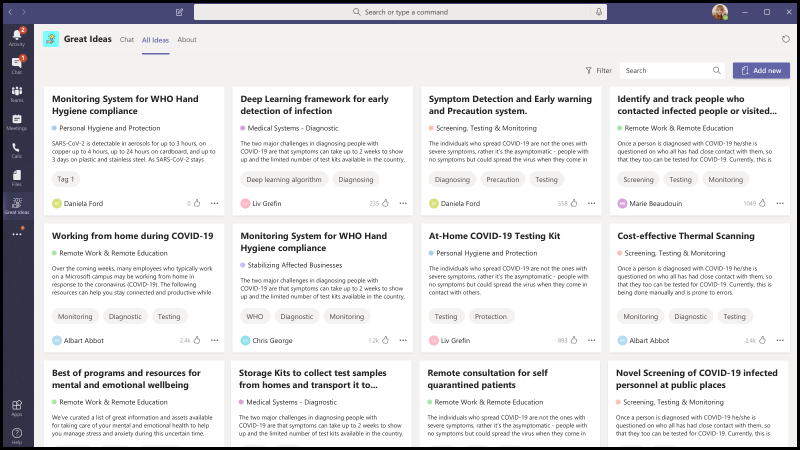

# Microsoft Teams 的应用模板App Templates for Microsoft Teams

应用模板是适用于 Microsoft Teams 的生产就绪应用，由社区驱动、开放源代码，在 GitHub 上可用。App templates are production-ready apps for Microsoft Teams that are community driven, open-source, and available on GitHub. 每个应用程序都包含有关为组织部署和安装该应用的详细说明，提供可供你立即安装和开始使用的现成应用。Each contains detailed instructions for deploying and installing that app for your organization, providing a ready-to-use app that you can install and begin using immediately. 完整的源代码也可用，因此你可以详细浏览它，或者分叉代码并修改代码以满足你的特定需求。The complete source code is available as well, so you can explore it in detail, or fork the code and alter it to meet your specific needs.

**&#9734;指示新发布的应用模板。****&#9734; Indicates newly released app templates.**

### 主要优势Key benefits

* **即插即用体验：** 所有应用模板都包括部署脚本，允许你在 Microsoft Azure 中托管所有必要的服务。**Plug and play experience:** All app templates include deployments scripts that will allow you to host all necessary services in Microsoft Azure. 部署应用不需要编码。No coding is required to deploy the apps.
* **生产就绪代码：** 应用模板符合有关安全性和基础结构的建议最佳做法，并审查所有社区提交的更改以确保持续一致性。**Production-ready code:** The app templates conform to recommended best practices around security and infrastructure, and all community submitted changes to them are reviewed to ensure continued conformance.
* **可自定义和可扩展：** 尽管所有应用模板都已准备好按其部署，但我们提供了整个代码库和部署脚本，以便你可以轻松地自定义或扩展它们以满足你的独特需求。**Customizable and extensible:** While all app templates are ready to deploy as they are, we provide the entire code base and deployment scripts so that you can easily customize or extend them to fit your unique needs.
* **详细的文档&支持：** 所有应用模板都附带了有关解决方案体系结构、部署和配置步骤的端到端文档。**Detailed documentation & support:** All app templates are accompanied by end-to-end documentation on solution architecture, deployment, and configuration steps. 存储库也受监视，因此请在 GitHub 上通过引发问题报告你遇到的任何问题。The repositories are monitored as well, so please report any issues you encounter by raising an Issue on GitHub.

## 询问离开Ask Away

"离开"是 [一](../bots/what-are-bots.md) 个 Microsoft Teams 自动程序，使用户能够在 Teams 中&问答 (问答) 问答会话。Ask Away is a [Microsoft Teams bot](../bots/what-are-bots.md) that enables users to conduct Q&A (Question and Answer) sessions within Teams. 使用"询问离开"自动程序，团队成员可以提交和投票讨论同事共享的问题，从而让问答&主机在频道或聊天中轻松收集顶级问题。Using the Ask Away bot, team members can submit and up-vote questions shared by colleagues allowing Q&A hosts to easily gather top-of-mind questions within a channel or chat. 机器人可用于在 Teams&会话期间执行实时问答，并允许与会者通过聊天实时提交问题。The bot can be used to conduct a real-time Q&A session in a Teams meeting and allows attendees to submit questions live via chat.

[在 GitHub 上获取Get it on GitHub](https://github.com/OfficeDev/microsoft-teams-apps-askaway)

:::row:::
  :::column span="2":::
      
:::column-end:::
:::row-end:::

## 员工见解Associate Insights

关联见解是 [一个 Power Apps](/powerapps/maker/canvas-apps/embed-teams-app) 模板，它使一线工作人员可以直接捕获和提交客户观点、情绪和感知。Associate Insights is a [Power Apps](/powerapps/maker/canvas-apps/embed-teams-app) template that empowers firstline workers to directly capture and submit customer opinion, sentiment, and perception. 一线员工通常是第一个在一对一联系点与客户互动的公司代表。Firstline workers are often the first company representative to engage with customers in a one-to-one point-of contact. 业务团队可以共享和协作使用收集的数据，例如通过 Power BI Teams 选项卡，以改进产品并增强客户体验。The collected data can be shared and used collaboratively by business teams, e.g., via a Power BI Teams tab, for product improvement and enhancing the customer experience.

[在 GitHub 上获取Get it on GitHub](https://github.com/OfficeDev/microsoft-teams-apps-associateinsights)

:::row:::
  :::column span="2":::
      
:::column-end:::
:::row-end:::
:::row:::
:::column span="2":::
    
:::column-end:::
:::row-end:::

## 考勤Attendance

"出席"应用是可在团队中固定的"Power [Apps"](/powerapps/maker/canvas-apps/embed-teams-app) 选项卡。The Attendance app is a [Power Apps](/powerapps/maker/canvas-apps/embed-teams-app) tab that can be pinned in a team. 它旨在记录状态，通常位于学习和培训环境等设置中。It is designed to record presence, typically in settings such as learning and training environments. 用户可以标记或编辑过去最多 30 天的出席情况，并查看整个组或单个与会者的汇总出席报告。Users can mark or edit attendance for up to 30 days in the past and view summarized attendance reports for an entire group or individual attendees.

[在 GitHub 上获取Get it on GitHub](https://github.com/OfficeDev/microsoft-teams-apps-attendance)

## 预订房间Book-a-room

会议室预订是一个 [Microsoft Teams](../bots/what-are-bots.md) 自动程序，用户可以从当前时间开始快速查找会议室并保留 30 (默认) 、60 或 90 分钟。Book-a-room is a [Microsoft Teams bot](../bots/what-are-bots.md) that lets users quickly find and reserve a meeting room for 30 (default), 60, or 90 minutes starting from the current  time. "预订房间"自动程序范围为个人对话或一对一对话。The Book-a-room bot scopes to personal or 1:1 conversations.

[在 GitHub 上获取Get it on GitHub](https://github.com/OfficeDev/microsoft-teams-apps-bookaroom)

## Building AccessBuilding Access

Building Access 是一款基于 Microsoft [Power Platform](https://powerapps.microsoft.com/blog/now-in-preview-customize-teams-with-built-in-power-platform-capabilities/)的应用，它通过允许设施控制器管理、跟踪和报告员工现场状态，支持管理建筑物阈值和社会实例规范。Building Access is a Microsoft [Power Platform](https://powerapps.microsoft.com/blog/now-in-preview-customize-teams-with-built-in-power-platform-capabilities/)-based app that supports the administration of building occupancy thresholds and social distancing norms by enabling facilities directors to manage, track, and report employee on-site presence. 使用 Microsoft Power [Apps](/powerapps/powerapps-overview)和 [Power Automate](/power-automate/getting-started)构建的应用与 Microsoft Teams 深度集成，使组织可以确定构建就绪情况，建立现场访问资格标准，并收集用于未来规划的见解。The app, built using Microsoft [Power Apps](/powerapps/powerapps-overview), and [Power Automate](/power-automate/getting-started), deeply integrates with Microsoft Teams and enables organizations to determine building readiness, establish eligibility criteria for on-site access, and gather insights for future planning.

[在 GitHub 上获取Get it on GitHub](https://github.com/OfficeDev/microsoft-teams-apps-buildingaccess)

:::row:::
   :::column span="":::
     
   :::column-end:::
   :::column span="":::
      
   :::column-end:::
:::row-end:::

## CelebrationsCelebrations

庆祝是一款 Teams 应用，可帮助团队成员庆祝彼此的生日、纪念日和其他定期事件。Celebrations is a Teams app that helps team members celebrate each others' birthdays, anniversaries, and other recurring events. 它记住所有团队成员的特殊场合，并发送在事件创建时选择的所有团队中的友好消息，使团队成员在一天中感觉特别。It remembers special occasions of all the team members and sends a friendly message in all the teams selected at the time of event creation, to make the team members feel special on their day.

该应用提供了一个简单的界面，供所有团队成员个人添加和查看其事件，还允许用户选择共享事件的团队。The app provides an easy interface for all the team members to personally add and view their events and also allows the user to select the teams in which the events gets shared.

[在 GitHub 上获取Get it on GitHub](https://github.com/OfficeDev/microsoft-teams-celebrations-app)

## 清单Checklist

清单是一个自定义 Microsoft [Teams](../messaging-extensions/what-are-messaging-extensions.md) 消息传递扩展应用，通过此应用，可以在聊天或频道中创建共享清单，从而与团队协作。Checklist is a custom Microsoft Teams [messaging extension](../messaging-extensions/what-are-messaging-extensions.md) app that enables you to collaborate with your team by creating a shared checklist in a chat or channel. 该应用在所有 Teams 平台客户端（桌面、浏览器、iOS 和 Android）中均受支持，并且已准备好作为 Microsoft 365 订阅的一部分进行部署。The app is supported across all Teams platform clients —  desktop, browser, iOS, and Android — and is ready for deployment as part of your Microsoft 365 subscription.  

[在 GitHub 上获取Get it on GitHub](https://github.com/OfficeDev/microsoft-teams-checklist-app )

:::row:::
:::column span="2":::
      
:::column-end:::
:::row-end:::

## 课堂放置&#9734;Classroom Drop-in &#9734;

Classroom Drop-in 是一款基于 Microsoft [Power Platform](https://powerapps.microsoft.com/blog/now-in-preview-customize-teams-with-built-in-power-platform-capabilities/)的应用，系统领导可根据需要查找课堂团队 (虚拟教室) 并根据需要将自己或其他人添加到这些课堂团队中。Classroom Drop-in is a Microsoft [Power Platform](https://powerapps.microsoft.com/blog/now-in-preview-customize-teams-with-built-in-power-platform-capabilities/)-based app that enables system leaders to find class teams (virtual classrooms) and add themselves or others to these class teams for a specified drop-in period, as needed. 使用 Microsoft [Power Apps](/powerapps/powerapps-overview) 和 [Power Automate](/power-automate/getting-started)构建的应用与 Microsoft Teams 深度集成，以确保教育机构可以针对每个业务要求向相关利益干系人提供对课堂团队的访问权限，从而优化他们在混合学习环境中的操作。The app built using Microsoft [Power Apps](/powerapps/powerapps-overview) and [Power Automate](/power-automate/getting-started), deeply integrates with Microsoft Teams to ensure educational institutes can optimize their operations in a hybrid learning environment by providing access to relevant stakeholders for class teams per business requirements.

[在 GitHub 上获取Get it on GitHub](https://github.com/OfficeDev/microsoft-teams-apps-classroom-dropin)

## Company CommunicatorCompany Communicator

公司Communicator应用允许公司团队通过聊天创建和发送面向多个团队或大量员工的消息，从而允许组织在员工协作的地方与员工联系。The Company Communicator app enables corporate teams to create and send messages intended for multiple teams or large number of employees over chat allowing organization to reach employees right where they collaborate. 针对多个方案（如新计划公告、员工入职培训、新式学习与开发或组织范围的广播）使用此模板。Utilize this template for multiple scenarios such as new initiative announcements, employee onboarding, modern learning and development or organization-wide broadcasts.

该应用为指定用户提供了用于创建、预览、协作和发送邮件的简便界面。The app provides an easy interface for designated users to create, preview, collaborate and send messages.

它为构建自定义目标通信功能（如有关确认或与邮件交互的用户数的自定义遥测）提供了基础。It provides a foundation to build custom targeted communication capabilities such as custom telemetry on how many users acknowledged or interacted with a message.

[在 GitHub 上获取Get it on GitHub](https://github.com/OfficeDev/microsoft-teams-company-communicator-app)

## 联系人组查找Contact Group Lookup

联系人组查找应用程序提供了一种便捷且有用的方法，用于创建、访问和管理组织的联系人组 (以前称为通讯组列表或通讯组) 。The Contact Group Lookup app provides a convenient and useful approach to creating, accessing, and managing your organization's contact groups (formerly known as distribution lists or communication groups). 用户可以快速查看和与团队成员聊天、查看成员状态，以及创建与联系人组中选定成员的群聊，所有这些都在 Teams 环境中完成。Users can quickly view and chat with group members, view member status, and create a group chat with selected members in the contact group, all within the Teams environment.

[在 GitHub 上获取Get it on GitHub](https://github.com/OfficeDev/microsoft-teams-app-contactgrouplookup)

:::row:::
:::column span="2":::
      
:::column-end:::
:::row-end:::
:::row:::
:::column span="2":::
    
:::column-end:::
:::row-end:::

## 同事的"共同&#9734;Co-worker Appreciation &#9734;

使用 Microsoft Teams 中的同事模板，用户可以在 Teams 上下文中识别同事的成就。Using the co-worker appreciation template in Microsoft Teams, users can recognize their colleagues' achievements within the Teams’ context. 当同事选择奖励同事时，将在频道对话中标记收件人和其他团队成员，并收到有关频道的奖励详细信息的通知。When co-workers select to reward a colleague, recipients and other team members are tagged in a channel conversation and they receive a notification about the channel's award details. 奖励记录在 Teams 应用中，安全、便携且易于共享。The awards are recorded in the Teams app, which is secure, portable, and easily shareable. 这可视为基于 PowerApps 的开放锁屏提醒应用模板版本，具有排行榜。This can be considered as the PowerApps based version of the Open Badges app template, with a leaderboard.

[在 GitHub 上获取Get it on GitHub](https://github.com/OfficeDev/microsoft-teams-apps-coworker-appreciation)

## CrowdSourcerCrowdSourcer

CrowdSourcer 是 [一](../bots/what-are-bots.md) 个 Microsoft Teams 自动程序，它向团队提供以协作方式从团队成员获取的查询信息。CrowdSourcer is a [Microsoft Teams bot](../bots/what-are-bots.md) that gives teams queried information sourced collaboratively from group members. 这是一种很好的方法，可以回答常见问题，同时使参与者能够积极参与并参与一个有趣且有用的信息资源。It's a great way to answer frequently asked questions while enabling participants to actively engage in and contribute to a fun and helpful information resource.

[在 Github 上获取Get it on Github](https://github.com/OfficeDev/microsoft-teams-crowdsourcer-app)

## 自定义贴纸Custom Stickers

自我表达是健康团队文化的核心。Self-expression is core to a healthy team culture. 此应用程序模板是 [一个消息](~/messaging-extensions/what-are-messaging-extensions.md) 扩展，允许用户在 Microsoft Teams 内使用自定义贴纸和 GIF。This app template is a [messaging extension](~/messaging-extensions/what-are-messaging-extensions.md) that enables your users to use custom stickers and GIFs within Microsoft Teams. 此模板提供基于 Web 的轻松配置体验，具有配置访问权限的任何人都可以上载他们希望最终用户拥有的 GIF/贴纸/图像，从而允许整个团队使用你选择的任何贴纸集。This template provides an easy web-based configuration experience where anyone with configuration access can upload the GIFs/stickers/images they want their end-users to have, allowing your entire team to use any set of stickers you chose.

此应用程序还支持跨团队轻松共享图像/GIF/贴纸，而无需访问 SharePoint 网站或作为存储和共享机制的单个通道。This app also enables easy sharing of images/GIFs/stickers across teams without needing access to SharePoint sites or individual channels as storage and sharing mechanisms. 例如，产品团队可以编程方式轻松地将产品图像和 GIF 共享到社交媒体、市场营销和销售团队。For example, product teams can easily share product images and GIFs to social media, marketing and sales teams programmatically. 当提供新映像/GIF 时，还可以通过向特定团队/个人触发通知流来扩展此应用。One can also extend this app by triggering a notification flow to specific teams/individuals when new images/GIFs are made available.

[在 GitHub 上获取Get it on GitHub](https://github.com/OfficeDev/microsoft-teams-stickers-app)

## 员工想法&#9734;Employee Ideas &#9734;

"员工创意"应用是基于 Azure 的"创意"应用模板的 PowerApps 版本。The Employee Ideas app is the PowerApps version of the Azure based Great Ideas app template. 通过该应用，Teams 用户可以设置和配置创意活动。The app enables the Teams users to set up and configure an idea campaign. 创意活动是围绕常见主题对想法进行分组的类别。An idea campaign is a category for grouping ideas around common themes.

Teams 用户还可以执行以下活动：Teams users can also perform following activities:
* 配置员工需要为每个想法提交的标准提交表单。Configure a standard submission form that employees need to submit for each idea. 
* 查看和管理活动的想法和列表。Review and manage the ideas and list of campaigns.
* 修改和删除市场活动。Modify and delete campaigns.
* 审阅想法排行榜。Review leader boards of ideas.
* 投票讨论并分享优先想法。Vote for and share prioritized ideas.
* 提交市场活动想法。Submit ideas for a campaign.
* 查看其他团队成员的想法。View other team member's idea.
* 对最喜欢的想法投票。Vote on most liked ideas.
* 查看与活动中其他人相比他们想法的绩效。Review the performance of their ideas compared with others within a campaign.

[在 GitHub 上获取Get it on GitHub](https://github.com/OfficeDev/microsoft-teams-apps-employeeideas)

 

## E-PrescriptionsE-Prescriptions 

E-Suings 是一款基于 [Power Apps](/powerapps/maker/canvas-apps/embed-teams-app)的应用，它通过自动执行向患者发布电子医疗方案的过程来增强远程医疗与虚拟医疗保健。E-Prescriptions is a [Power Apps](/powerapps/maker/canvas-apps/embed-teams-app)-based app that enhances telemedicine and virtual care by automating the process of issuing e-prescriptions to patients. 医疗专业人员可以直接在 Teams 平台内快速查看约会、生成电子医疗方案，并通过电子邮件向患者发送包含电子医疗附件的电子邮件。Medical professionals can quickly review appointments, generate e-prescriptions, and send emails with e-prescription attachments to patients directly within the Teams platform.

[在 GitHub 上获取Get it on GitHub](https://github.com/OfficeDev/microsoft-teams-apps-eprescription) 

:::row:::
:::column span="2":::
      
:::column-end:::
:::row-end:::
:::row:::
:::column span="2":::
    
:::column-end:::
:::row-end:::

## 员工培训Employee Training 

员工培训是一款 Microsoft Teams 应用，可让组织者轻松发布、跟踪和推广组织的学习和培训活动。Employee training is a Microsoft Teams app that enables organizers to easily publish,  track, and promote learning and training events for your organization.  借助该应用，事件规划人员可以向事件注册人发送提醒和通知，员工可以指示对即将开始的活动感兴趣，及时了解当前事件，以及通过 Teams 消息扩展与同事共享事件详细信息。With the app, event planners can send reminders and notifications to event registrants and employees can indicate interest in upcoming events, stay updated on current events, and share event details with colleagues via the Teams messaging extension.

[在 GitHub 上获取Get it on GitHub](https://github.com/OfficeDev/microsoft-teams-apps-employeetraining)

:::row:::
:::column span="2":::
    **查看员工培训计划** **View employee training events**   
:::column-end:::
:::row-end:::
:::row:::
:::column span="2":::
    **创建员工培训计划** **Create employee training event** 
:::column-end:::
:::row-end:::

## 专家查找器Expert Finder

专家查找器是 [一个 Microsoft Teams](../bots/what-are-bots.md) 自动程序，可基于特定组织成员的技能、兴趣和教育属性来标识这些成员。Expert Finder is a [Microsoft Teams bot](../bots/what-are-bots.md) that identifies specific organization members based on their skills, interests, and education attributes. 成员在组织中查找与 Azure Active Directory 用户配置文件的关键字搜索匹配的专家。Members find experts within an organization  that match a keyword search of Azure Active Directory user profiles.

[在 GitHub 上获取Get it on GitHub](https://github.com/OfficeDev/microsoft-teams-apps-expertfinder)

## 常见问题 +FAQ Plus

对话&聊天机器人是为用户提供常见问题解答的简便方法。Conversational Q&A bots are an easy way to provide answers to frequently asked questions by users. 但是，大多数机器人无法以有意义的方式与用户互动，因为机器人发生故障时循环中没有任何人。However, most bots fail to engage with users in meaningful way because there is no human in the loop when the bot fails. FAQ 自动程序是一&的问答，当机器人无法提供帮助时，它会在循环中引入人。FAQ bot is a friendly Q&A bot that brings a human in the loop when it is unable to help. 可以询问机器人问题，如果知识库中包含自动程序，则机器人会以答案进行响应。One can ask the bot a question and the bot responds with an answer if it is contained in the knowledge base. 如果没有，自动程序允许用户提交查询，该查询随后将张贴到预配置的专家团队，这些专家通过处理来自团队本身的通知来帮助提供支持。If not, the bot allows the user to submit a query which then gets posted to a pre-configured team of experts who help to provide support by acting upon the notifications from within the team itself.

> [!NOTE]
> 最新版本的 **FAQ Plus** 支持改进的&A 解决方案，使专家团队能够完成以下操作：The latest release of **FAQ Plus** supports improved Q&A resolutions by enabling a team of experts to complete the following:
>
> &#x2714;使用消息&将新问答直接添加到知识库。&#x2714; Add new Q&As directly to the knowledge base using message extensions.
>
> &#x2714;自动程序添加的&编辑和删除问答。&#x2714; Edit and delete Q&A pairs added by a bot.
>
> &#x2714;跟踪问答的&历史记录。&#x2714; Track the revision history of Q&As.
>
> &#x2714;配置一个答案，并添加其他详细信息以显示为 [自适应卡片](../task-modules-and-cards/cards/cards-reference.md#adaptive-card)。&#x2714; Configure an answer with additional details to display as an [adaptive card](../task-modules-and-cards/cards/cards-reference.md#adaptive-card).
>
[在 GitHub 上获取Get it on GitHub](https://github.com/OfficeDev/microsoft-teams-apps-faqplusv2)

## 目标跟踪器Goal Tracker

"目标跟踪器"应用是一个全面的解决方案，可支持在 Microsoft Teams 中建立目标、观察进度和确认成功。The Goal Tracker app is a comprehensive solution for your organization to support establishing goals, observing progress, and acknowledging success within Microsoft Teams. 该应用使用户能够在专业、个人和团队级别设置、跟踪和更新目标。The app enables users to set, track, and update objectives on a professional, personal, and team level. 团队成员还可及时收到提醒和状态更新，保持专注并保持跟踪状态。Team members also receive timely reminders and status updates to remain focused and stay on track.

[在 GitHub 上获取Get it on GitHub](https://github.com/OfficeDev/microsoft-teams-app-goaltracker)

:::row:::
  :::column span="2":::
      
:::column-end:::
:::row-end:::
:::row:::
:::column span="2":::
    
:::column-end:::
:::row-end:::

## 出色的创意Great Ideas

"出色的创意"应用支持并增强组织内部的创造力和创造力。The Great Ideas app supports and empowers innovation and creativity within your organization. 利用该应用，员工可以与同事和领导分享想法、发现新提交、聚焦供对等考虑贡献，并投票选择 Microsoft Teams 中的最佳建议。The app enables your employees to share ideas with colleagues and leadership, discover new submissions, spotlight contributions for peer consideration, and cast their vote for the best proposals within Microsoft Teams.

[在 GitHub 上获取Get it on GitHub](https://github.com/OfficeDev/microsoft-teams-apps-greatideas)

:::row:::
  :::column span="2":::
      
:::column-end:::
:::row-end:::
:::row:::
:::column span="2":::
    
:::column-end:::
:::row-end:::

## 组活动Group Activities

组活动是一款 Microsoft Teams 应用，使团队所有者可以轻松在 Microsoft Teams 上下文中快速创建活动组和管理协作工作流。Group Activities is a Microsoft Teams app that makes it easy for team owners to quickly create activity groups and manage collaboration workflows within the context of Microsoft Teams. 活动作者能够创建活动、在组中随机分配团队成员，并可以选择让机器人发送提醒，直到活动完成。Activity authors are enabled to create activities, randomly distribute team members in groups, and optionally have the bot send reminders until activities are complete.

[在 GitHub 上获取Get it on GitHub](https://github.com/OfficeDev/microsoft-teams-apps-groupactivities)

:::row:::
  :::column span="2":::
      
:::column-end:::
:::row-end:::
:::row:::
:::column span="2":::
    
:::column-end:::
:::row-end:::

## 提高技能Grow Your Skills

"发展技能"应用使员工能够参与组织的补充项目，同时学习新技能，从而支持专业成长和开发。The Grow Your Skills app supports professional growth and development by enabling employees to contribute to supplemental projects for your organization while simultaneously learning new skills. 员工可以使用该应用在 Teams 环境中找到满足其兴趣、与同事进行有意义的协作以及获得新级别的专业技能和功能的机会。Employees can use the app to locate opportunities that meet their interests, enjoy meaningful collaboration with peers, and acquire new levels of expertise and capabilities, all within the Teams environment.

[在 GitHub 上获取Get it on GitHub](https://github.com/OfficeDev/microsoft-teams-apps-growyourskills)

:::row:::
  :::column span="2":::
      
:::column-end:::
:::row-end:::
:::row:::
:::column span="2":::
    
:::column-end:::
:::row-end:::

## HR 支持HR Support

HR 支持机器人是一个友好的&聊天机器人，它可以在无法提供帮助时，在循环中提供来自 HR 团队的支持专业人员/专家。HR Support bot is a friendly Q&A bot that brings a support professional/expert from the HR team in the loop when it is unable to help. 可以询问机器人问题，如果知识库中包含自动程序，则机器人会以答案进行响应。One can ask the bot a question and the bot responds with an answer if it is contained in the knowledge base. 如果没有，则自动程序允许用户提交查询，该查询随后会发布在预配置的专家团队中，这些专家通过处理来自团队本身的通知来帮助提供支持。If not, the bot allows the user to submit a query which then gets posted in a pre-configured team of experts who are help to provide support by acting upon the notifications from within their team itself. 此外，自动程序通过搜索问题中的预配置标记，推荐指向建议的 HR 策略/问题的链接。Additionally, the bot suggests links to recommended HR policies/questions by searching for pre-configured tags in the question. 这些磁贴还可以作为快速参考在关联的选项卡中找到。These tiles can also be found in the associated tab as a quick reference. HR 支持适用于轻型 QnA，在组织中启动新项目/计划时提供快速支持。HR Support works well for light weight QnA and to provide quick support when launching new projects/initiatives in the organization.

[在 GitHub 上获取Get it on GitHub](https://github.com/OfficeDev/microsoft-teams-hrsupport-app)

## IcebreakerIcebreaker

Icebreaker 是 [一](../bots/what-are-bots.md) 个 Microsoft Teams 机器人，通过每周配对两个随机团队成员来开会，帮助你的团队建立关系。Icebreaker is a [Microsoft Teams bot](../bots/what-are-bots.md) that helps your team get closer by pairing two random team members up every week to meet. 自动程序通过自动建议适用于这两个成员的空闲时间来轻松安排日程安排。The bot makes scheduling easy by automatically suggesting free times that work for both members. 通过此应用加强个人连接并构建紧密的社区。Strengthen personal connections and build a tightly knit community with this app.

除了鼓励整个团队的个人连接之外，Icebreaker 应用还有助于在组织中培养基于兴趣的社区。In addition to encouraging personal connections across your entire team, the Icebreaker app can help cultivate interest-based communities within your organization. 例如，你可以将此应用用于 DevOps 兴趣组，以帮助想法和最佳做法在组织中自然传播。For example, you can use this app for a DevOps interest group to help ideas and best practices organically spread across your organization.

[在 GitHub 上获取Get it on GitHub](https://github.com/OfficeDev/microsoft-teams-icebreaker-app)

## 奖励Incentives

奖励是 [一个 Power Apps](/powerapps/maker/canvas-apps/embed-teams-app) 模板，可管理和跟踪奖励员工参与指定活动，如培训和变更管理计划。Incentives is a [Power Apps](/powerapps/maker/canvas-apps/embed-teams-app) template that manages and tracks incentivized employee participation in designated activities such as trainings and change management initiatives. 管理员使用该应用建立指定活动、分配完成分数，并指定奖励所需的资格分数级别。Admins use the app to establish designated activities, assign points for completion, and specify required eligibility point levels for rewards. 员工使用应用查看累积的积分，在达到资格后，请求和申请可兑换奖励。Employees use the app to view their accumulated points and, upon reaching eligibility, request and claim redeemable rewards.

[在 GitHub 上获取Get it on GitHub](https://github.com/OfficeDev/microsoft-teams-apps-incentives)

## 事件报告者Incident Reporter

事件报告程序 [是一](../bots/what-are-bots.md)  个 Microsoft Teams 自动程序，可优化组织中事件的管理。Incident Reporter is a [Microsoft Teams bot](../bots/what-are-bots.md)  that optimizes the management of incidents in your organization. 自动程序可促进自动事件数据收集、自定义事件报告、相关利益干系人通知和端到端事件跟踪。The bot facilitates automated incident data collection, customized incident reports, relevant stakeholder notifications, and end-to-end incident tracking.

[在 GitHub 上获取Get it on GitHub](https://github.com/OfficeDev/microsoft-teams-apps-incidentreport)

:::row:::
  :::column span="2":::
      
:::column-end:::
:::row-end:::
:::row:::
:::column span="2":::
    
:::column-end:::
:::row-end:::

## 检查&#9734;Inspection &#9734;

 检查是一款 Microsoft Teams 应用，它使第一线工作人员能够检查从位置到资产和设备之间的任何内容。Inspection is a Microsoft Teams app that enables front line workers to inspect anything from  locations to assets and equipments. 例如，零售商店、制造工厂或车辆和计算机。For example, a retail store, manufacturing plant, or vehicles and machines. 此解决方案中具有两个应用，每个应用都适用于不同类型的用户。There are two apps in this solution, each intended for different types of users.

该应用使一线工作人员能够检查资产或区域，管理产品和服务的质量，或维护工作场所的安全。The app empowers the front line workers to inspect an asset or area, to manage quality of products and services, or maintain safety at workplace. 它便于工作组成员之间的通信，以解决在检查过程中发现的问题。It facilitates communication between team members to address issues found during inspection. 该应用为经理提供了简单的报告，以加快问题解决并突出显示趋势。The app provides simple reports for managers to expedite issue resolution and highlight trends.

[在 GitHub 上获取Get it on GitHub](https://github.com/OfficeDev/microsoft-teams-apps-inspection)

   

## 问题报告&#9734;Issue Reporting &#9734;

"问题报告"应用使员工和经理能够提出和管理问题。The Issue Reporting app empowers the employees and managers to raise and manage issues. 它由两个应用组成：用于报告问题的"问题报告"应用和"管理问题"应用程序以管理问题。It consists of two apps, Issue reporting app for reporting issues and Manage Issues app for managing issues.

团队经理使用"管理问题"应用配置应用体验，包括应用创建 Microsoft Teams 消息和 Planner 任务的频道。The team managers use the Manage Issues app to configure the app experience, including the channel in which Microsoft Teams messages and Planner tasks are created by the app. 管理员还使用该应用程序创建模板表单，以在用户报告问题时收集详细信息。Managers also use the app to create template forms to collect details when a user reports an issue. 例如，查看、编辑或删除问题模板表单。For example, review, edit, or delete issue template forms. 该应用还可用于查看团队问题、报告问题历史记录并高效管理问题解决。The app can also be used to review team issues, report on issue history, and efficiently manage issue resolution.

员工使用"问题报告"应用记录解决问题所需的问题和详细信息。The employees use the Issue reporting app to log issues and details required to resolve them. 该应用还用于修改和解决现有问题，并获取个人或团队问题的高级别视图。The app is also used to modify and resolve existing issues and get a high-level view of individual or team issues.

[在 GitHub 上获取Get it on GitHub](https://github.com/OfficeDev/microsoft-teams-apps-issuereporting)

  

## 新员工入职培训New Employee Onboarding 

新员工入职培训是一个集成的 Microsoft Teams 和 [SharePoint](https://lookbook.microsoft.com/details/75e60a32-9849-4ed4-b83e-b2b08983ad19) 新员工载入解决方案，使组织能够在新员工旅程中为员工提供一致、高质量的入职培训体验。New Employee Onboarding is an integrated Microsoft Teams and [SharePoint New Employee Onboarding Solution](https://lookbook.microsoft.com/details/75e60a32-9849-4ed4-b83e-b2b08983ad19) that enables your organization to provide a consistent, high-quality onboarding experience for employees on their new-hire journey. 人力资源团队和招聘经理可以使用该应用在整个入职和入职培训过程中提供相关信息，新雇用人员可以共享反馈、提供简介和完成载入任务。The app can be used by human resource teams and hiring managers to provide relevant information throughout the orientation and induction process and by new hires to share feedback, provide introductions, and complete onboarding tasks.

[在 GitHub 上获取Get it on GitHub](https://github.com/OfficeDev/microsoft-teams-apps-newemployeeonboarding)

:::row:::
  :::column span="2":::
    **新员工欢迎卡** **New employee welcome card** 
:::column-end:::
:::row-end:::
:::row:::
:::column span="2":::
    **新员工清单** **New employee checklist**   
:::column-end:::
:::row-end:::

## 打开锁屏提醒Open Badges

开放锁屏提醒是一款 Microsoft Teams 应用，个人可以在 Teams 上下文中获取数字学习凭据锁屏提醒，并可在任何位置共享。Open Badges is a Microsoft Teams app that enables individuals to earn digital learning credential badges within the Teams context and share them everywhere. 使用来自第三方数字锁屏提醒颁发机构 [Badgr](https://badgr.org/)的功能，奖励徽章记录在收件人的 Badgr 个人资料中，可用于生成和共享生命周期学习旅程的丰富图片。Using capabilities from the third-party digital badge issuing authority, [Badgr](https://badgr.org/), awarded badges are recorded in a recipient's Badgr profile and available to build and share a rich picture of lifetime learning journeys.

[在 GitHub 上获取Get it on GitHub](https://github.com/OfficeDev/microsoft-teams-apps-openbadges)

:::row:::
  :::column span="2":::
      
:::column-end:::
:::row-end:::
:::row:::
:::column span="2":::
    
:::column-end:::
:::row-end:::

## 轮询Poll 

轮询是一个自定义 Microsoft [Teams](../messaging-extensions/what-are-messaging-extensions.md) 消息传递扩展应用，它使您能够在聊天或频道中快速创建和发送投票，以收集团队观点和偏好。Poll is a custom Microsoft Teams [messaging extension](../messaging-extensions/what-are-messaging-extensions.md) app that enables you to quickly create and send polls in a chat or a channel to gather team opinions and preferences. 该应用在所有 Teams 平台客户端（桌面、浏览器、iOS 和 Android）中均受支持，并且已准备好作为 Microsoft 365 订阅的一部分进行部署。The app is supported across all Teams platform clients — desktop, browser, iOS, and Android  — and is ready for deployment as part of your Microsoft 365 subscription.

[在 GitHub 上获取Get it on GitHub](https://github.com/OfficeDev/microsoft-teams-poll-app)

:::row:::
  :::column span="1":::
      
:::column-end:::
:::row-end:::

## 快速响应Quick Responses

"快速响应"是一款 Microsoft Teams 应用，提供一个可靠的解决方案，可有效回答用户提出的常见问题 (常见问题) 。Quick Responses is a Microsoft Teams app that delivers a robust solution for effectively answering users' commonly asked questions (FAQs). 应用将构建一个响应库，用于通过 Teams 消息传递扩展实现交互式用户体验，而不是手动和持续重复地回答 [每个查询](../messaging-extensions/what-are-messaging-extensions.md)。Instead of answering each query manually and  continuously repeating information, the app will build a library of responses for an interactive user experience via Teams [messaging extensions](../messaging-extensions/what-are-messaging-extensions.md).

[在 GitHub 上获取Get it on GitHub](https://github.com/OfficeDev/microsoft-teams-apps-quickresponses)

## 快速协助&#9734;Rapid Assist &#9734;

快速协助是一款基于 Microsoft [Power Platform](https://powerapps.microsoft.com/blog/now-in-preview-customize-teams-with-built-in-power-platform-capabilities/) 的应用，使面向客户的关联人员可以快速与专家联系，以快速获得答案、搜索信息、跟进打开的请求，并允许专家接收通知以快速接听电话以帮助回答问题。Rapid Assist is a Microsoft [Power Platform](https://powerapps.microsoft.com/blog/now-in-preview-customize-teams-with-built-in-power-platform-capabilities/) based app that allows customer facing associates to rapidly connect with the experts to get quick answers, search for information, follow up open requests, and allow experts to receive notifications to quickly get on a call to help answer questions. 使用 Microsoft [Power Apps](/powerapps/powerapps-overview) 和 [Power Automate](/power-automate/getting-started)构建的应用与 Microsoft Teams 深度集成，使组织能够轻松地将一线工作人员与公司代表联系，从而解决客户查询并提供出色的客户体验。The app built using Microsoft [Power Apps](/powerapps/powerapps-overview) and [Power Automate](/power-automate/getting-started), deeply integrates with Microsoft Teams to enable organizations to easily connect frontline workers with corporate liaisons to resolve customer queries and deliver a great customer experience. 

[在 GitHub 上获取Get it on GitHub](https://github.com/OfficeDev/microsoft-teams-apps-rapid-assist)

:::row:::
   :::column span="":::
     
   :::column-end:::
   :::column span="":::
      
   :::column-end:::
:::row-end:::

## 反射Reflect 

反射是一个自定义 Microsoft [Teams](../messaging-extensions/what-are-messaging-extensions.md) 消息传递扩展应用，它可为团队成员提供安全且包含的资源，以直接与 Teams 内的同事和/或组领导共享其情绪状态。Reflect is a custom Microsoft Teams [messaging extension](../messaging-extensions/what-are-messaging-extensions.md) app that provides a safe and inclusive resource for your team members to share the state of their emotional well-being with colleagues and/or group leaders directly within Teams. 该应用在频道、组、会议以及一对一聊天中可用，并且签入响应可以设置为公共、私人到发件人或完全匿名。The app is available in channel, group, meeting, and 1:1 chats and the check-in response can be set to public, private-to-sender, or fully anonymous.

[在 GitHub 上获取Get it on GitHub](https://github.com/OfficeDev/Microsoft-Teams-App-Reflect)

:::row:::
    :::column:::
    **健康轮询****Well-being poll**
    
    
    :::column-end:::
:::row-end:::

## 远程支持Remote Support

远程支持是 [Microsoft Teams 自动](../bots/what-are-bots.md) 程序，可为整个组织的支持请求者和内部支持团队提供一个集中的界面。Remote Support is a [Microsoft Teams bot](../bots/what-are-bots.md) that provides a focused interface between support requesters throughout your organization and the internal support team.  最终用户可以提交、编辑或撤消支持请求，支持团队可以在 Teams 平台内响应、管理和更新所有请求。End-users can submit, edit, or withdraw requests for support and the support team can respond, manage, and update requests all within the Teams platform.

[在 GitHub 上获取Get it on GitHub](https://github.com/OfficeDev/microsoft-teams-apps-remotesupport)

:::row:::
  :::column span="2":::
      
:::column-end:::
:::row-end:::
:::row:::
:::column span="2":::
    
:::column-end:::
:::row-end:::

## 请求团队Request-a-team

请求团队是一款 Microsoft Teams 应用，可优化企业组织的新团队创建。Request-a-team is a Microsoft Teams app that optimizes new team creation for your enterprise organization. 应用通过集成向导指导的请求表单、嵌入式审批流程、请求状态仪表板和自动团队生成来创建新团队实例时，支持标准化和最佳做法。The app supports standardization and best practices when creating new team instances through the integration of a wizard-guided request form, an embedded approval process, a request status dashboard, and automated team builds.

[在 GitHub 上获取Get it on GitHub](https://github.com/OfficeDev/microsoft-teams-apps-requestateam)

:::row:::
  :::column span="2":::
    
:::column-end:::
:::row-end:::
:::row:::
:::column span="2":::
    
:::column-end:::
:::row-end:::

## 适用于频道的 ScrumScrums for Channels

适用于频道的 Scrum 是一款 scrum 助手应用，使用户能够在 Microsoft Teams 内的频道中安排和运行 scrum。Scrums for Channels is a scrum assistant app that enables users to schedule and run scrums in channels within Microsoft Teams. 该应用非常适用于由来自不同地理位置和时区的成员组成的远程团队和团队，以共享每日更新并确保参与重要独立会议。The app is great for remote teams and teams comprised of members from varied geographical locations and time zones to share daily updates and ensure participation in scrum stand-up meetings.

[在 GitHub 上获取Get it on GitHub](https://github.com/OfficeDev/microsoft-teams-apps-scrumsforchannels)

> [!NOTE]
> 若要在群聊中召开 scrum 会议，请参阅 [我们的 Scrums for Group Chat](#scrums-for-group-chat) 应用模板。To conduct scrum meetings in a group chat, please see our [Scrums for Group Chat](#scrums-for-group-chat) app template.

:::row:::
  :::column span="2":::
    
:::column-end:::
:::row-end:::
:::row:::
:::column span="2":::
    
:::column-end:::
:::row-end:::

## 群聊的 ScrumScrums for Group Chat

> [!NOTE]
> Scrums 状态应用模板已更新，现在是用于群聊的 Scrums。The Scrums Status app template has been updated and is now Scrums for Group Chat.

群聊的 Scrum 是一种支持性的 scrum 助手，它使群聊成员能够运行异步独立会议并轻松共享其每日更新。Scrums for Group Chat is a supportive scrum assistant that enables group chat members to run asynchronous stand-up meetings and easily share their daily updates. 它允许群聊的所有成员参与 scrum，并查看运行中的 scrum 中其他人的更新。It allows all members of the group chat to contribute to the scrum and view the updates made by others in the running scrum.

[在 GitHub 上获取Get it on GitHub](https://github.com/OfficeDev/microsoft-teams-apps-scrumsforgroupchat)

## 现在共享Share Now 

通过允许用户在 Teams 环境中轻松共享内容，"现在共享"应用可促进同事之间的积极信息交换。The Share Now app promotes the positive exchange of information between colleagues by enabling your users to easily share content within the Teams environment. 用户通过应用与团队成员共享感兴趣的项目、发现新的共享内容、设置首选项和书签收藏夹供以后阅读。Users engage the app to share items of interest with team members, discover new shared content, set preferences, and bookmark favorites for later reading.

[在 GitHub 上获取Get it on GitHub](https://github.com/OfficeDev/microsoft-teams-apps-sharenow)

## SharePoint 列表搜索SharePoint List Search

Microsoft Teams 中的协作通常引用 SharePoint 列表中项目中包含的信息。Collaboration in Microsoft Teams quite often references information contained within items in a SharePoint list. 只需将链接粘贴到相关项目，将强制每个人从对话切换上下文，查找所需信息，然后返回到 Teams 以继续对话。Simply pasting a link to the item in question forces everyone to switch context away from the conversation, find the needed information, then return to Teams to continue the conversation. 随着对话的继续，通常用户必须多次切换回引用项，以验证新注释并刷新对项目中包含的信息的了解。As the conversation continues typically people will have to switch back to the reference item multiple times to verify new comments and refresh their memories of the information contained within the item. 此上下文切换为顺利协作创建了障碍，也是解决失败问题的方式。This context switching creates a barrier to smooth collaboration, and is a recipe for things falling through the cracks.

为了帮助缓解这种负担，我们乐意为你带来列表搜索应用模板。To help alleviate this pain, we are happy to bring to you the List Search app template. 数百万用户使用 SharePoint 为组织中某些核心工作流提供电源。Millions of users use SharePoint to power some of the core workflows in their organizations. 但是，围绕列表进行协作可能尤其繁琐。However, collaborating around lists can be especially tedious. 使用 Microsoft Teams 中的"列表搜索"应用程序模板，用户可以直接在聊天对话中插入 SharePoint 列表项的信息，以缓解仅向聊天中插入链接时导致上下文切换的情况。Using the List Search app template in Microsoft Teams, users can insert information from SharePoint list items directly within a chat conversation to alleviate the context-switching caused when simply inserting a link into a chat. 信息作为易于阅读的自动格式化卡片插入，帮助用户保持参与对话。The information is inserted as an easy-to-read auto-formatted card, helping your users stay engaged in the conversation.

[在 GitHub 上获取Get it on GitHub](https://github.com/OfficeDev/microsoft-teams-list-search-app)

## 员工签入Staff Check-ins

员工签入是一种基于 [Power Apps](/powerapps/powerapps-overview)的应用，支持你的企业与现场人员之间的监督通信。Staff Check-ins is a [Power Apps](/powerapps/powerapps-overview)-based app that enables oversight communication between your business and field personnel. 员工可以直接从 Teams 中按计划或临时提供时间关键信息和状态更新。Staff can easily provide time-critical information and status updates on either a scheduled or ad-hoc basis directly from Teams. 该应用支持实时位置、照片和笔记以及提醒通知和自动工作流。The app supports real-time location, photos, and notes as well as reminder notifications and automated workflows.

[在 GitHub 上获取Get it on GitHub](https://github.com/OfficeDev/microsoft-teams-apps-staffcheckins)

## 调查Survey

调查是一个自定义 Microsoft [Teams](../messaging-extensions/what-are-messaging-extensions.md) 消息传递扩展应用，它使您能够在聊天或频道中创建调查，以收集数据并获取可操作见解。Survey is a custom Microsoft Teams [messaging extension](../messaging-extensions/what-are-messaging-extensions.md) app that enables you to create a survey in a chat or a channel to gather data and gain actionable insight.  该应用在所有 Teams 平台客户端（桌面、浏览器、iOS 和 Android）中均受支持，并且已准备好作为 Microsoft 365 订阅的一部分进行部署。The app is supported across all Teams platform clients — desktop, browser, iOS, and Android — and is ready for deployment as part of your Microsoft 365 subscription.  

[在 GitHub 上获取Get it on GitHub](https://github.com/OfficeDev/Microsoft-Teams-Survey-app)

:::row:::
  :::column span="2":::
    
:::column-end:::
:::row-end:::

## 虚拟舍入&#9734;Virtual Rounding &#9734;

医院和紧急室提供商每天进行数十次，通常数百次"轮"。Hospital and emergency room providers make dozens, and often hundreds of “rounds” per day. 这些患者快速签入旨在提供对患者操作方式的状态检查，并确保解决患者的问题。These quick check-ins on patients are intended to provide a status check on how the patient is doing and ensure that the patient’s concerns are addressed. 尽管舍入是确保患者受到多种提供商监控的基本做法，但是它们表示 PPE 会消耗大量资源，因为每次访问时，每个提供商都必须使用一个新的掩码和一组新的面罩。While rounding is an essential practice to ensure patients are being monitored by multiple types of providers, they represent a huge drain on PPE, because for each visit, from each provider, a new mask, and new set of gloves must be used. 借助此应用模板，医疗工作者可以通过提供商和患者之间的 Microsoft Teams 会议轻松地进行虚拟轮次。With this app templates, medical workers can easily conduct rounds virtually, through a Microsoft Teams meeting between the provider and the patient.

Microsoft Health and Life Sciences 博客文章还引用了虚拟舍入 [解决方案](https://aka.ms/teamsvirtualrounding)。The Virtual Rounding solution is also referenced in the Microsoft Health and Life Sciences [blog post](https://aka.ms/teamsvirtualrounding).

[在 GitHub 上获取Get it on GitHub](https://github.com/SmartterHealth/Virtual-Rounding)

## 访问者管理Visitor Management

利用访问者管理应用，组织和员工可以直接从 Microsoft Teams 轻松高效地管理现场访问者流程。The Visitor Management app enables your organization and employees to easily and efficiently manage the on-site visitor process, directly from Microsoft Teams. 利用该应用，员工可以创建访问者请求、通过访问者仪表板集中跟踪请求状态，以及当访问者到达时接收实时通知。The app enables employees to create visitor requests, centrally track a request status through the visitor dashboard, and receive real-time notifications when a visitor arrives.

[在 GitHub 上获取Get it on GitHub](https://github.com/OfficeDev/microsoft-teams-app-visitormanagement)

:::row:::
  :::column span="2":::
    
:::column-end:::
:::row-end:::
:::row:::
:::column span="2":::
    
:::column-end:::
:::row-end:::

## Workplace AwardsWorkplace Awards

Workplace Workplace Workplace 是一个 Teams 应用模板，提供一个积极框架，以培养现代工作场所中的员工认知和鼓励员工文化。Workplace Awards is a Teams app template that provides a positive framework to foster recognition and encourage the culture of employee appreciation in the modern workplace. 通过该应用，你可以设置和管理员工奖励和识别 (R&R) 计划，员工可以在该计划中轻松指定和认可同事，R&R 领导可以查看提交的奖励、授予奖励和通知收件人。The app enables you to setup and manage an employee rewards and recognition (R&R) program where employees can easily nominate and endorse colleagues and your R&R leader can view submitted nominations, grant awards, and announce recipients.

[在 GitHub 上获取Get it on GitHub](https://github.com/OfficeDev/microsoft-teams-apps-workplaceawards)

:::row:::
  :::column span="2":::
    
:::column-end:::
:::row-end:::
:::row:::
:::column span="2":::
    
:::column-end:::
:::row-end:::

对要查看的应用模板有一个想法？Have an idea for an app template you'd like to see? [请告诉我们](https://forms.office.com/Pages/ResponsePage.aspx?id=v4j5cvGGr0GRqy180BHbR2_7qFm_lcZAr4eqEhnLsZ9UMVZGT1lCT0FXUDdZMUM0RkpBS1BESTAwWC4u)。[Please let us know](https://forms.office.com/Pages/ResponsePage.aspx?id=v4j5cvGGr0GRqy180BHbR2_7qFm_lcZAr4eqEhnLsZ9UMVZGT1lCT0FXUDdZMUM0RkpBS1BESTAwWC4u).
