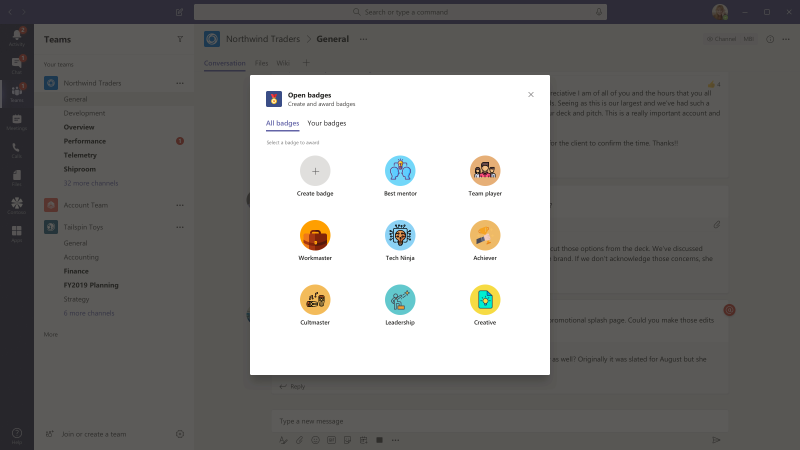
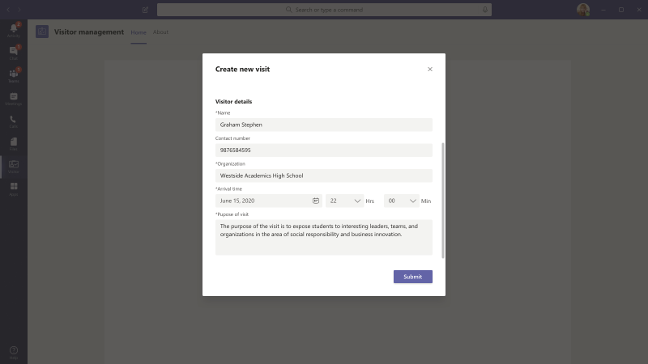

# Microsoft Teams 的应用模板

应用模板是适用于 Microsoft Teams 的生产就绪应用，由社区驱动、开放源代码，在 GitHub 上可用。 每个应用程序都包含有关为组织部署和安装该应用的详细说明，提供可供你立即安装和开始使用的现成应用。 完整的源代码也可用，因此你可以详细浏览它，或者分叉代码并修改代码以满足你的特定需求。

**&#9734;指示新发布的应用模板。**

### 主要优势

* **即插即用体验：** 所有应用模板都包括部署脚本，允许你在 Microsoft Azure 中托管所有必要的服务。 部署应用不需要编码。
* **生产就绪代码：** 应用模板符合有关安全性和基础结构的建议最佳做法，并审查所有社区提交的更改以确保持续一致性。
* **可自定义和可扩展：** 尽管所有应用模板都已准备好按其部署，但我们提供了整个代码库和部署脚本，以便你可以轻松地自定义或扩展它们以满足你的独特需求。
* **详细的文档&支持：** 所有应用模板都附带了有关解决方案体系结构、部署和配置步骤的端到端文档。 存储库也受监视，因此请在 GitHub 上通过引发问题报告你遇到的任何问题。

## 采用自动&#9734;

采用机器人是一种用户关心聊天机器人，它使用 Power Virtual Agent for Teams (PVA) 。 它可视为常见问题增强版的 PVA 版本。 采用机器人解答了 100 多个有关 Microsoft 365 和 Teams 的常见问题。 可以编辑包含的主题、添加自己的主题和加入现有常见问题解答。 如果用户需要其他帮助，采用机器人可以将其与专家联系，甚至可以扩展为使用高级流连接器打开服务票证。

[在 GitHub 上获取](https://github.com/OfficeDev/microsoft-teams-apps-adopt-bot)

## 约会管理器&#9734;

约会管理器是一个 Teams 应用模板，可帮助企业通过 Teams 创建、管理和与消费者进行虚拟约会。 来自消费者的新约会请求在 Teams 频道中可见，可在其中快速分配这些请求并将其重新分配给团队中的员工。 可以通过自定义选项卡在团队或个人级别查看约会请求。 每个约会都与 Teams 联机会议关联，因此员工和使用者可以在计划的时间轻松加入会议。

该应用模板与 Microsoft Bookings 集成，便于进行约会管理。 安排的约会会自动显示在已分配员工的日历上，并且消费者会收到包含嵌入式会议链接的可自定义电子邮件通知和提醒。

[在 GitHub 上获取](https://github.com/OfficeDev/microsoft-teams-apps-appointment-manager)

 

## 询问离开

"离开"是 [一](../bots/what-are-bots.md) 个 Microsoft Teams 自动程序，使用户能够在 Teams 中&问答 (问答) 问答会话。 使用"询问离开"机器人，团队成员可以提交和投票讨论同事共享的问题，从而允许问答&主机在频道或聊天中轻松收集顶级问题。 机器人可用于在 Teams&会话期间执行实时问答，并允许与会者通过聊天实时提交问题。

[在 GitHub 上获取](https://github.com/OfficeDev/microsoft-teams-apps-askaway)

:::row:::
  :::column span="2":::
      
:::column-end:::
:::row-end:::

## 员工见解

关联见解是 [一个 Power Apps](/powerapps/maker/canvas-apps/embed-teams-app) 模板，它使一线工作人员可以直接捕获和提交客户观点、情绪和感知。 一线员工通常是第一个在一对一联系点与客户互动的公司代表。 业务团队可以共享和协作使用收集的数据，例如通过 Power BI Teams 选项卡，以改进产品并增强客户体验。

[在 GitHub 上获取](https://github.com/OfficeDev/microsoft-teams-apps-associateinsights)

:::row:::
  :::column span="2":::
      
:::column-end:::
:::row-end:::
:::row:::
:::column span="2":::
    
:::column-end:::
:::row-end:::

## 考勤

"出席"应用是可在团队中固定的"Power [Apps"](/powerapps/maker/canvas-apps/embed-teams-app) 选项卡。 它旨在记录状态，通常位于学习和培训环境等设置中。 用户可以标记或编辑过去最多 30 天的出席情况，并查看整个组或单个与会者的汇总出席报告。

[在 GitHub 上获取](https://github.com/OfficeDev/microsoft-teams-apps-attendance)

## 预订房间

会议室预订是一个 [Microsoft Teams](../bots/what-are-bots.md) 自动程序，用户可以从当前时间开始快速查找会议室并保留 30 (默认) 、60 或 90 分钟。 会议室预订自动程序范围为个人对话或一对一对话。

[在 GitHub 上获取](https://github.com/OfficeDev/microsoft-teams-apps-bookaroom)

## Building Access

Building Access 是一款基于 Microsoft [Power Platform](https://powerapps.microsoft.com/blog/now-in-preview-customize-teams-with-built-in-power-platform-capabilities/)的应用，它通过允许设施控制器管理、跟踪和报告员工现场状态，支持管理建筑物阈值和社会解除阈值。 使用 Microsoft Power [Apps](/powerapps/powerapps-overview)和 [Power Automate](/power-automate/getting-started)构建的应用与 Microsoft Teams 深度集成，使组织可以确定构建就绪情况，建立现场访问的资格标准，并收集未来规划的见解。

[在 GitHub 上获取](https://github.com/OfficeDev/microsoft-teams-apps-buildingaccess)

:::row:::
   :::column span="":::
     
   :::column-end:::
   :::column span="":::
      
   :::column-end:::
:::row-end:::

## Celebrations

庆祝是一款 Teams 应用，可帮助团队成员庆祝彼此的生日、周年日和其他定期事件。 它记住所有团队成员的特殊场合，并发送在事件创建时选择的所有团队中的友好消息，使团队成员在一天中感觉特别。

该应用提供了一个简单的界面，供所有团队成员个人添加和查看其事件，还允许用户选择共享事件的团队。

[在 GitHub 上获取](https://github.com/OfficeDev/microsoft-teams-celebrations-app)

## 清单

清单是一个自定义 Microsoft [Teams](../messaging-extensions/what-are-messaging-extensions.md) 消息传递扩展应用，通过此应用，可以在聊天或频道中创建共享清单，从而与团队协作。 该应用在所有 Teams 平台客户端（桌面、浏览器、iOS 和 Android）中均受支持，并且已准备好作为 Microsoft 365 订阅的一部分进行部署。  

[在 GitHub 上获取](https://github.com/OfficeDev/microsoft-teams-checklist-app )

:::row:::
:::column span="2":::
      
:::column-end:::
:::row-end:::

## 课堂放置&#9734;

Classroom Drop-in 是一款基于 Microsoft [Power Platform](https://powerapps.microsoft.com/blog/now-in-preview-customize-teams-with-built-in-power-platform-capabilities/)的应用，系统领导可根据需要查找课堂团队 (虚拟教室) 并根据需要将自己或其他人添加到这些课堂团队中。 使用 Microsoft [Power Apps](/powerapps/powerapps-overview) 和 [Power Automate](/power-automate/getting-started)构建的应用与 Microsoft Teams 深度集成，以确保教育机构可以通过根据业务要求向课堂团队的相关利益干系人提供访问权限，从而优化他们在混合学习环境中的操作。

[在 GitHub 上获取](https://github.com/OfficeDev/microsoft-teams-apps-classroom-dropin)

## Company Communicator

公司Communicator应用使企业团队通过聊天创建和发送面向多个团队或大量员工的消息，从而允许组织在员工协作的地方与员工联系。 此模板可用于多个方案，例如新计划公告、员工入职培训、新式学习与开发或组织范围的广播。

该应用为指定用户提供了用于创建、预览、协作和发送邮件的简便界面。

它为构建自定义目标通信功能（如有关确认或与邮件交互的用户数的自定义遥测）提供了基础。

[在 GitHub 上获取](https://github.com/OfficeDev/microsoft-teams-company-communicator-app)

## 联系人组查找

联系人组查找应用程序提供了一种便捷且有用的方法，用于创建、访问和管理组织的联系人组 (以前称为通讯组列表或通讯组) 。 用户可以快速查看和与团队成员聊天、查看成员状态，以及创建与联系人组中选定成员的群聊，所有这些都在 Teams 环境中完成。

[在 GitHub 上获取](https://github.com/OfficeDev/microsoft-teams-app-contactgrouplookup)

:::row:::
:::column span="2":::
      
:::column-end:::
:::row-end:::
:::row:::
:::column span="2":::
    
:::column-end:::
:::row-end:::

## 同事的"共同&#9734;

使用 Microsoft Teams 中的同事模板，用户可以在 Teams 上下文中识别同事的成就。 当同事选择奖励同事时，将在频道对话中标记收件人和其他团队成员，并收到有关频道的奖励详细信息的通知。 奖励记录在 Teams 应用中，安全、便携且易于共享。 这可视为基于 PowerApps 的开放锁屏提醒应用模板版本，具有排行榜。

[在 GitHub 上获取](https://github.com/OfficeDev/microsoft-teams-apps-coworker-appreciation)

## CrowdSourcer

CrowdSourcer 是 [一](../bots/what-are-bots.md) 个 Microsoft Teams 自动程序，它向团队提供以协作方式从团队成员获取的查询信息。 这是一种很好的方法，可以回答常见问题，同时使参与者能够积极参与并参与一个有趣且有用的信息资源。

[在 Github 上获取](https://github.com/OfficeDev/microsoft-teams-crowdsourcer-app)

## 自定义贴纸

自我表达是健康团队文化的核心。 此应用模板 [是一个消息](~/messaging-extensions/what-are-messaging-extensions.md) 扩展，允许用户在 Microsoft Teams 内使用自定义贴纸和 GIF。 此模板提供基于 Web 的轻松配置体验，具有配置访问权限的任何人都可以上载他们希望最终用户拥有的 GIF/贴纸/图像，从而允许整个团队使用你选择的任何贴纸集。

此应用程序还支持跨团队轻松共享图像/GIF/贴纸，而无需访问 SharePoint 网站或作为存储和共享机制的单个通道。 例如，产品团队可以编程方式轻松地将产品图像和 GIF 共享到社交媒体、市场营销和销售团队。 当提供新映像/GIF 时，还可以通过触发通知流到特定团队/个人来扩展此应用。

[在 GitHub 上获取](https://github.com/OfficeDev/microsoft-teams-stickers-app)

## 员工想法&#9734;

"员工创意"应用是基于 Azure 的"创意"应用模板的 PowerApps 版本。 此应用使 Teams 用户可以设置和配置创意活动。 创意活动是围绕常见主题对想法进行分组的类别。

Teams 用户还可以执行以下活动：
* 配置员工需要为每个想法提交的标准提交表单。 
* 查看和管理活动的想法和列表。
* 修改和删除市场活动。
* 审阅想法排行榜。
* 投票讨论并分享优先想法。
* 提交宣传活动想法。
* 查看其他团队成员的想法。
* 对最喜欢的想法投票。
* 查看他们与活动中其他人相比想法的绩效。

[在 GitHub 上获取](https://github.com/OfficeDev/microsoft-teams-apps-employeeideas)

 

## E-Prescriptions 

E-Suings 是一款基于 [Power Apps](/powerapps/maker/canvas-apps/embed-teams-app)的应用，它通过自动执行向患者发布电子医疗方案的过程来增强远程医疗与虚拟医疗保健。 医疗专业人员可以直接在 Teams 平台内快速查看约会、生成电子医疗方案，以及向患者发送包含电子医疗附件的电子邮件。

[在 GitHub 上获取](https://github.com/OfficeDev/microsoft-teams-apps-eprescription) 

:::row:::
:::column span="2":::
      
:::column-end:::
:::row-end:::
:::row:::
:::column span="2":::
    
:::column-end:::
:::row-end:::

## 员工培训 

员工培训是一款 Microsoft Teams 应用，可让组织者轻松发布、跟踪和推广组织的学习和培训活动。  借助该应用，事件规划人员可以向事件注册人发送提醒和通知，员工可以指示对即将开始的事件感兴趣，及时了解当前事件，以及通过 Teams 消息扩展与同事共享事件详细信息。

[在 GitHub 上获取](https://github.com/OfficeDev/microsoft-teams-apps-employeetraining)

:::row:::
:::column span="2":::
    **查看员工培训计划**   
:::column-end:::
:::row-end:::
:::row:::
:::column span="2":::
    **创建员工培训计划** 
:::column-end:::
:::row-end:::

## 专家查找器

专家查找器是 [一个 Microsoft Teams](../bots/what-are-bots.md) 自动程序，可基于特定组织成员的技能、兴趣和教育属性来标识这些成员。 成员在组织中查找与 Azure Active Directory 用户配置文件的关键字搜索匹配的专家。

[在 GitHub 上获取](https://github.com/OfficeDev/microsoft-teams-apps-expertfinder)

## 常见问题 +

对话&聊天机器人是为用户提供常见问题解答的简便方法。 但是，大多数机器人无法以有意义的方式与用户互动，因为机器人发生故障时循环中没有任何人。 FAQ 自动程序是一&的问答，当机器人无法提供帮助时，它会在循环中引入人。 用户可以向机器人提问，如果包含在知识库中，则机器人会以答案进行响应。 如果没有，自动程序允许用户提交查询，然后将该查询张贴到预配置的专家团队，这些专家通过处理来自团队本身的通知来帮助提供支持。

> [!NOTE]
> 最新版 **FAQ Plus** 支持通过&团队完成以下操作，从而改进问答解决方案：
>
> &#x2714;使用消息&将新问答直接添加到知识库。
>
> &#x2714;自动程序&的对编辑和删除问答。
>
> &#x2714;跟踪问答的&历史记录。
>
> &#x2714;配置包含其他详细信息的应答，以显示为 [自适应卡片](../task-modules-and-cards/cards/cards-reference.md#adaptive-card)。
>
[在 GitHub 上获取](https://github.com/OfficeDev/microsoft-teams-apps-faqplusv2)

## 获取支持应用&#9734;

使用 Microsoft Teams 的组织可以使用"获取支持"应用，以允许任何一组用户向监督员请求帮助。 此应用包括各种功能，例如：
-   从 Power App 请求有关不同类别的帮助
-   发送给请求者的通知，告知他们已分配了谁 
-   发送给指定监督员的通知，告知他们谁需要帮助 
-   分析 SharePoint 和 PowerBI 中的升级和模式

[在 GitHub 上获取](https://github.com/OfficeDev/microsoft-teams-app-get-support/)

## 目标跟踪器

"目标跟踪器"应用是一个全面的解决方案，可支持在 Microsoft Teams 中建立目标、观察进度和确认成功。 该应用使用户能够在专业、个人和团队级别设置、跟踪和更新目标。 团队成员还可以及时收到提醒和状态更新，保持专注并保持跟踪状态。

[在 GitHub 上获取](https://github.com/OfficeDev/microsoft-teams-app-goaltracker)

:::row:::
  :::column span="2":::
      
:::column-end:::
:::row-end:::
:::row:::
:::column span="2":::
    
:::column-end:::
:::row-end:::

## 出色的创意

"出色的创意"应用支持并增强组织内部的创造力和创造力。 利用该应用，你的员工可以与同事和领导分享想法、发现新提交、聚焦供对等考虑贡献，并投票选择 Microsoft Teams 中的最佳建议。

[在 GitHub 上获取](https://github.com/OfficeDev/microsoft-teams-apps-greatideas)

:::row:::
  :::column span="2":::
      
:::column-end:::
:::row-end:::
:::row:::
:::column span="2":::
    
:::column-end:::
:::row-end:::

## 组活动

组活动是一款 Microsoft Teams 应用，使团队所有者可以轻松在 Microsoft Teams 上下文中快速创建活动组和管理协作工作流。 活动作者能够创建活动、在组中随机分配团队成员，并可以选择让机器人发送提醒，直到活动完成。

[在 GitHub 上获取](https://github.com/OfficeDev/microsoft-teams-apps-groupactivities)

:::row:::
  :::column span="2":::
      
:::column-end:::
:::row-end:::
:::row:::
:::column span="2":::
    
:::column-end:::
:::row-end:::

## 提高技能

"发展你的技能"应用通过使员工在同时学习新技能的同时为组织提供补充项目，从而支持专业的增长和开发。 员工可以使用该应用在 Teams 环境中找到满足其兴趣、与同事进行有意义的协作以及获得新级别的专业技能和功能的机会。

[在 GitHub 上获取](https://github.com/OfficeDev/microsoft-teams-apps-growyourskills)

:::row:::
  :::column span="2":::
      
:::column-end:::
:::row-end:::
:::row:::
:::column span="2":::
    
:::column-end:::
:::row-end:::

## HR 支持

HR 支持机器人是一个友好的&聊天机器人，当无法提供帮助时，它会在循环中提供来自 HR 团队的支持专业人员/专家。 用户可以向机器人提问，如果包含在知识库中，则机器人会以答案进行响应。 如果没有，自动程序允许用户提交查询，该查询随后会发布在预先配置的专家团队中，这些专家通过处理来自团队本身的通知来帮助提供支持。 此外，自动程序通过搜索问题中的预配置标记，推荐指向建议的 HR 策略/问题的链接。 这些磁贴还可以作为快速参考在关联的选项卡中找到。 HR 支持适用于轻型 QnA，在组织中启动新项目/计划时提供快速支持。

[在 GitHub 上获取](https://github.com/OfficeDev/microsoft-teams-hrsupport-app)

## Icebreaker

Icebreaker 是 [一](../bots/what-are-bots.md) 个 Microsoft Teams 机器人，通过每周配对两个随机团队成员来开会，帮助你的团队建立关系。 自动程序通过自动建议适用于这两个成员的空闲时间来轻松安排日程安排。 通过此应用加强个人连接并构建紧密的社区。

除了鼓励整个团队的个人连接之外，Icebreaker 应用还有助于在组织中培养基于兴趣的社区。 例如，你可以将此应用用于 DevOps 兴趣组，以帮助将想法和最佳实践自然地分布到整个组织中。

[在 GitHub 上获取](https://github.com/OfficeDev/microsoft-teams-icebreaker-app)

## 奖励

奖励是 [一个 Power Apps](/powerapps/maker/canvas-apps/embed-teams-app) 模板，可管理和跟踪奖励员工参与指定活动（如培训和变更管理计划）。 管理员使用该应用建立指定活动、分配完成分数，并指定奖励所需的资格分数级别。 员工使用应用查看累积的积分，在达到资格后，请求和申请可兑换奖励。

[在 GitHub 上获取](https://github.com/OfficeDev/microsoft-teams-apps-incentives)

## 事件报告者

事件报告程序 [是一](../bots/what-are-bots.md)  个 Microsoft Teams 自动程序，可优化组织中事件的管理。 自动程序可促进自动事件数据收集、自定义事件报告、相关利益干系人通知和端到端事件跟踪。

[在 GitHub 上获取](https://github.com/OfficeDev/microsoft-teams-apps-incidentreport)

:::row:::
  :::column span="2":::
      
:::column-end:::
:::row-end:::
:::row:::
:::column span="2":::
    
:::column-end:::
:::row-end:::

## 检查&#9734;

 检查是一款 Microsoft Teams 应用，它使前端工作人员能够检查从位置到资产和设备之间的任何内容。 例如，零售商店、制造工厂或车辆和计算机。 此解决方案中具有两个应用，每个应用都适用于不同类型的用户。

该应用使一线工作人员能够检查资产或区域，管理产品和服务的质量，或维护工作场所的安全。 它便于工作组成员之间的通信，以解决在检查过程中发现的问题。 该应用为经理提供了简单的报告，以加快问题解决并突出显示趋势。

[在 GitHub 上获取](https://github.com/OfficeDev/microsoft-teams-apps-inspection)

   

## 问题报告&#9734;

问题报告应用程序使员工和经理能够提出和管理问题。 它由两个应用组成：用于报告问题的"问题报告"应用和用于管理问题的"管理问题"应用。

团队经理使用"管理问题"应用配置应用体验，包括应用创建 Microsoft Teams 消息和 Planner 任务的频道。 管理员还使用该应用创建模板表单，以在用户报告问题时收集详细信息。 例如，查看、编辑或删除问题模板表单。 该应用还可用于查看团队问题、报告问题历史记录并高效管理问题解决。

员工使用"问题报告"应用记录解决问题所需的问题和详细信息。 该应用还用于修改和解决现有问题，并获取个人或团队问题的高级别视图。

[在 GitHub 上获取](https://github.com/OfficeDev/microsoft-teams-apps-issuereporting)

  

## 新员工入职培训 

新员工入职培训是一个集成的 Microsoft Teams 和 [SharePoint](https://lookbook.microsoft.com/details/75e60a32-9849-4ed4-b83e-b2b08983ad19) 新员工载入解决方案，使组织能够在新员工旅程中为员工提供一致、高质量的入职培训体验。 人力资源团队和招聘经理可以使用该应用在整个入职和入职培训过程中提供相关信息，由新员工提供相关信息，以共享反馈、提供简介和完成载入任务。

[在 GitHub 上获取](https://github.com/OfficeDev/microsoft-teams-apps-newemployeeonboarding)

:::row:::
  :::column span="2":::
    **新员工欢迎卡** 
:::column-end:::
:::row-end:::
:::row:::
:::column span="2":::
    **新员工清单**   
:::column-end:::
:::row-end:::

## 打开锁屏提醒

开放锁屏提醒是一款 Microsoft Teams 应用，个人可以在 Teams 上下文中获取数字学习凭据锁屏提醒，并可在任何位置共享。 使用来自第三方数字锁屏提醒颁发机构 [Badgr](https://badgr.org/)的功能，奖励徽章记录在收件人的 Badgr 个人资料中，可用于构建和共享丰富的生命周期学习旅程图片。

[在 GitHub 上获取](https://github.com/OfficeDev/microsoft-teams-apps-openbadges)

:::row:::
  :::column span="2":::
      
:::column-end:::
:::row-end:::
:::row:::
:::column span="2":::
    
:::column-end:::
:::row-end:::

## 轮询 

轮询是一个自定义 Microsoft [Teams](../messaging-extensions/what-are-messaging-extensions.md) 消息传递扩展应用，它使您能够在聊天或频道中快速创建和发送投票，以收集团队观点和偏好。 该应用在所有 Teams 平台客户端（桌面、浏览器、iOS 和 Android）中均受支持，并且已准备好作为 Microsoft 365 订阅的一部分进行部署。

[在 GitHub 上获取](https://github.com/OfficeDev/microsoft-teams-poll-app)

:::row:::
  :::column span="1":::
      
:::column-end:::
:::row-end:::

## 快速响应

"快速响应"是一款 Microsoft Teams 应用，提供一个可靠的解决方案，可有效回答用户提出的常见问题 (常见问题) 。 应用将构建一个响应库，用于通过 Teams 消息传递扩展实现交互式用户体验，而不是手动和持续重复地应答 [每个查询](../messaging-extensions/what-are-messaging-extensions.md)。

[在 GitHub 上获取](https://github.com/OfficeDev/microsoft-teams-apps-quickresponses)

## 快速协助&#9734;

快速协助是一款基于 Microsoft [Power Platform](https://powerapps.microsoft.com/blog/now-in-preview-customize-teams-with-built-in-power-platform-capabilities/) 的应用，使面向客户的关联人员可以快速与专家联系，以快速获得答案、搜索信息、跟进打开的请求，并允许专家接收通知，以便快速接听电话以帮助回答问题。 使用 Microsoft [Power Apps](/powerapps/powerapps-overview) 和 [Power Automate](/power-automate/getting-started)构建的应用与 Microsoft Teams 深度集成，使组织能够轻松地将一线工作人员与公司代表联系，从而解决客户查询并提供出色的客户体验。 

[在 GitHub 上获取](https://github.com/OfficeDev/microsoft-teams-apps-rapid-assist)

:::row:::
   :::column span="":::
     
   :::column-end:::
   :::column span="":::
      
   :::column-end:::
:::row-end:::

## 反射 

反射是一个自定义 Microsoft [Teams](../messaging-extensions/what-are-messaging-extensions.md) 消息传递扩展应用，可为团队成员提供安全且包含的资源，以直接与 Teams 内的同事和/或组领导共享其情绪状态。 该应用在频道、组、会议以及一对一聊天中可用，并且签入响应可以设置为公共、私人到发件人或完全匿名。

[在 GitHub 上获取](https://github.com/OfficeDev/Microsoft-Teams-App-Reflect)

:::row:::
    :::column:::
    **健康轮询**
    
    
    :::column-end:::
:::row-end:::

## 远程支持

远程支持是 [Microsoft Teams 自动](../bots/what-are-bots.md) 程序，可为整个组织的支持请求者和内部支持团队提供一个集中的界面。  最终用户可以提交、编辑或撤消支持请求，支持团队可以在 Teams 平台内响应、管理和更新所有请求。

[在 GitHub 上获取](https://github.com/OfficeDev/microsoft-teams-apps-remotesupport)

:::row:::
  :::column span="2":::
      
:::column-end:::
:::row-end:::
:::row:::
:::column span="2":::
    
:::column-end:::
:::row-end:::

## 请求团队

请求团队是一款 Microsoft Teams 应用，可优化企业组织的新团队创建。 通过集成向导指导的请求表单、嵌入式审批流程、请求状态仪表板和自动团队生成，应用程序支持标准化和最佳做法，从而创建新的团队实例。

[在 GitHub 上获取](https://github.com/OfficeDev/microsoft-teams-apps-requestateam)

:::row:::
  :::column span="2":::
    
:::column-end:::
:::row-end:::
:::row:::
:::column span="2":::
    
:::column-end:::
:::row-end:::

## 适用于频道的 Scrum

适用于频道的 Scrum 是一个 scrum 助手应用，使用户能够在 Microsoft Teams 内的频道中安排和运行 scrum。 该应用非常适用于由来自不同地理位置和时区的成员组成的远程团队和团队，以共享每日更新并确保参与重要独立会议。

[在 GitHub 上获取](https://github.com/OfficeDev/microsoft-teams-apps-scrumsforchannels)

> [!NOTE]
> 若要在群聊中召开 scrum 会议，请参阅 [我们的 Scrums for Group Chat](#scrums-for-group-chat) 应用模板。

:::row:::
  :::column span="2":::
    
:::column-end:::
:::row-end:::
:::row:::
:::column span="2":::
    
:::column-end:::
:::row-end:::

## 群聊的 Scrums

> [!NOTE]
> Scrums 状态应用模板已更新，现在是用于群聊的 Scrums。

群聊的 Scrum 是一种支持性的 scrum 助手，它使群聊成员能够运行异步独立会议并轻松共享其每日更新。 它允许群聊的所有成员参与 scrum，并查看运行中的 scrum 中其他人的更新。

[在 GitHub 上获取](https://github.com/OfficeDev/microsoft-teams-apps-scrumsforgroupchat)

## 现在共享 

通过允许用户在 Teams 环境中轻松共享内容，"现在共享"应用可促进同事之间的积极信息交换。 用户通过应用与团队成员共享感兴趣的项目、发现新的共享内容、设置首选项和书签收藏夹供以后阅读。

[在 GitHub 上获取](https://github.com/OfficeDev/microsoft-teams-apps-sharenow)

## SharePoint 列表搜索

Microsoft Teams 中的协作通常引用 SharePoint 列表中项目中包含的信息。 只需将链接粘贴到相关项目，将强制每个人从对话切换上下文，查找所需信息，然后返回到 Teams 以继续对话。 随着对话的继续，通常用户必须多次切换回引用项，以验证新注释并刷新对项目中包含的信息的了解。 此上下文切换为顺利协作创建了障碍，也是解决失败问题的方式。

为了帮助缓解这种负担，我们乐意为你带来列表搜索应用模板。 数百万用户使用 SharePoint 为组织中某些核心工作流提供电源。 但是，围绕列表进行协作可能尤其繁琐。 使用 Microsoft Teams 中的"列表搜索"应用程序模板，用户可以直接在聊天对话中插入 SharePoint 列表项的信息，以缓解仅向聊天中插入链接时导致上下文切换的情况。 信息作为易于阅读的自动格式化卡片插入，帮助用户保持参与对话。

[在 GitHub 上获取](https://github.com/OfficeDev/microsoft-teams-list-search-app)

## 员工签入

员工签入是一种基于 [Power Apps](/powerapps/powerapps-overview)的应用，支持你的企业与现场人员之间的监督通信。 员工可以直接从 Teams 中按计划或临时提供时间关键信息和状态更新。 该应用支持实时位置、照片和笔记以及提醒通知和自动工作流。

[在 GitHub 上获取](https://github.com/OfficeDev/microsoft-teams-apps-staffcheckins)

## 调查

调查是一个自定义 Microsoft [Teams](../messaging-extensions/what-are-messaging-extensions.md) 消息传递扩展应用，它使您能够在聊天或频道中创建调查，以收集数据并获取可操作见解。  该应用在所有 Teams 平台客户端（桌面、浏览器、iOS 和 Android）中均受支持，并且已准备好作为 Microsoft 365 订阅的一部分进行部署。  

[在 GitHub 上获取](https://github.com/OfficeDev/Microsoft-Teams-Survey-app)

:::row:::
  :::column span="2":::
    
:::column-end:::
:::row-end:::

## 虚拟舍入&#9734;

医院和紧急室提供商每天进行数十次，通常数百次"轮"。 这些患者快速签入旨在提供患者操作方式的状态检查，并确保解决患者的问题。 尽管舍入是确保患者受到多种提供商监控的基本做法，但是它们表示 PPE 会消耗大量资源，因为每次访问时，每个提供商都必须使用一个新的掩码和一组新的面罩。 使用此应用模板，医疗工作者可以通过提供商和患者之间的 Microsoft Teams 会议轻松地进行虚拟轮次。

Microsoft Health and Life Sciences 博客文章还引用了虚拟舍入 [解决方案](https://aka.ms/teamsvirtualrounding)。

[在 GitHub 上获取](https://github.com/SmartterHealth/Virtual-Rounding)

## 访问者管理

利用访问者管理应用，组织和员工可以直接从 Microsoft Teams 轻松高效地管理现场访问者流程。 利用该应用，员工可以创建访问者请求、通过访问者仪表板集中跟踪请求状态，以及当访问者到达时接收实时通知。

[在 GitHub 上获取](https://github.com/OfficeDev/microsoft-teams-app-visitormanagement)

:::row:::
  :::column span="2":::
    
:::column-end:::
:::row-end:::
:::row:::
:::column span="2":::
    
:::column-end:::
:::row-end:::

## Workplace Awards

Workplace Workplace Workplace 是一个 Teams 应用模板，提供一个积极框架，以培养现代工作场所中的员工认知和鼓励员工文化。 此应用使你能够设置和管理员工奖励和识别 (R&R) 计划，员工可以在该计划中轻松指定和认可同事，R&R 领导可以查看提交的奖励、授予奖励和通知收件人。

[在 GitHub 上获取](https://github.com/OfficeDev/microsoft-teams-apps-workplaceawards)

:::row:::
  :::column span="2":::
    
:::column-end:::
:::row-end:::
:::row:::
:::column span="2":::
    
:::column-end:::
:::row-end:::

对要查看的应用模板有一些了解吗？ [请告诉我们](https://forms.office.com/Pages/ResponsePage.aspx?id=v4j5cvGGr0GRqy180BHbR2_7qFm_lcZAr4eqEhnLsZ9UMVZGT1lCT0FXUDdZMUM0RkpBS1BESTAwWC4u)。
