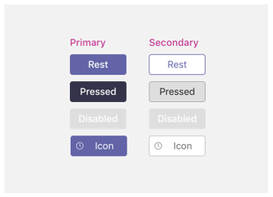

# 移动设备上的选项卡

> [!NOTE]
> 如果你选择让频道/组选项卡显示在 Teams 移动客户端上，则配置必须具有属性值， (`setSettings()` `websiteUrl` 请参阅下面的) 。

自定义选项卡可以是包含静态选项卡和/或一对一自动程序 (应用的频道、群聊或个人应用的一) 。

个人应用在应用箱中的移动客户端上可用。 该应用只能从桌面或 Web 客户端安装，最多可能需要 24 小时才能显示在移动客户端上。

频道选项卡也可在移动设备上使用。 默认行为当前用于在浏览器窗口中启动 `websiteUrl` 选项卡。 但是，可以通过单击选项卡旁边的溢出菜单并选择"打开"（将使用你加载 Teams 移动客户端中的选项卡）在移动客户端上 `...`  `contentUrl` 加载它们。

## 访问个人选项卡

下图显示了如何在移动设备上访问个人选项卡。

:::image type="content" source="../../assets/images/tabs/mobile-app-drawer.png" alt-text="显示 Teams 移动应用箱的图示。" border="false":::

## 访问频道选项卡

下图显示了如何在移动设备上访问频道选项卡。

:::image type="content" source="../../assets/images/tabs/mobile-tab.png" alt-text="显示 Teams 移动选项卡的图示。" border="false":::

## 设计注意事项

我们的移动平台允许应用成为一种沉浸式体验，应用内容将接管 Teams 主导航之外的所有屏幕。 若要创建适合 Teams 的沉浸式体验，请遵循以下指南。

### 响应式设计

由于你的选项卡可以在具有各种屏幕大小的设备上打开，它需要遵循响应式 [设计](https://www.w3schools.com/html/html_responsive.asp) 原则。 所有关键构造都应可以在移动设备上访问，并且不应使视图失真。 确保在移动设备上加载选项卡时，所有按钮和链接都可以通过手指导航轻松访问。

### 布局

为选项卡选择正确的布局非常重要。 应考虑要呈现的信息类型，并选择一种布局来组织该信息，方便使用。 下面概述了一些潜在的选项。

#### 单画布

这是完成工作的一个大区域。 Teams Wiki 应用遵循此模式。 如果你的应用不将内容分为较小的组件，这非常适合。

:::image type="content" source="../../assets/images/tabs/mobile-tab-single-canvas.png" alt-text="显示 Teams 移动单画布选项卡的图示。" border="false":::

#### 列出

列表非常适用于对大量数据进行排序和筛选，并且非常能将最重要的内容放在最上面。 使用可排序列很有用。 可以将操作添加到省略号菜单下的每个列表项。

:::image type="content" source="../../assets/images/tabs/mobile-tab-list.png" alt-text="显示 Teams 移动列表选项卡的图示。" border="false":::

#### 网格

网格对于显示高度可视的元素非常有用。 这有助于在顶部包含筛选器或搜索控件。

:::image type="content" source="../../assets/images/tabs/mobile-tab-grid.png" alt-text="插图显示具有网格布局的 Teams 移动选项卡。" border="false":::

### 使用移动设备上的机器人的选项卡

以下示例是包含选项卡和自动程序的个人应用。

:::image type="content" source="../../assets/images/tabs/mobile-tab-with-bot.png" alt-text="插图显示具有选项卡和自动程序的移动 Teams 应用。" border="false":::

## UI 组件

### 调色板

将已批准的中性调色板用于背景、通知、文本和按钮将有助于你的应用在 Teams 中感觉更加自在。 由于 Teams 移动版具有 (浅色和深色) 主题，因此建议确保你的应用在两者中都外观良好。

#### 浅色

#### 深色

### 按钮和控件

按钮的样式设置有助于传达它们触发的操作类型。 我们维护各种按钮，这些按钮经过格式化以显示不同的强调级别。 按钮可以有文本、图标或文本和图标的组合。 为了传达层次结构中的不同级别，我们设计了每个类别中的主按钮和辅助按钮。

#### 按钮

主按钮和辅助按钮。

#### 选择控件

单选按钮、复选框和切换键。

#### 小红和装饰

### 版式

版式应清晰且有目的。 强调重要信息并避免使用多个字体和大小以减少混淆。 我们建议使用句子大小写，并避免使用全部大写字母进行本地化和易读。

### 字段和飞出

字段是用户可以输入文本的区域。 弹出控件比对话框更轻量，并且从顶部窗格中显示。

#### 列出控件

#### 字段控件

## 开发人员注意事项

生成包含选项卡的应用时，需要考虑 (并测试) 在 Android 和 iOS Microsoft Teams 客户端上的运行方式。 以下各节概述了需要考虑的一些关键方案。

### 在移动客户端上测试

需要验证选项卡在各种大小和质量的移动设备上是否正常工作。 对于 Android 设备，可以在选项卡运行时使用 [DevTools](~/tabs/how-to/developer-tools.md) 调试选项卡。 建议在高性能和低性能设备以及平板电脑上进行测试。

### 身份验证

若要在移动客户端上进行身份验证，必须将 Teams JavaScript SDK 至少升级到版本 1.4.1。

### 低带宽和间歇性连接

移动客户端经常需要在低带宽和间歇性连接下运行。 应用应该通过向用户提供上下文消息来适当地处理任何超时。 您还应使用用户进度指示器，以针对任何长时间运行的过程向用户提供反馈。
