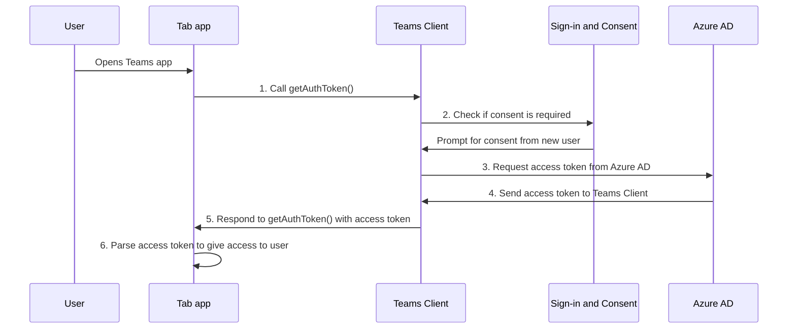

# 为选项卡应用启用 SSO

<!--Single sign-on (SSO) allows a user to access an application or a web service after signing-in only once. The app users never have to go through authentication again.-->

使用 Teams 中的 SSO，应用用户具有使用 Teams 访问应用的优势。 使用 Microsoft 或 Microsoft 365 帐户登录 Teams 后，应用用户可以使用你的应用，而无需再次登录。 你的应用可用于通过 Azure AD 授予访问权限的任何设备上的应用用户。

本部分将介绍以下内容：

1. **SSO 用户体验**：Teams 为应用用户提供真正的 SSO 体验。 应用用户无需再次登录即可使用你的应用。
2. **运行时 Teams 中的 SSO**：选项卡应用在运行时与 Azure AD 交互，以便为应用用户进行一次性身份验证和授权。
3. **为选项卡应用启用 SSO**：执行在选项卡应用中实现 SSO 所涉及的任务。

## Teams 中的 SSO 用户体验

应用用户使用个人 Microsoft 帐户或 Microsoft 365 帐户登录 Teams。 可以利用此功能，并使用 SSO 对应用用户进行身份验证和授权。

&nbsp;&nbsp;&nbsp;&nbsp;:::image type="content" source="../../../assets/images/authentication/teams-sso-tabs/teams-sso-ux.png" alt-text="Teams 选项卡应用中的 SSO 用户体验":::

- Teams 对其应用用户的身份进行身份验证并存储。
- 选项卡应用使用已由 Teams 验证的应用用户的存储标识。
- 应用用户需要同意 Teams 使用标识访问选项卡应用。
- 应用用户可以在 Web、桌面或移动客户端上访问应用。

可在此处查看选项卡应用中 SSO 的用户体验示例：

:::image type="content" source="../../../assets/images/authentication/teams-sso-tabs/sso-tab.gif" alt-text="选项卡应用中的 SSO":::

### 使用 SSO 增强用户体验

下面是应用用户通过 SSO 体验获得的内容：

- Teams 从 Azure AD 获取当前应用用户的访问令牌。 与 Azure AD 的这种交互对应用用户来说是不可见的。 它转换为获取应用访问权限，而无需离开 Teams 环境。
- 应用用户只需在多租户环境中同意。 如果应用用户和应用驻留在同一租户中，则应用用户无需同意使用该应用。
- 首次同意 Teams 后，应用用户可以使用你的应用，而无需进一步的同意，即使在任何其他设备上也是如此。 因此，它提供了更好的用户体验。
  - 或者，租户管理员可以代表应用用户授予同意。 在这种情况下，当租户管理员同意租户中的应用用户时，根本不需要提示应用用户同意。 这意味着应用用户看不到同意对话框，并且可以无缝衔接访问应用。
- Teams 会预先提取访问令牌，以提高 Teams 环境中应用的性能和加载时间。
- 应用用户无需记住或记录多个密码，才能访问和使用 Teams 环境中的应用。

> [!NOTE]
> 应用用户无法授予某些权限范围的权限，例如 `Sites.ReadWrite.All`，允许应用用户读取和写入租户中的所有 SharePoint 和 OneDrive 资产。 对于此类范围，只有租户管理员才能代表应用用户授予同意。

现在，让我们看看在运行时后端发生的情况，以在 Teams 中实现 SSO 体验。

## 运行时 Teams 中的 SSO

通过获取当前登录的 Teams 应用用户的访问令牌，在选项卡应用中实现 SSO。 此过程涉及选项卡应用客户端和服务器、Teams 客户端和 Azure AD。 在此交互过程中，应用用户必须同意使用 Teams 标识在多租户环境中获取访问令牌。

下图显示了当 Teams 应用用户尝试访问选项卡应用时 SSO 的工作原理：

:::image type="content" source="../../../assets/images/authentication/teams-sso-tabs/sso-runtime-seqd.png" alt-text="Tab 单一登录 SSO 关系图" lightbox="../../../assets/images/authentication/teams-sso-tabs/sso-runtime-seqd.png":::

| # | 交互 | 这是怎么回事 |
| --- | --- | --- |
| 1 | 选项卡应用→ Teams 客户端 | 选项卡应用对 JavaScript 进行调用 `getAuthToken()`，告知 Teams 获取访问令牌。 |
| 2 | Teams 客户端→ Azure AD | Teams 基于 Teams 标识请求 Azure AD 终结点为当前应用用户提供访问令牌。 |
| 3 | Azure AD →许可表单 | 如果当前应用用户是第一次使用选项卡应用，则如果应用需要访问一些受保护的数据，Teams 会显示请求提示以表示同意。 应用用户 (或管理员) 必须同意 Teams 使用应用用户的 Teams 标识从 Azure AD 获取访问令牌。   或者，有一个请求提示来处理升级身份验证，例如双因素身份验证。 |
| 4 | Azure AD → Teams 客户端 | Azure AD 将选项卡访问令牌发送到 Teams 客户端。 该令牌是 JSON Web 令牌 (JWT)，这意味着验证方式与大多数标准 OAuth 流中的令牌验证方式类似。 Teams 代表你缓存令牌，以便将来调用 `getAuthToken()` 返回缓存的令牌。 |
| 5 | Teams 客户端→选项卡应用客户端 | Teams 将选项卡访问令牌作为 `getAuthToken()` 调用返回的结果对象的一部分发送到选项卡。 |
| 6  | 选项卡应用（在客户端和服务器之间） | 使用 JavaScript 在选项卡应用程序中分析令牌，以提取所需的信息，例如用户的电子邮件地址。 返回到选项卡应用的令牌既是访问令牌又是标识令牌。 |

有关详细信息，请参阅 [更新代码以启用 SSO](tab-sso-code.md)。

> [!IMPORTANT]
> `getAuthToken()` 仅对一组有限的用户级 API（即电子邮件、配置文件、offline_access、OpenId）的许可有效。 它不用于其他 Graph 范围，如 `User.Read` 或 `Mail.Read`。 有关建议的解决方法，请参阅 [使用 Microsoft Graph 权限扩展应用](tab-sso-graph-api.md)。

选项卡是 Teams 感知的网页。 若要在选项卡应用中托管的网页中启用 SSO，请添加 [Teams Javascript 客户端 SDK](/javascript/api/overview/msteams-client?view=msteams-client-js-latest&preserve-view=true) 并调用 `microsoftTeams.initialize()`。 初始化后，调用 `microsoftTeams.getAuthToken()` 以获取应用的访问令牌。

### 用于启用 SSO 的用例

可以在 Teams 中为支持 Azure AD 作为标识提供者的所有应用启用 SSO。 除了使用 SSO 对选项卡应用中的应用用户进行身份验证外，还可以使用它实现跨 Teams 的无缝访问。

可以使用 SSO API 对应用用户进行身份验证的一些方案包括：

- 如果要对 Teams 选项卡应用中的应用用户进行身份验证，SSO API 允许应用用户在 Teams 中使用应用，而无需进行其他身份验证。 根据应用用户的 Teams 标识，可以从 Azure AD 获取其访问令牌。
- 如果应用使用机器人、选项卡、消息扩展或自适应卡中的任务模块，则可以使用 SSO API 对应用用户进行身份验证。
- 还可以使用 SSO API 对想要访问阶段视图的应用用户进行身份验证，而无需再次进行验证。

> [!TIP]
> 还可以使用 SSO API 对嵌入 Web 内容 的 [任务模块](../../../task-modules-and-cards/what-are-task-modules.md) 中的应用用户进行身份验证。

若要在运行时实现 SSO，请将应用配置为启用 SSO 以对应用用户进行身份验证和授权。

## 为选项卡应用启用 SSO

本部分介绍为选项卡应用实现 SSO 所涉及的任务。 这些任务与语言和框架无关。

若要为选项卡应用启用 SSO，请执行以下操作：

&nbsp;&nbsp;&nbsp;&nbsp;&nbsp;:::image type="content" source="../../../assets/images/authentication/teams-sso-tabs/enable-sso.png" alt-text="为选项卡启用 SSO 的步骤" lightbox="../../../assets/images/authentication/teams-sso-tabs/enable-sso.png":::

1. **注册到 Azure AD**：创建 Azure AD 应用以生成应用 ID 和应用程序 ID URI。 若要生成访问令牌，请配置范围并授权受信任的客户端应用程序。
2. **更新代码**：添加代码以处理访问令牌，在应用用户访问选项卡应用时调用 `getAuthToken()`，将此令牌发送到授权标头中的应用服务器代码，并在收到访问令牌时对其进行验证。
3. **更新 Teams 应用清单**：使用 Azure AD 上生成的应用 ID 和应用程序 ID URI 更新 Teams 客户端应用清单，以允许 Teams 代表应用请求访问令牌。

## iOS 上的第三方 Cookie

iOS 14 更新后，Apple 默认阻止所有应用的 [第三方 Cookie](https://webkit.org/blog/10218/full-third-party-cookie-blocking-and-more/) 访问。 因此，在其“频道”或“聊天”选项卡和个人应用中利用第三方 Cookie 进行身份验证的应用，将无法在 Teams iOS 客户端上完成其身份验证工作流。 若要符合隐私和安全要求，必须转为使用基于令牌的系统，或在用户身份验证工作流程中使用第一方 Cookie。

### Teams 移动客户端支持

对于 Teams 移动版，支持 SSO 的客户端版本为：

- 适用于 Android 的 Teams（1416/1.0.0.2020073101 及更高版本）
- 适用于 iOS 团队（版本：2.0.18 及更高版本）  
- Teams JavaScript SDK（版本：1.11 及更高版本），用于 SSO 在会议侧面板中工作

为获得 Teams 的最佳体验，请使用最新版本的 iOS 和 Android。

## 最佳做法

下面列出了最佳做法：

- **仅在需要时调用访问令牌**：仅在需要访问令牌时调用 `getAuthToken()` 。 当应用用户访问选项卡应用或使用需要应用用户验证的特定函数时，可以调用它。
- **不要在客户端代码上存储访问令牌**：不要在应用的客户端代码中缓存或存储访问令牌。 Teams 客户端缓存访问令牌（如果访问令牌过期，则请求新令牌）。 这可确保 Web 应用不会意外泄漏令牌。
- **对 Microsoft Graph 调用使用服务器端代码**：始终使用服务器端代码进行 Microsoft Graph 调用，或者使用需要传递访问令牌的其他调用。 从不将 OBO 令牌返回到客户端，以允许客户端直接调用 Microsoft Graph。 这有助于保护令牌免受截获或泄露的侵害。 有关详细信息，请参阅 [具有 Microsoft Graph 权限和范围的“扩展”选项卡应用](tab-sso-graph-api.md)。

## 已知限制

- 目前，Teams 中的 SSO 仅支持 OAuth 2.0 令牌。 它不支持 SAML 令牌。
- 当前不支持每个应用多个域。 有关详细信息，请参阅 [LOB 应用](tab-sso-register-aad.md#before-you-register-with-azure-ad)。

## 后续步骤

> [!div class="nextstepaction"]
> [在 Azure AD 中注册选项卡应用程序](tab-sso-register-aad.md)。

## 另请参阅

[配置代码以在选项卡应用中启用 SSO](tab-sso-code.md)

<!--
### Use cases for enabling SSO for tab app

Here are some use cases where enabling SSO is beneficial. Call `getAuthToken()` in these scenarios to use Teams identity for obtaining access token for your app users:

- To get an app user’s identity from Teams if you have an existing app that you want to be available within a tab app in Teams.

- To authenticate an app user by reusing the Team’s identity inside your tab app.

- To authenticate and get an app user’s Teams identity inside configurable tabs. The app users don't need to sign in again. It's applicable to some settings that need to be configured at a configuration stage.

- To obtain an access token inside a task module, when it's invoked from a tab app, a bot app, a messaging extension app, or adaptive cards.

- To authenticate an app user in Stage view.

- To authenticate users for [task modules](../../../task-modules-and-cards/what-are-task-modules.md) that embed web content.
-->

<!--

-->

<!--
- Tenant admin consent: A simple way of [consenting on behalf of an organization as a tenant admin](/azure/active-directory/develop/v2-permissions-and-consent.md#requesting-consent-for-an-entire-tenant) is by getting [consent from admin](/azure/active-directory/manage-apps/grant-admin-consent).
  
    You can ask for consent using the Auth API. Another approach for getting Graph scopes is to present a consent dialog using our existing [third party OAuth provider authentication approach](~/tabs/how-to/authentication/auth-tab-aad.md#navigate-to-the-authorization-page-from-your-pop-up-page). This approach involves popping up an Azure AD consent dialog box.

  

  
To ask for additional consent using the Auth API, follow these steps:

    1. The token retrieved using `getAuthToken()` must be exchanged on the server-side using Azure AD [on-behalf-of flow (OBO)](/azure/active-directory/develop/v2-oauth2-on-behalf-of-flow) to get access to those other Graph APIs. Ensure you use the v2 Graph endpoint for this exchange.
    2. If the exchange fails, Azure AD returns an invalid grant exception. It usually responds with one of the two error messages, `invalid_grant` or `interaction_required`.
    3. When the exchange fails, you must ask for consent. Use the user interface (UI) to ask the app user to grant other consent. This UI must include a button that triggers an Azure AD consent dialog using [Silent authentication](~/concepts/authentication/auth-silent-aad.md).
    4. When asking for more consent from Azure AD, you must include `prompt=consent` in your [query-string-parameter](~/tabs/how-to/authentication/auth-silent-aad.md#get-the-user-context) to Azure AD, otherwise Azure AD wouldn't ask for other scopes.

        - Instead of `?scope={scopes}`, use `?prompt=consent&scope={scopes}`
        - Ensure that `{scopes}` includes all the scopes you're prompting the user for, for example, `Mail.Read` or `User.Read`.
    5. After the app user has granted more permissions, retry the OBO flow to get access to these other APIs.

    

-->
<!--
- If you want your existing app to be available within a Teams tab app, the SSO API allows your signed-in app users to use your app in Teams with no additional authentication needed. Based on the app user's Teams identity, you can obtain access token for them from Azure AD.
- If your app has configurable tabs, you can use `getAuthToken()` to allow app users into the tab app without signing in again. SSO is applicable to some settings that need to be configured at a configuration stage.
- Your app may have a bot, a tab, a message extension, or Adaptive Cards, and allows your app users to invoke task module from within a tab or a bot. The SSO API will authenticate your app users who attempt to access the task module. Teams can use the app user's Teams identity and obtain an access token from Azure AD.

- You can also use the SSO API for authenticating your app users who want to access to Stage view without need to be validated again. The access token obtained for the app user when they first used your app can be used to allow them to use Stage view. -->
