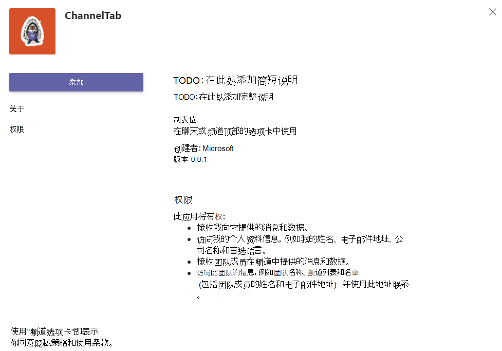
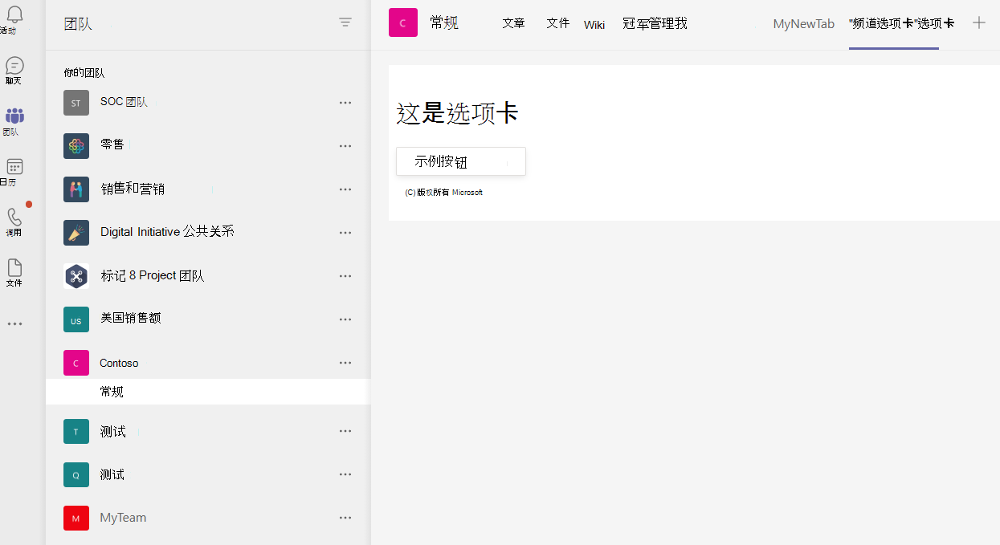
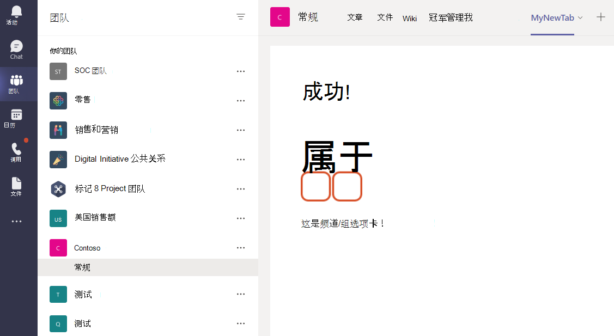

# <a name="create-a-channel-or-group-tab"></a>创建频道或组选项卡

## <a name="create-a-custom-channel-or-group-tab"></a>创建自定义频道或组选项卡

可以使用 Yeoman 生成器 ASP 创建Node.js或组选项卡。NETCore 或 ASP。NETCore MVC。

# <a name="nodejs"></a>[Node.js](#tab/nodejs)

### <a name="create-a-custom-channel-and-group-tab-using-nodejs-and-the-yeoman-generator"></a>使用自定义通道和 Yeoman 生成器Node.js和组选项卡

> [!NOTE]
> 本文遵循 Microsoft OfficeDev GitHub存储库中的生成你的第一个Microsoft Teams[应用程序](https://github.com/OfficeDev/generator-teams/wiki/Build-Your-First-Microsoft-Teams-App) Wiki 中概述的步骤。

可以使用 [Yeoman](https://github.com/OfficeDev/generator-teams/) 生成器创建自定义频道或Teams选项卡。

### <a name="prerequisites-for-apps"></a>应用的先决条件

您必须了解以下先决条件：

- 你必须拥有一个Office 365租户和一个已启用"允许上传 **自定义应用"的团队**。 有关详细信息，请参阅[准备租户Office 365租户](~/concepts/build-and-test/prepare-your-o365-tenant.md)。

    > [!NOTE]
    > 如果当前没有Office 365帐户，可以通过开发人员计划注册Office 365订阅。 只要将订阅用于正在进行的开发，订阅就保持活动状态。 请参阅[欢迎使用 Office 365 开发人员计划](/office/developer-program/microsoft-365-developer-program)。

此外，此项目要求在开发环境中安装以下内容：

- 任何文本编辑器或 IDE。 你可以免费安装和[Microsoft Visual Studio代码](https://code.visualstudio.com/download)。

- [Node.js/npm](https://nodejs.org/en/)。 使用最新的 LTS 版本。 Node 程序包管理器 (npm) 在系统中安装 Node.js。

- 在成功安装 Node.js，在命令提示符中输入以下内容来安装 [Yeoman](https://yeoman.io/) 和 [gulp-cli](https://www.npmjs.com/package/gulp-cli) 程序包：

    ```bash
    npm install yo gulp-cli --global
    ```

- 在命令Microsoft Teams输入以下内容，安装应用生成器：

    ```bash
    npm install generator-teams --global
    ```

### <a name="generate-your-project"></a>生成项目

**生成项目**

1. 在命令提示符下，为选项卡项目创建新目录。

1. 若要启动生成器，请转到新目录并键入以下命令：

    ```bash
    yo teams
    ```

1. 接下来，提供在应用程序的 **manifest.json** 文件中使用的一系列值：

    

    **解决方案名称是什么？**

    这是项目名称。 可以通过选择 Enter 键来 **接受建议的名称** 。

    **要将文件存放在哪里?**

    您当前在项目目录中。 选择 **Enter**。

    **你的Microsoft Teams项目的标题？**

    这是你的应用包名称，将在应用清单和说明中使用。 输入标题或按 **Enter** 接受默认名称。

    **贵公司 () 名称？ (最多 32 个字符)**

    你的公司名称将在应用清单中使用。 输入公司名称或按 **Enter** 接受默认名称。

    **要使用哪个清单版本？**

    选择默认架构。

    **快速基架？ (Y/n)**

    默认值为 yes;输入 **n** 以输入你的 Microsoft 合作伙伴 ID。

    **输入你的 Microsoft 合作伙伴 ID（如果有） (留空可跳过)**

    此字段不是必需的，并且只应在你已是 Microsoft 合作伙伴网络的一 [部分时使用](https://partner.microsoft.com)。

    **要向项目添加哪些内容？**

    选择 **( &ast; ) 选项卡"**。

    **将在其中托管此解决方案的 URL？**

    默认情况下，生成器建议 Azure 网站 URL。 由于你仅在本地测试应用，因此不需要有效的 URL。

    **在应用/选项卡加载时是否显示加载指示器？**

    选择 **在** 应用或选项卡加载时不包括加载指示器。 默认值为"否"，输入 **n**。

   **是否希望在无选项卡标题栏的情况下呈现个人应用?**

    选择 **不包括** 在没有选项卡标题栏的情况下呈现的个人应用。 默认值为"否"，输入 **n**。

    **是否包含测试框架和初始测试？ (y/N)**

    选择 **不包括** 此项目的测试框架。 默认值为 yes;输入 **n**。

    **是否希望将 Azure 应用程序Insights遥测？ (y/N)**

    选择 **不包括** [Azure 应用程序Insights](/azure/azure-monitor/app/app-insights-overview)。 默认值为"否";输入 **n**。

    **默认选项卡名称 (最多包含 16 个字符) ？**

    命名选项卡。此选项卡名称将在整个项目中用作文件或 URL 路径组件。

    **要创建哪种类型的选项卡？**

    使用箭头键选择"可 **配置"** 选项卡。

    **您打算对 Tab 使用哪些范围？**

    可以选择团队或群聊。

    **是否需要Microsoft Azure Active Directory (Azure AD) 选项卡提供单一登录支持？**

    选择 **"** 不要Microsoft Azure Active Directory (Azure AD) 选项卡的"单一登录"支持。默认值为"是"，输入 **n**。

    **是否希望此选项卡在 SharePoint Online 中可用？ (Y/n)**

    输入 **n**。

    > [!IMPORTANT]
    > path component **yourDefaultTabNameTab**， is the value that you entered in the generator for **Default Tab Name** plus the word **Tab**.
    >
    > 例如：DefaultTabName： **MyTab** > **/MyTabTab/**

1. 在Visual Studio Code或任何代码编辑器中，转到项目目录并打开以下文件：

    ```bash
    ./src/app/scripts/<yourDefaultTabNameTab>/<yourDefaultTabNameTab>.tsx
    ```

1. `render()`找到 方法，将以下`<div>`标记和内容添加到容器代码`<PanelBody>`的顶部：

    ```html
        <PanelBody>
            <div style={styles.section}>
                Hello World! Yo Teams rocks!
            </div>
        </PanelBody>
    ```

1. 确保保存更新后的文件。

### <a name="build-and-run-your-application"></a>生成并运行应用程序

在命令提示符下，打开项目目录以完成下一个任务。

#### <a name="create-the-app-package"></a>创建应用包

你必须有一个应用包来测试应用中的Teams。 它是包含以下所需文件的 zip 文件夹：

- 全 **色图标** ，大小为 192 x 192 像素。
- 一 **个** 32 x 32 像素的透明边框图标。
- **一个 manifest.json** 文件，用于指定应用的属性。

程序包通过 gulp 任务创建，该任务验证 manifest.json 文件，并生成 **./package 目录中的 zip 文件夹**。 在命令提示符中，输入以下命令：

```bash
gulp manifest
```

#### <a name="build-your-application"></a>生成应用程序

生成命令将解决方案转换为 **./dist** 文件夹。 在命令提示符中输入以下命令：

```bash
gulp build
```

#### <a name="run-your-application-in-localhost"></a>在 localhost 中运行应用程序

1. 在命令提示符中输入以下内容，以启动本地 Web 服务器：

    ```bash
    gulp serve
    ```

1. Enter `http://localhost:3007/<yourDefaultAppNameTab>/` in your browser， replace **yourDefaultAppNameTab** with your tab name， and view your application's home page as shown in the following image：

    

1. 若要查看选项卡配置页面，请转到 `https://localhost:3007/<yourDefaultAppNameTab>/config.html`。 如下所示：

    

### <a name="establish-a-secure-tunnel-to-your-tab"></a>建立到选项卡的安全隧道

Microsoft Teams是一种基于云的产品，要求使用 HTTPS 终结点从云中提供选项卡内容。 Teams不允许本地托管。 必须将选项卡发布到公用 URL，或使用将本地端口公开到面向 Internet 的 URL 的代理。

若要测试选项卡扩展，请使用内置于此应用程序中的 [ngrok](https://ngrok.com/docs)。 Ngrok 是反向代理软件工具，可创建到本地运行的 Web 服务器的公共 HTTPS 终结点的隧道。 您计算机的当前会话期间提供了您的服务器的 Web 终结点。 当计算机关闭或进入睡眠状态时，服务不再可用。

在命令提示符中，退出 localhost 并输入以下内容：

```bash
gulp ngrok-serve
```

> [!IMPORTANT]
> 将选项卡上载到 Microsoft Teams 并成功保存后，可以在选项卡库中查看它、将其添加到选项卡栏并与其交互，直到 ngrok 隧道会话结束。 如果重新启动 ngrok 会话，则必须使用新 URL 更新应用。

### <a name="upload-your-application-to-teams"></a>Upload应用程序以Teams

**将应用程序上载到Teams**

1. 转到Microsoft Teams。 如果使用基于 [Web 的版本，](https://teams.microsoft.com) 可以使用浏览器的开发人员工具检查前端 [代码](~/tabs/how-to/developer-tools.md)。
1. 在左窗格中的团队中，选择 &#x25CF;&#x25CF;&#x25CF; 测试选项卡的团队旁边的省略号，然后选择" **管理团队"**。
1. 在主窗格中，从选项卡栏中选择"应用"，Upload位于页面右下角的自定义应用。
1. 转到项目目录，浏览到 **./package** 文件夹，选择应用包 zip 文件夹，然后选择"打开 **"**。

    

1. 在 **弹出** 对话框中选择"添加"。 您的选项卡将上载到Teams。
1. 返回到团队，选择要显示➕选项卡的频道，从选项卡栏中选择，然后从库中选择您的选项卡。
1. 按照添加选项卡的说明操作。频道或组选项卡有一个自定义配置对话框。
1. 选择 **"** 保存"，您的选项卡将添加到频道的选项卡栏中。

    

# <a name="aspnet-core"></a>[ASP.NET Core](#tab/aspnetcore)

### <a name="create-a-custom-channel-or-group-tab-with-aspnet-core"></a>使用自定义频道或组选项卡 ASP.NET Core

可以使用"Core 用户"页面C#自定义频道 ASP.Net 组选项卡。 [App Studio for Microsoft Teams](~/concepts/build-and-test/app-studio-overview.md) 还用于完成应用清单，并部署选项卡以Teams。

### <a name="prerequisites-for-teams-apps"></a>应用Teams的先决条件

您必须了解以下先决条件：

- 你必须拥有一个Office 365租户和一个已启用"允许上传 **自定义应用"的团队**。 有关详细信息，请参阅[准备租户Office 365租户](~/concepts/build-and-test/prepare-your-o365-tenant.md)。

    > [!NOTE]
    > 如果当前没有Microsoft 365帐户，可以通过 Microsoft 开发人员计划注册[免费订阅](https://developer.microsoft.com/en-us/microsoft-365/dev-program)。 只要将订阅用于正在进行的开发，订阅就保持活动状态。

- 使用 App Studio 将应用程序导入Teams。 若要安装 App Studio **，请选择**应用左下角的Teams应用，然后搜索 **App Studio**。 找到磁贴后，选择它 **，然后选择弹出** 对话框中的"添加"以安装它。

此外，此项目要求在开发环境中安装以下内容：

- 当前版本的 IDE Visual Studio **.NET CORE 跨平台开发** 工作负载。 如果尚未安装Visual Studio，可以免费下载和安装[Microsoft Visual Studio Community版本。](https://visualstudio.microsoft.com/downloads)

- [ngrok](https://ngrok.com) 反向代理工具。 使用 ngrok 创建到本地运行的 Web 服务器的公开可用的 HTTPS 终结点的隧道。 你可以 [下载 ngrok](https://ngrok.com/download)。

### <a name="get-the-source-code"></a>获取源代码

在命令提示符下，为选项卡项目创建新目录。 提供了一个简单的项目来开始操作。 使用下面的命令将示例存储库克隆到新目录中：

```bash
git clone https://github.com/OfficeDev/microsoft-teams-sample-tabs.git
```

或者，您可以通过下载 zip 文件夹并提取文件来检索源代码。

**生成并运行选项卡项目**

1. 获得源代码后，转到"Visual Studio并选择"**打开项目或解决方案"**。
1. 转到选项卡应用程序目录并打开 **ChannelGroupTab.sln**。
1. 若要生成并运行应用程序，请按 **F5** 或从"调试 **"** 菜单中选择"开始 **调试** "。
1. 在浏览器中，转到以下 URL 并验证应用程序是否加载正确：

    - `http://localhost:44355`
    - `http://localhost:44355/privacy`
    - `http://localhost:44355/tou`

### <a name="review-the-source-code"></a>查看源代码

#### <a name="startupcs"></a>Startup.cs

此项目从一个 ASP.NET Core 2.2 Web 应用程序空模板创建，在设置时选中了"高级 **- 为 HTTPS** 配置"复选框。 MVC 服务由依赖关系注入框架的方法注册 `ConfigureServices()` 。 此外，空模板默认情况下 `Configure()` 不支持为静态内容提供服务，因此，将静态文件中间件添加到 以下代码的方法中：

```csharp
public void ConfigureServices(IServiceCollection services)
  {
    services.AddMvc().SetCompatibilityVersion(CompatibilityVersion.Version_2_2);
  }
public void Configure(IApplicationBuilder app)
  {
    app.UseStaticFiles();
    app.UseMvc();
  }
```

#### <a name="wwwroot-folder"></a>wwwroot 文件夹

在 ASP.NET Core中，Web 根文件夹是应用程序查找静态文件的位置。

#### <a name="indexcshtml"></a>Index.cshtml

ASP.NET Core将名为 **Index** 的文件视为网站的默认页面或主页。 当浏览器 URL 指向网站的根目录时， **Index.cshtml** 将显示为应用程序的主页。

#### <a name="tabcs"></a>Tab.cs

此C#文件包含在配置过程中从 **Tab.cshtml** 调用的方法。

#### <a name="appmanifest-folder"></a>AppManifest 文件夹

此文件夹包含以下所需的应用包文件：

- 全 **色图标** ，大小为 192 x 192 像素。
- 一 **个** 32 x 32 像素的透明边框图标。
- **一个 manifest.json** 文件，用于指定应用的属性。

这些文件需要在应用包中压缩，以用于将选项卡上载到Teams。 当用户选择添加或`configurationUrl`更新选项卡时，Microsoft Teams清单中指定的内容，将其嵌入 IFrame 中，并将其呈现在选项卡中。

#### <a name="csproj"></a>.csproj

在"Visual Studio资源管理器"窗口中，右键单击项目并选择"编辑Project **文件"**。 在文件末尾，你将看到以下代码，该代码在应用程序生成时创建和更新 zip 文件夹：

```xml
<PropertyGroup>
    <PostBuildEvent>powershell.exe Compress-Archive -Path \"$(ProjectDir)AppManifest\*\" -DestinationPath \"$(TargetDir)tab.zip\" -Force</PostBuildEvent>
  </PropertyGroup>

  <ItemGroup>
    <EmbeddedResource Include="AppManifest\icon-outline.png">
      <CopyToOutputDirectory>Always</CopyToOutputDirectory>
    </EmbeddedResource>
    <EmbeddedResource Include="AppManifest\icon-color.png">
      <CopyToOutputDirectory>Always</CopyToOutputDirectory>
    </EmbeddedResource>
    <EmbeddedResource Include="AppManifest\manifest.json">
      <CopyToOutputDirectory>Always</CopyToOutputDirectory>
    </EmbeddedResource>
  </ItemGroup>
```

### <a name="establish-a-secure-tunnel-to-your-tab-for-teams"></a>为选项卡建立安全隧道，以Teams

Microsoft Teams是一种基于云的产品，要求使用 HTTPS 终结点从云中提供选项卡内容。 Teams不允许本地托管。 必须将选项卡发布到公用 URL，或使用向面向 Internet 的 URL 公开本地端口的代理。

若要测试您的选项卡，请使用 [ngrok](https://ngrok.com/docs)。 当 ngrok 正在您的计算机上运行时，您的服务器的 Web 终结点可用。 在 ngrok 的免费版本中，如果您关闭 ngrok，则下次启动 URL 时 URL 会有所不同。

- 在项目目录根目录的命令提示符下，运行以下命令：

    ```bash
    ngrok http https://localhost:44355 -host-header="localhost:44355"
    ```

- Ngrok 侦听来自 Internet 的请求，当应用程序在端口 44355 上运行时，它会将它们路由到您的应用程序。 它应类似于 `https://y8rCgT2b.ngrok.io/` **y8rCgT2b** 替换为 ngrok 字母数字 HTTPS URL。

- 确保使命令提示符保持运行 ngrok，并记下 URL。

### <a name="update-your-application"></a>更新应用程序

在 **Tab.cshtml** 中，应用程序向用户显示两个选项按钮，用于显示带红色或灰色图标的选项卡。 分别选择 **"选择灰色**  **"或**"`saveGray()``saveRed()``settings.setValidityState(true)`选择红色"按钮触发器或 ，设置 并启用配置页上的"保存"按钮。 此代码Teams您已完成配置要求，并且可以继续安装。 设置 的参数 `settings.setSettings` 。 最后， `saveEvent.notifySuccess()` 调用 以指示已成功解析内容 URL。

#### <a name="_layoutcshtml"></a>_Layout.cshtml

若要使选项卡显示在 Teams中，必须包含 **Microsoft Teams JavaScript 客户端 SDK**`microsoftTeams.initialize()`，并包括加载页面后对 的调用。 这是选项卡和客户端Teams的方式：

转到" **共享"** 文件夹，打开 **_Layout.cshtml**，然后向 标记中添加 `<head>` 以下内容：

```html
<script src="https://ajax.aspnetcdn.com/ajax/jQuery/jquery-3.4.1.min.js"></script>
<script src="https://statics.teams.cdn.office.net/sdk/v1.6.0/js/MicrosoftTeams.min.js"></script>
```

> [!IMPORTANT]
> 不要复制并粘贴 `<script src="...">` 此页中的 URL，因为它们不表示最新版本。 若要获取最新版本的 SDK，请始终转到 [Microsoft Teams JavaScript API](https://www.npmjs.com/package/@microsoft/teams-js)。

#### <a name="tabcshtml"></a>Tab.cshtml

**更新 Tab.cshtml**

1. 打开 **选项卡中的 Tab.cshtml** Visual Studio并更新嵌入的 `<script>`。

1. 在脚本顶部，调用 `microsoftTeams.initialize()`。

1. 将每个 `websiteUrl` 函数 `contentUrl` 中的 和 值更新为选项卡的 HTTPS ngrok URL。

    现在，您的代码应包含以下内容， **其中 y8rCgT2b** 替换为您的 ngrok URL：

    ```javascript
        microsoftTeams.initialize();

        let saveGray = () => {
            microsoftTeams.settings.registerOnSaveHandler(function (saveEvent) {
                microsoftTeams.settings.setSettings({
                    websiteUrl: `https://y8rCgT2b.ngrok.io`,
                    contentUrl: `https://y8rCgT2b.ngrok.io/gray/`,
                    entityId: "grayIconTab",
                    suggestedDisplayName: "MyNewTab"
                });
                saveEvent.notifySuccess();
            });
        }

        let saveRed = () => {
            microsoftTeams.settings.registerOnSaveHandler(function (saveEvent) {
                microsoftTeams.settings.setSettings({
                    websiteUrl: `https://y8rCgT2b.ngrok.io`,
                    contentUrl: `https://y8rCgT2b.ngrok.io/red/`,
                    entityId: "redIconTab",
                    suggestedDisplayName: "MyNewTab"
                });
                saveEvent.notifySuccess();
        });
        }
    ```

1. 保存更新的 **Tab.cshtml**。

### <a name="build-and-run-your-application-for-teams"></a>生成并运行应用程序Teams

**构建和运行应用程序**

1. In Visual Studio， press **F5** or choose **Start Debugging** from the **Debug** menu.
1. 通过打开浏览器，然后通过命令提示符窗口中提供的 ngrok HTTPS URL 进入内容页面，验证 **ngrok** 是否正常运行。

> [!TIP]
> 你需要让应用程序在 Visual Studio 和 ngrok 中运行才能完成本文中提供的步骤。 如果需要停止运行应用程序，Visual Studio运行应用程序，请 **保持 ngrok 运行**。 当应用程序在应用程序中重新启动时，它会侦听应用程序请求并Visual Studio。 如果必须重新启动 ngrok 服务，它将返回一个新 URL，并且您必须使用新 URL 更新应用程序。

### <a name="upload-your-tab-for-teams"></a>Upload选项卡进行Teams

> [!NOTE]
> App Studio 可用于编辑 **manifest.json** 文件，将已完成的程序包上传到Teams。 还可以手动编辑 **manifest.json** 文件。 如果这样做，请确保再次生成解决方案以创建要 **tab.zip** 文件。

**使用 App Studio 上传选项卡**

1. 转到Microsoft Teams。 如果使用基于 [Web 的版本，](https://teams.microsoft.com)可以使用浏览器的开发人员工具检查前端 [代码](~/tabs/how-to/developer-tools.md)。

1. 转到 **App Studio** 并选择清单 **编辑器** 选项卡。

1. 在 **清单编辑器中选择** 导入现有 **应用** ，开始更新选项卡的应用包。源代码附带其自己的部分完整清单。 应用包的名称 **tab.zip。** 可从以下路径获得：

    ```bash
    /bin/Debug/netcoreapp2.2/tab.zip
    ```

1. Upload **tab.zip** App Studio。

#### <a name="update-your-app-package-with-manifest-editor"></a>使用清单编辑器更新应用包

将应用包上传到 App Studio 后，必须对其进行配置。

在清单编辑器欢迎页面的右侧面板中选择新导入选项卡的磁贴。

清单编辑器左侧有一个步骤列表，右侧是一个属性列表，其中每个步骤都必须具有值。 大部分信息已由 **manifest.json** 提供，但有些字段必须更新。

##### <a name="details-app-details"></a>详细信息：应用详细信息

在" **应用详细信息"** 部分：

1. 在 **"标识****"下**，选择"生成"以将占位符 ID 替换为选项卡所需的 GUID。

1. 在 **"开发人员信息**" **下，使用** **ngrok** HTTPS URL 更新网站。

1. 在 **"应用程序 URL"** 下`https://<yourngrokurl>/privacy`，将隐私声明更新为 和 **使用条款** 以> `https://<yourngrokurl>/tou` 。

##### <a name="capabilities-tabs"></a>功能：选项卡

在" **选项卡"** 部分：

1. 在" **团队"选项卡** 下，选择" **添加"**。

1. 在" **团队"选项卡** 弹出窗口中，将" **配置 URL"更新** 为 `https://<yourngrokurl>/tab`。

1. 确保 **选中"可以更新配置？"****、团队** 和 **群聊** 复选框，然后选择"保存 **"**。

##### <a name="finish-domains-and-permissions"></a>完成时间：域和权限

在" **域和权限"** 部分， **选项卡** 中的"域"必须包含不带 HTTPS 前缀的 ngrok URL `<yourngrokurl>.ngrok.io/`。

##### <a name="finish-test-and-distribute"></a>完成：测试和分发

> [!IMPORTANT]
> 在右侧，在 **"说明**"中，你将看到以下警告：
>
> &#9888;"**validDomains"数组不能包含隧道站点...**"
>
> 在测试您的选项卡时，可以忽略此警告。

1. 在" **测试和分发"部分** ，选择"安装 **"**。

1. 在弹出对话框中，选择"添加到团队 **"** 或从下拉列表中选择" **添加到聊天"**。

1. 选择要显示选项卡的团队或聊天，然后选择" **设置选项卡"**。

1. 在下一个弹出对话框中， **选择"选择** 灰色"或" **选择红色**"，然后选择"保存 **"**。

1. 若要查看选项卡，请转到安装选项卡的团队或聊天，然后从选项卡栏中选择它。 将显示在配置过程中选择的页面。

    

# <a name="aspnet-core-mvc"></a>[ASP.NET Core MVC](#tab/aspnetcoremvc)

### <a name="create-a-custom-channel-or-group-tab-with-aspnet-core-mvc"></a>使用 MVC 创建自定义频道或 ASP.NET Core选项卡

可以使用核心 MVC 中的自定义频道C#ASP.Net 组选项卡。 [App Studio for Microsoft Teams](~/concepts/build-and-test/app-studio-overview.md) 还用于完成应用清单，并部署选项卡以Teams。

### <a name="prerequisites-for-custom-channel-or-group-tab"></a>自定义频道或组选项卡的先决条件

- 你必须拥有一个Microsoft 365租户和一个启用了允许上传 **自定义应用的团队**。 有关详细信息，请参阅[准备租户Office 365租户](~/concepts/build-and-test/prepare-your-o365-tenant.md)。

    > [!NOTE]
    > 如果当前没有Microsoft 365帐户，可以通过 Microsoft 开发人员计划注册[免费订阅](https://developer.microsoft.com/en-us/microsoft-365/dev-program)。 只要将订阅用于正在进行的开发，订阅就保持活动状态。

- 使用 App Studio 将应用程序导入Teams。 若要安装 App Studio **，请选择**应用左下角的Teams应用，然后搜索 **App Studio**。 找到磁贴后，选择它 **，然后选择弹出** 对话框中的"添加"以安装它。

此外，此项目要求在开发环境中安装以下内容：

- 当前版本的 IDE Visual Studio **.NET CORE 跨平台开发** 工作负载。 如果尚未安装Visual Studio，可以免费下载和安装[Microsoft Visual Studio Community版本。](https://visualstudio.microsoft.com/downloads)

- [ngrok](https://ngrok.com) 反向代理工具。 使用 ngrok 创建到本地运行的 Web 服务器的公开可用的 HTTPS 终结点的隧道。 你可以 [下载 ngrok](https://ngrok.com/download)。

### <a name="get-the-source-code"></a>获取源代码

在命令提示符下，为选项卡项目创建新目录。 提供了一 [个简单的"频道组选项卡](https://github.com/OfficeDev/microsoft-teams-sample-tabs/tree/master/ChannelGroupTabMVC) "项目，方便你入门。 使用下面的命令将示例存储库克隆到新目录中：

```bash
git clone https://github.com/OfficeDev/microsoft-teams-sample-tabs.git
```

或者，您可以通过下载 zip 文件夹并提取文件来检索源代码。

**生成并运行选项卡项目**

1. 获得源代码后，转到"Visual Studio并选择"**打开项目或解决方案"**。
1. 转到选项卡应用程序目录并打开 **ChannelGroupTabMVC.sln**。
1. 若要生成并运行应用程序，请按 **F5** 或从"调试 **"** 菜单中选择"开始 **调试** "。
1. 在浏览器中，导航到以下 URL 并验证应用程序是否加载正确：

    - `http://localhost:44360`
    - `http://localhost:44360/privacy`
    - `http://localhost:44360/tou`

### <a name="review-the-source-code"></a>查看源代码

#### <a name="startupcs"></a>Startup.cs

此项目从一个 ASP.NET Core 2.2 Web 应用程序空模板创建，在设置时选中了"高级 **- 为 HTTPS** 配置"复选框。 MVC 服务由依赖关系注入框架的方法注册 `ConfigureServices()` 。 此外，空模板默认情况下 `Configure()` 不支持为静态内容提供服务，因此，将静态文件中间件添加到 以下代码的方法中：

```csharp
public void ConfigureServices(IServiceCollection services)
  {
    services.AddMvc().SetCompatibilityVersion(CompatibilityVersion.Version_2_2);
  }
public void Configure(IApplicationBuilder app)
  {
    app.UseStaticFiles();
    app.UseMvc();
  }
```

#### <a name="wwwroot-folder"></a>wwwroot 文件夹

在 ASP.NET Core中，Web 根文件夹是应用程序查找静态文件的位置。

#### <a name="appmanifest-folder"></a>AppManifest 文件夹

此文件夹包含以下所需的应用包文件：

- 全 **色图标** ，大小为 192 x 192 像素。
- 一 **个** 32 x 32 像素的透明边框图标。
- **一个 manifest.json** 文件，用于指定应用的属性。

这些文件需要在应用包中压缩，以用于将选项卡上载到Teams。

#### <a name="csproj"></a>.csproj

在"Visual Studio资源管理器"窗口中，右键单击项目并选择"编辑Project **文件"**。 在文件末尾，你将看到以下代码，该代码在应用程序生成时创建和更新 zip 文件夹：

```xml
<PropertyGroup>
    <PostBuildEvent>powershell.exe Compress-Archive -Path \"$(ProjectDir)AppManifest\*\" -DestinationPath \"$(TargetDir)tab.zip\" -Force</PostBuildEvent>
  </PropertyGroup>

  <ItemGroup>
    <EmbeddedResource Include="AppManifest\icon-outline.png">
      <CopyToOutputDirectory>Always</CopyToOutputDirectory>
    </EmbeddedResource>
    <EmbeddedResource Include="AppManifest\icon-color.png">
      <CopyToOutputDirectory>Always</CopyToOutputDirectory>
    </EmbeddedResource>
    <EmbeddedResource Include="AppManifest\manifest.json">
      <CopyToOutputDirectory>Always</CopyToOutputDirectory>
    </EmbeddedResource>
  </ItemGroup>
```

#### <a name="models"></a>模型

**ChannelGroup.cs** 提供 Message 对象和方法，将在配置过程中从控制器调用该对象和方法。

#### <a name="views"></a>视图

这些是 MVC 中 ASP.NET Core视图：

* 主页：ASP.NET Core将名为 **Index** 的文件视为网站的默认或主页。 当浏览器 URL 指向网站的根目录时， **Index.cshtml** 将显示为应用程序的主页。

* Shared：部分视图标记 **_Layout.cshtml** 包含应用程序的整体页面结构和共享的可视元素。 它还将引用Teams库。

#### <a name="controllers"></a>控制器

控制器使用 `ViewBag` 属性将值动态传输给视图。

[!INCLUDE [dotnet-ngrok-intro](~/includes/tabs/dotnet-ngrok-intro.md)]

* 打开项目目录根目录中的命令提示符并运行以下命令：

    ```bash
    ngrok http https://localhost:443560 -host-header="localhost:44360"
    ```

* Ngrok 将侦听来自 Internet 的请求，并且将在应用程序在端口 44355 上运行时将它们路由到您的应用程序。 它应类似于 `https://y8rCgT2b.ngrok.io/` **y8rCgT2b** 替换为 ngrok 字母数字 HTTPS URL。

* 确保使命令提示符保持运行 ngrok，并记下 URL。

### <a name="update-your-application"></a>更新应用程序

在 **Tab.cshtml** 中，应用程序向用户显示两个选项按钮，用于显示带红色或灰色图标的选项卡。 选择"**选择灰色**"或"**选择** 红色"按钮，分别`saveGray()``saveRed()`触发或 ，`settings.setValidityState(true)`设置 并启用配置页上的"保存"按钮。 此代码Teams您已完成配置要求，并且可以继续安装。 保存时，将设置 `settings.setSettings` 的参数。 最后， `saveEvent.notifySuccess()` 调用 以指示已成功解析内容 URL。

[!INCLUDE [dotnet-update-app](~/includes/tabs/dotnet-update-chan-grp-app.md)]

---

## <a name="next-step"></a>后续步骤

> [!div class="nextstepaction"]
> [创建内容页](~/tabs/how-to/create-tab-pages/content-page.md)

## <a name="see-also"></a>另请参阅

* [Teams选项卡](~/tabs/what-are-tabs.md)
* [创建个人选项卡](~/tabs/how-to/create-personal-tab.md)
* [移动设备上的选项卡](~/tabs/design/tabs-mobile.md)
* [具有自适应卡片的生成选项卡](~/tabs/how-to/build-adaptive-card-tabs.md)
* [创建删除页面](~/tabs/how-to/create-tab-pages/removal-page.md)
