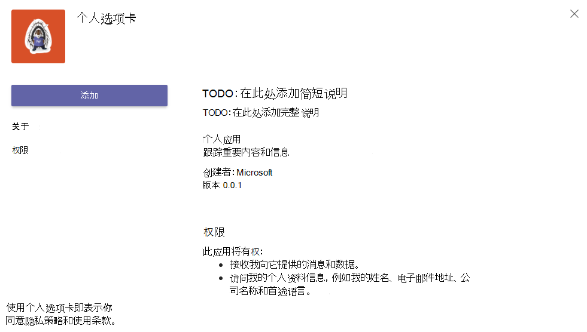
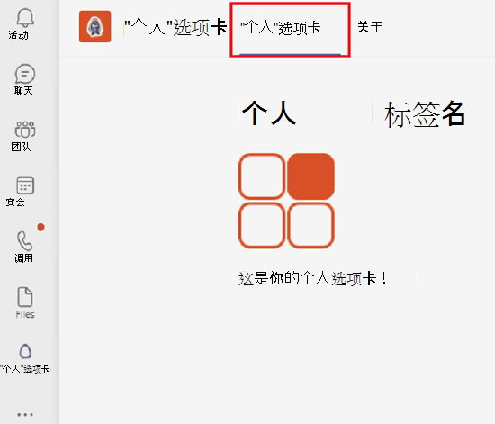
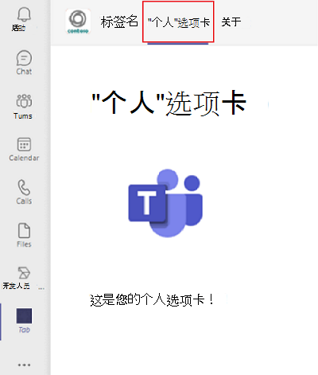

# <a name="create-a-personal-tab"></a>创建个人选项卡

## <a name="create-a-custom-personal-tab"></a>创建自定义个人选项卡

可以使用 Yeoman 生成器、Node.js或 MVC ASP.NET Core个人 ASP.NET Core选项卡。 有关移动版上的Microsoft Teams选项卡，请参阅[移动选项卡](~/tabs/design/tabs-mobile.md)。

# <a name="nodejs"></a>[Node.js](#tab/nodejs)

### <a name="create-a-custom-personal-tab-using-nodejs-and-the-yeoman-generator"></a>使用 Yeoman 生成器Node.js自定义个人选项卡

> [!NOTE]
> 本文遵循在 Microsoft OfficeDev Microsoft Teams存储库中构建第一个 GitHub [App](https://github.com/OfficeDev/generator-teams/wiki/Build-Your-First-Microsoft-Teams-App) Wiki 中概述的步骤。

可以使用 [Yeoman](https://github.com/OfficeDev/generator-teams/wiki/Build-Your-First-Microsoft-Teams-App) 生成器创建自定义个人Teams选项卡。 应用程序也会上载到Teams。

### <a name="prerequisites-for-teams-apps"></a>应用Teams的先决条件

您必须了解以下先决条件：

- 你必须拥有一个Office 365租户和一个已启用"允许上载 **自定义应用"的团队**。 有关详细信息，请参阅[准备租户Office 365租户](~/concepts/build-and-test/prepare-your-o365-tenant.md)。

    > [!NOTE]
    > 如果你没有免费帐户，Office 365开发人员计划注册免费订阅Office 365订阅。 只要将订阅用于正在进行的开发，订阅就保持活动状态。 请参阅[欢迎使用 Office 365 开发人员计划](/office/developer-program/microsoft-365-developer-program)。

此外，此项目要求在开发环境中安装以下内容：

- 任何文本编辑器或 IDE。 你可以免费安装和[Microsoft Visual Studio代码](https://code.visualstudio.com/download)。

- [Node.js/npm](https://nodejs.org/en/)。 使用最新的 LTS 版本。 Node 程序包管理器 (npm) 安装在系统中，同时安装 Node.js。

- 在成功安装 Node.js，在命令提示符中输入以下命令来安装 [Yeoman](https://yeoman.io/) 和 [gulp-cli](https://www.npmjs.com/package/gulp-cli) 程序包：

    ```bash
    npm install yo gulp-cli --global
    ```

- 在命令Microsoft Teams输入以下命令，安装应用程序生成器：

    ```bash
    npm install generator-teams --global
    ```

### <a name="generate-your-project"></a>生成项目

**生成项目**

1. 在命令提示符下，为选项卡项目创建新目录。

1. 若要启动生成器，请转到新目录并输入以下命令：

    ```bash
    yo teams
    ```

1. 接下来，提供在应用程序的 **manifest.json** 文件中使用的一系列值：

    

    **解决方案名称是什么？**

    解决方案名称是项目名称。 可以通过选择 Enter 接受建议 **的名称**。

    **要将文件存放在哪里?**

    您当前在项目目录中。 选择 **Enter**。

    **你的应用Microsoft Teams的标题？**

    标题是你的应用包名称，在应用清单和说明中使用。 输入标题或按 **Enter** 接受默认名称。

    **你的 (公司) 名称？ (最多 32 个字符)**

    你的公司名称将在应用清单中使用。 输入公司名称或按 **Enter** 接受默认名称。

    **要使用哪个清单版本？**

    选择默认架构。

    **快速基架？ (Y/n)**

    默认值为 yes;输入 **n** 以输入你的 Microsoft 合作伙伴 ID。

    **输入你的 Microsoft 合作伙伴 ID（如果有） (保留为空可跳过)**

    此字段不是必需的，并且必须仅在你已是 Microsoft 合作伙伴网络的一 [部分时使用](https://partner.microsoft.com)。

    **要向项目添加哪些内容？**

    选择 **( &ast; ) 选项卡"**。

    **将在其中托管此解决方案的 URL？**

    默认情况下，生成器建议 Azure 网站 URL。 你仅在本地测试应用，因此不需要有效的 URL。

    **在应用/选项卡加载时是否显示加载指示器？**

    选择 **在** 应用或选项卡加载时不包括加载指示器。 默认值为"否"，输入 **n**。

    **是否希望在无选项卡标题栏的情况下呈现个人应用?**

    选择 **不包括** 在没有选项卡标题栏的情况下呈现的个人应用。 默认值为"否"，输入 **n**。

    **是否包含测试框架和初始测试？ (y/N)**

    选择 **不包括** 此项目的测试框架。 默认值为"否"，输入 **n**。

    **是否包含 ESLint 支持？ (y/N)**

    选择不包括 ESLint 支持。 默认值为"否"，输入 **n**。

    **是否希望将 Azure 应用程序Insights遥测？ (y/N)**

    选择 **不包括** [Azure 应用程序Insights](/azure/azure-monitor/app/app-insights-overview)。 默认值为"否";输入 **n**。

    **默认选项卡名称 (最多包含 16) ？**

    命名选项卡。此选项卡名称在整个项目中用作文件或 URL 路径组件。

    **要创建哪种类型的选项卡？**

    使用箭头键选择个人 (**静态)**。

    **是否需要Microsoft Azure Active Directory (Azure AD) 选项卡提供单一登录支持？**

    选择 **"** 不包括Azure AD"选项卡的"单一登录"支持。默认值为"是"，输入 **n**。

    > [!IMPORTANT]
    > path 组件 **yourDefaultTabNameTab** 是在生成器中为 **"默认** 选项卡名称"加上单词 **"Tab**"输入的值。
    >
    > 例如：DefaultTabName： **MyTab** > **/MyTabTab/**

### <a name="add-a-personal-tab"></a>添加个人选项卡

**若要向此应用程序添加个人选项卡，请创建内容页并更新现有文件**

1. 在代码编辑器中，创建一个新的 HTML **personal.html** 并添加以下标记：

    ```html
    <!DOCTYPE html>
    <html>
        <head>
            <meta charset="UTF-8">
            <title>
                <!-- Todo: add your a title here -->
            </title>
            <meta name="viewport" content="width=device-width, initial-scale=1.0">
            <!-- inject:css -->
            <!-- endinject -->
        </head>
            <body>
                <h1>Personal Tab</h1>
                <p></p>
                <p>This is your personal tab!</p>
            </body>
    </html>
    ```

1. 将 **personal.html** 保存在应用程序的 **Web** 文件夹中的以下位置：

    ```bash
    ./src/app/web/<yourDefaultTabNameTab>/personal.html
    ```

1. 从 **代码编辑器中的以下位置打开 manifest.json** ：

    ```bash
    ./src/manifest/manifest.json/
    ```

1. 将以下内容添加到空 `staticTabs` 数组 (`staticTabs":[]`) 并添加以下 JSON 对象：

    ```json
    {
        "entityId": "personalTab",
        "name": "Personal Tab ",
        "contentUrl": "https://{{HOSTNAME}}/<yourDefaultTabNameTab>/personal.html",
        "websiteUrl": "https://{{HOSTNAME}}",
        "scopes": ["personal"]
    }
    ```

1. 使用实际 **选项卡** 名称 **更新 contentURL 路径组件 yourDefaultTabNameTab** 。

1. 保存更新后的 **manifest.json** 文件。

1. 若要在 IFrame 中提供内容页，请从以下路径在代码编辑器中打开 **Tab.ts** ：

    ```bash
    ./src/app/<yourDefaultTabNameTab>/<yourDefaultTabNameTab>.ts
    ```

1. 将以下内容添加到 IFrame 修饰符列表中：

    ```typescript
     @PreventIframe("/<yourDefaultAppName>TabNameTab>/personal.html")
    ```

1. 保存更新的 **Tab.ts** 文件。 您的选项卡代码已完成。

### <a name="build-and-run-your-application"></a>生成并运行应用程序

在命令提示符下，打开项目目录以完成下一个任务。

#### <a name="create-the-app-package"></a>创建应用包

你必须有一个应用包来测试应用中的Teams。 它是包含以下所需文件的 zip 文件夹：

- 全 **色图标** ，大小为 192 x 192 像素。
- 一 **个** 32 x 32 像素的透明边框图标。
- **一个 manifest.json** 文件，用于指定应用的属性。

程序包通过 gulp 任务创建，该任务验证 manifest.json 文件，并生成 **./package 目录中的 zip 文件夹**。 在命令提示符中，输入以下命令：

```bash
gulp manifest
```

#### <a name="build-your-application"></a>生成应用程序

生成命令将解决方案转换为 **./dist** 文件夹。 在命令提示符中输入以下命令：

```bash
gulp build
```

#### <a name="run-your-application-in-localhost"></a>在 localhost 中运行应用程序

1. 在命令提示符中输入以下命令，以启动本地 Web 服务器：

    ```bash
    gulp serve
    ```

1. 在 `http://localhost:3007/<yourDefaultAppNameTab>/` 浏览器中输入 ，将 替换为 `**<yourDefaultAppNameTab>**` 选项卡名称，然后查看应用程序的主页，如下图所示：

    

1. 若要查看你的个人选项卡，请转到 `http://localhost:3007/<yourDefaultAppNameTab>/personal.html`。

    >

### <a name="establish-a-secure-tunnel-to-your-tab"></a>建立到选项卡的安全隧道

Microsoft Teams是一种基于云的产品，要求使用 HTTPS 终结点从云中提供选项卡内容。 Teams不允许本地托管。 将选项卡发布到公用 URL 或使用将本地端口公开到面向 Internet 的 URL 的代理。

若要测试选项卡扩展，请使用内置于此应用程序中的 [ngrok](https://ngrok.com/docs)。 Ngrok 是反向代理软件工具。 Ngrok 为本地运行的 Web 服务器的公开可用 HTTPS 终结点创建一个隧道。 您计算机的当前会话期间提供了您的服务器的 Web 终结点。 当计算机关闭或进入睡眠状态时，服务将不再可用。

在命令提示符中，退出 localhost 并输入以下命令：

```bash
gulp ngrok-serve
```

> [!IMPORTANT]
> 通过 **ngrok** 将选项卡上载到 Microsoft Teams并成功保存后，可以在 Teams 中查看它，直到隧道会话结束。

### <a name="upload-your-application-to-teams"></a>Upload应用程序以Teams

**将应用程序上载到Teams**

1. 转到Microsoft Teams。 如果使用基于 [Web 的版本，](https://teams.microsoft.com)可以使用浏览器的开发人员工具检查前端 [代码](~/tabs/how-to/developer-tools.md)。
1. 从左下角选择"应用 **"**。
1. 从左下角，选择"**Upload应用"**。
1. 转到项目目录，浏览到 **./package** 文件夹，选择 zip 文件夹，然后选择"打开 **"**。

    

1. 在 **弹出** 对话框中选择"添加"。 您的选项卡将上载到Teams。

    

### <a name="view-your-personal-tab"></a>查看个人选项卡

In the navigation bar at the far left in Teams， select ellipses &#x25CF;&#x25CF;&#x25CF; and choose your app.

# <a name="aspnet-core"></a>[ASP.NET Core](#tab/aspnetcore)

### <a name="create-a-custom-personal-tab-using-aspnet-core"></a>使用自定义选项卡创建自定义个人 ASP.NET Core

You can create a custom personal tab using C# and ASP.NET Core 用户页面. [App Studio](~/concepts/build-and-test/app-studio-overview.md) 还用于完成应用清单，并部署选项卡以Teams。

### <a name="prerequisites-for-personal-tab"></a>个人选项卡的先决条件

您必须了解以下先决条件：

- 你必须拥有一个Office 365租户和一个已启用"允许上载 **自定义应用"的团队**。 有关详细信息，请参阅[准备租户Office 365租户](~/concepts/build-and-test/prepare-your-o365-tenant.md)。

    > [!NOTE]
    > 如果你没有用户帐户，Microsoft 365 Microsoft 开发人员计划注册免费[订阅](https://developer.microsoft.com/en-us/microsoft-365/dev-program)。 只要将订阅用于正在进行的开发，订阅就保持活动状态。

- 使用 App Studio 将应用程序导入Teams。 若要安装 App Studio **，请选择**应用左下角的Teams应用，然后搜索 **App Studio**。 找到磁贴后，选择它 **，然后选择弹出** 对话框中的"添加"以安装它。

此外，此项目要求在开发环境中安装以下内容：

- 当前版本的 IDE Visual Studio **.NET CORE 跨平台开发** 工作负载。 如果尚未安装Visual Studio，可以免费下载和安装[Microsoft Visual Studio Community版本。](https://visualstudio.microsoft.com/downloads)

- [ngrok](https://ngrok.com) 反向代理工具。 使用 ngrok 创建到本地运行的 Web 服务器的公开可用 HTTPS 终结点的隧道。 你可以 [下载 ngrok](https://ngrok.com/download)。

### <a name="get-the-source-code"></a>获取源代码

在命令提示符下，为选项卡项目创建新目录。 提供了一个简单的项目来开始操作。 使用下面的命令将示例存储库克隆到新目录中：

```bash
git clone https://github.com/OfficeDev/microsoft-teams-sample-tabs.git
```

或者，您可以通过下载 zip 文件夹并提取文件来检索源代码。

**生成并运行选项卡项目**

1. 获取源代码后，转到"打开Visual Studio并选择"打开 **项目或解决方案"**。
1. 转到选项卡应用程序目录，然后打开 **PersonalTab.sln**。
1. 若要生成并运行应用程序，请按 **F5** 或从"调试 **"** 菜单中选择"开始 **调试** "。
1. 在浏览器中，转到以下 URL 以验证应用程序是否加载正确：

    - `http://localhost:44325/`
    - `http://localhost:44325/personal`
    - `http://localhost:44325/privacy`
    - `http://localhost:44325/tou`

### <a name="review-the-source-code"></a>查看源代码

#### <a name="startupcs"></a>Startup.cs

此项目是使用在安装程序 ASP.NET Core"高级 **- 配置 HTTPS**"复选框的 2.2 Web 应用程序空模板创建的。 MVC 服务由依赖关系注入框架的方法注册 `ConfigureServices()` 。 此外，默认情况下，空 `Configure()` 模板不支持为静态内容提供服务，因此，将静态文件中间件添加到 以下代码的方法中：

```csharp
public void ConfigureServices(IServiceCollection services)
  {
      services.AddMvc().SetCompatibilityVersion(CompatibilityVersion.Version_2_2);
  }
public void Configure(IApplicationBuilder app)
  {
    app.UseStaticFiles();
    app.UseMvc();
  }
```

#### <a name="wwwroot-folder"></a>wwwroot 文件夹

在 ASP.NET Core中，Web 根文件夹是应用程序查找静态文件的位置。

#### <a name="indexcshtml"></a>Index.cshtml

ASP.NET Core将名为 **Index** 的文件视为网站的默认页面或主页。 当浏览器 URL 指向网站的根目录时， **Index.cshtml** 将显示为应用程序的主页。

#### <a name="appmanifest-folder"></a>AppManifest 文件夹

此文件夹包含以下所需的应用包文件：

- 全 **色图标** ，大小为 192 x 192 像素。
- 一 **个** 32 x 32 像素的透明边框图标。
- **一个 manifest.json** 文件，用于指定应用的属性。

必须将这些文件压缩到应用包中，以用于将选项卡上载到Teams。 Microsoft Teams清单`contentUrl`中指定的 ，将其嵌入 <iframe\>，并将其呈现在选项卡中。

#### <a name="csproj"></a>.csproj

在"Visual Studio资源管理器"窗口中，右键单击项目并选择"编辑Project **文件"**。 在文件末尾，你将看到以下代码，该代码在应用程序生成时创建和更新 zip 文件夹：

```xml
<PropertyGroup>
    <PostBuildEvent>powershell.exe Compress-Archive -Path \"$(ProjectDir)AppManifest\*\" -DestinationPath \"$(TargetDir)tab.zip\" -Force</PostBuildEvent>
  </PropertyGroup>

  <ItemGroup>
    <EmbeddedResource Include="AppManifest\icon-outline.png">
      <CopyToOutputDirectory>Always</CopyToOutputDirectory>
    </EmbeddedResource>
    <EmbeddedResource Include="AppManifest\icon-color.png">
      <CopyToOutputDirectory>Always</CopyToOutputDirectory>
    </EmbeddedResource>
    <EmbeddedResource Include="AppManifest\manifest.json">
      <CopyToOutputDirectory>Always</CopyToOutputDirectory>
    </EmbeddedResource>
  </ItemGroup>
```

### <a name="update-your-application-for-teams"></a>更新应用程序以Teams

#### <a name="_layoutcshtml"></a>_Layout.cshtml

若要使选项卡显示在 Teams中，必须包含 **Microsoft Teams JavaScript 客户端 SDK**`microsoftTeams.initialize()`，并包括加载页面后对 的调用。 你的选项卡和Teams应用通过以下方式进行通信：

转到" **共享"** 文件夹，打开 **_Layout.cshtml**，然后向标记部分添加 `<head>` 以下内容：

```html
<script src="https://ajax.aspnetcdn.com/ajax/jQuery/jquery-3.4.1.min.js"></script>
<script src="https://statics.teams.cdn.office.net/sdk/v1.6.0/js/MicrosoftTeams.min.js"></script>
```

#### <a name="personaltabcshtml"></a>PersonalTab.cshtml

打开 **PersonalTab.cshtml** ，然后 `<script>` 通过调用 更新嵌入标记 `microsoftTeams.initialize()`。

确保保存已更新的 **PersonalTab.cshtml**。

### <a name="establish-a-secure-tunnel-to-your-tab-for-teams"></a>为选项卡建立安全隧道，以Teams

Microsoft Teams是一种基于云的产品，要求使用 HTTPS 终结点从云中提供选项卡内容。 Teams不允许本地托管。 将选项卡发布到公用 URL，或使用将本地端口公开到面向 Internet 的 URL 的代理。

若要测试您的选项卡，请使用 [ngrok](https://ngrok.com/docs)。 当 ngrok 正在您的计算机上运行时，您的服务器的 Web 终结点可用。 在 ngrok 的免费版本中，如果您关闭 ngrok，则下次启动 URL 时 URL 会有所不同。

**建立到选项卡的安全隧道**

1. 在项目目录根目录的命令提示符下，运行以下命令：

    ```bash
    ngrok http https://localhost:44325 -host-header="localhost:44325"
    ```

    Ngrok 侦听来自 Internet 的请求，当应用程序在端口 44325 上运行时，会将它们路由到您的应用程序。 它类似于 `https://y8rPrT2b.ngrok.io/` **y8rPrT2b** 替换为 ngrok 字母数字 HTTPS URL。

    确保使命令提示符保持运行 ngrok，并记下 URL。

2. 通过打开浏览器并通过命令提示符窗口中提供的 ngrok HTTPS URL 进入内容页面，验证 **ngrok** 是否正在运行且正常运行。

> [!TIP]
> 你需要让应用程序在 Visual Studio 和 ngrok 中运行才能完成本文中提供的步骤。 如果需要停止运行应用程序，Visual Studio运行应用程序，请 **保持 ngrok 运行**。 当应用程序在应用程序中重新启动时，它会侦听并恢复Visual Studio。 如果您必须重新启动 ngrok 服务，它将返回一个新 URL，并且您必须更新使用该 URL 的每一处。

#### <a name="run-your-application"></a>运行应用程序

In Visual Studio， press **F5** or choose **Start Debugging** from your application's **Debug** menu.

### <a name="upload-your-tab-with-app-studio-for-teams"></a>Upload App Studio for Teams

> [!NOTE]
> **App Studio** 可用于编辑 **manifest.json** 文件，将已完成的程序包上传到Teams。 还可以手动编辑 **manifest.json**。 如果这样做，请确保再次生成解决方案以创建要 **Tab.zip文件。**

**使用 App Studio 上传选项卡**

1. 转到Microsoft Teams。 如果使用基于 [Web 的版本，](https://teams.microsoft.com)可以使用浏览器的开发人员工具检查前端 [代码](~/tabs/how-to/developer-tools.md)。

1. 转到 **App Studio** 并选择清单 **编辑器** 选项卡。

1. 在 **清单编辑器中选择** 导入现有 **应用** ，开始更新选项卡的应用包。源代码附带其自己的部分完整清单。 应用包的名称 **tab.zip。** 可从以下路径获得：

    ```bash
    /bin/Debug/netcoreapp2.2/tab.zip
    ```

1. Upload **tab.zip** **App Studio**。

#### <a name="update-your-app-package-with-manifest-editor"></a>使用清单编辑器更新应用包

将应用包上传到 App Studio 后，必须对其进行配置。

选择清单编辑器欢迎页面的新导入选项卡的磁贴。

清单编辑器左侧有一系列步骤。 在清单编辑器的右侧有一个属性列表，其中每个步骤都必须具有值。 大部分信息已由 **manifest.json** 提供，但有些字段必须更新。

##### <a name="details-app-details"></a>详细信息：应用详细信息

在" **应用详细信息"** 部分：

1. 在 **"标识**" **下，** 选择"生成"以生成应用的新应用 ID。

1. 在 **"开发人员信息**" **下，使用** **ngrok** HTTPS URL 更新网站。

    

1. 在 **"应用程序 URL"** 下`https://<yourngrokurl>/privacy`，将隐私声明更新为 和 **使用条款** 以> `https://<yourngrokurl>/tou` 。

##### <a name="capabilities-tabs"></a>功能：选项卡

在" **选项卡"** 部分：

1. 在 **"添加个人"选项卡下**，选择" **添加"**。 将出现一个弹出对话框。

1. 在"名称"中输入个人选项卡 **的名称**。

1. 输入 **实体 ID**。

1. 使用 **更新内容 URL**`https://<yourngrokurl>/personalTab`。

    将" **网站 URL"** 字段留空。

    

1. 选择“**保存**”。

##### <a name="finish-domains-and-permissions"></a>完成时间：域和权限

在" **域和权限"** 部分， **选项卡** 中的"域"必须包含不带 HTTPS 前缀的 ngrok URL `<yourngrokurl>.ngrok.io/`。

###### <a name="finish-test-and-distribute"></a>完成：测试和分发

> [!IMPORTANT]
> 在右侧，在 **"说明**"中，你将看到以下警告：
>
> &#9888; **"validDomains"数组不能包含隧道站点...**
>
> 在测试您的选项卡时，可以忽略此警告。

1. 在" **测试和分发"部分** ，选择"安装 **"**。

1. 在弹出对话框中，选择" **添加** "，并显示您的选项卡。

    

### <a name="view-your-personal-tab-in-teams"></a>在"页面"中查看Teams

1. 在位于应用最左侧的导航Teams，选择省略号 &#x25CF;&#x25CF;&#x25CF;。 将显示个人应用列表。

1. 从列表中选择您的选项卡进行查看。

# <a name="aspnet-core-mvc"></a>[ASP.NET Core MVC](#tab/aspnetcoremvc)

### <a name="create-a-custom-personal-tab-with-aspnet-core-mvc"></a>使用 MVC 创建自定义 ASP.NET Core选项卡

可以使用自定义个人选项卡和 MVC C#ASP.NET Core选项卡。 [App Studio for Microsoft Teams](~/concepts/build-and-test/app-studio-overview.md) 还用于完成应用清单，并部署选项卡以Teams。

### <a name="prerequisites-for-personal-tab-with-aspnet-core-mvc"></a>使用 MVC 的个人选项卡 ASP.NET Core的先决条件

- 你必须拥有一个Microsoft 365租户和一个已启用"允许上载 **自定义应用"的团队**。 有关详细信息，请参阅[准备租户Office 365租户](~/concepts/build-and-test/prepare-your-o365-tenant.md)。

    > [!NOTE]
    > 如果你没有用户帐户，Microsoft 365 Microsoft 开发人员计划注册免费[订阅](https://developer.microsoft.com/en-us/microsoft-365/dev-program)。 只要将订阅用于正在进行的开发，订阅就保持活动状态。

- 使用 App Studio 将应用程序导入Teams。 若要安装 App Studio **，请选择**应用左下角的Teams应用，然后搜索 **App Studio**。 找到磁贴后，选择它 **，然后选择弹出** 对话框中的"添加"以安装它。

此外，此项目要求在开发环境中安装以下内容：

- 当前版本的 IDE Visual Studio **.NET CORE 跨平台开发** 工作负载。 如果尚未安装Visual Studio，可以免费下载和安装[Microsoft Visual Studio Community版本。](https://visualstudio.microsoft.com/downloads)

- [ngrok](https://ngrok.com) 反向代理工具。 使用 ngrok 创建到本地运行的 Web 服务器的公开可用 HTTPS 终结点的隧道。 你可以 [下载 ngrok](https://ngrok.com/download)。

### <a name="get-the-source-code"></a>获取源代码

在命令提示符下，为选项卡项目创建新目录。 提供了一个简单的项目来开始操作。 使用下面的命令将示例存储库克隆到新目录中：

``` bash
git clone https://github.com/OfficeDev/microsoft-teams-sample-tabs.git
```

或者，您可以通过下载 zip 文件夹并提取文件来检索源代码。

**生成并运行选项卡项目**

1. 获得源代码后，转到"打开Visual Studio并选择"打开 **项目或解决方案"**。
1. 转到选项卡应用程序目录，然后打开 **PersonalTabMVC.sln**。
1. 若要生成并运行应用程序，请按 **F5** 或从"调试 **"** 菜单中选择"开始 **调试** "。
1. 在浏览器中，转到以下 URL 以验证应用程序是否加载正确：

    * `http://localhost:44335`
    * `http://localhost:44335/privacy`
    * `http://localhost:44335/tou`

### <a name="review-the-source-code"></a>查看源代码

#### <a name="startupcs"></a>Startup.cs

此项目是使用在安装程序 ASP.NET Core"高级 **- 配置 HTTPS**"复选框的 2.2 Web 应用程序空模板创建的。 MVC 服务由依赖关系注入框架的方法注册 `ConfigureServices()` 。 此外，默认情况下，空 `Configure()` 模板不支持为静态内容提供服务，因此，将静态文件中间件添加到 以下代码的方法中：

``` csharp
public void ConfigureServices(IServiceCollection services)
  {
    services.AddMvc().SetCompatibilityVersion(CompatibilityVersion.Version_2_2);
  }
public void Configure(IApplicationBuilder app)
  {
    app.UseStaticFiles();
    app.UseMvc();
  }
```

#### <a name="wwwroot-folder"></a>wwwroot 文件夹

在 ASP.NET Core中，Web 根文件夹是应用程序查找静态文件的位置。

#### <a name="appmanifest-folder"></a>AppManifest 文件夹

此文件夹包含以下所需的应用包文件：

* 全 **色图标** ，大小为 192 x 192 像素。
* 一 **个** 32 x 32 像素的透明边框图标。
* **一个 manifest.json** 文件，用于指定应用的属性。

必须将这些文件压缩到应用包中，以用于将选项卡上载到Teams。 Microsoft Teams清单`contentUrl`中指定的内容，将其嵌入 IFrame 中，并将其呈现在选项卡中。

#### <a name="csproj"></a>.csproj

在"Visual Studio资源管理器"窗口中，右键单击项目并选择"编辑Project **文件"**。 在文件末尾，你将看到以下代码，该代码在应用程序生成时创建和更新 zip 文件夹：

``` xml
<PropertyGroup>
    <PostBuildEvent>powershell.exe Compress-Archive -Path \"$(ProjectDir)AppManifest\*\" -DestinationPath \"$(TargetDir)tab.zip\" -Force</PostBuildEvent>
  </PropertyGroup>

  <ItemGroup>
    <EmbeddedResource Include="AppManifest\icon-outline.png">
      <CopyToOutputDirectory>Always</CopyToOutputDirectory>
    </EmbeddedResource>
    <EmbeddedResource Include="AppManifest\icon-color.png">
      <CopyToOutputDirectory>Always</CopyToOutputDirectory>
    </EmbeddedResource>
    <EmbeddedResource Include="AppManifest\manifest.json">
      <CopyToOutputDirectory>Always</CopyToOutputDirectory>
    </EmbeddedResource>
  </ItemGroup>
```

#### <a name="models"></a>模型

**PersonalTab.cs** 提供 Message 对象以及当用户在 PersonalTab 视图中选择按钮时从 **PersonalTabController** **调用** 的方法。

#### <a name="views"></a>视图

这些视图是 MVC 中 ASP.NET Core视图：

* 主页：ASP.NET Core将名为 **Index** 的文件视为网站的默认页面或主页。 当浏览器 URL 指向网站的根目录时， **Index.cshtml** 将显示为应用程序的主页。

* Shared：部分视图标记 **_Layout.cshtml** 包含应用程序的整体页面结构和共享的可视元素。 它还引用Teams库。

#### <a name="controllers"></a>控制器

控制器使用 属性 `ViewBag` 将值动态传输给 Views。

[!INCLUDE [dotnet-update-personal-app](~/includes/tabs/dotnet-update-personal-app.md)]

[!INCLUDE [dotnet-ngrok-intro](~/includes/tabs/dotnet-ngrok-intro.md)]

**运行 ngrok 并验证内容页**

1. 在项目目录根目录的命令提示符下，运行以下命令：

    ``` bash
    ngrok http https://localhost:44345 -host-header="localhost:44345"
    ```

    Ngrok 侦听来自 Internet 的请求，当应用程序在端口 44325 上运行时，会将它们路由到您的应用程序。 它类似于 `https://y8rPrT2b.ngrok.io/` **y8rPrT2b** 替换为 ngrok 字母数字 HTTPS URL。

    确保使命令提示符保持运行 ngrok，并记下 URL。

1. 通过打开浏览器并通过命令提示符窗口中提供的 ngrok HTTPS URL 进入内容页面，验证 **ngrok** 是否正在运行且正常运行。

> [!TIP]
> 你需要让应用程序在 Visual Studio 和 ngrok 中运行才能完成本文中提供的步骤。 如果需要停止运行应用程序，Visual Studio运行应用程序，请 **保持 ngrok 运行**。 当应用程序在应用程序中重新启动时，它会侦听并恢复Visual Studio。 如果您必须重新启动 ngrok 服务，它将返回一个新 URL，并且您必须更新使用该 URL 的每一处。

#### <a name="run-your-application"></a>运行应用程序

In Visual Studio， press **F5** or choose **Start Debugging** from your application's **Debug** menu.

[!INCLUDE [dotnet-personal-use-appstudio](~/includes/tabs/dotnet-personal-use-appstudio.md)]

---

## <a name="reorder-static-personal-tabs"></a>对静态个人选项卡重新排序

从清单版本 1.7 开始，开发人员可以重新排列其个人应用的所有选项卡。 特别是，开发人员可以移动自动程序聊天选项卡，该选项卡始终默认位于个人应用选项卡标题中的任意位置。 声明了`entityId`两个保留的选项卡关键字 **，即对话和****关于**。

如果你创建具有个人范围的自动程序，它将默认出现在个人应用的第一个选项卡位置。 如果要将其移动到其他位置，则必须使用保留的关键字"对话"将静态选项卡对象添加到 **清单** 中。 对话 **选项卡** 显示在 Web 或桌面上，具体取决于在数组中添加对话选项卡`staticTabs`的什么位置。

```json
{
   "staticTabs":[
      {
         
      },
      {
         "entityId":"conversations",
         "scopes":[
            "personal"
         ]
      }
   ]
}
```

## <a name="add-registeronfocused-api-for-tabs-or-personal-apps"></a>为 `registerOnFocused` 选项卡或个人应用添加 API

SDK `registerOnFocused` API 允许你在键盘上Teams。 借助 Ctrl、Shift 和 F6 键，你可以返回到个人应用并保持对选项卡或个人应用的焦点。 例如，你可以离开个人应用来搜索某些内容，然后返回到个人应用或使用 Ctrl+F6 在所需位置四处移动。 

以下代码提供了 SDK 上的处理程序定义 `registerFocusEnterHandler` 示例，当焦点必须返回到选项卡或个人应用时：

```csharp
export function registerFocusEnterHandler(handler: (navigateForward: boolean) => void): 
void {
  HandlersPrivate.focusEnterHandler = handler;
  handler && sendMessageToParent('registerHandler', ['focusEnter']);
}
function handleFocusEnter(navigateForward: boolean): void
 {
  if (HandlersPrivate.focusEnterHandler)
   {
    HandlersPrivate.focusEnterHandler(navigateForward);
  }
}
```

After the handler is triggered with the keyword `focusEnter`， the handler `registerFocusEnterHandler` is invoked with a callback function `focusEnterHandler` that takes in a parameter called `navigateForward`. 的值 `navigateForward` 确定事件的类型。 仅 `focusEnterHandler` 由 Ctrl+F6 调用，而不是由 Tab 键调用。   
键可用于移动事件Teams如下所示：    
* Forward 事件 -> Ctrl+F6 键
* 向后事件 -> Ctrl+Shift+F6 键

```csharp
case 'focusEnter':     
this.registerFocusEnterHandler((navigateForward: boolean = true) => {
this.sdkWindowMessageHandler.sendRequestMessage(this.frame, this.constants.SdkMessageTypes.focusEnter, [navigateForward]);
// Set focus on iframe or webview
if (this.frame && this.frame.sourceElem) {
  this.frame.sourceElem.focus();
}
return true;
});
}

// callback function to be passed to the handler
private focusEnterHandler: (navigateForward: boolean) => boolean;

// function that gets invoked after handler is registered.
private registerFocusEnterHandler(focusEnterHandler: (navigateForward: boolean) => boolean): void {
this.focusEnterHandler = focusEnterHandler;
this.layoutService.registerAppFocusEnterCallback(this.focusEnterHandler);
}
```

### <a name="personal-app"></a>个人应用

:::image type="content" source="../../assets/images/personal-apps/registerfocus.png" alt-text="示例显示用于添加 registerOnFocussed API 的选项" border="false":::

#### <a name="personal-app---forward-event"></a>个人应用 - 转发事件

:::image type="content" source="../../assets/images/personal-apps/registerfocus-forward-event.png" alt-text="示例显示用于添加 registerOnFocussed API 向前移动的选项" border="false":::

#### <a name="personal-app---backward-event"></a>个人应用 - 向后事件

:::image type="content" source="../../assets/images/personal-apps/registerfocus-backward-event.png" alt-text="示例显示用于添加 registerOnFocussed API 向后移动的选项" border="false":::

### <a name="tab"></a>Tab

:::image type="content" source="../../assets/images/personal-apps/registerfocus-tab.png" alt-text="示例显示用于为选项卡添加 registerOnFocussed API 的选项" border="false":::

## <a name="next-step"></a>后续步骤

> [!div class="nextstepaction"]
> [创建频道或组选项卡](~/tabs/how-to/create-channel-group-tab.md)

## <a name="see-also"></a>另请参阅

* [Teams选项卡](~/tabs/what-are-tabs.md)
* [移动设备上的选项卡](~/tabs/design/tabs-mobile.md)
* [具有自适应卡片的生成选项卡](~/tabs/how-to/build-adaptive-card-tabs.md)
* [创建对话选项卡](~/tabs/how-to/conversational-tabs.md)