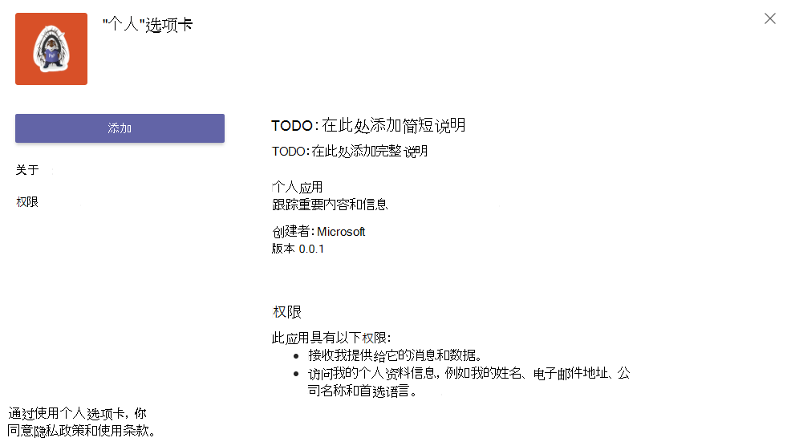
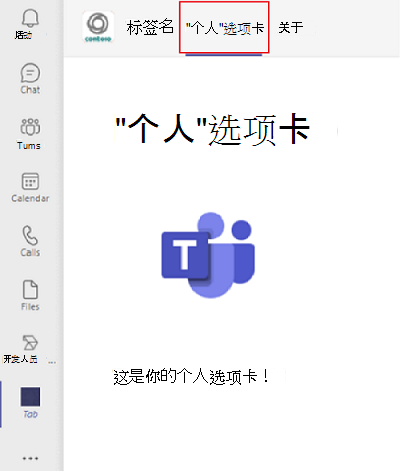

# <a name="create-a-personal-tab"></a><span data-ttu-id="873fc-103">创建个人选项卡</span><span class="sxs-lookup"><span data-stu-id="873fc-103">Create a personal tab</span></span>

## <a name="create-a-custom-personal-tab"></a><span data-ttu-id="873fc-104">创建自定义个人选项卡</span><span class="sxs-lookup"><span data-stu-id="873fc-104">Create a custom personal tab</span></span>

<span data-ttu-id="873fc-105">可以使用 Yeoman 生成器、Node.js或 MVC 创建 ASP.NET Core选项卡 ASP.NET Core选项卡。</span><span class="sxs-lookup"><span data-stu-id="873fc-105">You can create a personal tab using Node.js and the Yeoman Generator, ASP.NET Core, or ASP.NET Core MVC.</span></span>

# <a name="nodejs"></a>[<span data-ttu-id="873fc-106">Node.js</span><span class="sxs-lookup"><span data-stu-id="873fc-106">Node.js</span></span>](#tab/nodejs)

### <a name="create-a-custom-personal-tab-using-nodejs-and-the-yeoman-generator"></a><span data-ttu-id="873fc-107">使用 Yeoman 生成器Node.js自定义个人选项卡</span><span class="sxs-lookup"><span data-stu-id="873fc-107">Create a custom personal tab using Node.js and the Yeoman Generator</span></span>

> [!NOTE]
> <span data-ttu-id="873fc-108">本文遵循在 Microsoft OfficeDev Microsoft Teams[存储库中](https://github.com/OfficeDev/generator-teams/wiki/Build-Your-First-Microsoft-Teams-App)构建第一个 GitHub App Wiki 中概述的步骤。</span><span class="sxs-lookup"><span data-stu-id="873fc-108">This article follows the steps outlined in the [build your first Microsoft Teams app](https://github.com/OfficeDev/generator-teams/wiki/Build-Your-First-Microsoft-Teams-App) Wiki found in the Microsoft OfficeDev GitHub repository.</span></span>

<span data-ttu-id="873fc-109">You can create a custom personal tab using the [Teams Yeoman generator](https://github.com/OfficeDev/generator-teams/wiki/Build-Your-First-Microsoft-Teams-App).</span><span class="sxs-lookup"><span data-stu-id="873fc-109">You can create a custom personal tab using the [Teams Yeoman generator](https://github.com/OfficeDev/generator-teams/wiki/Build-Your-First-Microsoft-Teams-App).</span></span> <span data-ttu-id="873fc-110">应用程序也会上载到Teams。</span><span class="sxs-lookup"><span data-stu-id="873fc-110">The application is also uploaded to Teams.</span></span>

### <a name="prerequisites-for-teams-apps"></a><span data-ttu-id="873fc-111">应用Teams的先决条件</span><span class="sxs-lookup"><span data-stu-id="873fc-111">Prerequisites for Teams apps</span></span>

<span data-ttu-id="873fc-112">您必须了解以下先决条件：</span><span class="sxs-lookup"><span data-stu-id="873fc-112">You must have an understanding of the following prerequisites:</span></span>

- <span data-ttu-id="873fc-113">你必须拥有一个Office 365租户和一个已启用"允许上载 **自定义应用"的团队**。</span><span class="sxs-lookup"><span data-stu-id="873fc-113">You must have an Office 365 tenant and a team configured with **Allow uploading custom apps** enabled.</span></span> <span data-ttu-id="873fc-114">有关详细信息，请参阅[准备你的Office 365租户](~/concepts/build-and-test/prepare-your-o365-tenant.md)。</span><span class="sxs-lookup"><span data-stu-id="873fc-114">For more information, see [prepare your Office 365 tenant](~/concepts/build-and-test/prepare-your-o365-tenant.md).</span></span>

    > [!NOTE]
    > <span data-ttu-id="873fc-115">如果你没有免费帐户，Office 365开发人员计划注册免费订阅Office 365订阅。</span><span class="sxs-lookup"><span data-stu-id="873fc-115">If you do not have an Office 365 account, you can sign up for a free subscription through the Office 365 Developer Program.</span></span> <span data-ttu-id="873fc-116">只要将订阅用于正在进行的开发，订阅就保持活动状态。</span><span class="sxs-lookup"><span data-stu-id="873fc-116">The subscription remains active as long as you are using it for ongoing development.</span></span> <span data-ttu-id="873fc-117">请参阅[欢迎使用 Office 365 开发人员计划](/office/developer-program/microsoft-365-developer-program)。</span><span class="sxs-lookup"><span data-stu-id="873fc-117">See [welcome to the Office 365 Developer Program](/office/developer-program/microsoft-365-developer-program).</span></span>

<span data-ttu-id="873fc-118">此外，此项目要求在开发环境中安装以下内容：</span><span class="sxs-lookup"><span data-stu-id="873fc-118">In addition, this project requires that you have the following installed in your development environment:</span></span>

- <span data-ttu-id="873fc-119">任何文本编辑器或 IDE。</span><span class="sxs-lookup"><span data-stu-id="873fc-119">Any text editor or IDE.</span></span> <span data-ttu-id="873fc-120">你可以免费安装和[Visual Studio Code](https://code.visualstudio.com/download)应用程序。</span><span class="sxs-lookup"><span data-stu-id="873fc-120">You can install and use [Visual Studio Code](https://code.visualstudio.com/download) for free.</span></span>

- <span data-ttu-id="873fc-121">[Node.js/npm](https://nodejs.org/en/)。</span><span class="sxs-lookup"><span data-stu-id="873fc-121">[Node.js/npm](https://nodejs.org/en/).</span></span> <span data-ttu-id="873fc-122">使用最新的 LTS 版本。</span><span class="sxs-lookup"><span data-stu-id="873fc-122">Use the latest LTS version.</span></span> <span data-ttu-id="873fc-123">Node 程序包管理器 (npm) 安装在系统中，并安装 Node.js。</span><span class="sxs-lookup"><span data-stu-id="873fc-123">The Node Package Manager (npm) is installed in your system with the installation of Node.js.</span></span>

- <span data-ttu-id="873fc-124">在成功安装 Node.js，在命令提示符中输入以下内容来安装 [Yeoman](https://yeoman.io/) 和 [gulp-cli](https://www.npmjs.com/package/gulp-cli) 程序包：</span><span class="sxs-lookup"><span data-stu-id="873fc-124">After you have successfully installed Node.js, install the [Yeoman](https://yeoman.io/) and [gulp-cli](https://www.npmjs.com/package/gulp-cli) packages by entering the following in your command prompt:</span></span>

    ```bash
    npm install yo gulp-cli --global
    ```

- <span data-ttu-id="873fc-125">在命令Microsoft Teams输入以下内容，安装应用生成器：</span><span class="sxs-lookup"><span data-stu-id="873fc-125">Install the Microsoft Teams Apps generator by entering the following in your command prompt:</span></span>

    ```bash
    npm install generator-teams --global
    ```

### <a name="generate-your-project"></a><span data-ttu-id="873fc-126">生成项目</span><span class="sxs-lookup"><span data-stu-id="873fc-126">Generate your project</span></span>

<span data-ttu-id="873fc-127">**生成项目**</span><span class="sxs-lookup"><span data-stu-id="873fc-127">**To generate your project**</span></span>

1. <span data-ttu-id="873fc-128">在命令提示符下，为选项卡项目创建新目录。</span><span class="sxs-lookup"><span data-stu-id="873fc-128">At a command prompt, create a new directory for your tab project.</span></span>

1. <span data-ttu-id="873fc-129">若要启动生成器，请转到新目录并输入以下命令：</span><span class="sxs-lookup"><span data-stu-id="873fc-129">To start the generator, go to your new directory and enter the following command:</span></span>

    ```bash
    yo teams
    ```

1. <span data-ttu-id="873fc-130">接下来，提供一系列用于应用程序文件上的 **manifest.js值：**</span><span class="sxs-lookup"><span data-stu-id="873fc-130">Next, provide a series of values that are used in your application's **manifest.json** file:</span></span>

    

    <span data-ttu-id="873fc-132">**你的解决方案名称是什么？**</span><span class="sxs-lookup"><span data-stu-id="873fc-132">**What is your solution name?**</span></span>

    <span data-ttu-id="873fc-133">这是项目名称。</span><span class="sxs-lookup"><span data-stu-id="873fc-133">This is your project name.</span></span> <span data-ttu-id="873fc-134">可以通过选择 Enter 键来 **接受建议的名称** 。</span><span class="sxs-lookup"><span data-stu-id="873fc-134">You can accept the suggested name by selecting the **Enter** key.</span></span>

    <span data-ttu-id="873fc-135">**要将文件存放在哪里?**</span><span class="sxs-lookup"><span data-stu-id="873fc-135">**Where do you want to place the files?**</span></span>

    <span data-ttu-id="873fc-136">您当前在项目目录中。</span><span class="sxs-lookup"><span data-stu-id="873fc-136">You are currently in your project directory.</span></span> <span data-ttu-id="873fc-137">选择 **Enter**。</span><span class="sxs-lookup"><span data-stu-id="873fc-137">Select **Enter**.</span></span>

    <span data-ttu-id="873fc-138">**你的应用Microsoft Teams标题？**</span><span class="sxs-lookup"><span data-stu-id="873fc-138">**Title of your Microsoft Teams app project?**</span></span>

    <span data-ttu-id="873fc-139">这是你的应用包名称，将在应用清单和说明中使用。</span><span class="sxs-lookup"><span data-stu-id="873fc-139">This is your app package name and will be used in the app manifest and description.</span></span> <span data-ttu-id="873fc-140">输入标题或按 **Enter** 接受默认名称。</span><span class="sxs-lookup"><span data-stu-id="873fc-140">Enter a title or select **Enter** to accept the default name.</span></span>

    <span data-ttu-id="873fc-141">**你的 (公司) 名称？ (最多 32 个字符)**</span><span class="sxs-lookup"><span data-stu-id="873fc-141">**Your (company) name? (max 32 characters)**</span></span>

    <span data-ttu-id="873fc-142">你的公司名称将在应用清单中使用。</span><span class="sxs-lookup"><span data-stu-id="873fc-142">Your company name will be used in the app manifest.</span></span> <span data-ttu-id="873fc-143">输入公司名称或选择 **Enter** 接受默认名称。</span><span class="sxs-lookup"><span data-stu-id="873fc-143">Enter a company name or select **Enter** to accept the default name.</span></span>

    <span data-ttu-id="873fc-144">**要使用哪个清单版本？**</span><span class="sxs-lookup"><span data-stu-id="873fc-144">**Which manifest version would you like to use?**</span></span>

    <span data-ttu-id="873fc-145">选择默认架构。</span><span class="sxs-lookup"><span data-stu-id="873fc-145">Select the default schema.</span></span>

    <span data-ttu-id="873fc-146">**快速基架？ (Y/n)**</span><span class="sxs-lookup"><span data-stu-id="873fc-146">**Quick scaffolding? (Y/n)**</span></span>

    <span data-ttu-id="873fc-147">默认值为 yes;输入 **n** 以输入你的 Microsoft 合作伙伴 ID。</span><span class="sxs-lookup"><span data-stu-id="873fc-147">The default is yes; enter **n** to enter your Microsoft Partner Id.</span></span>

    <span data-ttu-id="873fc-148">**输入你的 Microsoft 合作伙伴 ID（如果有） (留空可跳过)**</span><span class="sxs-lookup"><span data-stu-id="873fc-148">**Enter your Microsoft Partner Id, if you have one? (Leave blank to skip)**</span></span>

    <span data-ttu-id="873fc-149">此字段不是必需的，并且应该仅在你已是 Microsoft 合作伙伴网络的一 [部分时使用](https://partner.microsoft.com)。</span><span class="sxs-lookup"><span data-stu-id="873fc-149">This field is not required and should only be used if you are already part of the [Microsoft Partner Network](https://partner.microsoft.com).</span></span>

    <span data-ttu-id="873fc-150">**要向项目添加哪些内容？**</span><span class="sxs-lookup"><span data-stu-id="873fc-150">**What do you want to add to your project?**</span></span>

    <span data-ttu-id="873fc-151">选择 **&ast; () 选项卡"。**</span><span class="sxs-lookup"><span data-stu-id="873fc-151">Select **( &ast; ) A Tab**.</span></span>

    <span data-ttu-id="873fc-152">**将在其中托管此解决方案的 URL？**</span><span class="sxs-lookup"><span data-stu-id="873fc-152">**The URL where you will host this solution?**</span></span>

    <span data-ttu-id="873fc-153">默认情况下，生成器建议 Azure 网站 URL。</span><span class="sxs-lookup"><span data-stu-id="873fc-153">By default the generator suggests an Azure Web Sites URL.</span></span> <span data-ttu-id="873fc-154">由于你仅在本地测试应用，因此不需要有效的 URL。</span><span class="sxs-lookup"><span data-stu-id="873fc-154">You are only testing your app locally, therefore, a valid URL is not necessary.</span></span>

    <span data-ttu-id="873fc-155">**在应用/选项卡加载时是否显示加载指示器？**</span><span class="sxs-lookup"><span data-stu-id="873fc-155">**Would you like show a loading indicator when your app/tab loads?**</span></span>

    <span data-ttu-id="873fc-156">选择 **在** 应用或选项卡加载时不包括加载指示器。</span><span class="sxs-lookup"><span data-stu-id="873fc-156">Choose **not** to include a loading indicator when your app or tab loads.</span></span> <span data-ttu-id="873fc-157">默认值为"否"，输入 **n**。</span><span class="sxs-lookup"><span data-stu-id="873fc-157">The default is no, enter **n**.</span></span>

    <span data-ttu-id="873fc-158">**是否希望在无选项卡标题栏的情况下呈现个人应用?**</span><span class="sxs-lookup"><span data-stu-id="873fc-158">**Would you like personal apps to be rendered without a tab header-bar?**</span></span>

    <span data-ttu-id="873fc-159">选择 **不包括** 在没有选项卡标题栏的情况下呈现的个人应用。</span><span class="sxs-lookup"><span data-stu-id="873fc-159">Choose **not** to include personal apps to be rendered without a tab header-bar.</span></span> <span data-ttu-id="873fc-160">默认值为否，输入 **n**。</span><span class="sxs-lookup"><span data-stu-id="873fc-160">Default is no, enter **n**.</span></span>

    <span data-ttu-id="873fc-161">**是否包含测试框架和初始测试？ (y/N)**</span><span class="sxs-lookup"><span data-stu-id="873fc-161">**Would you like to include Test framework and initial tests? (y/N)**</span></span>

    <span data-ttu-id="873fc-162">选择 **不包括** 此项目的测试框架。</span><span class="sxs-lookup"><span data-stu-id="873fc-162">Choose **not** to include a test framework for this project.</span></span> <span data-ttu-id="873fc-163">默认值为"是"，输入 **n**。</span><span class="sxs-lookup"><span data-stu-id="873fc-163">The default is yes, enter **n**.</span></span>

    <span data-ttu-id="873fc-164">**是否将 Azure 应用程序Insights遥测？ (y/N)**</span><span class="sxs-lookup"><span data-stu-id="873fc-164">**Would you like to use Azure Applications Insights for telemetry? (y/N)**</span></span>

    <span data-ttu-id="873fc-165">选择 **不包括** [Azure 应用程序Insights。](/azure/azure-monitor/app/app-insights-overview)</span><span class="sxs-lookup"><span data-stu-id="873fc-165">Choose **not** to include [Azure Application Insights](/azure/azure-monitor/app/app-insights-overview).</span></span> <span data-ttu-id="873fc-166">默认值为"否";输入 **n**。</span><span class="sxs-lookup"><span data-stu-id="873fc-166">The default is no; enter **n**.</span></span>

    <span data-ttu-id="873fc-167">**默认选项卡名称 (最多为 16 个字符) ？**</span><span class="sxs-lookup"><span data-stu-id="873fc-167">**Default Tab Name (max 16 characters)?**</span></span>

    <span data-ttu-id="873fc-168">命名选项卡。此选项卡名称在整个项目中用作文件或 URL 路径组件。</span><span class="sxs-lookup"><span data-stu-id="873fc-168">Name your tab. This tab name is used throughout your project as a file or URL path component.</span></span>

    <span data-ttu-id="873fc-169">**要创建哪种类型的选项卡？**</span><span class="sxs-lookup"><span data-stu-id="873fc-169">**What kind of Tab would you like to create?**</span></span>

    <span data-ttu-id="873fc-170">使用箭头键选择个人 (**静态) 。**</span><span class="sxs-lookup"><span data-stu-id="873fc-170">Use the arrow keys to select **Personal (static)**.</span></span>

    <span data-ttu-id="873fc-171">**是否需对选项卡提供 Azure AD 单一登录支持？**</span><span class="sxs-lookup"><span data-stu-id="873fc-171">**Do you require Azure AD Single-Sign-On support for the tab?**</span></span>

    <span data-ttu-id="873fc-172">选择 **不包括** 选项卡的 Azure AD 单一登录支持。默认值为"是"，输入 **n**。</span><span class="sxs-lookup"><span data-stu-id="873fc-172">Choose **not** to include Azure AD Single-Sign-On support for the tab. The default is yes, enter **n**.</span></span>

    > [!IMPORTANT]
    > <span data-ttu-id="873fc-173">path component **yourDefaultTabNameTab** is the value that you entered in the generator for **Default Tab Name** plus the word **Tab**.</span><span class="sxs-lookup"><span data-stu-id="873fc-173">The path component **yourDefaultTabNameTab** is the value that you entered in the generator for **Default Tab Name** plus the word **Tab**.</span></span>
    >
    > <span data-ttu-id="873fc-174">例如：DefaultTabName：MyTab   >  **/MyTabTab/**</span><span class="sxs-lookup"><span data-stu-id="873fc-174">For example: DefaultTabName: **MyTab** > **/MyTabTab/**</span></span>

### <a name="add-a-personal-tab"></a><span data-ttu-id="873fc-175">添加个人选项卡</span><span class="sxs-lookup"><span data-stu-id="873fc-175">Add a personal tab</span></span>

<span data-ttu-id="873fc-176">**若要向此应用程序添加个人选项卡，请创建内容页并更新现有文件**</span><span class="sxs-lookup"><span data-stu-id="873fc-176">**To add a personal tab to this application, create a content page, and update existing files**</span></span>

1. <span data-ttu-id="873fc-177">在代码编辑器中，新建 HTML 文件，personal.htm **l** 并添加以下标记：</span><span class="sxs-lookup"><span data-stu-id="873fc-177">In your code editor, create a new HTML file, **personal.html** and add the following markup:</span></span>

    ```html
    <!DOCTYPE html>
    <html>
        <head>
            <meta charset="UTF-8">
            <title>
                <!-- Todo: add your a title here -->
            </title>
            <meta name="viewport" content="width=device-width, initial-scale=1.0">
            <!-- inject:css -->
            <!-- endinject -->
        </head>
            <body>
                <h1>Personal Tab</h1>
                <p></p>
                <p>This is your personal tab!</p>
            </body>
    </html>
    ```

1. <span data-ttu-id="873fc-178">将 **personal.htm** l 保存到应用程序的 **Web** 文件夹中的以下位置：</span><span class="sxs-lookup"><span data-stu-id="873fc-178">Save **personal.html** in your application's **web** folder in the following location:</span></span>

    ```bash
    ./src/app/web/<yourDefaultTabNameTab>/personal.html
    ```

1. <span data-ttu-id="873fc-179">从 **manifest.js** 编辑器中的以下位置打开：</span><span class="sxs-lookup"><span data-stu-id="873fc-179">Open **manifest.json** from the following location in your code editor:</span></span>

    ```bash
    ./src/manifest/manifest.json/
    ```

1. <span data-ttu-id="873fc-180">将以下内容添加到空 `staticTabs` 数组 `staticTabs":[]` () 并添加以下 JSON 对象：</span><span class="sxs-lookup"><span data-stu-id="873fc-180">Add the following to the empty `staticTabs` array (`staticTabs":[]`) and add the following JSON object:</span></span>

    ```json
    {
        "entityId": "personalTab",
        "name": "Personal Tab ",
        "contentUrl": "https://{{HOSTNAME}}/<yourDefaultTabNameTab>/personal.html",
        "websiteUrl": "https://{{HOSTNAME}}",
        "scopes": ["personal"]
    }
    ```

1. <span data-ttu-id="873fc-181">使用实际选项卡名称更新 **contentURL** 路径组件 **yourDefaultTabNameTab。**</span><span class="sxs-lookup"><span data-stu-id="873fc-181">Update the **contentURL** path component **yourDefaultTabNameTab** with your actual tab name.</span></span>

1. <span data-ttu-id="873fc-182">保存更新manifest.js **文件** 。</span><span class="sxs-lookup"><span data-stu-id="873fc-182">Save the updated **manifest.json** file.</span></span>

1. <span data-ttu-id="873fc-183">若要在 IFrame 中提供内容页，请从以下路径在代码编辑器中打开 **Tab.ts：**</span><span class="sxs-lookup"><span data-stu-id="873fc-183">To provide your content page in an IFrame, open **Tab.ts** in your code editor from the following path:</span></span>

    ```bash
    ./src/app/<yourDefaultTabNameTab>/<yourDefaultTabNameTab>.ts
    ```

1. <span data-ttu-id="873fc-184">将以下内容添加到 IFrame 修饰符列表中：</span><span class="sxs-lookup"><span data-stu-id="873fc-184">Add the following to the list of IFrame decorators:</span></span>

    ```typescript
     @PreventIframe("/<yourDefaultAppName>TabNameTab>/personal.html")
    ```

1. <span data-ttu-id="873fc-185">保存更新的 **Tab.ts** 文件。</span><span class="sxs-lookup"><span data-stu-id="873fc-185">Save the updated **Tab.ts** file.</span></span> <span data-ttu-id="873fc-186">您的选项卡代码已完成。</span><span class="sxs-lookup"><span data-stu-id="873fc-186">Your tab code is complete.</span></span>

### <a name="build-and-run-your-application"></a><span data-ttu-id="873fc-187">生成并运行应用程序</span><span class="sxs-lookup"><span data-stu-id="873fc-187">Build and run your application</span></span>

<span data-ttu-id="873fc-188">在命令提示符下，打开项目目录以完成下一个任务。</span><span class="sxs-lookup"><span data-stu-id="873fc-188">At a command prompt, open your project directory to complete the next tasks.</span></span>

#### <a name="create-the-app-package"></a><span data-ttu-id="873fc-189">创建应用包</span><span class="sxs-lookup"><span data-stu-id="873fc-189">Create the app package</span></span>

<span data-ttu-id="873fc-190">你必须有一个应用包来测试应用中的Teams。</span><span class="sxs-lookup"><span data-stu-id="873fc-190">You must have an app package to test your tab in Teams.</span></span> <span data-ttu-id="873fc-191">它是包含以下所需文件的 zip 文件夹：</span><span class="sxs-lookup"><span data-stu-id="873fc-191">It is a zip folder that contains the following required files:</span></span>

- <span data-ttu-id="873fc-192">全 **色图标** ，大小为 192 x 192 像素。</span><span class="sxs-lookup"><span data-stu-id="873fc-192">A **full color icon** measuring 192 x 192 pixels.</span></span>
- <span data-ttu-id="873fc-193">一 **个 32** x 32 像素的透明边框图标。</span><span class="sxs-lookup"><span data-stu-id="873fc-193">A **transparent outline icon** measuring 32 x 32 pixels.</span></span>
- <span data-ttu-id="873fc-194">指定 **manifest.js** 属性的 on 文件。</span><span class="sxs-lookup"><span data-stu-id="873fc-194">A **manifest.json** file that specifies the attributes of your app.</span></span>

<span data-ttu-id="873fc-195">程序包通过 gulp 任务创建，该任务验证文件上的manifest.js，并生成 **./package** 目录中的 zip 文件夹。</span><span class="sxs-lookup"><span data-stu-id="873fc-195">The package is created through a gulp task that validates the manifest.json file and generates the zip folder in the **./package directory**.</span></span> <span data-ttu-id="873fc-196">在命令提示符中，输入以下命令：</span><span class="sxs-lookup"><span data-stu-id="873fc-196">In the command prompt, enter the following command:</span></span>

```bash
gulp manifest
```

#### <a name="build-your-application"></a><span data-ttu-id="873fc-197">生成应用程序</span><span class="sxs-lookup"><span data-stu-id="873fc-197">Build your application</span></span>

<span data-ttu-id="873fc-198">生成命令将解决方案转换为 **./dist** 文件夹。</span><span class="sxs-lookup"><span data-stu-id="873fc-198">The build command transpiles your solution into the **./dist** folder.</span></span> <span data-ttu-id="873fc-199">在命令提示符中输入以下命令：</span><span class="sxs-lookup"><span data-stu-id="873fc-199">Enter the following command in the command prompt:</span></span>

```bash
gulp build
```

#### <a name="run-your-application-in-localhost"></a><span data-ttu-id="873fc-200">在 localhost 中运行应用程序</span><span class="sxs-lookup"><span data-stu-id="873fc-200">Run your application in localhost</span></span>

1. <span data-ttu-id="873fc-201">在命令提示符中输入以下内容，以启动本地 Web 服务器：</span><span class="sxs-lookup"><span data-stu-id="873fc-201">Start a local web server by entering the following in the command prompt:</span></span>

    ```bash
    gulp serve
    ```

1. <span data-ttu-id="873fc-202">`http://localhost:3007/<yourDefaultAppNameTab>/`在浏览器中输入 ，将 替换为选项卡名称，然后查看应用程序的主页 **<yourDefaultAppNameTab>** ，如下图所示：</span><span class="sxs-lookup"><span data-stu-id="873fc-202">Enter `http://localhost:3007/<yourDefaultAppNameTab>/` in your browser, replace **<yourDefaultAppNameTab>** with your tab name, and view your application's home page as shown in the following image:</span></span>

    

1. <span data-ttu-id="873fc-204">若要查看你的个人选项卡，请转到 `http://localhost:3007/<yourDefaultAppNameTab>/personal.html` 。</span><span class="sxs-lookup"><span data-stu-id="873fc-204">To view your personal tab, go to `http://localhost:3007/<yourDefaultAppNameTab>/personal.html`.</span></span>

    >

### <a name="establish-a-secure-tunnel-to-your-tab"></a><span data-ttu-id="873fc-206">建立到选项卡的安全隧道</span><span class="sxs-lookup"><span data-stu-id="873fc-206">Establish a secure tunnel to your tab</span></span>

<span data-ttu-id="873fc-207">Microsoft Teams是一种基于云的产品，要求使用 HTTPS 终结点从云中提供选项卡内容。</span><span class="sxs-lookup"><span data-stu-id="873fc-207">Microsoft Teams is a cloud-based product and requires that your tab content be available from the cloud using HTTPS endpoints.</span></span> <span data-ttu-id="873fc-208">Teams不允许本地托管。</span><span class="sxs-lookup"><span data-stu-id="873fc-208">Teams does not allow local hosting.</span></span> <span data-ttu-id="873fc-209">必须将选项卡发布到公用 URL，或使用将本地端口公开到面向 Internet 的 URL 的代理。</span><span class="sxs-lookup"><span data-stu-id="873fc-209">You must either publish your tab to a public URL or use a proxy that exposes your local port to an internet-facing URL.</span></span>

<span data-ttu-id="873fc-210">若要测试选项卡扩展，可以使用内置于此应用程序中的[ngrok。](https://ngrok.com/docs)</span><span class="sxs-lookup"><span data-stu-id="873fc-210">To test your tab extension, you can use [ngrok](https://ngrok.com/docs), which is built into this application.</span></span> <span data-ttu-id="873fc-211">Ngrok 是反向代理软件工具，可创建到本地运行的 Web 服务器的公共 HTTPS 终结点的隧道。</span><span class="sxs-lookup"><span data-stu-id="873fc-211">Ngrok is a reverse proxy software tool that creates a tunnel to your locally running web server's publicly-available HTTPS endpoints.</span></span> <span data-ttu-id="873fc-212">在计算机的当前会话期间，您的服务器的 Web 终结点可用。</span><span class="sxs-lookup"><span data-stu-id="873fc-212">Your server's web endpoints are available during the current session on your computer.</span></span> <span data-ttu-id="873fc-213">当计算机关闭或进入睡眠状态时，服务将不再可用。</span><span class="sxs-lookup"><span data-stu-id="873fc-213">When the computer is shut down or goes to sleep, the service is no longer available.</span></span>

<span data-ttu-id="873fc-214">在命令提示符中，退出 localhost 并输入以下内容：</span><span class="sxs-lookup"><span data-stu-id="873fc-214">In your command prompt, exit localhost and enter the following:</span></span>

```bash
gulp ngrok-serve
```

> [!IMPORTANT]
> <span data-ttu-id="873fc-215">通过 **ngrok** 将选项卡上传到 Microsoft Teams 并成功保存后，可以在 Teams 中查看它，直到隧道会话结束。</span><span class="sxs-lookup"><span data-stu-id="873fc-215">After your tab has been uploaded to Microsoft Teams through **ngrok**, and successfully saved, you can view it in Teams until your tunnel session ends.</span></span>

### <a name="upload-your-application-to-teams"></a><span data-ttu-id="873fc-216">Upload应用程序以Teams</span><span class="sxs-lookup"><span data-stu-id="873fc-216">Upload your application to Teams</span></span>

<span data-ttu-id="873fc-217">**将应用程序上载到Teams**</span><span class="sxs-lookup"><span data-stu-id="873fc-217">**To upload your application to Teams**</span></span>

1. <span data-ttu-id="873fc-218">转到Microsoft Teams。</span><span class="sxs-lookup"><span data-stu-id="873fc-218">Go to Microsoft Teams.</span></span> <span data-ttu-id="873fc-219">如果使用基于 [Web 的版本，](https://teams.microsoft.com) 可以使用浏览器的开发人员工具检查前端 [代码](~/tabs/how-to/developer-tools.md)。</span><span class="sxs-lookup"><span data-stu-id="873fc-219">If you use the [web-based version](https://teams.microsoft.com) you can inspect your front-end code using your browser's [developer tools](~/tabs/how-to/developer-tools.md).</span></span>
1. <span data-ttu-id="873fc-220">从左下角，**选择应用。**</span><span class="sxs-lookup"><span data-stu-id="873fc-220">From the lower left corner, select **Apps**.</span></span>
1. <span data-ttu-id="873fc-221">从左下角，选择 **"Upload应用"。**</span><span class="sxs-lookup"><span data-stu-id="873fc-221">From the lower left corner, choose **Upload a custom app**.</span></span>
1. <span data-ttu-id="873fc-222">转到项目目录，浏览到 **./package** 文件夹，选择 zip 文件夹，然后选择"打开 **"。**</span><span class="sxs-lookup"><span data-stu-id="873fc-222">Go to your project directory, browse to the **./package** folder, select the zip folder, and choose **Open**.</span></span>

    

1. <span data-ttu-id="873fc-224">在 **弹出** 对话框中选择"添加"。</span><span class="sxs-lookup"><span data-stu-id="873fc-224">Select **Add** in the pop-up dialog box.</span></span> <span data-ttu-id="873fc-225">您的选项卡将上载到Teams。</span><span class="sxs-lookup"><span data-stu-id="873fc-225">Your tab is uploaded to Teams.</span></span>

    

### <a name="view-your-personal-tab"></a><span data-ttu-id="873fc-227">查看个人选项卡</span><span class="sxs-lookup"><span data-stu-id="873fc-227">View your personal tab</span></span>

<span data-ttu-id="873fc-228">在位于网站最左侧的导航Teams，选择省略号 &#x25CF;&#x25CF;&#x25CF; 从列表中选择你的应用。</span><span class="sxs-lookup"><span data-stu-id="873fc-228">In the navigation bar located at the far left in Teams, select the ellipses &#x25CF;&#x25CF;&#x25CF; and choose your app from the list.</span></span>

# <a name="aspnet-core"></a>[<span data-ttu-id="873fc-229">ASP.NET Core</span><span class="sxs-lookup"><span data-stu-id="873fc-229">ASP.NET Core</span></span>](#tab/aspnetcore)

### <a name="create-a-custom-personal-tab-using-aspnet-core"></a><span data-ttu-id="873fc-230">使用自定义选项卡创建自定义 ASP.NET Core</span><span class="sxs-lookup"><span data-stu-id="873fc-230">Create a custom personal tab using ASP.NET Core</span></span>

<span data-ttu-id="873fc-231">You can create a custom personal tab using C# and ASP.NET Core 一页.</span><span class="sxs-lookup"><span data-stu-id="873fc-231">You can create a custom personal tab using C# and ASP.NET Core Razor pages.</span></span> <span data-ttu-id="873fc-232">[App Studio for Microsoft Teams](~/concepts/build-and-test/app-studio-overview.md)还用于完成应用清单，并部署选项卡以Teams。</span><span class="sxs-lookup"><span data-stu-id="873fc-232">[App Studio for Microsoft Teams](~/concepts/build-and-test/app-studio-overview.md) is also used to finalize your app manifest and deploy your tab to Teams.</span></span>

### <a name="prerequisites-for-personal-tab"></a><span data-ttu-id="873fc-233">个人选项卡的先决条件</span><span class="sxs-lookup"><span data-stu-id="873fc-233">Prerequisites for personal tab</span></span>

<span data-ttu-id="873fc-234">您必须了解以下先决条件：</span><span class="sxs-lookup"><span data-stu-id="873fc-234">You must have an understanding of the following prerequisites:</span></span>

- <span data-ttu-id="873fc-235">你必须拥有一个Office 365租户和一个已启用"允许上载 **自定义应用"的团队**。</span><span class="sxs-lookup"><span data-stu-id="873fc-235">You must have an Office 365 tenant and a team configured with **Allow uploading custom apps** enabled.</span></span> <span data-ttu-id="873fc-236">有关详细信息，请参阅[准备你的Office 365租户](~/concepts/build-and-test/prepare-your-o365-tenant.md)。</span><span class="sxs-lookup"><span data-stu-id="873fc-236">For more information, see [prepare your Office 365 tenant](~/concepts/build-and-test/prepare-your-o365-tenant.md).</span></span>

    > [!NOTE]
    > <span data-ttu-id="873fc-237">如果你没有帐户，Microsoft 365 Microsoft 开发人员计划注册免费[订阅](https://developer.microsoft.com/en-us/microsoft-365/dev-program)。</span><span class="sxs-lookup"><span data-stu-id="873fc-237">If you do not have a Microsoft 365 account, you can sign up for a free subscription through the [Microsoft Developer Program](https://developer.microsoft.com/en-us/microsoft-365/dev-program).</span></span> <span data-ttu-id="873fc-238">只要将订阅用于正在进行的开发，订阅就保持活动状态。</span><span class="sxs-lookup"><span data-stu-id="873fc-238">The subscription remains active as long as you are using it for ongoing development.</span></span>

- <span data-ttu-id="873fc-239">使用 App Studio 将应用程序导入Teams。</span><span class="sxs-lookup"><span data-stu-id="873fc-239">Use App Studio to import your application to Teams.</span></span> <span data-ttu-id="873fc-240">若要安装 App Studio，**请选择应用** 左下角的 Teams  应用，然后搜索 **App Studio**。</span><span class="sxs-lookup"><span data-stu-id="873fc-240">To install App Studio, select **Apps**  at the lower left corner of the Teams app, and search for **App Studio**.</span></span> <span data-ttu-id="873fc-241">找到磁贴后，选择它 **，然后选择弹出** 对话框中的"添加"以安装它。</span><span class="sxs-lookup"><span data-stu-id="873fc-241">After you find the tile, select it and choose **Add** in the pop-up dialog box to install it.</span></span>

<span data-ttu-id="873fc-242">此外，此项目要求在开发环境中安装以下内容：</span><span class="sxs-lookup"><span data-stu-id="873fc-242">In addition, this project requires that you have the following installed in your development environment:</span></span>

- <span data-ttu-id="873fc-243">当前版本的 IDE Visual Studio **安装了 .NET CORE 跨平台开发** 工作负载。</span><span class="sxs-lookup"><span data-stu-id="873fc-243">The current version of the Visual Studio IDE with the **.NET CORE cross-platform development** workload installed.</span></span> <span data-ttu-id="873fc-244">如果尚未安装Visual Studio，可以免费下载和安装[Microsoft Visual Studio Community版本。](https://visualstudio.microsoft.com/downloads)</span><span class="sxs-lookup"><span data-stu-id="873fc-244">If you do not already have Visual Studio, you can download and install the latest [Microsoft Visual Studio Community](https://visualstudio.microsoft.com/downloads) version for free.</span></span>

- <span data-ttu-id="873fc-245">[ngrok](https://ngrok.com)反向代理工具。</span><span class="sxs-lookup"><span data-stu-id="873fc-245">The [ngrok](https://ngrok.com) reverse proxy tool.</span></span> <span data-ttu-id="873fc-246">使用 ngrok 创建到本地运行的 Web 服务器的公开可用的 HTTPS 终结点的隧道。</span><span class="sxs-lookup"><span data-stu-id="873fc-246">Use ngrok to create a tunnel to your locally running web server's publicly-available HTTPS endpoints.</span></span> <span data-ttu-id="873fc-247">您可以 [下载 ngrok](https://ngrok.com/download)。</span><span class="sxs-lookup"><span data-stu-id="873fc-247">You can [download ngrok](https://ngrok.com/download).</span></span>

### <a name="get-the-source-code"></a><span data-ttu-id="873fc-248">获取源代码</span><span class="sxs-lookup"><span data-stu-id="873fc-248">Get the source code</span></span>

<span data-ttu-id="873fc-249">在命令提示符下，为选项卡项目创建新目录。</span><span class="sxs-lookup"><span data-stu-id="873fc-249">At a command prompt, create a new directory for your tab project.</span></span> <span data-ttu-id="873fc-250">提供了一个简单的项目来开始操作。</span><span class="sxs-lookup"><span data-stu-id="873fc-250">A simple project is provided to get you started.</span></span> <span data-ttu-id="873fc-251">使用下面的命令将示例存储库克隆到新目录中：</span><span class="sxs-lookup"><span data-stu-id="873fc-251">Clone the sample repository into your new directory using the following command:</span></span>

```bash
git clone https://github.com/OfficeDev/microsoft-teams-sample-tabs.git
```

<span data-ttu-id="873fc-252">或者，您可以通过下载 zip 文件夹并提取文件来检索源代码。</span><span class="sxs-lookup"><span data-stu-id="873fc-252">Alternately, you can retrieve the source code by downloading the zip folder and extracting the files.</span></span>

<span data-ttu-id="873fc-253">**生成并运行选项卡项目**</span><span class="sxs-lookup"><span data-stu-id="873fc-253">**To build and run the tab project**</span></span>

1. <span data-ttu-id="873fc-254">获取源代码后，转到"Visual Studio并选择"打开 **项目或解决方案"。**</span><span class="sxs-lookup"><span data-stu-id="873fc-254">After you get the source code, go to Visual Studio and select **Open a project or solution**.</span></span>
1. <span data-ttu-id="873fc-255">转到选项卡应用程序目录，然后打开 **PersonalTab.sln**。</span><span class="sxs-lookup"><span data-stu-id="873fc-255">Go to the tab application directory and open **PersonalTab.sln**.</span></span>
1. <span data-ttu-id="873fc-256">若要生成并运行应用程序，请按 **F5** 或从"调试 **"** 菜单中选择"开始 **调试** "。</span><span class="sxs-lookup"><span data-stu-id="873fc-256">To build and run your application, press **F5** or choose **Start Debugging** from the **Debug** menu.</span></span>
1. <span data-ttu-id="873fc-257">在浏览器中，转到以下 URL 以验证应用程序是否加载正确：</span><span class="sxs-lookup"><span data-stu-id="873fc-257">In a browser, go to the following URLs to verify the application loaded properly:</span></span>

    - `http://localhost:44325/`
    - `http://localhost:44325/personal`
    - `http://localhost:44325/privacy`
    - `http://localhost:44325/tou`

### <a name="review-the-source-code"></a><span data-ttu-id="873fc-258">查看源代码</span><span class="sxs-lookup"><span data-stu-id="873fc-258">Review the source code</span></span>

#### <a name="startupcs"></a><span data-ttu-id="873fc-259">Startup.cs</span><span class="sxs-lookup"><span data-stu-id="873fc-259">Startup.cs</span></span>

<span data-ttu-id="873fc-260">此项目从 2.2 web 应用程序 ASP.NET Core模板创建，在设置时选中了"高级 **- 为 HTTPS** 配置"复选框。</span><span class="sxs-lookup"><span data-stu-id="873fc-260">This project was created from an ASP.NET Core 2.2 Web Application empty template with the **Advanced - Configure for HTTPS** check box selected at setup.</span></span> <span data-ttu-id="873fc-261">MVC 服务由依赖关系注入框架的方法 `ConfigureServices()` 注册。</span><span class="sxs-lookup"><span data-stu-id="873fc-261">The MVC services are registered by the dependency injection framework's `ConfigureServices()` method.</span></span> <span data-ttu-id="873fc-262">此外，空模板默认情况下不支持为静态内容提供服务，因此，将静态文件中间件添加到 以下 `Configure()` 代码的方法中：</span><span class="sxs-lookup"><span data-stu-id="873fc-262">Additionally, the empty template does not enable serving static content by default, so the static files middleware is added to the `Configure()` method using the following code:</span></span>

```csharp
public void ConfigureServices(IServiceCollection services)
  {
      services.AddMvc().SetCompatibilityVersion(CompatibilityVersion.Version_2_2);
  }
public void Configure(IApplicationBuilder app)
  {
    app.UseStaticFiles();
    app.UseMvc();
  }
```

#### <a name="wwwroot-folder"></a><span data-ttu-id="873fc-263">wwwroot 文件夹</span><span class="sxs-lookup"><span data-stu-id="873fc-263">wwwroot folder</span></span>

<span data-ttu-id="873fc-264">在 ASP.NET Core中，Web 根文件夹是应用程序查找静态文件的位置。</span><span class="sxs-lookup"><span data-stu-id="873fc-264">In ASP.NET Core, the web root folder is where the application looks for static files.</span></span>

#### <a name="indexcshtml"></a><span data-ttu-id="873fc-265">Index.cshtml</span><span class="sxs-lookup"><span data-stu-id="873fc-265">Index.cshtml</span></span>

<span data-ttu-id="873fc-266">ASP.NET Core将名为 **Index** 的文件视为网站的默认页面或主页。</span><span class="sxs-lookup"><span data-stu-id="873fc-266">ASP.NET Core treats files called **Index** as the default or home page for the site.</span></span> <span data-ttu-id="873fc-267">当浏览器 URL 指向网站的根目录时 **，Index.cshtml** 将显示为应用程序的主页。</span><span class="sxs-lookup"><span data-stu-id="873fc-267">When your browser URL points to the root of the site, **Index.cshtml** is displayed as the home page for your application.</span></span>

#### <a name="appmanifest-folder"></a><span data-ttu-id="873fc-268">AppManifest 文件夹</span><span class="sxs-lookup"><span data-stu-id="873fc-268">AppManifest folder</span></span>

<span data-ttu-id="873fc-269">此文件夹包含以下所需的应用包文件：</span><span class="sxs-lookup"><span data-stu-id="873fc-269">This folder contains the following required app package files:</span></span>

- <span data-ttu-id="873fc-270">全 **色图标** ，大小为 192 x 192 像素。</span><span class="sxs-lookup"><span data-stu-id="873fc-270">A **full color icon** measuring 192 x 192 pixels.</span></span>
- <span data-ttu-id="873fc-271">一 **个 32** x 32 像素的透明边框图标。</span><span class="sxs-lookup"><span data-stu-id="873fc-271">A **transparent outline icon** measuring 32 x 32 pixels.</span></span>
- <span data-ttu-id="873fc-272">指定 **manifest.js** 属性的 on 文件。</span><span class="sxs-lookup"><span data-stu-id="873fc-272">A **manifest.json** file that specifies the attributes of your app.</span></span>

<span data-ttu-id="873fc-273">这些文件需要在应用包中压缩，以用于将选项卡上载到Teams。</span><span class="sxs-lookup"><span data-stu-id="873fc-273">These files need to be zipped in an app package for use in uploading your tab to Teams.</span></span> <span data-ttu-id="873fc-274">Microsoft Teams清单中加载指定的 ，将其嵌入 <`contentUrl` iframe 中，并将其 \> 呈现在选项卡中。</span><span class="sxs-lookup"><span data-stu-id="873fc-274">Microsoft Teams loads the `contentUrl` specified in your manifest, embeds it in an <iframe\>, and renders it in your tab.</span></span>

#### <a name="csproj"></a><span data-ttu-id="873fc-275">.csproj</span><span class="sxs-lookup"><span data-stu-id="873fc-275">.csproj</span></span>

<span data-ttu-id="873fc-276">在"Visual Studio资源管理器"窗口中，右键单击项目并选择"编辑Project **文件"。**</span><span class="sxs-lookup"><span data-stu-id="873fc-276">In the Visual Studio Solution Explorer window, right-click on the project and select **Edit Project File**.</span></span> <span data-ttu-id="873fc-277">在文件末尾，你将看到以下代码，该代码在应用程序生成时创建和更新 zip 文件夹：</span><span class="sxs-lookup"><span data-stu-id="873fc-277">At the end of the file, you see the following code that creates and updates your zip folder when the application builds:</span></span>

```xml
<PropertyGroup>
    <PostBuildEvent>powershell.exe Compress-Archive -Path \"$(ProjectDir)AppManifest\*\" -DestinationPath \"$(TargetDir)tab.zip\" -Force</PostBuildEvent>
  </PropertyGroup>

  <ItemGroup>
    <EmbeddedResource Include="AppManifest\icon-outline.png">
      <CopyToOutputDirectory>Always</CopyToOutputDirectory>
    </EmbeddedResource>
    <EmbeddedResource Include="AppManifest\icon-color.png">
      <CopyToOutputDirectory>Always</CopyToOutputDirectory>
    </EmbeddedResource>
    <EmbeddedResource Include="AppManifest\manifest.json">
      <CopyToOutputDirectory>Always</CopyToOutputDirectory>
    </EmbeddedResource>
  </ItemGroup>
```

### <a name="update-your-application-for-teams"></a><span data-ttu-id="873fc-278">更新应用程序Teams</span><span class="sxs-lookup"><span data-stu-id="873fc-278">Update your application for Teams</span></span>

#### <a name="_layoutcshtml"></a><span data-ttu-id="873fc-279">_Layout.cshtml</span><span class="sxs-lookup"><span data-stu-id="873fc-279">_Layout.cshtml</span></span>

<span data-ttu-id="873fc-280">若要在页面中显示选项卡Teams，必须包含 **Microsoft Teams JavaScript** 客户端 SDK，并包括页面加载 `microsoftTeams.initialize()` 后对 的调用。</span><span class="sxs-lookup"><span data-stu-id="873fc-280">For your tab to display in Teams, you must include the **Microsoft Teams JavaScript client SDK** and include a call to `microsoftTeams.initialize()` after your page loads.</span></span> <span data-ttu-id="873fc-281">这是选项卡与应用Teams方式：</span><span class="sxs-lookup"><span data-stu-id="873fc-281">This is how your tab and the Teams app communicate:</span></span>

<span data-ttu-id="873fc-282">转到" **共享"** 文件夹，打开 **_Layout.cshtml，** 然后向 `<head>` 标记部分添加以下内容：</span><span class="sxs-lookup"><span data-stu-id="873fc-282">Go to the **Shared** folder, open **_Layout.cshtml**, and add the following to the `<head>` tags section:</span></span>

```html
<script src="https://ajax.aspnetcdn.com/ajax/jQuery/jquery-3.4.1.min.js"></script>
<script src="https://statics.teams.cdn.office.net/sdk/v1.6.0/js/MicrosoftTeams.min.js"></script>
```

#### <a name="personaltabcshtml"></a><span data-ttu-id="873fc-283">PersonalTab.cshtml</span><span class="sxs-lookup"><span data-stu-id="873fc-283">PersonalTab.cshtml</span></span>

<span data-ttu-id="873fc-284">打开 **PersonalTab.cshtml，** 然后通过调用 `<script>` 更新嵌入标记 `microsoftTeams.initialize()` 。</span><span class="sxs-lookup"><span data-stu-id="873fc-284">Open **PersonalTab.cshtml** and update the embedded `<script>` tags by calling `microsoftTeams.initialize()`.</span></span>

<span data-ttu-id="873fc-285">确保保存已更新的 **PersonalTab.cshtml**。</span><span class="sxs-lookup"><span data-stu-id="873fc-285">Ensure you save your updated **PersonalTab.cshtml**.</span></span>

### <a name="establish-a-secure-tunnel-to-your-tab-for-teams"></a><span data-ttu-id="873fc-286">为选项卡建立安全隧道，以Teams</span><span class="sxs-lookup"><span data-stu-id="873fc-286">Establish a secure tunnel to your tab for Teams</span></span>

<span data-ttu-id="873fc-287">Microsoft Teams是一种基于云的产品，要求使用 HTTPS 终结点从云中提供选项卡内容。</span><span class="sxs-lookup"><span data-stu-id="873fc-287">Microsoft Teams is a cloud-based product and requires that your tab content be available from the cloud using HTTPS endpoints.</span></span> <span data-ttu-id="873fc-288">Teams不允许本地托管。</span><span class="sxs-lookup"><span data-stu-id="873fc-288">Teams does not allow local hosting.</span></span> <span data-ttu-id="873fc-289">必须将选项卡发布到公用 URL，或使用向面向 Internet 的 URL 公开本地端口的代理。</span><span class="sxs-lookup"><span data-stu-id="873fc-289">You must either publish your tab to a public URL, or use a proxy that exposes your local port to an internet-facing URL.</span></span>

<span data-ttu-id="873fc-290">若要测试您的选项卡，请使用 [ngrok](https://ngrok.com/docs)。</span><span class="sxs-lookup"><span data-stu-id="873fc-290">To test your tab, use [ngrok](https://ngrok.com/docs).</span></span> <span data-ttu-id="873fc-291">当 ngrok 正在您的计算机上运行时，您的服务器的 Web 终结点可用。</span><span class="sxs-lookup"><span data-stu-id="873fc-291">Your server's web endpoints are available while ngrok is running on your computer.</span></span> <span data-ttu-id="873fc-292">在 ngrok 的免费版本中，如果您关闭 ngrok，则下次启动 URL 时 URL 会有所不同。</span><span class="sxs-lookup"><span data-stu-id="873fc-292">In the free version of ngrok, if you close ngrok, the URLs are different the next time you start it.</span></span>

<span data-ttu-id="873fc-293">**建立到选项卡的安全隧道**</span><span class="sxs-lookup"><span data-stu-id="873fc-293">**To establish a secure tunnel to your tab**</span></span>

1. <span data-ttu-id="873fc-294">在项目目录根目录的命令提示符下，运行以下命令：</span><span class="sxs-lookup"><span data-stu-id="873fc-294">At a command prompt in the root of your project directory, run the following command:</span></span>

    ```bash
    ngrok http https://localhost:44325 -host-header="localhost:44325"
    ```

    <span data-ttu-id="873fc-295">Ngrok 侦听来自 Internet 的请求，当应用程序在端口 44325 上运行时，它会将它们路由到您的应用程序。</span><span class="sxs-lookup"><span data-stu-id="873fc-295">Ngrok listens to requests from the internet and routes them to your application when it is running on port 44325.</span></span> <span data-ttu-id="873fc-296">它类似于 `https://y8rPrT2b.ngrok.io/` **y8rPrT2b** 替换为 ngrok 字母数字 HTTPS URL。</span><span class="sxs-lookup"><span data-stu-id="873fc-296">It resembles `https://y8rPrT2b.ngrok.io/` where **y8rPrT2b** is replaced by your ngrok alpha-numeric HTTPS URL.</span></span>

    <span data-ttu-id="873fc-297">确保使命令提示符保持运行 ngrok，并记下 URL。</span><span class="sxs-lookup"><span data-stu-id="873fc-297">Ensure that you keep the command prompt with ngrok running, and make a note of the URL.</span></span>

2. <span data-ttu-id="873fc-298">通过打开浏览器并通过命令提示符窗口中提供的 ngrok HTTPS URL 进入内容页面，验证 **ngrok** 是否正在运行且正常运行。</span><span class="sxs-lookup"><span data-stu-id="873fc-298">Verify that **ngrok** is running and working properly by opening your browser and going to your content page through the ngrok HTTPS URL that was provided in your command prompt window.</span></span>

> [!TIP]
> <span data-ttu-id="873fc-299">你需要让应用程序在 Visual Studio 和 ngrok 中运行才能完成本文中提供的步骤。</span><span class="sxs-lookup"><span data-stu-id="873fc-299">You need to have both your application in Visual Studio and ngrok running to complete the steps provided in this article.</span></span> <span data-ttu-id="873fc-300">如果需要停止运行应用程序，Visual Studio运行应用程序，请 **保持 ngrok 运行**。</span><span class="sxs-lookup"><span data-stu-id="873fc-300">If you need to stop running your application in Visual Studio to work on it, **keep ngrok running**.</span></span> <span data-ttu-id="873fc-301">当应用程序在应用程序中重新启动时，它会侦听并恢复Visual Studio。</span><span class="sxs-lookup"><span data-stu-id="873fc-301">It listens and resumes routing your application's request when it restarts in Visual Studio.</span></span> <span data-ttu-id="873fc-302">如果您必须重新启动 ngrok 服务，它将返回一个新 URL，并且您必须更新使用该 URL 的每一处。</span><span class="sxs-lookup"><span data-stu-id="873fc-302">If you have to restart the ngrok service, it returns a new URL and you have to update every place that uses that URL.</span></span>

#### <a name="run-your-application"></a><span data-ttu-id="873fc-303">运行应用程序</span><span class="sxs-lookup"><span data-stu-id="873fc-303">Run your application</span></span>

<span data-ttu-id="873fc-304">In Visual Studio， press **F5** or choose **Start Debugging** from your application's **Debug** menu.</span><span class="sxs-lookup"><span data-stu-id="873fc-304">In Visual Studio, press **F5** or choose **Start Debugging** from your application's **Debug** menu.</span></span>

### <a name="upload-your-tab-with-app-studio-for-teams"></a><span data-ttu-id="873fc-305">Upload App Studio for Teams</span><span class="sxs-lookup"><span data-stu-id="873fc-305">Upload your tab with App Studio for Teams</span></span>

> [!NOTE]
> <span data-ttu-id="873fc-306">**App Studio** 可用于编辑文件上的manifest.js，以及将已完成的程序包上传到Teams。</span><span class="sxs-lookup"><span data-stu-id="873fc-306">**App Studio** can be used to edit your **manifest.json** file and upload the completed package to Teams.</span></span> <span data-ttu-id="873fc-307">还可以在 上手动 **manifest.js文件**。</span><span class="sxs-lookup"><span data-stu-id="873fc-307">You can also manually edit **manifest.json**.</span></span> <span data-ttu-id="873fc-308">如果这样做，请确保再次生成解决方案以创建要 **Tab.zip文件。**</span><span class="sxs-lookup"><span data-stu-id="873fc-308">If you do, ensure that you build the solution again to create the **Tab.zip** file to upload.</span></span>

<span data-ttu-id="873fc-309">**使用 App Studio 上传选项卡**</span><span class="sxs-lookup"><span data-stu-id="873fc-309">**To upload your tab with App Studio**</span></span>

1. <span data-ttu-id="873fc-310">转到Microsoft Teams。</span><span class="sxs-lookup"><span data-stu-id="873fc-310">Go to Microsoft Teams.</span></span> <span data-ttu-id="873fc-311">如果使用基于 [Web 的版本，](https://teams.microsoft.com)可以使用浏览器的开发人员工具检查前端 [代码](~/tabs/how-to/developer-tools.md)。</span><span class="sxs-lookup"><span data-stu-id="873fc-311">If you use the [web-based version](https://teams.microsoft.com), you can inspect your front-end code using your browser's [developer tools](~/tabs/how-to/developer-tools.md).</span></span>

1. <span data-ttu-id="873fc-312">转到 **App Studio，** 然后选择清单 **编辑器** 选项卡。</span><span class="sxs-lookup"><span data-stu-id="873fc-312">Go to **App Studio** and select the **Manifest editor** tab.</span></span>

1. <span data-ttu-id="873fc-313">选择 **"在清单编辑器** 中导入现有 **应用"** 开始为选项卡更新应用包。源代码附带其自己的部分完整清单。</span><span class="sxs-lookup"><span data-stu-id="873fc-313">Select **Import an existing app** in the **Manifest editor** to begin updating the app package for your tab. The source code comes with its own partially complete manifest.</span></span> <span data-ttu-id="873fc-314">应用包的名称 **tab.zip。**</span><span class="sxs-lookup"><span data-stu-id="873fc-314">The name of your app package is **tab.zip**.</span></span> <span data-ttu-id="873fc-315">可从以下路径获得：</span><span class="sxs-lookup"><span data-stu-id="873fc-315">It is available from the following path:</span></span>

    ```bash
    /bin/Debug/netcoreapp2.2/tab.zip
    ```

1. <span data-ttu-id="873fc-316">Uploadtab.zipApp  **Studio。**</span><span class="sxs-lookup"><span data-stu-id="873fc-316">Upload **tab.zip** to **App Studio**.</span></span>

#### <a name="update-your-app-package-with-manifest-editor"></a><span data-ttu-id="873fc-317">使用清单编辑器更新应用包</span><span class="sxs-lookup"><span data-stu-id="873fc-317">Update your app package with Manifest editor</span></span>

<span data-ttu-id="873fc-318">将应用包上传到 App Studio 后，必须对其进行配置。</span><span class="sxs-lookup"><span data-stu-id="873fc-318">After you have uploaded your app package into App Studio, you must configure it.</span></span>

<span data-ttu-id="873fc-319">在清单编辑器欢迎页面的右窗格中，选择新导入的选项卡的磁贴。</span><span class="sxs-lookup"><span data-stu-id="873fc-319">Select the tile for your newly imported tab in the right pane of the Manifest editor welcome page.</span></span>

<span data-ttu-id="873fc-320">清单编辑器左侧有一个步骤列表，右侧是一个属性列表，其中每个步骤都必须具有值。</span><span class="sxs-lookup"><span data-stu-id="873fc-320">There is a list of steps on the left side of the Manifest editor, and on the right, a list of properties that must have values for each of those steps.</span></span> <span data-ttu-id="873fc-321">大部分信息已由你的用户 **manifest.js，但** 有些字段必须更新。</span><span class="sxs-lookup"><span data-stu-id="873fc-321">Much of the information has been provided by your **manifest.json** but there are fields that you must update.</span></span>

##### <a name="details-app-details"></a><span data-ttu-id="873fc-322">详细信息：应用详细信息</span><span class="sxs-lookup"><span data-stu-id="873fc-322">Details: App details</span></span>

<span data-ttu-id="873fc-323">在" **应用详细信息"** 部分中：</span><span class="sxs-lookup"><span data-stu-id="873fc-323">In the **App details** section:</span></span>

1. <span data-ttu-id="873fc-324">在 **"标识**" **下，** 选择"生成"以生成应用的新应用 ID。</span><span class="sxs-lookup"><span data-stu-id="873fc-324">Under **Identification**, select **Generate** to generate a new App ID for your app.</span></span>

1. <span data-ttu-id="873fc-325">在 **"开发人员信息**" **下，使用** **ngrok** HTTPS URL 更新网站。</span><span class="sxs-lookup"><span data-stu-id="873fc-325">Under **Developer information**, update **Website** with your **ngrok** HTTPS URL.</span></span>

    

1. <span data-ttu-id="873fc-327">在 **"应用程序 URL"** 下，将隐私声明更新为 和 `https://<yourngrokurl>/privacy` **使用条款** 以 `https://<yourngrokurl>/tou`>。</span><span class="sxs-lookup"><span data-stu-id="873fc-327">Under **App URLs**, update the **Privacy statement** to `https://<yourngrokurl>/privacy` and **Terms of use** to `https://<yourngrokurl>/tou`>.</span></span>

##### <a name="capabilities-tabs"></a><span data-ttu-id="873fc-328">功能：选项卡</span><span class="sxs-lookup"><span data-stu-id="873fc-328">Capabilities: Tabs</span></span>

<span data-ttu-id="873fc-329">在" **选项卡"** 部分：</span><span class="sxs-lookup"><span data-stu-id="873fc-329">In the **Tabs** section:</span></span>

1. <span data-ttu-id="873fc-330">在 **"添加个人"选项卡下**，选择"**添加"。**</span><span class="sxs-lookup"><span data-stu-id="873fc-330">Under **Add a personal tab**, select **Add**.</span></span> <span data-ttu-id="873fc-331">将出现一个弹出对话框。</span><span class="sxs-lookup"><span data-stu-id="873fc-331">A pop-up dialog box appears.</span></span>

1. <span data-ttu-id="873fc-332">在名称 中输入个人选项卡 **的名称**。</span><span class="sxs-lookup"><span data-stu-id="873fc-332">Enter a name for the personal tab in **Name**.</span></span>

1. <span data-ttu-id="873fc-333">输入实体 **ID**。</span><span class="sxs-lookup"><span data-stu-id="873fc-333">Enter the **Entity ID**.</span></span>

1. <span data-ttu-id="873fc-334">使用 **更新内容** `https://<yourngrokurl>/personalTab` URL。</span><span class="sxs-lookup"><span data-stu-id="873fc-334">Update **Content URL** with `https://<yourngrokurl>/personalTab`.</span></span>

    <span data-ttu-id="873fc-335">将" **网站 URL"** 字段留空。</span><span class="sxs-lookup"><span data-stu-id="873fc-335">Leave the **Website URL** field blank.</span></span>

    

1. <span data-ttu-id="873fc-337">选择“**保存**”。</span><span class="sxs-lookup"><span data-stu-id="873fc-337">Select **Save**.</span></span>

##### <a name="finish-domains-and-permissions"></a><span data-ttu-id="873fc-338">完成时间：域和权限</span><span class="sxs-lookup"><span data-stu-id="873fc-338">Finish: Domains and permissions</span></span>

<span data-ttu-id="873fc-339">在" **域和权限"** 部分， **选项卡** 中的"域"必须包含不带 HTTPS 前缀的 ngrok `<yourngrokurl>.ngrok.io/` URL。</span><span class="sxs-lookup"><span data-stu-id="873fc-339">In the **Domains and permissions** section, **Domains from your tabs** must contain your ngrok URL without the HTTPS prefix `<yourngrokurl>.ngrok.io/`.</span></span>

###### <a name="finish-test-and-distribute"></a><span data-ttu-id="873fc-340">完成：测试和分发</span><span class="sxs-lookup"><span data-stu-id="873fc-340">Finish: Test and distribute</span></span>

> [!IMPORTANT]
> <span data-ttu-id="873fc-341">在右侧，在 **"说明"** 中，你将看到以下警告：</span><span class="sxs-lookup"><span data-stu-id="873fc-341">On the right, in **Description**, you see the following warning:</span></span>
>
> <span data-ttu-id="873fc-342">**&#9888;"validDomains"数组不能包含隧道站点...**</span><span class="sxs-lookup"><span data-stu-id="873fc-342">&#9888; **The 'validDomains' array cannot contain a tunneling site...**</span></span>
>
> <span data-ttu-id="873fc-343">在测试选项卡时，可以忽略此警告。</span><span class="sxs-lookup"><span data-stu-id="873fc-343">This warning can be ignored while testing your tab.</span></span>

1. <span data-ttu-id="873fc-344">在"**测试和分发"部分**，选择"安装 **"。**</span><span class="sxs-lookup"><span data-stu-id="873fc-344">In the **Test and Distribute** section, select **Install**.</span></span>

1. <span data-ttu-id="873fc-345">在弹出对话框中，选择" **添加** "，并显示您的选项卡。</span><span class="sxs-lookup"><span data-stu-id="873fc-345">In the pop-up dialog box, select **Add** and your tab is displayed.</span></span>

    

### <a name="view-your-personal-tab-in-teams"></a><span data-ttu-id="873fc-347">在"页面"中查看Teams</span><span class="sxs-lookup"><span data-stu-id="873fc-347">View your personal tab in Teams</span></span>

1. <span data-ttu-id="873fc-348">在位于应用最左侧的导航Teams，选择省略号 &#x25CF;&#x25CF;&#x25CF;。</span><span class="sxs-lookup"><span data-stu-id="873fc-348">In the navigation bar located at the far left of the Teams app, select the ellipses &#x25CF;&#x25CF;&#x25CF;.</span></span> <span data-ttu-id="873fc-349">将显示个人应用列表。</span><span class="sxs-lookup"><span data-stu-id="873fc-349">A list of personal apps is shown.</span></span>

1. <span data-ttu-id="873fc-350">从列表中选择您的选项卡进行查看。</span><span class="sxs-lookup"><span data-stu-id="873fc-350">Select your tab from the list to view it.</span></span>

# <a name="aspnet-core-mvc"></a>[<span data-ttu-id="873fc-351">ASP.NET CoreMVC</span><span class="sxs-lookup"><span data-stu-id="873fc-351">ASP.NET Core MVC</span></span>](#tab/aspnetcoremvc)

### <a name="create-a-custom-personal-tab-with-aspnet-core-mvc"></a><span data-ttu-id="873fc-352">使用 MVC 创建自定义 ASP.NET Core选项卡</span><span class="sxs-lookup"><span data-stu-id="873fc-352">Create a custom personal tab with ASP.NET Core MVC</span></span>

<span data-ttu-id="873fc-353">可以使用自定义个人选项卡和 MVC C#ASP.NET Core选项卡。</span><span class="sxs-lookup"><span data-stu-id="873fc-353">You can create a custom personal tab using C# and ASP.NET Core MVC.</span></span> <span data-ttu-id="873fc-354">[App Studio for Microsoft Teams](~/concepts/build-and-test/app-studio-overview.md)还用于完成应用清单，并部署选项卡以Teams。</span><span class="sxs-lookup"><span data-stu-id="873fc-354">[App Studio for Microsoft Teams](~/concepts/build-and-test/app-studio-overview.md) is also used to finalize your app manifest and deploy your tab to Teams.</span></span>

### <a name="prerequisites-for-personal-tab-with-aspnet-core-mvc"></a><span data-ttu-id="873fc-355">使用 MVC 的个人选项卡 ASP.NET Core的先决条件</span><span class="sxs-lookup"><span data-stu-id="873fc-355">Prerequisites for personal tab with ASP.NET Core MVC</span></span>

- <span data-ttu-id="873fc-356">你必须拥有一个Microsoft 365租户和一个已启用"允许上载自定义 **应用"的团队**。</span><span class="sxs-lookup"><span data-stu-id="873fc-356">You must have a Microsoft 365 tenant and a team configured with **Allow uploading custom apps** enabled.</span></span> <span data-ttu-id="873fc-357">有关详细信息，请参阅[准备你的Office 365租户](~/concepts/build-and-test/prepare-your-o365-tenant.md)。</span><span class="sxs-lookup"><span data-stu-id="873fc-357">For more information, see [prepare your Office 365 tenant](~/concepts/build-and-test/prepare-your-o365-tenant.md).</span></span>

    > [!NOTE]
    > <span data-ttu-id="873fc-358">如果你没有帐户，Microsoft 365 Microsoft 开发人员计划注册免费[订阅](https://developer.microsoft.com/en-us/microsoft-365/dev-program)。</span><span class="sxs-lookup"><span data-stu-id="873fc-358">If you do not have a Microsoft 365 account, you can sign up for a free subscription through the [Microsoft Developer Program](https://developer.microsoft.com/en-us/microsoft-365/dev-program).</span></span> <span data-ttu-id="873fc-359">只要将订阅用于正在进行的开发，订阅就保持活动状态。</span><span class="sxs-lookup"><span data-stu-id="873fc-359">The subscription remains active as long as you are using it for ongoing development.</span></span>

- <span data-ttu-id="873fc-360">使用 App Studio 将应用程序导入Teams。</span><span class="sxs-lookup"><span data-stu-id="873fc-360">Use App Studio to import your application to Teams.</span></span> <span data-ttu-id="873fc-361">若要安装 App Studio，**请选择应用** 左下角的 Teams  应用，然后搜索 **App Studio**。</span><span class="sxs-lookup"><span data-stu-id="873fc-361">To install App Studio, select **Apps**  at the lower left corner of the Teams app, and search for **App Studio**.</span></span> <span data-ttu-id="873fc-362">找到磁贴后，选择它 **，然后选择弹出** 对话框中的"添加"以安装它。</span><span class="sxs-lookup"><span data-stu-id="873fc-362">After you find the tile, select it and choose **Add** in the pop-up dialog box to install it.</span></span>

<span data-ttu-id="873fc-363">此外，此项目要求在开发环境中安装以下内容：</span><span class="sxs-lookup"><span data-stu-id="873fc-363">In addition, this project requires that you have the following installed in your development environment:</span></span>

- <span data-ttu-id="873fc-364">当前版本的 IDE Visual Studio **安装了 .NET CORE 跨平台开发** 工作负载。</span><span class="sxs-lookup"><span data-stu-id="873fc-364">The current version of the Visual Studio IDE with the **.NET CORE cross-platform development** workload installed.</span></span> <span data-ttu-id="873fc-365">如果尚未安装Visual Studio，可以免费下载和安装[Microsoft Visual Studio Community版本。](https://visualstudio.microsoft.com/downloads)</span><span class="sxs-lookup"><span data-stu-id="873fc-365">If you do not already have Visual Studio, you can download and install the latest [Microsoft Visual Studio Community](https://visualstudio.microsoft.com/downloads) version for free.</span></span>

- <span data-ttu-id="873fc-366">[ngrok](https://ngrok.com)反向代理工具。</span><span class="sxs-lookup"><span data-stu-id="873fc-366">The [ngrok](https://ngrok.com) reverse proxy tool.</span></span> <span data-ttu-id="873fc-367">使用 ngrok 创建到本地运行的 Web 服务器的公开可用的 HTTPS 终结点的隧道。</span><span class="sxs-lookup"><span data-stu-id="873fc-367">Use ngrok to create a tunnel to your locally running web server's publicly-available HTTPS endpoints.</span></span> <span data-ttu-id="873fc-368">您可以 [下载 ngrok](https://ngrok.com/download)。</span><span class="sxs-lookup"><span data-stu-id="873fc-368">You can [download ngrok](https://ngrok.com/download).</span></span>

### <a name="get-the-source-code"></a><span data-ttu-id="873fc-369">获取源代码</span><span class="sxs-lookup"><span data-stu-id="873fc-369">Get the source code</span></span>

<span data-ttu-id="873fc-370">在命令提示符下，为选项卡项目创建新目录。</span><span class="sxs-lookup"><span data-stu-id="873fc-370">At a command prompt, create a new directory for your tab project.</span></span> <span data-ttu-id="873fc-371">提供了一个简单的项目来开始操作。</span><span class="sxs-lookup"><span data-stu-id="873fc-371">A simple project is provided to get you started.</span></span> <span data-ttu-id="873fc-372">使用下面的命令将示例存储库克隆到新目录中：</span><span class="sxs-lookup"><span data-stu-id="873fc-372">Clone the sample repository into your new directory using the following command:</span></span>

``` bash
git clone https://github.com/OfficeDev/microsoft-teams-sample-tabs.git
```

<span data-ttu-id="873fc-373">或者，您可以通过下载 zip 文件夹并提取文件来检索源代码。</span><span class="sxs-lookup"><span data-stu-id="873fc-373">Alternately, you can retrieve the source code by downloading the zip folder and extracting the files.</span></span>

<span data-ttu-id="873fc-374">**生成并运行选项卡项目**</span><span class="sxs-lookup"><span data-stu-id="873fc-374">**To build and run the tab project**</span></span>

1. <span data-ttu-id="873fc-375">获得源代码后，转到"打开Visual Studio并选择"打开 **项目或解决方案"。**</span><span class="sxs-lookup"><span data-stu-id="873fc-375">After you have the source code, go to Visual Studio and select **Open a project or solution**.</span></span>
1. <span data-ttu-id="873fc-376">转到选项卡应用程序目录，然后打开 **PersonalTabMVC.sln**。</span><span class="sxs-lookup"><span data-stu-id="873fc-376">Go to the tab application directory and open **PersonalTabMVC.sln**.</span></span>
1. <span data-ttu-id="873fc-377">若要生成并运行应用程序，请按 **F5** 或从"调试 **"** 菜单中选择"开始 **调试** "。</span><span class="sxs-lookup"><span data-stu-id="873fc-377">To build and run your application, press **F5** or choose **Start Debugging** from the **Debug** menu.</span></span>
1. <span data-ttu-id="873fc-378">在浏览器中，转到以下 URL 以验证应用程序是否加载正确：</span><span class="sxs-lookup"><span data-stu-id="873fc-378">In a browser, go to the following URLs to verify that the application loaded properly:</span></span>

    * `http://localhost:44335`
    * `http://localhost:44335/privacy`
    * `http://localhost:44335/tou`

### <a name="review-the-source-code"></a><span data-ttu-id="873fc-379">查看源代码</span><span class="sxs-lookup"><span data-stu-id="873fc-379">Review the source code</span></span>

#### <a name="startupcs"></a><span data-ttu-id="873fc-380">Startup.cs</span><span class="sxs-lookup"><span data-stu-id="873fc-380">Startup.cs</span></span>

<span data-ttu-id="873fc-381">此项目从 2.2 web 应用程序 ASP.NET Core模板创建，在设置时选中了"高级 **- 为 HTTPS** 配置"复选框。</span><span class="sxs-lookup"><span data-stu-id="873fc-381">This project was created from an ASP.NET Core 2.2 Web Application empty template with the **Advanced - Configure for HTTPS** check box selected at setup.</span></span> <span data-ttu-id="873fc-382">MVC 服务由依赖关系注入框架的方法 `ConfigureServices()` 注册。</span><span class="sxs-lookup"><span data-stu-id="873fc-382">The MVC services are registered by the dependency injection framework's `ConfigureServices()` method.</span></span> <span data-ttu-id="873fc-383">此外，空模板默认情况下不支持为静态内容提供服务，因此，将静态文件中间件添加到 以下 `Configure()` 代码的方法中：</span><span class="sxs-lookup"><span data-stu-id="873fc-383">Additionally, the empty template does not enable serving static content by default, so the static files middleware is added to the `Configure()` method using the following code:</span></span>

``` csharp
public void ConfigureServices(IServiceCollection services)
  {
    services.AddMvc().SetCompatibilityVersion(CompatibilityVersion.Version_2_2);
  }
public void Configure(IApplicationBuilder app)
  {
    app.UseStaticFiles();
    app.UseMvc();
  }
```

#### <a name="wwwroot-folder"></a><span data-ttu-id="873fc-384">wwwroot 文件夹</span><span class="sxs-lookup"><span data-stu-id="873fc-384">wwwroot folder</span></span>

<span data-ttu-id="873fc-385">在 ASP.NET Core中，Web 根文件夹是应用程序查找静态文件的位置。</span><span class="sxs-lookup"><span data-stu-id="873fc-385">In ASP.NET Core, the web root folder is where the application looks for static files.</span></span>

#### <a name="appmanifest-folder"></a><span data-ttu-id="873fc-386">AppManifest 文件夹</span><span class="sxs-lookup"><span data-stu-id="873fc-386">AppManifest folder</span></span>

<span data-ttu-id="873fc-387">此文件夹包含以下所需的应用包文件：</span><span class="sxs-lookup"><span data-stu-id="873fc-387">This folder contains the following required app package files:</span></span>

* <span data-ttu-id="873fc-388">全 **色图标** ，大小为 192 x 192 像素。</span><span class="sxs-lookup"><span data-stu-id="873fc-388">A **full color icon** measuring 192 x 192 pixels.</span></span>
* <span data-ttu-id="873fc-389">一 **个 32** x 32 像素的透明边框图标。</span><span class="sxs-lookup"><span data-stu-id="873fc-389">A **transparent outline icon** measuring 32 x 32 pixels.</span></span>
* <span data-ttu-id="873fc-390">指定 **manifest.js** 属性的 on 文件。</span><span class="sxs-lookup"><span data-stu-id="873fc-390">A **manifest.json** file that specifies the attributes of your app.</span></span>

<span data-ttu-id="873fc-391">这些文件需要在应用包中压缩，以用于将选项卡上载到Teams。</span><span class="sxs-lookup"><span data-stu-id="873fc-391">These files need to be zipped in an app package for use in uploading your tab to Teams.</span></span> <span data-ttu-id="873fc-392">Microsoft Teams清单中指定的 ，将其嵌入 `contentUrl` IFrame，并将其呈现在选项卡中。</span><span class="sxs-lookup"><span data-stu-id="873fc-392">Microsoft Teams loads the `contentUrl` specified in your manifest, embeds it in an IFrame, and renders it in your tab.</span></span>

#### <a name="csproj"></a><span data-ttu-id="873fc-393">.csproj</span><span class="sxs-lookup"><span data-stu-id="873fc-393">.csproj</span></span>

<span data-ttu-id="873fc-394">在"Visual Studio资源管理器"窗口中，右键单击项目并选择"编辑Project **文件"。**</span><span class="sxs-lookup"><span data-stu-id="873fc-394">In the Visual Studio Solution Explorer window, right-click on the project and select **Edit Project File**.</span></span> <span data-ttu-id="873fc-395">在文件末尾，你将看到以下代码，该代码在应用程序生成时创建和更新 zip 文件夹：</span><span class="sxs-lookup"><span data-stu-id="873fc-395">At the end of the file, you see the following code that creates and updates your zip folder when the application builds:</span></span>

``` xml
<PropertyGroup>
    <PostBuildEvent>powershell.exe Compress-Archive -Path \"$(ProjectDir)AppManifest\*\" -DestinationPath \"$(TargetDir)tab.zip\" -Force</PostBuildEvent>
  </PropertyGroup>

  <ItemGroup>
    <EmbeddedResource Include="AppManifest\icon-outline.png">
      <CopyToOutputDirectory>Always</CopyToOutputDirectory>
    </EmbeddedResource>
    <EmbeddedResource Include="AppManifest\icon-color.png">
      <CopyToOutputDirectory>Always</CopyToOutputDirectory>
    </EmbeddedResource>
    <EmbeddedResource Include="AppManifest\manifest.json">
      <CopyToOutputDirectory>Always</CopyToOutputDirectory>
    </EmbeddedResource>
  </ItemGroup>
```

#### <a name="models"></a><span data-ttu-id="873fc-396">模型</span><span class="sxs-lookup"><span data-stu-id="873fc-396">Models</span></span>

<span data-ttu-id="873fc-397">**PersonalTab.cs** 提供 Message 对象以及当用户在 PersonalTab 视图中选择按钮时从 **PersonalTabController** **调用** 的方法。</span><span class="sxs-lookup"><span data-stu-id="873fc-397">**PersonalTab.cs** presents a Message object and methods that are called from **PersonalTabController** when a user selects a button in the **PersonalTab** View.</span></span>

#### <a name="views"></a><span data-ttu-id="873fc-398">视图</span><span class="sxs-lookup"><span data-stu-id="873fc-398">Views</span></span>

<span data-ttu-id="873fc-399">这些是 MVC 中 ASP.NET Core视图：</span><span class="sxs-lookup"><span data-stu-id="873fc-399">These are the different views in ASP.NET Core MVC:</span></span>

* <span data-ttu-id="873fc-400">主页：ASP.NET Core将名为 **Index** 的文件视为网站的默认页面或主页。</span><span class="sxs-lookup"><span data-stu-id="873fc-400">Home: ASP.NET Core treats files called **Index** as the default or home page for the site.</span></span> <span data-ttu-id="873fc-401">当浏览器 URL 指向网站的根目录时 **，Index.cshtml** 将显示为应用程序的主页。</span><span class="sxs-lookup"><span data-stu-id="873fc-401">When your browser URL points to the root of the site, **Index.cshtml** is displayed as the home page for your application.</span></span>

* <span data-ttu-id="873fc-402">Shared：部分视图标记 **_Layout.cshtml** 包含应用程序的整体页面结构和共享的可视元素。</span><span class="sxs-lookup"><span data-stu-id="873fc-402">Shared: The partial view markup **_Layout.cshtml** contains the application's overall page structure and shared visual elements.</span></span> <span data-ttu-id="873fc-403">它还引用Teams库。</span><span class="sxs-lookup"><span data-stu-id="873fc-403">It also references the Teams Library.</span></span>

#### <a name="controllers"></a><span data-ttu-id="873fc-404">控制器</span><span class="sxs-lookup"><span data-stu-id="873fc-404">Controllers</span></span>

<span data-ttu-id="873fc-405">控制器使用 `ViewBag` 属性将值动态传输给 Views。</span><span class="sxs-lookup"><span data-stu-id="873fc-405">The controllers use the `ViewBag` property to transfer values dynamically to the Views.</span></span>

[!INCLUDE [dotnet-update-personal-app](~/includes/tabs/dotnet-update-personal-app.md)]

[!INCLUDE [dotnet-ngrok-intro](~/includes/tabs/dotnet-ngrok-intro.md)]

<span data-ttu-id="873fc-406">**运行 ngrok 并验证内容页**</span><span class="sxs-lookup"><span data-stu-id="873fc-406">**To run ngrok and verify the content page**</span></span>

1. <span data-ttu-id="873fc-407">在项目目录根目录的命令提示符下，运行以下命令：</span><span class="sxs-lookup"><span data-stu-id="873fc-407">At a command prompt in the root of your project directory, run the following command:</span></span>

    ``` bash
    ngrok http https://localhost:44345 -host-header="localhost:44345"
    ```

    <span data-ttu-id="873fc-408">Ngrok 侦听来自 Internet 的请求，当应用程序在端口 44325 上运行时，它会将它们路由到您的应用程序。</span><span class="sxs-lookup"><span data-stu-id="873fc-408">Ngrok listens to requests from the internet and routes them to your application when it is running on port 44325.</span></span> <span data-ttu-id="873fc-409">它类似于 `https://y8rPrT2b.ngrok.io/` **y8rPrT2b** 替换为 ngrok 字母数字 HTTPS URL。</span><span class="sxs-lookup"><span data-stu-id="873fc-409">It resembles `https://y8rPrT2b.ngrok.io/` where **y8rPrT2b** is replaced by your ngrok alpha-numeric HTTPS URL.</span></span>

    <span data-ttu-id="873fc-410">确保使命令提示符保持运行 ngrok，并记下 URL。</span><span class="sxs-lookup"><span data-stu-id="873fc-410">Ensure you keep the command prompt with ngrok running, and make a note of the URL.</span></span>

1. <span data-ttu-id="873fc-411">通过打开浏览器并通过命令提示符窗口中提供的 ngrok HTTPS URL 进入内容页面，验证 **ngrok** 是否正在运行且正常运行。</span><span class="sxs-lookup"><span data-stu-id="873fc-411">Verify that **ngrok** is running and working properly by opening your browser and going to your content page through the ngrok HTTPS URL that was provided in your command prompt window.</span></span>

> [!TIP]
> <span data-ttu-id="873fc-412">你需要让应用程序在 Visual Studio 和 ngrok 中运行才能完成本文中提供的步骤。</span><span class="sxs-lookup"><span data-stu-id="873fc-412">You need to have both your application in Visual Studio and ngrok running to complete the steps provided in this article.</span></span> <span data-ttu-id="873fc-413">如果需要停止运行应用程序，Visual Studio运行应用程序，请 **保持 ngrok 运行**。</span><span class="sxs-lookup"><span data-stu-id="873fc-413">If you need to stop running your application in Visual Studio to work on it, **keep ngrok running**.</span></span> <span data-ttu-id="873fc-414">当应用程序在应用程序中重新启动时，它会侦听并恢复Visual Studio。</span><span class="sxs-lookup"><span data-stu-id="873fc-414">It listens and resumes routing your application's request when it restarts in Visual Studio.</span></span> <span data-ttu-id="873fc-415">如果必须重新启动 ngrok 服务，它将返回一个新 URL，并且必须更新使用该 URL 的每一处。</span><span class="sxs-lookup"><span data-stu-id="873fc-415">If you have to restart the ngrok service it returns a new URL and you have to update every place that uses that URL.</span></span>

#### <a name="run-your-application"></a><span data-ttu-id="873fc-416">运行应用程序</span><span class="sxs-lookup"><span data-stu-id="873fc-416">Run your application</span></span>

<span data-ttu-id="873fc-417">In Visual Studio， press **F5** or choose **Start Debugging** from your application's **Debug** menu.</span><span class="sxs-lookup"><span data-stu-id="873fc-417">In Visual Studio, press **F5** or choose **Start Debugging** from your application's **Debug** menu.</span></span>

[!INCLUDE [dotnet-personal-use-appstudio](~/includes/tabs/dotnet-personal-use-appstudio.md)]

---

## <a name="reorder-static-personal-tabs"></a><span data-ttu-id="873fc-418">对静态个人选项卡重新排序</span><span class="sxs-lookup"><span data-stu-id="873fc-418">Reorder static personal tabs</span></span>

<span data-ttu-id="873fc-419">从清单版本 1.7 开始，开发人员可以重新排列其个人应用的所有选项卡。</span><span class="sxs-lookup"><span data-stu-id="873fc-419">Starting with manifest version 1.7, developers can rearrange all tabs in their personal app.</span></span> <span data-ttu-id="873fc-420">特别是，开发人员可以移动自动程序聊天选项卡，该选项卡始终默认位于个人应用选项卡标题中的任意位置。</span><span class="sxs-lookup"><span data-stu-id="873fc-420">In particular, a developer can move the **bot chat** tab, which always defaults to the first position, anywhere in the personal app tab header.</span></span> <span data-ttu-id="873fc-421">声明了两 `entityId` 个保留的选项卡关键字 **，即对话和\*\*\*\*关于**。</span><span class="sxs-lookup"><span data-stu-id="873fc-421">Two reserved tab `entityId` keywords are declared, **conversations** and **about**.</span></span>

<span data-ttu-id="873fc-422">如果你创建具有个人范围的自动程序，它将默认出现在个人应用的第一个选项卡位置。</span><span class="sxs-lookup"><span data-stu-id="873fc-422">If you create a bot with a **personal** scope, it appears in the first tab position in a personal app by default.</span></span> <span data-ttu-id="873fc-423">如果要将其移动到其他位置，则必须使用保留的关键字对话 将静态选项卡对象添加到 **清单** 中。</span><span class="sxs-lookup"><span data-stu-id="873fc-423">If you want to move it to another position, you must add a static tab object to your manifest with the reserved keyword, **conversations**.</span></span> <span data-ttu-id="873fc-424">对话 **选项卡** 显示在 Web 或桌面上，具体取决于在数组中添加对话选项卡 `staticTabs` 的什么位置。</span><span class="sxs-lookup"><span data-stu-id="873fc-424">The **conversation** tab appears on web or desktop depending on where you add the **conversation** tab in the `staticTabs` array.</span></span>

```json
{
   "staticTabs":[
      {
         
      },
      {
         "entityId":"conversations",
         "scopes":[
            "personal"
         ]
      }
   ]
}
```

## <a name="see-also"></a><span data-ttu-id="873fc-425">另请参阅</span><span class="sxs-lookup"><span data-stu-id="873fc-425">See also</span></span>

* [<span data-ttu-id="873fc-426">Teams选项卡</span><span class="sxs-lookup"><span data-stu-id="873fc-426">Teams tabs</span></span>](~/tabs/what-are-tabs.md)
* [<span data-ttu-id="873fc-427">移动设备上的选项卡</span><span class="sxs-lookup"><span data-stu-id="873fc-427">Tabs on mobile</span></span>](~/tabs/design/tabs-mobile.md)
* [<span data-ttu-id="873fc-428">具有自适应卡片的生成选项卡</span><span class="sxs-lookup"><span data-stu-id="873fc-428">Build tabs with Adaptive Cards</span></span>](~/tabs/how-to/build-adaptive-card-tabs.md)
* [<span data-ttu-id="873fc-429">创建对话选项卡</span><span class="sxs-lookup"><span data-stu-id="873fc-429">Create conversational tabs</span></span>](~/tabs/how-to/conversational-tabs.md)

## <a name="next-step"></a><span data-ttu-id="873fc-430">后续步骤</span><span class="sxs-lookup"><span data-stu-id="873fc-430">Next step</span></span>

> [!div class="nextstepaction"]
> [<span data-ttu-id="873fc-431">创建频道或组选项卡</span><span class="sxs-lookup"><span data-stu-id="873fc-431">Create a channel or group tab</span></span>](~/tabs/how-to/create-channel-group-tab.md)
