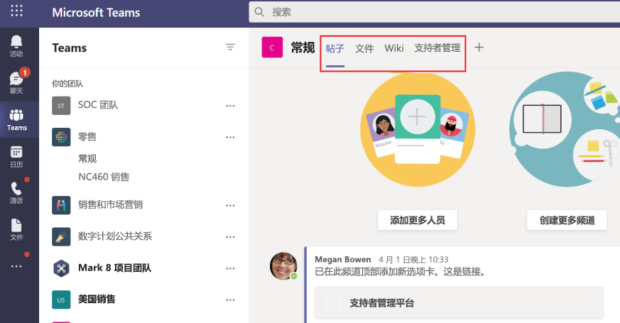

# Microsoft Teams 选项卡

选项卡是Teams网页中嵌入的可感知Microsoft Teams。 它们是简单的 HTML <iframe 标记，这些标记指向在应用程序清单中声明的域，并可以添加为单个用户的团队、群聊或个人应用中的频道的一 \> 部分。 可以将自定义选项卡与你的应用一起，以将自己的 Web 内容嵌入Teams或Teams Web 内容添加特定于 Web 的功能。 有关详细信息，请参阅[javaScript Teams SDK。](/javascript/api/overview/msteams-client)

下图显示了 Contoso 频道选项卡：

> [!VIDEO https://www.youtube-nocookie.com/embed/Jw6i7Mkt0dg]

> [!VIDEO https://www.youtube-nocookie.com/embed/T2a8yJC3VcQ]

在选项卡上工作之前，必须完成一些先决条件。

有两种类型的选项卡可用于Teams个人选项卡和频道或组。 [个人选项卡](~/tabs/how-to/create-personal-tab.md)和个人范围的自动程序是个人应用的一部分，并且范围为单个用户。 它们可固定到左侧导航栏，便于访问。 [频道或组选项卡](~/tabs/how-to/create-channel-group-tab.md) 向频道和群聊提供内容，是围绕基于 Web 的专用内容创建协作空间的一种很好的方法。

您可以将 [内容页创建](~/tabs/how-to/create-tab-pages/content-page.md) 为个人选项卡、频道或组选项卡或任务模块的一部分。 您可以创建[一个配置](~/tabs/how-to/create-tab-pages/configuration-page.md)页，使用户能够配置 Microsoft Teams 应用，并使用它配置频道或群聊选项卡、消息扩展或 Office 365 连接器。 您可以允许用户在安装后重新配置选项卡， [并创建应用程序的选项卡](~/tabs/how-to/create-tab-pages/removal-page.md) 删除页。 生成包含选项卡Teams应用时，必须测试选项卡在 Android 和 iOS 和[iOS Teams运行。](~/tabs/design/tabs-mobile.md) 您的选项卡 [必须通过基本](~/tabs/how-to/access-teams-context.md) 信息、区域设置和主题信息获取上下文，或者确定 `entityId` `subEntityId` 选项卡中的内容。

你可以生成带自适应卡片的选项卡，并集中Teams应用功能，无需为机器人和选项卡提供不同的后端。 [阶段视图](~/tabs/tabs-link-unfurling.md)是一个新的 UI 组件，允许你呈现在屏幕中全屏打开Teams固定为选项卡的内容。现有[链接取消点击](~/tabs/tabs-link-unfurling.md)服务已更新，以便它可用于使用自适应卡片和聊天服务将 URL 转换为选项卡。 您可以使用对话子实体创建对话选项卡，这些子实体允许用户就选项卡中的子实体（如特定任务、患者和销售机会）展开对话，而不是讨论整个选项卡。你可以更改选项卡[边距](~/resources/removing-tab-margins.md)，以增强开发人员在构建应用时的体验。

## 选项卡功能

选项卡功能如下所示：

* 如果将选项卡添加到同样具有自动程序的应用，则机器人也会添加到团队中。
* 感知Azure Active Directory (AAD) 当前用户的 ID。
* 用于指示语言（即 ）的用户区域设置感知 `en-us` 。
* 单一登录 (SSO) 功能（如果受支持）。
* 能够使用机器人或应用通知深层链接到选项卡或服务中的子实体，例如单个工作项。
* 从选项卡内的链接打开任务模块的能力。
* 在选项卡SharePoint Web 部件重用。

## 选项卡用户方案

**应用场景：** 将基于 Web 的现有资源引入Teams。 \
**示例：** 在向用户显示信息Teams个人选项卡的应用中创建个人选项卡。

**应用场景：** 向自动程序或消息传递Teams添加支持页面。 \
**示例：** 创建个人选项卡，为用户提供 **关于** 网页的内容和帮助网页内容。

**应用场景：** 提供对用户定期与之交互的项目的访问权限，以便进行协作对话与协作。 \
**示例：** 创建一个通道或组选项卡，该选项卡具有到各个项目的深层链接。

## 了解选项卡如何工作

可以使用下列方法之一创建选项卡：

* [在应用清单中声明自定义选项卡](#declare-custom-tab-in-app-manifest)
* [使用自适应卡片生成选项卡](~/tabs/how-to/build-adaptive-card-tabs.md)

### 在应用清单中声明自定义选项卡

自定义选项卡在应用包的应用清单中声明。 对于希望作为选项卡包含在应用中的每个网页，可定义 URL 和范围。 此外，你可以将[Teams JavaScript 客户端 SDK](/javascript/api/overview/msteams-client)添加到页面，并加载 `microsoftTeams.initialize()` 页面后调用。 Teams显示页面并提供对Teams特定信息的访问权限，例如，Teams客户端正在运行深色主题。

无论你选择在频道或组还是个人范围内公开选项卡，都必须在选项卡<显示一个 iframe \> HTML 内容页。 对于个人选项卡，内容 URL 直接在Teams清单中通过 `contentUrl` 数组中的 属性 `staticTabs` 进行设置。 您的选项卡的内容对于所有用户都是相同的。

对于频道或组选项卡，还可以创建其他配置页面。 此页面允许您配置内容页 URL，通常使用 URL 查询字符串参数加载该上下文的适当内容。 这是因为频道或组选项卡可以添加到多个团队或群组聊天中。 每次后续安装时，您的用户可以配置选项卡，从而允许您根据需要定制体验。 当用户添加或配置选项卡时，URL 与 UI Teams用户界面 (选项卡) 。 配置选项卡只是向该 URL 添加其他参数。 例如，当您添加"Azure Boards"选项卡时，配置页允许您选择加载哪一个选项卡。 配置页面 URL 由应用清单  `configurationUrl` 的 `configurableTabs` 数组中的 属性指定。

你可以有多个频道或组选项卡，每个应用最多有 16 个个人选项卡。

## 另请参阅

* [请求设备权限](../concepts/device-capabilities/native-device-permissions.md)
* [集成媒体功能](../concepts/device-capabilities/mobile-camera-image-permissions.md)
* [集成 QR 或条形码扫描仪](../concepts/device-capabilities/qr-barcode-scanner-capability.md)
* [集成位置功能](../concepts/device-capabilities/location-capability.md)

## 后续步骤

> [!div class="nextstepaction"]
> [先决条件](~/tabs/how-to/tab-requirements.md)
