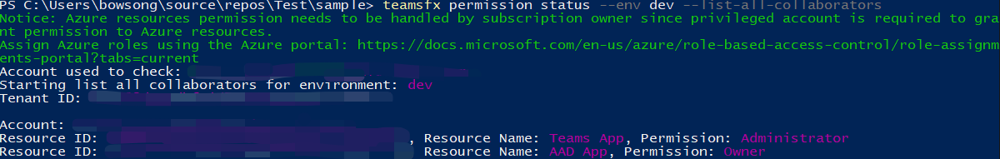

# <a name="teamsfx-command-line-interface"></a>TeamsFx 命令行接口

TeamsFx CLI 是基于文本的命令行接口，可加速Teams开发。 它旨在提供以键盘为中心的构建应用程序Teams体验。 它还支持 CI/CD 方案，其中 CLI 可以轻松集成到脚本中实现自动化。

* [源代码](https://github.com/OfficeDev/TeamsFx/tree/dev/packages/cli) 
* [包 (NPM) ](https://www.npmjs.com/package/@microsoft/teamsfx-cli)

## <a name="get-started"></a>入门

首先，从 安装 并 `teamsfx-cli` `npm` 运行 `teamsfx -h` 以检查所有可用命令：

```bash
  npm install -g @microsoft/teamsfx-cli
  teamsfx -h
```

## <a name="supported-commands"></a>支持的命令

| `teamsfx` 命令  | 说明 |
|:----------------  |:-------------|
| `teamsfx new`       | 创建新的应用程序Teams应用程序。 |
| `teamsfx account`   | 管理云服务帐户。 支持的云服务为"Azure"和"Microsoft 365"。          |
| `teamsfx env`       | 管理环境。 |
| `teamsfx capability`| 向当前应用程序添加新功能。         |
| `teamsfx resource`  | 管理当前应用程序中的资源。         |
| `teamsfx provision` | 在当前应用程序中预配云资源。             |
| `teamsfx deploy`    | 部署当前应用程序。  |
| `teamsfx package`   | 将你的Teams应用构建到一个包中以用于发布。         |
| `teamsfx validate`  | 验证当前应用程序。             |
| `teamsfx publish`   | 将应用发布到Teams。             |
| `teamsfx preview`   | 预览当前应用程序。 |
| `teamsfx config`    | 管理配置数据。 |
| `teamsfx permission`| 与同一项目中的其他开发人员协作。|

## `teamsfx new`

`teamsfx new`默认情况下，将进入交互式模式，并通过询问Teams引导你完成创建新应用程序的过程。 您还可以在非交互模式下通过将标志设置为 `--interactive` 来执行此操作 `false` 。

| `teamsFx new` 命令  | 说明 |
|:----------------  |:-------------|
| `teamsfx new template <template-name>`     | 从现有模板创建应用 |
| `teamsfx new template list`     | 列出所有可用模板 |

### <a name="parameters-for-teamsfx-new"></a>参数 `teamsfx new`

| 参数  | 必需 | 说明 |
|:----------------  |:-------------|:-------------|
|`--app-name` | 是| 应用程序的名称Teams应用程序。|
|`--interactive`| 否 | 以交互方式选择选项。 选项为 `true` `false` 和 。 默认值为 `true`。|
|`--capabilities`| 否| Choose Teams application capabilities， multiple Options are： `tab` ， `bot` ， and `messaging-extension` `tab-spfx` . 默认值为 `tab` ：。|
|`--programming-language`| 否| 项目的编程语言。 选项为 `javascrip` 或 `typescript` ，默认值为 `javascript` ：。|
|`--folder`| 否 | Project目录。 将在此目录下创建具有应用名称的子文件夹。 默认值为 `./` ：。|
|`--spfx-framework-type`| 否| 如果选择了 `Tab(SPfx)` 功能，则适用。 前端框架。 选项为 `none` `react` 和 ，默认值为 `none` ：。|
|`--spfx-web part-name`| 否 | 如果选择了 `Tab(SPfx)` 功能，则适用。 Web 部件名称。 默认值为："helloworld"。 |
|`--spfx-web part-desp`| 否 | 如果选择了 `Tab(SPfx)` 功能，则适用。 Web 部件说明。 默认值为："helloworld description"。 |
|`--azure-resources`| 否| 如果包含功能， `tab` 适用。 将 Azure 资源添加到你的项目。 多个 (多个) 选项 `sql` (Azure SQL 数据库) ， (`function` Azure Functions) 。 |

### <a name="scenarios-for-teamsfx-new"></a>应用场景 `teamsfx new`

使用交互模式创建应用Teams非常直观，请从 开始尝试 `teamsfx new` 。 下面是控制所有参数的一些场景：

#### <a name="a-tab-app-hosted-on-spfx-using-react"></a>使用工具托管的选项卡SPFx选项卡React

```bash
teamsfx new --interactive false --app-name newspfxapp --capabilities tab-spfx --spfx-framework-type react
```

#### <a name="a-teams-app-in-javascript-contains-tab-bot-capabilities-and-azure-functions"></a>JavaScript Teams应用包含选项卡、自动程序功能和 Azure 函数

```bash
teamsfx new --interactive false --app-name newtabbotapp --capabilities tab bot --programming-language javascript --azure-resources function
```

#### <a name="a-teams-tab-app-with-azure-functions-and-azure-sql"></a>一Teams Azure Functions 和 Azure SQL 的选项卡应用

```bash
teamsfx new --interactive false app-name newapp --azure-resources sql function --programming-language typescript
```

## `teamsfx account`

管理云服务帐户。 支持的云服务是 `Azure` 和 `Microsoft 365` 。

| `teamsFx account` 命令  | 说明 |
|:----------------  |:-------------|
| `teamsfx account login <service>`      | 登录到所选的云服务。 |
| `teamsfx account logout <service>`      | 注销所选云服务。 |
| `teamsfx account set --subscription`      | 更新帐户设置以设置订阅 ID。 |

## `teamsfx env`

管理环境。

| `teamsfx env` 命令  | 说明 |
|:----------------  |:-------------|
| `teamsfx env add <new_env_name> --env <existing_env_name>` | 通过从指定环境复制来添加新环境。 |
| `teamsfx env list` | 列出所有环境。 |

### <a name="scenarios-for-teamsfx-env"></a>应用场景 `teamsfx env`

#### <a name="create-a-new-environment"></a>创建新环境

通过从现有开发环境中复制来添加新环境：

```bash
teamsfx env add staging --env dev
```

## `teamsfx capability`

向当前应用程序添加新功能。

| `teamsFx capability` 命令  | 说明 |
|:----------------  |:-------------|
| `teamsfx capability add tab`      | 添加选项卡。 |
| `teamsfx capability add bot`      | 添加机器人。 |
| `teamsfx capability add messaging-extension`      | 添加消息传递扩展。 |

> [!NOTE]
> 一旦项目包含自动程序，邮件扩展就不能再添加，反之亦然。 在创建新应用项目时，可以在项目中包括自动程序扩展Teams消息扩展。

## `teamsfx resource`

管理当前应用程序中的资源。 支持 `<resource-type>` 包括： `azure-sql` 和 `azure-function` `azure-apim` 。

| `teamsFx resource` 命令  | 说明 |
|:----------------  |:-------------|
| `teamsfx resource add <resource-type>`      | 将资源添加到当前应用程序中。|
| `teamsfx resource show <resource-type>`      | 显示资源的配置详细信息。 |
| `teamsfx resource list`      | 列出当前应用程序的所有资源。 |

### <a name="parameters-for-teamsfx-resource-add-azure-function"></a>参数 `teamsfx resource add azure-function`

| 参数  | 必需 | 说明 |
|:----------------  |:-------------|:-------------|
|`--function-name`| 是 | 提供函数名称。 默认值为 `getuserprofile` ：。 |

### <a name="parameters-for-teamsfx-resource-add-azure-sql"></a>参数 `teamsfx resource add azure-sql`

#### `--function-name`

| 参数  | 必需 | 说明 |
|:----------------  |:-------------|:-------------|
|`--function-name`| 是 | 提供函数名称。 默认值为 `getuserprofile` ：。 |

> [!NOTE]
> 验证函数名称SQL需要从服务器工作负载访问的函数名称。 如果你的项目不包含 ，它将 `Azure Functions` 创建一个。

### <a name="parameters-for-teamsfx-resource-add-azure-apim"></a>参数 `teamsfx resource add azure-apim`

> [!TIP]
> 当您尝试使用现有实例时，以下选项将 `APIM` 生效。 默认情况下，不必指定任何选项，它将在步骤期间创建新 `teamsfx provision` 实例。

| 参数  | 必需 | 说明 |
|:----------------  |:-------------|:-------------|
|`--subscription`| 是 | 选择 Azure 订阅|
|`--apim-resource-group`| 是| 资源组的名称。 |
|`--apim-service-name`| 是 | API 管理服务实例的名称。 |
|`--function-name`| 是 | 提供函数名称。 默认值为 `getuserprofile` ：。 |

> [!NOTE]
> 我们请求函数名称， `Azure API Management` 因为需要与 一起 `Azure Functions` 使用 。 如果你的项目不包含，我们将 `Azure Functions` 创建一个。

## `teamsfx provision`

在当前应用程序中预配云资源。

### <a name="parameters-for-teamsfx-provision"></a>参数 `teamsfx provision`

| 参数  | 必需 | 说明 |
|:----------------  |:-------------|:-------------|
|`--env`| 是| 选择项目的环境。 |
|`--subscription`| 否 | 指定 Azure 订阅 ID。 |
|`--resource-group`| 否 | 设置现有资源组的名称。 |
|`--sql-admin-name`| 否 | 当项目中存在SQL资源时适用。 管理员的管理员SQL。|
|`--sql-password`| 否| 当项目中存在SQL资源时适用。 管理员密码SQL。|

## `teamsfx deploy`

此命令用于部署当前应用程序。 默认情况下，它将部署整个项目，但也可以部分部署。 多个 (选项 `frontend-hosting` `function`) ：、、、、。 `apim` `teamsbot` `spfx`

### <a name="parameters-for-teamsfx-deploy"></a>参数 `teamsfx deploy`

| 参数  | 必需 | 说明 |
|:----------------  |:-------------|:-------------|
|`--env`| 是| 为项目选择现有环境。 |
|`--open-api-document`| 否 | 在项目中存在 APIM 资源时适用。 Open API 文档文件路径。 |
|`--api-prefix`| 否 | 在项目中存在 APIM 资源时适用。 API 名称前缀。 API 的默认唯一名称将为 `{api-prefix}-{resource-suffix}-{api-version}` 。 |
|`--api-version`| 否 | 在项目中存在 APIM 资源时适用。 API 版本。 |

## `teamsfx validate`

验证当前应用程序。 此命令将验证应用程序的清单文件。

### <a name="parameters-for-teamsfx-validate"></a>参数 `teamsfx validate`

`--env`： (必需) 为项目选择现有环境。

## `teamsfx publish`

将应用发布到Teams。

### <a name="parameters-for-teamsfx-publish"></a>参数 `teamsfx publish`

`--env`： (必需) 为项目选择现有环境。

## `teamsfx package`

将你的Teams生成到一个包中以用于发布。

## `teamsfx preview`

从本地或远程预览当前应用程序。

### <a name="parameters-for-teamsfx-preview"></a>参数 `teamsfx preview`

| 参数  | 必需 | 说明 |
|:----------------  |:-------------|:-------------|
|`--local`| 否 | 从本地预览应用程序。 `--local` 与 独占 `--remote` 。 |
|`--remote`| 否 | 从远程预览应用程序。 `--remote` 与 独占 `--local` 。 |
|`--env`| 否 | 追加参数时，选择项目 `--remote` 的现有环境。 |
|`--folder`| 否 | Project根目录。 默认值为 `./`。 |
|`--browser`| 否 | 要打开 Web Teams的浏览器。 选项包括 `chrome` `edge` 、和 `default` (系统默认浏览器) 。 默认值为 `default`。 |
|`--browser-arg`| 否 | 要传递到浏览器的参数需要 --browser，可以多次 (例如 --browser-args="--guest")  |
|`--sharepoint-site`| 否 | SharePoint网站 URL， (`{your-tenant-name}.sharepoint.com` 仅适用于SPFx项目远程预览) 。 |

### <a name="scenarios-for-teamsfx-preview"></a>应用场景 `teamsfx preview`

#### <a name="local-preview"></a>本地预览

依赖项：

- Node.js
- .NET SDK
- Azure 函数核心工具

```bash
teamsfx preview --local
teamsfx preview --local --browser chrome
```

#### <a name="remote-preview"></a>远程预览

```bash
teamsfx preview --remote
teamsfx preview --remote --browser edge
```

> [!Note]
> 后台服务（如 React）的日志将保存在 中 `~/.fx/cli-log/local-preview/` 。

## `teamsfx config`

在用户范围或项目范围内管理配置数据。

| `teamsfx config` 命令  | 说明 |
|:----------------  |:-------------|
| `teamsfx config get [option]` | 查看选项的配置值 |
| `teamsfx config set <option> <value>` | 更新选项的配置值 |

### <a name="parameters-for-teamsfx-config"></a>参数 `teamsfx config`

| 参数  | 必需 | 说明 |
|:----------------  |:-------------|:-------------|
|`--env`| 是 | 为项目选择现有环境。 |
|`--folder`| 否 | Project目录。 这是在获取/设置项目配置时使用的。 默认值为 `./` ：。 |
|`--global`| 否 | 配置处理。 如果为 true，则范围限制为用户范围，而不是项目范围。 默认值为 `false` ：。 当前支持的全局配置包括 `telemetry` `validate-dotnet-sdk` ：、、、。 `validate-func-core-tools` `validate-node` |

### <a name="scenerios-for-teamsfx-config"></a>的场景子 `teamsfx config`

文件中 `.userdata` 的密码已加密 `teamsfx config` ，可帮助你查看/更新这些值。

#### <a name="stop-sending-telemetry-data"></a>停止发送遥测数据

```bash
teamsfx config set telemetry off
```

#### <a name="disable-environment-checker"></a>禁用环境检查器

有三个配置可打开/关闭 Node.js、.NET SDK 和 Azure Functions 核心工具验证，并且默认情况下启用所有这些配置。 如果不需要依赖关系验证，并且希望自己安装依赖项，你可以将配置设置为"关闭"。 查看Node.js[安装指南](https://github.com/OfficeDev/TeamsFx/blob/dev/docs/vscode-extension/envchecker-help.md#how-to-install-nodejs)[、.NET SDK 安装指南](https://github.com/OfficeDev/TeamsFx/blob/dev/docs/vscode-extension/envchecker-help.md#how-to-install-net-sdk)和[Azure Functions 核心工具安装指南](https://github.com/OfficeDev/TeamsFx/blob/dev/docs/vscode-extension/envchecker-help.md#how-to-install-azure-functions-core-tools)。

例如，若要禁用 .NET SDK 验证，可以使用以下命令。

```bash
teamsfx config set validate-dotnet-sdk off
```

若要启用 .NET SDK 验证，可以使用以下命令。

```bash
teamsfx config set validate-dotnet-sdk on
```

#### <a name="view-all-the-user-scope-configuration"></a>查看所有用户作用域配置

```bash
teamsfx config get -g
```

#### <a name="view-all-the-configuration-in-project"></a>查看项目中的所有配置

该密码将自动解密：

```bash
teamsfx config get --env dev
```

#### <a name="update-the-secret-configuration-in-project"></a>更新项目中的机密配置

```bash
teamsfx config set fx-resource-aad-app-for-teams.clientSecret xxx --env dev
```

## `teamsfx permission`

TeamsFx CLI 提供 `teamsFx permission` 协作方案的命令。

| `teamsFx permission` 命令 | 说明 |
|:------------------------------|-------------|
| `teamsfx permission grant --env --email` | 为协作者的Microsoft 365指定环境的项目授予权限。 |
| `teamsfx permission status` | 显示项目的权限状态 |

### <a name="parameters-for-teamsfx-permission-grant"></a>参数 `teamsfx permission grant`

| 参数  | 必需 | 说明 |
|:----------------  |:-------------|:-------------|
|`--env`| 是 | 提供 env 名称。 |
|`--email`| 是 | 提供协作者的Microsoft 365电子邮件地址。 请注意，协作者的帐户应该与创建者在同一租户中。 |

### <a name="parameters-for-teamsfx-permission-status"></a>参数 `teamsfx permission status`

| 参数  | 必需 | 说明 |
|:----------------  |:-------------|:-------------|
|`--env`| 是 | 提供 env 名称。 |
|`--list-all-collaborators` | 否 | 通过此标志，Teams Toolkit CLI 将输出此项目的所有协作者。 |

### <a name="scenarios-for-teamsfx-permission"></a>应用场景 `teamsfx permission`

下面是一些示例，用于更好地处理 `TeamsFx` 项目权限。

#### <a name="grant-permission"></a>授予权限

Project创建者和协作者可以使用命令 `teamsfx permission grant` 将新的协作者添加到项目中：

```bash
teamsfx permission grant --env dev --email user-email@user-tenant.com
```

成功授予权限后，项目创建者和协作者可以通过 Github 与新协作者共享项目，并且新协作者将拥有对 Microsoft 365 帐户的所有权限。

#### <a name="show-permission-status"></a>显示权限状态

Project创建者和协作者可以使用命令查看他的Microsoft 365 `teamsfx permission status` 特定 env 的帐户权限：

```bash
teamsfx permission status --env dev
```

#### <a name="list-all-collaborators"></a>列出所有协作者

Project创建者和协作者可以使用 `teamsfx permission status` 命令查看特定 env 的所有协作者：

```bash
teamsfx permission status --env dev --list-all-collaborators
```

#### <a name="e2e-collaboration-work-flow-in-cli"></a>CLI 中的 E2E 协作工作流程

作为项目创建者：

- 创建新的 TeamsFx 选项卡项目 (还可以选择自动程序) ，托管类型选择 Azure。

  ```bash
  teamsfx new --interactive false --app-name newapp --host-type azure
  ```

- 登录Microsoft 365帐户和 Azure 帐户。

  ```bash
  teamsfx account login azure
  teamsfx account login Microsoft 365
  ```

- 预配项目。

  ```bash
  teamsfx provision
  ```

- 查看协作者。 你应该可以在这里看到自己。

  ```bash
  teamsfx permission status --env dev --list-all-collaborators
  ```

  
- 添加另一个帐户作为协作者。 请注意，添加的帐户必须在同一租户下：

  ```bash
  teamsfx permission grant --env dev --email user-email@user-tenant.com
  ```

  
- 将项目推送到GitHub

作为协作Project者：

- 从项目复制GitHub。
- 登录Microsoft 365帐户。 请注意，Microsoft 365帐户应与上面添加的帐户相同：

  ```bash
  teamsfx account login Microsoft 365
  ```

- 登录 Azure 帐户，该帐户具有所有 Azure 资源的参与者权限。

  ```bash
  teamsfx account login azure
  ```

- 检查权限状态。 你应该会发现自己拥有项目的所有者权限：

  ```bash
  teamsfx permission status --env dev
  ```

  
- 更新选项卡代码，将项目部署到远程。
- 启动远程，项目应该可以正常工作。
