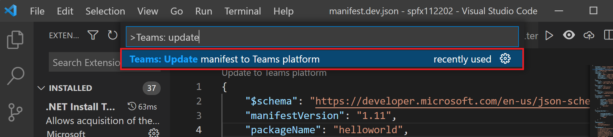
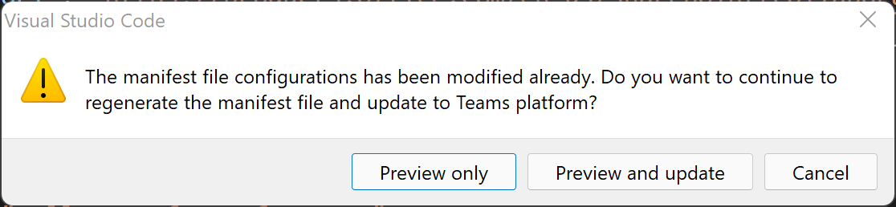

# <a name="preview-teams-app-manifest-in-teams-toolkit"></a>在Teams中预览应用Teams Toolkit

搭建基架后，你将在 folder 下获取两个清单模板 `templates/appPackage` 文件。

- `manifest.local.template.json` - 本地调试团队应用。
- `manifest.remote.template.json` - 在所有远程环境之间共享。

这些模板文件包含一些占位符，并且来自 Teams Toolkit的实际值将在 和 下的文件中 `.fx/configs` 解析 `.fx/states` 。

## <a name="prerequisite"></a>先决条件

* [安装Teams Toolkit](https://marketplace.visualstudio.com/items?itemName=TeamsDevApp.ms-teams-vscode-extension)版本 v3.0.0+。

> [!TIP]
> 你应该已经拥有一个Teams VS 代码打开的应用项目。

## <a name="preview-manifest"></a>预览清单

若要预览包含真实内容的清单，Teams Toolkit文件夹下生成预览清单 `build/appPackage` 文件：

```text
└───build
    └───appPackage
        ├───appPackage.{env}.zip - Zipped app package of remote teams app
        ├───appPackage.local.zip - Zipped app package of local team app
        ├───manifest.{env}.json  - Previewed manifest of remote teams app
        └───manifest.local.json  - Previewed manifest of local teams app
```

### <a name="local-debug-teams-app"></a>本地调试Teams应用

若要预览本地团队应用的清单文件，你需要先按 **F5** 运行本地调试。 此步骤将生成默认的本地设置，然后应用包和预览清单将在 **build/appPackage** 文件夹下生成。

其他方式包括：

- 在 **manifest.local.template.json** 文件的代码中选择"预览" 
- 选择 **manifest.local.template.json 文件的菜单栏上的"预览清单** 文件"
- 选择 **树Teams** 压缩元数据包，**然后选择本地** 预览本地显示，如下图所示：


### <a name="remote-environment"></a>远程环境

若要预览远程团队应用的清单文件，你需要在 Teams Toolkit扩展树视图的开发面板中选择"在云中预配"，或先从命令调色板触发 **Teams： 在** 云中预配。 此步骤将为远程团队应用生成配置，然后应用包和预览清单将在 **build/appPackage** 文件夹下生成。

其他方式包括：

- 在 **manifest.remote.template.json** 文件的代码中选择预览。 
- 选择 **manifest.remote.template.json 文件的菜单栏上的"预览清单** 文件"。
- Select **Zip Teams metadata package** in Treeview and select your environment.


> 如果存在多个环境，则需要选择要预览的 env，如图所示：


## <a name="sync-local-changes-to-dev-portal"></a>将本地更改同步到开发人员门户

预览清单文件后，可以通过以下方法将本地更改同步到开发人员门户：

- 选择 **"更新Teams** 左上角的"更新""更新平台"`manifest.{env}.json`
- 选择 **Teams：将清单更新Teams菜单栏** 上的"更新到平台"`manifest.{env}.json`
- 触发 **Teams：从命令Teams更新清单以** 更新平台


 

> [!NOTE]
> 通过编辑器代码lens或标题按钮触发，将当前清单文件更新为Teams清单。 从命令调色板触发将需要选择目标环境。

如果清单文件由于配置文件更改或模板更改而过期，将要求用户确认其操作 

- **仅预览**：根据当前配置将覆盖本地清单文件
- **预览和更新**：本地清单文件将根据当前配置进行覆盖，并同时Teams更新到本地平台
- **取消**：不执行任何操作

> [!NOTE]
> 更改将更新到开发人员门户。 如果你在开发人员门户中拥有一些手动更新，它将被覆盖。

## <a name="see-also"></a>另请参阅

> [!div class="nextstepaction"]
> [在Teams中自定义应用Teams Toolkit](TeamsFx-manifest-customization.md)
