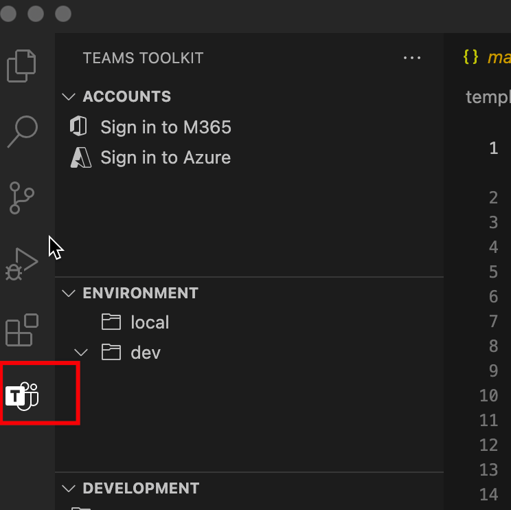

# 向应用添加Teams功能

你可以开始创建一个Teams应用，该应用具有Teams功能之一。 在应用开发过程中，Teams Toolkit灵活向你的应用添加更多Teams功能。 下表介绍了Teams应用程序功能：

|**功能**|**说明**|
|--------|-------------|
| 选项卡 |  选项卡是指向应用程序清单中声明的域的简单 HTML 标记。 你可以将选项卡添加为单个用户的团队、群聊或个人应用中频道的一部分。|
| 机器人 |  机器人通过文本、交互式卡片和任务模块帮助与 Web 服务交互。|
| 消息扩展 | 邮件扩展通过客户端中的按钮和表单帮助与 web Microsoft Teams交互。|

## 先决条件

* [安装Teams Toolkit](https://marketplace.visualstudio.com/items?itemName=TeamsDevApp.ms-teams-vscode-extension)版本 v3.0.0+。

> [!TIP]
> 你应该已经拥有一个Teams VS 代码中打开的应用项目。

## 使用 Teams Toolkit

> [!IMPORTANT]
> 在将功能成功添加到应用后，需要针对每个环境Teams预配。

1. 从 **Teams Toolkit** 选择"设置"：

    
  
1. 选择 **"添加功能"：**

    

      还可以打开命令调色板，然后 **输入Teams：添加功能**： 
      
      > [!NOTE]
      > 这等效于从树视图触发。

    

1. 从弹出窗口中，选择要包括在项目中的功能：

    

1. 选择“**确定**”。

所选功能成功添加到项目中。 应用程序Teams Toolkit新添加的功能生成源代码。

## 在命令窗口中使用 TeamsFx CLI 添加功能

1. 将目录更改为 **项目目录**。
1. 执行以下命令，向项目添加不同的功能：

   |功能与方案| 命令|
   |-----------------------|----------|
   |添加选项卡|`teamsfx capability add tab`|
   |添加自动程序|`teamsfx capability add bot`|
   |添加消息传递扩展|`teamsfx capability add messaging-extension`|

## 支持的功能矩阵

除了应用已有Teams功能外，还可以选择向应用添加Teams功能。下表提供了各种受支持的Teams应用功能： 

|现有功能|可以添加其他功能|
|--------------------|--------------------|
|带选项卡SPFx|无|
|使用 Azure 的选项卡|机器人和消息传递扩展|
|机器人|选项卡|
|消息传递扩展|选项卡|
|选项卡和聊天机器人|无|
|选项卡和消息传递扩展|无|
|选项卡、聊天机器人和消息传递扩展|无|

## 添加功能时会发生什么情况

添加机器人和消息传递扩展后，项目中的以下更改如下：

- 自动程序模板代码将添加到具有路径 的子文件夹 `yourProjectFolder/bot` 。 这包括项目中的"hello world"自动程序应用程序模板。
- `launch.json` 更新 `task.json` `.vscode` 文件夹下的 和 。 这包括用于Visual Studio Code在本地调试应用程序时执行的脚本。 
- `manifest.remote.template.json` 和 `manifest.local.template.json` 文件夹 `templates/appPackage` 下的文件已更新。 这包括清单文件中表示应用程序在 Teams 文件中的信息。 更改包括：
  - 自动程序 ID。
  - 自动程序的范围。
  - Hello world 自动程序应用程序可以响应的命令。
- 将 `templates/azure/teamsfx` 更新 下的文件，并重新生成 templates/azure/provision/xxx.bicep 文件。
- 下 `.fx/config` 的文件将重新生成。 这将确保您的项目集具有针对新添加的功能的合适配置。

添加选项卡后，项目中的以下更改如下：

- 前端选项卡模板代码将添加到具有路径 的子文件夹 `yourProjectFolder/tab` 。 这包括项目中的"hello world"选项卡应用程序模板。
- `launch.json` 更新 `task.json` `.vscode` 文件夹下的 和 。 这包括用于Visual Studio Code在本地调试应用程序时执行的脚本。 
- `manifest.remote.template.json` 和 `manifest.local.template.json` 文件夹 `templates/appPackage` 下的文件已更新。 这包括清单文件中与选项卡相关的信息，这些信息表示 Teams 平台中的应用程序，更改包括：
  - 可配置选项卡和静态选项卡。
  - 选项卡的范围。
- 将 `templates/azure/teamsfx` 更新 下的文件，并重新生成 templates/azure/provision/xxx.bicep 文件。
- 下 `.fx/config` 的文件将重新生成。 这将确保您的项目集具有针对新添加的功能的合适配置。

## 限制

目前，在添加更多功能时，TeamsFx 存在一些限制。 限制如下：

- 每个项目功能多次
- 任何功能，如果从 Tab 应用程序开始，SPFx
- 如果项目包含消息传递扩展，更多自动程序功能
- 如果项目包含自动程序，更多消息传递扩展。

> [!NOTE]
> 如果要同时包括机器人和消息传递扩展功能，请同时选择它们。 可以在创建新项目或选项卡应用程序时添加它们。

## 另请参阅

> [!div class="nextstepaction"]
> [预配云资源](provision.md)

> [!div class="nextstepaction"]
> [新建Teams项目](create-new-project.md)
