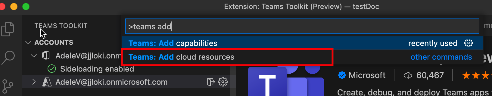

# 将云资源添加到 Teams 应用

TeamsFx 有助于为应用程序托管设置云资源。 还可以选择添加满足开发需求的云资源。

## 先决条件

* [安装Teams Toolkit](https://marketplace.visualstudio.com/items?itemName=TeamsDevApp.ms-teams-vscode-extension)版本 v3.0.0+。

> [!TIP]
> 你应该已经有一个Teams应用程序项目。

## 使用云解决方案添加Teams Toolkit

> [!IMPORTANT]
> 添加资源后，需要预配每个环境。

1. 打开 **Visual Studio Code**。
1. 从 **Teams Toolkit** 选择"设置"：

    

1. 在"Teams Toolkit栏面板中，选择 **"添加云资源"：**

    

    还可以打开命令调色板，然后输入 **Teams：添加云资源**：
    
    > [!NOTE]
    > 按照从树视图触发的过程操作：

    

1. 从弹出窗口中，选择要添加到你的应用Teams资源：

     

1. 选择“**确定**”。

## 在命令窗口中使用 TeamsFx CLI 添加云资源

1. 将目录更改为 **项目目录**。
1. 执行命令以添加不同的功能。

下表介绍了云资源以及要添加这些资源的相应命令：

|云资源|命令|
|---------------|----------|
| Azure 函数|`teamsfx resource add azure-function --function-name your-func-name`|
| Azure SQL 数据库|`teamsfx resource add --function-name your-func-name`|
| Azure API 管理|`teamsfx resource add azure-apim`|

## 可以添加的云资源

TeamsFx 提供与 Azure 服务的无缝集成，这些服务对于以下应用程序方案很常见：

- [Azure 函数](/azure/azure-functions/functions-overview)：一个无服务器解决方案，可满足你的需求，例如为应用程序后端创建Teams API。
- [Azure SQL 数据库](/azure/azure-sql/database/sql-database-paas-overview)：完全托管的平台即服务 (PaaS) 数据库引擎充当 Teams 应用程序数据存储。
- [Azure API 管理](/azure/azure-sql/database/sql-database-paas-overview)：一个 API 网关，可用于管理为 Teams 应用程序创建的 API，并发布它们以在其他应用程序（如 Power Apps）上使用。

## 添加资源时会发生什么情况

当您添加任何资源时，您的项目将发生以下更改：

- 新参数可以添加到 azure.parameter。{env}.json，用于提供预配的必需信息。
- 新内容将追加到文件夹ARM下的新模板 (文件夹下的文件除外) `templates/azure` `templates/azure/teamsfx` 创建添加的 Azure 资源。
- 将 `templates/azure/teamsfx` 重新生成文件夹下的文件，以确保添加的 Azure 资源所需的 TeamsFx 配置是最新的。
- `.fx/projectSettings.json` 已更新，以跟踪项目中提供的资源。

同时，每种资源都有一些额外的更改：

|添加的资源|更改了哪些功能|为什么进行这些更改|
|---------------|---------------|-----------------------------|
|Azure Functions|Azure Functions 模板代码将添加到具有路径的子文件夹 `yourProjectFolder/api`  `launch.json` 并 `task.json` 更新文件夹 `.vscode` 下。| 将 hello world http 触发器模板包括在项目中。   若要包含用于Visual Studio Code在本地调试应用程序时执行的必要脚本。|
|Azure API 管理|添加到具有路径的子文件夹的 Open API 规范文件 `yourProjectFolder/openapi`|这是 API 规范文件，用于定义发布后的 API。|

## 限制

- 你只能将一个 Function App /Azure SQL 数据库 /APIM Service 添加到你的项目中。
- 如果项目不包含选项卡应用，则不能添加资源。

## 另请参阅

> [!div class="nextstepaction"]
> [预配云资源](provision.md)
