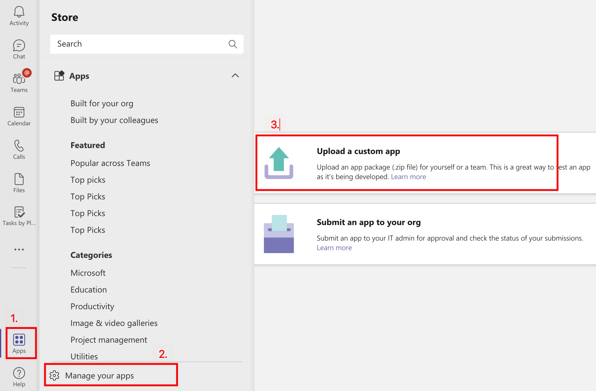
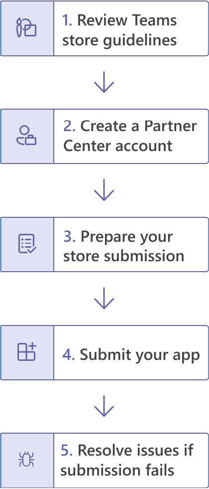

# 使用Teams发布Teams Toolkit

创建应用后，你可以将应用分发到不同的作用域，例如个人、团队、组织或任何人。 分布取决于多个因素，包括需求、业务和技术要求以及应用的目标。 分发到不同范围可能需要不同的审阅过程。 一般来说，范围越大，应用需要针对安全性和合规性问题进行审阅就越充分。

## 先决条件

* [安装Teams Toolkit](https://marketplace.visualstudio.com/items?itemName=TeamsDevApp.ms-teams-vscode-extension)版本 v3.0.0+。

> [!TIP]
> 你应该已经有一个Teams应用程序项目。

## 发布到单个作用域 (旁加载权限) 

用户可以通过将应用包Teams文件直接上载到团队.zip或个人上下文中，将自定义应用添加到应用包。 通过上传应用包（也称为旁加载）添加自定义应用，允许你在开发应用时测试应用，然后再如以下方案所述广泛分发应用：

* 你自己或与其他开发人员一起在本地测试和调试应用。
* 只为你自己生成了一个应用。 例如，自动化工作流。
* 你为一小组用户（如工作组）生成了一个应用。

它还允许你生成供内部使用的应用，并与你的团队共享它，而无需将该应用提交到 Teams 应用商店中的 Teams 应用程序目录。

* 将应用生成到 *.zip 应用包文件

    可以通过从树视图的部署面板中选择来生成应用 `Zip Teams metadata package` Teams Toolkit。 你可能需要先 `Provision in the cloud` 运行。 生成的应用包将位于 中 `{your project folder}/build/appPackage/appPackage.{env}.zip` ，如下图所示：

 

## 发布到组织 

当应用准备好在生产中使用时，开发人员可以使用 Teams 应用提交 API（从 Graph API（集成开发环境 (IDE) 如随 Teams 工具包安装的 Visual Studio Code）提交应用。 You can either select **Publish to Teams** from DEPLOYMENT panel in TreeView of Teams Toolkit， or trigger **Teams： Publish to Teams** from command palette. 然后选择 **"为组织安装"，** 如下图所示：

执行此操作可使应用在管理中心的"管理应用"Microsoft Teams，你和管理员可在其中查看和批准它。

作为管理员，Microsoft Teams中心中的"管理应用"页面是查看和管理组织Teams应用的地方。 你可以在此处查看应用的组织级别状态和属性、批准新的自定义应用或将其上载到组织的应用商店、在组织级别阻止或允许应用、将应用添加到团队、购买第三方应用的服务、查看应用请求的权限、向应用授予管理员同意以及管理组织范围内的应用设置。

 Teams 管理中心 Teams toolkit for Visual Studio Code 中的"管理应用"页面基于 Teams 应用提交 API 构建，它允许你在 Teams 上自动执行自定义应用的提交到审批流程。

> [!NOTE]
> 请记住，这尚未将应用发布到组织的应用商店。 此步骤将应用提交到Microsoft Teams管理中心，你可以在这里批准它以发布到组织的应用商店。

## 提交的应用管理员Teams审批

然后，Teams 租户的管理员可以转到左侧导航中 Microsoft Teams 管理中心 (中的"管理应用"页面，转到"Teams 应用">"管理应用) "，查看组织的所有 Teams 应用。 页面顶部的"待审批"小组件使你可以了解何时提交自定义应用进行审批。
在表中，新提交的应用会自动显示"已提交"和"已阻止状态"的发布状态。 你可以按降序对"发布状态"列进行排序以快速找到应用：

 

选择应用名称以转到应用详细信息页面。 On the About tab， you can view details about the app， including description， status， submitter， and app ID：

 

准备好将应用提供给用户后，请按照步骤发布应用：

1. 在管理中心左侧导航Microsoft Teams，转到Teams应用>管理应用"。
2. 选择要转到应用详细信息页面的应用名称，然后在"发布状态"框中选择"发布"。
发布应用后，"发布状态"将更改为"已发布"，"状态"将自动更改为"允许"。

## 发布到Microsoft Store

你可以将应用直接分发到 Microsoft Teams 内的应用商店，并覆盖全球数百万用户。 如果你的应用也在应用商店中特别推荐，你可以立即联系潜在客户。
发布到应用商店的应用Teams Microsoft AppSource 自动列出，Microsoft AppSource 是应用和解决方案Microsoft 365官方市场。
了解发布过程 当你感觉你的应用已做好生产准备时，你可以开始在应用商店中列出Teams过程。

>[!Tip]
> 严格遵循提交前步骤可能会增加 Microsoft 批准你的应用进行发布的可能性。

* 查看Teams应用商店验证准则，确保你的应用符合Teams应用商店标准。
* 创建合作伙伴中心开发人员帐户。
* 准备应用商店提交，其中包括运行自动测试、编译测试备注、创建应用商店一览，以及其他有助于加快审阅过程的重要任务。
* 通过合作伙伴中心提交应用。
* 直接与 Microsoft 合作以解决问题并重新提交应用 (以解决问题并重新提交应用) 。

## 另请参阅

> [!div class="nextstepaction"]
> [管理多个环境](TeamsFx-multi-env.md)

> [!div class="nextstepaction"]
> [与其他开发人员协作处理Teams项目](TeamsFx-collaboration.md)