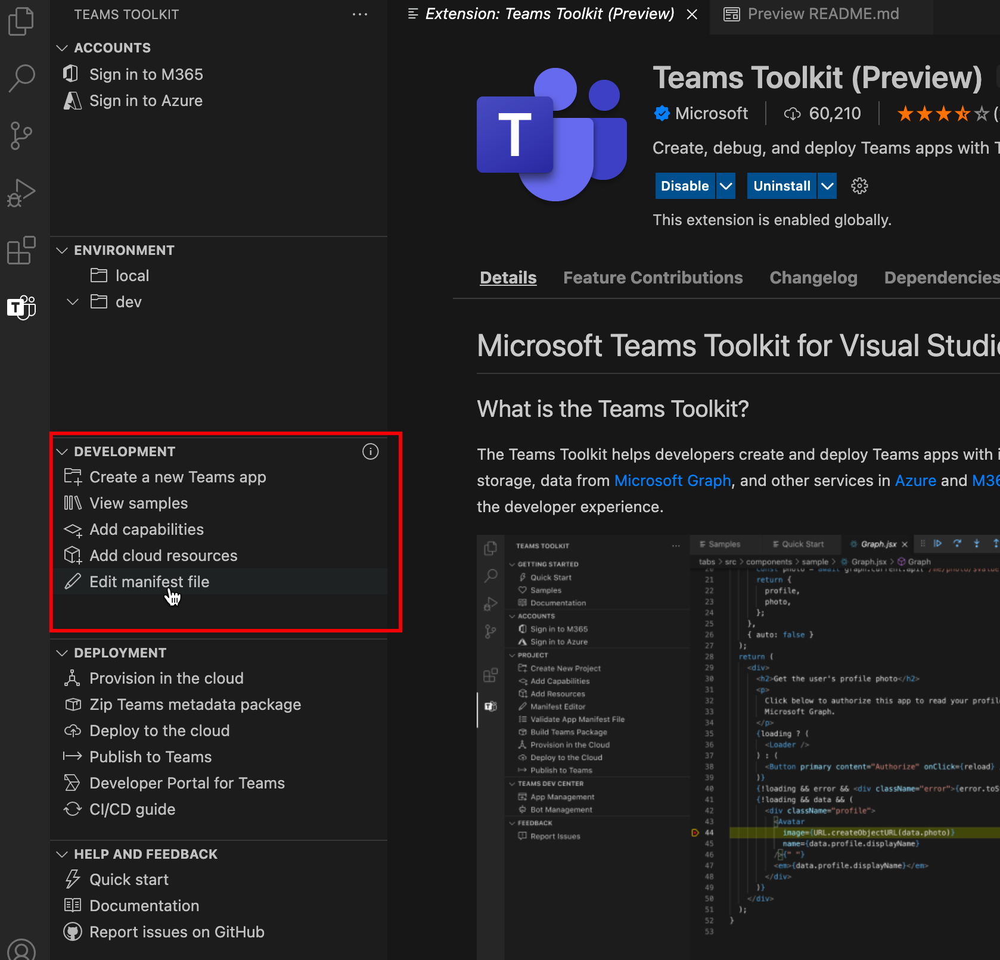

# Teams Toolkit

> [!NOTE]
> 目前，此功能仅适用于公共 **开发人员预览** 版。

Teams Toolkit for Visual Studio Code 通过针对开发人员体验的零配置方法，帮助开发人员创建和部署具有集成标识的 Teams 应用、对云存储的访问权限、Microsoft Graph 的数据以及 Azure 和 Microsoft 365 中的其他服务。  

有一Teams Toolkit应用Visual Studio和一Teams [CLI](https://github.com/OfficeDev/TeamsFx/blob/dev/docs/cli/user-manual.md)工具 (应用 `teamsfx`) 。

## 安装Teams Toolkit Visual Studio Code

1. 打开 **Visual Studio Code。**

1. Select the Extensions view (**Ctrl+Shift+X**  /  **⌘⇧-X** or **View > Extensions**) .

1. 在搜索框中，输入 **"Teams Toolkit"。**

1. 选择 **"安装**"按钮旁边的Teams Toolkit。

或者，您可以在 Teams Toolkit 上找到Visual Studio Code[应用程序](https://marketplace.visualstudio.com/items?itemName=TeamsDevApp.ms-teams-vscode-extension)。

## 支持Teams应用功能

[Microsoft Teams扩展](../concepts/capabilities-overview.md)点Teams应用功能TeamsToolkit Visual Studio Code支持开发人员通过以下应用程序功能Teams项目：

* [选项卡](../tabs/what-are-tabs.md#microsoft-teams-tabs)

* [机器人](../bots/what-are-bots.md#bots-in-microsoft-teams)

* [消息扩展](../messaging-extensions/what-are-messaging-extensions.md#messaging-extensions) 

你的Teams项目可以包含上述功能之一或全部三项功能。 创建项目时，可以选择任何Teams Project。

Teams Toolkit提供了在应用开发过程的进一步过程中添加更多Teams的灵活性。

## 用户旅程Teams Toolkit

Teams Toolkit应用程序开发Teams，使其易于调试、部署和发布。 Teams Toolkit自动执行手动工作，并提供与 Teams 和 Azure 资源的很好的集成。 下图显示了Teams Toolkit旅程：

## 浏览 Teams Toolkit Visual Studio Code

如果未在 VS Code 中打开任何 Teams 项目，或者未打开任何未使用 Teams Toolkit v2.+创建的项目，你将看到具有有限功能的 Teams Toolkit UI，如下图所示：

:::image type="content" source="./images/teams-toolkit-beforestart.png" alt-text="开始Teams Toolkit":::

可以选择"**快速入门**"浏览 **Teams Toolkit，** 也可以选择"新建 Teams 应用"以创建一Teams项目。 如果你有由 VS Code 中打开Teams Project v2.+ Teams Toolkit，你将看到 Teams Toolkit UI 具有更多功能，如下图所示：

:::image type="content" source="./images/teams-toolkit-overview.png" alt-text="浏览Teams Toolkit":::

让我们看一下在 Teams Toolkit 中提供的功能：

* [Accounts](#accounts)

* [环境](#environment)

* [开发](#development)

* [部署](#deployment)

* [帮助和反馈](#help-and-feedback)

### 帐户

开发人员必须具有一个Microsoft 365帐户来生成Teams应用。 如果没有，可以通过加入开发人员计划Teams免费获取Microsoft 365[帐户：](https://developer.microsoft.com/microsoft-365/dev-program)

Azure 帐户通常用于应用Teams开发。 如果你希望在 Azure 上托管Teams或访问资源，则必须拥有 Azure 帐户。 Teams Toolkit Azure 资源的登录、预配和部署集成体验。 可以在 [开始之前创建免费的 Azure](https://azure.microsoft.com/free/) 帐户。

 有关详细信息，请参阅[准备帐户以生成Teams应用](accounts.md)

### 环境

Teams Toolkit帮助您管理多个环境。 您可以添加、配置和自定义环境。 你可以选择针对每个环境添加协作者：

 有关详细信息，请参阅[管理多个环境，](TeamsFx-multi-env.md)并[与其他开发人员](TeamsFx-collaboration.md)协作处理Teams项目。

### 开发

Teams Toolkit使你可以方便地创建和自定义 Teams 应用程序项目，使Teams应用程序开发轻松快速地工作： 

1. **创建新的 Teams 应用**，有助于Teams"hello world"模板项目或示例项目开始开发应用。 有关详细信息，请参阅[新建项目Teams项目](create-new-project.md)
1. **查看示例**，显示一Teams示例应用，以便你浏览、参考和开发。
1. **添加功能**，有助于在开发过程中Teams向Teams应用添加其他自定义功能。 有关详细信息，请参阅[将功能添加到 Teams 应用](add-capability.md)
1. **通过添加云** 资源，你可以根据要求更改添加其他云资源。有关详细信息，请参阅为应用 [添加云Teams资源](add-resource.md)
1. **通过编辑** 清单文件，你可以轻松编辑Teams应用程序与 Teams 集成。 有关详细信息，请参阅预览Teams[清单文件并](TeamsFx-manifest-preview.md)[编辑Teams清单文件](TeamsFx-manifest-customization.md)。

### 部署

在开发期间或之后，你应该按照此过程在用户可访问应用之前Teams、部署和发布应用：

1. 如果你想要在 Azure 上托管 Teams 应用，或者你需要使用 Azure 资源，在云中预配可帮助你自动执行创建 Azure 资源的过程。 若要使用它，你必须拥有 Azure 订阅。 有关详细信息，请参阅预配 [云资源](provision.md)。

1. 在发布应用或共享之前，可以通过选择 Zip Teams元数据包将Teams **包中**。

1. **部署到云** 可帮助你将其源代码部署到 Azure。 运行部署的先决条件是在云中运行预配来预配资源，或者必须手动创建 Azure 资源，并指定项目环境设置中的资源参数。 有关详细信息，请参阅[将Teams应用部署到云](deploy.md)。

1. 无需手动发布自定义 Teams 应用，可以使用 **发布到** Teams 函数调用 Teams api 来发布Teams应用。 你需要具有上传应用Teams权限。 有关详细信息，请参阅[将应用发布到Teams。](publish.md)

1. 开发人员门户Teams可以管理和分发你的 Teams 应用。有关详细信息，请参阅[开发人员门户](/microsoftteams/platform/concepts/build-and-test/teams-developer-portal)

1. Teams Toolkit为 CI/CD 工具（如 GitHub 工作流、Azure Devops 和 Jenkins）提供 CI/CD 模板。 有关详细信息，请参阅为应用程序[生成 CI/CD Teams。](use-CICD-template.md)

### 帮助和反馈

在此部分中，您可以轻松地找到所需的文档和资源。 可以选择"**报告产品GitHub** 中的问题Teams Toolkit产品 **专家快速** 获取支持。 在创建新问题之前浏览该问题，或访问[StackOverflow `teams-toolkit` ](https://stackoverflow.com/questions/tagged/teams-toolkit)标记浏览并提问：

## 另请参阅

> [!div class="nextstepaction"]
> [创建新项目Teams Toolkit](create-new-project.md)

> [!div class="nextstepaction"]
>[准备帐户以生成Teams应用程序](accounts.md)
