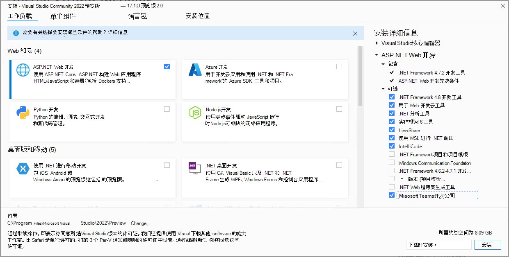

# Visual Studio 的Teams工具包

在 IDE 中针对 Teams 构建、测试和开发。

针对 Visual Studio 的 Teams 工具包扩展可以轻松地为 Teams 创建新项目、在 Teams 开发人员门户中自动设置应用、在 Teams 中进行运行和调试、配置云托管以及从 IDE 使用 [TeamsFx](https://github.com/OfficeDev/teamsfx)。

## 安装 Visual Studio 的 Teams 工具包

>[!NOTE]
> 作为先决条件，请确保使用 Visual Studio 2022 17.1 预览版 2 或更高版本来按照以下说明操作。

1. 如果已经安装了 Visual Studio 2022 17.1 预览版 2，请跳到下一步。 否则，[ 请安装 Visual Studio 2022 预览版 ](https://visualstudio.microsoft.com/vs/preview/)。
2. 打开 Visual Studio 安装程序。
3. 为现有的 VS 2022 预览版安装选择“**修改**”。
4. 选择 **ASP.NET 和 Web 开发** 工作负载。
5. 在右侧展开 “**ASP.NET 和 Web 开发**”部分，并在组件的可选列表中选择“**Microsoft Teams 开发工具**”。
6. 在 Visual Studio 安装程序中选择“**安装**”或者“**修改**”，完成安装过程。

   

## 快速开始新项目

Teams 工具包项目模板提供了开始一个 Teams 应用项目需要的所有代码、文件和配置。

使用 Microsoft Teams 应用项目模板可以指定自动注册和配置新 Teams 应用所需的 Microsoft 365 帐户。

> [!NOTE]
> 如果没有 Microsoft 365 账户，请注册 [ Microsoft 365 开发人员计划 ](https://developer.microsoft.com/microsoft-365/dev-program) 订阅。 可免费使用 90 天，并且只要将它用于开发活动，即可续订。 如果有 Visual Studio Enterprise 或 Professional 订阅，则这两个程序都包含免费的 Microsoft 365 [ 开发人员订阅 ](https://aka.ms/MyVisualStudioBenefits)，在 Visual Studio 订阅的有效期内有效。 有关详细信息，请参阅 [ 设置 Microsoft 365 开发人员订阅 ](/office/developer-program/office-365-developer-program-get-started)。

1. 启动 Visual Studio 2022。
1. 在“开始”窗口中，选择“**新建项目**”。
1. 在“**搜索模板**”框中，输入 Microsoft Teams 应用。
1. 选择 “**Microsoft Teams 应用**” 模板，然后选择“**下一步**”。
1. 在“**配置新项目**”窗口中，在”**Project 名称**“框中键入或输入”_HelloTeams_“。 然后，选择“**创建**”。
1. 在“**新建 Teams 应用程序**”窗口中，使用“**选择帐户**”选择器选择或登录到 Microsoft 365 帐户。 然后，选择“**创建**”。

   

Visual Studio 将打开新项目，Teams 工具包将在 Teams 开发人员门户中设置新项目。 项目将被添加到 Teams 组织（链接到在上述步骤中选择的 Microsoft 365 账户，并新建 Azure Active Directory 注册）。 这是在 Teams 中运行应用所必需的。

## 在 Teams 中运行和调试应用

可以从 Visual Studio 启动在本地运行的应用项目。

1. 打开或 [ 创建 Teams 应用项目 ](#get-started-quickly-with-a-new-project)。
2. 按下 **F5** 或在 Visual Studio 中选择 **“调试”>“开始调试”**。

Visual Studio 将在浏览器中启动 Teams 应用项目并开始调试。

## 在云中托管 Teams 应用并进行预览

可以使用 Teams 工具包创建并自动配置云资源，以便在 Azure 中托管应用。

1. 在 **“云”菜单中选择“项目”>“Teams 工具包”>预配**”。
2. 在“选择订阅”窗口中，选择要用来创建资源的 Azure 订阅。

Teams 工具包将在此订阅中创建 Azure 资源，但在此步骤中不会部署任何代码。 若要将项目部署到这些新资源，请执行以下操作：

1. **在“云”菜单中选择“项目“>”Teams 工具包“>”部署“。**

## 预览从云资源运行的应用

可以使用远程资源在浏览器中运行应用，以验证一切是否正常工作。 在此场景中尚无法进行调试。

1. 选择 **“项目”>“Teams 工具包”>“预览 Teams 应用”** 菜单。

应用将在浏览器中打开，并使用“预配和部署”步骤创建的资源。

## 将应用发布到 Teams

在 [ Teams 开发人员门户 ](https://dev.teams.microsoft.com/home) 中，可以将应用上载到团队、将应用提交到贵公司自定义应用商店供贵组织的用户使用，或将应用提交到所有 Teams 用户的应用源。

- IT 管理员将审阅这些提交。
- 可返回“**发布**”页面，检查提交状态，并了解应用是否已获 IT 管理员批准或拒绝。还可以在此处提交应用更新或取消提交当前任何活动。
